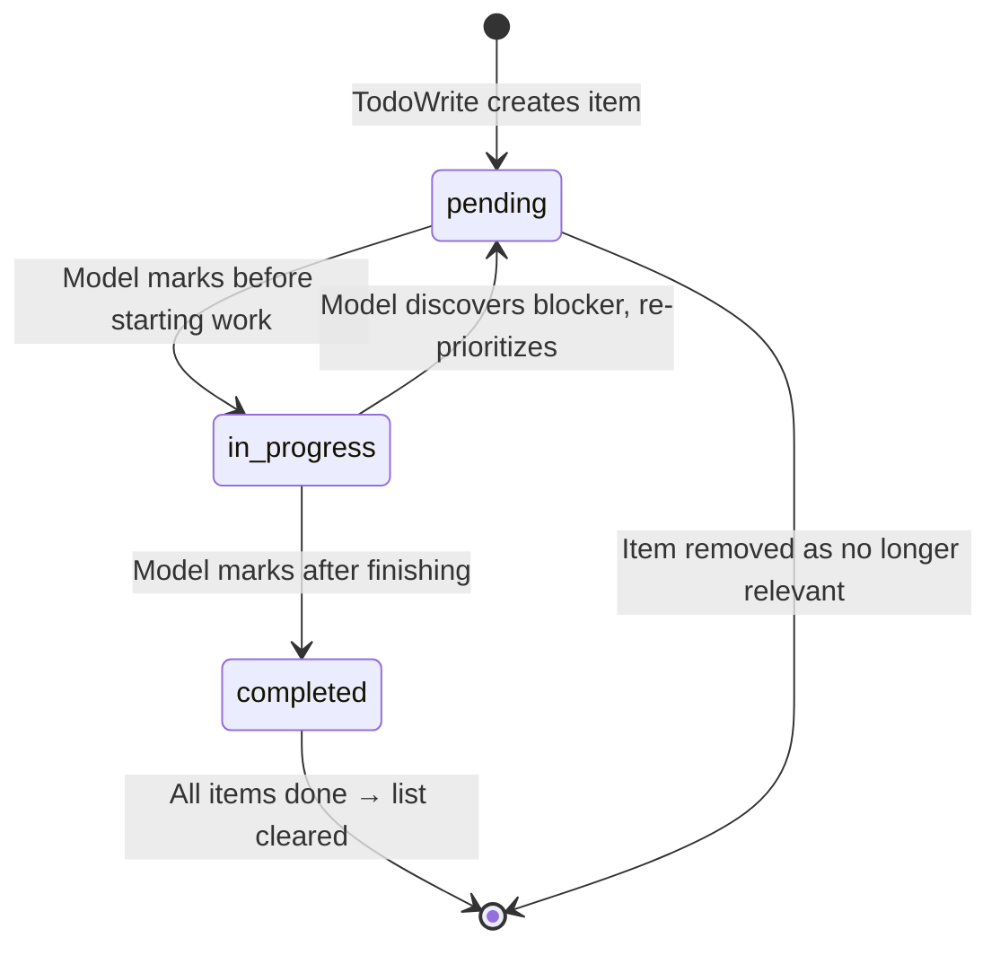
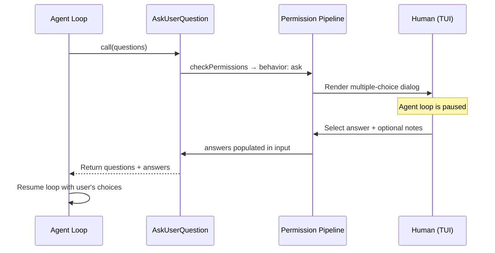

# Meta Tools: Session Structure

## Overview

Five tools form the session-structure layer of the cc harness: TodoWrite, AskUserQuestion, Brief (SendUserMessage), Config, and SendMessage. They are "meta" tools because their primary effect is not on the filesystem or network but on the session itself -- the agent's plan of record, the human's attention, the runtime configuration, or the multi-agent communication channel. Together they implement three of the harness patterns identified in the HER: confidence-based routing (AskUserQuestion), context-rich escalation (Brief), and async handoff (SendMessage). Without these tools the agent loop can still execute, but it cannot coordinate, notify, or adapt.

TodoWrite maintains a per-session task checklist that the model updates as it works, giving the human a progress bar and giving the model itself a scratchpad for self-planning. AskUserQuestion pauses the loop to solicit a structured multiple-choice answer from the human -- the primary HITL interrupt in cc. Brief (aliased as SendUserMessage) is the agent's primary visible output channel; anything the human actually reads comes through it. Config is a get/set facade over a heterogeneous settings registry spanning global config, project settings, and AppState keys. SendMessage is the inter-agent mailbox protocol that enables swarm teammates to coordinate without shared memory.

All five share two structural properties. First, they are all marked `shouldDefer: true`, meaning they are not loaded into the model's tool list at session start but are discovered on demand via ToolSearch. This implements the HER's Pattern 9 (Progressive Tool Expansion): the model does not need to know about TodoWrite or Config until it encounters a situation that requires them. Second, none of them operate on the filesystem directly (except Brief's attachment upload path). Their state lives in AppState, settings files, or mailbox files -- all outside the context window.

## Data structures and contracts

### TodoWrite schemas

The todo item type is defined in `src/utils/todo/types.ts` and consumed by TodoWriteTool via `TodoListSchema`:

```
// src/utils/todo/types.ts:L4-L18 — TodoItem and TodoList schemas
const TodoStatusSchema = lazySchema(() =>
  z.enum(['pending', 'in_progress', 'completed']),
)

export const TodoItemSchema = lazySchema(() =>
  z.object({
    content: z.string().min(1, 'Content cannot be empty'),
    status: TodoStatusSchema(),
    activeForm: z.string().min(1, 'Active form cannot be empty'),
  }),
)
export type TodoItem = z.infer<ReturnType<typeof TodoItemSchema>>

export const TodoListSchema = lazySchema(() => z.array(TodoItemSchema()))
export type TodoList = z.infer<ReturnType<typeof TodoListSchema>>
```

The `TodoItemSchema` enforces two textual forms: `content` (imperative, e.g. "Run tests") and `activeForm` (present continuous, e.g. "Running tests"). The dual-form requirement exists because the UI renders `activeForm` while the item is `in_progress` and `content` otherwise, giving the human a tense-consistent reading experience. The `status` field has exactly three states -- `pending`, `in_progress`, `completed` -- forming the lifecycle that the prompt in `src/tools/TodoWriteTool/prompt.ts:L146-L160` constrains to exactly one `in_progress` item at a time. The `TodoListSchema` wraps the array, and the tool's own output schema echoes both `oldTodos` and `newTodos` so the model can observe what changed.

The prompt in `src/tools/TodoWriteTool/prompt.ts:L3-L181` is one of the longest tool prompts in the codebase (184 lines). It includes positive examples (when to use: multi-step tasks, user provides multiple items) and negative examples (when not to use: single trivial task, informational questions). This prompt-heavy approach is deliberate: because TodoWrite is a deferred tool, the model sees the full prompt only when it discovers the tool via ToolSearch, so the prompt must be self-contained and unambiguous.

### AskUserQuestion schemas

AskUserQuestion carries 1--4 questions, each with 2--4 options. The option schema at `src/tools/AskUserQuestionTool/AskUserQuestionTool.tsx:L14-L18` includes a `label`, a `description`, and an optional `preview` field for side-by-side rendering of ASCII or HTML mockups:

```
// src/tools/AskUserQuestionTool/AskUserQuestionTool.tsx:L14-L18 — Question option schema
const questionOptionSchema = lazySchema(() => z.object({
  label: z.string().describe('The display text for this option that the user will see and select. Should be concise (1-5 words) and clearly describe the choice.'),
  description: z.string().describe('Explanation of what this option means or what will happen if chosen. Useful for providing context about trade-offs or implications.'),
  preview: z.string().optional().describe('Optional preview content rendered when this option is focused. Use for mockups, code snippets, or visual comparisons that help users compare options. See the tool description for the expected content format.')
}));
```

The `description` field directly implements HER section 11.4 (Context-Rich Escalation): when the agent escalates to the human, each option carries an explanation of its implications. A `UNIQUENESS_REFINE` check in `src/tools/AskUserQuestionTool/AskUserQuestionTool.tsx:L32-L54` enforces that question texts and option labels are unique within their scope, preventing ambiguous answer mapping. The output schema returns `answers` as a `Record<string, string>` mapping question text to the selected label (comma-separated for `multiSelect`). An `annotations` field carries per-question metadata including `preview` (the selected option's preview content) and `notes` (free-text the user added), enabling rich feedback loops.

### Brief (SendUserMessage) schemas

The Brief input schema accepts `message` (markdown string), optional `attachments` (file path array), and a `status` enum distinguishing `normal` from `proactive` messages. The output schema carries `sentAt` (ISO timestamp), the resolved `attachments` array (with `file_uuid` for bridge uploads), and the original `message`. The `attachments` field remains optional so that resumed sessions replaying pre-attachment outputs do not crash the UI renderer -- a backward-compatibility concern documented in the code at `src/tools/BriefTool/BriefTool.ts:L41-L42`.

The `ResolvedAttachment` type in `src/tools/BriefTool/attachments.ts:L19-L23` carries `path`, `size`, `isImage`, and an optional `file_uuid`. The `file_uuid` is populated only when the bridge upload succeeds; local renderers fall back to the `path` field. This dual-resolution design means the same tool output works for both local terminal rendering (where `path` is meaningful) and web viewers (where `file_uuid` is resolved server-side).

### Config schemas

Config's input is a `setting` key string plus an optional `value` of `string | boolean | number`. The output schema carries `success`, `operation` (`get` or `set`), and conditionally `previousValue`/`newValue` or `error`. The registry of supported settings is defined in `src/tools/ConfigTool/supportedSettings.ts` as a `Record<string, SettingConfig>` where each `SettingConfig` declares `source` (`global` or `settings`), `type`, `description`, optional `options`, and optional `appStateKey` for immediate UI sync:

```
// src/tools/ConfigTool/supportedSettings.ts:L15-L27 — SettingConfig type definition
type SettingConfig = {
  source: 'global' | 'settings'
  type: 'boolean' | 'string'
  description: string
  path?: string[]
  options?: readonly string[]
  getOptions?: () => string[]
  appStateKey?: SyncableAppStateKey
  validateOnWrite?: (v: unknown) => Promise<{ valid: boolean; error?: string }>
  formatOnRead?: (v: unknown) => unknown
}
```

The `source` field determines storage location: `global` writes to `~/.claude.json` via `saveGlobalConfig`, while `settings` writes to the project's `settings.json` via `updateSettingsForSource`. The `appStateKey` field selects an AppState key for immediate sync, so changing `verbose` or `mainLoopModel` takes effect without a restart. The `validateOnWrite` hook enables per-setting async validation -- the `model` setting uses it to call the model API and verify the ID is valid before accepting it. The `formatOnRead` hook transforms the stored value for display, for instance converting `null` model overrides to the string `"default"`.

### SendMessage schemas

SendMessage accepts a `to` address (teammate name, `*` for broadcast, or a UDS/bridge address), an optional `summary`, and a `message` that is either a plain string or a discriminated-union structured message. The structured message schema at `src/tools/SendMessageTool/SendMessageTool.ts:L46-L65` supports three types:

```
// src/tools/SendMessageTool/SendMessageTool.ts:L46-L65 — Structured message schema
const StructuredMessage = lazySchema(() =>
  z.discriminatedUnion('type', [
    z.object({
      type: z.literal('shutdown_request'),
      reason: z.string().optional(),
    }),
    z.object({
      type: z.literal('shutdown_response'),
      request_id: z.string(),
      approve: semanticBoolean(),
      reason: z.string().optional(),
    }),
    z.object({
      type: z.literal('plan_approval_response'),
      request_id: z.string(),
      approve: semanticBoolean(),
      feedback: z.string().optional(),
    }),
  ]),
)
```

The output is one of four types: `MessageOutput` (direct), `BroadcastOutput` (with `recipients` array), `RequestOutput` (with `request_id` and `target`), or `ResponseOutput` (with optional `request_id`). The discriminated union over output types lets the caller know which protocol path was taken. The `semanticBoolean` schema is a cc-specific Zod coercion that accepts multiple truthy representations, tolerating variation in model-generated structured JSON.

## Control flow

### TodoWrite: self-planning with verification nudge

When the model calls TodoWrite, the `call` method in `src/tools/TodoWriteTool/TodoWriteTool.ts:L65-L103` performs three operations: it snapshots the old todo list, computes the new one, and checks whether a verification nudge is warranted.

```
// src/tools/TodoWriteTool/TodoWriteTool.ts:L65-L103 — TodoWrite call method
async call({ todos }, context) {
  const appState = context.getAppState()
  const todoKey = context.agentId ?? getSessionId()
  const oldTodos = appState.todos[todoKey] ?? []
  const allDone = todos.every(_ => _.status === 'completed')
  const newTodos = allDone ? [] : todos

  let verificationNudgeNeeded = false
  if (
    feature('VERIFICATION_AGENT') &&
    getFeatureValue_CACHED_MAY_BE_STALE('tengu_hive_evidence', false) &&
    !context.agentId &&
    allDone &&
    todos.length >= 3 &&
    !todos.some(t => /verif/i.test(t.content))
  ) {
    verificationNudgeNeeded = true
  }

  context.setAppState(prev => ({
    ...prev,
    todos: {
      ...prev.todos,
      [todoKey]: newTodos,
    },
  }))

  return {
    data: {
      oldTodos,
      newTodos: todos,
      verificationNudgeNeeded,
    },
  }
},
```

The `todoKey` is either the subagent's `agentId` or the main session ID, ensuring each agent in a swarm maintains its own independent checklist. When every item is `completed`, the list is cleared (`newTodos = []`) to reduce clutter. The verification nudge fires when the main-thread agent closes out a 3+ item list without any task mentioning "verif" -- the tool result then appends a reminder to spawn the verification subagent, blocking a PARTIAL self-assessment. The nudge is delivered in `mapToolResultToToolResultBlockParam` at `src/tools/TodoWriteTool/TodoWriteTool.ts:L104-L114`, which appends the nudge text to the base success message. This is architecturally significant: the nudge is injected at the tool-result rendering layer, not in the prompt, making it resistant to prompt-level circumvention.



The prompt's constraint of "exactly ONE task must be in_progress at any time" is not enforced by the schema -- `TodoListSchema` accepts any combination of statuses. The constraint lives entirely in the prompt, relying on model adherence. This is a deliberate trade-off: schema enforcement would require a custom Zod refine that rejects lists with zero or multiple `in_progress` items, but the model sometimes needs a transient state with two in-progress items while transitioning between tasks.

### AskUserQuestion: the HITL interrupt

AskUserQuestion is the tool that actually pauses the agent loop. Its `checkPermissions` method in `src/tools/AskUserQuestionTool/AskUserQuestionTool.tsx:L182-L188` returns `behavior: 'ask'`, which causes the permission pipeline to render a multiple-choice dialog and wait for the human to respond. The tool's `requiresUserInteraction()` method returns `true`, signaling that this tool cannot be auto-approved even in permissive modes.

```
// src/tools/AskUserQuestionTool/AskUserQuestionTool.tsx:L182-L188 — AskUserQuestion permission gate
async checkPermissions(input) {
  return {
    behavior: 'ask' as const,
    message: 'Answer questions?',
    updatedInput: input,
  }
},
```

The `isEnabled` gate at `src/tools/AskUserQuestionTool/AskUserQuestionTool.tsx:L135-L144` disables the tool when channels (Telegram/Discord) are active, because the human is not watching the TUI and the dialog would hang indefinitely. When the human answers, `call` simply returns the questions and answers; the permission component has already populated the `answers` map before `call` runs. This separation of concerns -- permission gate collects the answer, `call` echoes it -- keeps the tool's execution path synchronous and deterministic.

The HTML preview validation in `src/tools/AskUserQuestionTool/AskUserQuestionTool.tsx:L250-L265` is a lightweight check, not a full parser. It rejects full documents (`<html>`, `<body>`, `<!DOCTYPE>`), executable tags (`<script>`, `<style>`), and requires at least one HTML tag. This validation runs only when `previewFormat` is set to `'html'`, and it fires during `validateInput` before the tool reaches the permission gate. The rationale for rejecting `<style>` tags is that SDK consumers typically inject the preview via `innerHTML`, and a `<style>` tag could restyle the host page. Inline event handlers (`onclick` etc.) are still possible; consumers are expected to sanitize.



### Brief: the primary output channel

Brief's `call` method in `src/tools/BriefTool/BriefTool.ts:L186-L203` logs analytics, resolves attachments, and returns the message with a timestamp. The `isBriefEnabled` gate in `src/tools/BriefTool/BriefTool.ts:L126-L134` is a multi-layer activation check: it requires a build-time feature flag (`KAIROS` or `KAIROS_BRIEF`), a runtime GrowthBook kill-switch, and explicit user opt-in (`--brief`, `defaultView: 'chat'`, or assistant mode). This three-layer gate ensures the tool ships in external builds without activating for users who have not opted in.

```
// src/tools/BriefTool/BriefTool.ts:L126-L134 — isBriefEnabled activation gate
export function isBriefEnabled(): boolean {
  return feature('KAIROS') || feature('KAIROS_BRIEF')
    ? (getKairosActive() || getUserMsgOptIn()) && isBriefEntitled()
    : false
}
```

The top-level `feature()` guard is load-bearing for dead-code elimination. Bun can constant-fold the ternary to `false` in external builds that lack the `KAIROS` feature flag, then tree-shake the entire BriefTool object. Composing `isBriefEntitled()` alone (which has its own `feature()` guard) would be semantically equivalent but defeats constant-folding across the function boundary because the compiler cannot prove the called function's branch is always false.

The prompt in `src/tools/BriefTool/prompt.ts:L6-L22` instructs the model that Brief is the only channel the human actually reads. Plain text outside Brief is "visible if the user expands the detail view, but most won't." The prompt establishes a protocol: "ack first in one line ('On it -- checking the test output'), then work, then send the result." The `status` field routes downstream: `proactive` messages surface as push notifications when Remote Control is active, while `normal` messages appear inline in the chat view. The `BRIEF_PROACTIVE_SECTION` at `src/tools/BriefTool/prompt.ts:L12-L22` adds further guidance: "every time the user says something, the reply they actually read comes through SendUserMessage. Even for 'hi'. Even for 'thanks'."

Attachment resolution in `src/tools/BriefTool/attachments.ts:L63-L110` stat-checks each file, then uploads via a dynamic `import('./upload.js')` guarded by `feature('BRIDGE_MODE')`. The upload path is fully tree-shaken from non-bridge builds. The `uploadBriefAttachment` function in `src/tools/BriefTool/upload.ts:L92-L174` performs a multipart POST to `/api/oauth/file_upload` with a 30 MB size limit, a 30-second timeout, and graceful degradation: any failure (no token, bridge off, network error, 4xx) logs debug and returns `undefined`. The attachment still carries `{path, size, isImage}`, so local-terminal and same-machine-desktop rendering are unaffected.

### Config: get/set over a heterogeneous registry

Config's `call` method in `src/tools/ConfigTool/ConfigTool.ts:L111-L411` implements a get-or-set pattern: if `value` is `undefined`, it reads; otherwise it validates, coerces, writes, and syncs. The GET path at `src/tools/ConfigTool/ConfigTool.ts:L136-L144` reads from the appropriate store (global config or project settings) and applies `formatOnRead` if present. The SET path at `src/tools/ConfigTool/ConfigTool.ts:L146-L411` performs a multi-step pipeline: boolean coercion, option validation, async `validateOnWrite`, write to storage, and AppState sync.

Boolean coercion at `src/tools/ConfigTool/ConfigTool.ts:L185-L201` accepts string inputs (`"true"`/`"false"`) for convenience, because the model sometimes emits boolean values as strings. The `validateOnWrite` hook is used by the `model` setting to perform an API validation call before accepting a model ID. After a successful write, if the `SettingConfig` declares an `appStateKey`, the new value is immediately synced to AppState via `context.setAppState`, so the UI reflects the change without requiring a restart.

The `remoteControlAtStartup` setting at `src/tools/ConfigTool/ConfigTool.ts:L148-L180` has special handling: setting it to `"default"` deletes the config key entirely, allowing it to fall back to the platform-aware default determined by the bridge feature gate. After deletion, it syncs the resolved value to AppState so `useReplBridge` reacts immediately.

The permission check in `src/tools/ConfigTool/ConfigTool.ts:L98-L107` auto-allows reads but requires approval for writes, displaying the setting name and new value in the prompt. This asymmetric permission model means the model can inspect configuration freely but cannot change it without human consent.

### SendMessage: inter-agent mailbox protocol

SendMessage routes through several handlers depending on the message type and recipient. Plain-text messages to named teammates go through `handleMessage` in `src/tools/SendMessageTool/SendMessageTool.ts:L149-L189`, which writes to the recipient's mailbox file via `writeToMailbox`. Broadcast messages iterate over all team members (skipping self) and write to each. Structured messages (`shutdown_request`, `shutdown_response`, `plan_approval_response`) go through dedicated handlers that enforce protocol constraints -- for instance, `handleShutdownApproval` at `src/tools/SendMessageTool/SendMessageTool.ts:L305-L399` sends a confirmation to the team lead and then either aborts the in-process task or calls `gracefulShutdown`.

The `call` method in `src/tools/SendMessageTool/SendMessageTool.ts:L741-L913` first checks for UDS/bridge cross-session routing, then attempts in-process subagent resolution by name. If the target agent is stopped, it auto-resumes via `resumeAgentBackground`. This auto-resume behavior means SendMessage is also an agent lifecycle tool: sending a message to a stopped teammate implicitly restarts it.

```
// src/tools/SendMessageTool/SendMessageTool.ts:L802-L825 — In-process delivery with auto-resume
if (typeof input.message === 'string' && input.to !== '*') {
  const appState = context.getAppState()
  const registered = appState.agentNameRegistry.get(input.to)
  const agentId = registered ?? toAgentId(input.to)
  if (agentId) {
    const task = appState.tasks[agentId]
    if (isLocalAgentTask(task) && !isMainSessionTask(task)) {
      if (task.status === 'running') {
        queuePendingMessage(
          agentId,
          input.message,
          context.setAppStateForTasks ?? context.setAppState,
        )
        return {
          data: {
            success: true,
            message: `Message queued for delivery to ${input.to} at its next tool round.`,
          },
        }
      }
      // task exists but stopped — auto-resume
      // ...
    }
  }
}
```

For running in-process agents, `queuePendingMessage` enqueues the text for delivery at the agent's next tool round. The `validateInput` method in `src/tools/SendMessageTool/SendMessageTool.ts:L604-L718` enforces several constraints: plain-text messages require a `summary` (shown as a preview in the UI), cross-session bridge messages require explicit user consent (a `safetyCheck` decision reason that is `classifierApprovable: false` at `src/tools/SendMessageTool/SendMessageTool.ts:L586-L601`), and structured messages cannot be broadcast or sent cross-session. The `safetyCheck` decision reason is significant: it bypasses both `bypassPermissions` mode and the auto-classifier, ensuring that cross-machine prompt injection requires explicit human consent regardless of the permission mode setting.

The `backfillObservableInput` method at `src/tools/SendMessageTool/SendMessageTool.ts:L543-L569` is called before `checkPermissions` to populate observable fields (`type`, `recipient`, `content`) from the raw input. This is needed because the model's input format is compact (`{to, message}`) but the permission pipeline and analytics system expect the expanded form (`{type, recipient, content}`). The backfill happens before `toAutoClassifierInput` and `checkPermissions`, so the classifier and permission logic operate on the expanded form.

## Edge cases and failure modes

**TodoWrite all-done clearing.** When every item reaches `completed`, the entire list is replaced with an empty array (`src/tools/TodoWriteTool/TodoWriteTool.ts:L69-L70`). This means the human never sees a "100% complete" checklist -- it vanishes the moment the last item closes. The design rationale is clutter reduction, but it can confuse users who expect a visible record of accomplished work. The `mapToolResultToToolResultBlockParam` method returns a generic success message regardless of whether the list was cleared, so the model does not observe the clearing directly -- it sees the `newTodos` in the output data, but the tool result text does not mention that the list was emptied.

**TodoWrite V2 migration.** The `isEnabled` gate checks `!isTodoV2Enabled()`, meaning TodoWrite is disabled when the newer task-based system (see Chapter 16 on the task lifecycle) is active. The two systems share the same AppState `todos` key but have different tool interfaces. A session that migrates from V1 to V2 mid-conversation could have stale todo items in AppState that the V2 tools cannot manage.

**AskUserQuestion channel disable.** When `--channels` is active, AskUserQuestion's `isEnabled` returns `false` (`src/tools/AskUserQuestionTool/AskUserQuestionTool.tsx:L141-L144`). The multiple-choice dialog would hang with nobody at the keyboard on Telegram/Discord. Channel permission relay already skips `requiresUserInteraction()` tools, so there is no alternate approval path. This means an agent running in channel mode cannot ask structured questions at all -- it must fall back to Brief or plain text.

**AskUserQuestion annotation loss.** The `annotations` field is optional in the output schema. If the human answers via a permission flow that does not support annotations (e.g., the SDK programmatic path), the annotations are silently dropped. The model receives the answers but loses the context about which preview the user selected or what notes they added.

**Brief entitlement vs. activation.** `isBriefEntitled` and `isBriefEnabled` are two separate gates. A user can be entitled (enrolled in the GrowthBook experiment) but not activated (has not set `--brief` or `defaultView: 'chat'`). The reverse is impossible: activation without entitlement always returns `false`. This two-layer design prevents the tool from appearing active for users who are merely enrolled but have not opted in. The GrowthBook kill-switch is re-checked on a 5-minute refresh cycle (`KAIROS_BRIEF_REFRESH_MS` at `src/tools/BriefTool/BriefTool.ts:L67`), so flipping the feature flag off mid-session disables the tool on the next refresh.

**Brief attachment TOCTOU.** The `validateAttachmentPaths` function stat-checks files during input validation, but `resolveAttachments` stats them again during execution (`src/tools/BriefTool/attachments.ts:L71-L82`). A file could move or be deleted between the two calls. The code documents this as an acceptable TOCTOU trade-off: the error propagates to the model, which can handle it by retrying or informing the user.

**Config boolean coercion.** The `call` method coerces string `"true"`/`"false"` to boolean values (`src/tools/ConfigTool/ConfigTool.ts:L185-L201`). However, passing a number like `1` or `0` for a boolean setting fails with an error, because the code checks `typeof finalValue !== 'boolean'` after coercion. This is intentional strictness to avoid ambiguous inputs.

**Config voice pre-flight.** The `voiceEnabled` setting has a multi-step pre-flight check at `src/tools/ConfigTool/ConfigTool.ts:L232-L308` that verifies recording availability, voice stream availability, voice dependencies, and microphone permission before allowing the setting to be turned on. Any failure returns a specific error message guiding the user to fix the issue. This is the most complex validation path in ConfigTool, spanning three dynamic imports and four async checks.

**SendMessage auto-resume side effects.** Sending a message to a stopped agent implicitly resumes it in the background (`src/tools/SendMessageTool/SendMessageTool.ts:L823-L843`). The caller receives a success message but the resumed agent runs asynchronously. If the agent crashes again, the original sender is not directly notified -- the failure surfaces through the task system or a subsequent status check. This can create a misleading user experience where SendMessage reports success but the recipient never processes the message.

**SendMessage bridge re-check.** The `call` method re-checks `getReplBridgeHandle()` and `isReplBridgeActive()` even though `validateInput` already checked them. The gap between validation and execution can be minutes if the user takes time to approve the permission prompt, and the bridge could have disconnected during that window. Without the re-check, the message would be sent with `from="unknown"`, leaking incomplete metadata to the remote session.

**SendMessage broadcast with no teammates.** When the sender is the only team member, `handleBroadcast` at `src/tools/SendMessageTool/SendMessageTool.ts:L229-L236` returns success with an empty recipients list rather than an error. This is a deliberate choice: the broadcast succeeded (there was nobody to send to), but the caller should check the `recipients` array to understand why there was no effect.

## Where cc diverges from the published pattern

**HER section 11.3 (Async Approval) prescribes that the agent should never fully block on human input.** cc's AskUserQuestion violates this: the agent loop pauses until the human answers. The reason is architectural -- cc runs as a single-loop CLI process, not a multi-queue event system. There is no background task queue to drain while waiting. The HER acknowledges this trade-off: "Critical for multi-hour tasks: the agent should never fully block on human input. Always have a queue of independent tasks to work on while waiting." In cc, the closest approximation is the swarm pattern (Chapter 20 on multi-agent orchestration), where a team lead can continue dispatching work to teammates while waiting for human input on one channel.

**HER section 11.2 (Tiered Escalation) defines four tiers from automated checks to human expert review.** cc implements only the top tier: when the agent needs a human decision, it uses AskUserQuestion or Brief with `status: 'proactive'`. There is no Tier 1 (deterministic automated checks) or Tier 2 (agent self-correction) in the meta-tool layer. Those tiers exist elsewhere in cc -- hooks implement Tier 1 (pre- and post-tool-use checks), and the model's own retry loop implements Tier 2. The AskUserQuestion tool skips directly to Tier 3/4, trusting the caller to have already attempted automated resolution.

**HER section 11.4 (Context-Rich Escalation) states the agent must provide what it tried, why it failed, and what options it sees.** cc's AskUserQuestion partially implements this through the `description` field on each option, but it does not enforce that the model provide a structured explanation of its reasoning. The prompt encourages but does not mandate the pattern. The Brief tool's `status: 'proactive'` field and the prompt's instruction to "ack first, then work, then result" come closer to the HER's intent, but they are prompt-level guidance rather than schema enforcement.

**HER section 11.5 (Handoff Protocols) defines full context transfer, incremental review, and checkpoint review.** cc's SendMessage implements a form of full context transfer through the mailbox system, but it does not enforce incremental or checkpoint review. The `summary` field on SendMessage is a 5--10 word preview, not a structured handoff document. The verification nudge in TodoWrite is a checkpoint mechanism of sorts (it fires when the model closes out a significant body of work), but it checks only for the presence of a verification step, not for a structured review.

**HER section 5 (Progressive Context Compaction) identifies four compaction layers.** TodoWrite sits outside this hierarchy but interacts with it: when compaction removes older messages, the todo list in AppState survives because it is not part of the message history. The model can reconstruct context from the todo list after compaction, making it a de facto compaction-resistant state store. This is an emergent property rather than a design goal -- the todo list lives in AppState because it is UI state, not because it was designed to survive compaction.

**TodoWrite's verification nudge has no HER precedent.** It is a cc-specific pattern: when the model closes a 3+ item list without any verification step, the tool result appends a reminder to spawn the verification agent. This is a structural nudge embedded in tool output rather than a prompt instruction, making it resistant to prompt-level circumvention. The nudge fires at the exact loop-exit moment where skips happen -- when the last task closes and the loop would otherwise exit without verification.

## Developer takeaways for building a long-running agent

The five meta-tools illustrate a design principle: separate the agent's output channel from its working memory from its configuration from its inter-agent communication. Brief is the only channel the human reads; TodoWrite is the only state that survives compaction; Config is the only tool that modifies runtime behavior without restarting; SendMessage is the only tool that crosses agent boundaries. Conflating any two of these roles creates coupling that makes the system fragile -- a todo item that doubles as a notification, a config change that requires a restart, or a message protocol that assumes shared memory will all break under the concurrency and lifetime constraints of a real agent session. The second lesson is that permission gates double as data-collection points: AskUserQuestion's `checkPermissions` does not merely authorize, it collects the human's answer and populates the input before `call` runs. This pattern -- permission pipeline as input enrichment -- avoids the race condition where the model's call arguments and the human's response are separate events. The third lesson is that tool results can carry behavioral nudges: TodoWrite's verification reminder is injected into `mapToolResultToToolResultBlockParam`, not into the prompt, making it structurally guaranteed to fire at the right moment regardless of prompt adherence. The fourth lesson is that feature gating requires multiple layers: Brief's three-layer gate (build-time flag, runtime kill-switch, user opt-in) prevents the tool from activating accidentally while still allowing it to ship in external builds. Any single layer would be insufficient -- a build-time flag alone would not allow per-user rollout, a runtime flag alone would not tree-shake the dependency, and opt-in alone would not protect against enrollment-without-consent.
