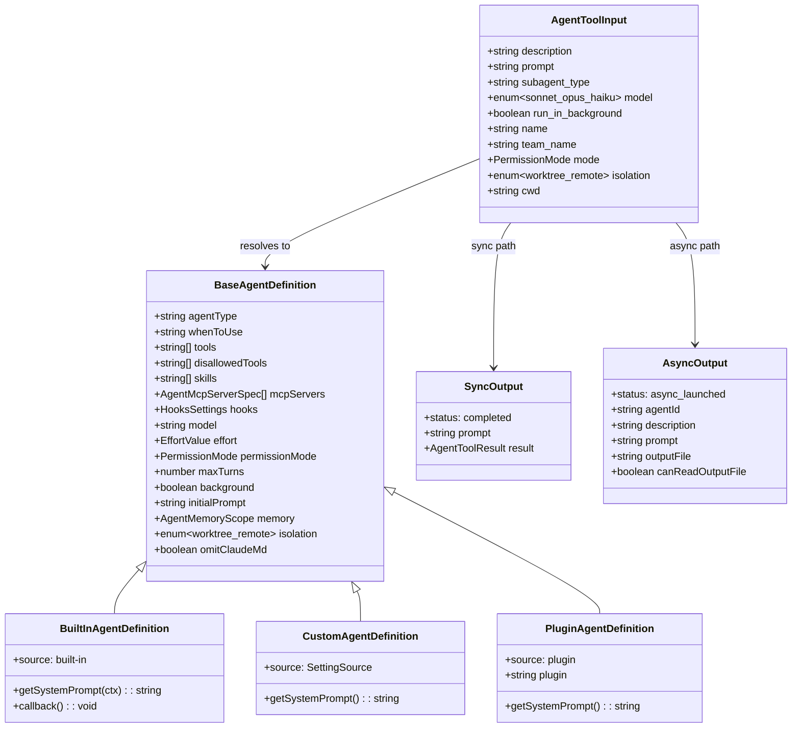
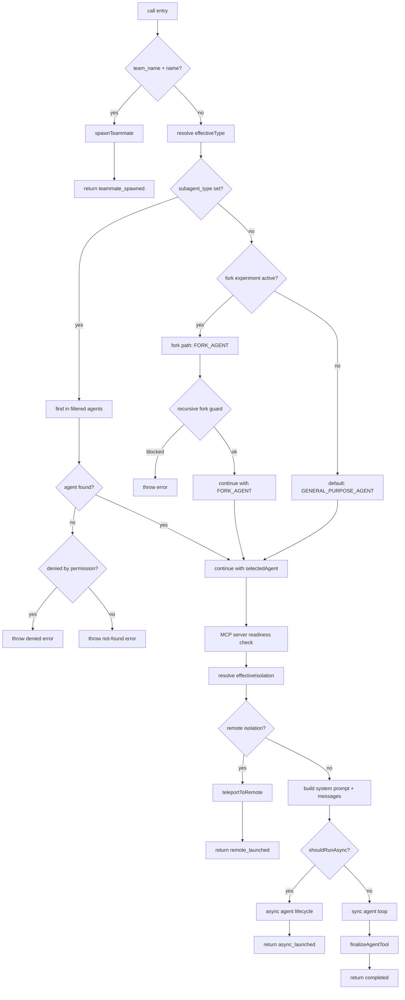

# The Agent Tool: Entry, Inputs, and Lifecycle

## Overview

The Agent tool is the primary mechanism by which a parent session delegates work to a subagent. Every time the model emits an `Agent(…)` tool call, the harness must validate the inputs, resolve which agent definition to use, decide whether the spawn is synchronous or asynchronous, provision an isolated context, and return a structured result. This chapter walks through that surface: the Zod input schema, the validation and dispatch logic that selects between the normal, fork, teammate, and remote paths, and the output contracts that make the result legible to the calling agent.

The Agent tool is registered via `buildTool()` in `src/tools/AgentTool/AgentTool.tsx` with name `AGENT_TOOL_NAME` and an alias for backward compatibility (`LEGACY_AGENT_TOOL_NAME`). Its `call()` method is the single entry point for all subagent invocations. The tool is classified as read-only at the top level (`isReadOnly() { return true }`) because it delegates permission checks to the underlying tools the subagent uses, rather than performing its own writes `src/tools/AgentTool/AgentTool.tsx:L1264-L1265`. The tool also declares `isConcurrencySafe() { return true }`, meaning multiple Agent tool calls can be dispatched in parallel within a single model turn `src/tools/AgentTool/AgentTool.tsx:L1273-L1275`.

At 1397 lines, the `AgentTool.tsx` file is the largest tool implementation in the codebase. Its complexity stems not from any single algorithm but from the sheer number of dispatch paths and the overlapping feature gates that conditionally enable or disable them. The tool must handle four distinct execution modes (normal subagent, fork subagent, teammate, and remote), two isolation strategies (worktree and remote), two timing modes (sync and async), and a mid-run backgrounding transition that converts a sync agent into an async one. Understanding the schema first makes the control flow tractable, because every branch in `call()` is guarded by a field in the input schema or a feature flag that controls whether that field is visible.

## Data structures and contracts

### Input schema

The input schema is assembled in three layers: a base schema, a multi-agent extension, and a final gating layer that strips fields based on feature flags. This design allows the tool to present a smaller surface to the model when certain capabilities are disabled, without sacrificing type safety in the `call()` body.

```typescript
// src/tools/AgentTool/AgentTool.tsx:L82-L88 — Base input schema
const baseInputSchema = lazySchema(() => z.object({
  description: z.string().describe('A short (3-5 word) description of the task'),
  prompt: z.string().describe('The task for the agent to perform'),
  subagent_type: z.string().optional().describe('The type of specialized agent to use for this task'),
  model: z.enum(['sonnet', 'opus', 'haiku']).optional().describe("Optional model override for this agent. Takes precedence over the agent definition's model frontmatter. If omitted, uses the agent definition's model, or inherits from the parent."),
  run_in_background: z.boolean().optional().describe('Set to true to run this agent in the background. You will be notified when it completes.')
}));
```

The `baseInputSchema` defines the five core parameters. `description` and `prompt` are required. `subagent_type` selects the agent definition; when omitted and the fork experiment is active, the tool routes to the implicit fork path. `model` is an enum of model aliases that takes precedence over the agent definition's own model frontmatter. `run_in_background` controls whether the subagent runs synchronously (blocking the parent turn) or asynchronously (returning immediately with a task ID).

```typescript
// src/tools/AgentTool/AgentTool.tsx:L91-L102 — Full schema with multi-agent and isolation
const fullInputSchema = lazySchema(() => {
  const multiAgentInputSchema = z.object({
    name: z.string().optional().describe('Name for the spawned agent. Makes it addressable via SendMessage({to: name}) while running.'),
    team_name: z.string().optional().describe('Team name for spawning. Uses current team context if omitted.'),
    mode: permissionModeSchema().optional().describe('Permission mode for spawned teammate (e.g., "plan" to require plan approval).')
  });
  return baseInputSchema().merge(multiAgentInputSchema).extend({
    isolation: ("external" === 'ant' ? z.enum(['worktree', 'remote']) : z.enum(['worktree'])).optional().describe("external" === 'ant' ? 'Isolation mode...' : 'Isolation mode. "worktree" creates a temporary git worktree so the agent works on an isolated copy of the repo.'),
    cwd: z.string().optional().describe('Absolute path to run the agent in. Overrides the working directory for all filesystem and shell operations within this agent. Mutually exclusive with isolation: "worktree".')
  });
});
```

The `fullInputSchema` extends the base with three multi-agent parameters (`name`, `team_name`, `mode`), an `isolation` enum for worktree or remote execution, and a `cwd` override. The `isolation` field is itself gated: internal builds see both `'worktree'` and `'remote'`, while external builds see only `'worktree'`. The `cwd` parameter is mutually exclusive with `isolation: "worktree"` because the worktree already provides an isolated working directory.

The final exported schema applies `.omit()` to strip fields when their backing features are off, so the model never sees parameters it cannot use:

```typescript
// src/tools/AgentTool/AgentTool.tsx:L110-L125 — Gating layer
export const inputSchema = lazySchema(() => {
  const schema = feature('KAIROS') ? fullInputSchema() : fullInputSchema().omit({
    cwd: true
  });
  return isBackgroundTasksDisabled || isForkSubagentEnabled() ? schema.omit({
    run_in_background: true
  }) : schema;
});
```

When the fork experiment is active, `run_in_background` is omitted because all spawns are forced async for a unified `<task-notification>` interaction model. When the KAIROS feature is off, `cwd` is hidden from the model. The `lazySchema` wrapper defers evaluation so feature flags are read at invocation time, not at module load.

Although the schema may omit optional fields, the `AgentToolInput` type always includes all fields. This widening prevents destructuring in `call()` from producing `unknown` types when a field was stripped by `.omit()`:

```typescript
// src/tools/AgentTool/AgentTool.tsx:L132-L138 — Explicit widened type
type AgentToolInput = z.infer<ReturnType<typeof baseInputSchema>> & {
  name?: string;
  team_name?: string;
  mode?: z.infer<ReturnType<typeof permissionModeSchema>>;
  isolation?: 'worktree' | 'remote';
  cwd?: string;
};
```

### AgentDefinition

Every invocation resolves to an `AgentDefinition`, a union of three variants: `BuiltInAgentDefinition`, `CustomAgentDefinition`, and `PluginAgentDefinition`. All three extend `BaseAgentDefinition`, which carries the fields that shape subagent behavior: `tools`, `disallowedTools`, `skills`, `mcpServers`, `hooks`, `model`, `effort`, `permissionMode`, `maxTurns`, `background`, `initialPrompt`, `memory`, `isolation`, and `omitClaudeMd` `src/tools/AgentTool/loadAgentsDir.ts:L106-L133`. The variant discriminator is `source`: built-in agents come from the codebase, custom agents from user or project settings, and plugin agents from installed plugins.

The key difference between the variants is how they produce their system prompt. `BuiltInAgentDefinition` receives a `toolUseContext` parameter in its `getSystemPrompt` call, enabling it to build context-aware prompts that reference the tool pool or MCP configuration `src/tools/AgentTool/loadAgentsDir.ts:L136-L143`. `CustomAgentDefinition` and `PluginAgentDefinition` use a zero-argument `getSystemPrompt()` because their prompts are stored verbatim from the frontmatter at load time `src/tools/AgentTool/loadAgentsDir.ts:L146-L159`. Built-in agents also carry an optional `callback()` function that fires after successful completion, used for one-shot agents like the general-purpose agent that need to perform post-completion bookkeeping.

Several `BaseAgentDefinition` fields deserve explanation because they interact with the input schema in non-obvious ways. The `background` field on the agent definition acts as an implicit `run_in_background: true`, forcing all spawns of that agent type to run asynchronously `src/tools/AgentTool/AgentTool.tsx:L361`. The `isolation` field on the definition provides a default isolation mode that the explicit `isolation` input parameter overrides: `const effectiveIsolation = isolation ?? selectedAgent.isolation` at `src/tools/AgentTool/AgentTool.tsx:L431`. The `requiredMcpServers` field lists MCP server name patterns that must have at least one connected and authenticated server with tools available; the agent is not selectable until those requirements are met `src/tools/AgentTool/AgentTool.tsx:L367-L409`.

### Output schema

The output is a discriminated union on `status`. Synchronous agents return `status: 'completed'` with the full `AgentToolResult` payload (content text blocks, token counts, duration, tool-use counts). Asynchronous agents return `status: 'async_launched'` with `agentId`, `description`, `prompt`, and `outputFile` path for polling. Two additional statuses exist outside the exported schema for dead code elimination: `teammate_spawned` (multi-agent) and `remote_launched` (CCR delegation).

```typescript
// src/tools/AgentTool/AgentTool.tsx:L141-L155 — Output schema
export const outputSchema = lazySchema(() => {
  const syncOutputSchema = agentToolResultSchema().extend({
    status: z.literal('completed'),
    prompt: z.string()
  });
  const asyncOutputSchema = z.object({
    status: z.literal('async_launched'),
    agentId: z.string().describe('The ID of the async agent'),
    description: z.string().describe('The description of the task'),
    prompt: z.string().describe('The prompt for the agent'),
    outputFile: z.string().describe('Path to the output file for checking agent progress'),
    canReadOutputFile: z.boolean().optional().describe('Whether the calling agent has Read/Bash tools to check progress')
  });
  return z.union([syncOutputSchema, asyncOutputSchema]);
});
```

The `agentToolResultSchema` itself carries `agentId`, `agentType`, `content` (text blocks), `totalToolUseCount`, `totalDurationMs`, `totalTokens`, and a full `usage` object with cache and service-tier breakdowns `src/tools/AgentTool/agentToolUtils.ts:L227-L260`.



## Control flow

### call() entry and early validation

The `call()` method begins by destructuring the `AgentToolInput` and capturing the start time. It then checks two early-exit conditions before any agent resolution happens.

First, if `team_name` is provided but the agent swarms feature is not enabled, the call throws immediately `src/tools/AgentTool/AgentTool.tsx:L262-L264`. Second, if the caller is already a teammate (in-process or tmux) and attempts to spawn another teammate via `name` + `team_name`, the call rejects to prevent nested team rosters `src/tools/AgentTool/AgentTool.tsx:L272-L274`. In-process teammates are additionally blocked from spawning background agents because their lifecycle is tied to the leader's process `src/tools/AgentTool/AgentTool.tsx:L278-L280`.

### Teammate spawn path

When both `team_name` and `name` are set, the call routes to `spawnTeammate()`, which provisions a tmux pane or split-pane for the new agent and returns a `TeammateSpawnedOutput`. This path exits early with `status: 'teammate_spawned'`, bypassing all subsequent logic `src/tools/AgentTool/AgentTool.tsx:L284-L316`. The `team_name` is resolved by `resolveTeamName()`, which checks the explicit parameter first and falls back to `appState.teamContext?.teamName` if omitted, but returns `undefined` entirely if agent swarms are not enabled `src/tools/AgentTool/AgentTool.tsx:L1388-L1397`. The `spawnMode` parameter is mapped to `plan_mode_required`: when the caller sets `mode: 'plan'`, the spawned teammate is required to get plan approval before making changes `src/tools/AgentTool/AgentTool.tsx:L296`.

### Agent resolution: normal vs. fork

If the teammate path is not taken, the tool resolves the effective agent type. When `subagent_type` is provided, it selects from the filtered agent list. When `subagent_type` is omitted and the fork experiment is active, the tool enters the fork path with `effectiveType = undefined` and selects the synthetic `FORK_AGENT` definition `src/tools/AgentTool/AgentTool.tsx:L322-L323`. When the fork experiment is off and `subagent_type` is omitted, the tool defaults to `GENERAL_PURPOSE_AGENT`.

The fork path includes a recursive guard: fork children keep the Agent tool in their pool for cache-identical tool definitions, so any attempt to spawn a fork from within a fork is rejected at call time. The guard checks `querySource` on `toolUseContext.options` (compaction-resistant) and falls back to scanning messages for the fork boilerplate tag `src/tools/AgentTool/AgentTool.tsx:L332-L334`. The `FORK_AGENT` definition itself is synthetic: it declares `tools: ['*']` (all tools), `permissionMode: 'bubble'` (permission prompts surface to the parent terminal), and `model: 'inherit'` (keeps the parent's model for context length parity). Its `getSystemPrompt` method returns an empty string because the fork path passes the parent's already-rendered system prompt bytes via `toolUseContext.renderedSystemPrompt` rather than reconstructing it `src/tools/AgentTool/forkSubagent.ts:L60-L71`.

For the normal path, the tool filters agents by permission rules using `filterDeniedAgents()`. If the requested type is not found among allowed agents, the tool distinguishes between "agent does not exist" and "agent exists but is denied by a permission rule" and throws an appropriate error `src/tools/AgentTool/AgentTool.tsx:L346-L354`. The tool also respects `allowedAgentTypes` on the agent definitions context, which is set when the model uses the `Agent(AgentName)` syntax to restrict the tool invocation to specific agent types `src/tools/AgentTool/AgentTool.tsx:L339-L344`.



### MCP server readiness

Before dispatch, the tool checks whether the selected agent requires specific MCP servers. If required servers are still in a `pending` connection state, the tool polls at 500ms intervals for up to 30 seconds. If any required server fails during the wait, the check exits early because the invocation will fail regardless `src/tools/AgentTool/AgentTool.tsx:L371-L392`. After the wait, the tool verifies that connected servers actually have tools available (a server that is connected but not authenticated will have no tools) and throws a descriptive error if any required server is missing `src/tools/AgentTool/AgentTool.tsx:L406-L409`. The error message includes both the list of missing server patterns and the list of servers that do have tools, so the user can diagnose whether the issue is a missing configuration or an authentication failure.

After the MCP check, the tool resolves the agent model via `getAgentModel()`, which considers the agent definition's model, the main loop model, the explicit `model` parameter from the input, and the permission mode. The resolved model is logged along with the agent type, source, color, and fork status in a `tengu_agent_tool_selected` analytics event `src/tools/AgentTool/AgentTool.tsx:L418-L428`.

### Isolation: worktree and remote

The `effectiveIsolation` is resolved from the explicit `isolation` parameter or the agent definition's `isolation` field. When set to `'worktree'`, the tool calls `createAgentWorktree()` with a slug derived from the agent ID, producing an isolated git working directory `src/tools/AgentTool/AgentTool.tsx:L590-L593`. The worktree slug is `agent-<first8charsOfAgentId>`, which is short enough for filesystem paths but unique enough to avoid collisions. When set to `'remote'` (gated to internal builds), the tool delegates to `teleportToRemote()` which creates a CCR session and returns a `RemoteLaunchedOutput` `src/tools/AgentTool/AgentTool.tsx:L435-L481`. The remote path first checks eligibility via `checkRemoteAgentEligibility()`, which validates preconditions like CCR availability and authentication; if any precondition fails, the tool throws an error with formatted descriptions of each failing precondition `src/tools/AgentTool/AgentTool.tsx:L436-L439`.

For fork children running in worktrees, the tool injects a notice telling the child to translate paths from the inherited context and re-read potentially stale files before editing `src/tools/AgentTool/AgentTool.tsx:L598-L602`. The notice is appended as a user message after the fork directive so it appears as the most recent guidance the child sees. This is critical because the fork child inherits the parent's full conversation, which may contain file paths referencing the parent's working directory; those paths must be translated to the worktree root.

The `cwd` parameter provides a lighter-weight alternative to worktree isolation. When set, it wraps the entire agent execution in `runWithCwdOverride()`, which overrides `getCwd()` for the duration of the call `src/tools/AgentTool/AgentTool.tsx:L640-L641`. Unlike worktree isolation, `cwd` does not create an independent git branch or protect against concurrent file modifications by other agents; it only redirects the working directory for filesystem and shell operations.

### Async vs. sync dispatch

The `shouldRunAsync` flag is computed from multiple conditions: explicit `run_in_background`, the agent definition's `background` field, coordinator mode, the fork experiment gate, the KAIROS assistant force-async flag, and proactive mode. Background tasks must not be globally disabled for any of these to take effect `src/tools/AgentTool/AgentTool.tsx:L567`. The `forceAsync` flag from the fork experiment is worth examining: when enabled, ALL agent spawns are forced async for a unified `<task-notification>` interaction model, not fork spawns alone. The rationale is that mixing sync and async agent interactions creates a split-brain UX where the model must reason about two different notification mechanisms. Forcing everything async unifies the model's interaction pattern at the cost of slightly higher latency for short-lived agents.

Async agents receive a new unlinked `AbortController` so they survive when the user cancels the main thread. They are registered via `registerAsyncAgent()` and run through `runAsyncAgentLifecycle()`, which handles the full background lifecycle: iteration, completion, failure, and notification `src/tools/AgentTool/AgentTool.tsx:L686-L752`. If the agent was spawned with a `name`, the tool registers it in the `agentNameRegistry` on AppState so `SendMessage({to: name})` can route messages to it while it runs `src/tools/AgentTool/AgentTool.tsx:L703-L712`. The async agent's execution is wrapped in `runWithAgentContext()` for analytics attribution, carrying the `agentId`, `parentSessionId`, `agentType`, and `invocationKind` (`'spawn'`) `src/tools/AgentTool/AgentTool.tsx:L714-L726`. Async agents also receive `enableSummarization: true` when running in coordinator mode, when the fork experiment is active, or when the SDK agent progress summaries feature is enabled, allowing periodic progress summaries to be generated without interrupting the agent's execution `src/tools/AgentTool/AgentTool.tsx:L750`.

Sync agents share the parent's abort controller and iterate in a `while(true)` loop that races between the next agent message and a background signal (for mid-run backgrounding). Progress is tracked via `createProgressTracker()` and forwarded to the parent as `agent_progress` events `src/tools/AgentTool/AgentTool.tsx:L867-L868`. After 2 seconds of execution, a `BackgroundHint` UI component is shown to indicate that the agent can be backgrounded `src/tools/AgentTool/AgentTool.tsx:L63` and `src/tools/AgentTool/AgentTool.tsx:L873-L881`.

### System prompt and context assembly

The fork and normal paths diverge sharply in how they build the subagent's initial messages. The fork path inherits the parent's rendered system prompt (for cache-identical API request prefixes) and uses `buildForkedMessages()` to construct a message sequence that shares a common prefix across all fork children. The normal path builds the selected agent's own system prompt via `getSystemPrompt()` and `enhanceSystemPromptWithEnvDetails()`, and uses a simple user message for the prompt `src/tools/AgentTool/AgentTool.tsx:L483-L541`.

The fork path's system prompt is sourced from `toolUseContext.renderedSystemPrompt` when available (the byte-exact bytes sent to the API in the parent's last turn). If that is not set, the tool recomputes the system prompt via `buildEffectiveSystemPrompt()`, which may diverge from the parent's cached bytes if GrowthBook state changed between the parent's turn start and the fork spawn. This fallback is a correctness escape hatch, not a performance feature `src/tools/AgentTool/AgentTool.tsx:L496-L511`.

The `buildForkedMessages()` function in `forkSubagent.ts` is the key to prompt cache sharing across fork children. It clones the parent's assistant message (all tool_use blocks, thinking, and text), then builds a single user message with placeholder `tool_result` blocks for every tool_use, all containing the identical string `'Fork started -- processing in background'`. A per-child directive text block is appended at the end `src/tools/AgentTool/forkSubagent.ts:L107-L168`. Because only the final text block differs per child, the API request prefix (system prompt + history + cloned assistant message + placeholder tool_results) is byte-identical across all fork children, maximizing prompt cache hits.

The normal path's system prompt is constructed differently: it calls the selected agent's `getSystemPrompt()` method, then enhances it with environment details (tool list, working directories, OS info) via `enhanceSystemPromptWithEnvDetails()`. For agents with the `memory` field set, a `tengu_agent_memory_loaded` analytics event is logged `src/tools/AgentTool/AgentTool.tsx:L523-L531`. The prompt messages for the normal path are a simple single user message containing the prompt text.

The fork path also threads `forkContextMessages` (the parent's full conversation) into `runAgent()`, which filters out incomplete tool calls and prepends them to the initial messages so the child inherits the parent's context window `src/tools/AgentTool/runAgent.ts:L370-L373`.

```typescript
// src/tools/AgentTool/AgentTool.tsx:L603-L636 — runAgentParams assembly
const runAgentParams: Parameters<typeof runAgent>[0] = {
  agentDefinition: selectedAgent,
  promptMessages,
  toolUseContext,
  canUseTool,
  isAsync: shouldRunAsync,
  querySource: toolUseContext.options.querySource ?? getQuerySourceForAgent(selectedAgent.agentType, isBuiltInAgent(selectedAgent)),
  model: isForkPath ? undefined : model,
  override: isForkPath ? {
    systemPrompt: forkParentSystemPrompt
  } : enhancedSystemPrompt && !worktreeInfo && !cwd ? {
    systemPrompt: asSystemPrompt(enhancedSystemPrompt)
  } : undefined,
  availableTools: isForkPath ? toolUseContext.options.tools : workerTools,
  forkContextMessages: isForkPath ? toolUseContext.messages : undefined,
  ...(isForkPath && {
    useExactTools: true
  }),
  worktreePath: worktreeInfo?.worktreePath,
  description
};
```

The `useExactTools` flag on the fork path is critical for prompt cache sharing: it tells `runAgent()` to use the parent's exact tool array without filtering through `resolveAgentTools()`, which would produce a different serialization and break the cache-identical API request prefix `src/tools/AgentTool/AgentTool.tsx:L631-L633`.

### Result finalization

Synchronous agents finalize via `finalizeAgentTool()`, which extracts the last assistant message's text content, counts total tool uses, and logs a `tengu_agent_tool_completed` analytics event `src/tools/AgentTool/agentToolUtils.ts:L276-L335`. The function first finds the last assistant message; if that message contains only tool_use blocks (loop exited mid-turn), it falls back to the most recent assistant message with text content `src/tools/AgentTool/agentToolUtils.ts:L297-L316`. The result is returned as `{ status: 'completed', prompt, ...agentResult, ...worktreeResult }`. If the `TRANSCRIPT_CLASSIFIER` feature is active, `classifyHandoffIfNeeded()` may prepend a handoff warning to the result content `src/tools/AgentTool/AgentTool.tsx:L1236-L1252`. The worktree result includes `worktreePath` and `worktreeBranch` if the agent was running in a worktree that has changes, or an empty object if the worktree was cleaned up.

Async agents return immediately with `status: 'async_launched'`. The `canReadOutputFile` flag in the async result tells the caller whether it has the `FileRead` or `Bash` tools needed to check the agent's output file for progress `src/tools/AgentTool/AgentTool.tsx:L753-L764`. Completion is handled by the background lifecycle, which calls `completeAsyncAgent()` first (so `TaskOutput(block=true)` unblocks immediately), then `classifyHandoffIfNeeded()`, then worktree cleanup, and finally `enqueueAgentNotification()` `src/tools/AgentTool/AgentTool.tsx:L951-L991`. The ordering matters: the task status transition must happen before potentially slow operations like worktree cleanup or handoff classification, because consumers may be blocking on the task's completion signal `src/tools/AgentTool/AgentTool.tsx:L953-L956`.

The sync agent path also handles `AbortError` specially: it sets `wasAborted = true` and re-throws the error so the tool framework's error handling displays the correct interruption state. A `tengu_agent_tool_terminated` analytics event is logged with the reason `'user_cancel_sync'` `src/tools/AgentTool/AgentTool.tsx:L1130-L1141`.

## Edge cases and failure modes

**Recursive fork guard.** Fork children retain the Agent tool in their pool for cache-identical tool definitions. Without the guard at `src/tools/AgentTool/AgentTool.tsx:L332-L334`, a fork child could attempt to spawn its own fork, creating unbounded recursion. The guard uses two checks: `querySource` on `context.options` (compaction-resistant, set at spawn time) and a message scan for the fork boilerplate tag (fallback for any path where `querySource` was not threaded). The `isInForkChild()` function in `forkSubagent.ts` implements the message scan by checking whether any user message contains the `<fork-boilerplate>` XML tag `src/tools/AgentTool/forkSubagent.ts:L78-L89`. The `querySource` check is preferred because it survives autocompact, which rewrites messages and can strip the boilerplate tag.

**Mid-run backgrounding.** Sync agents can be backgrounded at any point during their execution via the `backgroundSignal` promise that races with the next-message iterator. When the signal fires, the tool cleans up the foreground iterator (with a 1-second timeout to prevent MCP cleanup hangs), creates a new async `runAgent()` call with the existing `agentMessages` as context, and continues in the background `src/tools/AgentTool/AgentTool.tsx:L897-L950`. The foreground summarization stop function is replaced with an independent background summarization to avoid double-stop issues. Before creating the new async `runAgent()` call, the tool re-initializes progress tracking from the existing `agentMessages` so that progress counts are accurate after the transition `src/tools/AgentTool/AgentTool.tsx:L920-L924`.

**Worktree cleanup on abort or error.** Worktree cleanup runs in the `finally` block of both the sync and async paths. Hook-based worktrees are always kept (the system cannot detect VCS changes for them). For git-based worktrees, `hasWorktreeChanges()` checks whether the agent made any commits; if not, the worktree is removed and the metadata is cleared so resume does not reference a deleted directory `src/tools/AgentTool/AgentTool.tsx:L644-L685`. On abort, the cleanup runs before the notification so the worktree info can be included.

**Partial results on error.** When a sync agent encounters an error but has already collected assistant messages, the tool recovers by calling `finalizeAgentTool()` on the partial messages rather than re-throwing. This allows the parent to see whatever progress the subagent made before the failure `src/tools/AgentTool/AgentTool.tsx:L1220-L1234`. If no assistant messages exist, the error is re-thrown so the tool framework handles it properly.

**MCP server race condition.** If required MCP servers are still connecting when the agent is invoked, the tool polls for up to 30 seconds. If any required server fails during the wait, the loop exits early. If servers remain pending after the deadline, the tool proceeds to the availability check, which will throw a descriptive error listing the missing servers `src/tools/AgentTool/AgentTool.tsx:L371-L409`.

**In-process teammate constraints.** In-process teammates share the leader's process and cannot spawn background agents or other teammates. These constraints are checked at two points: once before agent resolution (for the `run_in_background` parameter) and once after resolution (for agent definitions with `background: true` in their frontmatter) `src/tools/AgentTool/AgentTool.tsx:L278-L280` and `src/tools/AgentTool/AgentTool.tsx:L361-L363`.

**Permission mode inheritance.** The worker's permission mode is computed independently of the parent's. Workers always get their tools from `assembleToolPool()` with their own `permissionMode` (defaulting to `acceptEdits` if the agent definition does not specify one), so they are not affected by the parent's tool restrictions `src/tools/AgentTool/AgentTool.tsx:L573-L577`. However, if the parent is in `bypassPermissions` or `acceptEdits` mode, that takes precedence over the agent definition's `permissionMode` to prevent privilege reduction `src/tools/AgentTool/runAgent.ts:L421-L429`.

**Auto-background timing.** The `getAutoBackgroundMs()` function returns 120,000ms (2 minutes) when either the `CLAUDE_AUTO_BACKGROUND_TASKS` environment variable is set or the `tengu_auto_background_agents` GrowthBook gate is on. Otherwise it returns 0 (disabled). When a non-zero value is returned, sync agents that exceed this duration are automatically backgrounded without user intervention `src/tools/AgentTool/AgentTool.tsx:L72-L77`. The `cancelAutoBackground` callback in the sync agent's finally block cancels the timer if the agent completes before the threshold fires `src/tools/AgentTool/AgentTool.tsx:L1196`.

**Coordinator model suppression.** When the tool is invoked in coordinator mode (`isCoordinatorMode()` returns true), the explicit `model` parameter is suppressed: `const model = isCoordinatorMode() ? undefined : modelParam` at `src/tools/AgentTool/AgentTool.tsx:L252`. This ensures that the coordinator's model selection policy is not overridden by the model's tool call parameters, because the coordinator already owns the orchestration role and has its own delegation model.

## Where cc diverges from the published pattern

HER Section 7.4 describes sub-agents as a configuration surface where the decision of what tasks to delegate, what models to use, and what permissions to grant constitutes a critical harness configuration. cc implements this through the `AgentToolInput` schema and the `AgentDefinition` type, but with a key divergence: the configuration surface is split between the model-facing schema (which the model sees and can set) and the agent-definition frontmatter (which is authored by developers and invisible to the model at call time). The model can override `model` and `run_in_background`, but it cannot override `permissionMode`, `tools`, or `disallowedTools` -- those are exclusively set by the agent definition. This split prevents the model from escalating its own privileges via subagent delegation, which the HER section does not address as a risk. The HER section's recommendation to use expensive models for planning and cheap models for implementation is supported by the `model` enum on the input schema, but the actual model resolution logic in `getAgentModel()` adds a layer of indirection: the agent definition's model, the main loop model, the explicit `model` parameter, and the permission mode all contribute to the final selection `src/tools/AgentTool/AgentTool.tsx:L418`.

HER Pattern 7 (Context-Isolated Subagents) prescribes that research agents should be read-only and physically cannot make changes. cc implements this through the `permissionMode` field on `BaseAgentDefinition` and the `omitClaudeMd` optimization that strips commit/PR/lint guidelines from read-only agents like Explore and Plan. However, cc does not enforce a hard read-only constraint at the tool level for research agents; instead, it relies on the `permissionMode` set in the agent definition (e.g., `plan` mode) and the permission mode hierarchy in `runAgent.ts` that preserves `bypassPermissions` and `acceptEdits` from the parent. A misconfigured agent definition with `permissionMode: 'acceptEdits'` but `whenToUse` describing a research role would violate the pattern, and cc has no structural guard against this. The `omitClaudeMd` optimization is a cost measure, not a security measure: it saves approximately 5-15 Gtok/week by omitting CLAUDE.md from Explore and Plan agents' user context, on the grounds that read-only agents do not need commit/PR/lint rules `src/tools/AgentTool/runAgent.ts:L386-L398`.

HER Pattern 8 (Fork-Join Parallelism) describes multiple sub-agents in isolated git worktrees with cached parent context and merge coordination. cc implements fork-join through the fork subagent experiment and worktree isolation, but the join phase is notably absent from the Agent tool itself. There is no built-in merge coordination: when multiple fork children finish, the parent receives independent `task-notification` events, and any conflict resolution must be handled by the user or a higher-level orchestration layer. The `cleanupWorktreeIfNeeded()` function removes worktrees with no changes but keeps those with uncommitted modifications, effectively deferring the join to manual resolution `src/tools/AgentTool/AgentTool.tsx:L666-L684`. The HER section's recommendation for resource limits on concurrent agents is partially implemented: the `isBackgroundTasksDisabled` environment variable (`CLAUDE_CODE_DISABLE_BACKGROUND_TASKS`) provides a global kill switch, and the auto-background timing provides a soft limit on sync agent duration, but there is no hard limit on the number of concurrent agents or total agent count within a session.

## Developer takeaways for building a long-running agent

When building an agent that spawns sub-agents, treat the input schema as a security boundary. The split between model-visible parameters and developer-authored agent definitions prevents privilege escalation, but only if you do not expose sensitive fields in the schema. Use `.omit()` aggressively when backing features are off, and validate early in `call()` before any agent resolution. The `lazySchema` pattern is essential for feature-gated schemas: it defers evaluation so flags are read at invocation time rather than module load, preventing stale configurations. For long-running agents, the mid-run backgrounding mechanism is the key survival strategy: register foreground tasks early, race the background signal against the message iterator, and ensure the foreground summarization stop function is independent from the backgrounded closure's stop function to avoid double-stop bugs. Worktree cleanup must be idempotent (null out `worktreeInfo` before async operations) to guard against double-call in the catch path. Finally, the fork path's cache-identical API request prefix requirement means that any change to tool serialization, thinking config, or system prompt construction in the child will break prompt cache sharing and silently increase cost; the `useExactTools` flag exists precisely to prevent this, and any deviation from it should be treated as a performance regression.
