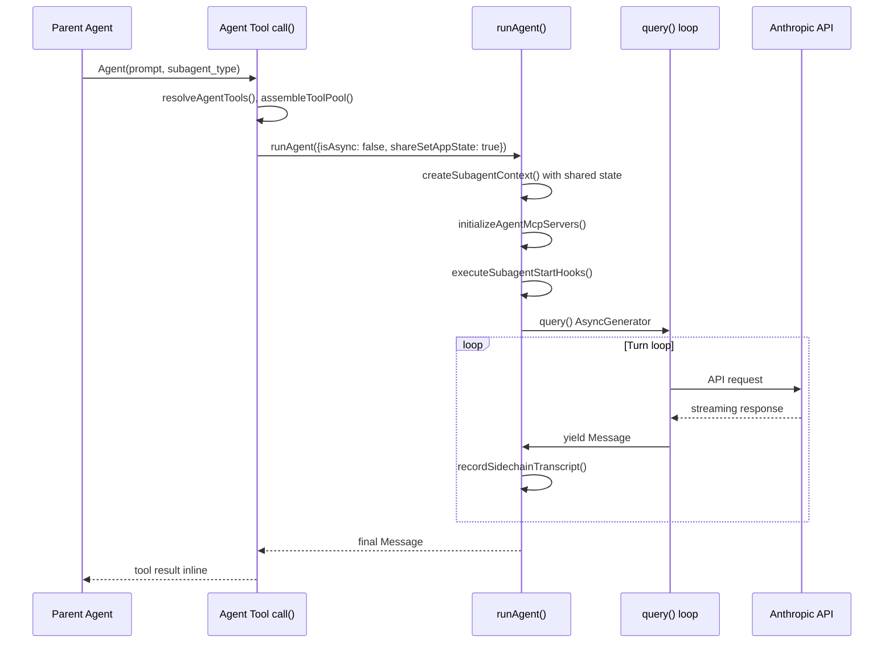
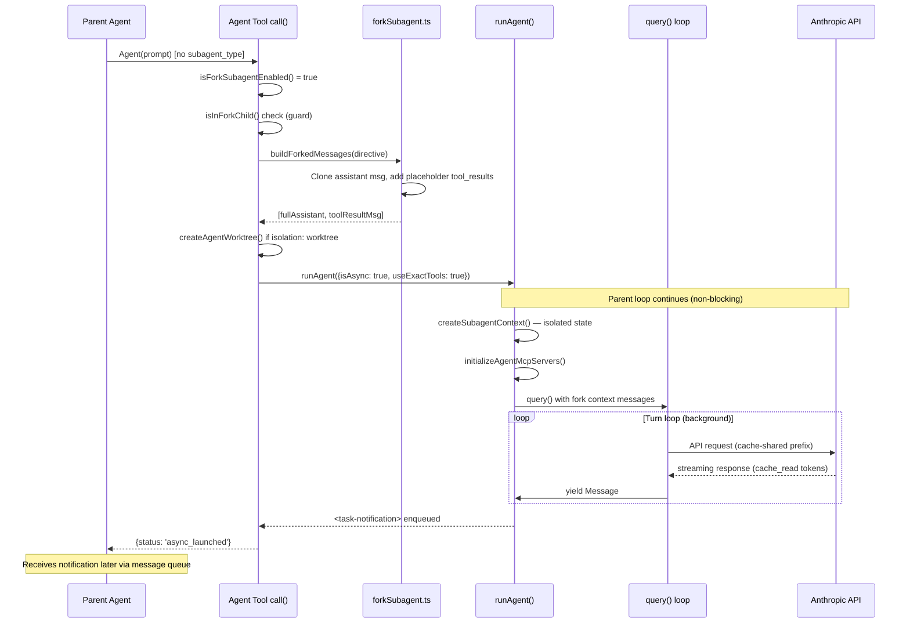
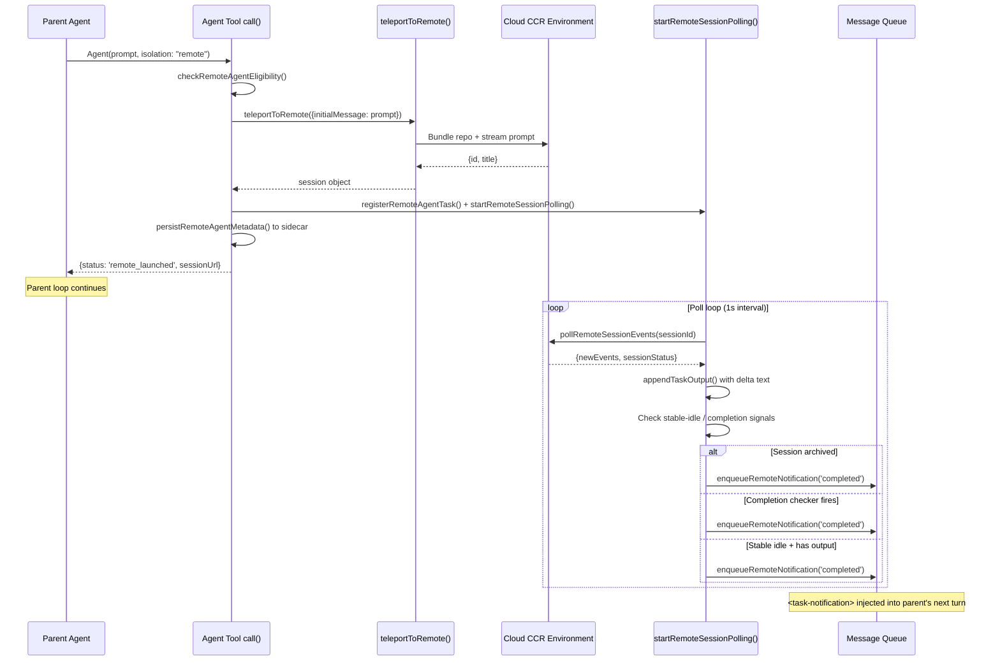

# Sync vs Fork vs Remote: The Execution Modes

## Overview

Every time the Agent tool fires, cc must answer a structural question: where does the child agent run, how does it share state with its parent, and what communication path connects them? The answer is not uniform. cc implements three distinct execution modes -- sync, fork, and remote -- each with different isolation boundaries, cache strategies, and failure semantics. These three tiers map directly to HER's classification of multi-agent orchestration: in-process subagents, local orchestrators, and cloud-async distributed agents (HER §9.1).

Sync mode is the original path. The parent agent calls `runAgent`, which creates an isolated `ToolUseContext` in the same process and yields messages back through an `AsyncGenerator`. The parent's main loop blocks until the child finishes. State is shared through explicit opt-in: sync agents inherit the parent's `setAppState` and `abortController` callbacks, giving them the tightest integration and lowest latency. The child can show permission prompts on the parent's terminal, making sync mode suitable for interactive sub-tasks where the user must approve tool uses in real time.

Fork mode is the experimental successor. When the `FORK_SUBAGENT` feature gate is active, omitting `subagent_type` triggers an implicit fork. The child inherits the parent's full conversation context and system prompt, runs as an async background task, and returns results via a `<task-notification>` message. Fork children share the parent's tool definitions byte-for-byte for prompt cache hits, making them dramatically cheaper at the API level than traditional async spawns. The fork path also forces all agent spawns to run asynchronously, unifying the interaction model: the parent always receives an `async_launched` status and later gets a `<task-notification>` when the child completes.

Remote mode offloads execution to a cloud CCR (Claude Code Remote) environment. The local client calls `teleportToRemote`, which bundles the repository and streams the prompt to a remote session. The local side polls for completion via `pollRemoteSessionEvents`, and results arrive as `<task-notification>` entries. Remote mode trades latency for durability: the orchestrator can disconnect and reconnect, and the remote session persists independently. The `isolation: 'remote'` parameter on the Agent tool is the entry point for this mode, available only in the `ant` build flavor (`src/tools/AgentTool/AgentTool.tsx:L99`).

The tradeoffs among these modes are not academic. A sync agent that runs too long blocks the main loop, preventing user input. A fork child that mutates shared state corrupts the parent's context. A remote agent that loses its polling connection leaves orphaned sessions. Understanding these modes is prerequisite to building reliable multi-agent systems on cc's infrastructure.

## Data structures and contracts

### AgentToolInput: the branching point

The `AgentToolInput` type definition captures the parameters that determine which execution mode fires. Three fields control the branch: `subagent_type`, `isolation`, and `run_in_background`.

```typescript
// src/tools/AgentTool/AgentTool.tsx:L132-L138 — AgentToolInput type
type AgentToolInput = z.infer<ReturnType<typeof baseInputSchema>> & {
  name?: string;
  team_name?: string;
  mode?: z.infer<ReturnType<typeof permissionModeSchema>>;
  isolation?: 'worktree' | 'remote';
  cwd?: string;
};
```

The `isolation` field is the most direct mode selector: `'worktree'` spawns a local agent in a git worktree, while `'remote'` triggers the CCR path. When `isolation` is absent, the decision falls to `subagent_type` and the `FORK_SUBAGENT` feature gate. If the gate is active and `subagent_type` is omitted, the fork path fires; otherwise the traditional async or sync path is chosen based on `run_in_background`. The `inputSchema` function in `src/tools/AgentTool/AgentTool.tsx:L110-L125` dynamically omits `run_in_background` when `isForkSubagentEnabled()` is true, because the fork gate forces all spawns async regardless of the parameter's value.

### CacheSafeParams: the fork's cache contract

Fork mode's cost advantage depends on prompt cache sharing. The `CacheSafeParams` type encodes the parameters that must be identical between parent and child API requests for the Anthropic API's cache key to hit.

```typescript
// src/utils/forkedAgent.ts:L57-L68 — CacheSafeParams definition
export type CacheSafeParams = {
  /** System prompt - must match parent for cache hits */
  systemPrompt: SystemPrompt
  /** User context - prepended to messages, affects cache */
  userContext: { [k: string]: string }
  /** System context - appended to system prompt, affects cache */
  systemContext: { [k: string]: string }
  /** Tool use context containing tools, model, and other options */
  toolUseContext: ToolUseContext
  /** Parent context messages for prompt cache sharing */
  forkContextMessages: Message[]
}
```

The `systemPrompt`, `userContext`, `systemContext`, and `toolUseContext` fields must all match the parent's values. A divergence in any of these fields -- for example, a different tool set or a rewritten system prompt -- produces a different cache key, and the child pays full input-token cost instead of the discounted `cache_read_input_tokens` rate. The `forkContextMessages` field carries the parent's conversation prefix, which the child appends its own messages to.

The module also maintains a `lastCacheSafeParams` slot that is saved by `handleStopHooks` after each turn. This enables post-turn forks (prompt suggestions, post-turn summaries, the `/btw` command) to share the main loop's prompt cache without each caller threading params through the call stack. The `saveCacheSafeParams` and `getLastCacheSafeParams` functions in `src/utils/forkedAgent.ts:L73-L81` manage this slot.

### SubagentContextOverrides: the isolation dial

The `SubagentContextOverrides` type controls what a child agent shares with its parent. Every field defaults to isolation; sharing requires explicit opt-in.

```typescript
// src/utils/forkedAgent.ts:L260-L304 — SubagentContextOverrides
export type SubagentContextOverrides = {
  options?: ToolUseContext['options']
  agentId?: AgentId
  agentType?: string
  messages?: Message[]
  readFileState?: ToolUseContext['readFileState']
  abortController?: AbortController
  getAppState?: ToolUseContext['getAppState']
  shareSetAppState?: boolean
  shareSetResponseLength?: boolean
  shareAbortController?: boolean
  criticalSystemReminder_EXPERIMENTAL?: string
  requireCanUseTool?: boolean
  contentReplacementState?: ContentReplacementState
}
```

The `shareSetAppState`, `shareSetResponseLength`, and `shareAbortController` fields are boolean gates. When `shareSetAppState` is `false` (the default), the child's `setAppState` is a no-op -- it cannot mutate the parent's `AppState`. When `shareAbortController` is `false`, the child gets a new `AbortController` linked to the parent's signal via `createChildAbortController`, so parent aborts propagate but child aborts do not reverse-propagate. The `contentReplacementState` field is cloned from the parent by default so that the child makes identical tool-result replacement decisions, preserving cache consistency. A fresh state would see parent tool_use_ids as unseen and make divergent replacement decisions, producing a wire prefix that differs from the parent's and causing a cache miss.

The `createSubagentContext` function in `src/utils/forkedAgent.ts:L345-L462` implements these defaults. It clones `readFileState`, creates fresh `Set` instances for `nestedMemoryAttachmentTriggers` and `dynamicSkillDirTriggers`, and sets all mutation callbacks (`setInProgressToolUseIDs`, `updateFileHistoryState`) to no-ops. The one exception is `setAppStateForTasks`, which always routes to the root store (`src/utils/forkedAgent.ts:L416-L417`): async agents' background bash tasks must be registered at the root level, or they become PPID=1 zombies when the agent finishes.

### RemoteAgentTaskState: the remote agent's lifecycle

Remote agents have their own state type that tracks polling, session identity, and task-specific metadata.

```typescript
// src/tasks/RemoteAgentTask/RemoteAgentTask.tsx:L22-L59 — RemoteAgentTaskState
export type RemoteAgentTaskState = TaskStateBase & {
  type: 'remote_agent';
  remoteTaskType: RemoteTaskType;
  remoteTaskMetadata?: RemoteAgentMetadata;
  sessionId: string;
  command: string;
  title: string;
  todoList: TodoList;
  log: SDKMessage[];
  isLongRunning?: boolean;
  pollStartedAt: number;
  isRemoteReview?: boolean;
  reviewProgress?: {
    stage?: 'finding' | 'verifying' | 'synthesizing';
    bugsFound: number;
    bugsVerified: number;
    bugsRefuted: number;
  };
  isUltraplan?: boolean;
  ultraplanPhase?: Exclude<UltraplanPhase, 'running'>;
};
```

The `sessionId` field identifies the CCR session. The `pollStartedAt` timestamp is critical for timeout calculations: review timeouts clock from when the local poller started watching, not from when the remote session was spawned, so a `--resume` restore does not immediately time out a long-running session. The `remoteTaskType` discriminates among five subtypes -- `remote-agent`, `ultraplan`, `ultrareview`, `autofix-pr`, and `background-pr` (`src/tasks/RemoteAgentTask/RemoteAgentTask.tsx:L60`) -- each with its own completion semantics. The `reviewProgress` field tracks live progress from the remote orchestrator's heartbeat echoes, surfaced in the pill badge and detail dialog.

### LocalAgentTaskState: the local async agent's state

Local async agents (both traditional async and fork) use `LocalAgentTaskState`, which tracks foreground/background status, progress, and worktree isolation.

```typescript
// src/tasks/LocalAgentTask/LocalAgentTask.tsx:L116-L148 — LocalAgentTaskState
export type LocalAgentTaskState = TaskStateBase & {
  type: 'local_agent';
  agentId: string;
  prompt: string;
  selectedAgent?: AgentDefinition;
  agentType: string;
  model?: string;
  abortController?: AbortController;
  unregisterCleanup?: () => void;
  error?: string;
  result?: AgentToolResult;
  progress?: AgentProgress;
  retrieved: boolean;
  messages?: Message[];
  lastReportedToolCount: number;
  lastReportedTokenCount: number;
  isBackgrounded: boolean;
  pendingMessages: string[];
  retain: boolean;
  diskLoaded: boolean;
  evictAfter?: number;
};
```

The `isBackgrounded` field tracks whether the task has been backgrounded -- initially `true` for agents registered via `registerAsyncAgent`. The `retain` field is set when the UI is "holding" a task (viewing it in the panel), which blocks eviction and enables stream-append. The `evictAfter` field is a timestamp set at terminal transitions and on unselect; after this time, the task is eligible for garbage collection. The `pendingMessages` array queues messages injected mid-turn via `SendMessage`, drained at tool-round boundaries.

## Control flow

### Sync mode: the blocking subagent

In sync mode, the Agent tool's `call()` method constructs parameters for `runAgent` and iterates its `AsyncGenerator` directly. The parent's main loop is suspended until the child yields its final message. The key branching logic in `AgentTool.tsx` determines whether an agent runs synchronously:

```typescript
// src/tools/AgentTool/AgentTool.tsx:L548-L567 — Sync vs async decision
    isAsync: (run_in_background === true || selectedAgent.background === true) && !isBackgroundTasksDisabled
    };

    const isCoordinator = feature('COORDINATOR_MODE') ? isEnvTruthy(process.env.CLAUDE_CODE_COORDINATOR_MODE) : false;

    const forceAsync = isForkSubagentEnabled();

    const assistantForceAsync = feature('KAIROS') ? appState.kairosEnabled : false;
    const shouldRunAsync = (run_in_background === true || selectedAgent.background === true || isCoordinator || forceAsync || assistantForceAsync || (proactiveModule?.isProactiveActive() ?? false)) && !isBackgroundTasksDisabled;
```

When `shouldRunAsync` is `false`, the agent runs synchronously. The `runAgent` generator yields messages one at a time; the parent's main loop collects them and returns the final result inline. The sync path creates a `ToolUseContext` where `shareSetAppState` is `true` (the child can update the parent's `AppState`) and the `abortController` is shared directly from the parent.

Inside `runAgent`, the sync path is visible in the `createSubagentContext` call at `src/tools/AgentTool/runAgent.ts:L700-L714`. The `shareSetAppState: !isAsync` parameter means that sync agents share the parent's `setAppState` callback, while async agents get a no-op. The `shareSetResponseLength: true` parameter is always set because both sync and async agents contribute to the parent's response metrics. The `abortController` for sync agents comes from the parent's `toolUseContext.abortController` (when no override is provided), ensuring that a parent abort propagates to the child and vice versa.



The sync path's strength is its simplicity: the parent receives the child's result as a direct tool-use return value, and the child can interact with the parent's terminal for permission prompts. Its weakness is that the parent's main loop is blocked for the entire duration of the child's execution, preventing any other work or user input during that time. A long-running sync agent effectively freezes the parent's REPL until it completes.

### Fork mode: the cache-shared background spawn

Fork mode restructures the parent-child relationship around prompt cache sharing. When `isForkSubagentEnabled()` returns `true` and `subagent_type` is omitted, the `effectiveType` resolves to `undefined`, triggering the fork path. The fork path differs from the traditional async path in three ways: the child inherits the parent's full conversation context, the child uses the parent's exact tool definitions (via `useExactTools: true`), and the child's system prompt is the parent's already-rendered bytes threaded through `override.systemPrompt`.

The `isForkSubagentEnabled` function in `src/tools/AgentTool/forkSubagent.ts:L32-L39` gates the feature. It checks the `FORK_SUBAGENT` feature flag, returns `false` in coordinator mode (which has its own delegation model), and returns `false` in non-interactive sessions:

```typescript
// src/tools/AgentTool/forkSubagent.ts:L32-L39 — Fork subagent feature gate
export function isForkSubagentEnabled(): boolean {
  if (feature('FORK_SUBAGENT')) {
    if (isCoordinatorMode()) return false
    if (getIsNonInteractiveSession()) return false
    return true
  }
  return false
}
```

The `buildForkedMessages` function constructs the child's initial messages for maximum cache hit rates:

```typescript
// src/tools/AgentTool/forkSubagent.ts:L107-L168 — buildForkedMessages
export function buildForkedMessages(
  directive: string,
  assistantMessage: AssistantMessage,
): MessageType[] {
  const fullAssistantMessage: AssistantMessage = {
    ...assistantMessage,
    uuid: randomUUID(),
    message: {
      ...assistantMessage.message,
      content: [...assistantMessage.message.content],
    },
  }

  const toolUseBlocks = assistantMessage.message.content.filter(
    (block): block is BetaToolUseBlock => block.type === 'tool_use',
  )

  const toolResultBlocks = toolUseBlocks.map(block => ({
    type: 'tool_result' as const,
    tool_use_id: block.id,
    content: [
      {
        type: 'text' as const,
        text: FORK_PLACEHOLDER_RESULT,
      },
    ],
  }))

  const toolResultMessage = createUserMessage({
    content: [
      ...toolResultBlocks,
      {
        type: 'text' as const,
        text: buildChildMessage(directive),
      },
    ],
  })

  return [fullAssistantMessage, toolResultMessage]
}
```

The `FORK_PLACEHOLDER_RESULT` constant (`'Fork started — processing in background'`) is identical across all fork children from the same parent. This means that every child's API request shares the same prefix up to the final text block, maximizing cache hits. Only the per-child directive -- the last text block in the user message -- differs between siblings. The `fullAssistantMessage` is cloned with a new UUID to avoid mutating the original, and all content blocks (thinking, text, and tool_use) are preserved so the assistant message structure matches what the API expects.

The fork path also includes a recursive-fork guard. The `isInForkChild` function at `src/tools/AgentTool/forkSubagent.ts:L78-L89` scans conversation history for the `FORK_BOILERPLATE_TAG`, and `querySource` is checked against `'agent:builtin:fork'`. If either check fires, the Agent tool throws an error rather than spawning a grandchild, preventing unbounded fork chains. The `querySource` check is compaction-resistant: it is set on `context.options` at spawn time and survives autocompact's message rewrite, whereas the message-scan fallback would be defeated by autocompact replacing the fork-boilerplate message.

The `FORK_AGENT` definition in `src/tools/AgentTool/forkSubagent.ts:L60-L71` configures the fork child's parameters. The `tools: ['*']` with `useExactTools` means the fork child receives the parent's exact tool pool for cache-identical API prefixes. The `permissionMode: 'bubble'` surfaces permission prompts to the parent terminal. The `model: 'inherit'` keeps the parent's model for context length parity. The `getSystemPrompt` function returns an empty string because the fork path passes `override.systemPrompt` with the parent's already-rendered system prompt bytes, which avoids a potential GrowthBook cold-to-warm divergence that would bust the prompt cache.



The fork child's `buildChildMessage` function injects strict behavioral rules: no spawning sub-agents, no meta-commentary, silent tool usage, and a structured output format (`Scope:`, `Result:`, `Key files:`, `Files changed:`, `Issues:`). This directive-based isolation is softer than process isolation but more efficient: the child operates within the same process, sharing the event loop and MCP connections, while the behavioral rules prevent it from interfering with the parent's workflow.

When a fork child runs in an isolated worktree, `buildWorktreeNotice` appends an additional message warning the child to translate inherited path references and re-read potentially stale files. This bridges the gap between inherited context (which references the parent's working directory) and the child's actual working directory (the worktree). The notice at `src/tools/AgentTool/forkSubagent.ts:L205-L210` is explicit: "Paths in the inherited context refer to the parent's working directory; translate them to your worktree root."

### Remote mode: the CCR offload

Remote mode is the most isolated execution tier. The Agent tool calls `teleportToRemote`, which bundles the repository and streams the prompt to a CCR environment. The local side then polls for completion via `startRemoteSessionPolling`. The entry point in `AgentTool.tsx` first checks eligibility via `checkRemoteAgentEligibility`, which validates that the user is logged in, a cloud environment is available, the working directory is a git repo with a GitHub remote, and the Claude GitHub app is installed.

```typescript
// src/tasks/RemoteAgentTask/RemoteAgentTask.tsx:L386-L466 — registerRemoteAgentTask
export function registerRemoteAgentTask(options: {
  remoteTaskType: RemoteTaskType;
  session: { id: string; title: string };
  command: string;
  context: TaskContext;
  toolUseId?: string;
  isRemoteReview?: boolean;
  isUltraplan?: boolean;
  isLongRunning?: boolean;
  remoteTaskMetadata?: RemoteAgentMetadata;
}): { taskId: string; sessionId: string; cleanup: () => void } {
  const taskId = generateTaskId('remote_agent');
  void initTaskOutput(taskId);
  const taskState: RemoteAgentTaskState = {
    ...createTaskStateBase(taskId, 'remote_agent', session.title, toolUseId),
    type: 'remote_agent',
    remoteTaskType,
    status: 'running',
    sessionId: session.id,
    command,
    title: session.title,
    todoList: [],
    log: [],
    isRemoteReview,
    isUltraplan,
    isLongRunning,
    pollStartedAt: Date.now(),
    remoteTaskMetadata
  };
  registerTask(taskState, context.setAppState);
  void persistRemoteAgentMetadata({...});
  const stopPolling = startRemoteSessionPolling(taskId, context);
  return { taskId, sessionId: session.id, cleanup: stopPolling };
}
```

The `persistRemoteAgentMetadata` call writes the task's identity to the session sidecar so that `--resume` can reconnect to still-running remote sessions. On restore, `restoreRemoteAgentTasks` at `src/tasks/RemoteAgentTask/RemoteAgentTask.tsx:L477-L532` scans the sidecar, fetches live CCR status for each session via `fetchSession`, and restarts polling for sessions that are still running. Sessions that are archived or 404 have their sidecar files removed. Auth errors (401) are treated as recoverable -- the remote session may still be running, and the user can fix the auth issue via `/login`.

The polling loop in `startRemoteSessionPolling` runs at 1-second intervals with a `POLL_INTERVAL_MS` constant of 1000. It accumulates remote events into a local log via `accumulatedLog`, scans for completion signals, and enqueues `<task-notification>` messages when the remote task finishes. The completion detection is nuanced: remote sessions flip to `'idle'` between tool turns, so a single idle observation is unreliable. The poller requires `STABLE_IDLE_POLLS` (5) consecutive idle observations with no log growth before declaring the session done. For remote-review tasks, the `<remote-review>` tag in hook output is the primary completion signal, with a 30-minute timeout (`REMOTE_REVIEW_TIMEOUT_MS`) as a backstop.

The poller also handles delta-based output streaming. Each new event from `pollRemoteSessionEvents` is appended to `accumulatedLog` and the text content is written to the task's output file via `appendTaskOutput`. This allows the local UI to show remote progress in near-real-time, even though the remote agent is executing on a different machine.



Remote mode's key advantage is durability: the CCR session persists independently of the local client. If the user closes their terminal, the remote session continues running. On `--resume`, the polling loop reconnects and picks up where it left off. The tradeoff is latency: every API call from the remote agent incurs network round-trip time, and the polling model means results are delayed by up to 1 second plus processing time. Remote mode also introduces eligibility checks that are not required for local modes: the user must be logged in with a Claude.ai account (not Console), a cloud environment must be configured, the repository must have a GitHub remote, and the Claude GitHub app must be installed on the repository.

## Edge cases and failure modes

### Context anxiety and fork children

HER §6.5 identifies context anxiety as a failure mode where the model prematurely wraps up near perceived context limits. The model, aware that context window space is limited, begins to rush its work -- cutting corners, skipping verification steps, and declaring work done prematurely. Fork children are particularly susceptible because they inherit the parent's full conversation context as a prefix. A fork child that sees a large context window already filled with the parent's history may rush its own work, cutting corners and declaring completion early.

The fork path mitigates this in two ways. First, the `buildChildMessage` directive explicitly instructs the child to "USE your tools directly" and "Do NOT editorialize or add meta-commentary," which reduces the child's tendency to fill context with explanatory text. Second, the `maxTurns` field on `FORK_AGENT` is set to 200 (`src/tools/AgentTool/forkSubagent.ts:L65`), giving the child a generous turn budget. However, the fundamental tension remains: a child that inherits 150K tokens of parent context has less room for its own work than one that starts fresh. The HER-recommended fix -- context resets with structured handoffs, which proved more effective than compaction for Claude Sonnet 4.5 -- is at odds with fork mode's cache-sharing design, which depends on prefix continuity. This is an unresolved architectural tension.

### Cache invalidation in fork mode

The `CacheSafeParams` type documents five parameters that must match for cache hits. A sixth parameter -- thinking configuration (`budget_tokens`) -- is derived from `toolUseContext.options.thinkingConfig` but can be inadvertently changed if the fork sets `maxOutputTokens`, which clamps `budget_tokens` in `claude.ts`. The `ForkedAgentParams.maxOutputTokens` doc comment in `src/utils/forkedAgent.ts:L96-L103` explicitly warns about this:

> CAUTION: setting this changes both max_tokens AND budget_tokens (via clamping in claude.ts). If the fork uses cacheSafeParams to share the parent's prompt cache, a different budget_tokens will invalidate the cache -- thinking config is part of the cache key. Only set this when cache sharing is not a goal.

This is a subtle bug vector: a well-intentioned developer adding `maxOutputTokens` to a fork call would silently break cache sharing, causing a cost spike without any visible error. The `runForkedAgent` function in `src/utils/forkedAgent.ts:L489-L626` does not validate this constraint at runtime -- it relies on the doc comment and developer discipline.

A related cache-invalidation risk involves the `contentReplacementState` clone. The `createSubagentContext` function at `src/utils/forkedAgent.ts:L399-L403` clones the parent's replacement state rather than creating a fresh one, because cache-sharing forks process parent messages containing parent tool_use_ids. A fresh state would see those IDs as unseen and make divergent replacement decisions, producing a wire prefix that differs from the parent's and causing a cache miss. For non-forking subagents the parent UUIDs never match, so the clone is a harmless no-op.

### Orphaned remote sessions

Remote sessions can become orphaned if the local client disconnects before the polling loop detects completion. The `restoreRemoteAgentTasks` function on `--resume` handles this by scanning the session sidecar and reconnecting. However, if the sidecar file is corrupted or deleted (for example, by a filesystem cleanup tool), the remote session runs indefinitely without the local client's knowledge, consuming CCR resources.

The `startRemoteSessionPolling` function includes a `REMOTE_REVIEW_TIMEOUT_MS` of 30 minutes for remote-review tasks, but generic `remote-agent` tasks have no timeout. A long-running remote agent that never produces a `result` event will be polled indefinitely. The CCR infrastructure applies its own session-level TTL, but the local client has no visibility into when that TTL will expire. The `markTaskNotified` function at `src/tasks/RemoteAgentTask/RemoteAgentTask.tsx:L189-L201` uses atomic state updates to prevent duplicate notifications when a task is killed externally while the poller is in-flight -- a race condition that would otherwise produce duplicate `<task-notification>` entries.

### Async agent zombie processes

When an async agent spawns background bash tasks (via `run_in_background`), those tasks outlive the agent if the agent is killed before the bash process completes. The cleanup code in `runAgent.ts:L847-L848` addresses this by calling `killShellTasksForAgent`, which sends SIGTERM to all background bash tasks associated with the agent's ID. Without this cleanup, the bash processes become PPID=1 zombies that consume resources until the main session exits.

A related edge case involves nested async agents: if an async agent itself spawns an async agent, the inner agent's `setAppState` is a no-op (because the parent's `setAppState` is also a no-op). The `rootSetAppState` channel (`toolUseContext.setAppStateForTasks ?? toolUseContext.setAppState`) was introduced to ensure that session-scoped writes like hook registrations and bash task tracking always reach the root `AppState` store, even in nested async contexts. The comment in `src/tools/AgentTool/runAgent.ts:L335-L338` explains this: "toolUseContext.setAppState is a no-op when the parent is itself an async agent (nested async to async), so session-scoped writes (hooks, bash tasks) must go through this instead."

The `finally` block in `runAgent.ts:L816-L859` performs comprehensive cleanup: MCP server teardown, session hook clearing, prompt cache tracking release, file state cache clearing, fork context message release, Perfetto agent unregistration, transcript subdir clearing, orphaned todo removal, and background shell task killing. Each cleanup step is independent -- a failure in one step does not prevent subsequent steps from running.

### Worktree isolation gaps

When a fork child runs in a worktree, the `buildWorktreeNotice` function warns the child to translate path references and re-read files. However, this is a soft constraint enforced by the prompt, not by the runtime. A child that ignores the notice and edits files based on inherited path references will modify files in its own worktree (not the parent's), so there is no cross-contamination risk. The real risk is staleness: the parent may have modified files after the child inherited the context, so the child's inherited knowledge of file contents may be outdated. The notice instructs the child to re-read before editing, but compliance is not enforced.

The `createAgentWorktree` function creates a git worktree with its own branch and symlinked `node_modules`. The `hasWorktreeChanges` function checks whether the worktree has uncommitted changes before cleanup. The `removeAgentWorktree` function is called during the async agent lifecycle's cleanup phase, ensuring that worktrees are not leaked when agents finish or are killed. However, if the main process crashes without running cleanup, the worktree remains on disk as an orphan, requiring manual cleanup.

## Where cc diverges from the published pattern

HER §9.1 describes three tiers of multi-agent orchestration as a clean architectural hierarchy: in-process, local-orchestrator, and cloud-async. cc's implementation diverges from this model in several ways.

First, cc's fork mode blurs the line between in-process and local-orchestrator tiers. Fork children run in the same process as the parent (in-process), but they run asynchronously with isolated state (local-orchestrator). They are not separate processes coordinating through files or pipes; they are same-process generators with cloned state. This hybrid design gives fork children the cache-sharing benefits of in-process execution and the non-blocking benefits of local orchestration, but it also inherits the failure modes of both tiers: shared-event-loop blocking (in-process) and state isolation bugs (local-orchestrator). A fork child that saturates the event loop with CPU-bound work can starve the parent, even though they are supposedly isolated.

Second, cc's sync mode does not strictly isolate context at the application level, as HER suggests for in-process subagents. Sync agents share `setAppState` and `abortController` with the parent, meaning a sync agent can directly mutate the parent's `AppState`. This is intentional -- sync agents need to update the parent's UI state -- but it violates the isolation principle that HER §9.1 recommends for in-process subagents. The `SubagentContextOverrides` type makes this explicit: `shareSetAppState` defaults to `false` but is set to `true` for sync agents (`src/tools/AgentTool/runAgent.ts:L709`).

Third, cc's remote mode uses polling rather than webhook-based coordination. HER §9.1 describes cloud-async agents as communicating "through message queues, webhooks, or shared storage." cc's `startRemoteSessionPolling` uses a 1-second HTTP poll loop, which is simpler to implement but introduces up to 1 second of latency before the local client detects a remote state change. A webhook-based approach would reduce this latency but would require the local client to expose an HTTP endpoint, which is not feasible in all deployment environments (for example, behind NAT or corporate firewalls).

Fourth, cc does not implement HER §6.5's recommended fix for context anxiety (context resets with structured handoffs) in fork mode. Fork mode's entire value proposition is cache sharing, which depends on prefix continuity. A context reset would break the cache, making the fork no more efficient than a traditional async spawn. This tension between cache efficiency and context anxiety mitigation is an open design question.

Fifth, cc's remote mode introduces eligibility checks that are not part of HER's cloud-async tier. The `checkRemoteAgentEligibility` function at `src/tasks/RemoteAgentTask/RemoteAgentTask.tsx:L124-L141` validates login status, cloud environment availability, git repo presence, GitHub remote existence, and GitHub app installation. These prerequisites create a deployment dependency that HER's model does not account for: a cloud-async agent should theoretically be spawnable from any environment, but cc's remote mode requires specific infrastructure to be in place before the agent can be created.

## Developer takeaways for building a long-running agent

Building a long-running agent on cc's infrastructure requires choosing the right execution mode for each sub-task and understanding the failure modes that each mode introduces. Sync mode is appropriate for short, tightly-coupled sub-tasks where the parent needs the result immediately and the child's execution time is bounded. Fork mode is appropriate for parallelizable sub-tasks where prompt cache sharing provides significant cost savings and the child can operate autonomously within its directive. Remote mode is appropriate for tasks that require durable execution across client disconnects or that need compute resources unavailable locally. The most common mistake is choosing sync mode for long-running sub-tasks, which blocks the parent's main loop and prevents user input. The second most common mistake is ignoring cache invalidation when modifying fork parameters -- changing `maxOutputTokens` or tool definitions in a fork child silently breaks cache sharing and causes cost spikes. The third is neglecting cleanup: async agents that spawn background processes must ensure those processes are killed when the agent terminates, or they become zombies. The `killShellTasksForAgent` pattern in `runAgent.ts` is the template for this cleanup. For remote agents, always handle the `--resume` case by persisting metadata to the session sidecar and reconnecting the polling loop on restore. The `restoreRemoteAgentTasks` function demonstrates this pattern. Finally, be aware of context anxiety in fork children: a child that inherits a large context prefix may rush its work, and the only reliable mitigation is to keep the inherited prefix as small as practical while still maintaining cache hit rates.
