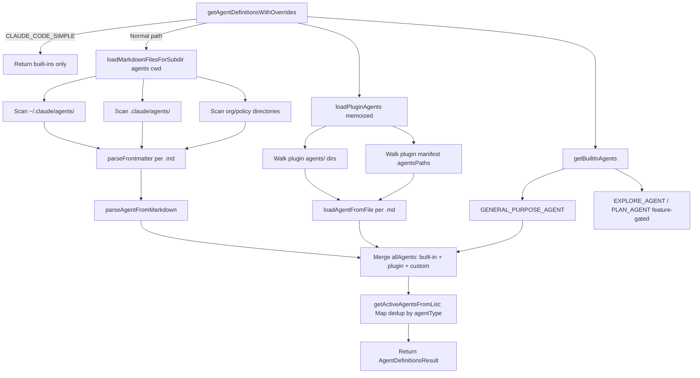

# Agent Definitions: Loading, Frontmatter, and Built-Ins

## Overview

Every time a user invokes the Agent tool in cc, the runtime must resolve which agents are available, load their definitions from disk, parse their YAML frontmatter, and present a coherent menu to the model. This chapter traces the full lifecycle: from the directory-scan that discovers `.md` files under `~/.claude/agents/`, through the plugin pipeline that loads third-party agents, to the built-in agent catalog that ships inside the binary. The central contract is the `AgentDefinition` union type — a discriminated record whose `source` field (`built-in`, a `SettingSource` string, or `plugin`) determines how the agent was discovered and what privileges it carries. HER §7.4 identifies sub-agents as a configuration surface: the decision of what tasks to delegate, what models to use, and what permissions to grant constitutes a critical harness configuration. cc implements that surface through the frontmatter contract described here.

The discovery process follows HER §5 Pattern 2 (Scoped Context Assembly). cc loads agent definitions from multiple granularities — user-level (`~/.claude/agents/`), project-level (`.claude/agents/`), and plugin-level — then merges them with built-in agents. This layered approach ensures that not all agent definitions are equally relevant at all times: a project can ship domain-specific agents that only activate when the user is working inside that project, while user-level agents are always available. The key insight from the ETH Zurich finding referenced in HER §5 — that verbose context hurts performance — applies here: by scoping agent availability to the current project, the total number of agents the model must consider stays manageable.

## Data structures and contracts

The foundation is `BaseAgentDefinition`, a TypeScript type that enumerates every field an agent can carry. Three subtypes extend it — `BuiltInAgentDefinition`, `CustomAgentDefinition`, and `PluginAgentDefinition` — united into `AgentDefinition`:

```typescript
// src/tools/AgentTool/loadAgentsDir.ts:L106-L166
export type BaseAgentDefinition = {
  agentType: string
  whenToUse: string
  tools?: string[]
  disallowedTools?: string[]
  skills?: string[]
  mcpServers?: AgentMcpServerSpec[]
  hooks?: HooksSettings
  color?: AgentColorName
  model?: string
  effort?: EffortValue
  permissionMode?: PermissionMode
  maxTurns?: number
  filename?: string
  baseDir?: string
  criticalSystemReminder_EXPERIMENTAL?: string
  requiredMcpServers?: string[]
  background?: boolean
  initialPrompt?: string
  memory?: AgentMemoryScope
  isolation?: 'worktree' | 'remote'
  pendingSnapshotUpdate?: { snapshotTimestamp: string }
  omitClaudeMd?: boolean
}

export type BuiltInAgentDefinition = BaseAgentDefinition & {
  source: 'built-in'
  baseDir: 'built-in'
  callback?: () => void
  getSystemPrompt: (params: {
    toolUseContext: Pick<ToolUseContext, 'options'>
  }) => string
}

export type CustomAgentDefinition = BaseAgentDefinition & {
  getSystemPrompt: () => string
  source: SettingSource
  filename?: string
  baseDir?: string
}

export type PluginAgentDefinition = BaseAgentDefinition & {
  getSystemPrompt: () => string
  source: 'plugin'
  filename?: string
  plugin: string
}

export type AgentDefinition =
  | BuiltInAgentDefinition
  | CustomAgentDefinition
  | PluginAgentDefinition
```

The `agentType` field is the primary key — the string the model passes when invoking the Agent tool. The `whenToUse` string is injected into the tool description so the model can decide which agent to call. The `getSystemPrompt` closure lazily produces the system prompt at spawn time, allowing memory injection and variable substitution to happen after discovery rather than during the initial load. This is a meaningful architectural choice: storing the raw prompt text would force all substitutions to run at discovery time, making the load phase slower and coupling it to runtime state that may change between discovery and spawn.

The discriminated `source` field drives type guards like `isBuiltInAgent()`, `isCustomAgent()`, and `isPluginAgent()` (`src/tools/AgentTool/loadAgentsDir.ts:L168-L184`), which downstream code uses to enforce security boundaries. The `BuiltInAgentDefinition` is the most constrained variant — its `getSystemPrompt` takes a `params` object with a `toolUseContext` pick, allowing built-in agents to access runtime configuration (like the current model or feature flags) at prompt-generation time. Custom and plugin agents receive no such parameter; their prompts are pure closures over the parsed frontmatter and markdown content.

The `AgentMcpServerSpec` type (`src/tools/AgentTool/loadAgentsDir.ts:L58-L60`) supports two forms: a string reference to an existing MCP server by name (e.g., `"slack"`), or an inline record mapping server names to configurations. This dual form lets agent authors either rely on servers the user has already configured or declare servers the agent needs inline. The `requiredMcpServers` field on `BaseAgentDefinition` takes this further: an agent can declare that certain MCP server name patterns must be present for the agent to be available at all, and `filterAgentsByMcpRequirements()` at `src/tools/AgentTool/loadAgentsDir.ts:L250-L255` removes agents whose requirements are unmet.

The frontmatter schema lives in a separate module. `FrontmatterData` in `src/utils/frontmatterParser.ts:L10-L59` defines every recognized YAML key:

```typescript
// src/utils/frontmatterParser.ts:L10-L59
export type FrontmatterData = {
  'allowed-tools'?: string | string[] | null
  description?: string | null
  type?: string | null
  'argument-hint'?: string | null
  when_to_use?: string | null
  version?: string | null
  'hide-from-slash-command-tool'?: string | null
  model?: string | null
  skills?: string | null
  'user-invocable'?: string | null
  hooks?: HooksSettings | null
  effort?: string | null
  context?: 'inline' | 'fork' | null
  agent?: string | null
  paths?: string | string[] | null
  shell?: string | null
  [key: string]: unknown
}
```

The index signature `[key: string]: unknown` allows unknown keys to pass through without breaking the parser, while the explicitly-typed keys give downstream consumers type safety. This is the raw schema before agent-specific transformation; the `parseAgentFromMarkdown` function in `loadAgentsDir.ts` maps frontmatter keys to `BaseAgentDefinition` fields, renaming `name` to `agentType`, `description` to `whenToUse`, and so on. Note that `FrontmatterData` is a shared type used by skills, commands, and memory files as well — not all fields are relevant to agents. The `context` and `agent` fields, for instance, are skill-specific (controlling whether a skill runs inline or as a forked subagent), while `type` is memory-specific.

The `ParsedMarkdown` return type bundles the parsed frontmatter with the remaining content:

```typescript
// src/utils/frontmatterParser.ts:L61-L64
export type ParsedMarkdown = {
  frontmatter: FrontmatterData
  content: string
}
```

The `content` field is everything after the closing `---` delimiter, which for agent definitions becomes the system prompt body. This clean separation means the frontmatter contains all the machine-readable metadata while the markdown body contains the human-readable (and model-readable) prompt.

```mermaid
classDiagram
    class AgentDefinition {
        <<union>>
    }
    class BaseAgentDefinition {
        +agentType: string
        +whenToUse: string
        +tools?: string[]
        +disallowedTools?: string[]
        +skills?: string[]
        +mcpServers?: AgentMcpServerSpec[]
        +hooks?: HooksSettings
        +color?: AgentColorName
        +model?: string
        +effort?: EffortValue
        +permissionMode?: PermissionMode
        +maxTurns?: number
        +background?: boolean
        +initialPrompt?: string
        +memory?: AgentMemoryScope
        +isolation?: worktree|remote
        +omitClaudeMd?: boolean
    }
    class BuiltInAgentDefinition {
        +source: built-in
        +baseDir: built-in
        +getSystemPrompt(params): string
    }
    class CustomAgentDefinition {
        +source: SettingSource
        +getSystemPrompt(): string
    }
    class PluginAgentDefinition {
        +source: plugin
        +plugin: string
        +getSystemPrompt(): string
    }
    BaseAgentDefinition <|-- BuiltInAgentDefinition
    BaseAgentDefinition <|-- CustomAgentDefinition
    BaseAgentDefinition <|-- PluginAgentDefinition
    AgentDefinition ..| BuiltInAgentDefinition : union
    AgentDefinition ..| CustomAgentDefinition : union
    AgentDefinition ..| PluginAgentDefinition : union
```

## Control flow

Agent discovery follows a layered directory scan, merging results from built-in, plugin, and user/project sources. The entry point is `getAgentDefinitionsWithOverrides`, a memoized async function that orchestrates the entire pipeline:

```typescript
// src/tools/AgentTool/loadAgentsDir.ts:L296-L393
export const getAgentDefinitionsWithOverrides = memoize(
  async (cwd: string): Promise<AgentDefinitionsResult> => {
    if (isEnvTruthy(process.env.CLAUDE_CODE_SIMPLE)) {
      const builtInAgents = getBuiltInAgents()
      return {
        activeAgents: builtInAgents,
        allAgents: builtInAgents,
      }
    }

    try {
      const markdownFiles = await loadMarkdownFilesForSubdir('agents', cwd)

      const failedFiles: Array<{ path: string; error: string }> = []
      const customAgents = markdownFiles
        .map(({ filePath, baseDir, frontmatter, content, source }) => {
          const agent = parseAgentFromMarkdown(
            filePath, baseDir, frontmatter, content, source,
          )
          // ... error handling omitted
          return agent
        })
        .filter(agent => agent !== null)

      let pluginAgentsPromise = loadPluginAgents()
      if (feature('AGENT_MEMORY_SNAPSHOT') && isAutoMemoryEnabled()) {
        const [pluginAgents_] = await Promise.all([
          pluginAgentsPromise,
          initializeAgentMemorySnapshots(customAgents),
        ])
        pluginAgentsPromise = Promise.resolve(pluginAgents_)
      }
      const pluginAgents = await pluginAgentsPromise
      const builtInAgents = getBuiltInAgents()

      const allAgentsList: AgentDefinition[] = [
        ...builtInAgents,
        ...pluginAgents,
        ...customAgents,
      ]

      const activeAgents = getActiveAgentsFromList(allAgentsList)
      // ... color init, error fallback
      return { activeAgents, allAgents: allAgentsList, failedFiles }
    } catch (error) {
      // Even on error, return the built-in agents
      const builtInAgents = getBuiltInAgents()
      return { activeAgents: builtInAgents, allAgents: builtInAgents,
               failedFiles: [{ path: 'unknown', error: errorMessage }] }
    }
  },
)
```

The function first checks `CLAUDE_CODE_SIMPLE` — a mode that strips all custom agents and returns only built-ins. This environment variable is the fastest path: no filesystem access, no plugin loading, no YAML parsing. In the normal path, `loadMarkdownFilesForSubdir('agents', cwd)` scans the `agents/` subdirectories across the HER §5 scoped context assembly hierarchy: org-level, user-level (`~/.claude/agents/`), project-level (`.claude/agents/`), and directory-level. Each `.md` file is parsed via `parseFrontmatter()` and then `parseAgentFromMarkdown()`.

Plugin agents load concurrently with the custom agent parsing. `loadPluginAgents` (also memoized) iterates over all enabled plugins, walks their `agents/` directories and any additional paths declared in the plugin manifest, and parses each `.md` file with its own `loadAgentFromFile` function. If the `AGENT_MEMORY_SNAPSHOT` feature flag is on, memory snapshot initialization runs in parallel with plugin loading — both are joined via `Promise.all` to avoid floating promises. The memoization of both `getAgentDefinitionsWithOverrides` and `loadPluginAgents` means the expensive directory scans and YAML parsing happen at most once per process lifetime unless explicitly cleared via `clearAgentDefinitionsCache()` at `src/tools/AgentTool/loadAgentsDir.ts:L395-L398`, which clears both caches.

After all three sources are collected, `getActiveAgentsFromList` merges them. This function groups agents by source priority and uses a `Map<agentType, AgentDefinition>` to resolve duplicates — later groups overwrite earlier ones. The priority order is: built-in, plugin, userSettings, projectSettings, flagSettings, policySettings (`src/tools/AgentTool/loadAgentsDir.ts:L193-L221`). This means a user's `~/.claude/agents/explore.md` can shadow the built-in Explore agent by claiming the same `agentType`. The function filters agents into these six groups, then iterates each group in order, inserting each agent into the map by its `agentType` key. Since `Map.set()` overwrites existing keys, the last write wins — so policySettings agents have the highest effective priority.



The frontmatter parser itself uses a two-pass strategy. The first pass tries raw YAML parsing; if that fails (common with glob patterns like `**/*.{ts,tsx}` that contain YAML-special characters), a second pass quotes problematic values and retries:

```typescript
// src/utils/frontmatterParser.ts:L130-L175
export function parseFrontmatter(
  markdown: string,
  sourcePath?: string,
): ParsedMarkdown {
  const match = markdown.match(FRONTMATTER_REGEX)
  if (!match) {
    return { frontmatter: {}, content: markdown }
  }
  const frontmatterText = match[1] || ''
  const content = markdown.slice(match[0].length)
  let frontmatter: FrontmatterData = {}
  try {
    const parsed = parseYaml(frontmatterText) as FrontmatterData | null
    if (parsed && typeof parsed === 'object' && !Array.isArray(parsed)) {
      frontmatter = parsed
    }
  } catch {
    try {
      const quotedText = quoteProblematicValues(frontmatterText)
      const parsed = parseYaml(quotedText) as FrontmatterData | null
      if (parsed && typeof parsed === 'object' && !Array.isArray(parsed)) {
        frontmatter = parsed
      }
    } catch (retryError) {
      const location = sourcePath ? ` in ${sourcePath}` : ''
      logForDebugging(
        `Failed to parse YAML frontmatter${location}: ${retryError instanceof Error ? retryError.message : retryError}`,
        { level: 'warn' },
      )
    }
  }
  return { frontmatter, content }
}
```

The regex `FRONTMATTER_REGEX` at `src/utils/frontmatterParser.ts:L123` matches the `---` delimiters and captures everything between them. The `quoteProblematicValues` helper scans for simple `key: value` lines where the value contains YAML-special characters (the set defined in `YAML_SPECIAL_CHARS` at `src/utils/frontmatterParser.ts:L79`: `{}[]*&#!|>%@`` and `: `) and wraps them in double quotes. It skips lines that are already quoted and lines that are indented or list items. This retry-on-failure pattern means a broken frontmatter never crashes the agent loader — it degrades to an empty frontmatter object and a debug log. The `sourcePath` parameter is passed through for error messages, making it possible to identify which file had the broken YAML.

The `splitPathInFrontmatter` function at `src/utils/frontmatterParser.ts:L189-L232` handles a subtler parsing challenge: expanding brace patterns in glob-style path lists. For example, `src/*.{ts,tsx}` expands to `["src/*.ts", "src/*.tsx"]`, and `{a,b}/{c,d}` expands to `["a/c", "a/d", "b/c", "b/d"]`. The function also accepts YAML arrays directly, so frontmatter authors can write either `paths: a, b` or `paths: [a, b]`. The brace expansion is recursive — the `expandBraces` function at `src/utils/frontmatterParser.ts:L240-L266` finds the first brace group, splits by commas, and recursively processes the suffix for additional groups.

The plugin agent loader enforces a strict security boundary. Three frontmatter fields — `permissionMode`, `hooks`, and `mcpServers` — are intentionally ignored for plugin agents. The code at `src/utils/plugins/loadPluginAgents.ts:L153-L168` checks for these fields and logs a warning:

```typescript
// src/utils/plugins/loadPluginAgents.ts:L153-L168
// permissionMode, hooks, and mcpServers are intentionally NOT parsed for
// plugin agents. Plugins are third-party marketplace code; these fields
// escalate what the agent can do beyond what the user approved at install
// time. For this level of control, define the agent in .claude/agents/
// where the user explicitly wrote the frontmatter. (Note: plugins can
// still ship hooks and MCP servers at the manifest level — that's the
// install-time trust boundary. Per-agent declarations would let a single
// agent file buried in agents/ silently add them.) See PR #22558 review.
for (const field of ['permissionMode', 'hooks', 'mcpServers'] as const) {
  if (frontmatter[field] !== undefined) {
    logForDebugging(
      `Plugin agent file ${filePath} sets ${field}, which is ignored for plugin agents. Use .claude/agents/ for this level of control.`,
      { level: 'warn' },
    )
  }
}
```

This is the install-time trust boundary that HER §7.4 implies when it says permission scoping is a critical harness configuration. A plugin manifest declares hooks and MCP servers at the top level — that is the boundary the user approved at install time. A per-agent `hooks` field would let a single `.md` file buried deep in a plugin's `agents/` directory silently escalate privileges. The comment explicitly references PR #22558 review, indicating this was a deliberate security decision made after a code review caught the risk.

Plugin agents also get variable substitution: `${CLAUDE_PLUGIN_ROOT}` resolves to the plugin's filesystem path, and `${user_config.X}` resolves to non-sensitive user-configured values (sensitive refs become placeholders). This substitution happens in `loadAgentFromFile` at `src/utils/plugins/loadPluginAgents.ts:L113-L123`, before the system prompt is stored in the closure. The `substituteUserConfigInContent` call is conditional on `pluginManifest.userConfig` being present — only plugins that declare user-configurable options in their manifest get this treatment. The result is a system prompt that can reference plugin-local files and user preferences without hardcoding paths.

Built-in agents are defined as TypeScript constants, not loaded from disk. `getBuiltInAgents()` in `src/tools/AgentTool/builtInAgents.ts:L22-L72` assembles the list based on feature flags and environment. The Explore and Plan agents are gated behind `BUILTIN_EXPLORE_PLAN_AGENTS` and a GrowthBook experiment flag (`tengu_amber_stoat`). The Verification agent is gated behind `VERIFICATION_AGENT` and `tengu_hive_evidence`. The Code Guide agent is excluded for SDK entrypoints. An environment variable `CLAUDE_AGENT_SDK_DISABLE_BUILTIN_AGENTS` lets SDK users start with a blank slate. The function also supports a Coordinator mode (`CLAUDE_CODE_COORDINATOR_MODE`) that replaces the entire built-in agent list with coordinator-specific worker agents, loaded via a lazy `require()` to avoid circular dependencies at module initialization time.

Each built-in agent is a `BuiltInAgentDefinition` with a `getSystemPrompt` function rather than a static string. The General Purpose agent is the simplest — it returns a static string combining `SHARED_PREFIX` and `SHARED_GUIDELINES` (`src/tools/AgentTool/built-in/generalPurposeAgent.ts:L19-L23`). Its `tools` array is `['*']`, meaning it gets access to every tool. The Explore agent is more nuanced: it dynamically adjusts its guidance based on whether embedded search tools are available (`src/tools/AgentTool/built-in/exploreAgent.ts:L13-L57`). Its `disallowedTools` list explicitly blocks write-capable tools (`FileEditTool`, `FileWriteTool`, `NotebookEditTool`) and even the Agent tool itself, preventing recursive agent spawning. This implements the read-only permission scoping that HER §7.4 prescribes for research sub-agents. The Explore agent also sets `omitClaudeMd: true`, which strips the CLAUDE.md hierarchy from its context — a read-only search agent does not need commit/PR/lint guidelines, saving approximately 5-15 Gtok/week across all Explore spawns according to the comment at `src/tools/AgentTool/loadAgentsDir.ts:L128-L132`.

## Edge cases and failure modes

**Broken frontmatter never crashes the loader.** The two-pass YAML parsing strategy in `parseFrontmatter` means malformed YAML degrades to an empty object. The agent parser then checks for required fields (`name` and `description`) and returns `null` for files that lack them. Files without a `name` field are silently skipped — they may be co-located reference documentation rather than agent definitions (`src/tools/AgentTool/loadAgentsDir.ts:L554-L556`). When a file has a `name` field but fails to parse, the error is recorded in `failedFiles` and an analytics event `tengu_agent_parse_error` is logged (`src/tools/AgentTool/loadAgentsDir.ts:L332-L338`), giving the team visibility into common frontmatter mistakes.

**Duplicate `agentType` resolution uses last-writer-wins.** `getActiveAgentsFromList` iterates agent groups in priority order and writes each into a `Map<agentType, AgentDefinition>`. If a user defines an agent named `Explore` in `~/.claude/agents/Explore.md`, it overwrites the built-in Explore agent in the map. This is by design — it lets users override built-in behavior — but it also means a typo in an agent name can unintentionally shadow a built-in. The `allAgents` field in `AgentDefinitionsResult` preserves all agents including the shadowed ones, while `activeAgents` contains only the deduplicated set. This distinction lets the UI display "you are overriding the built-in Explore agent" while still providing the original for reference.

**Plugin agent namespace collision.** Plugin agents are namespaced as `pluginName:namespace:baseAgentName` (`src/utils/plugins/loadPluginAgents.ts:L89-L90`). This prevents two plugins from colliding on the same `agentType`, but it also means a user cannot easily invoke a specific plugin agent by its short name — they must use the fully qualified name. The `namespace` array comes from the directory structure within the plugin's `agents/` directory: a file at `agents/python/linter.md` in a plugin named `code-tools` gets the `agentType` `code-tools:python:linter`.

**Memory tool injection.** When `isAutoMemoryEnabled()` returns true and an agent has a `memory` scope set, the loader injects `FileWriteTool`, `FileEditTool`, and `FileReadTool` into the agent's `tools` array if they are not already present (`src/tools/AgentTool/loadAgentsDir.ts:L663-L674`). This silent injection can surprise developers who explicitly excluded these tools from an agent definition. The rationale is that persistent memory requires file access, so an agent that opts into memory implicitly opts into the tools needed to read and write memory files. The same injection logic appears in both `parseAgentFromMarkdown` and `loadAgentFromFile`, maintaining consistency across user-authored and plugin agents.

**The `inherit` model keyword.** Both `parseAgentFromMarkdown` and `loadAgentFromFile` treat the string `"inherit"` specially — it is lowercased but not replaced, so the runtime can distinguish "use the parent's model" from a literal model name like `"sonnet"`. The Explore agent sets `model: 'inherit'` for ant-internal builds but `model: 'haiku'` for external users (`src/tools/AgentTool/built-in/exploreAgent.ts:L78`), implementing the HER §7.4 pattern of model selection per sub-agent. The Zod schema in `AgentJsonSchema` at `src/tools/AgentTool/loadAgentsDir.ts:L79-L83` applies the same transform: `z.string().transform(m => (m.toLowerCase() === 'inherit' ? 'inherit' : m))`.

**The `isolation` field and build-time gating.** The `isolation` field supports `'worktree'` for all builds and `'remote'` only for ant-internal builds (`process.env.USER_TYPE === 'ant'`). This gating happens in two places: the Zod schema at `src/tools/AgentTool/loadAgentsDir.ts:L94-L97` and the validation logic in `parseAgentFromMarkdown` at `src/tools/AgentTool/loadAgentsDir.ts:L609-L610`. External builds silently reject `'remote'` as an invalid isolation mode, logging a debug message with the valid options.

## Where cc diverges from the published pattern

HER §5 Pattern 2 (Scoped Context Assembly) describes a four-level instruction hierarchy: org, user, project, directory. cc's agent discovery mirrors this for the directory scan (`loadMarkdownFilesForSubdir` walks the same hierarchy), but the merge algorithm in `getActiveAgentsFromList` flattens all levels into a single map keyed by `agentType`. There is no "most specific wins" semantics at the directory level — a project-level agent and a user-level agent with the same `agentType` compete purely on the group ordering in `agentGroups`. Directory-level agents are not a separate group; they are folded into the `projectSettings` or `userSettings` group depending on where the file was found. This diverges from the HER §5 recommendation that directory-level instructions should take precedence when the working context matches.

HER §7.4 prescribes model selection per sub-agent as a harness configuration surface. cc implements this via the `model` and `effort` frontmatter fields, but the built-in agents hardcode their model choices in TypeScript rather than making them configurable from the outside. The Explore agent's model selection is a conditional expression in the source (`src/tools/AgentTool/built-in/exploreAgent.ts:L78`), not a frontmatter-driven decision. A user cannot override a built-in agent's model without shadowing the entire agent definition with a custom agent of the same `agentType`.

The plugin security boundary diverges from what the frontmatter schema allows. `FrontmatterData` accepts `hooks`, `model`, `effort`, and `paths` without restriction, but the plugin loader strips `permissionMode`, `hooks`, and `mcpServers` at runtime. This means the schema is permissive while the loader is restrictive — a pattern that avoids breaking YAML parsing for plugin authors but can cause confusion when a field is silently ignored. The `model` and `effort` fields, by contrast, are allowed through for plugin agents — they control which model the sub-agent uses and how much thinking effort it expends, which are cost decisions rather than privilege escalations. This distinction between "cost" fields and "privilege" fields is implicit in the code rather than formalized in the type system.

The `coerceDescriptionToString` function in `src/utils/frontmatterParser.ts:L304-L326` reveals another divergence: descriptions can be numbers or booleans (coerced to strings), but arrays and objects are rejected and logged. This is more permissive than the Zod schema in `AgentJsonSchema`, which requires `z.string().min(1)` for description. The markdown path is lenient; the JSON path is strict. An agent defined in YAML with `description: 42` will load, but the same agent defined in JSON settings with `"description": 42` will fail Zod validation.

## Developer takeaways for building a long-running agent

Design your agent definition as a discriminated union keyed by source provenance. The `source` field is not metadata — it is a security boundary. Built-in agents, user-authored agents, and plugin agents carry different trust levels, and downstream code must branch on source before granting capabilities like hook registration or MCP server attachment. cc's approach of stripping `permissionMode`, `hooks`, and `mcpServers` from plugin agents while allowing them in user-authored agents demonstrates that the type system should reflect these boundaries at compile time, not just at runtime. A future refactoring could split `BaseAgentDefinition` into separate interfaces per source, making the privilege distinction impossible to violate accidentally.

Separate discovery from parsing. The `getAgentDefinitionsWithOverrides` function scans directories, parses frontmatter, and resolves duplicates in a single pass, but each stage is a distinct failure domain. A broken YAML file should not prevent other agents from loading. The two-pass frontmatter parser and the `null`-return-on-failure pattern in `parseAgentFromMarkdown` ensure that a single malformed file degrades gracefully. For a long-running agent that loads definitions at startup and on cache invalidation, this resilience is essential — one corrupted `.md` file must not block the entire agent catalog. Use closures for `getSystemPrompt` rather than storing the prompt string directly, enabling lazy evaluation where memory prompts, variable substitution, and feature-flag checks happen at spawn time rather than load time, keeping the discovery phase fast and the spawn phase contextually accurate.
