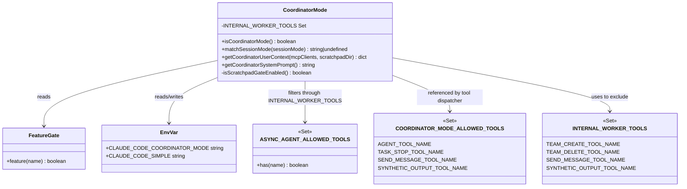
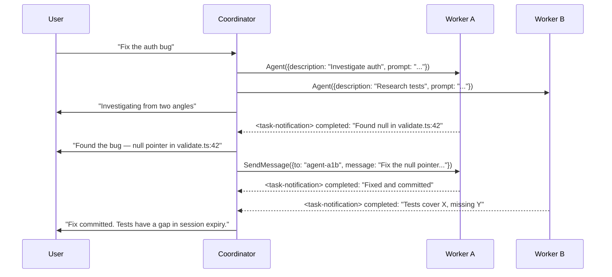
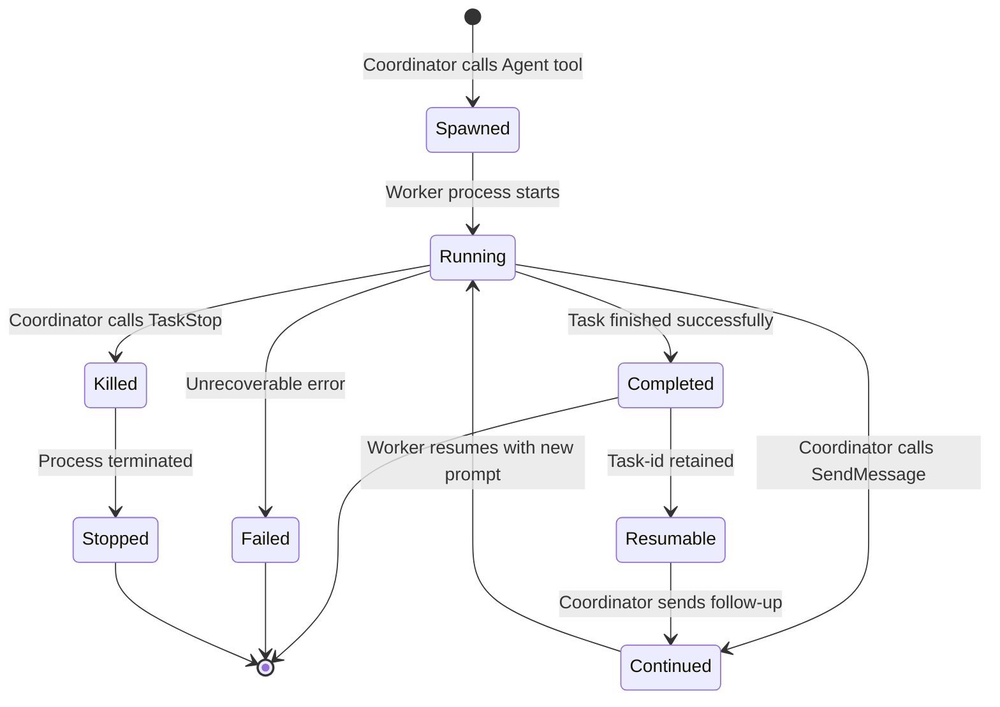

# Multi-Agent Coordinator: The Swarm Layer

## Overview

The coordinator mode is the control plane that transforms a single cc session into a multi-agent orchestrator. Rather than executing tasks itself, the coordinator delegates work to spawned workers, synthesizes their results, and manages the lifecycle of concurrent agent teams. The entire mechanism is feature-gated behind two gates: a build-time feature flag (`COORDINATOR_MODE`) checked via `bun:bundle` and a runtime environment variable (`CLAUDE_CODE_COORDINATOR_MODE`). Both must agree for the mode to activate — the feature flag gates the code path at build time, and the environment variable provides runtime on/off control.

The coordinator sits at the top of a hub-and-spoke topology. It is the only entity that communicates with the user and the only entity that spawns workers. Workers never talk to each other directly; all inter-agent communication routes through the coordinator. This design gives the coordinator full visibility into the communication graph and prevents the circular dependencies that arise in peer-to-peer agent networks. The source of truth for this orchestration layer lives in `src/coordinator/coordinatorMode.ts`, a 369-line file that defines the mode gate, session mode matching, user-context construction, and the coordinator's system prompt.

The coordinator's system prompt — produced by `getCoordinatorSystemPrompt()` — is a 250-line instruction set that teaches the model how to be a coordinator. It covers role definition, tool inventory, task workflow phases, prompt-writing guidelines, and an extended example session. This prompt is the single most important artifact in the swarm layer: it converts a general-purpose language model into a specialized orchestrator by encoding the entire multi-agent protocol as natural-language instructions. The prompt is not configuration data or a declarative spec — it is imperative guidance that must be followed precisely for the swarm to function correctly.

## Data structures and contracts

### The feature gate and mode check

The entry point for the entire coordinator subsystem is the `isCoordinatorMode()` function. It checks two conditions in sequence: first, the build-time feature flag must be enabled; second, the runtime environment variable must be truthy.

```typescript
// src/coordinator/coordinatorMode.ts:L36-L41
export function isCoordinatorMode(): boolean {
  if (feature('COORDINATOR_MODE')) {
    return isEnvTruthy(process.env.CLAUDE_CODE_COORDINATOR_MODE)
  }
  return false
}
```

The `feature('COORDINATOR_MODE')` call reads from `bun:bundle`, which performs dead-code elimination at build time. When the feature flag is off, the entire coordinator code path is stripped from the bundle — the function returns `false` unconditionally. When the flag is on, the runtime check against `CLAUDE_CODE_COORDINATOR_MODE` determines whether the current session runs in coordinator or normal mode. This dual-gate design lets the same binary support both modes while allowing dead-code elimination for builds that do not need coordinator functionality at all.

The function is called from multiple points in the system. The most critical call site is in `getCoordinatorUserContext()` at `src/coordinator/coordinatorMode.ts:L84`, which gates the entire user-context injection. If `isCoordinatorMode()` returns false, the function returns an empty object and the coordinator receives no worker-awareness context — effectively running as a normal session even if the rest of the codebase has coordinator support compiled in.

### Internal worker tools and the tool-filtering set

Workers spawned by the coordinator cannot access every tool. Four tools are classified as internal to the coordinator and must be filtered out of worker tool lists:

```typescript
// src/coordinator/coordinatorMode.ts:L29-L34
const INTERNAL_WORKER_TOOLS = new Set([
  TEAM_CREATE_TOOL_NAME,
  TEAM_DELETE_TOOL_NAME,
  SEND_MESSAGE_TOOL_NAME,
  SYNTHETIC_OUTPUT_TOOL_NAME,
])
```

These four tools are withheld from workers for distinct reasons. `TeamCreate` and `TeamDelete` allow structural modification of the team topology — workers must not create or destroy teams because that would bypass the coordinator's authority over team lifecycle. `SendMessage` is withheld because direct worker-to-worker communication would create a hidden communication graph that the coordinator cannot observe or synthesize. `SyntheticOutput` is an internal mechanism for injecting structured data into the conversation; workers that could produce synthetic output could forge `<task-notification>` messages, undermining the coordinator's ability to distinguish real results from fabricated ones.

The filtering happens at `src/coordinator/coordinatorMode.ts:L93`, where `ASYNC_AGENT_ALLOWED_TOOLS` is filtered through `INTERNAL_WORKER_TOOLS` before being listed in the worker context string. The `ASYNC_AGENT_ALLOWED_TOOLS` set itself is defined at `src/constants/tools.ts:L55-L71` and includes Read, WebSearch, TodoWrite, Grep, WebFetch, Glob, shell tools, Edit, Write, NotebookEdit, Skill, SyntheticOutput, ToolSearch, EnterWorktree, and ExitWorktree. After filtering, workers lose SyntheticOutput and SendMessage, leaving them with read/write/search tools plus Skill delegation. The resulting set is sorted alphabetically and joined with commas before being inserted into the worker context string at `src/coordinator/coordinatorMode.ts:L97`.

### Coordinator-mode allowed tools

The coordinator itself operates with a restricted tool set. Where a normal session has access to the full tool pool, the coordinator gets only four tools:

```typescript
// src/constants/tools.ts:L107-L112
export const COORDINATOR_MODE_ALLOWED_TOOLS = new Set([
  AGENT_TOOL_NAME,
  TASK_STOP_TOOL_NAME,
  SEND_MESSAGE_TOOL_NAME,
  SYNTHETIC_OUTPUT_TOOL_NAME,
])
```

This set is the exact inverse of the worker's restriction. The coordinator gets `Agent` (to spawn workers), `TaskStop` (to kill workers going in the wrong direction), `SendMessage` (to continue workers with follow-up instructions), and `SyntheticOutput` (to inject structured data). The coordinator does not get Bash, Read, Edit, or any other execution tool — its role is purely orchestration. When the coordinator needs to answer a question directly, it uses its own knowledge rather than delegating to a tool. This separation enforces the architectural principle that the coordinator thinks while workers act.

The complementarity between `COORDINATOR_MODE_ALLOWED_TOOLS` and `INTERNAL_WORKER_TOOLS` is worth noting. Both sets contain `SendMessage` and `SyntheticOutput`, but with opposite access semantics. For the coordinator, these are its primary tools — it uses `SendMessage` to continue workers and `SyntheticOutput` to inject notifications. For workers, these are the tools that must be withheld to prevent communication bypasses and result forgery. The two sets share members because they control the same capability from opposite sides of the hub-and-spoke boundary.

### Session mode matching

When a user resumes a session that was previously in coordinator mode, the runtime environment variable may not reflect the stored session state. The `matchSessionMode()` function reconciles this mismatch:

```typescript
// src/coordinator/coordinatorMode.ts:L49-L78
export function matchSessionMode(
  sessionMode: 'coordinator' | 'normal' | undefined,
): string | undefined {
  // No stored mode (old session before mode tracking) — do nothing
  if (!sessionMode) {
    return undefined
  }

  const currentIsCoordinator = isCoordinatorMode()
  const sessionIsCoordinator = sessionMode === 'coordinator'

  if (currentIsCoordinator === sessionIsCoordinator) {
    return undefined
  }

  // Flip the env var — isCoordinatorMode() reads it live, no caching
  if (sessionIsCoordinator) {
    process.env.CLAUDE_CODE_COORDINATOR_MODE = '1'
  } else {
    delete process.env.CLAUDE_CODE_COORDINATOR_MODE
  }

  logEvent('tengu_coordinator_mode_switched', {
    to: sessionMode as unknown as AnalyticsMetadata_I_VERIFIED_THIS_IS_NOT_CODE_OR_FILEPATHS,
  })

  return sessionIsCoordinator
    ? 'Entered coordinator mode to match resumed session.'
    : 'Exited coordinator mode to match resumed session.'
}
```

This function flips the environment variable to match the stored session mode. The key design decision is that `isCoordinatorMode()` reads the environment variable live each time — there is no cached boolean that could go stale. When `matchSessionMode()` mutates `process.env.CLAUDE_CODE_COORDINATOR_MODE`, subsequent calls to `isCoordinatorMode()` immediately reflect the change. The function also logs an analytics event (`tengu_coordinator_mode_switched`) so that mode transitions are observable in telemetry. The return value is a human-readable warning string that gets displayed to the user, confirming the mode switch.

The early return at line 53 handles sessions created before mode tracking was introduced. When `sessionMode` is `undefined`, the function does nothing — it does not assume normal mode, because the session may have been created in coordinator mode before the `sessionMode` field existed. This conservative approach avoids incorrect mode flips on legacy sessions but also means that very old sessions may resume in the wrong mode if the environment variable has changed. The tradeoff favors safety over completeness: a missing mode field is treated as "unknown" rather than "normal."



## Control flow

### Coordinator user-context construction

When coordinator mode is active, `getCoordinatorUserContext()` builds a context fragment injected into the coordinator's prompt. This fragment tells the coordinator what tools its workers can access:

```typescript
// src/coordinator/coordinatorMode.ts:L80-L109
export function getCoordinatorUserContext(
  mcpClients: ReadonlyArray<{ name: string }>,
  scratchpadDir?: string,
): { [k: string]: string } {
  if (!isCoordinatorMode()) {
    return {}
  }

  const workerTools = isEnvTruthy(process.env.CLAUDE_CODE_SIMPLE)
    ? [BASH_TOOL_NAME, FILE_READ_TOOL_NAME, FILE_EDIT_TOOL_NAME]
        .sort()
        .join(', ')
    : Array.from(ASYNC_AGENT_ALLOWED_TOOLS)
        .filter(name => !INTERNAL_WORKER_TOOLS.has(name))
        .sort()
        .join(', ')

  let content = `Workers spawned via the ${AGENT_TOOL_NAME} tool have access to these tools: ${workerTools}`

  if (mcpClients.length > 0) {
    const serverNames = mcpClients.map(c => c.name).join(', ')
    content += `\n\nWorkers also have access to MCP tools from connected MCP servers: ${serverNames}`
  }

  if (scratchpadDir && isScratchpadGateEnabled()) {
    content += `\n\nScratchpad directory: ${scratchpadDir}\nWorkers can read and write here without permission prompts. Use this for durable cross-worker knowledge — structure files however fits the work.`
  }

  return { workerToolsContext: content }
}
```

This function constructs three conditional layers of context. The first layer is the worker tool list, which branches on `CLAUDE_CODE_SIMPLE`. In simple mode, workers are restricted to Bash, Read, and Edit — a minimal set suitable for constrained environments where full tool access would be risky or unnecessary. In full mode, workers get the entire `ASYNC_AGENT_ALLOWED_TOOLS` set minus the internal tools filtered at line 93. The second layer appends MCP server names if any are connected, informing the coordinator that it can delegate MCP-related tasks to workers. The third layer adds the scratchpad directory when both the scratchpad path is provided and the `tengu_scratch` feature gate is enabled, telling workers they can use this directory for durable cross-agent knowledge sharing without permission prompts.

The function returns a dictionary keyed by `workerToolsContext`, which gets merged into the coordinator's user-context map. This is a narrow interface — the coordinator receives exactly one context key that contains all worker-awareness information. The advantage of this approach is that the coordinator's context assembly code does not need to know the internal structure of the worker context; it treats the returned dictionary as opaque key-value pairs. The disadvantage is that all worker-awareness information is packed into a single string, making it difficult to conditionally include or exclude individual pieces from the coordinator's perspective.

### The coordinator system prompt

The `getCoordinatorSystemPrompt()` function returns the coordinator's entire instruction set. This is a long string — approximately 250 lines — that defines the coordinator's role, tools, workflow, and prompt-writing guidelines. The prompt begins with a role definition:

```typescript
// src/coordinator/coordinatorMode.ts:L111-L127
export function getCoordinatorSystemPrompt(): string {
  const workerCapabilities = isEnvTruthy(process.env.CLAUDE_CODE_SIMPLE)
    ? 'Workers have access to Bash, Read, and Edit tools, plus MCP tools from configured MCP servers.'
    : 'Workers have access to standard tools, MCP tools from configured MCP servers, and project skills via the Skill tool. Delegate skill invocations (e.g. /commit, /verify) to workers.'

  return `You are Claude Code, an AI assistant that orchestrates software engineering tasks across multiple workers.

## 1. Your Role

You are a **coordinator**. Your job is to:
- Help the user achieve their goal
- Direct workers to research, implement and verify code changes
- Synthesize results and communicate with the user
- Answer questions directly when possible — don't delegate work that you can handle without tools

Every message you send is to the user. Worker results and system notifications are internal signals, not conversation partners — never thank or acknowledge them. Summarize new information for the user as it arrives.`
```

The `workerCapabilities` variable branches on simple mode, determining whether the coordinator knows that workers can use the Skill tool. In full mode, the coordinator is instructed to delegate skill invocations to workers, which is significant because skills like `/commit` or `/verify` involve multi-step workflows that benefit from a dedicated worker with a fresh context window. The prompt's role definition establishes four key responsibilities: help the user, direct workers, synthesize results, and answer directly when possible. The last point is critical — the coordinator should not spawn a worker for a question it can answer from its own knowledge.

The system prompt also contains a detailed tool section at `src/coordinator/coordinatorMode.ts:L129-L141` that specifies when and how to use each of the coordinator's four tools. It explicitly instructs the coordinator not to set the `model` parameter on the Agent tool — "Workers need the default model for the substantive tasks you delegate" — which prevents the coordinator from choosing weaker models for workers and then being unable to evaluate their lower-quality output. It also instructs the coordinator to "continue workers whose work is complete via SendMessage to take advantage of their loaded context" and to "briefly tell the user what you launched and end your response" after launching agents, rather than predicting or fabricating results.

### Task notification format

Worker results arrive as `<task-notification>` XML embedded in user-role messages. The coordinator must distinguish these from genuine user messages by the opening tag. The format is specified in the system prompt at `src/coordinator/coordinatorMode.ts:L143-L165`:

```
<task-notification>
<task-id>{agentId}</task-id>
<status>completed|failed|killed</status>
<summary>{human-readable status summary}</summary>
<result>{agent's final text response}</result>
<usage>
  <total_tokens>N</total_tokens>
  <tool_uses>N</tool_uses>
  <duration_ms>N</duration_ms>
</usage>
</task-notification>
```

The three possible statuses define the team lifecycle. `completed` means the worker finished its task successfully. `failed` means the worker encountered an error it could not recover from. `killed` means the coordinator (or the user) stopped the worker via `TaskStop`. The `<task-id>` value is the agent identifier that the coordinator uses with `SendMessage` to continue the worker in a subsequent turn. The `<result>` and `<usage>` sections are optional — a killed worker may not have a final text response, and a failed worker may not report token usage. The `<usage>` section, when present, reports token consumption, tool-use count, and wall-clock duration — information the coordinator can use to decide whether to continue an expensive worker or spawn a fresh one.

The use of XML rather than JSON for task notifications is a deliberate choice. The system prompt at `src/coordinator/coordinatorMode.ts:L145-L146` notes: "Worker results arrive as user-role messages containing `<task-notification>` XML. They look like user messages but are not. Distinguish them by the `<task-notification>` opening tag." XML tags are easier for the model to detect in a stream of mixed content because the opening tag is a distinctive, unambiguous marker. A JSON blob embedded in a message would be harder to distinguish from other structured data the user might include.

### Message routing: the hub-and-spoke protocol

The coordinator's communication model is hub-and-spoke. Workers never send messages to each other; all communication passes through the coordinator. When the coordinator wants to continue a worker, it calls `SendMessage` with the worker's agent ID as the `to` field. When a worker completes, its result arrives as a `<task-notification>` that the coordinator reads, synthesizes, and acts upon.



This diagram shows the canonical flow. The coordinator launches two research workers in parallel, receives their results as task notifications, synthesizes the findings, and then continues one worker with a specific implementation prompt. The key design principle is that the coordinator always synthesizes before delegating. As the system prompt states at `src/coordinator/coordinatorMode.ts:L253-L258`: "When workers report research findings, you must understand them before directing follow-up work. Read the findings. Identify the approach. Then write a prompt that proves you understood by including specific file paths, line numbers, and exactly what to change." The prompt explicitly forbids lazy delegation patterns like "based on your findings" or "based on the research" — phrases that hand off understanding to the worker rather than doing the synthesis work in the coordinator.

The `SendMessage` tool, defined at `src/tools/SendMessageTool/SendMessageTool.ts`, accepts a `to` field that can be a teammate name, a wildcard `"*"` for broadcast, or (when the UDS_INBOX feature is enabled) a Unix domain socket path for cross-session communication. The tool also accepts a `summary` field — a 5-10 word preview shown in the UI — and a `message` field that can be plain text or a structured message with types like `shutdown_request`, `shutdown_response`, or `plan_approval_response`. The structured message types enable protocol-level interactions between agents, such as requesting a teammate to shut down or approving a plan.

### Continue versus spawn decision

After synthesizing findings, the coordinator must decide whether to continue an existing worker or spawn a fresh one. The system prompt at `src/coordinator/coordinatorMode.ts:L280-L293` provides a decision matrix:

| Situation | Mechanism | Rationale |
|-----------|-----------|-----------|
| Research explored exactly the files that need editing | Continue via SendMessage | Worker already has files in context plus a clear plan |
| Research was broad but implementation is narrow | Spawn fresh via Agent | Avoid dragging exploration noise; focused context is cleaner |
| Correcting a failure or extending recent work | Continue | Worker has error context and knows what it tried |
| Verifying code a different worker wrote | Spawn fresh | Verifier should see code with fresh eyes |
| First attempt used wrong approach entirely | Spawn fresh | Wrong-approach context pollutes retry |
| Unrelated task | Spawn fresh | No useful context to reuse |

This table encodes the principle that context overlap determines the mechanism choice. High overlap between the worker's existing context and the next task favors continuation. Low overlap favors a fresh spawn. The system prompt emphasizes that "there is no universal default" — the coordinator must evaluate each case based on how much of the worker's context is relevant to the next task.

The decision has significant implications for token economics. Continuing a worker preserves its entire conversation history, which includes all tool calls, tool results, and intermediate reasoning. For a research worker that explored dozens of files, this context may contain tens of thousands of tokens of useful information. But it also contains all the dead ends and irrelevant findings that the worker discarded during its investigation. A fresh spawn starts with zero context, which is clean but requires the coordinator to provide all necessary information in the prompt. The coordinator must weigh the cost of carrying irrelevant context (token waste, potential anchoring) against the cost of re-explaining relevant context (synthesis effort, information loss).

### Prompt-writing guidelines

The system prompt devotes an entire section to writing effective worker prompts at `src/coordinator/coordinatorMode.ts:L251-L335`. The core principle is that workers cannot see the coordinator's conversation, so every prompt must be self-contained. The prompt states: "Workers can't see your conversation. Every prompt must be self-contained with everything the worker needs."

The prompt provides explicit good and bad examples. A good implementation prompt is: "Fix the null pointer in src/auth/validate.ts:42. The user field can be undefined when the session expires. Add a null check and return early with an appropriate error. Commit and report the hash." A bad prompt is: "Fix the bug we discussed" — no context, no file paths, no expected outcome. Another bad pattern is: "Based on your findings, implement the fix" — lazy delegation that hands off understanding to the worker instead of synthesizing the findings into a specific plan.

The prompt also introduces the concept of a purpose statement: "Include a brief purpose so workers can calibrate depth and emphasis." Examples include "This research will inform a PR description — focus on user-facing changes" and "I need this to plan an implementation — report file paths, line numbers, and type signatures." The purpose statement helps workers allocate their context budget appropriately. A worker researching for a PR description should prioritize user-facing changes over internal refactoring details. A worker researching for implementation should prioritize exact file paths and type signatures over high-level summaries.

### The four-phase task workflow

The coordinator's system prompt defines a canonical task workflow at `src/coordinator/coordinatorMode.ts:L199-L218`:

```typescript
// src/coordinator/coordinatorMode.ts:L199-L218 (embedded in system prompt string)
| Phase | Who | Purpose |
|-------|-----|---------|
| Research | Workers (parallel) | Investigate codebase, find files, understand problem |
| Synthesis | You (coordinator) | Read findings, understand the problem, craft implementation specs |
| Implementation | Workers | Make targeted changes per spec, commit |
| Verification | Workers | Test changes work |
```

Research runs in parallel across multiple workers. Synthesis is always done by the coordinator itself — this is the phase where understanding happens and where the coordinator writes the specific, synthesized prompts that workers will execute. Implementation and verification are delegated to workers, with the coordinator choosing whether to use the same worker (continuation) or a fresh one for each phase.

The concurrency rules at `src/coordinator/coordinatorMode.ts:L213-L218` are straightforward: read-only research tasks run in parallel freely; write-heavy implementation tasks run one at a time per set of files; verification can sometimes run alongside implementation on different file areas. These rules prevent the file-level conflicts that arise when two workers try to edit the same file simultaneously. The system prompt emphasizes parallelism as the coordinator's primary advantage: "Parallelism is your superpower. Workers are async. Launch independent workers concurrently whenever possible — don't serialize work that can run simultaneously and look for opportunities to fan out."

### Team lifecycle



A worker begins in the `Spawned` state when the coordinator calls the Agent tool. It transitions to `Running` when the worker process starts executing. From `Running`, three terminal transitions are possible: `Completed` (success), `Failed` (unrecoverable error), and `Killed` (coordinator called `TaskStop`). A worker in the `Running` state can also be continued via `SendMessage`, which keeps the worker's context intact and injects a new prompt. After completion, the task-id is retained, making the worker resumable — the coordinator can send a follow-up message that re-enters the `Continued` state and transitions back to `Running`.

The `TaskStop` tool, defined at `src/tools/TaskStopTool/TaskStopTool.ts`, accepts a `task_id` parameter and calls the `stopTask()` function to terminate the worker. The tool's input schema at line 11 also accepts a deprecated `shell_id` parameter for backward compatibility with the `KillShell` tool. The output schema reports the task's type and command, which helps the coordinator confirm it stopped the right worker. The tool is marked as `shouldDefer: true` and `isConcurrencySafe()`, meaning it can be called alongside other tools without blocking — the coordinator can stop one worker and spawn another in the same turn.

The `matchSessionMode()` function at `src/coordinator/coordinatorMode.ts:L49-L78` handles an edge case in the lifecycle: when a session is resumed, the environment variable may not reflect the mode that was active when the session was originally created. The function detects this mismatch and flips the environment variable to match, ensuring that `isCoordinatorMode()` returns the correct value for the resumed session. This is essential because the coordinator's tool set and system prompt are conditional on the mode being active — a resumed coordinator session that incorrectly runs in normal mode would lack the Agent tool and be unable to communicate with its workers.

## Edge cases and failure modes

### The scratchpad dependency injection

The scratchpad directory is injected into the coordinator's user context via dependency injection rather than direct import. The comment at `src/coordinator/coordinatorMode.ts:L19-L24` explains why:

```typescript
// src/coordinator/coordinatorMode.ts:L19-L27
// Checks the same gate as isScratchpadEnabled() in
// utils/permissions/filesystem.ts. Duplicated here because importing
// filesystem.ts creates a circular dependency (filesystem -> permissions
// -> ... -> coordinatorMode). The actual scratchpad path is passed in via
// getCoordinatorUserContext's scratchpadDir parameter (dependency injection
// from QueryEngine.ts, which lives higher in the dep graph).
function isScratchpadGateEnabled(): boolean {
  return checkStatsigFeatureGate_CACHED_MAY_BE_STALE('tengu_scratch')
}
```

The `isScratchpadGateEnabled()` function is a local duplicate of `isScratchpadEnabled()` from `utils/permissions/filesystem.ts`. Importing the original would create a circular dependency: `filesystem.ts` imports from `permissions.ts`, which imports from modules that eventually import `coordinatorMode.ts`. Rather than restructuring the dependency graph, the code duplicates the gate check and injects the actual scratchpad path via the `scratchpadDir` parameter of `getCoordinatorUserContext()`. The caller — `QueryEngine.ts`, which lives higher in the dependency graph — provides the path. This is a pragmatic pattern: when a leaf module needs information from a higher module, dependency injection avoids circular imports without requiring a global service locator.

The duplication has a maintenance risk. If the gate name `tengu_scratch` changes in `utils/permissions/filesystem.ts`, it must also be changed here. The comment explicitly flags this duplication, which is the best mitigation short of breaking the circular dependency. An alternative would be to extract the gate name into a shared constant module that both files import, but this adds a new module to the dependency graph for a single string.

### Worker failure handling

When a worker reports failure, the coordinator's system prompt at `src/coordinator/coordinatorMode.ts:L230-L233` prescribes a specific recovery strategy: "Continue the same worker with SendMessage — it has the full error context. If a correction attempt fails, try a different approach or report to the user." The rationale is that a worker that just failed has the error message, the stack trace, and the code it was working on in its context. Spawning a fresh worker would lose all that context and require the coordinator to explain the error from scratch.

However, the continue-versus-spawn decision matrix at `src/coordinator/coordinatorMode.ts:L287-L290` adds a critical exception: "First implementation attempt used the wrong approach entirely — spawn fresh. Wrong-approach context pollutes the retry; clean slate avoids anchoring on the failed path." This creates a nuanced failure taxonomy. Transient failures (wrong assertion string, missing import) favor continuation because the worker's context is correct and useful. Fundamental failures (wrong algorithm, wrong architecture) favor a fresh spawn because the worker's context anchors it on the failed approach.

The system prompt also addresses escalation at `src/coordinator/coordinatorMode.ts:L233`: "If a correction attempt fails, try a different approach or report to the user." This is the coordinator's last resort — after two failed attempts (the original and one correction), the coordinator should either try a fundamentally different approach (which may mean spawning a fresh worker) or report the failure to the user and ask for guidance. The prompt does not specify a maximum number of retries, but the implicit expectation is that the coordinator should not loop indefinitely on a failing task.

### Stopped workers can be continued

The `TaskStop` tool puts a worker into the `Killed` state, but the worker's task-id is retained. The system prompt at `src/coordinator/coordinatorMode.ts:L236-L249` explicitly states that stopped workers can be continued with `SendMessage`. This is useful when the coordinator launches a worker in the wrong direction and needs to course-correct:

```
// Launched a worker to refactor auth to JWT
Agent({ description: "Refactor auth to JWT", subagent_type: "worker", prompt: "Replace session-based auth with JWT..." })
// ... returns task_id: "agent-x7q" ...

// User clarifies: "Actually, keep sessions — just fix the null pointer"
TaskStop({ task_id: "agent-x7q" })

// Continue with corrected instructions
SendMessage({ to: "agent-x7q", message: "Stop the JWT refactor. Instead, fix the null pointer in src/auth/validate.ts:42..." })
```

This flow shows that `TaskStop` does not destroy the worker — it terminates the current execution but preserves the task-id and context. The subsequent `SendMessage` re-enters the worker with new instructions, leveraging whatever context is still relevant while overriding the now-incorrect goal. The example in the system prompt uses this pattern specifically for the case where the user changes requirements mid-flight, which is a common occurrence in interactive development workflows.

### Mode switching on resume

The `matchSessionMode()` function handles a subtle failure mode: if a user starts a session in coordinator mode, exits, and then resumes the session with `CLAUDE_CODE_COORDINATOR_MODE` unset, the resumed session would run in normal mode. The coordinator's system prompt would not be loaded, the Agent tool would not be available, and any workers still referenced by task-id would be unreachable. The function prevents this by detecting the mismatch and flipping the environment variable to match the stored session mode, logging the event for observability.

The reverse case also matters. If a user starts a normal session, exits, and resumes with `CLAUDE_CODE_COORDINATOR_MODE=1`, the session would incorrectly load the coordinator system prompt and restricted tool set. The `matchSessionMode()` function detects this too and deletes the environment variable to restore normal mode. The function is symmetric — it handles both directions of mode mismatch with the same logic.

### The Ouroboros problem in coordinator verification

The HER §9.2 identifies the Ouroboros problem: when both generator and evaluator are LLMs, who validates the validator? If the evaluator hallucinates approval, the feedback loop amplifies rather than corrects errors. The coordinator's verification guidance at `src/coordinator/coordinatorMode.ts:L222-L228` addresses this directly: "Verification means proving the code works, not confirming it exists. A verifier that rubber-stamps weak work undermines everything." The prompt instructs the coordinator to require workers to "run tests with the feature enabled — not just 'tests pass'," "run typechecks and investigate errors — don't dismiss as 'unrelated'," and "test independently — prove the change works, don't rubber-stamp."

The spawn-fresh rule for verification (see the decision matrix at `src/coordinator/coordinatorMode.ts:L289`) is a structural mitigation of the Ouroboros problem. A verifier that continues the same worker that wrote the code carries implementation assumptions into the verification phase — it is more likely to confirm that the code looks right than to find actual bugs. Spawning a fresh verifier with a clean context window ensures that the evaluator has no knowledge of the generation process, which is one of the evaluator design principles identified in HER §9.2: "Fresh context window (no knowledge of generation process)."

HER §9.2 also notes the NLAH paper's cautionary ablation data: adding a verifier produced -0.8% on SWE-bench — the verifier hurt rather than helped when its acceptance criteria diverged from the actual benchmark. This finding underscores that more structure does not automatically improve performance. The coordinator's verification guidance attempts to avoid this trap by requiring evidence-based verification rather than subjective quality assessments. The additional verification guidance at `src/coordinator/coordinatorMode.ts:L334-L335` reinforces this with three progressive instructions: "Prove the code works, don't just confirm it exists," "Try edge cases and error paths — don't just re-run what the implementation worker ran," and "Investigate failures — don't dismiss as unrelated without evidence." These instructions counteract the LLM evaluator's natural tendency toward confirmation bias — the tendency to approve work that looks plausible rather than rigorously testing it.

### Security implications of file-based scratchpad communication

HER §9.3 warns that file-based communication "persists data to disk. Without cleanup protocols, sensitive data can leak between sessions or between agents working on unrelated tasks. Use ephemeral directories and explicit cleanup for sensitive operations." The cc scratchpad does not implement automatic cleanup. When `getCoordinatorUserContext()` at `src/coordinator/coordinatorMode.ts:L104-L106` adds the scratchpad directory to worker context, it tells workers they can "read and write here without permission prompts." There is no instruction to clean up after task completion, and no mechanism to scope scratchpad access to a specific worker or team.

This means that a worker writing sensitive data (API keys, credentials, internal URLs) to the scratchpad creates a persistent artifact that any subsequent worker on the same project can read. The coordinator's system prompt does not address this risk. The mitigation is implicit: the scratchpad is intended for "durable cross-worker knowledge" — design documents, research summaries, implementation plans — not for secrets. Workers should use environment variables or secret management tools for sensitive data, not the scratchpad. But this is a convention, not an enforcement mechanism.

## Where cc diverges from the published pattern

### File-based communication versus programmatic handoffs

HER §9.3 recommends file-based communication for inter-agent coordination: "One agent writes a structured file; another agent reads it in a fresh context. Maintains context fidelity better than passing state through code. Git provides audit trail and rollback capability." The cc coordinator implements this pattern through the scratchpad directory. When `getCoordinatorUserContext()` at `src/coordinator/coordinatorMode.ts:L104-L106` adds the scratchpad directory to the worker context, it tells workers: "Use this for durable cross-worker knowledge — structure files however fits the work."

However, cc diverges from the pure file-based pattern in two ways. First, the primary communication channel between coordinator and workers is not file-based but tool-mediated: the coordinator uses `SendMessage` to continue workers and receives results via `<task-notification>` XML. The scratchpad is a supplementary channel for durable knowledge sharing, not the primary communication mechanism. Second, the scratchpad is optional and feature-gated behind `tengu_scratch`. When the gate is off or no scratchpad directory is provided, workers have no shared filesystem for cross-agent knowledge — they rely entirely on the coordinator to synthesize and relay information.

This hybrid approach trades the auditability and rollback benefits of pure file-based communication for lower latency and simpler coordination. A file-based handoff requires one worker to write a file, signal completion, and another worker to discover and read the file. The `SendMessage` mechanism is immediate: the coordinator injects the follow-up prompt directly into the worker's next turn, with no filesystem round-trip. The tradeoff is that `SendMessage` communication is ephemeral — if the coordinator's context is compacted, the details of what was sent to each worker may be lost. The scratchpad provides the durable fallback that survives compaction, but only when the feature gate is enabled.

### HER Pattern 8: Fork-Join Parallelism versus coordinator orchestration

HER §5 describes Pattern 8 (Fork-Join Parallelism): "Multiple subagents in isolated git worktrees; cached parent context reuse." The cc coordinator implements a variant of this pattern but with key differences. The coordinator does not use git worktrees for worker isolation by default — workers operate in the same working directory. Worktree isolation is available through the `isolation: "worktree"` parameter on the Agent tool (see `src/tools/AgentTool/AgentTool.tsx:L99`), but it is opt-in, not the default.

The coordinator also diverges from the fork-join pattern in its join semantics. In a pure fork-join, the parent waits for all children to complete before merging results. The coordinator's model is more fluid: it can process worker results as they arrive, continue some workers while others are still running, and spawn new workers in response to partial results. The system prompt at `src/coordinator/coordinatorMode.ts:L211-L212` emphasizes: "Parallelism is your superpower. Workers are async. Launch independent workers concurrently whenever possible — don't serialize work that can run simultaneously." This is not a fork-join but a continuously evolving fan-out/fan-in topology where the coordinator dynamically adjusts the parallelism width based on incoming results.

The absence of worktree isolation by default means that concurrent workers writing to the same files will conflict. The system prompt's concurrency rules — "write-heavy tasks (implementation) — one at a time per set of files" — are the mitigation, but they are guidelines encoded in natural language, not structural enforcement. A coordinator that ignores these rules could launch two implementation workers that both try to edit the same file, resulting in one worker's changes being overwritten by the other. Worktree isolation eliminates this risk by giving each worker its own filesystem, but at the cost of merge complexity when the work is done.

### Deterministic sensors versus LLM evaluation

HER §9.2 recommends using deterministic sensors (tests, linters, type checkers) as the primary quality gate and reserving LLM evaluators for semantic judgments that deterministic tools cannot assess. The coordinator's verification guidance partially aligns with this recommendation. The system prompt at `src/coordinator/coordinatorMode.ts:L329` instructs the coordinator to tell workers: "Run relevant tests and typecheck, then commit your changes and report the hash — workers self-verify before reporting done. This is the first layer of QA; a separate verification worker is the second layer."

This two-layer QA model positions deterministic tools as the first layer (workers run tests and typechecks themselves) and a fresh LLM verifier as the second layer (a separate worker with clean context). The coordinator does not have direct access to deterministic sensors — it cannot run tests or linters itself because its tool set is restricted to `COORDINATOR_MODE_ALLOWED_TOOLS` at `src/constants/tools.ts:L107-L112`. Instead, it relies on workers to execute deterministic checks and on verification workers to interpret the results. This is a structural consequence of the tool restriction: the coordinator outsources all execution, including deterministic verification, to workers.

HER §9.2 also identifies Simon Willison's red/green testing pattern as a more disciplined alternative to LLM evaluation: "Write failing tests first, confirm they fail, then let the agent make them pass. This anchors evaluation in deterministic outcomes rather than LLM judgment." The cc coordinator does not prescribe this pattern explicitly, but the workflow phases naturally support it. A worker in the research phase can identify failing tests, a worker in the implementation phase can make them pass, and a worker in the verification phase can confirm they pass. The coordinator's role is to enforce the sequence — research before implementation before verification — rather than to dictate the testing methodology within each phase.

## Developer takeaways for building a long-running agent

The coordinator's design reveals several principles for building reliable multi-agent systems. First, hub-and-spoke communication is simpler and more observable than peer-to-peer. When all messages route through a single coordinator, you have a complete communication graph that can be synthesized, audited, and debugged. Peer-to-peer agent networks appear more flexible but create hidden dependencies that make failure diagnosis difficult. Second, the continue-versus-spawn decision is the most consequential choice in multi-agent orchestration. A worker that carries irrelevant context from a previous task wastes tokens and may anchor on incorrect assumptions. A fresh spawn that lacks useful context forces the coordinator to re-explain everything. The decision should be based on context overlap, not habit. Third, the Ouroboros problem is real and mitigating it requires structural discipline, not prompting alone. Spawning a fresh verifier, requiring deterministic test evidence, and forbidding rubber-stamp language are all structural constraints that counteract the LLM evaluator's confirmation bias. Fourth, feature gating with both build-time and runtime checks enables gradual rollout and dead-code elimination without maintaining separate codebases. The coordinator's dual-gate pattern at `src/coordinator/coordinatorMode.ts:L37-L41` is a reusable pattern for any feature that needs both compile-time removal and runtime toggling. Fifth, dependency injection over circular imports: when a leaf module needs information from higher in the dependency graph, inject it through function parameters rather than importing upward, as the scratchpad injection at `src/coordinator/coordinatorMode.ts:L19-L27` demonstrates. Sixth, the system prompt is the coordinator's programming language. The entire multi-agent protocol — role definition, tool usage, prompt writing, concurrency rules, failure handling — is encoded in natural language rather than code. This means that bugs in the coordinator are often prompt bugs, not code bugs, and they manifest as model behavior deviations rather than runtime errors. Testing prompt logic requires eval suites, not unit tests.
