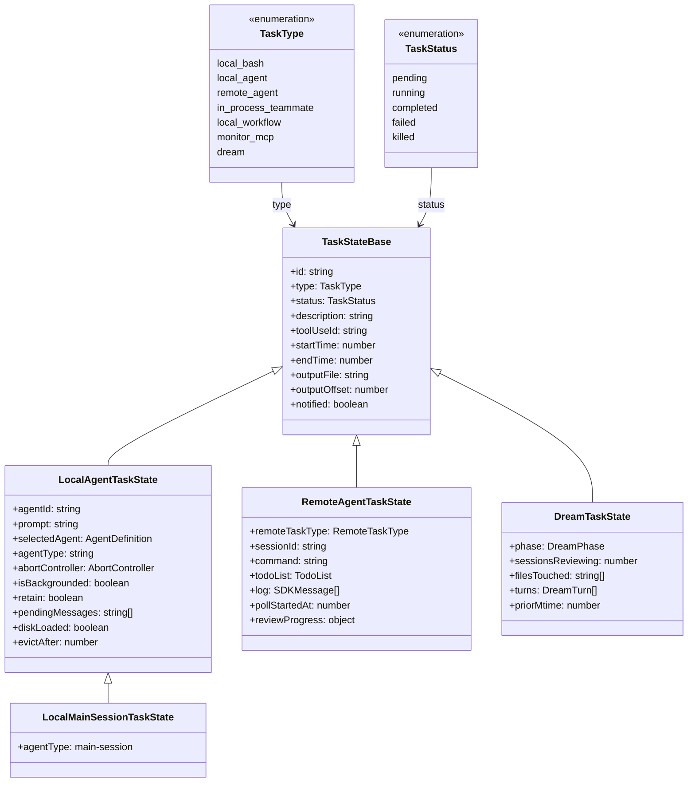
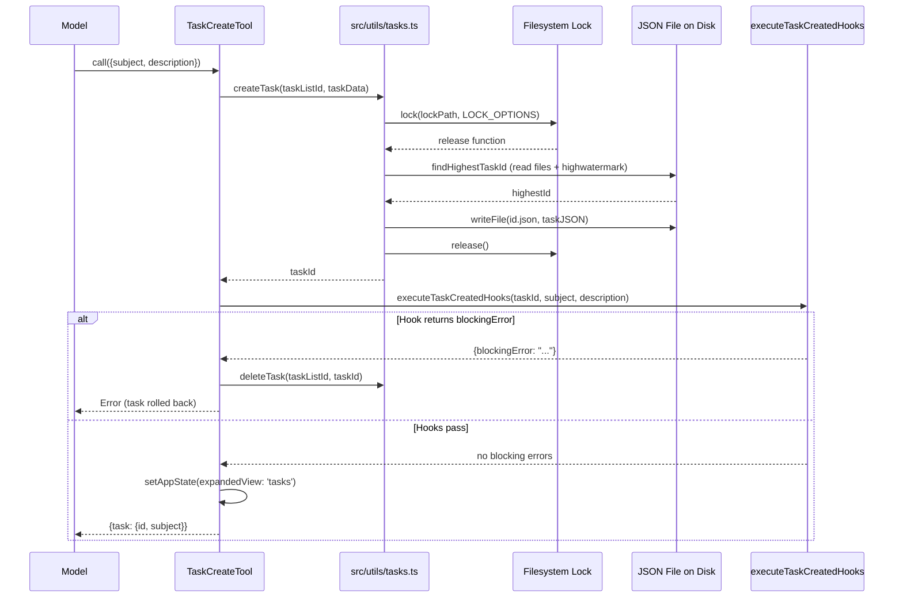

# Tasks: A Durable Unit of Work

## Overview

A task in cc is a durable unit of work with a status lifecycle, blocking relationships, filesystem locking, and one of seven typed implementations. The system spans two layers: a persistent record layer (`src/utils/tasks.ts`) that serializes task metadata to per-file JSON documents on disk, and an in-memory runtime layer (`src/Task.ts`, `src/tasks/`) that tracks live execution state in `AppState.tasks`. The persistent layer backs the model-facing TaskCreate/TaskUpdate/TaskList/TaskGet tools; the runtime layer backs the background execution machinery (agents, shells, remote sessions, dreams). The two layers share a status vocabulary -- `pending`, `in_progress`, `completed` -- but the runtime layer adds `running`, `failed`, and `killed` to model the full lifecycle of executing work. This chapter traces both layers from schema to disk layout to the seven task types that populate them.

The HER (Harness Engineering Report) identifies the one-task-per-session rule as the single most impactful structural constraint for long-running agents (HER section 10.1). When an agent tries to tackle multiple tasks in a single session, it inevitably runs into context limits, loses track of progress on earlier tasks, and produces lower quality work across all tasks. cc's task system provides the scaffolding to enforce this rule: blocking relationships prevent an agent from claiming a task whose prerequisites are unfinished, and the `claimTask` function can atomically refuse to assign a second task to an agent that already owns open work.

The HER section 10.3 prescribes an eight-step session protocol (ORIENT, SETUP, VERIFY, SELECT, IMPLEMENT, TEST, UPDATE, EXIT) that every agent session should follow. The UPDATE step -- updating the task list status and progress notes -- is where the persistent task record and the runtime task state converge. The agent marks its task as `completed` via TaskUpdate, which triggers completion hooks and cascades through the dependency graph, potentially unblocking other agents' work. This chapter shows exactly how that cascade works, from the Zod schema that defines the task shape to the filesystem lock that serializes concurrent mutations.

## Data structures and contracts

The persistent task record is defined by a Zod schema in `src/utils/tasks.ts`. Every task is a JSON file on disk, identified by a monotonically increasing integer ID:

```typescript
// src/utils/tasks.ts:L76-L89 — TaskSchema: persistent task record
export const TaskSchema = lazySchema(() =>
  z.object({
    id: z.string(),
    subject: z.string(),
    description: z.string(),
    activeForm: z.string().optional(),
    owner: z.string().optional(),
    status: TaskStatusSchema(),
    blocks: z.array(z.string()),
    blockedBy: z.array(z.string()),
    metadata: z.record(z.string(), z.unknown()).optional(),
  }),
)
```

The `subject` field is a brief imperative title ("Fix authentication bug"); `activeForm` is its present-continuous form for spinner display ("Fixing authentication bug"). The `blocks` and `blockedBy` arrays encode a directed acyclic graph of dependencies: if task A's `blocks` contains task B's ID, then B's `blockedBy` contains A's ID. The `owner` field tracks which agent has claimed the task. The `metadata` record is an escape hatch for arbitrary key-value data that tools can attach without schema changes.

The `TaskStatusSchema` constrains the persistent status to three values:

```typescript
// src/utils/tasks.ts:L69-L74 — TaskStatusSchema: persistent status enum
export const TASK_STATUSES = ['pending', 'in_progress', 'completed'] as const

export const TaskStatusSchema = lazySchema(() =>
  z.enum(['pending', 'in_progress', 'completed']),
)
```

This three-value enum is the vocabulary that the model-facing tools understand. The `pending` state means the task exists but no agent has started work on it. The `in_progress` state means an agent has claimed and is actively working on the task. The `completed` state means the task is done and any tasks it was blocking may now be claimable.

The runtime task state shares a common base across all seven types:

```typescript
// src/Task.ts:L45-L57 — TaskStateBase: shared runtime fields
export type TaskStateBase = {
  id: string
  type: TaskType
  status: TaskStatus
  description: string
  toolUseId?: string
  startTime: number
  endTime?: number
  totalPausedMs?: number
  outputFile: string
  outputOffset: number
  notified: boolean
}
```

The `notified` field is critical for preventing duplicate notifications. When a task completes, its type-specific completion function sets `notified: true` before enqueuing the XML notification. Any concurrent path that reaches the same task sees the flag and skips, preventing the model from receiving two completion messages for the same work. The `outputFile` and `outputOffset` fields support incremental output streaming: the polling loop in `generateTaskAttachments` reads deltas from the output file starting at `outputOffset`, then advances the offset via `applyTaskOffsetsAndEvictions`.

The `toolUseId` field links the runtime task back to the model's tool-use block. When the model invokes the Agent tool, the resulting `LocalAgentTaskState` carries the tool-use ID so that completion notifications can be correlated with the original request. The `startTime` and `endTime` fields track wall-clock duration, while `totalPausedMs` accounts for time spent in paused states.

The seven task types are enumerated in `src/Task.ts`:

```typescript
// src/Task.ts:L6-L14 — TaskType union: seven runtime task types
export type TaskType =
  | 'local_bash'
  | 'local_agent'
  | 'remote_agent'
  | 'in_process_teammate'
  | 'local_workflow'
  | 'monitor_mcp'
  | 'dream'
```

Each type has a single-character ID prefix for its runtime task ID, assigned by `generateTaskId`:

```typescript
// src/Task.ts:L79-L87 — Task ID prefixes by type
const TASK_ID_PREFIXES: Record<string, string> = {
  local_bash: 'b',
  local_agent: 'a',
  remote_agent: 'r',
  in_process_teammate: 't',
  local_workflow: 'w',
  monitor_mcp: 'm',
  dream: 'd',
}
```

The prefix is followed by 8 random alphanumeric characters drawn from a case-insensitive-safe alphabet of 36 characters (`src/Task.ts:L96`). The combination space is approximately 2.8 trillion, which the comment notes is "sufficient to resist brute-force symlink attacks." This is important because task output files are stored in a project temp directory and accessed via symlinks -- a predictable ID would allow an attacker in the sandbox to create a symlink pointing to an arbitrary file, causing the host process to write to that file.

The runtime status enum extends the persistent one with additional terminal states:

```typescript
// src/Task.ts:L16-L21 — TaskStatus: runtime status lifecycle
export type TaskStatus =
  | 'pending'
  | 'running'
  | 'completed'
  | 'failed'
  | 'killed'
```

The `isTerminalTaskStatus` guard (`src/Task.ts:L27-L29`) returns true for `completed`, `failed`, and `killed`. Terminal tasks are eligible for eviction from `AppState.tasks` once `notified` is true and any panel grace period has expired. The `running` state in the runtime layer corresponds to `in_progress` in the persistent layer -- but this correspondence is not enforced by the system. The two state machines evolve independently, connected only by the convention that when a model-facing tool changes the persistent status, the runtime status should be updated to match.

The `Task` interface defines the polymorphic kill contract that all task types implement:

```typescript
// src/Task.ts:L72-L76 — Task interface: polymorphic kill contract
export type Task = {
  name: string
  type: TaskType
  kill(taskId: string, setAppState: SetAppState): Promise<void>
}
```

Historically the `Task` interface included `spawn` and `render` methods, but these were never called polymorphically and were removed. All seven kill implementations use only `setAppState` -- the `getAppState` and `abortController` parameters were dead weight and were stripped in a refactoring noted in the comment at `src/Task.ts:L70-L71`.



## Control flow

### Task creation and the high-water mark

Creating a persistent task requires acquiring a filesystem lock, reading the highest existing task ID, incrementing it, and writing the new file -- all within the lock's critical section. The lock prevents concurrent cc processes in a swarm from assigning the same ID to two different tasks.

```typescript
// src/utils/tasks.ts:L284-L308 — createTask: locked ID assignment
export async function createTask(
  taskListId: string,
  taskData: Omit<Task, 'id'>,
): Promise<string> {
  const lockPath = await ensureTaskListLockFile(taskListId)

  let release: (() => Promise<void>) | undefined
  try {
    release = await lockfile.lock(lockPath, LOCK_OPTIONS)
    const highestId = await findHighestTaskId(taskListId)
    const id = String(highestId + 1)
    const task: Task = { id, ...taskData }
    const path = getTaskPath(taskListId, id)
    await writeFile(path, jsonStringify(task, null, 2))
    notifyTasksUpdated()
    return id
  } finally {
    if (release) {
      await release()
    }
  }
}
```

The `findHighestTaskId` function takes the maximum of two sources: the highest ID among existing `.json` files in the task directory, and the value stored in a `.highwatermark` file. The high-water mark exists to prevent ID reuse after tasks are deleted or after a swarm reset. When `resetTaskList` is called for a new swarm, it records the current highest ID to the high-water mark file before deleting all task files (`src/utils/tasks.ts:L147-L188`). This ensures that even after a full reset, the next task created will receive an ID strictly greater than any previously used. The high-water mark file is named `.highwatermark` and lives in the same directory as the task files (`src/utils/tasks.ts:L92`).

The lock options are tuned for swarm concurrency: `retries: 30` with a minimum timeout of 5ms and maximum of 100ms, yielding approximately 2.6 seconds of total wait time. The comment at `src/utils/tasks.ts:L99-L108` explains that each critical section does `readdir + N*readFile + writeFile` (roughly 50-100ms on slow disks), so the last caller in a 10-way race needs approximately 900ms. The lock itself is implemented via `proper-lockfile`, which is lazily loaded through a wrapper in `src/utils/lockfile.ts` to avoid paying the ~8ms monkey-patching cost of `graceful-fs` at startup when no locking is needed.

The lock file for list-level operations lives at `.lock` within the task directory. The `ensureTaskListLockFile` function creates it with the `wx` (write-exclusive) flag so that concurrent callers do not both create it and the first one to create wins silently (`src/utils/tasks.ts:L511-L523`). This is required because `proper-lockfile` requires the target file to exist before locking.

### Task claiming with blocking checks

The `claimTask` function in `src/utils/tasks.ts:L541-L612` is the gateway for agents to pick up work. It performs four checks inside the lock: task existence, whether another agent already owns the task, whether the task is already completed, and whether any of its blockers are unresolved. The blocking check resolves the `blockedBy` list against all tasks in the list, filtering for those whose status is not `completed`:

```typescript
// src/utils/tasks.ts:L585-L594 — Blocking check in claimTask
const allTasks = await listTasks(taskListId)
const unresolvedTaskIds = new Set(
  allTasks.filter(t => t.status !== 'completed').map(t => t.id),
)
const blockedByTasks = task.blockedBy.filter(id =>
  unresolvedTaskIds.has(id),
)
if (blockedByTasks.length > 0) {
  return { success: false, reason: 'blocked', task, blockedByTasks }
}
```

This dynamic resolution means that a task can become unblocked mid-session as its prerequisites are completed, without any explicit notification to waiting agents. The next agent that tries to claim the task will find the blocker resolved and the claim will succeed.

When the `checkAgentBusy` option is true, `claimTask` delegates to `claimTaskWithBusyCheck`, which acquires a list-level lock (not a task-level lock) and atomically checks whether the claimant already owns other open tasks. This prevents the time-of-check-to-time-of-use (TOCTOU) race where an agent passes the busy check, then claims a second task before the first claim is recorded. If the agent is busy, the claim fails with reason `agent_busy` and a list of the tasks it already owns (`src/utils/tasks.ts:L661-L674`). This is the mechanism that enforces the one-task-per-session rule from HER section 10.1 at the claim level.

The `ClaimTaskResult` type encodes all possible outcomes:

```typescript
// src/utils/tasks.ts:L488-L499 — ClaimTaskResult: all possible claim outcomes
export type ClaimTaskResult = {
  success: boolean
  reason?:
    | 'task_not_found'
    | 'already_claimed'
    | 'already_resolved'
    | 'blocked'
    | 'agent_busy'
  task?: Task
  busyWithTasks?: string[]
  blockedByTasks?: string[]
}
```

Each reason maps to a distinct failure mode. The `already_claimed` reason fires when another agent owns the task and the claimant is different. The `already_resolved` reason fires when the task is already marked `completed`. The `blocked` and `agent_busy` reasons include additional context (`blockedByTasks` and `busyWithTasks` respectively) so that the calling agent can report exactly which tasks are in the way.

### Task status transitions

```mermaid
stateDiagram-v2
    [*] --> pending : TaskCreate creates task
    pending --> in_progress : TaskUpdate status=in_progress
    pending --> deleted : TaskUpdate status=deleted
    in_progress --> completed : TaskUpdate status=completed
    in_progress --> deleted : TaskUpdate status=deleted
    completed --> [*]
    deleted --> [*]

    state "Runtime (AppState)" as runtime {
        [*] --> running : registerTask
        running --> completed : type-specific completion
        running --> failed : type-specific failure
        running --> killed : TaskStop or ESC
        completed --> [*] : evictTerminalTask
        failed --> [*] : evictTerminalTask
        killed --> [*] : evictTerminalTask
    }
```



The persistent layer and the runtime layer have different state machines. The persistent layer (used by TaskCreate/TaskUpdate/TaskList/TaskGet) transitions through `pending -> in_progress -> completed`, with `deleted` as a special terminal action that removes the task file from disk. The runtime layer adds `running` (the active execution state), `failed` (the task encountered an error), and `killed` (the task was stopped by user action or a parent abort).

The two state machines are connected but not synchronized. A persistent task at `in_progress` corresponds to a runtime task at `running`; the model-facing tools update the persistent record while the type-specific handlers update the runtime state. When TaskUpdateTool marks a task as `completed` (`src/tools/TaskUpdateTool/TaskUpdateTool.ts:L232-L265`), it runs `executeTaskCompletedHooks` before writing the status change. If any hook returns a blocking error, the update is rejected and the task stays at `in_progress`. This hook-based gate gives operators a way to enforce quality gates: a hook can inspect the task's subject and description, run validation checks, and block the transition if the work is incomplete.

The `deleted` status in the TaskUpdateTool is not a true status -- it is an action. When the model sends `status: 'deleted'`, the tool calls `deleteTask`, which removes the task file from disk and cascades through the dependency graph to remove references from other tasks' `blocks` and `blockedBy` arrays (`src/utils/tasks.ts:L393-L441`). Before deleting the file, `deleteTask` updates the high-water mark if the deleted task's ID is higher than the current mark, preserving the monotonic ID guarantee.

### Task creation through the tool pipeline

The TaskCreateTool (`src/tools/TaskCreateTool/TaskCreateTool.ts:L48-L138`) delegates to `createTask` after constructing the initial task data with status `pending` and empty `blocks`/`blockedBy` arrays. After creation, it runs `executeTaskCreatedHooks` -- if any hook returns a blocking error, the newly created task is immediately deleted via `deleteTask`. This two-phase approach (create, then validate via hooks, then possibly rollback) avoids the complexity of pre-validation while still giving hooks a veto.



The tool is marked `shouldDefer: true`, meaning it is not loaded into the model's tool list at session start but is discovered on-demand via ToolSearch. This follows the progressive tool expansion pattern (see Chapter 17 on ToolSearch). The tool is also marked `isConcurrencySafe() { return true }`, indicating that multiple concurrent invocations are safe -- which they are, because the filesystem lock serializes concurrent `createTask` calls.

After a successful creation, the tool auto-expands the task list view in the UI by setting `expandedView: 'tasks'` in `AppState` (`src/tools/TaskCreateTool/TaskCreateTool.ts:L116-L119`). This gives the user immediate visibility into the newly created task.

### Task update and blocking relationships

The TaskUpdateTool (`src/tools/TaskUpdateTool/TaskUpdateTool.ts`) handles status transitions, ownership changes, dependency edges, and metadata merges. When adding blocking relationships via `addBlocks` or `addBlockedBy`, it calls `blockTask` for each new edge, which updates both the source task's `blocks` array and the target task's `blockedBy` array (`src/utils/tasks.ts:L458-L486`). The bidirectional update ensures the dependency graph is always consistent: if task A blocks task B, then B's `blockedBy` contains A and A's `blocks` contains B.

Ownership changes trigger a mailbox notification in swarm mode. When `updates.owner` is set and `isAgentSwarmsEnabled()` returns true, TaskUpdateTool writes a JSON-structured assignment message to the new owner's mailbox via `writeToMailbox` (`src/tools/TaskUpdateTool/TaskUpdateTool.ts:L277-L298`). The message includes the task ID, subject, description, the assigning agent's name, and a timestamp. This allows teammates to discover newly assigned work without polling the task list.

The `metadata` merge logic in TaskUpdateTool follows a null-as-delete convention: if a key's value is `null`, the key is removed from the metadata object; otherwise, the key is set to the provided value (`src/tools/TaskUpdateTool/TaskUpdateTool.ts:L200-L211`). This allows the model to both add and remove metadata entries in a single update call.

The tool also includes a structural verification nudge: when the main-thread agent completes a task and all tasks in the list are done (3 or more tasks, none containing "verif" in the subject), the tool result includes a reminder to spawn the verification agent (`src/tools/TaskUpdateTool/TaskUpdateTool.ts:L333-L349`). This catches the common failure mode where an agent closes out a multi-task list without performing independent verification. The nudge is gated behind two feature flags (`feature('VERIFICATION_AGENT')` and `getFeatureValue_CACHED_MAY_BE_STALE('tengu_hive_evidence', false)`) and only fires for main-thread agents (where `context.agentId` is falsy), not for subagents.

When a teammate completes a task in swarm mode, the tool result appends a prompt to call TaskList next: "Task completed. Call TaskList now to find your next available task or see if your work unblocked others." (`src/tools/TaskUpdateTool/TaskUpdateTool.ts:L388-L394`). This reinforces the session protocol from HER section 10.3, where the UPDATE step should be followed by checking for newly available work.

### The seven task types in action

**Local bash** (`local_bash`): Background shell commands registered with a `b` prefix. These track an executing bash process with its stdout/stderr streams, exit code, and optional timeout. The kill path sends SIGTERM to the child process. The output file stores the raw stdout and stderr of the command, accessible via TaskOutputTool.

**Local agent** (`local_agent`): Background agent execution registered with an `a` prefix. This is the workhorse type for subagent dispatch. The `LocalAgentTaskState` extends `TaskStateBase` with fields for the agent ID, prompt, selected agent definition, abort controller, progress tracking, and a `retain` flag that prevents eviction when the UI is holding the task in a panel view (`src/tasks/LocalAgentTask/LocalAgentTask.tsx:L116-L148`). The progress tracker (`createProgressTracker` at `src/tasks/LocalAgentTask/LocalAgentTask.tsx:L50-L57`) records tool-use counts, cumulative token usage, and the five most recent tool activities. The `isBackgrounded` field distinguishes tasks running behind the user's view from those foregrounded in the main REPL area.

The `LocalAgentTask` type implements the `Task` kill contract:

```typescript
// src/tasks/LocalAgentTask/LocalAgentTask.tsx:L270-L276 — LocalAgentTask kill implementation
export const LocalAgentTask: Task = {
  name: 'LocalAgentTask',
  type: 'local_agent',
  async kill(taskId, setAppState) {
    killAsyncAgent(taskId, setAppState);
  }
};
```

The `killAsyncAgent` function (`src/tasks/LocalAgentTask/LocalAgentTask.tsx:L281-L303`) sets the task's status to `killed`, aborts the `abortController`, unregisters the cleanup callback, and sets `evictAfter` to `Date.now() + PANEL_GRACE_MS` (30 seconds). The `selectedAgent` field is cleared to release the reference to the agent definition. If the task is already in a non-running state, the kill is a no-op -- the function checks `task.status !== 'running'` and returns the unchanged task.

**Remote agent** (`remote_agent`): Cloud-executed agents registered with an `r` prefix. The `RemoteAgentTaskState` carries a `sessionId` for the CCR (Claude Code Remote) session, a `remoteTaskType` discriminating among `remote-agent`, `ultraplan`, `ultrareview`, `autofix-pr`, and `background-pr`, and a `log` array of SDK messages received from polling (`src/tasks/RemoteAgentTask/RemoteAgentTask.tsx:L22-L59`). Remote tasks use a polling model rather than streaming: `startRemoteSessionPolling` fetches session events at one-second intervals and appends them to the log. The polling loop handles several completion signals: the session status flipping to `archived`, a `result` event in the log, a completion checker registered for the specific `remoteTaskType`, or a stable-idle detection for remote reviews. On completion, the task enqueues a notification that either contains the extracted review content inline or points to the output file path.

Remote tasks persist metadata to the session sidecar so they can survive `--resume`. The `persistRemoteAgentMetadata` function writes a `RemoteAgentMetadata` record that includes the task ID, remote task type, session ID, title, command, spawn timestamp, and tool-use ID (`src/tasks/RemoteAgentTask/RemoteAgentTask.tsx:L386-L466`). On resume, `restoreRemoteAgentTasks` reads the sidecar, fetches live CCR status for each entry, reconstructs the `RemoteAgentTaskState` into `AppState.tasks`, and restarts polling for sessions that are still running. Sessions that return 404 or are archived have their sidecar entry removed.

**In-process teammate** (`in_process_teammate`): Tasks for teammates running as subagents within the same process, with a `t` prefix. These share the `LocalAgentTaskState` structure but are distinguished by their `agentType` field. In-process teammates participate in the same task list as the leader and other teammates, allowing the swarm to coordinate work through the shared persistent task directory.

**Local workflow** (`local_workflow`): Tasks for multi-step workflow execution, registered with a `w` prefix. These orchestrate a sequence of tool calls as a single atomic unit.

**Monitor MCP** (`monitor_mcp`): Tasks that watch MCP server resources, registered with an `m` prefix. These are long-lived polling loops that surface MCP resource changes as task output.

**Dream** (`dream`): Memory consolidation subagents registered with a `d` prefix. The `DreamTaskState` is the simplest of the seven types, tracking only a `phase` (starting or updating), the number of sessions being reviewed, a list of files touched, and a capped list of recent turns (`src/tasks/DreamTask/DreamTask.ts:L25-L41`). The dream task's kill path is notable: it rewinds the consolidation lock's mtime to the value stored in `priorMtime`, allowing the next session to retry consolidation (`src/tasks/DreamTask/DreamTask.ts:L136-L156`). This is a form of checkpoint-restore (HER section 6.16) applied to the lock file's timestamp -- the side effect (setting the mtime) is explicitly reversed on kill.

**Local main session** (`local_agent` with `agentType: 'main-session'`): A special subtype of local_agent that handles backgrounding the user's own session when they press Ctrl+B twice. It uses the `s` prefix for task IDs (`src/tasks/LocalMainSessionTask.ts:L75-L82`) and adds a `foregroundMainSessionTask` function that swaps the `isBackgrounded` flag and restores any previously foregrounded task to the background (`src/tasks/LocalMainSessionTask.ts:L270-L302`). When a background session completes, `completeMainSessionTask` checks whether the task was still backgrounded -- if the user foregrounded it, no notification is needed because the user is watching directly (`src/tasks/LocalMainSessionTask.ts:L172-L219`).

### Task storage paths and list identity

Every task list lives under `~/.claude/tasks/<taskListId>/`, where `taskListId` is determined by `getTaskListId()` (`src/utils/tasks.ts:L199-L210`). The resolution priority is: explicit `CLAUDE_CODE_TASK_LIST_ID` environment variable, in-process teammate context (which uses the leader's team name), `CLAUDE_CODE_TEAM_NAME` environment variable, the leader team name set via `setLeaderTeamName`, and finally the session ID as a fallback. This tiered resolution ensures that all agents in a swarm share the same task list directory, regardless of whether they are in-process teammates or process-based teammates connected via tmux/iTerm2.

Individual task files are stored as `<taskId>.json` within the task list directory. The file name is sanitized through `sanitizePathComponent`, which replaces any character outside `[a-zA-Z0-9_-]` with a hyphen (`src/utils/tasks.ts:L217-L219`). The lock file for list-level operations lives at `.lock` within the same directory, created with the `wx` (write-exclusive) flag to prevent concurrent creation races.

Runtime task output files are stored separately from persistent task records. The `getTaskOutputDir` function returns a path under the project temp directory that includes the session ID: `<projectTempDir>/<sessionId>/tasks/` (`src/utils/task/diskOutput.ts:L49-L55`). Each task's output is stored as `<taskId>.output` in this directory. The session ID is captured at first call, not re-read on every invocation, because `/clear` calls `regenerateSessionId()` which would otherwise create a new-session path while existing task output instances still hold old-session paths. The output file is opened with the `O_NOFOLLOW` flag on Unix systems to prevent symlink attacks -- without this, an attacker in the sandbox could create symlinks pointing to arbitrary files, causing the host process to write to those files (`src/utils/task/diskOutput.ts:L17-L21`).

### The notification and eviction pipeline

When a runtime task completes, fails, or is killed, the type-specific completion function sets the status and `notified` flag in `AppState`, then enqueues an XML notification via `enqueuePendingNotification`. The notification follows a structured format using XML tags defined in `src/constants/xml.ts`:

```typescript
// src/tasks/LocalAgentTask/LocalAgentTask.tsx:L246-L261 — Agent notification format
const message = `<${TASK_NOTIFICATION_TAG}>
<${TASK_ID_TAG}>${taskId}</${TASK_ID_TAG}>${toolUseIdLine}
<${OUTPUT_FILE_TAG}>${outputPath}</${OUTPUT_FILE_TAG}>
<${STATUS_TAG}>${status}</${STATUS_TAG}>
<${SUMMARY_TAG}>${summary}</${SUMMARY_TAG}>${resultSection}${usageSection}${worktreeSection}
</${TASK_NOTIFICATION_TAG}>`;
```

The notification includes the task ID, the output file path (so the model can read the result), the status, a human-readable summary, and optional sections for the result text, usage statistics, and worktree information. This XML format is consumed by the model on its next turn, allowing it to discover that a background task has completed and read the output.

The eviction pipeline runs in `generateTaskAttachments` (`src/utils/task/framework.ts:L158-L206`). It iterates over all tasks in `AppState.tasks` and checks for terminal tasks with `notified: true`. These are collected as `evictedTaskIds` and removed from the state by `applyTaskOffsetsAndEvictions`. For running tasks, it reads output deltas from the task's output file starting at `outputOffset` and collects the new offset values. The eviction and offset updates are applied atomically against the fresh `AppState` -- not the stale snapshot from before the async disk reads -- so concurrent status transitions are not clobbered.

The `PANEL_GRACE_MS` constant (30 seconds, defined at `src/utils/task/framework.ts:L28`) delays eviction of terminal `LocalAgentTaskState` tasks. When a task transitions to a terminal state, `evictAfter` is set to `Date.now() + PANEL_GRACE_MS`. The eviction check in `evictTerminalTask` compares `evictAfter` (defaulting to `Infinity` if not set) against `Date.now()` and skips eviction if the deadline has not passed (`src/utils/task/framework.ts:L125-L144`). The `retain` flag overrides this entirely: a retained task is never evicted, because the UI is actively displaying it.

### The signal-based update mechanism

The persistent task layer uses a signal-based notification system to trigger immediate UI refreshes in the same process. The `tasksUpdated` signal is created via `createSignal` at `src/utils/tasks.ts:L18` and exposed through `onTasksUpdated` for subscription. Every mutation function (`createTask`, `updateTask`, `deleteTask`, `resetTaskList`) calls `notifyTasksUpdated` after completing its work, which emits the signal. The `setLeaderTeamName` and `clearLeaderTeamName` functions also call `notifyTasksUpdated` because changing the task list ID means subscribers are now looking at a different directory.

## Edge cases and failure modes

**Lock contention in swarms.** The `LOCK_OPTIONS` retries are tuned for approximately 10 concurrent agents, but larger swarms may exhaust the 30-retry budget. When all retries are spent, `lockfile.lock` throws, and the calling `createTask` or `claimTask` propagates the error. The `createTask` function does not catch this throw; it relies on the caller (TaskCreateTool) to handle it, which surfaces the error to the model as a tool failure. In practice, the backoff parameters (5ms minimum, 100ms maximum) mean that 30 retries covers about 2.6 seconds of waiting, which is generous for typical disk I/O but may be insufficient on network-mounted home directories.

**ID reuse after reset.** The high-water mark prevents the most common form of ID reuse, but it is not a guarantee against all forms. If a process crashes after creating a task file but before the file is flushed to disk, the high-water mark may not reflect the assigned ID. The `resetTaskList` function mitigates this by reading the highest ID from existing files before writing the high-water mark and deleting the files (`src/utils/tasks.ts:L156-L163`). However, if the crash occurs between the `writeFile` and the `readdir`, the mark may be stale.

**Status migration.** The `getTask` function includes a temporary migration path for old status names (`src/utils/tasks.ts:L319-L331`). When `USER_TYPE === 'ant'`, it maps `open` to `pending`, `resolved` to `completed`, and development-specific statuses (`planning`, `implementing`, `reviewing`, `verifying`) to `in_progress`. This migration is applied on read rather than on write, which means the disk file retains the old status name until the next `updateTask` call overwrites it. The migration is gated behind `USER_TYPE` to avoid affecting non-ant sessions.

**Duplicate notifications.** The `notified` flag is the primary defense against duplicate task completion notifications. Every type-specific completion function (`completeAgentTask`, `completeDreamTask`, `completeMainSessionTask`) sets `notified: true` inside an `updateTaskState` callback that first checks whether the flag is already set. The `enqueueAgentNotification` function in `LocalAgentTask.tsx` performs its own atomic check-and-set (`src/tasks/LocalAgentTask/LocalAgentTask.tsx:L224-L240`): it reads `task.notified`, and if false, sets it to true and returns `shouldEnqueue = true`. This double-guard (type-specific completion plus notification enqueue) prevents races where two code paths try to notify about the same task completion simultaneously.

**Eviction races.** The eviction pipeline reads task state, then performs async disk I/O to read output deltas, then writes back updated offsets. During the async gap, a task may transition from `running` to `completed`. The `applyTaskOffsetsAndEvictions` function re-checks the task's status on the fresh `AppState` before applying offset updates, and skips the update if the task is no longer running (`src/utils/task/framework.ts:L229-L231`). Similarly, eviction re-checks that the task is terminal and notified before removing it from the state (`src/utils/task/framework.ts:L238-L244`). This TOCTOU defense prevents the pipeline from clobbering a status transition that occurred during the async gap.

**Task deletion cascades.** When a task is deleted via `deleteTask` (`src/utils/tasks.ts:L393-L441`), the function removes the task file and then scans all remaining tasks to clean up any `blocks` or `blockedBy` references pointing to the deleted task. This is an O(N) operation over all tasks in the list, which is acceptable for typical list sizes but could become slow for lists with thousands of tasks. The function also updates the high-water mark before deleting the file to prevent ID reuse.

**Unassigning teammate tasks.** When a teammate is killed or shuts down, `unassignTeammateTasks` (`src/utils/tasks.ts:L818-L860`) resets all of that teammate's open tasks to `pending` with `owner: undefined`. This makes the tasks available for other agents to claim. The function matches on both the teammate's ID and name for backward compatibility. It returns a notification message listing the unassigned tasks, which is broadcast to the remaining team with instructions to use TaskList and TaskUpdate to reassign them.

**Remote review idle detection.** Remote sessions briefly flip to `idle` between every tool turn, so a single idle observation does not indicate completion. The polling loop requires `STABLE_IDLE_POLLS` (5) consecutive idle polls with no log growth before treating a remote review as complete (`src/tasks/RemoteAgentTask/RemoteAgentTask.tsx:L545-L666`). For bughunter-mode reviews, the session is idle the entire time the hook runs, so stable-idle never fires. Instead, the completion signal is the presence of a `<remote-review>` tag in the hook output, detected by `extractReviewTagFromLog`.

**Disk output truncation.** The `DiskTaskOutput` class enforces a 5GB cap on task output files (`src/utils/task/diskOutput.ts:L30-L31`). When the estimated byte count exceeds the cap, the `append` method sets a `#capped` flag and appends a truncation notice instead of the content (`src/utils/task/diskOutput.ts:L111-L124`). The estimate uses `content.length` (UTF-16 code units) which undercounts UTF-8 bytes by at most 3x, but is acceptable for a coarse disk-fill guard that avoids re-scanning every chunk.

## Where cc diverges from the published pattern

The HER section 8.2 identifies a three-file state pattern for session continuity: `tasks.json` (structured task list), `progress.txt` (human-readable notes), and `AGENTS.md` (discovered patterns). cc's implementation diverges from this pattern in several ways.

First, cc uses per-task JSON files rather than a single `tasks.json`. Each task is stored as `~/.claude/tasks/<taskListId>/<id>.json`, written with pretty-printed JSON (`jsonStringify(task, null, 2)` at `src/utils/tasks.ts:L300`). This file-per-task layout enables concurrent access via file-level locking, which would be impossible with a single monolithic file. The trade-off is that listing all tasks requires reading every file in the directory, which the `listTasks` function does with `Promise.all` over individual `getTask` calls (`src/utils/tasks.ts:L443-L456`). The `isTodoV2Enabled` gate at `src/utils/tasks.ts:L133-L139` controls whether the task tools are available -- in non-interactive SDK sessions, they are only enabled when the `CLAUDE_CODE_ENABLE_TASKS` environment variable is set, because SDK users may prefer the lighter TodoWrite tool.

Second, cc does not maintain a separate `progress.txt` file. Instead, progress is tracked in-memory through the `AgentProgress` type in `LocalAgentTaskState` and persisted to the task's output file (a symlink to the agent's session transcript). The `updateAgentSummary` function (`src/tasks/LocalAgentTask/LocalAgentTask.tsx:L359-L407`) periodically writes a 1-2 sentence summary to `task.progress.summary`, but this summary lives in `AppState` and is not written to a standalone progress file. The HER's `progress.txt` serves as a human-readable handoff document between sessions; cc relies on the session transcript and memory system (see Chapter 18 on memdir) for this purpose instead.

Third, the HER recommends boolean pass/fail status and append-only constraints for task lists, noting that JSON with boolean status prevents ambiguous "partial" states and append-only prevents the agent from "editing away" failures. cc's `TaskStatus` is not boolean: it uses a three-value persistent enum (`pending`, `in_progress`, `completed`) and a five-value runtime enum (adding `running`, `failed`, `killed`). The `in_progress` status is inherently a "partial" state, and the `TaskUpdateTool` allows the model to change any field including status and description. The `deleted` status action permits complete removal of task records, which is the opposite of append-only. However, the high-water mark does preserve the monotonic ID sequence even after deletion, providing a partial append-only guarantee for the ID namespace.

Fourth, cc's blocking relationships are more expressive than the simple dependency graphs described in the HER. The `claimTask` function resolves blocking relationships dynamically: a task is blocked if any of its `blockedBy` tasks have a status other than `completed` (`src/utils/tasks.ts:L586-L594`). This means that a task can become unblocked mid-session as its prerequisites are completed, without any explicit notification -- the next agent that tries to claim it will find the blocker resolved.

Fifth, the HER section 10.3 prescribes an eight-step session protocol (ORIENT, SETUP, VERIFY, SELECT, IMPLEMENT, TEST, UPDATE, EXIT). cc's task system does not enforce this protocol at the framework level. The TaskCreate and TaskUpdate tools are stateless: the model decides when to create tasks, when to claim them, and when to mark them complete. The verification nudge in TaskUpdateTool (`src/tools/TaskUpdateTool/TaskUpdateTool.ts:L333-L349`) is a soft enforcement mechanism -- it reminds the model to verify after closing a multi-task list -- but it is advisory, not mandatory. The protocol relies on the model's compliance with the tool prompts rather than structural enforcement.

Sixth, the HER's Three-File State Pattern includes `AGENTS.md` for discovered patterns and conventions. cc uses the memory system (memdir) for this purpose, which provides structured memory records with frontmatter schemas and tiered storage (user, feedback, project, reference). The task system does not have a built-in mechanism for recording patterns; this responsibility falls to the memory system and CLAUDE.md files.

## Developer takeaways for building a long-running agent

The task system reveals a design principle that applies to any harness managing durable work: separate the record layer from the execution layer and connect them with a narrow shared vocabulary. In cc, the persistent layer speaks `pending/in_progress/completed` while the runtime layer speaks `pending/running/completed/failed/killed`. The mapping between them is not one-to-one -- `in_progress` in the record corresponds to `running` in the runtime, and the runtime's `failed` and `killed` have no persistent representation. This separation allows the record layer to remain simple and crash-resilient (each task is a single JSON file that can be recovered after a crash) while the runtime layer can model the full complexity of execution lifecycle. Filesystem locking with retry-based backoff is the correct primitive for multi-process coordination when you cannot assume a database -- the lock protects the critical section of ID assignment, and the high-water mark prevents ID reuse across resets. The `notified` flag pattern -- an atomic check-and-set that gates side-effect-producing operations like notification enqueue -- is essential for preventing duplicate work in systems where multiple code paths can observe the same state transition. Finally, the blocking relationship model, where dependencies are resolved dynamically at claim time rather than enforced statically, provides the right balance of safety and flexibility: it prevents agents from claiming blocked work while allowing the task graph to evolve as work progresses.
