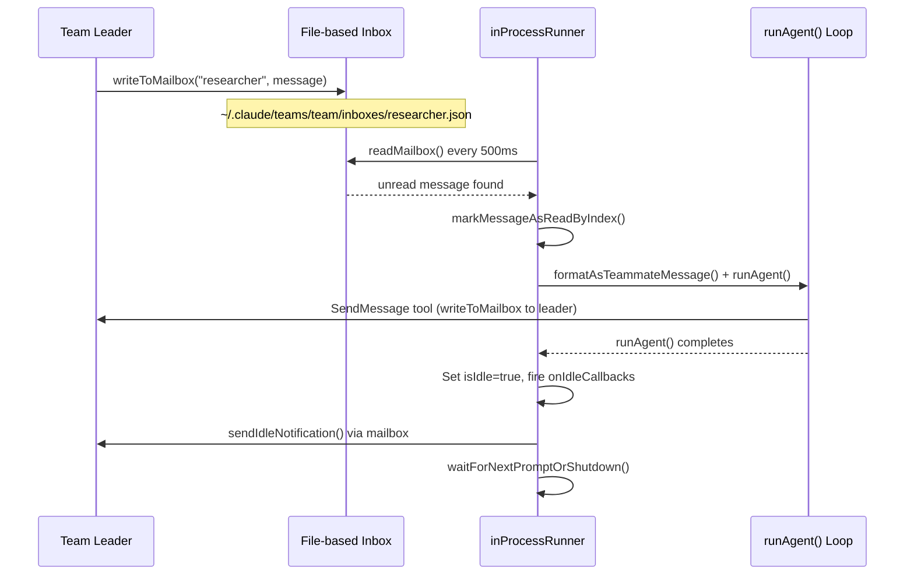
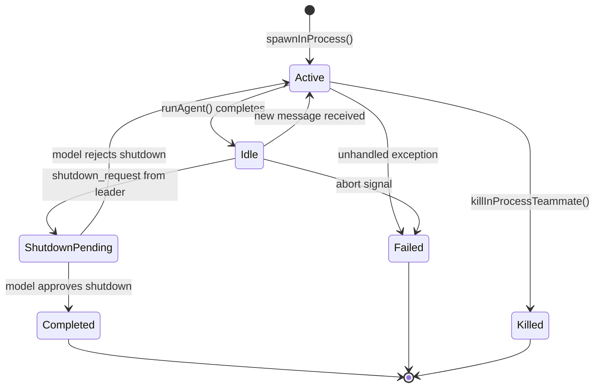

# Teammates and In-Process Collaboration

## Overview

cc's teammate system enables multiple agent instances to collaborate within a single process. Unlike the subagent pattern (see Chapter 22 on the Agent tool), teammates are long-lived, addressable by name, and communicate through a file-based mailbox system. They occupy the in-process tier of HER's subagent hierarchy: same Node.js process, isolated context windows via `AsyncLocalStorage`, direct invocation with structured result return, and application-level context isolation enforcement (HER 9.1). The key architectural distinction is persistence -- a subagent executes one task and returns one result, while a teammate runs a continuous loop that alternates between active processing and idle waiting, accepting multiple prompts over its lifetime.

The collaboration surface centers on the SendMessage tool, which provides directed messaging, broadcast, structured protocol messages (shutdown requests, plan approvals, permission delegation), and cross-session bridging. Beneath the tool sits the teammateMailbox module, which implements a file-based inbox with locking for concurrent access. Above the tool sits the inProcessRunner, which drives each teammate's prompt loop, manages idle notifications, and routes incoming messages back into the agent's context window.

Session hooks (as defined in sessionHooks.ts) provide a complementary mechanism: ephemeral, in-memory lifecycle callbacks that teammates and the leader use for validation gating, tool interception, and permission synchronization without touching the persisted settings.json layer. Together, these three subsystems -- messaging, runner, and hooks -- form the collaboration fabric that allows N agent instances to share a single Node.js process while remaining isolated in their context windows and independently addressable.

## Data structures and contracts

The teammate identity and lifecycle state are captured in `InProcessTeammateTaskState`:

```typescript
// src/tasks/InProcessTeammateTask/types.ts:L22-L76 — InProcessTeammateTaskState definition
export type InProcessTeammateTaskState = TaskStateBase & {
  type: 'in_process_teammate'

  // Identity as sub-object (matches TeammateContext shape for consistency)
  // Stored as plain data in AppState, NOT a reference to AsyncLocalStorage
  identity: TeammateIdentity

  // Execution
  prompt: string
  model?: string
  selectedAgent?: AgentDefinition
  abortController?: AbortController // Runtime only, not serialized to disk - kills WHOLE teammate
  currentWorkAbortController?: AbortController // Runtime only - aborts current turn without killing teammate
  unregisterCleanup?: () => void // Runtime only

  // Plan mode approval tracking (planModeRequired is in identity)
  awaitingPlanApproval: boolean

  // Permission mode for this teammate (cycled independently via Shift+Tab when viewing)
  permissionMode: PermissionMode

  // State
  error?: string
  result?: AgentToolResult
  progress?: AgentProgress

  // Conversation history for zoomed view (NOT mailbox messages)
  // Mailbox messages are stored separately in teamContext.inProcessMailboxes
  messages?: Message[]

  inProgressToolUseIDs?: Set<string>

  // Queue of user messages to deliver when viewing teammate transcript
  pendingUserMessages: string[]

  spinnerVerb?: string
  pastTenseVerb?: string

  // Lifecycle
  isIdle: boolean
  shutdownRequested: boolean

  // Callbacks to notify when teammate becomes idle (runtime only)
  // Used by leader to efficiently wait without polling
  onIdleCallbacks?: Array<() => void>

  // Progress tracking (for computing deltas in notifications)
  lastReportedToolCount: number
  lastReportedTokenCount: number
}
```

The `identity` field carries the `TeammateIdentity` sub-object (`src/tasks/InProcessTeammateTask/types.ts:L13-L20`), which binds the teammate to a team via `agentId` (formatted as `agentName@teamName`), tracks its `parentSessionId` (the leader's session), and records `planModeRequired` and `color`. Two separate abort controllers enable layered cancellation: `abortController` kills the entire teammate, while `currentWorkAbortController` aborts only the current turn (triggered by Escape during a tool call), returning the teammate to idle without destroying it. The `isIdle` boolean and `onIdleCallbacks` array form a simple signal mechanism -- the leader can register a callback to be invoked the moment a teammate becomes available, avoiding the need to poll.

The mailbox message contract is defined in `TeammateMessage`:

```typescript
// src/utils/teammateMailbox.ts:L43-L50 — TeammateMessage type
export type TeammateMessage = {
  from: string
  text: string
  timestamp: string
  read: boolean
  color?: string // Sender's assigned color (e.g., 'red', 'blue', 'green')
  summary?: string // 5-10 word summary shown as preview in the UI
}
```

Each inbox is a JSON file at `~/.claude/teams/{team_name}/inboxes/{agent_name}.json`, protected by a `.lock` file with retry-based backoff (10 retries, 5--100 ms jitter) to serialize concurrent writes from multiple agents in a swarm. The inbox path is constructed by `getInboxPath` (`src/utils/teammateMailbox.ts:L56-L66`), which sanitizes both the team name and agent name through `sanitizePathComponent` before joining them under `getTeamsDir()`. The `read` boolean on each message supports the poll-and-mark-read consumption model used by the idle loop.

The idle notification type extends the mailbox protocol beyond simple text messages:

```typescript
// src/utils/teammateMailbox.ts:L394-L405 — IdleNotificationMessage type
export type IdleNotificationMessage = {
  type: 'idle_notification'
  from: string
  timestamp: string
  /** Why the agent went idle */
  idleReason?: 'available' | 'interrupted' | 'failed'
  /** Brief summary of the last DM sent this turn (if any) */
  summary?: string
  completedTaskId?: string
  completedStatus?: 'resolved' | 'blocked' | 'failed'
  failureReason?: string
}
```

The `idleReason` discriminant tells the leader why the teammate stopped: `available` means normal completion, `interrupted` means the user pressed Escape during the turn, and `failed` means an unhandled exception terminated the agent loop. The `summary` field carries the last peer DM summary extracted by `getLastPeerDmSummary` (`src/utils/teammateMailbox.ts:L1149-L1183`), which scans the message history backwards from the last assistant turn, looking for a SendMessage tool_use that targeted a peer (not the team lead), and extracts the `[to {name}] {summary}` string.

## Control flow

The teammate's life is a loop driven by `runInProcessTeammate` in `src/utils/swarm/inProcessRunner.ts`. Each iteration runs `runAgent()` (the same core function used by the Agent tool for subagents) within the teammate's `AsyncLocalStorage` context, then transitions to idle, sends a notification, and waits for the next prompt or shutdown request.



The sequence begins when the leader writes a message to the teammate's inbox via `writeToMailbox` (`src/utils/teammateMailbox.ts:L134-L192`). The write operation first ensures the inbox directory exists via `ensureInboxDir`, then creates the inbox file with `flag: 'wx'` (exclusive create, failing silently if the file already exists), acquires a file lock, re-reads the current messages, appends the new message with `read: false`, and writes the entire array back. The lock uses retry-based backoff because multiple agents in a swarm may attempt concurrent writes to the same inbox, and the async lock API requires explicit retries to achieve the same serialization semantics as the synchronous alternative.

The `inProcessRunner` polls the mailbox every 500 ms inside `waitForNextPromptOrShutdown` (`src/utils/swarm/inProcessRunner.ts:L689-L868`). Before checking the mailbox, the poll loop first checks the in-memory `pendingUserMessages` queue on the task object (`src/utils/swarm/inProcessRunner.ts:L706-L738`). These are messages injected by the user while viewing the teammate's transcript in the UI, delivered via `injectUserMessageToTeammate` (`src/tasks/InProcessTeammateTask/InProcessTeammateTask.tsx:L68-L84`). In-memory messages are consumed immediately without waiting for the poll interval, giving interactive messages priority over mailbox deliveries.

Shutdown requests are prioritized over regular messages to prevent starvation: the poll loop scans all unread messages for `shutdown_request` type before falling back to FIFO ordering, with team-lead messages taking precedence over peer messages (`src/utils/swarm/inProcessRunner.ts:L806-L844`). The priority order is: shutdown requests first, then team-lead messages, then first-unread peer message. This prevents a scenario where peer-to-peer chatter fills the inbox faster than the teammate can process it, indefinitely delaying either a shutdown or a directive from the leader.

When a message is found, the runner marks it read, formats it as a `<teammate-message>` XML tag, and feeds it as the next prompt to `runAgent()`. The agent loop processes it through the normal query pipeline (tool dispatch, model call, streaming). When `runAgent()` yields its final message, the runner sets `isIdle: true` and fires any registered `onIdleCallbacks`:

```typescript
// src/utils/swarm/inProcessRunner.ts:L1317-L1326 — Idle transition and callback dispatch
      // Mark task as idle (NOT completed) and notify any waiters
      updateTaskState(
        taskId,
        task => {
          // Call any registered idle callbacks
          task.onIdleCallbacks?.forEach(cb => cb())
          return { ...task, isIdle: true, onIdleCallbacks: [] }
        },
        setAppState,
      )
```

The `onIdleCallbacks` mechanism is critical for efficiency. Without it, the leader would need to poll `isIdle` on a timer. With it, any component that needs to know when a teammate finishes can register a callback (a zero-argument function) that fires synchronously inside the `updateTaskState` call. The callbacks are cleared after dispatch so they fire exactly once. This pattern replaces what would otherwise be a polling loop with a one-shot event -- the same principle as `Promise` resolution, but integrated into the AppState mutation pipeline.

Before each iteration of the agent loop, the runner checks whether compaction is needed by estimating the token count of `allMessages`. If it exceeds the auto-compact threshold, the runner creates an isolated copy of the `ToolUseContext` (to avoid polluting the leader's `readFileState` cache or triggering its UI callbacks) and runs `compactConversation` on the full message history (`src/utils/swarm/inProcessRunner.ts:L1072-L1126`). The compacted summary replaces `allMessages` in place, and the task's `messages` array is also replaced to prevent the AppState mirror from growing unbounded. A per-teammate content replacement state is also reset on compaction, because the compacted messages have different tool_use_ids than the originals, and stale Map entries would accumulate memory over long runs.

The `runAgent()` call itself is wrapped in two nested context layers: `runWithTeammateContext` establishes the teammate's `AsyncLocalStorage` slot (carrying `agentId`, `teamName`, `color`, and other identity fields), and `runWithAgentContext` establishes the agent analytics context (`src/utils/swarm/inProcessRunner.ts:L1160-L1161`). These contexts are what allow the teammate to call `getAgentName()` or `getTeamName()` from anywhere in the call stack and receive its own identity rather than the leader's.

The SendMessage tool itself (`src/tools/SendMessageTool/SendMessageTool.ts`) is the outward-facing API. Its `call()` method routes based on the `to` field and message type. For in-process teammates addressed by name, it first checks the `agentNameRegistry` in AppState, then falls back to `toAgentId()`:

```typescript
// src/tools/SendMessageTool/SendMessageTool.ts:L802-L821 — In-process teammate message routing
      if (typeof input.message === 'string' && input.to !== '*') {
        const appState = context.getAppState()
        const registered = appState.agentNameRegistry.get(input.to)
        const agentId = registered ?? toAgentId(input.to)
        if (agentId) {
          const task = appState.tasks[agentId]
          if (isLocalAgentTask(task) && !isMainSessionTask(task)) {
            if (task.status === 'running') {
              queuePendingMessage(
                agentId,
                input.message,
                context.setAppStateForTasks ?? context.setAppState,
              )
              return {
                data: {
                  success: true,
                  message: `Message queued for delivery to ${input.to} at its next tool round.`,
                },
              }
            }
```

For running agents, `queuePendingMessage` (`src/tasks/LocalAgentTask/LocalAgentTask.tsx:L162-L167`) appends to the task's `pendingMessages` array in AppState, which the agent's next tool round will pick up. For stopped agents, the tool auto-resumes them via `resumeAgentBackground`, injecting the message as the resumption prompt. This auto-resume behavior is a significant departure from the simpler subagent model: a teammate never truly dies until its abort controller fires -- it can be woken from any stopped state.

The structured message protocol handles shutdown and plan approval flows. A `shutdown_request` from the leader arrives in the teammate's inbox, is prioritized by the poll loop, and is forwarded to the model as a formatted prompt. The model decides whether to approve or reject via the `shutdown_response` structured message. On approval, the in-process path calls `task.abortController.abort()` to terminate the teammate:

```typescript
// src/tools/SendMessageTool/SendMessageTool.ts:L348-L366 — In-process shutdown approval
  if (ownBackendType === 'in-process') {
    if (agentId) {
      const appState = context.getAppState()
      const task = findTeammateTaskByAgentId(agentId, appState.tasks)
      if (task?.abortController) {
        task.abortController.abort()
      }
    }
  }
```

The `findTeammateTaskByAgentId` function (`src/tasks/InProcessTeammateTask/InProcessTeammateTask.tsx:L92-L108`) iterates over all task values in AppState, preferring running tasks over killed or completed ones in case multiple tasks with the same `agentId` coexist (a rare scenario that occurs when a killed task has not yet been evicted). For non-in-process teammates (tmux panes), the approval path falls through to `gracefulShutdown(0, 'other')` via `setImmediate`, which terminates the entire process rather than just aborting a controller.

The teammate lifecycle state machine captures the full set of transitions:



The `ShutdownPending` state is notable because it does not exist as an explicit field in `InProcessTeammateTaskState`. Instead, the shutdown request is delivered to the model as a formatted prompt, and the model responds within the same `runAgent()` call. If the model approves, the `shutdown_response` message triggers `handleShutdownApproval`, which aborts the teammate. If the model rejects, the `shutdown_response` message sends a rejection back to the leader, and the teammate continues processing. The `shutdownRequested` boolean on the task state (`src/tasks/InProcessTeammateTask/types.ts:L67`) serves as a guard in `requestTeammateShutdown` (`src/tasks/InProcessTeammateTask/InProcessTeammateTask.tsx:L35-L45`), preventing duplicate shutdown requests from being written to the mailbox.

Session hooks provide the in-memory interception layer. The `SessionHooksState` type in `src/utils/hooks/sessionHooks.ts` uses a `Map<string, SessionStore>` keyed by session ID, where each `SessionStore` contains hook matchers organized by `HookEvent`. The Map (not Record) choice is deliberate: under high-concurrency workflows where N parallel agents register hooks in a single synchronous tick, `.set()` is O(1) and returns the previous `AppState` unchanged, allowing the store's `Object.is(next, prev)` check to short-circuit and skip all ~30 listener notifications:

```typescript
// src/utils/hooks/sessionHooks.ts:L57-L62 — SessionHooksState Map design rationale
/**
 * Map (not Record) so .set/.delete don't change the container's identity.
 * Mutator functions mutate the Map and return prev unchanged, letting
 * store.ts's Object.is(next, prev) check short-circuit and skip listener
 * notification.
 */
export type SessionHooksState = Map<string, SessionStore>
```

Function hooks (`src/utils/hooks/sessionHooks.ts:L24-L31`) are session-scoped TypeScript callbacks that execute in-memory for validation, cannot be persisted to `settings.json`, and are filtered out when `convertToHookMatchers` produces the serializable representation. The `addFunctionHook` function (`src/utils/hooks/sessionHooks.ts:L93-L115`) generates a unique ID from `Date.now()` plus `Math.random()`, stores the callback and error message, and registers it under a specific event and matcher pattern. The `removeFunctionHook` function (`src/utils/hooks/sessionHooks.ts:L125-L162`) filters by hook ID across all matchers for the given event, cleaning up empty matchers as it goes. This is the mechanism that allows a teammate to install a temporary validation gate -- for instance, a `PreToolUse` hook that blocks certain destructive operations during plan mode -- and remove it when the restriction no longer applies.

The broadcast path in SendMessage (`src/tools/SendMessageTool/SendMessageTool.ts:L191-L266`) reads the team file via `readTeamFileAsync`, iterates over all members (skipping the sender), and writes to each recipient's mailbox sequentially. The prompt template (`src/tools/SendMessageTool/prompt.ts:L34`) warns that broadcast is "expensive (linear in team size)," which is accurate for the mailbox write path but understates the cost: each `writeToMailbox` call acquires and releases a file lock, so a broadcast to 10 teammates involves 10 lock acquisitions, 10 reads, 10 appends, and 10 writes. For teams with many members, this can introduce noticeable latency.

## Edge cases and failure modes

**Mailbox write under contention.** When N agents in a swarm simultaneously write to the same inbox, the lock file prevents corruption, but the retry-based backoff (10 retries at 5--100 ms) means that under extreme contention a write can take up to ~500 ms. If all retries fail, `writeToMailbox` logs the error and returns silently -- the message is dropped. The caller (SendMessage tool) does not retry, so a message can be lost under heavy concurrent load.

**Idle notification deduplication.** The `wasAlreadyIdle` check (`src/utils/swarm/inProcessRunner.ts:L1314-L1315`) prevents sending duplicate idle notifications when a teammate is already idle and receives a no-op prompt. Without this guard, every poll iteration that finds no new messages would re-notify the leader, flooding the inbox with idle notifications that provide no new information.

**Shutdown request starvation.** The poll loop prioritizes shutdown requests over all other unread messages (`src/utils/swarm/inProcessRunner.ts:L768-L803`). This prevents a scenario where peer-to-peer messages fill the inbox faster than the teammate can process them, indefinitely delaying shutdown. However, it also means a shutdown request can preempt a task-list assignment that was already claimed -- the `tryClaimNextTask` call at the bottom of the poll loop (`src/utils/swarm/inProcessRunner.ts:L853-L861`) is reached only if no mailbox messages exist.

**Auto-resume of stopped agents.** When SendMessage targets a stopped in-process teammate (`src/tools/SendMessageTool/SendMessageTool.ts:L822-L844`), it auto-resumes via `resumeAgentBackground`. If the teammate's transcript has been cleaned up (evicted from disk), the resume fails with an error message, and the message is lost. There is no dead-letter queue. The error message distinguishes between two failure modes: "registered but has no transcript to resume" (evicted) versus "could not be resumed" (runtime error during resumption).

**Cross-session bridge disconnection.** For `bridge:` addresses, `checkPermissions` blocks on user approval, which can take minutes. During that wait, the bridge connection may drop. The `call()` method re-checks `getReplBridgeHandle()` and `isReplBridgeActive()` before sending (`src/tools/SendMessageTool/SendMessageTool.ts:L749-L756`), returning a failure result if the connection was lost. Without this re-check, the `from` field would ship as `"unknown"` because `postInterClaudeMessage` derives it from the bridge handle.

**Message cap and memory.** The `TEAMMATE_MESSAGES_UI_CAP` of 50 (`src/tasks/InProcessTeammateTask/types.ts:L101`) prevents unbounded memory growth in the task's `messages` array. Production data cited in the source shows a whale session launching 292 agents in 2 minutes and reaching 36.8 GB RSS, with the dominant cost being a second full copy of every message in this array. The `appendCappedMessage` function (`src/tasks/InProcessTeammateTask/types.ts:L108-L121`) drops the oldest entries when the cap is exceeded, always returning a new array for AppState immutability. The cap applies only to the UI-facing `messages` field; the full conversation history lives in the local `allMessages` array inside `inProcessRunner` and on disk at the transcript path.

**Permission mode inheritance.** When the leader approves a plan in `handlePlanApproval` (`src/tools/SendMessageTool/SendMessageTool.ts:L434-L476`), it maps its own `plan` mode to `default` before passing it to the teammate. This prevents a subtle bug: if the leader is in plan mode (read-only), approving a teammate's plan would unintentionally restrict the teammate to read-only as well, making it impossible for the teammate to execute the plan it just had approved. The mapping at `src/tools/SendMessageTool/SendMessageTool.ts:L448-L449` ensures the teammate always receives an executable permission mode.

**Broadcast to empty team.** If the sender is the only team member, `handleBroadcast` returns success with an empty recipients list and the message "No teammates to broadcast to (you are the only team member)" (`src/tools/SendMessageTool/SendMessageTool.ts:L228-L235`). This is not treated as an error because the operation succeeded -- there was nothing to do.

## Where cc diverges from the published pattern

HER 9.1 describes in-process subagents as offering "the tightest integration and lowest latency" with "direct invocation with structured result return." cc's implementation matches on integration but diverges on the messaging substrate: rather than in-memory queues or shared memory, cc uses file-based mailboxes with lock files. This choice trades latency (disk I/O plus locking) for crash safety -- if the leader process crashes, the teammate's inbox survives on disk and can be read on restart. A pure in-memory queue would be faster but would lose all undelivered messages on crash. The tradeoff is particularly relevant for long-running agent sessions that may execute unattended for hours; losing a critical directive because the leader crashed mid-broadcast is worse than paying a few milliseconds of lock contention per message.

HER 11.5 describes handoff protocols with "full context transfer" via a structured handoff document. cc's idle notification (`IdleNotificationMessage` at `src/utils/teammateMailbox.ts:L394-L405`) is a lighter-weight version: it carries the `idleReason`, an optional `summary` of the last peer DM, and task completion metadata, but not a full handoff document. The teammate's actual state lives in its `allMessages` array (in `inProcessRunner`) and on disk at the transcript path. The idle notification signals availability rather than transferring context. This lighter approach works because in-process teammates share the same process as the leader -- the leader can query AppState directly rather than relying on a handoff document to reconstruct the teammate's state.

The plan approval flow (teammate sends `plan_approval_request`, leader approves or rejects via `plan_approval_response`) implements a form of HER 11.5's "checkpoint review," but cc applies it at the boundary between planning and execution rather than at fixed completion percentages. The leader's permission mode is also inherited by the approving teammate: `src/tools/SendMessageTool/SendMessageTool.ts:L448-L449` maps `plan` mode to `default` so that a planning-mode leader does not inadvertently restrict an approved teammate to read-only. HER 11.5 also describes "incremental review" where "human reviews completed chunks (e.g., every 3 tasks) rather than waiting for the end." cc does not implement chunked review for teammates -- the plan approval gate is a single checkpoint, and subsequent monitoring relies on the leader observing the teammate's transcript or receiving idle notifications.

The broadcast mechanism diverges from the typical pub/sub pattern. Rather than maintaining subscription lists or event channels, cc implements broadcast as sequential writes to each recipient's mailbox file. This is simpler but has O(N) latency proportional to team size, and offers no atomicity guarantee -- if the sender crashes mid-broadcast, some teammates will have received the message and others will not. A true pub/sub system with a transactional commit would solve this, but the added complexity is not justified for the typical team sizes (3--8 members) that cc targets.

## Developer takeaways for building a long-running agent

The teammate architecture demonstrates three principles worth internalizing. First, separate the lifecycle abort controller from the work abort controller. A single abort signal makes it impossible to interrupt the current turn without killing the agent entirely -- you need two layers. The `abortController` terminates the whole teammate; `currentWorkAbortController` stops only the current `runAgent()` call, returning the agent to idle where it can accept new prompts. This two-tier cancellation pattern applies to any long-running agent that needs to support both graceful shutdown and per-turn interruption. Second, use file-based coordination when crash safety matters more than latency. The mailbox's lock-file approach is slower than an in-memory queue, but it means that a leader crash does not destroy pending messages. For any multi-agent system that may run unattended, this tradeoff is usually correct. Third, deduplicate state-change notifications. The `wasAlreadyIdle` guard and the `onIdleCallbacks` pattern prevent the two failure modes of event-driven coordination: flooding (repeated notifications for the same state) and polling (wasteful checks when nothing has changed). Registering one-shot callbacks that are cleared after dispatch gives you the precision of events without the risk of notification storms.
