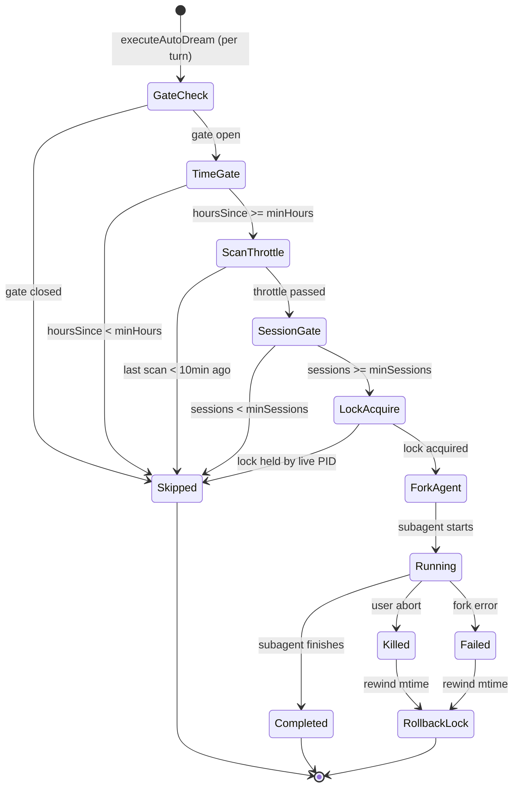
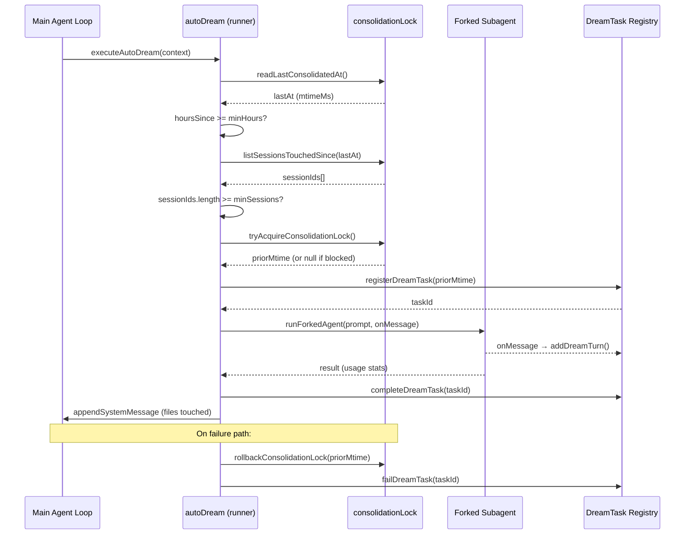

# Dream Tasks: Background Consolidation

## Overview

Long-running agents accumulate memory at a rate that outpaces their ability to organize it. Session transcripts, ad-hoc notes, and extracted observations pile up in the memdir filesystem until retrieval degrades and context windows overflow. The DreamTask subsystem addresses this problem the same way human cognition does: by performing maintenance during idle periods rather than during active work. Named by analogy to sleep consolidation in neuroscience, the dream loop reviews, deduplicates, and prunes the agent's stored memories when the agent is between turns.

The system has two layers. The `autoDream` service (`src/services/autoDream/autoDream.ts`) is the scheduling and execution engine: it checks firing conditions on every agent turn, acquires a filesystem-based lock to serialize access, and launches a forked subagent to perform the actual consolidation work. The `DreamTask` module (`src/tasks/DreamTask/DreamTask.ts`) makes that otherwise-invisible background process observable -- it surfaces the consolidation agent's progress in the task registry so the user can monitor or kill it from the UI. The consolidation prompt itself (`src/services/autoDream/consolidationPrompt.ts`) structures the subagent's work into four phases: orient, gather, consolidate, and prune. The lock (`src/services/autoDream/consolidationLock.ts`) doubles as both a mutual-exclusion mechanism and a timestamp store for the last successful consolidation.

The gating logic ensures consolidation only fires when two conditions are met simultaneously: enough time has elapsed since the last consolidation (default 24 hours), and enough new sessions have accumulated since then (default 5). This prevents wasteful re-consolidation of unchanged memory and ensures there is genuinely new material to process. The gate order is cheapest-first: a single `stat` call eliminates most turns, a directory listing handles the rest, and only when both gates pass does the system attempt the more expensive lock acquisition and forked-agent launch.

This architecture mirrors HER Pattern 4 (Dream Consolidation), which identifies proactive background memory maintenance as essential for agents that run across many sessions. The HER specifies eight phases (scan, classify, deduplicate, prune, consolidate, compress, reorganize, verify) and five compaction types. cc's implementation collapses these into the four-phase prompt and relies on the model's judgment for sub-steps like classification and verification, a pragmatic trade-off discussed in the divergence section below. The key insight from the HER -- that memory maintenance should happen proactively during idle time, not reactively when context limits are reached -- is the foundational design principle of the entire auto-dream system.

## Data structures and contracts

The dream system's core data contract is `DreamTaskState`, which extends the shared `TaskStateBase` used by all task types in the registry. It carries the phase, the set of files the consolidation agent has touched, a ring buffer of recent turns for live display, and a stashed `priorMtime` for lock rollback.

```typescript
// src/tasks/DreamTask/DreamTask.ts:L25-L41 — DreamTaskState type definition
export type DreamTaskState = TaskStateBase & {
  type: 'dream'
  phase: DreamPhase
  sessionsReviewing: number
  /**
   * Paths observed in Edit/Write tool_use blocks via onMessage. This is an
   * INCOMPLETE reflection of what the dream agent actually changed — it misses
   * any bash-mediated writes and only captures the tool calls we pattern-match.
   * Treat as "at least these were touched", not "only these were touched".
   */
  filesTouched: string[]
  /** Assistant text responses, tool uses collapsed. Prompt is NOT included. */
  turns: DreamTurn[]
  abortController?: AbortController
  /** Stashed so kill can rewind the lock mtime (same path as fork-failure). */
  priorMtime: number
}
```

The `filesTouched` field is deliberately annotated as an undercount: it only captures file paths from `FileEdit` and `FileWrite` tool-use blocks observed via the `onMessage` callback (`src/services/autoDream/autoDream.ts:L296-L304`). Any writes performed through `Bash` (which the consolidation prompt restricts to read-only) would be invisible to this tracker. The `priorMtime` field stores the lock file's mtime from before acquisition, so that on kill or fork failure the lock can be rewound to its previous state, allowing the next session to retry without waiting for the full `minHours` interval.

The `DreamTurn` type collapses each assistant message into a text summary and a tool-use count, keeping at most `MAX_TURNS = 30` entries in the ring buffer (`src/tasks/DreamTask/DreamTask.ts:L12`). The `DreamPhase` union (`'starting' | 'updating'`) flips to `'updating'` the first time a file path is observed in a tool-use block, providing coarse-grained progress indication without parsing the model's internal reasoning. The comment at `src/tasks/DreamTask/DreamTask.ts:L20-L22` explains why no finer-grained phase detection exists: the dream prompt has a 4-stage structure internally, but parsing those stages from model output would be fragile and token-expensive, so the system settles for a binary starting/updating signal driven by observable file modifications.

The `sessionsReviewing` field records how many sessions the dream agent will review, populated at registration time from the session gate's count (`src/services/autoDream/autoDream.ts:L204-L208`). This gives the UI a concrete sense of scope -- a dream reviewing 2 sessions is qualitatively different from one reviewing 50, and the user deserves to see that distinction before deciding whether to let it run.

The auto-dream configuration contract is minimal:

```typescript
// src/services/autoDream/autoDream.ts:L58-L66 — AutoDreamConfig and defaults
type AutoDreamConfig = {
  minHours: number
  minSessions: number
}

const DEFAULTS: AutoDreamConfig = {
  minHours: 24,
  minSessions: 5,
}
```

These thresholds are sourced from the GrowthBook feature flag `tengu_onyx_plover` with per-field defensive validation (`src/services/autoDream/autoDream.ts:L73-L93`), falling back to the defaults when the cache returns stale or malformed values. The validation is deliberately per-field: each threshold is checked independently for type (`number`), finiteness (`Number.isFinite`), and positivity (`> 0`), so a partially corrupted cache object (e.g., `minHours` valid but `minSessions` a string) degrades gracefully by applying the default only to the corrupted field.

The enabled/disabled gate lives in a separate module (`src/services/autoDream/config.ts`) to avoid importing the heavy forked-agent and task-registry chain from UI components that only need to read the enabled state. The `isAutoDreamEnabled` function (`src/services/autoDream/config.ts:L13-L21`) checks the user's `autoDreamEnabled` setting first, falling through to the GrowthBook flag only when the setting is undefined. This two-tier resolution means a user who explicitly enables or disables auto-dream in `settings.json` gets that preference honored regardless of the server-side flag.

## Control flow

The dream lifecycle is governed by a three-gate sequence that runs on every agent turn via the `executeAutoDream` entry point, which is called from the stop-hooks pipeline after each model response. The runner is initialized by `initAutoDream()` (`src/services/autoDream/autoDream.ts:L122-L273`), which creates a closure-scoped function rather than using module-level state. This design choice supports testing: each test can call `initAutoDream()` in `beforeEach` to get a fresh closure without cross-test pollution.



The gate order is intentional: the time check requires only one `stat` call on the lock file, the session scan requires a directory listing plus per-file `stat`, and the lock acquisition requires a write and a verification read. By ordering cheapest-first, the system minimizes I/O on the common path where consolidation is not yet due.

### The enabled gate

Before any time or session checks, the system verifies that auto-dream is enabled via `isGateOpen()` (`src/services/autoDream/autoDream.ts:L95-L100`). This function checks four conditions in order: KAIROS mode must not be active (KAIROS has its own disk-skill-based dream), remote mode must not be active, auto-memory must be enabled (dream depends on the memdir), and the auto-dream feature flag must be on. If any condition fails, the function returns false and the entire dream pipeline is skipped for that turn with no I/O cost beyond the GrowthBook cache read.

### Time gate

The time gate reads `lastConsolidatedAt` from the lock file's mtime. The lock file lives inside the memdir at `.consolidate-lock`, and its mtime IS the timestamp -- no separate metadata store is needed (`src/services/autoDream/consolidationLock.ts:L29-L36`). If the file does not exist (first run in a new project), `readLastConsolidatedAt` returns 0, which means the time gate passes immediately and the session gate becomes the sole throttle. The per-turn cost of this gate is one `stat` call, which is the cheapest possible I/O operation for a filesystem-based timestamp.

### Session gate

When the time gate passes but insufficient sessions have accumulated, the system throttles session scans to once every 10 minutes (`SESSION_SCAN_INTERVAL_MS` at `src/services/autoDream/autoDream.ts:L56`) to avoid repeated directory listings on every turn. The session count comes from `listSessionsTouchedSince`, which scans the project's JSONL transcripts and filters by mtime after `lastConsolidatedAt` (`src/services/autoDream/consolidationLock.ts:L118-L124`). The function uses mtime (sessions touched since the last consolidation) rather than birthtime, because birthtime is unreliable on ext4 filesystems where it reads as 0. The current session is excluded from the count (`src/services/autoDream/autoDream.ts:L164-L165`) because its mtime is always recent -- a session should not count itself as new material to consolidate.

The scan throttle exists because of a subtle interaction with the time gate. When the time gate passes but the session gate does not, the lock's mtime does not advance (no consolidation ran). On the next turn, the time gate passes again, and the session scan fires again, producing the same under-threshold result. Without throttling, this cycle repeats on every turn until enough sessions accumulate. The 10-minute throttle limits this to at most one scan per 10 minutes, reducing I/O pressure during periods of low activity.

### Lock acquisition and consolidation

The lock acquisition is a filesystem-level compare-and-swap:

```typescript
// src/services/autoDream/consolidationLock.ts:L46-L83 — tryAcquireConsolidationLock
export async function tryAcquireConsolidationLock(): Promise<number | null> {
  const path = lockPath()

  let mtimeMs: number | undefined
  let holderPid: number | undefined
  try {
    const [s, raw] = await Promise.all([stat(path), readFile(path, 'utf8')])
    mtimeMs = s.mtimeMs
    const parsed = parseInt(raw.trim(), 10)
    holderPid = Number.isFinite(parsed) ? parsed : undefined
  } catch {
    // ENOENT — no prior lock.
  }

  if (mtimeMs !== undefined && Date.now() - mtimeMs < HOLDER_STALE_MS) {
    if (holderPid !== undefined && isProcessRunning(holderPid)) {
      logForDebugging(
        `[autoDream] lock held by live PID ${holderPid} (mtime ${Math.round((Date.now() - mtimeMs) / 1000)}s ago)`,
      )
      return null
    }
    // Dead PID or unparseable body — reclaim.
  }

  // Memory dir may not exist yet.
  await mkdir(getAutoMemPath(), { recursive: true })
  await writeFile(path, String(process.pid))

  // Two reclaimers both write → last wins the PID. Loser bails on re-read.
  let verify: string
  try {
    verify = await readFile(path, 'utf8')
  } catch {
    return null
  }
  if (parseInt(verify.trim(), 10) !== process.pid) return null

  return mtimeMs ?? 0
}
```

The function returns the pre-acquisition mtime (or 0 for a new lock) so callers can rewind on failure. The PID-based liveness check guards against stale locks from crashed processes, while the `HOLDER_STALE_MS` constant (one hour at `src/services/autoDream/consolidationLock.ts:L19`) guards against PID reuse on long-running systems. The verification read after writing implements a last-writer-wins race resolution: if two processes both write their PID simultaneously, the one that reads back its own PID wins, and the loser silently returns null. The lock body (the file's content) stores only the holder's PID as a decimal string, keeping the format minimal and parseable with a single `parseInt`.

The lock file's location inside the memdir is intentional: it keys on the git root (since memdir paths include the sanitized project root from `getAutoMemPath` at `src/memdir/paths.ts:L223-L235`), and it is writable even when the memory path comes from an env or settings override whose parent directory may not be. The `mkdir` with `recursive: true` at `src/services/autoDream/consolidationLock.ts:L71` handles the case where the memory directory does not yet exist on first consolidation.

The following sequence diagram shows the full consolidation flow with lock interaction:



### The consolidation prompt

The forked subagent receives a structured prompt with four phases. The prompt is built by `buildConsolidationPrompt` (`src/services/autoDream/consolidationPrompt.ts:L10-L65`):

```typescript
// src/services/autoDream/consolidationPrompt.ts:L14-L64 — buildConsolidationPrompt
export function buildConsolidationPrompt(
  memoryRoot: string,
  transcriptDir: string,
  extra: string,
): string {
  return `# Dream: Memory Consolidation

You are performing a dream — a reflective pass over your memory files. Synthesize what you've learned recently into durable, well-organized memories so that future sessions can orient quickly.

Memory directory: \`${memoryRoot}\`
${DIR_EXISTS_GUIDANCE}

Session transcripts: \`${transcriptDir}\` (large JSONL files — grep narrowly, don't read whole files)

---

## Phase 1 — Orient

- \`ls\` the memory directory to see what already exists
- Read \`${ENTRYPOINT_NAME}\` to understand the current index
- Skim existing topic files so you improve them rather than creating duplicates
- If \`logs/\` or \`sessions/\` subdirectories exist (assistant-mode layout), review recent entries there

## Phase 2 — Gather recent signal

Look for new information worth persisting. Sources in rough priority order:

1. **Daily logs** (\`logs/YYYY/MM/YYYY-MM-DD.md\`) if present — these are the append-only stream
2. **Existing memories that drifted** — facts that contradict something you see in the codebase now
3. **Transcript search** — if you need specific context (e.g., "what was the error message from yesterday's build failure?"), grep the JSONL transcripts for narrow terms:
   \`grep -rn "<narrow term>" ${transcriptDir}/ --include="*.jsonl" | tail -50\`

Don't exhaustively read transcripts. Look only for things you already suspect matter.

## Phase 3 — Consolidate

For each thing worth remembering, write or update a memory file at the top level of the memory directory. Use the memory file format and type conventions from your system prompt's auto-memory section — it's the source of truth for what to save, how to structure it, and what NOT to save.

Focus on:
- Merging new signal into existing topic files rather than creating near-duplicates
- Converting relative dates ("yesterday", "last week") to absolute dates so they remain interpretable after time passes
- Deleting contradicted facts — if today's investigation disproves an old memory, fix it at the source

## Phase 4 — Prune and index

Update \`${ENTRYPOINT_NAME}\` so it stays under ${MAX_ENTRYPOINT_LINES} lines AND under ~25KB. It's an **index**, not a dump — each entry should be one line under ~150 characters: \`- [Title](file.md) — one-line hook\`. Never write memory content directly into it.

- Remove pointers to memories that are now stale, wrong, or superseded
- Demote verbose entries: if an index line is over ~200 chars, it's carrying content that belongs in the topic file — shorten the line, move the detail
- Add pointers to newly important memories
- Resolve contradictions — if two files disagree, fix the wrong one

---

Return a brief summary of what you consolidated, updated, or pruned. If nothing changed (memories are already tight), say so.${extra ? `\n\n## Additional context\n\n${extra}` : ''}`
}
```

Phase 1 (Orient) reads the current state of the memdir. The agent starts by listing what already exists rather than diving into transcript search, which prevents the common failure mode of creating duplicate memory files because the consolidator did not check what was already there. Phase 2 (Gather) searches for new signal, prioritizing daily logs and drifted facts over raw transcript search. The explicit instruction to grep narrowly rather than reading whole JSONL files reflects a hard-won lesson: transcript files can be tens of megabytes, and reading them in full would exhaust the subagent's context window before any consolidation work begins.

Phase 3 (Consolidate) writes updated memory files, with explicit guidance to merge rather than duplicate and to absolutize relative dates. The date-absolutization instruction addresses a specific decay pattern: memories written with "yesterday" or "last week" become meaningless after time passes, yet models frequently write this way because it is natural in conversation. Phase 4 (Prune and index) enforces size constraints on the `MEMORY.md` entrypoint file, which is capped at 200 lines and approximately 25KB (`src/memdir/memdir.ts:L34-L35`). The entrypoint is an index, not a dump -- the prompt explicitly instructs the model never to write memory content directly into it, keeping each entry to one line under approximately 150 characters.

The `extra` parameter appends tool constraints and session hints to the shared prompt body. This separation is important because the manual `/dream` command runs in the main loop with normal permissions, where the read-only Bash restriction would be misleading. The tool constraints note at `src/services/autoDream/autoDream.ts:L216-L221` restricts the forked dream agent to read-only shell commands (`ls`, `find`, `grep`, `cat`, `stat`, `wc`, `head`, `tail`), with the explicit note "no need to probe" to discourage the model from testing the boundary. The session list is also appended in `extra`, giving the dream agent a starting point for its transcript search.

### Progress watching and task lifecycle

The `makeDreamProgressWatcher` function creates an `onMessage` callback that inspects each assistant message from the forked subagent, extracting text blocks and collapsing tool-use blocks into a count (`src/services/autoDream/autoDream.ts:L281-L313`). File paths from `FileEdit` and `FileWrite` tool-use blocks are collected and passed to `addDreamTurn`, which flips the task phase from `'starting'` to `'updating'` on the first observed file modification. The `addDreamTurn` function (`src/tasks/DreamTask/DreamTask.ts:L76-L104`) performs a skip optimization: if the turn contains no text, no tool uses, and no newly touched paths, the update is a no-op that avoids triggering a React re-render in the UI.

On completion, the system appends an inline message to the main transcript using `appendSystemMessage` with the verb `'Improved'` instead of the default `'Saved'` (`src/services/autoDream/autoDream.ts:L239-L248`). This distinguishes consolidation activity (which modifies existing memories) from extraction activity (which creates new ones). If no files were touched, no message is appended -- a dream that finds nothing to improve runs silently. The `completeDreamTask` function (`src/tasks/DreamTask/DreamTask.ts:L106-L120`) sets `notified: true` immediately because the dream task has no model-facing notification path; the inline append-system-message completion note is the sole user surface.

Analytics events are emitted at both the firing and completion points. `tengu_auto_dream_fired` (`src/services/autoDream/autoDream.ts:L195-L198`) records the hours since last consolidation and the number of sessions to review. `tengu_auto_dream_completed` (`src/services/autoDream/autoDream.ts:L252-L257`) records cache read and creation token counts, output tokens, and sessions reviewed. A separate `tengu_auto_dream_failed` event is emitted on fork failure (`src/services/autoDream/autoDream.ts:L267`). These events allow monitoring of consolidation frequency, cost, and failure rates in production.

### Kill and rollback

The `DreamTask.kill` handler (`src/tasks/DreamTask/DreamTask.ts:L136-L157`) aborts the subagent via its `AbortController` and then rolls back the consolidation lock by rewinding the lock file's mtime to `priorMtime`. This is the same rollback path used when the fork fails due to an error (`src/services/autoDream/autoDream.ts:L268-L270`). The rollback ensures that the next session's time gate will still pass, so the failed consolidation is retried promptly rather than waiting for another `minHours` interval.

```typescript
// src/tasks/DreamTask/DreamTask.ts:L132-L157 — DreamTask kill handler
export const DreamTask: Task = {
  name: 'DreamTask',
  type: 'dream',

  async kill(taskId, setAppState) {
    let priorMtime: number | undefined
    updateTaskState<DreamTaskState>(taskId, setAppState, task => {
      if (task.status !== 'running') return task
      task.abortController?.abort()
      priorMtime = task.priorMtime
      return {
        ...task,
        status: 'killed',
        endTime: Date.now(),
        notified: true,
        abortController: undefined,
      }
    })
    // Rewind the lock mtime so the next session can retry. Same path as the
    // fork-failure catch in autoDream.ts. If updateTaskState was a no-op
    // (already terminal), priorMtime stays undefined and we skip.
    if (priorMtime !== undefined) {
      await rollbackConsolidationLock(priorMtime)
    }
  },
}
```

The kill handler extracts `priorMtime` from the task state before setting the status to `'killed'`. If the task was already in a terminal state (completed, failed, or previously killed), the `updateTaskState` callback returns the task unchanged and `priorMtime` stays `undefined`, which prevents a double-rollback. The comment at `src/tasks/DreamTask/DreamTask.ts:L150-L153` calls out that this is the same path as the fork-failure catch in `autoDream.ts`, emphasizing that rollback logic must be consistent between the two failure modes.

If `priorMtime` is 0 (meaning the lock file did not exist before acquisition), `rollbackConsolidationLock` unlinks the file entirely (`src/services/autoDream/consolidationLock.ts:L91-L108`). For nonzero values, it writes an empty body and uses `utimes` to set the mtime back to the pre-acquisition timestamp. The empty body is important: without it, the rolling-back process's own PID would remain in the file, and a subsequent `tryAcquireConsolidationLock` call would see a live PID holding a stale-timed lock and incorrectly wait. A failed rollback logs a debug message but does not throw -- the consequence is that the next consolidation trigger is delayed until `minHours` passes naturally.

## Edge cases and failure modes

**PID reuse on long-lived machines.** The `HOLDER_STALE_MS` constant of one hour (`src/services/autoDream/consolidationLock.ts:L19`) addresses the scenario where a process holding the lock crashes, its PID is recycled by an unrelated process, and `isProcessRunning` returns a false positive. After one hour, the lock is considered stale regardless of PID liveness, and the next acquirer reclaims it. The trade-off is that a very long consolidation run (over an hour) could have its lock stolen by a second process. In practice, consolidation runs are bounded by the fork's context window and complete in minutes, making this a theoretical concern rather than a practical one.

**Race condition on lock acquisition.** Two processes that both pass the time and session gates simultaneously will both attempt to write their PID to the lock file. The verification read after writing (`src/services/autoDream/consolidationLock.ts:L76-L81`) resolves this: the process that reads back its own PID proceeds, while the other returns null and skips. This is a last-writer-wins protocol rather than true atomic compare-and-swap, but it is sufficient because the worst case is one redundant consolidation run, not data corruption. Memory files are append-friendly; two concurrent consolidation passes might produce duplicate entries, but the next consolidation pass will merge them.

**Scan throttle starvation.** The `SESSION_SCAN_INTERVAL_MS` of 10 minutes (`src/services/autoDream/autoDream.ts:L56`) prevents repeated directory scans on every turn when the time gate passes but the session gate does not. This can cause a subtle delay: if exactly `minSessions` transcripts are touched shortly after a scan, the next scan will not occur for up to 10 minutes, even though the session gate would pass. This is an acceptable trade-off because the consolidation is not latency-sensitive -- a 10-minute delay in a background maintenance task is immaterial. The throttle also serves as a natural backoff mechanism: if a forked agent fails repeatedly, the scan throttle prevents the system from hammering the filesystem with session listings on every turn.

**Incomplete files-touched tracking.** The `filesTouched` array in `DreamTaskState` only captures paths from `FileEdit` and `FileWrite` tool-use blocks (`src/services/autoDream/autoDream.ts:L296-L304`). Files modified through `Bash` commands are invisible to this tracker. The consolidation prompt restricts the forked subagent's Bash access to read-only commands (`src/services/autoDream/autoDream.ts:L218-L219`), which mitigates this gap for the dream agent itself, but the comment in the type definition explicitly warns future maintainers not to treat `filesTouched` as complete. This intentional undercount is a design choice: perfect accounting would require intercepting every filesystem syscall, which would couple the progress watcher to the tool execution layer in a fragile way.

**Lock rollback failure.** If `rollbackConsolidationLock` fails (e.g., the lock file was deleted by another process between the failed fork and the rollback attempt), the debug log records the error but no exception propagates (`src/services/autoDream/consolidationLock.ts:L103-L108`). The consequence is that the lock file retains its current mtime, and the next consolidation attempt must wait for `minHours` to pass from that timestamp. This is a safe degradation: the system prefers a delayed retry over an unrecoverable error that would crash the main agent loop.

**Manual /dream interference.** The `recordConsolidation` function (`src/services/autoDream/consolidationLock.ts:L130-L140`) stamps the lock file's mtime when the user manually invokes `/dream`, preventing auto-dream from firing immediately after a manual run. However, this stamp is optimistic -- it fires at prompt-build time with no completion hook. If the manual `/dream` fails or is cancelled, the mtime has already advanced, and auto-dream will not retry until `minHours` passes. The `recordConsolidation` function also creates the memory directory if it does not exist (`src/services/autoDream/consolidationLock.ts:L133`), handling the edge case of a manual `/dream` invocation before any auto-trigger has fired.

**Forced mode bypass.** The `isForced()` function at `src/services/autoDream/autoDream.ts:L105-L107` is an ant-build-only test override that bypasses the enabled, time, and session gates but not the lock or the memory-directory precondition. When forced, the `priorMtime` is set to the current `lastAt` value (`src/services/autoDream/autoDream.ts:L179`), so a kill's rollback rewinds to where the mtime already was (a no-op). In production, `isForced()` always returns false. This escape hatch exists because end-to-end tests of the dream system would be impractical if they had to accumulate 5 sessions and wait 24 hours of wall-clock time.

## Where cc diverges from the published pattern

HER Pattern 4 specifies eight phases of dream consolidation: scan, classify, deduplicate, prune, consolidate, compress, reorganize, and verify. cc's implementation collapses these into the four-phase prompt structure (orient, gather, consolidate, prune) and delegates the sub-steps to the model's judgment within each phase. The "classify" step, for instance, is implicit in Phase 2's prioritized source list; "deduplicate" and "compress" are sub-instructions within Phase 3's guidance to merge rather than duplicate; and "verify" is left to the model's final summary rather than enforced as a separate pass.

This is a deliberate engineering trade-off. Enforcing eight discrete phases would require either parsing the model's intermediate outputs to gate phase transitions (fragile and token-expensive) or structuring the prompt as eight sequential tool calls (which the model might not follow). The four-phase prompt gives the model enough structure to produce reliable consolidation while keeping the implementation simple. The HER's eight phases describe what needs to happen semantically; cc's four phases describe when it needs to happen procedurally, and the model fills in the semantic steps within each procedural bucket.

The HER also specifies five compaction types (full transcript to structured notes, multiple observations to synthesized findings, redundant entries to canonical entry, verbose descriptions to concise summaries, time-ordered events to thematic groupings). cc does not enumerate these types explicitly. Instead, the consolidation prompt's Phase 3 and Phase 4 instructions cover the same semantic territory through general guidance: merge rather than duplicate, absolutize relative dates, delete contradicted facts, and keep the index under size limits. The model performs the compaction type selection implicitly based on the content it encounters. This approach is more flexible than explicit type dispatch -- the model can apply multiple compaction types within a single pass without the harness needing to know which type applies to which content.

The HER's Layer 8 (Learning and Adaptation) identifies progress note persistence, pattern discovery logging, stale assumption pruning, and harness configuration versioning as key adaptation mechanisms. cc's dream system addresses stale assumption pruning directly (Phase 3's "deleting contradicted facts") and progress note persistence indirectly (memory files survive context resets). However, it does not perform pattern discovery logging to `AGENTS.md` or harness configuration A/B testing -- those adaptation mechanisms live outside the dream subsystem. The dream system's scope is memory maintenance, not meta-learning. Pattern discovery and harness optimization would require a different integration point, likely at the session boundary rather than the turn boundary where auto-dream currently fires.

One notable divergence is the HER's emphasis on proactive consolidation "before it's needed." cc's system is proactive in the sense that it fires based on time and session thresholds rather than on context-window pressure, but it is also reactive in the sense that it only fires after the main agent loop has completed a turn (the `executeAutoDream` entry point is called from stop-hooks). A truly proactive system might run consolidation continuously in the background, but cc's design prioritizes simplicity and resource control: a forked agent consumes API credits, and running it continuously would be expensive. The time-and-session gate ensures consolidation only fires when there is genuinely new material to process.

## Developer takeaways for building a long-running agent

Background memory consolidation is not optional for agents that span many sessions. Without it, the memdir becomes a landfill of stale, contradictory, and duplicated entries that degrade retrieval quality and inflate context windows. The key design decisions in cc's implementation are worth studying. First, use the cheapest gate first: a single stat call on a lock file's mtime eliminates most turns without any directory scanning. Second, make the lock file serve double duty as both a mutex and a timestamp store, avoiding a separate metadata database. Third, always stash the pre-acquisition state so you can rewind on failure -- without rollback, a crashed consolidation run blocks all future attempts until the stale timer expires. Fourth, track the background agent's file modifications with an explicit undercount disclaimer rather than attempting perfect accounting; the files-touched list is for user-facing progress, not for correctness guarantees. Fifth, keep the consolidation prompt structured enough to guide the model but not so rigid that it breaks when the model skips a sub-step; four phases with semantic guidance outperforms eight phases with mechanical gates. Sixth, separate the scheduling infrastructure from the task registry so the UI can observe and control background work without coupling to the scheduling logic. These patterns transfer directly to any agent that must maintain long-lived state across sessions.
