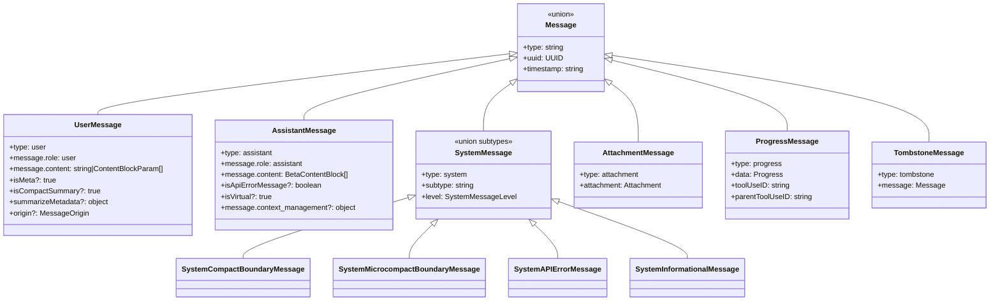

# Messages and the Conversation Model

## Overview

Every interaction between the user, the model, and the tool dispatch pipeline flows through the message system defined in `src/utils/messages.ts` and `src/utils/attachments.ts`. The message model is not a thin wrapper over the Anthropic API's `Message` type -- it is a separate, richer representation that carries UI state, compaction markers, hook provenance, and attachment metadata that the API never sees. The `normalizeMessagesForAPI` function bridges the gap between the internal representation and what the API accepts, performing a multi-pass transformation that merges, reorders, strips, and tags messages before they leave the process.

This chapter covers the six core message types, the attachment system that injects context without consuming a turn, the `<history_snip>` mechanism for progressive context compaction, compact boundary markers, and the content-replacement pipeline that keeps the conversation valid across compaction, credential changes, and feature-flag toggles.

## Data structures and contracts

The message model centers on a discriminated union. Each message has a `type` field that determines the shape of the rest of the object. The primary types are `user`, `assistant`, `system`, `attachment`, `progress`, and `tombstone`. The type imports at the top of `src/utils/messages.ts` reveal the full set of message subtypes, including `SystemCompactBoundaryMessage`, `SystemMicrocompactBoundaryMessage`, `SystemAPIErrorMessage`, and `TombstoneMessage` (`src/utils/messages.ts:L42-L73`).

```typescript
// src/utils/messages.ts:L460-L523 — createUserMessage factory
export function createUserMessage({
  content,
  isMeta,
  isVisibleInTranscriptOnly,
  isVirtual,
  isCompactSummary,
  summarizeMetadata,
  toolUseResult,
  mcpMeta,
  uuid,
  timestamp,
  imagePasteIds,
  sourceToolAssistantUUID,
  permissionMode,
  summarizeMetadata,
  origin,
}: {
  content: string | ContentBlockParam[]
  isMeta?: true
  isVisibleInTranscriptOnly?: true
  isVirtual?: true
  isCompactSummary?: true
  toolUseResult?: unknown
  mcpMeta?: {
    _meta?: Record<string, unknown>
    structuredContent?: Record<string, unknown>
  }
  uuid?: UUID | string
  timestamp?: string
  imagePasteIds?: number[]
  sourceToolAssistantUUID?: UUID
  permissionMode?: PermissionMode
  summarizeMetadata?: {
    messagesSummarized: number
    userContext?: string
    direction?: PartialCompactDirection
  }
  origin?: MessageOrigin
}): UserMessage {
  const m: UserMessage = {
    type: 'user',
    message: {
      role: 'user',
      content: content || NO_CONTENT_MESSAGE,
    },
    isMeta,
    isVisibleInTranscriptOnly,
    isVirtual,
    isCompactSummary,
    summarizeMetadata,
    uuid: (uuid as UUID | undefined) || randomUUID(),
    timestamp: timestamp ?? new Date().toISOString(),
    toolUseResult,
    mcpMeta,
    imagePasteIds,
    sourceToolAssistantUUID,
    permissionMode,
    origin,
  }
  return m
}
```

The `createUserMessage` factory reveals the key design contract: a `UserMessage` is not a simple string. It carries an `origin` field for provenance tracking (human keyboard input vs. task notification vs. channel message), an `isCompactSummary` flag that marks messages produced by compaction, and `summarizeMetadata` that records how many original messages were compressed and in which direction. The `isMeta` flag distinguishes messages that are visible to the model but should not be displayed to the user in the transcript -- system reminders, hook outputs, and injected context all carry `isMeta: true`. The `isVirtual` flag marks messages that are display-only and must never be sent to the API; these are created by the UI layer for internal rendering purposes such as REPL inner tool calls.

The `NO_CONTENT_MESSAGE` sentinel at `src/utils/messages.ts:L506` prevents empty messages from reaching the API, which would cause a rejection. When `content` is falsy, the factory substitutes this placeholder instead of allowing an empty string.

The assistant side mirrors this structure with additional fields for API error handling:

```typescript
// src/utils/messages.ts:L355-L409 — baseCreateAssistantMessage helper
function baseCreateAssistantMessage({
  content,
  isApiErrorMessage = false,
  apiError,
  error,
  errorDetails,
  isVirtual,
  usage = {
    input_tokens: 0,
    output_tokens: 0,
    cache_creation_input_tokens: 0,
    cache_read_input_tokens: 0,
    server_tool_use: { web_search_requests: 0, web_fetch_requests: 0 },
    service_tier: null,
    cache_creation: {
      ephemeral_1h_input_tokens: 0,
      ephemeral_5m_input_tokens: 0,
    },
    inference_geo: null,
    iterations: null,
    speed: null,
  },
}: {
  content: BetaContentBlock[]
  isApiErrorMessage?: boolean
  apiError?: AssistantMessage['apiError']
  error?: SDKAssistantMessageError
  errorDetails?: string
  isVirtual?: true
  usage?: Usage
}): AssistantMessage {
  return {
    type: 'assistant',
    uuid: randomUUID(),
    timestamp: new Date().toISOString(),
    message: {
      id: randomUUID(),
      container: null,
      model: SYNTHETIC_MODEL,
      role: 'assistant',
      stop_reason: 'stop_sequence',
      stop_sequence: '',
      type: 'message',
      usage,
      content,
      context_management: null,
    },
    requestId: undefined,
    apiError,
    error,
    errorDetails,
    isApiErrorMessage,
    isVirtual,
  }
}
```

The `SYNTHETIC_MODEL` sentinel (`'<synthetic>'` at `src/utils/messages.ts:L300`) marks messages generated locally rather than received from the API. The `isApiErrorMessage` flag distinguishes API error responses from normal model output, enabling the UI to render error states distinctly. The `context_management` field on the nested message object carries server-side compaction directives when the API itself requests context management.

The `Attachment` type is a large discriminated union defined in `src/utils/attachments.ts`. It represents every kind of non-conversational context that can be injected into the message stream:

```typescript
// src/utils/attachments.ts:L440-L447 — Attachment union (first entries)
export type Attachment =
  | FileAttachment
  | CompactFileReferenceAttachment
  | PDFReferenceAttachment
  | AlreadyReadFileAttachment
  | { type: 'edited_text_file'; filename: string; snippet: string }
  | { type: 'directory'; path: string; content: string; displayPath: string }
  | ...
  | HookAttachment
  | { type: 'compaction_reminder' }
  | { type: 'context_efficiency' }
  | TeammateMailboxAttachment
  | TeamContextAttachment
```

The full `Attachment` union spans over 40 variants (`src/utils/attachments.ts:L440-L718`), ranging from file references and IDE selections to plan mode instructions, hook outputs, token usage reports, and teammate coordination messages. Each variant is a distinct object shape with a `type` discriminant, enabling exhaustive checking in the `normalizeAttachmentForAPI` switch statement.

Attachments are not messages themselves. They are converted to `UserMessage` objects by `normalizeAttachmentForAPI`, which wraps their content in `<system-reminder>` tags and marks them `isMeta: true`. This ensures the model receives the context without the UI displaying a spurious user turn. The `AttachmentMessage` type wraps an `Attachment` with a UUID and timestamp so it can sit in the same message array as `UserMessage` and `AssistantMessage`.

The `HookAttachment` subtype at `src/utils/attachments.ts:L352-L379` is notable because it carries both a `hookName` and a `toolUseID`, linking hook output to a specific tool invocation. This linkage is essential for the `reorderMessagesInUI` function, which groups pre-hook, tool-use, tool-result, and post-hook messages together in the display order.

The following class diagram shows the primary message types and their relationships:



## Control flow

The message lifecycle has three major phases: creation, normalization for display, and normalization for the API. The most complex phase is the API normalization pipeline in `normalizeMessagesForAPI`.

### Message creation

Messages are created by factory functions: `createUserMessage` for user turns, `createAssistantMessage` for model responses, `createSystemMessage` for system-level events, and `createProgressMessage` for streaming tool progress. Each factory assigns a fresh UUID and timestamp. The `baseCreateAssistantMessage` helper at `src/utils/messages.ts:L355-L409` builds the common shape shared by real and synthetic assistant messages, with the `SYNTHETIC_MODEL` sentinel marking messages that were generated locally rather than received from the API.

The `SYNTHETIC_MESSAGES` set at `src/utils/messages.ts:L302-L308` defines the known synthetic message texts:

```typescript
// src/utils/messages.ts:L302-L308 — Synthetic message sentinel set
export const SYNTHETIC_MESSAGES = new Set([
  INTERRUPT_MESSAGE,
  INTERRUPT_MESSAGE_FOR_TOOL_USE,
  CANCEL_MESSAGE,
  REJECT_MESSAGE,
  NO_RESPONSE_REQUESTED,
])
```

These are messages injected by the harness rather than authored by the model or the human user. The `isSyntheticMessage` function at `src/utils/messages.ts:L310-L319` checks whether a message's first text block matches one of these sentinels, which the UI uses to render these messages differently from real conversation turns.

Interruption and rejection messages are created by `createUserInterruptionMessage` at `src/utils/messages.ts:L545-L560`, which selects between `INTERRUPT_MESSAGE` and `INTERRUPT_MESSAGE_FOR_TOOL_USE` based on whether the interruption happened during tool execution. The `CANCEL_MESSAGE` and `REJECT_MESSAGE` constants at `src/utils/messages.ts:L211-L215` provide the text for permission-denial scenarios, with the `REJECT_MESSAGE_WITH_REASON_PREFIX` variant allowing the user's explanation to be appended.

Compact boundaries are created by `createCompactBoundaryMessage`:

```typescript
// src/utils/messages.ts:L4530-L4555 — createCompactBoundaryMessage
export function createCompactBoundaryMessage(
  trigger: 'manual' | 'auto',
  preTokens: number,
  lastPreCompactMessageUuid?: UUID,
  userContext?: string,
  messagesSummarized?: number,
): SystemCompactBoundaryMessage {
  return {
    type: 'system',
    subtype: 'compact_boundary',
    content: `Conversation compacted`,
    isMeta: false,
    timestamp: new Date().toISOString(),
    uuid: randomUUID(),
    level: 'info',
    compactMetadata: {
      trigger,
      preTokens,
      userContext,
      messagesSummarized,
    },
    ...(lastPreCompactMessageUuid && {
      logicalParentUuid: lastPreCompactMessageUuid,
    }),
  }
}
```

The `compactMetadata` field records whether the compaction was manual or automatic, the token count before compaction, the user-provided context string, and the count of summarized messages. The `logicalParentUuid` links the boundary to the last pre-compact message, allowing the UI to maintain scrollback continuity. Similarly, `createMicrocompactBoundaryMessage` at `src/utils/messages.ts:L4557-L4583` records the tokens saved and the tool IDs that were compacted, providing a lighter-weight compaction marker for selective tool-result trimming.

The `createProgressMessage` factory at `src/utils/messages.ts:L603-L620` creates messages that track tool execution progress in the UI. Each progress message carries a `toolUseID` and `parentToolUseID`, linking it to the tool invocation it reports on. Progress messages are never sent to the API; they are filtered out by `normalizeMessagesForAPI`.

### The normalizeMessagesForAPI pipeline

The `normalizeMessagesForAPI` function at `src/utils/messages.ts:L1989-L2370` is the central transformation that converts the internal message array into something the Anthropic API will accept. It runs a multi-pass pipeline:

1. **Reorder attachments** -- `reorderAttachmentsForAPI` bubbles attachment messages up from the bottom until they hit a tool result or assistant message, ensuring context is injected before the model sees the result it modifies (`src/utils/messages.ts:L1481-L1527`). The implementation scans bottom-up and uses a `pendingAttachments` buffer, reversing once at the end for O(N) performance.

2. **Filter virtual messages** -- messages with `isVirtual: true` are display-only and must never reach the API.

3. **Normalize user messages** -- tool_reference blocks are stripped or filtered depending on whether ToolSearch is enabled; oversized image/document blocks from meta messages preceding API errors are stripped to prevent re-sending the problematic content.

4. **Merge consecutive user messages** -- the Bedrock API does not support multiple user messages in a row, so adjacent user messages are merged via `mergeUserMessages`. The `joinTextAtSeam` helper at `src/utils/messages.ts:L2505-L2515` appends a newline between adjacent text blocks to prevent concatenation artifacts.

5. **Normalize assistant messages** -- tool inputs are normalized and canonical tool names are applied. The `caller` field is stripped when ToolSearch is disabled (`src/utils/messages.ts:L1742-L1772`).

6. **Normalize attachments** -- `normalizeAttachmentForAPI` at `src/utils/messages.ts:L3453-L4286` converts each attachment type into one or more `UserMessage` objects wrapped in `<system-reminder>` tags. This function is a large switch statement that handles over 40 attachment variants, producing user messages that the model can process.

7. **Relocate tool_reference siblings** -- `relocateToolReferenceSiblings` at `src/utils/messages.ts:L1933-L1987` moves text-block siblings off user messages containing tool_reference, preventing an anomalous two-consecutive-human-turns pattern that teaches the model to emit a premature stop sequence.

8. **Filter orphaned thinking-only messages** -- `filterOrphanedThinkingOnlyMessages` at `src/utils/messages.ts:L4991-L5058` removes assistant messages that contain only thinking blocks with no companion text or tool_use content, which would cause "thinking blocks cannot be modified" API errors.

9. **Filter trailing thinking** -- `filterTrailingThinkingFromLastAssistant` at `src/utils/messages.ts:L4781-L4828` removes thinking blocks from the end of the last assistant message, as the API does not allow this.

10. **Filter whitespace-only messages** -- `filterWhitespaceOnlyAssistantMessages` at `src/utils/messages.ts:L4869-L4919` removes assistant messages that contain only whitespace text, which the API rejects.

11. **Smoosh system-reminder siblings** -- `smooshSystemReminderSiblings` at `src/utils/messages.ts:L1835-L1873` folds `<system-reminder>`-prefixed text siblings into the adjacent tool_result's content, preventing the `</function_results>\n\nHuman:` boundary that causes premature stop sequences.

12. **Sanitize error tool results** -- `sanitizeErrorToolResultContent` at `src/utils/messages.ts:L1884-L1907` strips non-text blocks from `is_error` tool results, which the API rejects.

13. **Append message ID tags** -- when `HISTORY_SNIP` is enabled, `appendMessageTagToUserMessage` at `src/utils/messages.ts:L1620-L1670` injects `[id:xxxx]` tags into the last text block of non-meta user messages, enabling the snip tool to reference specific messages.

14. **Validate images** -- `validateImagesForAPI` checks that all image blocks are within API size limits.

The ordering of passes 8 through 12 is load-bearing. The code comments at `src/utils/messages.ts:L2314-L2320` explicitly note this: stripping trailing thinking first, then filtering whitespace-only messages. In the reverse order, a message like `[text("\n\n"), thinking("...")]` survives the whitespace filter (has a non-text block), then thinking stripping removes the thinking block, leaving `[text("\n\n")]` which the API rejects.

The following flowchart illustrates the message lifecycle:

```mermaid
flowchart TD
    A[User Input / API Response] --> B[createUserMessage / createAssistantMessage]
    B --> C[Store in mutableMessages]
    C --> D{Render Path?}
    D -->|UI Display| E[normalizeMessages]
    E --> F[Split multi-block messages into individual NormalizedMessage]
    F --> G[buildMessageLookups: O(1) sibling, progress, hook lookups]
    G --> H[reorderMessagesInUI: group tool-use + hooks + results]
    D -->|API Call| I[normalizeMessagesForAPI]
    I --> J[reorderAttachmentsForAPI: bubble attachments up]
    J --> K[Filter virtual + normalize user/assistant content]
    K --> L[Merge consecutive user messages for Bedrock compat]
    L --> M[normalizeAttachmentForAPI: convert to isMeta UserMessages]
    M --> N[relocateToolReferenceSiblings: prevent double-human-turn]
    N --> O[filterOrphanedThinkingOnlyMessages]
    O --> P[filterTrailingThinking + whitespace + empty content]
    P --> Q[smooshSystemReminderSiblings into tool_results]
    Q --> R[sanitizeErrorToolResultContent]
    R --> S[Append id tags if HISTORY_SNIP enabled]
    S --> T[ensureToolResultPairing: repair tool_use/result mismatches]
    T --> U[Validate images + send to API]
```

### Message normalization for display

The `normalizeMessages` function at `src/utils/messages.ts:L731-L823` performs a different transformation from the API pipeline. It splits multi-block messages into individual `NormalizedMessage` objects, each containing a single content block. This is necessary because the UI renders each content block (text, tool_use, image) as a separate visual element.

The function tracks an `isNewChain` flag that determines whether new UUIDs need to be generated. When a message with multiple content blocks is split, the first block retains the original UUID, but subsequent blocks receive derived UUIDs via `deriveUUID` at `src/utils/messages.ts:L725-L728`. This ensures stable identity for the first block while avoiding duplicate UUIDs for the remaining blocks.

The `buildMessageLookups` function at `src/utils/messages.ts:L1170-L1340` pre-computes O(1) lookup structures for the UI render path. The `MessageLookups` type at `src/utils/messages.ts:L1146-L1161` includes sibling tool-use ID sets, progress messages by tool-use ID, in-progress and resolved hook counts, tool-result and tool-use block lookups, and sets of resolved and errored tool-use IDs. Building these once per render avoids O(n^2) behavior from calling individual lookup functions for each message.

### Tool result pairing validation

The `ensureToolResultPairing` function at `src/utils/messages.ts:L5133-L5460` is a defensive validation that ensures every `tool_use` block has a matching `tool_result` and vice versa. It runs after the main normalization pipeline. When it finds a mismatch, it inserts synthetic error tool_results for missing IDs and strips orphaned tool_results referencing non-existent tool_uses. This repair is essential for session resume scenarios where the transcript may have been truncated by compaction. In strict mode (HFI training data collection), the function throws instead of repairing, because a model response conditioned on synthetic placeholders is tainted.

The `SYNTHETIC_TOOL_RESULT_PLACEHOLDER` constant at `src/utils/messages.ts:L246-L247` marks these injected results:

```typescript
// src/utils/messages.ts:L246-L247 — Synthetic placeholder for missing tool results
export const SYNTHETIC_TOOL_RESULT_PLACEHOLDER =
  '[Tool result missing due to internal error]'
```

The pairing validation also handles duplicate tool_use IDs across different assistant messages. The `allSeenToolUseIds` set at `src/utils/messages.ts:L5147` tracks IDs cumulatively, catching a subtle bug where two assistant messages with different `message.id` values but the same `tool_use` ID would both pass per-message deduplication but still produce a duplicate-ID API rejection. This scenario arises when the orphan handler re-pushes an assistant already present in `mutableMessages` with a fresh `message.id`.

### Content replacement during compaction

When compaction occurs, the conversation is summarized and older messages are replaced. The `isCompactSummary` flag on `UserMessage` marks messages that are the output of compaction. The `summarizeMetadata` field records the number of original messages that were summarized and the compaction direction, enabling the UI to render a compacted-conversation indicator.

The `<history_snip>` mechanism, gated by the `HISTORY_SNIP` feature flag, provides a lighter-weight form of context reduction. Rather than summarizing the entire conversation, it projects a view that removes snipped messages while preserving the full array for UI scrollback. The `getMessagesAfterCompactBoundary` function at `src/utils/messages.ts:L4643-L4656` applies both the compact-boundary slice and the snip projection:

```typescript
// src/utils/messages.ts:L4643-L4656 — getMessagesAfterCompactBoundary
export function getMessagesAfterCompactBoundary<
  T extends Message | NormalizedMessage,
>(messages: T[], options?: { includeSnipped?: boolean }): T[] {
  const boundaryIndex = findLastCompactBoundaryIndex(messages)
  const sliced = boundaryIndex === -1 ? messages : messages.slice(boundaryIndex)
  if (!options?.includeSnipped && feature('HISTORY_SNIP')) {
    const { projectSnippedView } =
      require('../services/compact/snipProjection.js') as typeof import('../services/compact/snipProjection.js')
    return projectSnippedView(sliced as Message[]) as T[]
  }
  return sliced
}
```

When `includeSnipped` is false and `HISTORY_SNIP` is enabled, `projectSnippedView` filters out messages that have been snipped by the compaction system. The REPL keeps the full message array for scrollback, but the model-facing path gets both the compact-boundary slice and the snip filter applied. The `includeSnipped` option allows callers like the REPL's fullscreen compact handler to preserve snipped messages in the scrollback view.

The `deriveShortMessageId` function at `src/utils/messages.ts:L200-L205` produces a 6-character base36 string from a UUID, which is injected into API-bound messages as `[id:...]` tags. This gives the snip tool a stable, compact reference to specific messages. The derivation is deterministic: the same UUID always produces the same short ID, which is essential for the snip tool to maintain consistent references across API calls.

The `isCompactBoundaryMessage` function at `src/utils/messages.ts:L4608-L4612` and `findLastCompactBoundaryIndex` at `src/utils/messages.ts:L4618-L4629` provide the query side of the compact boundary system. The index function scans backwards to find the most recent boundary, which `getMessagesAfterCompactBoundary` then uses to slice the message array.

### Attachment-to-message conversion

The `normalizeAttachmentForAPI` function at `src/utils/messages.ts:L3453-L4286` is the switch statement that converts each attachment variant into one or more `UserMessage` objects. Every variant produces messages wrapped in `<system-reminder>` tags via `wrapMessagesInSystemReminder`, which calls `wrapInSystemReminder` at `src/utils/messages.ts:L3097-L3099`. This wrapper ensures the model treats attachment content as system context rather than user-authored text.

Some attachment types produce synthetic tool-use/tool-result pairs rather than plain text messages. The `directory` attachment at `src/utils/messages.ts:L3525-L3537` creates a synthetic Bash tool call with the `ls` command and its output, making the directory listing appear to the model as if it had been read via the normal tool dispatch pipeline. Similarly, the `file` attachment at `src/utils/messages.ts:L3545-L3591` creates synthetic FileRead tool calls for text, image, notebook, and PDF files.

The `compaction_reminder` attachment at `src/utils/messages.ts:L4139-L4147` injects a reassurance message telling the model that auto-compact is enabled and it should continue working without rushing. The `context_efficiency` attachment at `src/utils/messages.ts:L4148-L4161` injects the snip nudge text when `HISTORY_SNIP` is enabled, hinting that the model should consider snipping older messages to free up context.

## Edge cases and failure modes

**Context rot and mid-window degradation.** HER section 6.1 identifies context rot as one of the most insidious failure modes in long-running agents. Performance degrades over 30 percent when key content falls in mid-window positions, because information at the beginning and end of a context window is more reliably attended to while the reasoning chain in the middle degrades fastest. The agent does not suddenly fail -- it slowly becomes less coherent, re-visiting decisions it already made, contradicting earlier conclusions, or losing track of the original task goal. The compaction hierarchy (history_snip, microcompact, context collapse, autocompact) addresses this by progressively removing less critical information first, preserving the most important context for as long as possible. The key insight from HER Pattern 5 is that compaction should be gradual and context-preserving, not abrupt.

**Duplicate tool_use IDs across messages.** The `ensureToolResultPairing` function tracks `allSeenToolUseIds` across all messages, not just within a single assistant's content array. This prevents a subtle bug where two assistant messages with different `message.id` values but the same `tool_use` ID would both pass per-message deduplication but still produce a duplicate-ID API rejection. The code at `src/utils/messages.ts:L5226-L5233` filters out duplicate `tool_use` blocks against this cumulative set.

**Smoosh vs. sibling trade-offs.** The `smooshSystemReminderSiblings` function folds `<system-reminder>`-prefixed text blocks into the adjacent tool_result's content. This prevents the `</function_results>\n\nHuman:` boundary that teaches the model to emit premature stop sequences. However, the smoosh must not fold blocks into tool_results that contain `tool_reference` content, because the server rejects mixing tool_reference with other content types inside a single tool_result. The `smooshIntoToolResult` function at `src/utils/messages.ts:L2534-L2598` returns `null` when it encounters this constraint, and the caller falls back to leaving the text as a sibling. The `is_error` tool_results also require special handling: the API rejects non-text content in error results, so the smoosh filters out image blocks before attempting to fold them in.

**Orphaned tool_results on session resume.** When a session is resumed, the transcript may start mid-turn, with the first message being a tool_result whose matching assistant was dropped by compaction. The API rejects this with "unexpected tool_use_id". The `ensureToolResultPairing` function at `src/utils/messages.ts:L5161-L5200` handles this by stripping orphaned tool_results from user messages that have no preceding assistant, inserting a placeholder if necessary to maintain the user-first role requirement. If stripping empties the message and no previous message exists, a placeholder `[Orphaned tool result removed due to conversation resume]` is inserted to ensure the API payload starts with a user message.

**Stale signature blocks after credential change.** Thinking blocks and connector_text blocks carry cryptographic signatures bound to the API key that generated them. After a `/login` or credential change, these signatures become invalid and the API rejects them with a 400. The `stripSignatureBlocks` function at `src/utils/messages.ts:L5066-L5099` removes these blocks from all assistant messages. It strips to an empty content array rather than inserting a placeholder, because the `mergeAssistantMessages` function will rejoin split siblings, and `normalizeMessagesForAPI` will handle the empty-content case.

**Consecutive user messages on Bedrock.** The Bedrock API does not support multiple user messages in a row, while the first-party API merges them. The `mergeUserMessages` function at `src/utils/messages.ts:L2411-L2449` concatenates adjacent user messages, with `joinTextAtSeam` inserting a newline between adjacent text blocks to prevent `"2 + 23 + 3"` style concatenation artifacts. The merge also handles `isMeta` propagation: when `HISTORY_SNIP` is enabled and snip runtime is active, a merged message is only `isMeta` if all merged messages are meta (`src/utils/messages.ts:L2425-L2437`).

**Image-in-error tool results.** The `sanitizeErrorToolResultContent` function at `src/utils/messages.ts:L1884-L1907` addresses a specific failure mode: transcripts persisted before `smooshIntoToolResult` learned to filter on `is_error` contained image blocks inside error tool_results. On resumed sessions, these 400 on every API call and cannot be recovered by `/fork`. The sanitize pass strips all non-text blocks from `is_error` tool_results and merges adjacent text blocks.

**Tool_reference turn boundary.** When a tool_result contains tool_reference content, the server expands it as `<functions>...</functions>`. If this is at the prompt tail without a sibling text block, the model may emit a premature stop sequence. The `TOOL_REFERENCE_TURN_BOUNDARY` constant at `src/utils/messages.ts:L179` (`'Tool loaded.'`) is injected as a sibling text block when tool_reference is present but no sibling exists, providing a clean Human: turn boundary (`src/utils/messages.ts:L2159-L2185`). This injection is gated by the `tengu_toolref_defer_j8m` feature flag; when the gate is on, the `relocateToolReferenceSiblings` function handles the problem by moving existing siblings to a later non-reference message instead.

## Where cc diverges from the published pattern

HER Pattern 5 describes a four-layer progressive compaction hierarchy: HISTORY_SNIP, Microcompact, CONTEXT_COLLAPSE, and Autocompact. The codebase implements all four layers, but the specifics differ from the published description in several ways.

First, the `history_snip` mechanism is not a standalone compaction pass that removes the oldest turns. It is a projection mechanism: the full message array is retained for UI scrollback, and `projectSnippedView` filters out snipped messages only when constructing the model-facing view. This is a cleaner design than the "remove oldest turns" approach described in the HER, because it preserves the ability to scroll back and see the full conversation. The projection is applied inside `getMessagesAfterCompactBoundary` rather than as a destructive operation on the message array.

Second, the compact boundary system uses two distinct markers rather than one. `SystemCompactBoundaryMessage` marks the boundary after a full compaction event, while `SystemMicrocompactBoundaryMessage` marks the boundary after a selective tool-result compaction. The microcompact boundary records which tool IDs were compacted and how many tokens were saved, information that the HER's description of Microcompact does not mention. Having two boundary types allows the UI to distinguish between a full conversation reset and a targeted trimming of verbose tool output.

Third, the `normalizeMessagesForAPI` pipeline performs far more content manipulation than the HER's description of "content replacement" suggests. The smoosh, relocate, and sanitize passes actively rewrite the message structure to prevent API rejections and model behavior issues. The smoosh pass alone has two modes: a legacy string-only mode gated off `tengu_chair_sermon`, and a universal mode that folds all non-tool_result block types into tool_result content. These passes are not described in the HER but are critical to making the compaction system work correctly in practice.

Fourth, the `[id:xxxx]` message tagging system, gated by the `HISTORY_SNIP` feature flag, is a mechanism for giving the model stable references to individual messages so it can decide what to snip. This is not mentioned in the HER's description of Pattern 5. The tags are injected by `appendMessageTagToUserMessage` at `src/utils/messages.ts:L1620-L1670`, which finds the last text block in a non-meta user message and appends the short ID derived from the message UUID. The injection happens after all merging so tags always match the surviving message's UUID.

Fifth, the `Attachment` type provides a far richer context injection system than the HER's description of "active context management" suggests. With over 40 variants, the attachment system injects everything from file contents and IDE selections to plan mode instructions, hook outputs, token usage reports, teammate mailbox messages, and skill discovery results. Each variant is converted to one or more `UserMessage` objects wrapped in `<system-reminder>` tags, ensuring the model receives the context without the UI displaying a spurious turn.

## Developer takeaways for building a long-running agent

The message system in cc demonstrates that the internal representation of a conversation must be significantly richer than what the API accepts. The gap between the two is bridged by a multi-pass normalization pipeline that must handle at least: role alternation constraints, tool_use/tool_result pairing invariants, feature-flag-gated content, stale cryptographic signatures after credential changes, and the interaction between compaction and API validity. Each pass can create conditions that a prior pass was meant to handle, so the ordering of passes is load-bearing and fragile -- the code explicitly documents this constraint at `src/utils/messages.ts:L2314-L2320`. When building a long-running agent, invest early in a clear separation between the internal message model and the API-bound representation, and make the normalization pipeline explicit and testable. The compaction hierarchy (history_snip through autocompact) is essential for preventing context rot, but the implementation must preserve enough metadata in boundary markers and summary messages to allow the UI to reconstruct what happened. The `isMeta` flag and the `<system-reminder>` wrapper pattern provide a clean way to inject context without consuming a visible turn, but the smoosh logic that folds these into tool_results requires careful handling of the API's constraints on tool_result content types -- mixing tool_reference with other content types triggers a server ValueError, and mixing non-text content with `is_error` triggers a client-side 400.
