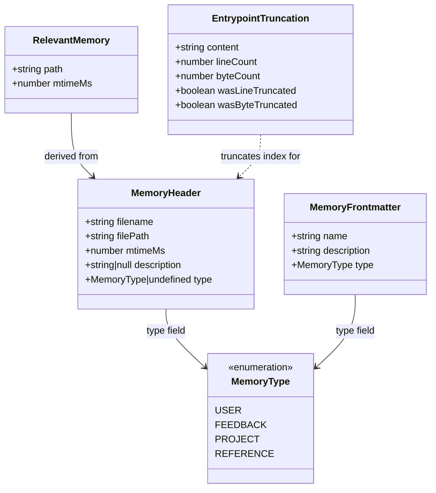
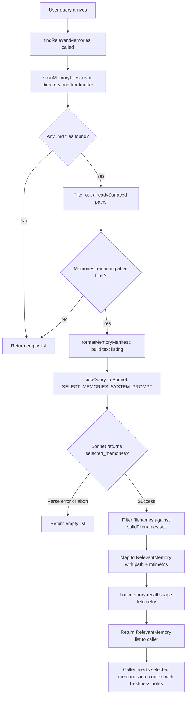

# Memdir: Tiered Memory on Disk

## Overview

The memdir subsystem gives cc a persistent, file-based memory that survives across sessions. Instead of relying on a database or an external service, cc stores memories as ordinary Markdown files under `~/.claude/projects/<project>/memory/`, indexed by a compact `MEMORY.md` file that is always loaded into the model's context. This design maps directly onto HER Pattern 3, Tiered Memory: a three-tier architecture where Tier 1 is the always-loaded `MEMORY.md` index (capped at 200 lines / 25 KB), Tier 2 comprises per-topic `.md` files loaded on demand via relevance retrieval, and Tier 3 consists of full session transcripts stored as JSONL on disk but never automatically loaded.

The memdir's value proposition is straightforward: an agent that can remember user preferences, project context, and past feedback across conversations does not need the user to repeat themselves. But raw persistence is not enough -- the system must constrain what gets stored (to avoid noise), size-limit what gets loaded (to stay within the context window), and verify recalled facts before acting on them (to avoid stale assertions). The six source files under `src/memdir/` implement these constraints: `memoryTypes.ts` defines a closed four-type taxonomy and the behavioral prompt sections that instruct the model on what to save and what to exclude; `paths.ts` resolves the filesystem location with a multi-layer security validation chain; `memdir.ts` builds the behavioral prompt, enforces truncation, and dispatches between normal and KAIROS (long-lived assistant) modes; `memoryScan.ts` scans the directory for headers using a single-pass optimization; `findRelevantMemories.ts` selects relevant files via a side-query to Sonnet; and `memoryAge.ts` computes staleness metadata and produces human-readable age annotations.

The tiered architecture mirrors CPU caching in an important way: the agent always has a high-level map of available knowledge (the Tier 1 index) while only loading detailed information (Tier 2 topic files) when it is actually needed. Full transcripts (Tier 3) are available for search but never automatically loaded, ensuring that the context window stays focused on the current task. The tradeoff is that the relevance selection step adds latency and cost (one API call per query), but this cost is bounded -- the selector reads only frontmatter, not full file contents, and it returns at most five files.

## Data structures and contracts

### The memory type taxonomy

Memories are constrained to a closed set of four types, each capturing context that is not derivable from the current project state. The `MEMORY_TYPES` constant and the `MemoryType` union type define this contract:

```typescript
// src/memdir/memoryTypes.ts:L14-L21 — Memory type taxonomy and union type
export const MEMORY_TYPES = [
  'user',
  'feedback',
  'project',
  'reference',
] as const

export type MemoryType = (typeof MEMORY_TYPES)[number]
```

The four types serve distinct purposes in the agent's recall strategy. The `user` type stores information about the user's role, goals, and preferences -- it enables the agent to tailor its behavior to who it is working with, collaborating differently with a senior engineer than with a first-time coder. The `feedback` type records corrections and validated approaches, covering both what to avoid and what to keep doing. The `project` type captures ongoing work, decisions, and deadlines that are not derivable from code or git history. The `reference` type stores pointers to external systems (dashboards, issue trackers, Slack channels). The key design principle, stated in `src/memdir/memoryTypes.ts:L6-L8`, is that code patterns, architecture, git history, and file structure are derivable via tools and should not be saved as memories. This exclusion rule is the primary defense against the memory directory filling with redundant information.

Parsing a raw frontmatter value into a `MemoryType` is handled by `parseMemoryType` in `src/memdir/memoryTypes.ts:L28-L31`, which returns `undefined` for invalid or missing values so that legacy files without a `type` field continue to work and unknown types degrade gracefully rather than causing errors. The `as const` assertion on `MEMORY_TYPES` enables TypeScript to infer the literal union type, and the `find` call in `parseMemoryType` ensures that only strings matching one of the four known types produce a defined result.

### The MemoryHeader scan result

When the system scans the memory directory, each file's frontmatter is parsed into a `MemoryHeader` object:

```typescript
// src/memdir/memoryScan.ts:L13-L19 — MemoryHeader type for scan results
export type MemoryHeader = {
  filename: string
  filePath: string
  mtimeMs: number
  description: string | null
  type: MemoryType | undefined
}
```

The `filename` field holds the relative path from the memory directory root (e.g., `user_role.md`), while `filePath` holds the absolute path used for file reads and write permissions. The `mtimeMs` field drives both the newest-first sort order and the staleness annotations produced by `memoryAge.ts`. The `description` field is extracted from frontmatter and used as the primary signal for relevance selection -- it is the text the side-query model sees when deciding which memories to surface. The `type` field uses the `MemoryType | undefined` union because `parseMemoryType` returns `undefined` for missing or unrecognized type values.

### The RelevantMemory return type

The `findRelevantMemories` function returns a simpler structure that carries only what the caller needs:

```typescript
// src/memdir/findRelevantMemories.ts:L13-L16 — RelevantMemory return type
export type RelevantMemory = {
  path: string
  mtimeMs: number
}
```

The `mtimeMs` is threaded through so that callers can surface freshness information to the main model without issuing a second `stat` call, as noted in the JSDoc at `src/memdir/findRelevantMemories.ts:L32-L33`. The `path` field is the absolute file path that the caller passes to the file-read tool to load the memory content into context.

### Frontmatter schema

Each memory file uses YAML frontmatter with three fields: `name`, `description`, and `type`. The `type` field must be one of the four `MEMORY_TYPES` values. The `MEMORY_FRONTMATTER_EXAMPLE` export at `src/memdir/memoryTypes.ts:L261-L271` provides the canonical template that the model sees in its system prompt:

```markdown
---
name: {{memory name}}
description: {{one-line description — used to decide relevance in future conversations, so be specific}}
type: {{user, feedback, project, reference}}
---

{{memory content — for feedback/project types, structure as: rule/fact, then **Why:** and **How to apply:** lines}}
```

The `description` field serves double duty: it helps the relevance selector decide whether to surface the memory, and it appears as a one-line hook in the `MEMORY.md` index. The template also specifies a body structure convention for `feedback` and `project` types: lead with the rule or fact, then add a `**Why:**` line explaining the reason and a `**How to apply:**` line describing when the guidance kicks in. This structure is enforced through the prompt sections at `src/memdir/memoryTypes.ts:L63-L64` (combined mode) and `src/memdir/memoryTypes.ts:L137-L138` (individual mode). The `Why` line is specifically designed to help the model judge edge cases rather than blindly following a rule, and the `How to apply` line tells the model when and where the guidance should shape its behavior.

### Storage layout

```mermaid
erDiagram
    MEMORY_MD ||--o{ TOPIC_FILE : "indexes"
    MEMORY_MD {
        string path "MEMORY.md"
        int max_lines 200
        int max_bytes 25000
        string format "one-line pointers per topic file"
    }
    TOPIC_FILE {
        string filename "e.g. user_role.md"
        string frontmatter_name "name field"
        string frontmatter_description "description field"
        string frontmatter_type "user or feedback or project or reference"
        float mtime "modification timestamp"
    }
    DAILY_LOG {
        string path "logs/YYYY/MM/YYYY-MM-DD.md"
        string mode "KAIROS append-only"
    }
    SESSION_JSONL {
        string path "project-dir/*.jsonl"
        string tier "3 never auto-loaded"
    }
    TOPIC_FILE ||--o{ DAILY_LOG : "distilled from in KAIROS mode"
```

The diagram above shows the storage relationships. The `MEMORY.md` file is the Tier 1 index that points to Tier 2 topic files. In KAIROS (long-lived assistant) mode, the agent writes to daily log files instead, and a separate nightly `/dream` skill distills those logs into topic files and updates `MEMORY.md`. Full session transcripts (Tier 3) exist as JSONL files but are never loaded into context automatically. The `buildSearchingPastContextSection` function at `src/memdir/memdir.ts:L375-L407` gives the model instructions for searching Tier 3 transcripts as a last resort when Tier 1 and Tier 2 do not yield the needed information.

### Memory types and frontmatter class diagram



The `MemoryHeader` is the intermediate representation between the raw frontmatter on disk and the lightweight `RelevantMemory` returned to the caller. The `parseMemoryType` function in `src/memdir/memoryTypes.ts:L28-L31` handles the conversion from the raw frontmatter string to the `MemoryType` enum, returning `undefined` for unrecognized values. The `EntrypointTruncation` type at `src/memdir/memdir.ts:L41-L47` captures the result of truncating `MEMORY.md` for the Tier 1 index, including booleans that indicate which cap fired and the original line and byte counts before truncation.

## Control flow

### Path resolution and security validation

Before any memory operation, cc must resolve the filesystem path where memories live. The `getAutoMemPath` function in `src/memdir/paths.ts:L223-L235` implements a three-tier resolution order: (1) the `CLAUDE_COWORK_MEMORY_PATH_OVERRIDE` environment variable for SDK callers, (2) the `autoMemoryDirectory` setting from trusted sources in `settings.json`, or (3) the computed default of `<memoryBase>/projects/<sanitized-git-root>/memory/`. The function is memoized on `getProjectRoot()` so that repeated calls during rendering do not re-traverse the settings chain. As the JSDoc at `src/memdir/paths.ts:L216-L222` explains, render-path callers such as `collapseReadSearchGroups` fire per tool-use message per Messages re-render, and each cache miss would trigger `getSettingsForSource` multiplied by four sources, each of which calls `parseSettingsFile` with `realpathSync` and `readFileSync`.

Security validation is critical because the auto-memory path is used as a carve-out in the filesystem permission system -- files under this path bypass certain write restrictions. The `validateMemoryPath` function in `src/memdir/paths.ts:L109-L150` rejects dangerous candidates including relative paths (which would be interpreted relative to CWD), root paths and near-root paths (length less than 3, which would be stripped to empty), Windows drive roots (matching `C:`), UNC paths (starting with `\\`), and paths containing null bytes (which can truncate in syscalls). The function normalizes the candidate path and appends exactly one trailing separator to match the trailing-sep contract of `getAutoMemPath`, which is used by `isAutoMemPath` to check whether a given file falls within the memory directory.

The settings-based path supports `~/` expansion for user convenience, but the environment variable override does not, since it is set programmatically by the Cowork/SDK layer. Bare `~`, `~/`, `~/.`, and `~/..` are all rejected because they would expand to `$HOME` or an ancestor, which would make `isAutoMemPath` match all of the home directory or its parent. A key security design choice documented at `src/memdir/paths.ts:L178-L186` is that project-scoped settings (`.claude/settings.json` committed to the repo) are intentionally excluded from path resolution -- a malicious repository could otherwise set `autoMemoryDirectory: "~/.ssh"` and gain silent write access to sensitive directories via the filesystem write carve-out.

The `isAutoMemPath` function at `src/memdir/paths.ts:L274-L278` normalizes an absolute path and checks whether it falls within the auto-memory directory. This is the guard used throughout the codebase to determine whether a file write should receive the memory carve-out. A subtlety documented at `src/memdir/paths.ts:L265-L272` is that when `CLAUDE_COWORK_MEMORY_PATH_OVERRIDE` is set, `isAutoMemPath` returns true but the write carve-out is not granted -- the override path is for SDK callers that manage their own permissions, and granting the carve-out would bypass the DANGEROUS_DIRECTORIES check that the SDK relies on.

### The enablement chain

The `isAutoMemoryEnabled` function in `src/memdir/paths.ts:L30-L55` implements a priority chain for determining whether the memory system is active. The chain proceeds in order: (1) the `CLAUDE_CODE_DISABLE_AUTO_MEMORY` environment variable, (2) `--bare` / `SIMPLE` mode, (3) remote sessions without persistent storage (no `CLAUDE_CODE_REMOTE_MEMORY_DIR`), (4) the `autoMemoryEnabled` setting in `settings.json`, and (5) the default of enabled. This layered approach means that a user can disable memory at the environment level (for CI/CD pipelines where persistence is unwanted), the command-line level (for one-off sessions with `--bare`), or the settings level (for project-level opt-out), with each layer overriding the ones below it.

The `isExtractModeActive` function at `src/memdir/paths.ts:L69-L77` gates the extract-memories background agent separately from the main memory prompt. This function checks both a GrowthBook feature flag (`tengu_passport_quail`) and whether the session is interactive. The main agent's prompt always has full save instructions regardless of this gate -- when the main agent writes memories, the background agent skips that conversation range; when it does not, the background agent catches anything missed.

### Prompt construction and the entrypoint

The `loadMemoryPrompt` function in `src/memdir/memdir.ts:L419-L507` is the main entry point for building the memory prompt that gets injected into the system prompt. It dispatches based on which memory systems are enabled. In the KAIROS path (when `feature('KAIROS')` and `autoEnabled` and `getKairosActive()` are all true), it returns the assistant daily-log prompt via `buildAssistantDailyLogPrompt` at `src/memdir/memdir.ts:L327-L370`. In the TEAMMEM path (when `feature('TEAMMEM')` and `isTeamMemoryEnabled()` are both true), it delegates to a combined prompt builder that handles both private and team memory directories. In the default path, it calls `buildMemoryLines` and joins the result. When auto memory is disabled entirely, the function returns `null` and logs telemetry at `src/memdir/memdir.ts:L492-L505` distinguishing whether the disable came from an environment variable or a settings change.

The `buildMemoryLines` function at `src/memdir/memdir.ts:L199-L266` constructs the behavioral instructions for the typed-memory system. It assembles sections for the memory directory path, the type taxonomy (`TYPES_SECTION_INDIVIDUAL`), what not to save (`WHAT_NOT_TO_SAVE_SECTION`), how to save, when to access memories (`WHEN_TO_ACCESS_SECTION`), and the "Before recommending from memory" section (`TRUSTING_RECALL_SECTION`). A critical detail is the `DIR_EXISTS_GUIDANCE` constant at `src/memdir/memdir.ts:L116-L119`, which tells the model that the memory directory already exists so it does not waste turns running `ls` or `mkdir -p` before writing -- the harness guarantees the directory exists via `ensureMemoryDirExists` at `src/memdir/memdir.ts:L129-L147`. The `ensureMemoryDirExists` function is idempotent and called once per session via the systemPromptSection cache. It uses `fs.mkdir` which is recursive by default and swallows `EEXIST` internally, so the full parent chain is created in one call.

The save instructions differ depending on whether the `skipIndex` flag is set (controlled by the `tengu_moth_copse` feature flag). Without `skipIndex`, the model is instructed to follow a two-step process: first write the memory to its own file, then add a one-line pointer in `MEMORY.md`. With `skipIndex`, the second step is omitted and `MEMORY.md` is not mentioned in the save instructions. The `skipIndex` path is used when the system prompt injects `MEMORY.md` content via user context rather than embedding it directly.

### The truncation gate

The `MEMORY.md` index is capped at 200 lines and 25,000 bytes. These constants are defined at `src/memdir/memdir.ts:L35-L38`:

```typescript
// src/memdir/memdir.ts:L34-L38 — Entrypoint size constants
export const ENTRYPOINT_NAME = 'MEMORY.md'
export const MAX_ENTRYPOINT_LINES = 200
// ~125 chars/line at 200 lines. At p97 today; catches long-line indexes that
// slip past the line cap (p100 observed: 197KB under 200 lines).
export const MAX_ENTRYPOINT_BYTES = 25_000
```

The byte cap of 25,000 is derived from approximately 125 characters per line at 200 lines, but it exists as a separate cap because the line cap alone does not catch the failure mode where an index stays under 200 lines but has extremely long entries. The comment notes a p100 observation of 197 KB under 200 lines -- an index where each line was nearly 1 KB. The `truncateEntrypointContent` function at `src/memdir/memdir.ts:L57-L103` enforces both limits:

```typescript
// src/memdir/memdir.ts:L57-L103 — Truncate MEMORY.md to line and byte caps
export function truncateEntrypointContent(raw: string): EntrypointTruncation {
  const trimmed = raw.trim()
  const contentLines = trimmed.split('\n')
  const lineCount = contentLines.length
  const byteCount = trimmed.length

  const wasLineTruncated = lineCount > MAX_ENTRYPOINT_LINES
  const wasByteTruncated = byteCount > MAX_ENTRYPOINT_BYTES

  if (!wasLineTruncated && !wasByteTruncated) {
    return {
      content: trimmed,
      lineCount,
      byteCount,
      wasLineTruncated,
      wasByteTruncated,
    }
  }

  let truncated = wasLineTruncated
    ? contentLines.slice(0, MAX_ENTRYPOINT_LINES).join('\n')
    : trimmed

  if (truncated.length > MAX_ENTRYPOINT_BYTES) {
    const cutAt = truncated.lastIndexOf('\n', MAX_ENTRYPOINT_BYTES)
    truncated = truncated.slice(0, cutAt > 0 ? cutAt : MAX_ENTRYPOINT_BYTES)
  }

  const reason =
    wasByteTruncated && !wasLineTruncated
      ? `${formatFileSize(byteCount)} (limit: ${formatFileSize(MAX_ENTRYPOINT_BYTES)}) — index entries are too long`
      : wasLineTruncated && !wasByteTruncated
        ? `${lineCount} lines (limit: ${MAX_ENTRYPOINT_LINES})`
        : `${lineCount} lines and ${formatFileSize(byteCount)}`

  return {
    content:
      truncated +
      `\n\n> WARNING: ${ENTRYPOINT_NAME} is ${reason}. Only part of it was loaded. Keep index entries to one line under ~200 chars; move detail into topic files.`,
    lineCount,
    byteCount,
    wasLineTruncated,
    wasByteTruncated,
  }
}
```

Line truncation happens first because it respects natural line boundaries (slicing the `contentLines` array and rejoining with newlines), then byte truncation cuts at the last newline before the byte limit to avoid splitting mid-line. The `lastIndexOf('\n', MAX_ENTRYPOINT_BYTES)` call at `src/memdir/memdir.ts:L82-L84` finds the nearest line break before the byte threshold; if no newline is found (a single line exceeding 25 KB), it falls back to a hard cut at the byte limit. When either cap fires, a `WARNING` block is appended to the truncated content that names which cap triggered and advises keeping index entries to one line under approximately 200 characters. The `wasLineTruncated` and `wasByteTruncated` booleans in the return value are used by the caller to log truncation events as telemetry, distinguishing the line-cap and byte-cap failure modes.

The `buildMemoryPrompt` function at `src/memdir/memdir.ts:L272-L316` reads the existing `MEMORY.md` file (using a synchronous read because prompt building is synchronous) and applies `truncateEntrypointContent` to the content. If the file is empty or does not exist, it inserts a placeholder message: "Your MEMORY.md is currently empty." The truncation result is also logged via `logMemoryDirCounts` at `src/memdir/memdir.ts:L298-L305`, which records the content length, line count, truncation flags, and memory type as telemetry.

### The memory retrieval flow per query

When a user sends a message, cc can proactively surface relevant memories before the main model processes the query. The retrieval pipeline proceeds through three stages: scan, select, and inject.



The `findRelevantMemories` function in `src/memdir/findRelevantMemories.ts:L39-L75` orchestrates this flow. It first calls `scanMemoryFiles` to enumerate all `.md` files in the memory directory, filtering out `MEMORY.md` (which is already loaded in the system prompt) and any files whose paths appear in the `alreadySurfaced` set (so that previously-surfaced memories do not consume the selection budget again). It then formats the resulting `MemoryHeader` list into a text manifest via `formatMemoryManifest` and sends it to a Sonnet side-query with a structured JSON output schema that asks for up to 5 filenames.

The side-query uses the `SELECT_MEMORIES_SYSTEM_PROMPT` at `src/memdir/findRelevantMemories.ts:L18-L24`, which instructs the selector to be selective and discerning -- if unsure whether a memory will be useful, it should not include it. The prompt also includes a `recentTools` section that filters out reference documentation for tools the agent is already using, as documented at `src/memdir/findRelevantMemories.ts:L87-L91`: when the agent is actively using a tool, surfacing that tool's reference docs is noise since the conversation already contains working usage. The selector should, however, still select memories containing warnings or gotchas about those tools, because active use is exactly when those matter.

The side-query is dispatched via `sideQuery` at `src/memdir/findRelevantMemories.ts:L98-L122`, which sends the request to a default Sonnet model with `max_tokens: 256` and a JSON schema output format requiring a `selected_memories` array of strings. The `querySource` parameter is set to `'memdir_relevance'`, which allows the side-query infrastructure to apply its own rate limiting and telemetry. The `signal` parameter is threaded through so that if the user cancels the query or the session ends, the side-query is aborted immediately.

After the side-query returns, the selected filenames are validated against the `validFilenames` set at `src/memdir/findRelevantMemories.ts:L130`, which was constructed from the scanned memories before the side-query was dispatched. This validation is a guard against hallucinated filenames -- if the Sonnet model returns a filename that does not correspond to an actual memory file, it is silently filtered out. The resulting `RelevantMemory` objects are then mapped at `src/memdir/findRelevantMemories.ts:L74` from the `MemoryHeader` entries, carrying the absolute file path and `mtimeMs` for freshness annotation downstream.

### The directory scan

The `scanMemoryFiles` function in `src/memdir/memoryScan.ts:L35-L77` reads all `.md` files in the memory directory recursively, parses their frontmatter, and returns a `MemoryHeader` array sorted newest-first, capped at `MAX_MEMORY_FILES` (200). A notable optimization, documented at `src/memdir/memoryScan.ts:L30-L33`, is that the function reads-then-sorts rather than stat-sort-reads: `readFileInRange` returns `mtimeMs` internally, so a single pass through each file yields both the frontmatter and the modification time. For the common case of N less than or equal to 200 files, this halves system calls compared to a separate stat round; for directories with more than 200 files, a few extra small files are read but the double-stat on the surviving 200 is still avoided.

```typescript
// src/memdir/memoryScan.ts:L35-L77 — Scan memory directory for .md files
export async function scanMemoryFiles(
  memoryDir: string,
  signal: AbortSignal,
): Promise<MemoryHeader[]> {
  try {
    const entries = await readdir(memoryDir, { recursive: true })
    const mdFiles = entries.filter(
      f => f.endsWith('.md') && basename(f) !== 'MEMORY.md',
    )

    const headerResults = await Promise.allSettled(
      mdFiles.map(async (relativePath): Promise<MemoryHeader> => {
        const filePath = join(memoryDir, relativePath)
        const { content, mtimeMs } = await readFileInRange(
          filePath,
          0,
          FRONTMATTER_MAX_LINES,
          undefined,
          signal,
        )
        const { frontmatter } = parseFrontmatter(content, filePath)
        return {
          filename: relativePath,
          filePath,
          mtimeMs,
          description: frontmatter.description || null,
          type: parseMemoryType(frontmatter.type),
        }
      }),
    )

    return headerResults
      .filter(
        (r): r is PromiseFulfilledResult<MemoryHeader> =>
          r.status === 'fulfilled',
      )
      .map(r => r.value)
      .sort((a, b) => b.mtimeMs - a.mtimeMs)
      .slice(0, MAX_MEMORY_FILES)
  } catch {
    return []
  }
}
```

The `Promise.allSettled` pattern at `src/memdir/memoryScan.ts:L45-L64` is intentional: if one file has malformed frontmatter or is unreadable, that single rejection is filtered out without failing the entire scan. The `FRONTMATTER_MAX_LINES` cap of 30 at `src/memdir/memoryScan.ts:L22` ensures that only the top of each file is read, since frontmatter never exceeds that depth and reading the full file content would be wasteful during a scan. The filter at `src/memdir/memoryScan.ts:L41-L42` excludes `MEMORY.md` by checking `basename(f) !== 'MEMORY.md'`, since the entrypoint file is already loaded into context separately and should not appear in the scan results. The `readdir` call with `{ recursive: true }` at `src/memdir/memoryScan.ts:L40` supports nested subdirectories within the memory directory, which are used by team memory (stored under a `team/` subdirectory) and by the KAIROS daily-log hierarchy (stored under `logs/YYYY/MM/`).

The `formatMemoryManifest` function at `src/memdir/memoryScan.ts:L84-L94` converts the `MemoryHeader` array into a text listing where each line follows the format `[type] filename (timestamp): description`. This manifest is what the side-query model sees -- it provides enough information for relevance selection without exposing the full file contents, keeping the side-query's input token count low.

### Age and staleness

The `memoryAge.ts` module provides three functions that compute and format staleness information. The `memoryAgeDays` function at `src/memdir/memoryAge.ts:L6-L8` returns floor-rounded days since modification, clamping negative values (from future mtimes due to clock skew) to 0. The `memoryAge` function at `src/memdir/memoryAge.ts:L15-L20` converts this to human-readable strings ("today", "yesterday", "N days ago") because, as the JSDoc at `src/memdir/memoryAge.ts:L12-L14` notes, models are poor at date arithmetic and a raw ISO timestamp does not trigger staleness reasoning the way "47 days ago" does.

```typescript
// src/memdir/memoryAge.ts:L6-L20 — Age computation and human-readable formatting
export function memoryAgeDays(mtimeMs: number): number {
  return Math.max(0, Math.floor((Date.now() - mtimeMs) / 86_400_000))
}

export function memoryAge(mtimeMs: number): string {
  const d = memoryAgeDays(mtimeMs)
  if (d === 0) return 'today'
  if (d === 1) return 'yesterday'
  return `${d} days ago`
}
```

The `memoryFreshnessText` function at `src/memdir/memoryAge.ts:L33-L42` produces a staleness caveat for memories older than one day. It returns an empty string for fresh memories (today or yesterday) because a warning there would be noise. For older memories, it produces a note that explicitly calls out that claims about code behavior or file:line citations may be outdated and should be verified against current code before being asserted as fact. The `memoryFreshnessNote` wrapper at `src/memdir/memoryAge.ts:L49-L53` wraps the same text in `<system-reminder>` tags for callers that do not add their own wrapper. This design is motivated by user reports documented at `src/memdir/memoryAge.ts:L29-L31` of stale code-state memories being asserted as fact -- the citation format makes a stale claim sound more authoritative, not less.

The two-level freshness system (`memoryFreshnessText` for callers with their own wrapping, `memoryFreshnessNote` for callers without) exists because different consumers of memory data inject it into the context differently. Some wrap the entire memory block in a system-reminder tag, while others need the staleness note to stand alone. The `memoryFreshnessText` function's design of returning an empty string for memories less than two days old acknowledges that freshness warnings have their own cost: crying wolf on every recent memory trains the model to ignore the warning entirely.

### The behavioral prompt sections

The `memoryTypes.ts` file exports several prompt sections that are assembled by `buildMemoryLines` into the full memory behavioral prompt. Each section has a specific purpose validated through evaluation.

The `TYPES_SECTION_INDIVIDUAL` at `src/memdir/memoryTypes.ts:L113-L178` provides the type taxonomy for single-directory mode. Each type is wrapped in `<type>` XML tags with `<name>`, `<description>`, `<when_to_save>`, `<how_to_use>`, and `<examples>` sub-elements. The XML structure is deliberate -- it gives the model a clear parse boundary for each type definition. The combined mode variant (`TYPES_SECTION_COMBINED` at `src/memdir/memoryTypes.ts:L37-L106`) adds a `<scope>` element to each type specifying whether it should be saved as private or team memory. The `user` type is always private (it contains personal information), the `feedback` type defaults to private but can be team-scoped for project-wide conventions, and the `project` and `reference` types bias toward team scope.

The `WHAT_NOT_TO_SAVE_SECTION` at `src/memdir/memoryTypes.ts:L183-L195` is the exclusion guard. It lists five categories that must not be saved: code patterns and conventions (derivable from reading the project), git history (derivable from `git log` / `git blame`), debugging solutions (the fix is in the code), anything already in CLAUDE.md files, and ephemeral task details. The final paragraph at `src/memdir/memoryTypes.ts:L193-L195` applies even when the user explicitly asks to save -- if they ask to save a PR list or activity summary, the model should ask what was surprising or non-obvious about it, because that is the part worth keeping.

The `WHEN_TO_ACCESS_SECTION` at `src/memdir/memoryTypes.ts:L216-L222` specifies three access rules: access memories when they seem relevant, access them when the user explicitly asks, and ignore them entirely when the user says to ignore memory. The "ignore" bullet at `src/memdir/memoryTypes.ts:L220` addresses a specific failure mode identified in branch-pollution evaluations: when the user says "ignore memory about X," the model was reading the code correctly but adding "not Y as noted in memory" -- treating "ignore" as "acknowledge then override" rather than "do not reference at all." The bullet names this anti-pattern explicitly.

The `TRUSTING_RECALL_SECTION` at `src/memdir/memoryTypes.ts:L240-L256` is a heavier-weight guidance section on how to treat a memory once it has been recalled. The header wording "Before recommending from memory" was chosen over the more abstract "Trusting what you recall" because, as the comment at `src/memdir/memoryTypes.ts:L243-L245` explains, the action-cue header tested better in evaluation (3/3 vs. 0/3 with the same body text). The section instructs the model to check that files exist and grep for functions before recommending them, and to prefer `git log` or reading code over recalling snapshots when the user asks about recent or current state.

## Edge cases and failure modes

**Truncation of the index.** When `MEMORY.md` exceeds 200 lines or 25,000 bytes, the `truncateEntrypointContent` function silently truncates and appends a warning. The model sees the truncated content and the warning, but any memory entries that fell beyond the cap are invisible to it for the duration of that session. This means that a user who asks the model to recall a fact stored in a truncated entry will get a "I don't have that in memory" response unless the relevance retrieval pipeline independently surfaces the corresponding topic file. The truncation is not recoverable within a session -- the `MEMORY.md` file on disk is not modified, only the loaded copy is truncated, so the next session starts fresh.

**Stale memories asserted as fact.** The `MEMORY_DRIFT_CAVEAT` constant at `src/memdir/memoryTypes.ts:L201-L202` and the `TRUSTING_RECALL_SECTION` at `src/memdir/memoryTypes.ts:L240-L256` address this systematically. The "Before recommending from memory" section instructs the model to check that files exist and grep for functions before recommending them. The `memoryFreshnessText` function at `src/memdir/memoryAge.ts:L33-L42` adds a machine-readable staleness note to memories older than one day. Despite these guardrails, the system cannot force the model to verify -- it can only prompt it to do so. The `memoryFreshnessText` function's own documentation at `src/memdir/memoryAge.ts:L29-L31` acknowledges that the citation format makes stale claims sound more authoritative, which is precisely the problem the staleness annotations attempt to counteract.

**Side-query failures in relevance selection.** The `selectRelevantMemories` function at `src/memdir/findRelevantMemories.ts:L77-L141` catches errors from the side-query and returns an empty list on failure. If the API call times out, the model is rate-limited, or the JSON parse fails, no memories are surfaced for that query. The function checks `signal.aborted` at `src/memdir/findRelevantMemories.ts:L132-L134` to distinguish intentional cancellation from genuine failures -- the former is silently swallowed while the latter is logged at warn level via `logForDebugging`. The telemetry at `src/memdir/findRelevantMemories.ts:L66-L72` fires even on empty selection so that selection-rate analytics have the denominator -- negative ages distinguish "ran, picked nothing" from "never ran."

**Path traversal and security validation.** The `validateMemoryPath` function at `src/memdir/paths.ts:L109-L150` rejects a battery of dangerous path patterns including relative paths, root paths, Windows drive roots, UNC paths, and null-byte injections. The `isAutoMemPath` function at `src/memdir/paths.ts:L274-L278` normalizes the input path before comparison to prevent traversal via `..` segments. The exclusion of project-scoped settings from the path resolution chain at `src/memdir/paths.ts:L178-L186` prevents a malicious repository from redirecting memory writes to sensitive directories. The `validateMemoryPath` function also rejects tilde-only paths (`~`, `~/`, `~/.`, `~/..`) that would expand to `$HOME` or an ancestor, using `normalize` to detect trivial remainders after expansion.

**The `alreadySurfaced` budget.** The `findRelevantMemories` function accepts an `alreadySurfaced` set at `src/memdir/findRelevantMemories.ts:L44` that filters out paths shown in prior turns before the Sonnet selection call. Without this filter, the selector would spend its 5-slot budget on re-picking files the caller would discard, leaving no room for fresh candidates. The filter operates at the `filePath` level (absolute paths), not the `filename` level, which correctly handles the case where team and private directories contain files with the same name.

**Directory scan failures.** The `scanMemoryFiles` function at `src/memdir/memoryScan.ts:L74-L76` catches any error from `readdir` and returns an empty list. If the memory directory does not exist or is unreadable, the scan silently produces zero results, and the retrieval pipeline proceeds as if there are no memories. Individual file read failures within `Promise.allSettled` are also silently filtered out at `src/memdir/memoryScan.ts:L66-L71`. The `MAX_MEMORY_FILES` cap of 200 at `src/memdir/memoryScan.ts:L21` prevents unbounded memory usage from directories with thousands of files, and the newest-first sort ensures that the most recently modified files survive the cap.

**KAIROS mode and the daily-log pattern.** In long-lived assistant sessions, the `buildAssistantDailyLogPrompt` function at `src/memdir/memdir.ts:L327-L370` switches the model from the two-step save pattern (write topic file, update index) to an append-only daily log. The prompt at `src/memdir/memdir.ts:L338-L349` instructs the model to append timestamped bullets to a date-named file under `logs/YYYY/MM/YYYY-MM-DD.md` and to create the file and parent directories on first write. This avoids the coordination overhead of maintaining `MEMORY.md` in a session that may run for days, but it introduces a latency: new information is not indexed until the nightly `/dream` skill distills the logs. The daily log path is described as a pattern (`YYYY-MM-DD`) rather than the literal current date because the prompt is cached by `systemPromptSection('memory', ...)` and not invalidated on date change -- the model derives the current date from a separate `date_change` attachment appended at midnight.

## Where cc diverges from the published pattern

HER Pattern 3 describes a three-tier memory architecture with an always-loaded index (Tier 1), on-demand topic files (Tier 2), and full transcripts on disk (Tier 3). cc's implementation follows this structure closely but introduces several departures:

**Typed taxonomy with exclusion rules.** The HER pattern describes tiers generically without constraining what content belongs in each tier. cc's `MEMORY_TYPES` taxonomy at `src/memdir/memoryTypes.ts:L14-L19` restricts memories to four types (`user`, `feedback`, `project`, `reference`) and the `WHAT_NOT_TO_SAVE_SECTION` at `src/memdir/memoryTypes.ts:L183-L195` explicitly excludes derivable information such as code patterns, architecture, git history, and debugging solutions. This constraint addresses a specific failure mode observed in practice: without it, the model fills the memory directory with information that could be derived from the current project state, wasting context budget on redundant facts. The exclusion applies even when the user explicitly asks to save derivable information, with a fallback of asking what was surprising or non-obvious about it.

**Model-driven relevance selection.** The HER pattern describes Tier 2 files as "loaded into context only when needed" but does not specify how "needed" is determined. cc uses a Sonnet side-query at `src/memdir/findRelevantMemories.ts:L98-L122` to rank candidate memories by relevance to the current query, constrained to at most 5 selections. This adds latency and cost (one API call per query) but avoids the alternative of keyword-matching heuristics, which would produce false positives on name overlap. The side-query uses structured JSON output with a schema that validates the response format, and hallucinated filenames are filtered against the actual scan results at `src/memdir/findRelevantMemories.ts:L130`.

**Staleness annotations.** The HER pattern does not address memory decay. cc's `memoryAge.ts` module computes per-memory staleness and injects freshness notes into the context. The `memoryFreshnessText` function at `src/memdir/memoryAge.ts:L33-L42` adds a caveat to memories older than one day, and the `TRUSTING_RECALL_SECTION` at `src/memdir/memoryTypes.ts:L240-L256` instructs the model to verify file/function claims before recommending them. These mechanisms were added in response to user reports of stale code-state memories being asserted as fact. The human-readable age format ("47 days ago" rather than an ISO timestamp) is a deliberate choice documented at `src/memdir/memoryAge.ts:L12-L14` because models are poor at date arithmetic and the readable form triggers staleness reasoning more reliably.

**Dual truncation caps.** The HER pattern specifies a 200-line cap for the Tier 1 index. cc enforces both a 200-line cap and a 25,000-byte cap at `src/memdir/memdir.ts:L35-L38`. The byte cap exists because some indexes stay under 200 lines but contain extremely long lines (up to 197 KB observed), which would otherwise blow past the context window budget without triggering the line cap. The truncation function appends a `WARNING` block that names which cap fired, giving the model actionable feedback to keep index entries concise.

**The persistent instruction file tension.** HER section 7.1 cites an ETH Zurich study (arXiv:2602.11988, "Evaluating AGENTS.md") that found context files tend to reduce task success rates compared to providing no repository context, while also increasing inference cost by over 20%. This applies to both LLM-generated and developer-committed context files. The paper recommends describing only "minimal requirements" -- verbose instructions and detailed directory trees hurt rather than help. cc navigates this tension by making the memory prompt behavioral (instructions on how to use memory) rather than informational (a dump of project facts), and by capping the `MEMORY.md` index aggressively. The memory system's value comes from surfacing user preferences and project context that cannot be derived from code, not from restating what the model could discover on its own.

**KAIROS daily-log mode.** The HER pattern does not account for sessions that run continuously for days. cc's `buildAssistantDailyLogPrompt` at `src/memdir/memdir.ts:L327-L370` introduces an append-only daily-log mode where the model writes timestamped bullets to date-named files rather than maintaining the `MEMORY.md` index in real time. A separate nightly `/dream` skill distills these logs into topic files and updates the index. This avoids the coordination overhead of keeping `MEMORY.md` consistent across a long-running session, but it means that information recorded during the day is not indexed until the nightly distillation runs.

## Developer takeaways for building a long-running agent

The memdir architecture demonstrates that persistent memory for agents requires more than a key-value store. Three principles emerge from the implementation. First, constrain what gets stored -- a closed type taxonomy with explicit exclusion rules prevents the memory from filling with derivable information that wastes context budget. Without these constraints, an agent will save code patterns and file paths that it could discover via grep, and the `MEMORY.md` index will hit its truncation cap with low-value entries. The `WHAT_NOT_TO_SAVE_SECTION` at `src/memdir/memoryTypes.ts:L183-L195` is the hardest-working piece of prompt text in the entire system because it counteracts the model's natural tendency to save everything it learns. Second, size-limit what gets loaded -- the 200-line / 25 KB dual cap on the Tier 1 index is a hard-won number that balances "always has a map of available knowledge" against "does not consume excessive context space." The byte cap was added after observing a 197 KB index that stayed under 200 lines, a failure mode the line cap alone cannot catch. Any agent that loads persistent state into its context window needs an equivalent gate, and the gate must account for both cardinality and volume. Third, verify before asserting -- staleness annotations and the "Before recommending from memory" section address the specific failure mode where a confidently-cited stale memory is more misleading than no memory at all. The `memoryFreshnessText` function's design of returning an empty string for memories less than two days old acknowledges that freshness warnings have their own cost: crying wolf on every recent memory trains the model to ignore the warning entirely. The side-query relevance selector's 5-file budget and its `alreadySurfaced` deduplication are both examples of a broader pattern: every byte that enters the context window should earn its place, and the system should avoid re-injecting information the model has already seen.
