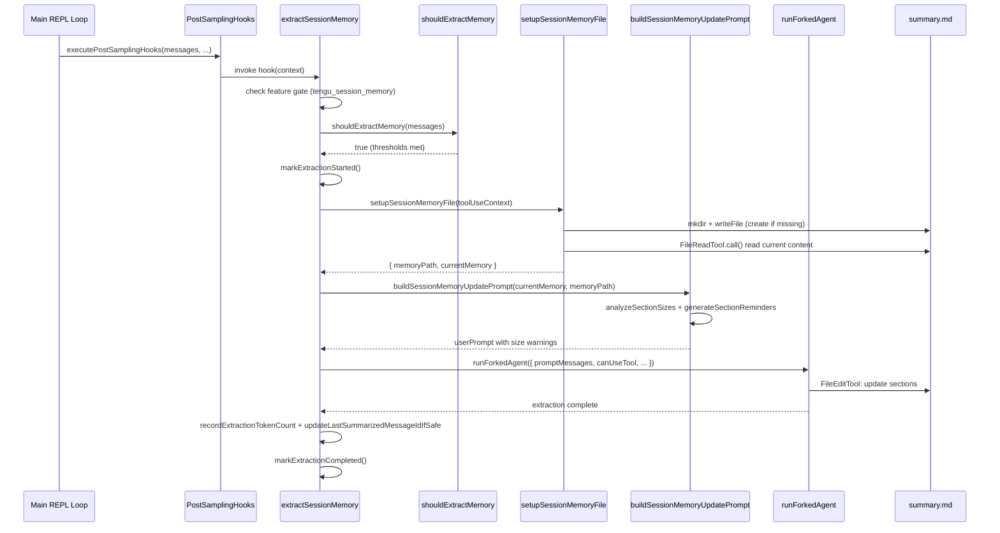
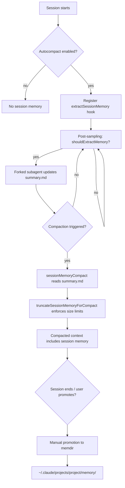

# Session Memory and Memory Extraction

## Overview

Session memory is the mechanism by which cc persists knowledge about an ongoing conversation into a structured markdown file, ensuring that critical context survives compaction and can be carried across sessions. The implementation lives in `src/services/SessionMemory/` and is driven by three interlocking components: a feature-gated extraction pipeline, a prompt-driven subagent, and a sectioned markdown template that acts as the persistent memory artifact. The system operates entirely in the background, using a forked subagent to update the memory file after each model sampling turn, without interrupting the user's conversation flow.

The design maps directly onto HER Pattern 3, Tiered Memory. The session memory file is a Tier 1 artifact -- a compact index that is always loaded into context when compaction occurs. It contains pointers and summaries rather than full transcripts, keeping the token footprint bounded. The full conversation history remains on disk as Tier 3 (persisted as JSONL in the session storage directory), and topic-specific details are available on demand as Tier 2 (the memdir filesystem). The session memory file bridges these tiers: after compaction, the agent can reconstruct enough context from the structured notes to continue productive work without re-reading the full transcript.

A key architectural choice is the separation between the generator and the extractor. The main conversation loop does not modify the memory file. Instead, a forked subagent with a restricted tool set (only `FileEditTool` on the exact memory path) performs the update. This isolation prevents the extraction process from mutating any shared state and aligns with the HER observation that self-evaluation bias is mitigated by structural separation -- the extractor operates in a fresh context with no investment in the conversation it is summarizing. The subagent also receives the full conversation history via `forkContextMessages`, giving it complete visibility into what was said while maintaining complete isolation from the parent's mutable state.

The system is conservative about when it triggers extraction. Two thresholds must be met before an update occurs: a token-growth threshold (measuring how much new context has accumulated since the last extraction) and a tool-call threshold (measuring how many tool interactions have occurred). This dual gating prevents the system from wasting tokens on incremental updates when little has changed, while ensuring that the memory file stays current enough to be useful during compaction.

## Data structures and contracts

The session memory system is governed by a configuration type that controls when extraction triggers fire, a template that defines the sectioned structure of the memory file, and a set of thresholds that gate both initialization and periodic updates.

```typescript
// src/services/SessionMemory/sessionMemoryUtils.ts:L18-L29 — SessionMemoryConfig type definition
export type SessionMemoryConfig = {
  /** Minimum context window tokens before initializing session memory.
   * Uses the same token counting as autocompact (input + output + cache tokens)
   * to ensure consistent behavior between the two features. */
  minimumMessageTokensToInit: number
  /** Minimum context window growth (in tokens) between session memory updates.
   * Uses the same token counting as autocompact (tokenCountWithEstimation)
   * to measure actual context growth, not cumulative API usage. */
  minimumTokensBetweenUpdate: number
  /** Number of tool calls between session memory updates */
  toolCallsBetweenUpdates: number
}
```

The `SessionMemoryConfig` type defines three thresholds. `minimumMessageTokensToInit` (default 10,000) prevents the system from extracting memory until the conversation has accumulated enough context to be worth summarizing. `minimumTokensBetweenUpdate` (default 5,000) ensures that successive extractions are spaced far enough apart to avoid redundant work. `toolCallsBetweenUpdates` (default 3) adds a tool-call gating condition that prevents extraction from firing during the middle of a multi-tool workflow. Both token thresholds use the same `tokenCountWithEstimation` metric as the autocompact system, which counts input tokens, output tokens, and cache tokens together, ensuring consistent behavior between the two features. The token counting alignment is deliberate: if session memory used a different metric, it could trigger extractions at different points than compaction, leading to a scenario where compaction fires before the memory file has been updated.

The default configuration is defined as a constant:

```typescript
// src/services/SessionMemory/sessionMemoryUtils.ts:L32-L36 — Default config values
export const DEFAULT_SESSION_MEMORY_CONFIG: SessionMemoryConfig = {
  minimumMessageTokensToInit: 10000,
  minimumTokensBetweenUpdate: 5000,
  toolCallsBetweenUpdates: 3,
}
```

These defaults can be overridden by a GrowthBook remote config under the key `tengu_sm_config`. The remote config is loaded lazily when the first extraction hook fires, via `initSessionMemoryConfigIfNeeded`, which is memoized to run only once per session `src/services/SessionMemory/sessionMemory.ts:L240-L264`. The memoization ensures that the config is not re-fetched on every sampling turn, reducing both latency and API surface. The override logic is defensive: remote values are only used if they are explicitly set as positive numbers, preventing a zero-valued remote field from overriding a sensible default.

The memory file itself follows a fixed template with ten sections, each preceded by a header and an italic description line that serves as an in-place instruction to the extraction agent:

```typescript
// src/services/SessionMemory/prompts.ts:L11-L41 — DEFAULT_SESSION_MEMORY_TEMPLATE
export const DEFAULT_SESSION_MEMORY_TEMPLATE = `
# Session Title
_A short and distinctive 5-10 word descriptive title for the session. Super info dense, no filler_

# Current State
_What is actively being worked on right now? Pending tasks not yet completed. Immediate next steps._

# Task specification
_What did the user ask to build? Any design decisions or other explanatory context_

# Files and Functions
_What are the important files? In short, what do they contain and why are they relevant?_

# Workflow
_What bash commands are usually run and in what order? How to interpret their output if not obvious?_

# Errors & Corrections
_Errors encountered and how they were fixed. What did the user correct? What approaches failed and should not be tried again?_

# Codebase and System Documentation
_What are the important system components? How do they work/fit together?_

# Learnings
_What has worked well? What has not? What to avoid? Do not duplicate items from other sections_

# Key results
_If the user asked a specific output such as an answer to a question, a table, or other document, repeat the exact result here_

# Worklog
_Step by step, what was attempted, done? Very terse summary for each step_
`
```

The template is structured for machine readability: each section has a specific purpose, and the italic descriptions are preserved during updates as immutable template instructions. The `Current State` section is critical for continuity after compaction -- the extraction prompt explicitly instructs the subagent to always update it to reflect the most recent work `src/services/SessionMemory/prompts.ts:L69`. The `Errors & Corrections` section captures failed approaches, which is essential for preventing the agent from retrying known-bad strategies after a compaction event discards the original conversation context. The `Key results` section preserves exact outputs that the user requested, such as tables, documents, or answers to specific questions, ensuring these are not lost across compaction boundaries.

Two constants govern the size budget of the memory file. `MAX_SECTION_LENGTH` (2,000 tokens) limits individual sections, while `MAX_TOTAL_SESSION_MEMORY_TOKENS` (12,000 tokens) caps the entire file `src/services/SessionMemory/prompts.ts:L8-L9`. When the file exceeds these limits, the system generates explicit reminders appended to the extraction prompt, directing the subagent to condense oversized sections. The total budget of 12,000 tokens is roughly 5-8% of a typical context window, making the memory file compact enough to load without crowding out the post-compaction conversation context.

## Control flow

The session memory pipeline is activated through a post-sampling hook registered during initialization. The `initSessionMemory` function registers the `extractSessionMemory` hook with the post-sampling hook registry, but only if autocompact is enabled -- session memory is designed to serve compaction, so it respects the same toggle `src/services/SessionMemory/sessionMemory.ts:L357-L375`.

```typescript
// src/services/SessionMemory/sessionMemory.ts:L357-L375 — initSessionMemory registration
export function initSessionMemory(): void {
  if (getIsRemoteMode()) return
  const autoCompactEnabled = isAutoCompactEnabled()

  if (process.env.USER_TYPE === 'ant') {
    logEvent('tengu_session_memory_init', {
      auto_compact_enabled: autoCompactEnabled,
    })
  }

  if (!autoCompactEnabled) {
    return
  }

  registerPostSamplingHook(extractSessionMemory)
}
```

The function first checks `getIsRemoteMode()` and returns immediately if the session is running in remote mode, where file system access is not available. The `isAutoCompactEnabled()` check ensures that session memory is only active when the autocompact feature is also active, since the primary purpose of session memory is to provide a compact representation that survives the autocompact process. The `registerPostSamplingHook` call adds the extraction function to an internal array of hooks. After each model sampling turn, the REPL loop calls `executePostSamplingHooks`, which iterates through all registered hooks and invokes each one with the full message history and tool use context `src/utils/hooks/postSamplingHooks.ts:L45-L70`. Hook errors are logged but do not propagate, ensuring that a failed memory extraction never disrupts the main conversation.

The core decision logic lives in `shouldExtractMemory`, which evaluates three conditions before allowing an extraction to proceed:

```typescript
// src/services/SessionMemory/sessionMemory.ts:L134-L181 — shouldExtractMemory decision logic
export function shouldExtractMemory(messages: Message[]): boolean {
  const currentTokenCount = tokenCountWithEstimation(messages)
  if (!isSessionMemoryInitialized()) {
    if (!hasMetInitializationThreshold(currentTokenCount)) {
      return false
    }
    markSessionMemoryInitialized()
  }

  const hasMetTokenThreshold = hasMetUpdateThreshold(currentTokenCount)

  const toolCallsSinceLastUpdate = countToolCallsSince(
    messages,
    lastMemoryMessageUuid,
  )
  const hasMetToolCallThreshold =
    toolCallsSinceLastUpdate >= getToolCallsBetweenUpdates()

  const hasToolCallsInLastTurn = hasToolCallsInLastAssistantTurn(messages)

  const shouldExtract =
    (hasMetTokenThreshold && hasMetToolCallThreshold) ||
    (hasMetTokenThreshold && !hasToolCallsInLastTurn)

  if (shouldExtract) {
    const lastMessage = messages[messages.length - 1]
    if (lastMessage?.uuid) {
      lastMemoryMessageUuid = lastMessage.uuid
    }
    return true
  }

  return false
}
```

The function first checks whether session memory has been initialized -- that is, whether the conversation has ever exceeded the `minimumMessageTokensToInit` threshold. If not, and the threshold has not yet been met, extraction is skipped. Once the initialization threshold is crossed, `markSessionMemoryInitialized()` sets a flag that persists for the rest of the session `src/services/SessionMemory/sessionMemoryUtils.ts:L158-L167`.

The extraction trigger then fires when two conditions are both satisfied: the token threshold has been met (at least 5,000 new tokens since the last extraction, measured as `currentTokenCount - tokensAtLastExtraction` via `hasMetUpdateThreshold`), and either the tool-call threshold has been met (at least 3 tool calls since the last extraction) or the last assistant turn contains no tool calls. The second disjunct is important: it allows extraction to happen at natural conversation breaks even if the tool-call count is low. The token threshold is always required -- even if the tool-call threshold is met, extraction is deferred until enough new context has accumulated. This prevents excessive extractions that would waste tokens on incremental updates.

The `countToolCallsSince` helper scans messages starting from the UUID recorded in `lastMemoryMessageUuid`, counting `tool_use` blocks in assistant messages `src/services/SessionMemory/sessionMemory.ts:L108-L132`. When extraction is triggered, the UUID of the last message in the array is recorded as `lastMemoryMessageUuid`, establishing the starting point for the next tool-call count.

Once the decision to extract is made, the pipeline executes the following sequence:



The setup phase creates the memory directory and file if they do not exist, writing the template as the initial content `src/services/SessionMemory/sessionMemory.ts:L183-L233`. The file path is derived from the session storage directory: `~/.claude/projects/<project>/<sessionId>/session-memory/summary.md` `src/utils/permissions/filesystem.ts:L261-L271`. The directory is created with mode `0o700` (owner-only access) and the file with mode `0o600` (owner read/write only), reflecting the potentially sensitive nature of conversation summaries. The setup also invalidates any cached file-read state via `toolUseContext.readFileState.delete(memoryPath)` before reading, preventing a stale deduplication stub from being returned by `FileReadTool`.

The extraction itself is performed by `runForkedAgent`, which spawns a subagent in a forked process with an isolated context. The subagent receives a single user message containing the extraction prompt, and its tool set is restricted by `createMemoryFileCanUseTool`, which only allows `FileEditTool` on the exact memory file path `src/services/SessionMemory/sessionMemory.ts:L460-L482`. All other tool calls are denied with an explanatory message. This ensures the subagent cannot modify any other file, execute commands, or access network resources during the extraction. The `createSubagentContext` call at the beginning of the extraction clones the parent's `readFileState` and creates a fresh `denialTracking` state, preventing the subagent's tool usage from polluting the parent's permission cache.

The extraction prompt is constructed by `buildSessionMemoryUpdatePrompt`, which loads the prompt template, substitutes the `{{currentNotes}}` and `{{notesPath}}` variables, and appends section-size reminders if any section exceeds its budget `src/services/SessionMemory/prompts.ts:L226-L247`. The prompt explicitly instructs the subagent to use the Edit tool in parallel, to preserve section headers and italic descriptions, and to never reference the note-taking process itself in the output. The prompt also contains a critical instruction that the entire message is not part of the user conversation and should not be referenced in the notes `src/services/SessionMemory/prompts.ts:L44`.

The `analyzeSectionSizes` helper parses the current memory file content, splitting it on `# ` headers, and estimates the token count of each section using `roughTokenCountEstimation` `src/services/SessionMemory/prompts.ts:L134-L159`. The `generateSectionReminders` function then produces warning text for any section exceeding `MAX_SECTION_LENGTH`, and a critical budget warning when the total exceeds `MAX_TOTAL_SESSION_MEMORY_TOKENS` `src/services/SessionMemory/prompts.ts:L164-L196`. When the total budget is exceeded, the reminder explicitly directs the subagent to prioritize keeping `Current State` and `Errors & Corrections` accurate and detailed while aggressively shortening other sections.

After a successful extraction, the system records the token count at extraction time (used to compute the delta for the next update threshold), updates the `lastSummarizedMessageId` only if the last assistant turn has no pending tool calls (to avoid orphaned tool results), and marks extraction as completed `src/services/SessionMemory/sessionMemory.ts:L328-L349`. The `extractSessionMemory` function itself is wrapped with the `sequential` combinator, which ensures that only one extraction can run at a time, preventing concurrent extractions from producing conflicting edits to the same file.

The promotion path from session-scoped memory to the project-level memdir follows a separate flow:



When autocompact fires, the compaction system calls `waitForSessionMemoryExtraction` to ensure any in-progress extraction completes before compaction begins `src/services/SessionMemory/sessionMemoryUtils.ts:L89-L105`. This prevents a race where compaction reads a partially-updated memory file. The wait has a 15-second timeout and a 60-second staleness check -- if the extraction has been running for over a minute, it is assumed stuck and the wait returns immediately.

The `truncateSessionMemoryForCompact` function enforces per-section size limits before the memory file is injected into the post-compaction context `src/services/SessionMemory/prompts.ts:L256-L296`. It iterates through sections, truncating any that exceed `MAX_SECTION_LENGTH * 4` characters (the rough token estimation uses a 4-char-per-token heuristic), and appends a `[... section truncated for length ...]` marker at the truncation boundary. The truncation happens at a line boundary to avoid cutting content mid-sentence, trading precision for readability.

## Edge cases and failure modes

**Feature gate and stale configuration.** The feature gate (`tengu_session_memory`) and remote config (`tengu_sm_config`) are read from a GrowthBook cache that may be stale. The `isSessionMemoryGateEnabled` and `getSessionMemoryRemoteConfig` functions return immediately without blocking on GrowthBook initialization `src/services/SessionMemory/sessionMemory.ts:L80-L93`. This means the first few extractions in a session may use default values rather than the latest remote configuration. The tradeoff is intentional: blocking on GrowthBook initialization would add latency to every sampling turn, which is unacceptable for a system that runs after every model response. The gate check failure is logged once per session (for internal users only) via the `tengu_session_memory_gate_disabled` event `src/services/SessionMemory/sessionMemory.ts:L286-L289`.

**Extraction stall detection.** The `extractionStartedAt` timestamp is set when extraction begins and cleared when it completes. If a forked subagent hangs or crashes without calling `markExtractionCompleted`, the timestamp remains set. The `waitForSessionMemoryExtraction` function detects this by checking whether the extraction age exceeds `EXTRACTION_STALE_THRESHOLD_MS` (60 seconds) `src/services/SessionMemory/sessionMemoryUtils.ts:L89-L105`. A stale extraction is treated as completed, allowing compaction to proceed. However, if the forked process actually wrote partial edits to the memory file before crashing, the file may be in an inconsistent state. The next extraction cycle will overwrite the affected sections, but transient inconsistency is possible. The 15-second wait timeout provides a secondary safety net: even if the staleness check fails, compaction will not wait indefinitely.

**Template customization and variable substitution.** Users can override both the memory template and the extraction prompt by placing files at `~/.claude/session-memory/config/template.md` and `~/.claude/session-memory/config/prompt.md` respectively `src/services/SessionMemory/prompts.ts:L86-L129`. The variable substitution function uses `{{variableName}}` syntax and performs a single-pass replacement to avoid two bugs: `$` backreference corruption in regex replacement and double-substitution when user content accidentally contains a variable pattern `src/services/SessionMemory/prompts.ts:L201-L213`. The single-pass approach replaces each `{{key}}` match exactly once, in order of appearance, using `Object.prototype.hasOwnProperty.call(variables, key)` to guard against prototype pollution. If a custom template or prompt file cannot be read (for any reason other than ENOENT), the system falls back to the default and logs the error rather than crashing the extraction pipeline.

**Self-evaluation bias in extraction quality.** The extraction subagent evaluates and summarizes the same conversation that the main agent is conducting. Although the subagent runs in a forked context with a fresh conversation window, the extraction prompt itself includes the current memory file content, which was previously written by a prior extraction cycle. This creates a subtle form of self-reinforcement: errors in a previous extraction may be preserved because the subagent sees them as established content. The HER identifies this as the generator-evaluator Ouroboros Problem -- when both generator and evaluator are LLMs, there is no independent ground truth. The NLAH paper's ablation data shows that adding a verifier can actually hurt performance (-0.8% on SWE-bench). The cc design mitigates this through structural constraints: the fixed template sections prevent the subagent from reorganizing or inventing new categories, and the italic description lines serve as immutable instructions that cannot be edited away. But the content within each section is only as reliable as the model's summarization ability.

**Race with concurrent tool calls.** The `shouldExtractMemory` function checks whether the last assistant turn has pending tool calls via `hasToolCallsInLastAssistantTurn`. If it does, extraction is deferred unless the token and tool-call thresholds are both met `src/services/SessionMemory/sessionMemory.ts:L168-L170`. This prevents extraction from capturing a mid-workflow snapshot where tool results have not yet been processed. However, if the token threshold is met and the tool-call threshold is also met, extraction proceeds regardless -- the rationale being that enough context has accumulated to make a useful extraction even if a workflow is mid-flight.

**Manual extraction bypass.** The `manuallyExtractSessionMemory` function, used by the `/summary` command, bypasses all threshold checks and directly triggers an extraction `src/services/SessionMemory/sessionMemory.ts:L387-L453`. This function constructs its own `cacheSafeParams` rather than using the cached params from the main loop, which means it cannot share the prompt cache with the parent conversation. Each manual extraction incurs the full cost of a fresh API request. The function is wrapped in a try/catch that returns a structured `ManualExtractionResult` with `success: false` and an error message on failure, rather than propagating the exception to the caller.

**Remote mode exclusion.** The `initSessionMemory` function returns immediately if `getIsRemoteMode()` is true `src/services/SessionMemory/sessionMemory.ts:L358`. In remote mode, the agent does not have direct file system access, so the memory file cannot be written. This check prevents the system from registering a hook that would inevitably fail on every invocation.

**Empty memory detection for compaction fallback.** The `isSessionMemoryEmpty` function compares the trimmed content of the memory file to the trimmed template, returning true if they are identical `src/services/SessionMemory/prompts.ts:L220-L224`. This detection is used by the compaction system to decide whether to fall back to legacy compact behavior when the session memory file has never been populated with actual content. Without this check, compaction would inject the empty template into the post-compaction context, wasting tokens on template instructions that contain no information.

## Where cc diverges from the published pattern

HER Pattern 3, Tiered Memory prescribes three tiers: a compact index always in context, topic files on demand, and full transcripts on disk. The cc implementation follows this structure but collapses Tier 2 into Tier 1 for the session memory file. Rather than maintaining separate topic files that are loaded on demand, the session memory file is a single markdown document with ten fixed sections. All sections are loaded together when the file is read during compaction. This simplification trades the context-window savings of lazy loading for implementation simplicity -- there is no need for a topic-discovery or topic-loading mechanism. The per-section size limits (`MAX_SECTION_LENGTH` = 2,000 tokens) and the total budget (`MAX_TOTAL_SESSION_MEMORY_TOKENS` = 12,000 tokens) serve as a substitute for lazy loading: they cap the worst-case context cost even though all sections are always present.

The HER recommends that the evaluator agent operate "in a fresh context window with no knowledge of the generation process" to combat self-evaluation bias. The cc extraction subagent does run in a forked context, but the extraction prompt includes the current memory file content, which was itself produced by a prior extraction. This creates a chain of LLM-generated evaluations rather than a truly independent assessment. The structural mitigation -- fixed sections, immutable template instructions, size limits -- is a pragmatic compromise. A fully independent evaluator would require a separate model call with different instructions and no access to prior extractions, doubling the cost of each extraction cycle.

The HER notes that "the strongest evaluators are deterministic (tests, linters, type checkers) -- use LLM evaluation only for judgments that deterministic tools cannot make." The session memory system does not use any deterministic verification of extraction quality. There is no schema validation of the memory file content, no checksum comparison between the pre- and post-extraction states, and no test that verifies the extracted information is accurate. The only structural enforcement is the template format itself -- the headers and italic descriptions must be preserved -- but the content within each section is entirely unconstrained. A deterministic verifier could, for example, check that file paths mentioned in the `Files and Functions` section actually exist, or that error messages in `Errors & Corrections` match the conversation history. This remains an open gap in the current implementation.

The feature gate mechanism diverges from a traditional configuration system. Rather than reading the gate synchronously at initialization time, cc caches the GrowthBook value and reads it lazily when the hook fires `src/services/SessionMemory/sessionMemory.ts:L80-L82`. This means the feature can appear to be enabled or disabled based on stale data. A user who toggles the feature flag in GrowthBook may not see the change take effect until the cache refreshes in the background. This is an intentional tradeoff: the alternative (blocking on GrowthBook initialization before registering the hook) would add startup latency and could cause the hook to miss early extraction opportunities.

The sequential wrapper on `extractSessionMemory` is a notable design choice that is not part of the published pattern. By serializing all extraction attempts, the system prevents concurrent subagents from producing conflicting edits to the same file. This is necessary because the extraction prompt instructs the subagent to make multiple Edit calls in parallel, and two concurrent extraction cycles could produce interleaved edits that leave the file in an inconsistent state. The serial guarantee is achieved by the `sequential` combinator, which queues invocations and processes them one at a time.

## Developer takeaways for building a long-running agent

Session memory extraction solves a fundamental problem for long-running agents: the context window is finite, and compaction is lossy. Without a structured memory artifact, every compaction event risks discarding information that the agent needs to continue productive work. The cc implementation demonstrates that a background extraction pipeline, driven by a forked subagent with a restricted tool set, can maintain a compact but information-dense summary that survives compaction. The key design choices are worth studying: the fixed template with immutable section instructions prevents drift, the per-section token budgets prevent any single section from consuming the entire context budget, and the dual-threshold trigger (tokens plus tool calls) ensures that extractions happen at natural conversation boundaries rather than mid-workflow. The feature-gate-as-cache pattern is a pragmatic response to the latency requirements of a system that runs after every model response -- accept potentially stale configuration in exchange for zero-latency reads. For builders of long-running agents, the most important lesson is that memory extraction is not a one-time operation but a continuous process that must be carefully gated to avoid wasting tokens on redundant updates, carefully isolated to avoid corrupting the main conversation state, and carefully bounded to prevent the memory artifact itself from becoming a context-window liability. The absence of deterministic verification of extraction quality is a known gap; any production system should consider adding schema validation or checksum-based change detection to catch extraction errors before they propagate through successive compaction cycles.
