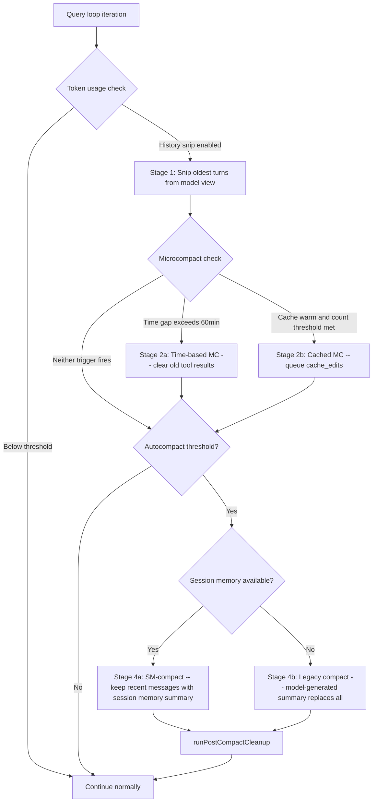
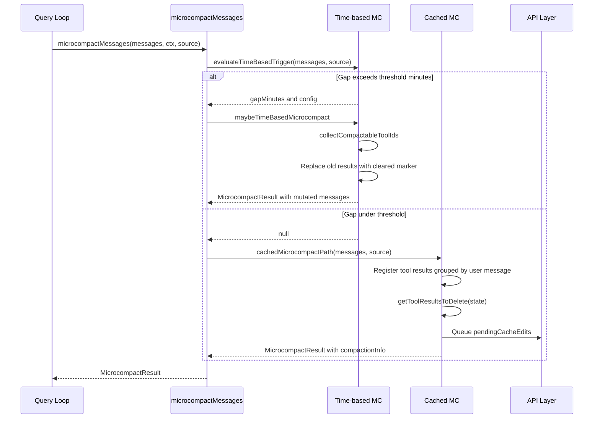
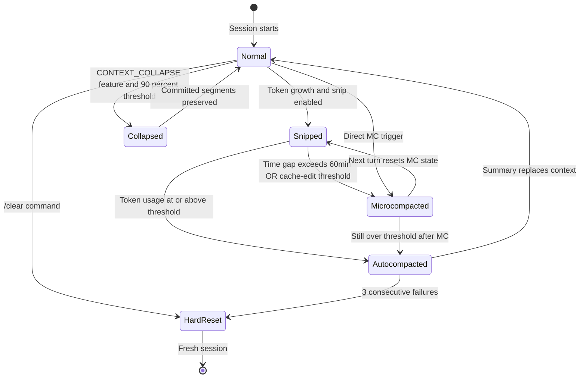

# Compaction Hierarchy: Five Stages of Context Rescue

## Overview

A long-running agent accumulates context until the model's context window overflows. Without intervention the agent either hits a hard API limit and crashes, or suffers context rot -- the gradual 30%+ performance degradation identified in HER §6.1 where information in mid-window positions is least reliably attended to. The agent re-solves problems it already addressed, contradicts earlier statements, and loses track of goals. Context rot is insidious because it is gradual and often goes unnoticed until significant degradation has occurred. The "mid-window" position is the critical vulnerability: information at the beginning and end of a context window is more reliably attended to, while information in the middle degrades fastest.

cc solves this with a five-stage compaction hierarchy, each stage more aggressive than the last: history_snip, microcompact, context collapse, autocompact, and hard reset. The terminology registry defines compaction as "the process of reducing context size by summarizing or removing older messages," with cc implementing "a five-stage hierarchy: history_snip → microcompact → context collapse → autocompact → hard reset." The hierarchy is not a linear pipeline but a set of independent mechanisms triggered at different thresholds and operating with different preservation semantics.

Stage 1 (history_snip) removes the oldest conversation turns from the model-facing view while keeping them in session storage for UI scrollback. Stage 2 (microcompact) selectively clears verbose tool results from the message stream, replacing them with a short marker string. It has three sub-paths: time-based content clearing when the server cache has expired, cached-microcompact cache editing when the cache is warm, and API-based server-side context management. Stage 3 (context collapse) is a server-coordinated granular commit strategy that preserves structured conversation segments before replacing them, using a 90% commit / 95% blocking protocol. Stage 4 (autocompact) invokes a model-based summarization pass that replaces the entire pre-boundary conversation with a compressed summary, or uses pre-extracted session memory as a cheaper alternative. Stage 5 (hard reset) discards everything and starts fresh -- the escape hatch of last resort.

HER §8 identifies six context management techniques ranked by effectiveness: observation masking (52% verified cost reduction), LLM summarization, progressive compaction, structured note-taking, sub-agent isolation, and per-tool-type summarization. cc's five-stage hierarchy implements the first three of these directly and touches the fourth through session memory. Observation masking maps to microcompact's tool-result clearing. LLM summarization maps to the legacy autocompact path. Progressive compaction is the hierarchy itself. Structured note-taking is approximated by the session memory file that the SM-compact path reads. Sub-agent isolation is orthogonal -- it is addressed by cc's forked-agent architecture rather than by compaction. Per-tool-type summarization is partially implemented through the `COMPACTABLE_TOOLS` set, which selects which tools' results are eligible for clearing (verbose tools like Read, Bash, Grep) versus tools whose results are preserved (tools not in the set).

The key architectural insight is that each stage trades preservation fidelity for token savings. History snip preserves all data on disk but hides it from the model. Microcompact preserves the tool-use skeleton but replaces result content. Autocompact preserves a semantic summary but discards the original turns. The hard reset preserves nothing. This progressive loss is intentional: it mirrors the escalating urgency of context pressure. When the window is only mildly over budget, the least-destructive stage suffices. When the window is critically full, only a full replacement will work.

The entire compaction subsystem lives in `src/services/compact/`, with shared utilities in `src/utils/messages.ts`. The key files are `compact.ts` (1705 lines, containing the core compaction logic and post-compact attachment restoration), `autoCompact.ts` (351 lines, the autocompact gate and threshold calculation), `microCompact.ts` (530 lines, the microcompact entry point and time-based clearing), `apiMicrocompact.ts` (153 lines, server-side context management configuration), `sessionMemoryCompact.ts` (630 lines, the session-memory-based compaction path), `timeBasedMCConfig.ts` (43 lines, GrowthBook-driven configuration for time-based triggers), and `postCompactCleanup.ts` (77 lines, cache and state reset after compaction).

## Data structures and contracts

The central contract is `CompactionResult`, the value returned by every compaction path. Whether the compaction was triggered automatically by token pressure or manually by the user, the result has the same shape:

```typescript
// src/services/compact/compact.ts:L299-L310
export interface CompactionResult {
  boundaryMarker: SystemMessage
  summaryMessages: UserMessage[]
  attachments: AttachmentMessage[]
  hookResults: HookResultMessage[]
  messagesToKeep?: Message[]
  userDisplayMessage?: string
  preCompactTokenCount?: number
  postCompactTokenCount?: number
  truePostCompactTokenCount?: number
  compactionUsage?: ReturnType<typeof getTokenUsage>
}
```

The `boundaryMarker` is a `SystemCompactBoundaryMessage` that serves as a seam in the message chain. The `summaryMessages` contain the compressed representation of the pruned conversation. The `attachments` carry re-injected file contents, plan files, skill content, and delta announcements. The `hookResults` carry messages from SessionStart hooks executed post-compact. The optional `messagesToKeep` field enables suffix-preserving compaction -- when present, these messages are not summarized but preserved in their original form after the boundary. The `truePostCompactTokenCount` field distinguishes between the compaction API call's total usage (which includes the large pre-compact input) and the actual size of the resulting context. The `compactionUsage` captures the token breakdown (input, output, cache_read, cache_creation) of the compaction API call itself for telemetry.

The boundary marker is created by `createCompactBoundaryMessage`:

```typescript
// src/utils/messages.ts:L4530-L4555
export function createCompactBoundaryMessage(
  trigger: 'manual' | 'auto',
  preTokens: number,
  lastPreCompactMessageUuid?: UUID,
  userContext?: string,
  messagesSummarized?: number,
): SystemCompactBoundaryMessage {
  return {
    type: 'system',
    subtype: 'compact_boundary',
    content: `Conversation compacted`,
    isMeta: false,
    timestamp: new Date().toISOString(),
    uuid: randomUUID(),
    level: 'info',
    compactMetadata: {
      trigger,
      preTokens,
      userContext,
      messagesSummarized,
    },
    ...(lastPreCompactMessageUuid && {
      logicalParentUuid: lastPreCompactMessageUuid,
    }),
  }
}
```

The `compactMetadata` records the trigger type (manual or auto), the pre-compaction token count, optional user context from the manual compact prompt, and the number of messages summarized. The `logicalParentUuid` links the boundary to the last pre-compact message, which the session loader uses to reconstruct the chain. The boundary marker is a system message and is filtered by `normalizeMessagesForAPI`, so it never reaches the model -- it exists purely as a structural marker in the session transcript.

The function `getMessagesAfterCompactBoundary` uses this boundary to slice the message array:

```typescript
// src/utils/messages.ts:L4643-L4656
export function getMessagesAfterCompactBoundary<
  T extends Message | NormalizedMessage,
>(messages: T[], options?: { includeSnipped?: boolean }): T[] {
  const boundaryIndex = findLastCompactBoundaryIndex(messages)
  const sliced = boundaryIndex === -1 ? messages : messages.slice(boundaryIndex)
  if (!options?.includeSnipped && feature('HISTORY_SNIP')) {
    const { projectSnippedView } =
      require('../services/compact/snipProjection.js') as typeof import('../services/compact/snipProjection.js')
    return projectSnippedView(sliced as Message[]) as T[]
  }
  return sliced
}
```

This function serves a dual purpose: it slices at the compact boundary AND applies snip projection in the same pass. Every model-facing code path that reads messages goes through this function, ensuring that the model never sees pre-compaction history or snipped turns.

The `buildPostCompactMessages` function ensures consistent ordering of the result across all compaction paths. The order is: boundaryMarker, summaryMessages, messagesToKeep, attachments, hookResults (`src/services/compact/compact.ts:L330-L338`). This ordering matters because the boundary must come first (it marks the seam), the summary must follow (it provides the compressed context), and attachments must come after messagesToKeep (so that delta-diff logic can skip re-announcing tools already present in the preserved tail).

When `messagesToKeep` is present, the `annotateBoundaryWithPreservedSegment` function stamps the boundary with relink metadata:

```typescript
// src/services/compact/compact.ts:L349-L367
export function annotateBoundaryWithPreservedSegment(
  boundary: SystemCompactBoundaryMessage,
  anchorUuid: UUID,
  messagesToKeep: readonly Message[] | undefined,
): SystemCompactBoundaryMessage {
  const keep = messagesToKeep ?? []
  if (keep.length === 0) return boundary
  return {
    ...boundary,
    compactMetadata: {
      ...boundary.compactMetadata,
      preservedSegment: {
        headUuid: keep[0]!.uuid,
        anchorUuid,
        tailUuid: keep.at(-1)!.uuid,
      },
    },
  }
}
```

The `preservedSegment` contains three UUIDs: `headUuid` (the first kept message), `anchorUuid` (the message immediately before the kept segment in the desired chain -- either the last summary message for suffix-preserving compaction, or the boundary itself for prefix-preserving compaction), and `tailUuid` (the last kept message). The session loader uses these to patch the chain so that the preserved messages are correctly linked into the post-compaction sequence, avoiding the need to re-write the kept messages to disk.

The microcompact path uses a lighter contract:

```typescript
// src/services/compact/microCompact.ts:L215-L220
export type MicrocompactResult = {
  messages: Message[]
  compactionInfo?: {
    pendingCacheEdits?: PendingCacheEdits
  }
}
```

Where `PendingCacheEdits` tracks deleted tool IDs and the baseline cache-deleted token count:

```typescript
// src/services/compact/microCompact.ts:L207-L213
export type PendingCacheEdits = {
  trigger: 'auto'
  deletedToolIds: string[]
  baselineCacheDeletedTokens: number
}
```

The `baselineCacheDeletedTokens` field is critical for computing the per-operation delta of cache-deleted tokens. The API reports `cache_deleted_input_tokens` as a cumulative value that persists across responses, so the baseline from the previous response must be subtracted to get the incremental contribution of the current compaction operation.

The API-based microcompact strategy types define how the server-side context management API is configured:

```typescript
// src/services/compact/apiMicrocompact.ts:L35-L61
export type ContextEditStrategy =
  | {
      type: 'clear_tool_uses_20250919'
      trigger?: {
        type: 'input_tokens'
        value: number
      }
      keep?: {
        type: 'tool_uses'
        value: number
      }
      clear_tool_inputs?: boolean | string[]
      exclude_tools?: string[]
      clear_at_least?: {
        type: 'input_tokens'
        value: number
      }
    }
  | {
      type: 'clear_thinking_20251015'
      keep: { type: 'thinking_turns'; value: number } | 'all'
    }

export type ContextManagementConfig = {
  edits: ContextEditStrategy[]
}
```

The `ContextEditStrategy` union type encodes two server-side strategies. The `clear_tool_uses_20250919` strategy removes tool result content when input tokens exceed a threshold, with configurable trigger values, tool inclusion/exclusion lists, and a minimum clearing target. The `clear_thinking_20251015` strategy removes thinking blocks from earlier turns while preserving a configurable number of recent thinking turns. The `ContextManagementConfig` wrapper holds an array of strategies that the API applies in order, allowing both strategies to be active simultaneously.

Session memory compaction introduces its own configuration type for governing how many messages survive:

```typescript
// src/services/compact/sessionMemoryCompact.ts:L47-L54
export type SessionMemoryCompactConfig = {
  minTokens: number
  minTextBlockMessages: number
  maxTokens: number
}
```

These thresholds control the backward-expansion algorithm in `calculateMessagesToKeepIndex`. Defaults are 10,000 tokens minimum, 5 text-block messages minimum, and a 40,000-token hard cap (`src/services/compact/sessionMemoryCompact.ts:L57-L61`). The `minTextBlockMessages` threshold ensures that even if the token count is met, enough conversational turns survive for the model to maintain coherence.

The autocompact tracking state records whether compaction occurred and supports the circuit breaker:

```typescript
// src/services/compact/autoCompact.ts:L51-L60
export type AutoCompactTrackingState = {
  compacted: boolean
  turnCounter: number
  turnId: string
  consecutiveFailures?: number
}
```

The `consecutiveFailures` field is the circuit breaker counter. When it reaches `MAX_CONSECUTIVE_AUTOCOMPACT_FAILURES` (3), subsequent calls to `autoCompactIfNeeded` return immediately without attempting compaction (`src/services/compact/autoCompact.ts:L70`).

## Control flow



The flowchart shows the five stages arranged by escalation order. History snip (stage 1) runs at the message-filtering layer before any API call. Microcompact (stage 2) has two sub-paths: time-based clearing when the server cache has expired, and cache-editing when the cache is warm. Context collapse (stage 3) is a feature-gated mechanism that suppresses autocompact and manages headroom through a granular commit/rollback protocol. Autocompact (stage 4) fires when token usage crosses the threshold and has two implementations: session-memory-based (preferred) and legacy model-summarization-based. The hard reset (stage 5) is the `/clear` command, which discards all state.

### Stage 1: History snip

History snip removes the oldest turns from the model-facing view while preserving them in session storage. The REPL keeps full history for UI scrollback, so model-facing paths need both compact-slice and snip-filter applied. The `getMessagesAfterCompactBoundary` function applies snip projection by calling `projectSnippedView` on the sliced messages (`src/utils/messages.ts:L4648-L4654`). Snipped messages remain in the JSONL transcript but are invisible to the API. This is the least destructive stage: no information is permanently lost, and the model cannot see the removed turns. The `includeSnipped` option allows opt-out for UI components like the REPL's fullscreen compact handler that need to display snipped messages in scrollback.

History snip operates at the message-filtering layer, not at the compaction layer. It runs inside `getMessagesAfterCompactBoundary`, which is called by every model-facing code path that reads messages. The function first finds the last compact boundary using a backward scan (`findLastCompactBoundaryIndex`), slices the message array at that point, and then applies snip projection to remove turns that the snip subsystem has marked for removal. The dual operation -- compact slicing plus snip filtering -- ensures that the model sees neither pre-compaction history nor snipped turns, regardless of which mechanism removed them. The `isCompactBoundaryMessage` predicate checks for `type === 'system'` and `subtype === 'compact_boundary'` (`src/utils/messages.ts:L4608-L4611`), which is the same check used by the session loader to identify compaction seams.

### Stage 2: Microcompact

Microcompact selectively clears tool result content. The entry point is `microcompactMessages` in `src/services/compact/microCompact.ts`. It evaluates sub-paths in priority order: time-based first, then cached-microcompact, then no-op (the legacy content-clearing path was removed).



The time-based path fires when the gap since the last assistant message exceeds `gapThresholdMinutes` (default 60, matching the server's cache TTL). The rationale is that when the gap exceeds 60 minutes, the server's prompt cache has almost certainly expired and the full prefix will be rewritten anyway -- clearing old tool results before the request shrinks what gets rewritten, at zero marginal cost. The `evaluateTimeBasedTrigger` function computes the gap and returns it when the trigger fires, or null when it does not (`src/services/compact/microCompact.ts:L422-L444`).

When the cache is cold, there is no cached prefix to preserve, so the time-based path directly mutates message content, replacing old tool results with a marker string:

```typescript
// src/services/compact/microCompact.ts:L446-L492
function maybeTimeBasedMicrocompact(
  messages: Message[],
  querySource: QuerySource | undefined,
): MicrocompactResult | null {
  const trigger = evaluateTimeBasedTrigger(messages, querySource)
  if (!trigger) {
    return null
  }
  const { gapMinutes, config } = trigger

  const compactableIds = collectCompactableToolIds(messages)

  const keepRecent = Math.max(1, config.keepRecent)
  const keepSet = new Set(compactableIds.slice(-keepRecent))
  const clearSet = new Set(compactableIds.filter(id => !keepSet.has(id)))

  if (clearSet.size === 0) {
    return null
  }

  let tokensSaved = 0
  const result: Message[] = messages.map(message => {
    if (message.type !== 'user' || !Array.isArray(message.message.content)) {
      return message
    }
    let touched = false
    const newContent = message.message.content.map(block => {
      if (
        block.type === 'tool_result' &&
        clearSet.has(block.tool_use_id) &&
        block.content !== TIME_BASED_MC_CLEARED_MESSAGE
      ) {
        tokensSaved += calculateToolResultTokens(block)
        touched = true
        return { ...block, content: TIME_BASED_MC_CLEARED_MESSAGE }
      }
      return block
    })
    if (!touched) return message
    return {
      ...message,
      message: { ...message.message, content: newContent },
    }
  })
  // ...
}
```

The `collectCompactableToolIds` helper walks messages and collects tool_use IDs whose tool name is in the `COMPACTABLE_TOOLS` set -- Read, Bash, Grep, Glob, WebSearch, WebFetch, Edit, and Write (`src/services/compact/microCompact.ts:L41-L50`). These are the tools whose results are most verbose and least likely to be needed verbatim on subsequent turns. The `keepRecent` config (default 5) preserves the N most recent compactable tool results from clearing, ensuring the model retains some working context. The `Math.max(1, ...)` guard prevents a degenerate case where `slice(-0)` returns the full array (keeping everything) or where clearing ALL results leaves the model with zero working context.

The `TIME_BASED_MC_CLEARED_MESSAGE` constant is `'[Old tool result content cleared]'` (`src/services/compact/microCompact.ts:L36`). This inline constant avoids a circular dependency that would arise from importing `toolResultStorage.ts`, which pulls in `sessionStorage` and then `utils/messages` and `services/api/errors`, completing a loop back through `promptCacheBreakDetection`.

The cached-microcompact path runs when the server cache is warm. Instead of mutating message content, it queues `pendingCacheEdits` that the API layer applies as `cache_edits` blocks, removing tool results from the cached prefix without invalidating it. This is the more sophisticated path: it preserves cache hit rates while shrinking effective context. The trade-off is that it requires the `CACHED_MICROCOMPACT` feature flag, ant-only user type, a supported model, and a main-thread query source (`src/services/compact/microCompact.ts:L276-L286`). Only the main thread is allowed because subagents (session_memory, prompt_suggestion, and other forked agents) would register their tool_results in the global `cachedMCState`, causing the main thread to try deleting tools that do not exist in its own conversation.

The API-based microcompact in `src/services/compact/apiMicrocompact.ts` provides a third mechanism: server-side context management strategies that the API itself executes. The `clear_tool_uses_20250919` strategy triggers when input tokens exceed `DEFAULT_MAX_INPUT_TOKENS` (180,000) and clears at least enough tool results to reach the target of 40,000 tokens (`src/services/compact/apiMicrocompact.ts:L16-L17`). The `clear_thinking_20251015` strategy removes thinking blocks from earlier turns, preserving either all thinking blocks (default) or only the last N turns when `clearAllThinking` is set (triggered by more than 1 hour of idle time, which implies a cache miss) (`src/services/compact/apiMicrocompact.ts:L82-L87`). This is ant-only and gated by environment variables `USE_API_CLEAR_TOOL_RESULTS` and `USE_API_CLEAR_TOOL_USES`.

The time-based configuration is managed by a GrowthBook feature flag with safe defaults:

```typescript
// src/services/compact/timeBasedMCConfig.ts:L30-L34
const TIME_BASED_MC_CONFIG_DEFAULTS: TimeBasedMCConfig = {
  enabled: false,
  gapThresholdMinutes: 60,
  keepRecent: 5,
}
```

The default `enabled: false` means time-based microcompact is opt-in via remote config. The 60-minute threshold is chosen to match the server's 1-hour cache TTL, ensuring that time-based clearing only fires when the cache would have expired anyway (`src/services/compact/timeBasedMCConfig.ts:L22-L23`).

### Stage 3: Context collapse

Context collapse is a feature-gated granular compaction strategy. When enabled, it suppresses autocompact entirely because "autocompact firing at effective-13k (~93% of effective) sits right between collapse's commit-start (90%) and blocking (95%), so it would race collapse and usually win, nuking granular context that collapse was about to save" (`src/services/compact/autoCompact.ts:L210-L213`). The `shouldAutoCompact` function checks `isContextCollapseEnabled()` and returns false when collapse is active, while still allowing reactive compact (the 413-error fallback) and manual `/compact` to function (`src/services/compact/autoCompact.ts:L215-L223`).

Context collapse manages headroom through a 90% commit / 95% blocking protocol. At 90% utilization, it commits structured conversation segments to a persistent log, preserving the actual conversation structure rather than a paraphrased summary. At 95% it blocks new agent spawns to prevent further context growth. This is more granular than autocompact's model-generated summary because the committed segments can be selectively restored, whereas a summary is an all-or-nothing representation.

The `shouldAutoCompact` function also guards against the `marble_origami` query source (the context-collapse agent itself). If this agent's context blows up and autocompact fires, `runPostCompactCleanup` would call `resetContextCollapse()` which destroys the main thread's committed log -- module-level state that is shared across forked processes (`src/services/compact/autoCompact.ts:L179-L183`).

### Stage 4: Autocompact

Autocompact fires when token usage exceeds `getAutoCompactThreshold(model)`, which is the effective context window minus `AUTOCOMPACT_BUFFER_TOKENS` (13,000) (`src/services/compact/autoCompact.ts:L62`). The effective context window is computed as the model's full context window minus `MAX_OUTPUT_TOKENS_FOR_SUMMARY` (20,000), with an optional override from `CLAUDE_CODE_AUTO_COMPACT_WINDOW` (`src/services/compact/autoCompact.ts:L33-L49`).

The `shouldAutoCompact` function implements the gate logic with multiple suppression conditions, each addressing a specific failure mode:

```typescript
// src/services/compact/autoCompact.ts:L160-L239
export async function shouldAutoCompact(
  messages: Message[],
  model: string,
  querySource?: QuerySource,
  snipTokensFreed = 0,
): Promise<boolean> {
  if (querySource === 'session_memory' || querySource === 'compact') {
    return false
  }
  if (feature('CONTEXT_COLLAPSE')) {
    if (querySource === 'marble_origami') {
      return false
    }
  }

  if (!isAutoCompactEnabled()) {
    return false
  }

  if (feature('REACTIVE_COMPACT')) {
    if (getFeatureValue_CACHED_MAY_BE_STALE('tengu_cobalt_raccoon', false)) {
      return false
    }
  }

  if (feature('CONTEXT_COLLAPSE')) {
    const { isContextCollapseEnabled } =
      require('../contextCollapse/index.js') as typeof import('../contextCollapse/index.js')
    if (isContextCollapseEnabled()) {
      return false
    }
  }

  const tokenCount = tokenCountWithEstimation(messages) - snipTokensFreed
  const threshold = getAutoCompactThreshold(model)
  const effectiveWindow = getEffectiveContextWindowSize(model)

  logForDebugging(
    `autocompact: tokens=${tokenCount} threshold=${threshold} effectiveWindow=${effectiveWindow}${snipTokensFreed > 0 ? ` snipFreed=${snipTokensFreed}` : ''}`,
  )

  const { isAboveAutoCompactThreshold } = calculateTokenWarningState(
    tokenCount,
    model,
  )

  return isAboveAutoCompactThreshold
}
```

The recursion guards on lines 171-173 prevent the compact agent itself from triggering autocompact, which would create an infinite loop. The `marble_origami` guard on line 179 prevents the context-collapse agent from destroying the main thread's committed log. The reactive-compact suppression on lines 195-199 defers proactive compaction to let the reactive path catch API 413 errors instead. The context-collapse suppression on lines 215-223 prevents autocompact from racing the collapse protocol. The `snipTokensFreed` parameter accounts for tokens already freed by history snip, since the surviving assistant message's usage field still reflects the pre-snip context and `tokenCountWithEstimation` cannot see the savings (`src/services/compact/autoCompact.ts:L166-L167`).

The `calculateTokenWarningState` function computes multiple thresholds for the UI and for compaction triggering:

```typescript
// src/services/compact/autoCompact.ts:L93-L145
export function calculateTokenWarningState(
  tokenUsage: number,
  model: string,
): {
  percentLeft: number
  isAboveWarningThreshold: boolean
  isAboveErrorThreshold: boolean
  isAboveAutoCompactThreshold: boolean
  isAtBlockingLimit: boolean
} {
  const autoCompactThreshold = getAutoCompactThreshold(model)
  const threshold = isAutoCompactEnabled()
    ? autoCompactThreshold
    : getEffectiveContextWindowSize(model)

  const percentLeft = Math.max(
    0,
    Math.round(((threshold - tokenUsage) / threshold) * 100),
  )

  const warningThreshold = threshold - WARNING_THRESHOLD_BUFFER_TOKENS
  const errorThreshold = threshold - ERROR_THRESHOLD_BUFFER_TOKENS

  const isAboveWarningThreshold = tokenUsage >= warningThreshold
  const isAboveErrorThreshold = tokenUsage >= errorThreshold

  const isAboveAutoCompactThreshold =
    isAutoCompactEnabled() && tokenUsage >= autoCompactThreshold

  const actualContextWindow = getEffectiveContextWindowSize(model)
  const defaultBlockingLimit =
    actualContextWindow - MANUAL_COMPACT_BUFFER_TOKENS

  // ...
  const isAtBlockingLimit = tokenUsage >= blockingLimit

  return {
    percentLeft,
    isAboveWarningThreshold,
    isAboveErrorThreshold,
    isAboveAutoCompactThreshold,
    isAtBlockingLimit,
  }
}
```

The four thresholds form a graduated warning system. The warning threshold fires at 20,000 tokens below the autocompact threshold, the error threshold fires at 20,000 tokens below as well, and the blocking limit fires at 3,000 tokens below the effective context window. When the blocking limit is reached, the agent cannot continue without either manual compaction or reducing context through other means.

When autocompact does fire, `autoCompactIfNeeded` first attempts session memory compaction, then falls back to legacy model-summarization compact:

```typescript
// src/services/compact/autoCompact.ts:L287-L310
  const sessionMemoryResult = await trySessionMemoryCompaction(
    messages,
    toolUseContext.agentId,
    recompactionInfo.autoCompactThreshold,
  )
  if (sessionMemoryResult) {
    setLastSummarizedMessageId(undefined)
    runPostCompactCleanup(querySource)
    if (feature('PROMPT_CACHE_BREAK_DETECTION')) {
      notifyCompaction(querySource ?? 'compact', toolUseContext.agentId)
    }
    markPostCompaction()
    return {
      wasCompacted: true,
      compactionResult: sessionMemoryResult,
    }
  }
```

The session memory path reads the extracted session memory file, calculates a `startIndex` for messages to keep, and builds a `CompactionResult` with the session memory as the summary. This avoids the cost and latency of a compact API call entirely. The `trySessionMemoryCompaction` function waits for any in-progress session memory extraction to complete (with a timeout), then checks whether session memory exists and is non-empty (`src/services/compact/sessionMemoryCompact.ts:L514-L543`). If the session memory file matches the template (no actual content extracted), it falls back to legacy compact.

The `calculateMessagesToKeepIndex` function expands backward from the last summarized message until it meets the minimum thresholds:

```typescript
// src/services/compact/sessionMemoryCompact.ts:L324-L397
export function calculateMessagesToKeepIndex(
  messages: Message[],
  lastSummarizedIndex: number,
): number {
  if (messages.length === 0) {
    return 0
  }

  const config = getSessionMemoryCompactConfig()

  let startIndex =
    lastSummarizedIndex >= 0 ? lastSummarizedIndex + 1 : messages.length

  let totalTokens = 0
  let textBlockMessageCount = 0
  for (let i = startIndex; i < messages.length; i++) {
    const msg = messages[i]!
    totalTokens += estimateMessageTokens([msg])
    if (hasTextBlocks(msg)) {
      textBlockMessageCount++
    }
  }

  if (totalTokens >= config.maxTokens) {
    return adjustIndexToPreserveAPIInvariants(messages, startIndex)
  }

  if (
    totalTokens >= config.minTokens &&
    textBlockMessageCount >= config.minTextBlockMessages
  ) {
    return adjustIndexToPreserveAPIInvariants(messages, startIndex)
  }

  const idx = messages.findLastIndex(m => isCompactBoundaryMessage(m))
  const floor = idx === -1 ? 0 : idx + 1
  for (let i = startIndex - 1; i >= floor; i--) {
    const msg = messages[i]!
    const msgTokens = estimateMessageTokens([msg])
    totalTokens += msgTokens
    if (hasTextBlocks(msg)) {
      textBlockMessageCount++
    }
    startIndex = i

    if (totalTokens >= config.maxTokens) {
      break
    }

    if (
      totalTokens >= config.minTokens &&
      textBlockMessageCount >= config.minTextBlockMessages
    ) {
      break
    }
  }

  return adjustIndexToPreserveAPIInvariants(messages, startIndex)
}
```

The algorithm starts from the message after `lastSummarizedIndex` (the boundary of what session memory already covers) and expands backward until both minimums are met. A floor at the last compact boundary prevents the expansion from crossing into a previous compaction's preserved segment, which would introduce a discontinuity in the session loader's chain-walk. The `adjustIndexToPreserveAPIInvariants` function is then called to ensure the final index does not split tool_use/tool_result pairs.

The `adjustIndexToPreserveAPIInvariants` function is critical for correctness and handles two scenarios that would cause API errors. First, tool_result blocks whose matching tool_use blocks are in the pruned range would create orphaned tool_results that the API rejects. Second, thinking blocks that share a `message.id` with kept assistant messages but are in separate streaming-fragment messages would be lost after `normalizeMessagesForAPI` merges fragments by ID. The function walks backward to include these dependent messages, ensuring the API never sees an invalid message sequence (`src/services/compact/sessionMemoryCompact.ts:L232-L314`).

The legacy compact path calls `compactConversation`, which streams a model-generated summary. It first executes PreCompact hooks, then sends the conversation plus a compact prompt to the model via a forked agent (to reuse the main conversation's prompt cache) or a direct streaming call as fallback (`src/services/compact/compact.ts:L387-L763`). The forked-agent path is preferred because it piggybacks on the main thread's cached prefix by sending identical cache-key params (system, tools, model, messages prefix, thinking config). Setting `maxOutputTokens` on the fork would clamp `budget_tokens` via `Math.min(budget, maxOutputTokens-1)` in `claude.ts`, creating a thinking config mismatch that invalidates the cache -- so the fork deliberately does not set it (`src/services/compact/compact.ts:L1181-L1186`).

Post-compact, the function re-injects a rich set of attachments to restore context. File attachments re-read up to 5 recently-accessed files within a 50,000-token total budget (`src/services/compact/compact.ts:L122-L124`). Each file is capped at 5,000 tokens, and files already present as Read tool results in the preserved tail are skipped to avoid re-injecting identical content the model can already see. Skill attachments preserve invoked skills with per-skill truncation to 5,000 tokens and a 25,000-token total budget (`src/services/compact/compact.ts:L129-L130`). Delta attachments re-announce deferred tools, agent listings, and MCP instructions against the empty message history, effectively announcing the full current set (`src/services/compact/compact.ts:L567-L585`).

A circuit breaker stops autocompact after 3 consecutive failures (`src/services/compact/autoCompact.ts:L70`). Without it, sessions with irrecoverably over-limit context hammer the API with doomed compaction attempts on every turn -- production data from 2026-03-10 identified 1,279 sessions with 50+ consecutive failures in a single session, wasting approximately 250K API calls per day globally.

### Stage 5: Hard reset

The hard reset is the `/clear` command, which discards all conversation state and starts fresh. It is not implemented in the compaction files themselves but is the escape hatch when no other stage can recover the context. There is no preservation: the model loses all accumulated knowledge of the session. Hard reset is also the implicit result when the autocompact circuit breaker trips after 3 consecutive failures -- the session continues but without any compaction mechanism to manage context, meaning the next prompt-too-long error will leave the user with no option but to clear.

The hard reset differs from autocompact in a critical way: autocompact replaces pre-boundary messages with a summary that preserves semantic content, while the hard reset discards everything without generating any summary. The only state that survives a hard reset is what is stored outside the conversation: files on disk, session memory (if already extracted), and any persistent state in the memdir filesystem. This is why structured note-taking (HER §8 technique 4) matters: if the agent maintains its own progress notes in files, those notes survive even a hard reset.

The post-compact cleanup function `runPostCompactCleanup` resets all caches and tracking state after any compaction event:

```typescript
// src/services/compact/postCompactCleanup.ts:L31-L77
export function runPostCompactCleanup(querySource?: QuerySource): void {
  const isMainThreadCompact =
    querySource === undefined ||
    querySource.startsWith('repl_main_thread') ||
    querySource === 'sdk'

  resetMicrocompactState()
  if (feature('CONTEXT_COLLAPSE')) {
    if (isMainThreadCompact) {
      ;(
        require('../contextCollapse/index.js') as typeof import('../contextCollapse/index.js')
      ).resetContextCollapse()
    }
  }
  if (isMainThreadCompact) {
    getUserContext.cache.clear?.()
    resetGetMemoryFilesCache('compact')
  }
  clearSystemPromptSections()
  clearClassifierApprovals()
  clearSpeculativeChecks()
  // Intentionally NOT calling resetSentSkillNames()
  clearBetaTracingState()
  // ...
  clearSessionMessagesCache()
}
```

The `isMainThreadCompact` guard is essential: subagents run in the same process and share module-level state with the main thread. Resetting the context-collapse store, memory file cache, or `getUserContext` memoization cache during a subagent compact would corrupt the main thread's state. The comment on line 65 explicitly notes that `sentSkillNames` is intentionally NOT reset because re-injecting the full skill listing (approximately 4K tokens) post-compact is pure `cache_creation` -- the model still has SkillTool in its schema, `invoked_skills` preserves used skills, and dynamic additions are handled by other reset mechanisms.



The state diagram shows how the stages relate as escalation levels. A session can move from normal operation to snipped to microcompacted to autocompacted in a single query loop iteration if token pressure is severe enough. The microcompacted state is transient: `resetMicrocompactState` is called after time-based clearing and after `runPostCompactCleanup`, so the next turn starts fresh. Context collapse is an alternative path that replaces autocompact when enabled, providing more granular preservation at the cost of complexity. The hard reset is the terminal state: once entered, there is no path back to the previous session's context.

## Edge cases and failure modes

**Prompt-too-long during compaction itself.** The compact request can itself hit the model's prompt-too-long limit, creating a deadlock where the user cannot compact because the conversation is too large to compact. The `compactConversation` function retries up to `MAX_PTL_RETRIES` (3) times, each time calling `truncateHeadForPTLRetry` to drop the oldest API-round groups from the messages being summarized (`src/services/compact/compact.ts:L460-L491`). The `truncateHeadForPTLRetry` function calculates how many groups to drop based on the token gap reported in the error, falling back to dropping 20% of groups when the gap is unparseable (some Vertex/Bedrock error formats do not include a numeric gap) (`src/services/compact/compact.ts:L243-L291`). Before grouping, the function strips its own synthetic marker from a previous retry, which would otherwise become its own group and cause the 20% fallback to stall by dropping only the marker on retry 2+. If all retries fail, the user receives the error message "Conversation too long."

**Orphaned tool_results.** When session memory compact calculates the keep index, it must ensure that every tool_result in the kept range has a matching tool_use block. The `adjustIndexToPreserveAPIInvariants` function walks backward to include the assistant messages containing matching tool_use blocks, even when those messages are in the pruned range (`src/services/compact/sessionMemoryCompact.ts:L232-L314`). A particularly tricky case involves streaming-fragment messages that share a `message.id` but have separate entries in session storage. In one documented bug scenario, index N holds a thinking block, index N+1 holds a tool_use block, and index N+2 holds the tool_result -- all with the same `message.id` X. If the keep index lands at N+1, the thinking block at N is excluded and lost after `normalizeMessagesForAPI` merges by ID. The function detects shared message IDs and adjusts the index to include all fragments.

**Subagent compaction corrupting main-thread state.** Subagents (session_memory, prompt_suggestion, compact agents) run in the same process and share module-level state. The `runPostCompactCleanup` function uses `isMainThreadCompact` to gate which caches are reset: only the main thread's context-collapse store and memory file cache are cleared on main-thread compacts. A subagent compact that reset these would destroy the main thread's state (`src/services/compact/postCompactCleanup.ts:L31-L42`). The `getUserContext` cache clearing is particularly important: `getUserContext` is a memoized outer layer wrapping `getClaudeMds()` which calls `getMemoryFiles()`. If only the inner `getMemoryFiles` cache is cleared, the next turn hits the `getUserContext` cache and never reaches `getMemoryFiles`, so the armed `InstructionsLoaded` hook never fires (`src/services/compact/postCompactCleanup.ts:L52-L60`).

**Autocompact circuit breaker.** Three consecutive autocompact failures trip the circuit breaker, preventing further attempts for the rest of the session (`src/services/compact/autoCompact.ts:L260-L264`). This prevents the API hammer pattern identified in production data where sessions with irrecoverably over-limit context would retry compaction on every turn, sometimes thousands of times. The `consecutiveFailures` counter is threaded through `AutoCompactTrackingState` across query loop iterations, and is reset to 0 on any successful compaction (`src/services/compact/autoCompact.ts:L332`).

**SM-compact threshold exceeded.** After session memory compaction calculates the post-compact token count, it checks against `autoCompactThreshold`. If the compacted context is still over the threshold (because session memory itself is large or too many recent messages were kept), SM-compact returns null and falls back to the legacy model-summarization path (`src/services/compact/sessionMemoryCompact.ts:L605-L614`). This prevents a scenario where SM-compact succeeds but the resulting context immediately triggers another autocompact on the next turn.

**Microcompact state desync.** Time-based microcompact directly mutates message content, invalidating the cached-microcompact module's registered tool IDs. If cached MC were to run on the next turn with stale state, it would try to cache_edit tools whose server-side entries no longer exist. The function calls `resetMicrocompactState()` after time-based clearing to prevent this desync (`src/services/compact/microCompact.ts:L517-L518`).

**Forked-agent cache mismatch.** The compact fork must send identical cache-key params to piggyback on the main thread's prompt cache. Setting `maxOutputTokens` on the fork would clamp `budget_tokens` in the thinking config, creating a mismatch that invalidates the cache. The code deliberately does not set `maxOutputTokens` on the forked path, while the streaming fallback path can safely set it since it does not share cache (`src/services/compact/compact.ts:L1181-L1186`).

**Image stripping for compaction.** Images in user messages can cause the compaction API call itself to hit the prompt-too-long limit, especially in sessions where users frequently attach images. The `stripImagesFromMessages` function replaces image and document blocks with `[image]` and `[document]` text markers before sending messages for compaction (`src/services/compact/compact.ts:L145-L200`). The function also strips images nested inside `tool_result` content arrays. This preserves the fact that an image was shared (the marker remains) while removing the large binary content that would blow the compaction request's token budget.

**Recompaction loops.** When autocompact fires but the resulting context is still over the threshold, the next turn will trigger autocompact again. The `RecompactionInfo` type tracks whether a compaction is a re-compaction in the same chain, how many turns have elapsed since the previous compact, and the previous compact's turn ID (`src/services/compact/compact.ts:L317-L323`). This metadata is logged in the `tengu_compact` event so that recompaction loops can be detected and analyzed in production telemetry. The `willRetriggerNextTurn` field in the event is computed by comparing `truePostCompactTokenCount` against the autocompact threshold, providing an early warning signal (`src/services/compact/compact.ts:L656-L658`).

**Post-compact skill re-injection budget.** Skills can be large -- the `verify` skill is 18.7KB and the `claude-api` skill is 20.1KB. Previously, all invoked skills were re-injected unbounded on every compact, costing 5-10K tokens per compact event. The current implementation uses per-skill truncation at 5,000 tokens (keeping the head of each skill file where setup and usage instructions typically live) and a total budget of 25,000 tokens, sized to hold approximately 5 skills at the per-skill cap (`src/services/compact/compact.ts:L128-L130`). The `sentSkillNames` set is intentionally not reset during post-compact cleanup because re-injecting the full skill listing would be pure cache_creation with marginal benefit.

## Where cc diverges from the published pattern

HER §5 describes four compaction layers: HISTORY_SNIP, Microcompact, CONTEXT_COLLAPSE, and Autocompact. The cc implementation adds a fifth stage -- hard reset (`/clear`) -- and splits microcompact into three sub-mechanisms (time-based content clearing, cached-microcompact cache editing, and API-based server-side context management) that operate at different points in the request pipeline. The HER's description of autocompact as "automatic hard reset when context utilization reaches critical thresholds, with structured handoff to a fresh context window" does not match the implementation: autocompact generates a model-based summary or uses session memory to preserve semantic content, rather than discarding everything and starting fresh. The structured handoff is achieved through the boundary marker and attachment re-injection, not through a context-window swap.

HER §8.1 ranks observation masking as the single most effective cost optimization with 52% verified cost reduction. cc implements observation masking through microcompact's tool-result clearing, but the clearing is gated behind feature flags and ant-only user type checks rather than being the default behavior for all users. The `TIME_BASED_MC_CLEARED_MESSAGE` marker replaces cleared results with a fixed string rather than the "swallow the output and only surface errors" strategy described in the HER, which suppresses successful outputs entirely and surfaces only failures. cc's approach is less aggressive: it keeps a marker so the model knows a tool was called, but replaces the verbose content.

The HER describes context collapse as "more aggressive summarization of the entire conversation, preserving only the essential task state, decisions made, and current progress." The implementation is more nuanced: context collapse uses a granular commit/rollback protocol that preserves structured conversation segments rather than generating a summary. It is also not a separate compaction pass but a replacement for autocompact that manages headroom through a 90% commit / 95% blocking protocol. When context collapse is enabled, autocompact is completely suppressed to prevent it from racing the collapse protocol and destroying granular context that collapse was about to save.

Session memory compaction, which uses pre-extracted session memory as the summary rather than making a model call, is not described in the HER at all. This is a significant addition: it avoids the cost and latency of the compact API call, preserves recent messages intact (suffix-preserving rather than full-replacement), and can succeed even when the context is too large for the model to summarize. The `trySessionMemoryCompaction` function is tried before the legacy compact path in `autoCompactIfNeeded`, making it the preferred autocompact strategy when available (`src/services/compact/autoCompact.ts:L287-L310`).

The HER's §6.1 on context rot identifies the "mid-window" problem where performance degrades 30%+ when key content falls in mid-window positions. cc addresses this not through a dedicated mid-window repositioning mechanism but through the progressive compaction hierarchy: by aggressively clearing old tool results (microcompact) and replacing old turns with summaries (autocompact), the effective window is kept shorter and the mid-window region is minimized. The session memory compact's suffix-preserving approach further mitigates context rot by keeping the most recent conversational turns intact while replacing older context with a structured summary.

## Developer takeaways for building a long-running agent

Design compaction as a hierarchy of independent mechanisms with different preservation semantics, not as a single summarization pass. Each stage should be triggered at a different threshold and should preserve more or less of the original context, trading fidelity for token savings at each escalation level. Implement circuit breakers to prevent retry loops when compaction itself fails -- production data shows sessions with thousands of consecutive failed compaction attempts wasting hundreds of thousands of API calls per day. Guard against cross-agent state corruption by checking whether the compacting agent is the main thread before resetting shared module-level caches, since forked subagents share the same process and their compaction events must not destroy the parent's state. Ensure tool_use/tool_result pairing invariants are preserved after compaction by walking backward to include orphaned tool_use blocks and thinking-block fragments that share message IDs, because the API will reject messages with dangling references. Use observation masking aggressively: replacing verbose tool outputs with short markers before they enter the context window yields significant cost savings with minimal information loss, since the model rarely needs the full verbatim output of a file read or grep result on subsequent turns. Consider server-side context management APIs that can edit the cached prefix without invalidating it, achieving token savings without the latency or cost of a full re-summarization. Time-based clearing keyed to the server cache TTL is an effective low-complexity strategy: when the cache is cold anyway, clearing old results has zero marginal cost. When implementing suffix-preserving compaction, use a structured boundary marker with relink metadata (head/anchor/tail UUIDs) so the session loader can correctly chain preserved messages into the post-compaction sequence without re-writing them to disk.
