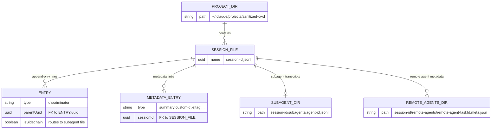
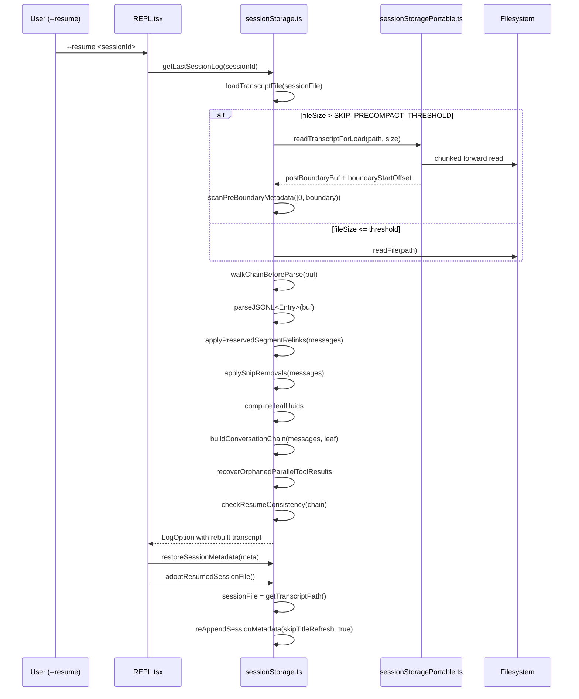
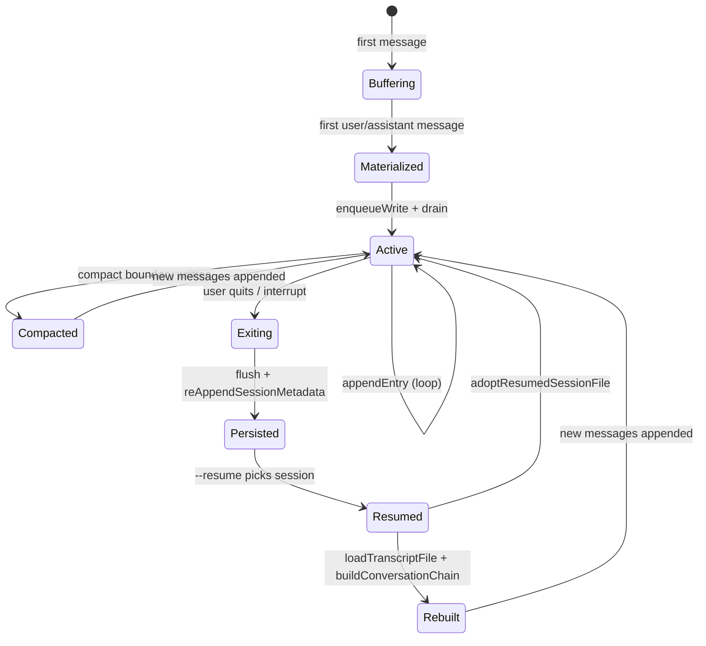

# Session Persistence and Resume

## Overview

A session is a single invocation of cc from startup to shutdown, persisted as a JSONL append-only log with typed entry records and tombstone-based deletion. The resume flow reads that log back, reconstructs the parentUuid chain, applies compaction and snip mutations, and hands the rebuilt conversation to the model as though it had never stopped. This chapter traces the full lifecycle: how entries are written, how they are read back with head/tail optimization, how compact boundaries truncate the load, and how the chain is rebuilt from leaf to root.

The two source files divide the labor sharply. `src/utils/sessionStoragePortable.ts` provides the pure-Node I/O primitives (head/tail reads, JSONL field extraction without full parse, the chunked forward reader for resume) and is shared between the CLI and the VS Code extension. `src/utils/sessionStorage.ts` owns the `Project` singleton, the write path with its queued drain, the full `loadTranscriptFile` parser, chain reconstruction, and the progressive-loading resume picker. The split ensures the portable layer has zero dependency on Bun-specific APIs, logging, or feature flags.

## Data structures and contracts

Every session is a single `.jsonl` file under `~/.claude/projects/<sanitized-cwd>/`. The filename is the session UUID. Each line is a self-contained JSON object whose `type` field discriminates the entry. The `Entry` union in `src/types/logs.ts` enumerates all legal types:

```typescript
// src/types/logs.ts:L297-L316 — Entry discriminated union
export type Entry =
  | TranscriptMessage
  | SummaryMessage
  | CustomTitleMessage
  | AiTitleMessage
  | LastPromptMessage
  | TaskSummaryMessage
  | TagMessage
  | AgentNameMessage
  | AgentColorMessage
  | AgentSettingMessage
  | PRLinkMessage
  | FileHistorySnapshotMessage
```

The union is open-ended in practice: `loadTranscriptFile` handles additional types like `attribution-snapshot`, `content-replacement`, `marble-origami-commit`, and `marble-origami-snapshot` through a cascade of `else if` branches. Unknown types are silently skipped, which gives the format forward compatibility -- new entry types can be added without migrating existing transcripts.

The `TranscriptMessage` type wraps every message the model sees (user, assistant, attachment, system) and carries the `parentUuid` pointer that forms the conversation chain:

```typescript
// src/types/logs.ts:L221-L231 — TranscriptMessage with chain metadata
export type TranscriptMessage = SerializedMessage & {
  parentUuid: UUID | null
  logicalParentUuid?: UUID | null
  isSidechain: boolean
  gitBranch?: string
  agentId?: string
  teamName?: string
  agentName?: string
  agentColor?: string
  promptId?: string
}
```

The `parentUuid` field is load-bearing: it turns a flat append-only file into a tree. A null `parentUuid` marks a chain root (either the very first message or a compact boundary). The `logicalParentUuid` field preserves the original parent when `parentUuid` is nullified for compact boundaries, so that tools like `/share` can reconstruct the full tree. `buildConversationChain` walks these pointers from leaf to root, and the `isSidechain` flag routes subagent messages to separate per-agent JSONL files under `<sessionId>/subagents/`. The `isTranscriptMessage` type guard in `src/utils/sessionStorage.ts` is the single source of truth for what constitutes a transcript message versus a metadata-only entry:

```typescript
// src/utils/sessionStorage.ts:L139-L146 — Transcript message type guard
export function isTranscriptMessage(entry: Entry): entry is TranscriptMessage {
  return (
    entry.type === 'user' ||
    entry.type === 'assistant' ||
    entry.type === 'attachment' ||
    entry.type === 'system'
  )
}
```

Progress messages are explicitly excluded from the transcript. As the comment on `isTranscriptMessage` explains at `src/utils/sessionStorage.ts:L136-L138`, including them caused chain forks that orphaned real conversation messages on resume. The `isChainParticipant` guard at `src/utils/sessionStorage.ts:L154-L156` further refines this by excluding progress from the parentUuid assignment on the write path. This is a separate concern from `isTranscriptMessage`: progress entries may still be written to the JSONL for UI replay, but they must not advance the `parentUuid` cursor in `insertMessageChain`.

Metadata entries like `SummaryMessage`, `CustomTitleMessage`, `TagMessage`, and `AgentSettingMessage` carry a `sessionId` field rather than a `parentUuid`. They are session-scoped, not message-scoped, and are collected into Maps keyed by `sessionId` during load. The `LastPromptMessage` type is a relatively recent addition that caches the user's most recent prompt text for the resume picker:

```typescript
// src/types/logs.ts:L81-L85 — LastPromptMessage for tail-window metadata
export type LastPromptMessage = {
  type: 'last-prompt'
  sessionId: UUID
  lastPrompt: string
}
```

Without `lastPrompt`, the resume picker would need to parse the entire head buffer to find the first meaningful user message. With it, the tail scan finds the most recent entry in O(1) per field extraction. The `reAppendSessionMetadata` function re-writes this entry at EOF on every turn, ensuring it never ages out of the 64KB tail window.

Subagent transcripts are stored separately. The `getAgentTranscriptPath` function at `src/utils/sessionStorage.ts:L247-L258` computes paths under `<projectDir>/<sessionId>/subagents/[<subdir>/]agent-<agentId>.jsonl`. Each subagent gets its own JSONL file, and the `AgentMetadata` sidecar file (`agent-<agentId>.meta.json`) persists the agent type and optional worktree path so that a resumed agent can be routed correctly without re-inferring its configuration.

The erDiagram below shows the on-disk layout:



## Control flow

### Write path: the Project singleton and queued drain

All writes flow through the `Project` class, a per-process singleton lazily created by `getProject()`. The write path has three stages: buffer, enqueue, drain.

When `appendEntry` is called, it first checks `shouldSkipPersistence()` at `src/utils/sessionStorage.ts:L960-L970`, which gates on test environment, `--no-session-persistence`, and `cleanupPeriodDays=0`. If the session file has not yet been materialized (the common case at startup), entries accumulate in `pendingEntries`. The first user or assistant message triggers `materializeSessionFile` at `src/utils/sessionStorage.ts:L976-L991`, which creates the file on disk, writes cached startup metadata via `reAppendSessionMetadata`, and flushes the buffer. This lazy materialization prevents orphan metadata-only session files that would clutter the resume picker with empty sessions.

Once the file exists, entries are enqueued into a per-file write queue keyed by file path. A `setTimeout`-based drain scheduler batches writes every 100ms (or 10ms when CCR remote persistence is active). The drain loop in `drainWriteQueue` serializes entries with `jsonStringify`, concatenates them, and appends in a single `fsAppendFile` call. This amortizes fsync overhead across many entries per turn. The `MAX_CHUNK_BYTES` threshold (100MB) splits oversized batches to avoid single-write allocations that exceed Node.js buffer limits:

```typescript
// src/utils/sessionStorage.ts:L645-L686 — Queued write drain
  private async drainWriteQueue(): Promise<void> {
    for (const [filePath, queue] of this.writeQueues) {
      if (queue.length === 0) {
        continue
      }
      const batch = queue.splice(0)

      let content = ''
      const resolvers: Array<() => void> = []

      for (const { entry, resolve } of batch) {
        const line = jsonStringify(entry) + '\n'

        if (content.length + line.length >= this.MAX_CHUNK_BYTES) {
          await this.appendToFile(filePath, content)
          for (const r of resolvers) {
            r()
          }
          resolvers.length = 0
          content = ''
        }

        content += line
        resolvers.push(resolve)
      }

      if (content.length > 0) {
        await this.appendToFile(filePath, content)
        for (const r of resolvers) {
          r()
        }
      }
    }
    // ...
  }
```

Each `enqueueWrite` call returns a Promise that resolves when that specific entry has been written to disk. The `trackWrite` wrapper at `src/utils/sessionStorage.ts:L597-L604` increments `pendingWriteCount` before the write and decrements after; `flush()` returns a Promise that resolves only when the count hits zero. The cleanup handler registered on Project construction at `src/utils/sessionStorage.ts:L449-L463` calls `flush()` followed by `reAppendSessionMetadata()` to ensure the most recent title, tag, and last-prompt entries sit within the 64KB tail window that `readLiteMetadata` scans.

The `appendEntry` dispatch at `src/utils/sessionStorage.ts:L1128-L1265` routes entries by type. Metadata types (summary, custom-title, tag, agent-name, agent-color, agent-setting, mode, worktree-state, pr-link, attribution-snapshot, file-history-snapshot) are always enqueued without dedup. Transcript messages go through a UUID dedup check against the `getSessionMessages` memoized set. Agent sidechain messages bypass this dedup because fork-inherited parent messages share UUIDs with the main session transcript. Content-replacement entries route to the subagent file when `agentId` is set, or to the main session file otherwise.

The `insertMessageChain` function at `src/utils/sessionStorage.ts:L993-L1083` handles the common case of writing a batch of messages from a single model turn. It manages the `parentUuid` cursor: for tool_result messages, it uses `sourceToolAssistantUUID` (set at creation time by the streaming layer) to point to the correct parent, rather than sequentially chaining from the previous message. Compact boundary messages get `parentUuid: null` to mark a chain root, with the original chain position preserved in `logicalParentUuid`. Each message is also stamped with `userType`, `entrypoint`, `cwd`, `sessionId`, `version`, `gitBranch`, and `slug` fields. The session stamping at `src/utils/sessionStorage.ts:L1049-L1063` must come after the message spread to ensure that fork and resume operations re-stamp the current session's identity rather than inheriting the source session's.

### Tombstones: positional removal without rewrite

The JSONL is append-only, but one operation requires deletion: `removeMessageByUuid` at `src/utils/sessionStorage.ts:L871-L951`, used when a tombstone is received for an orphaned message from a failed streaming attempt. Rather than rewriting the entire file, it reads the last 64KB, locates the target UUID via byte-level search (`"uuid":"<targetUuid>"`), and performs a positional truncate-and-shift. The search uses `lastIndexOf` to find the UUID pattern in the tail buffer, then scans for surrounding newlines to determine line boundaries. The truncate removes the line, and any trailing lines are re-appended at the truncated offset. If the target is the last entry (the common case), `afterLen` is zero and the operation is a single `ftruncate`. If the target is not in the tail window (rare, requiring many large entries between the write and the tombstone), a full rewrite is attempted, but capped at `MAX_TOMBSTONE_REWRITE_BYTES` (50MB) to avoid OOM on multi-GB session files.

### Metadata re-append: keeping the tail current

The `reAppendSessionMetadata` function at `src/utils/sessionStorage.ts:L721-L838` is the mechanism that keeps session-scoped metadata visible to the resume picker. It is called from three contexts with different file-ordering implications. During compaction, it writes metadata before the compact boundary marker, and those entries are recovered by `scanPreBoundaryMetadata` on load. On session exit, it writes metadata at EOF after all boundaries, which enables `loadTranscriptFile`'s pre-compact skip to find metadata without a forward scan. On resume adoption via `adoptResumedSessionFile`, it writes with `skipTitleRefresh=true` to avoid clobbering a `--name` title.

The function first performs a sync tail read via `readFileTailSync` to absorb any fresher values written by an external process (the VS Code SDK's `renameSession` or `tagSession`). If the SDK wrote a custom-title while the CLI had the session open, the CLI's in-memory cache is stale and the tail value is authoritative. If the tail has nothing (the entry was evicted or never written externally), the cache stands. This external-writer safety is essential because the CLI and the VS Code extension can both have the same session open simultaneously.

### Head/tail reads and lite metadata

The resume picker cannot afford to parse every session file. Instead, it reads only the first and last 64KB of each file. The constant `LITE_READ_BUF_SIZE = 65536` in `src/utils/sessionStoragePortable.ts:L17` defines this window. `readHeadAndTail` opens a single file descriptor, reads the head, and conditionally reads the tail if the file exceeds the buffer size:

```typescript
// src/utils/sessionStoragePortable.ts:L215-L242 — Head and tail read
export async function readHeadAndTail(
  filePath: string,
  fileSize: number,
  buf: Buffer,
): Promise<{ head: string; tail: string }> {
  try {
    const fh = await fsOpen(filePath, 'r')
    try {
      const headResult = await fh.read(buf, 0, LITE_READ_BUF_SIZE, 0)
      if (headResult.bytesRead === 0) return { head: '', tail: '' }

      const head = buf.toString('utf8', 0, headResult.bytesRead)

      const tailOffset = Math.max(0, fileSize - LITE_READ_BUF_SIZE)
      let tail = head
      if (tailOffset > 0) {
        const tailResult = await fh.read(buf, 0, LITE_READ_BUF_SIZE, tailOffset)
        tail = buf.toString('utf8', 0, tailResult.bytesRead)
      }

      return { head, tail }
    } finally {
      await fh.close()
    }
  } catch {
    return { head: '', tail: '' }
  }
}
```

For small files where the head covers the tail, `tail === head` and no second read is needed. The shared Buffer parameter avoids per-file allocation overhead when scanning hundreds of sessions in the resume picker.

The `readLiteMetadata` function at `src/utils/sessionStorage.ts:L4739-L4813` calls `readHeadAndTail` and then uses `extractJsonStringField` and `extractLastJsonStringField` from the portable layer to scrape metadata without full JSON parsing. The head provides `isSidechain`, `cwd`, `teamName`, and `agentSetting`. The tail provides `lastPrompt`, `customTitle` (preferred over `aiTitle`), `tag`, `gitBranch`, and PR link fields. The priority order for `firstPrompt` at `src/utils/sessionStorage.ts:L4760-L4765` is: `lastPrompt` from the tail (authoritative, captured at write time), then `extractFirstPromptFromChunk` from the head (for sessions written before `lastPrompt` entries existed), then raw `content`/`text` field scrapes as a last resort for array-format content blocks from VS Code.

The `extractJsonStringField` implementation avoids full JSON.parse by scanning for the `"key":"value"` pattern at the byte level. It handles escape sequences and works even on truncated lines, which is essential when the head read splits a line mid-character:

```typescript
// src/utils/sessionStoragePortable.ts:L53-L76 — Zero-parse JSON field extraction
export function extractJsonStringField(
  text: string,
  key: string,
): string | undefined {
  const patterns = [`"${key}":"`, `"${key}": "`]
  for (const pattern of patterns) {
    const idx = text.indexOf(pattern)
    if (idx < 0) continue

    const valueStart = idx + pattern.length
    let i = valueStart
    while (i < text.length) {
      if (text[i] === '\\') {
        i += 2
        continue
      }
      if (text[i] === '"') {
        return unescapeJsonString(text.slice(valueStart, i))
      }
      i++
    }
  }
  return undefined
}
```

The dual-pattern search (`"key":"` and `"key": "`) handles both compact and whitespace-separated JSON serialization. The `unescapeJsonString` helper at `src/utils/sessionStoragePortable.ts:L39-L46` only allocates a new string when escape sequences are present, which is the minority case for short metadata values like titles and tags.

The progressive-loading resume picker uses these lite reads to build the initial session list quickly. `getSessionFilesLite` at `src/utils/sessionStorage.ts:L4975-L5016` stats all `.jsonl` files in the project directory, sorts by mtime, and creates `LogOption` objects with `isLite: true` and empty message arrays. `enrichLogs` at `src/utils/sessionStorage.ts:L5077-L5105` then iterates through these lite logs, calling `readLiteMetadata` for each, and filtering out sidechains and team sessions. The shared `readBuf` buffer across all enrichments avoids per-file allocation.

### Compact-boundary truncation on load

Large sessions (greater than 5MB, per `SKIP_PRECOMPACT_THRESHOLD` in `src/utils/sessionStoragePortable.ts:L480`) are loaded using `readTranscriptForLoad` from the portable layer. This function performs a single forward chunked read that strips attribution-snapshot lines at the fd level (they never enter the output buffer) and truncates at compact boundaries in-stream. The chunk size is 1MB (`TRANSCRIPT_READ_CHUNK_SIZE` at `src/utils/sessionStoragePortable.ts:L473`), balancing I/O call count against buffer growth.

The core algorithm processes the file in chunks. Within each chunk, `scanChunkLines` at `src/utils/sessionStoragePortable.ts:L614-L661` iterates line-by-line, identifying attribution-snapshot lines by prefix matching against `ATTR_SNAP_PREFIX` and compact-boundary lines by searching for the `compactBoundaryMarker` bytes. Attribution-snapshot lines are skipped (not written to the output sink). Compact-boundary lines trigger different behavior depending on whether they have a `preservedSegment`: if they do, the `hasPreservedSegment` flag is set but truncation is skipped; if they do not, the output buffer is reset to zero length, effectively discarding everything written so far. The last attribution-snapshot encountered is always preserved and re-appended at EOF during `finalizeOutput`, because the attribution restoration logic reads only `[length-1]` from the array.

The `LoadState` type at `src/utils/sessionStoragePortable.ts:L557-L569` tracks the state across chunks: the output sink, the boundary start offset, the preserved-segment flag, and buffers for straddle lines (lines that span a chunk boundary), carry data, and the most recent attribution snapshot. The straddle handling in `processStraddle` at `src/utils/sessionStoragePortable.ts:L572-L611` ensures that an attribution-snapshot line split across two chunks is correctly identified and skipped rather than partially written.

The peak memory allocation is the size of the post-boundary output, not the full file. For a 151MB session that is 84% stale attribution snapshots, this reduces peak allocation from over 200MB to roughly 32MB. The comment at `src/utils/sessionStorage.ts:L3520-L3529` explains the memory dynamics in detail: mimalloc does not return pages to the OS even after JS-level GC frees the backing buffers, so the old scan-and-strip path left RSS stuck at roughly 316MB, while the chunked forward read holds RSS near 155MB.

If a compact boundary has a `preservedSegment`, the truncation is skipped. Those preserved messages keep their pre-compact parentUuid on disk and will be spliced in by `applyPreservedSegmentRelinks` after parsing. Pre-boundary metadata entries (agent-setting, mode, pr-link, etc.) are recovered via `scanPreBoundaryMetadata` at `src/utils/sessionStorage.ts:L3157-L3224`, which does a cheap byte-level forward scan of `[0, boundaryOffset)` looking only for metadata-type markers. This scan uses raw Buffer chunks and byte-level marker matching with no readline and no per-line string conversion for the roughly 99% of lines that are message content.

### Chain reconstruction: buildConversationChain

Once the entries are parsed, `buildConversationChain` at `src/utils/sessionStorage.ts:L2069-L2094` walks the `parentUuid` pointers from a leaf message to root, collecting messages into a reverse-order array that is then flipped. The leaf is the most recent non-sidechain user or assistant message with no children. A cycle-detection guard at `src/utils/sessionStorage.ts:L2077-L2084` prevents infinite loops from corrupted chains, logging a `tengu_chain_parent_cycle` telemetry event and returning a partial transcript.

```typescript
// src/utils/sessionStorage.ts:L2069-L2094 — Chain reconstruction from leaf to root
export function buildConversationChain(
  messages: Map<UUID, TranscriptMessage>,
  leafMessage: TranscriptMessage,
): TranscriptMessage[] {
  const transcript: TranscriptMessage[] = []
  const seen = new Set<UUID>()
  let currentMsg: TranscriptMessage | undefined = leafMessage
  while (currentMsg) {
    if (seen.has(currentMsg.uuid)) {
      logError(
        new Error(
          `Cycle detected in parentUuid chain at message ${currentMsg.uuid}. Returning partial transcript.`,
        ),
      )
      logEvent('tengu_chain_parent_cycle', {})
      break
    }
    seen.add(currentMsg.uuid)
    transcript.push(currentMsg)
    currentMsg = currentMsg.parentUuid
      ? messages.get(currentMsg.parentUuid)
      : undefined
  }
  transcript.reverse()
  return recoverOrphanedParallelToolResults(messages, transcript, seen)
}
```

A post-pass, `recoverOrphanedParallelToolResults` at `src/utils/sessionStorage.ts:L2118-L2206`, handles a topology subtlety: streaming emits one `AssistantMessage` per `content_block_stop`, so N parallel tool uses produce N sibling messages with the same `message.id` but different UUIDs. The single-parent walk keeps only one branch; this pass recovers the others by grouping on `message.id` and splicing orphaned siblings and their tool results back in after the last on-chain member. Two loss modes are documented: (1) sibling assistant orphaned when the walk goes through one branch and drops another, and (2) progress-fork from legacy transcripts where each tool_use assistant had a progress child that the walk followed instead of the tool result.

### The dead-branch filter: walkChainBeforeParse

Fork-heavy sessions accumulate dead branches from rewinds and ctrl-z operations. `buildConversationChain` discards them, but only after `parseJSONL` has already paid to JSON.parse every line. The `walkChainBeforeParse` function at `src/utils/sessionStorage.ts:L3306-L3466` performs a byte-level index pass that locates the live chain and concatenates only those lines plus metadata, skipping dead entries entirely.

The algorithm works in two phases. First, it scans the entire buffer, building a stride-3 flat index (`msgIdx`: lineStart, lineEnd, parentStart) of transcript messages (identified by the `{"parentUuid":` prefix) and a parallel `metaRanges` array for metadata lines. For each transcript message, it extracts the top-level UUID using a suffix-matching technique: the pattern `"uuid":"<36 chars>","timestamp":"` is searched, and when multiple matches exist (due to nested objects in `agent_progress` or `mcpMeta` entries), a brace-depth scan in `pickDepthOneUuidCandidate` at `src/utils/sessionStorage.ts:L3275-L3304` disambiguates by finding the match at JSON nesting depth 1.

Second, it walks backward from the last non-sidechain entry, following parentUuid links through the index. Only the chain entries and metadata ranges are preserved; everything else is dead. The function is gated on two conditions: the buffer must exceed `SKIP_PRECOMPACT_THRESHOLD` (5MB), and the dead bytes must constitute at least half the buffer (a conservative threshold that avoids the case where the overhead of index+concat exceeds the parse savings). Measured savings: a 41MB session with 99% dead entries reduced parseJSONL from 56ms to 3.9ms, and a 151MB session with 92% dead entries went from 47.3ms to 9.4ms.

### Snip removal and preserved-segment relinking

After parsing, two in-memory mutation passes clean up the chain. `applySnipRemovals` at `src/utils/sessionStorage.ts:L1982-L2038` deletes messages removed by history-snip operations and relinks survivors across the gaps. Each snip boundary carries `removedUuids` listing exactly which messages were removed. After deleting those entries, the function walks backward through each deleted entry's own `parentUuid` to find the first non-removed ancestor, then patches survivors' `parentUuid` to point to that ancestor. Path compression in the `resolve` function at `src/utils/sessionStorage.ts:L2014-L2027` ensures that subsequent survivors sharing the same chain segment do not re-walk.

`applyPreservedSegmentRelinks` at `src/utils/sessionStorage.ts:L1839-L1956` handles the more complex case of preserved segments within compact boundaries. A preserved segment means certain messages were intentionally kept during compaction. Their `parentUuid` pointers still reference the pre-compact chain, which no longer exists on disk. The function finds the last boundary with a `preservedSegment`, walks from tail to head to validate the chain is intact, then rewires the head's `parentUuid` to point to the anchor (the last summary message) and redirects the anchor's other children to point to the tail. It also zeroes stale usage tokens in preserved assistant messages to prevent an autocompact spiral on resume.

### Resume flow

The full resume flow proceeds through these steps:



When the user invokes `--resume`, `getLastSessionLog` at `src/utils/sessionStorage.ts:L3869-L3932` loads the session file via `loadTranscriptFile`. For large files, `readTranscriptForLoad` strips attribution snapshots and truncates at compact boundaries during the read itself. The parsed entries populate a `Map<UUID, TranscriptMessage>`. After parsing, `applyPreservedSegmentRelinks` splices preserved segments back into the chain by rewiring `parentUuid` pointers, and `applySnipRemovals` deletes messages removed by history-snip operations and relinks survivors across the gaps. Leaf UUIDs are computed, `buildConversationChain` walks from the most recent leaf to root, and `recoverOrphanedParallelToolResults` patches in any sibling tool-use branches lost to the single-parent traversal. Finally, `checkResumeConsistency` at `src/utils/sessionStorage.ts:L2224-L2243` emits a telemetry delta comparing the loaded chain length against the last in-session checkpoint, detecting the class of bugs where snip/compact/parallel-TR operations mutate in-memory state but the parentUuid walk on disk reconstructs a different set.

After the transcript is rebuilt, `restoreSessionMetadata` at `src/utils/sessionStorage.ts:L2758-L2785` populates the `Project` singleton's in-memory cache with the restored title, tag, mode, worktree state, and PR link. The `??=` operator on `customTitle` ensures that a `--name` title set at the CLI takes precedence over the resumed session's disk title. `adoptResumedSessionFile` at `src/utils/sessionStorage.ts:L1530-L1534` sets `project.sessionFile` so that the exit cleanup handler can write metadata, and calls `reAppendSessionMetadata(true)` to re-stamp metadata at EOF without clobbering a `--name` title.

The persistence lifecycle from creation through resume is:



## Edge cases and failure modes

**Metadata eviction from the tail window.** The 64KB tail window is finite. If enough messages are appended after a `/rename`, the `custom-title` entry can be pushed outside the window, causing `--resume` to show the auto-generated firstPrompt instead. The `reAppendSessionMetadata` function is the defense: it is called on compaction, on session exit, and on resume adoption, re-writing metadata entries at EOF so they always fall within the tail. The function first reads the tail to absorb any fresher values written by an external process (the VS Code SDK's `renameSession`), then re-appends the cache. The `skipTitleRefresh` parameter on `adoptResumedSessionFile` prevents a stale disk title from clobbering a fresh `--name` title. The `reAppendSessionMetadata` comment at `src/utils/sessionStorage.ts:L717-L720` explains the unconditional re-append rationale: during compaction, a title 40KB from EOF is inside the current tail window but will fall out once the post-compaction session grows, so skipping the re-append would defeat the purpose.

**Action Replay and Authority Resurrection on checkpoint-restore.** HER section 6.16 (ACRFence) identifies a threat model specific to agent checkpoint-restore: after a restore cycle, the agent may re-synthesize a slightly different version of a request it already executed, causing duplicate side effects (Action Replay), or it may reuse credentials that have since expired (Authority Resurrection). The ACRFence paper (arXiv:2603.20625) proposes recording irreversible tool effects, enforcing replay-or-fork semantics where completed actions are replayed from stored results rather than re-executed, and using idempotency keys for external operations. In cc's architecture, the append-only JSONL with dedup via `getSessionMessages` provides replay semantics at the transcript level (a resumed session skips UUIDs it already has), but external side effects (API calls, payments, email sends) made during the original session are not rolled back. This is critical for multi-hour tasks that interact with external services. The proposed fix from ACRFence -- recording irreversible tool effects and enforcing replay-or-fork semantics -- maps onto cc's existing content-replacement mechanism but at a different semantic level: content replacements preserve prompt cache stability, while ACRFence's idempotency keys would preserve external-system consistency.

**Compact boundary with preserved segment.** A preserved segment means certain messages keep their pre-compact parentUuid on disk. The `readTranscriptForLoad` function does NOT truncate at a boundary that has `preservedSegment`. After parsing, `applyPreservedSegmentRelinks` must splice those messages back in. If the tail-to-head walk through the preserved segment fails (a UUID is missing from the transcript, documented at `src/utils/sessionStorage.ts:L1888-L1903`), the function returns early without pruning, and resume loads the full pre-compact history as a safe fallback. The known cause is a mid-turn-yielded attachment pushed to `mutableMessages` but never `recordTranscript`'d when the SDK subprocess restarted before the next turn's flush. The `tengu_relink_walk_broken` telemetry event captures diagnostic information about these failures.

**Legacy progress entries.** PR #24099 removed progress from `isTranscriptMessage`, but old transcripts still have progress entries with `uuid` and `parentUuid` fields. Without bridging, `buildConversationChain` would terminate at a missing progress UUID. `loadTranscriptFile` at `src/utils/sessionStorage.ts:L3623-L3641` builds a `progressBridge` map that chain-resolves through consecutive progress entries, then rewrites subsequent messages' parentUuid to skip the gap. The chain resolution handles the case where multiple progress entries form a consecutive run: each entry's parent is checked against the bridge, and if it resolves to another progress entry, the walk continues until a non-progress ancestor is found.

**Sidechain dedup bypass.** Agent sidechain entries are written to separate per-agent JSONL files. The dedup check in `appendEntry` at `src/utils/sessionStorage.ts:L1224-L1262` skips the UUID-set membership test for sidechain writes, because fork-inherited parent messages share UUIDs with the main session transcript. Deduping against the main session's set would drop them, leaving an incomplete sidechain transcript that breaks fork resume. The comment at `src/utils/sessionStorage.ts:L1233-L1242` documents a related constraint: remote persistence uses a single Last-Uuid chain per sessionId, so re-POSTing a UUID it already has results in a 409 and eventually exhausts retries, triggering `gracefulShutdownSync(1)`.

**Bun/Node hash mismatches for long paths.** The portable `sanitizePath` function truncates paths exceeding `MAX_SANITIZED_LENGTH` (200 characters) and appends a hash suffix. The CLI uses `Bun.hash` while the VS Code extension under Node.js uses `simpleHash` (djb2) at `src/utils/sessionStoragePortable.ts:L295-L297`. These produce different suffixes for the same path. `findProjectDir` at `src/utils/sessionStoragePortable.ts:L354-L380` handles this by falling back to prefix-based directory scanning when the exact match fails: it lists all directories under `~/.claude/projects/` and finds one whose name starts with the truncated prefix plus a hyphen.

**Session file corruption from crash.** If the process crashes mid-write, the last line of the JSONL may be truncated. The `parseJSONL` function handles this by catching parse errors on individual lines and skipping them. The `readTranscriptForLoad` function's `finalizeOutput` at `src/utils/sessionStoragePortable.ts:L699-L715` ensures that the last attribution snapshot is preceded by a newline, so a crash-truncated file does not merge the last entry with the snapshot on the next load.

**Orphaned tool results from parallel tool use.** The streaming layer emits one AssistantMessage per `content_block_stop`. N parallel tool uses produce N assistant messages with the same `message.id` but distinct UUIDs. Each tool_result's `sourceToolAssistantUUID` points to its own assistant, creating a DAG rather than a linked list. `buildConversationChain`'s single-parent walk keeps only one branch. The `recoverOrphanedParallelToolResults` post-pass at `src/utils/sessionStorage.ts:L2118-L2206` recovers the lost siblings by grouping on `message.id`, collecting off-chain assistants and their tool results, and splicing them in timestamp order after the last on-chain member of each group.

## Where cc diverges from the published pattern

HER section 10.3 (Session Protocol) prescribes an eight-step loop: ORIENT, SETUP, VERIFY, SELECT, IMPLEMENT, TEST, UPDATE, EXIT. cc's session persistence implements the EXIT and ORIENT steps concretely. EXIT maps to the cleanup handler's `flush()` + `reAppendSessionMetadata()`, ensuring state is fully persisted before the process terminates. ORIENT maps to the resume flow's `loadTranscriptFile` + `buildConversationChain`, which reads workspace state from the JSONL rather than from a separate progress file. The SETUP and VERIFY steps are handled by the bootstrap layer rather than the session layer.

The divergence is in the granularity of the persisted state. The HER protocol treats each step as an atomic unit of work with a clean boundary. cc's JSONL is append-only with no step boundaries; instead, compaction boundaries mark where the context was summarized, and snip boundaries mark where individual messages were removed. The chain is reconstructed by walking parentUuid pointers, not by replaying a step log. This is more resilient to crashes (every entry is fsync'd incrementally, and each line is self-contained) but makes it harder to implement the VERIFY step's baseline test check, because there is no explicit "last verified good state" marker in the transcript. A `turn_duration` system message with a `messageCount` field serves as an approximate checkpoint, used by `checkResumeConsistency` to detect drift, but it is not a full state snapshot.

Another divergence: the HER protocol's idempotency recommendation for checkpoint-restore is not enforced in cc's session layer. The `getSessionMessages` dedup prevents duplicate transcript entries, but it does not prevent re-execution of external tool calls after a resume. A tool call that sent an email during the original session will not be re-invoked on resume (the transcript already has its result), but if the session was restored from a checkpoint before that tool call, the agent may synthesize a new request with the same intent but different parameters -- the Action Replay scenario from HER section 6.16. The ACRFence paper's recommendation of idempotency keys for external operations is not yet implemented in cc's tool dispatch pipeline.

A further divergence concerns the session protocol's UPDATE step, which prescribes updating a task list status and progress notes. cc has a task system (see Chapter 23 on the task lifecycle) with filesystem locking and blocking relationships, but task status updates are not automatically persisted in the session JSONL. The `task-summary` entry type at `src/utils/sessionStorage.ts:L2681-L2688` provides a rolling snapshot of what the agent is doing for `claude ps`, but it is not tied to the task lifecycle and is not re-appended by `reAppendSessionMetadata`, so it ages out of the tail window.

## Developer takeaways for building a long-running agent

Persist conversation state as an append-only JSONL with per-line type discriminators and a parentUuid chain that forms a tree, not a flat list. This structure survives crashes (each line is self-contained), supports fork and rewind (dead branches are ignored by the chain walk), and enables compaction (boundaries truncate the load without rewriting the file). Read performance at scale depends on head/tail windowing: keep metadata entries (titles, tags, mode) re-appended near EOF so they stay within the tail scan range, and use chunked forward reads that strip high-volume but resume-irrelevant entries at the fd level before they ever reach the parser. For the chain walk, a byte-level pre-parse filter that indexes parentUuid and UUID fields without JSON.parse can eliminate 80-93% of dead-branch parsing cost on fork-heavy sessions. Dedup at the write path (UUID-set membership) prevents double-writes from incremental slices, but sidechain transcripts need a bypass because their inherited messages share UUIDs with the main file. The ACRFence threat model is not theoretical for agents that call external APIs: record which tool calls had irreversible side effects, and on restore, enforce replay semantics (return the stored result) rather than re-execution, to prevent duplicate payments or credential resurrection.