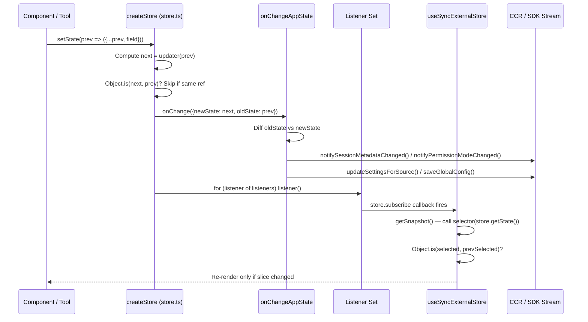
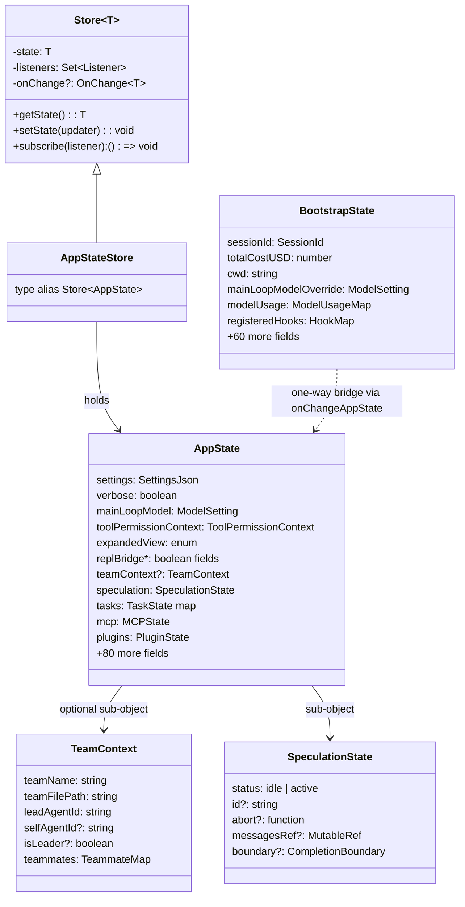

# AppState: The Redux-like Store

## Overview

cc's UI state lives in a single, centralized store that follows the Redux pattern: one immutable state tree, a pure updater function, and a subscriber list that re-renders React components when slices change. The implementation spans four files that form a clean dependency chain: `store.ts` defines the generic store primitive, `AppStateStore.ts` declares the state shape and default factory, `AppState.tsx` wires the store into React, and `onChangeAppState.ts` acts as a middleware layer that fires side effects when specific fields transition.

Alongside this React-driven store, `src/bootstrap/state.ts` maintains a separate module-scope mutable singleton for non-React state -- cost counters, session IDs, telemetry handles, and other values that must survive across the React tree's lifecycle. The two stores serve different masters: AppState drives the Ink rendering pipeline; bootstrap state is read by headless/SDK paths, the query loop, and shutdown handlers that execute outside any React context. Understanding how these two layers interact -- and where they deliberately do not -- is essential for anyone adding a new state field to cc.

This chapter traces the full lifecycle of a state change: from the `setState` call through the `onChange` middleware, into the subscriber notification, and finally into the `useSyncExternalStore` hook that triggers a targeted re-render.

## Data structures and contracts

### The store primitive

The entire state management system rests on a 34-line generic store defined in `src/state/store.ts`. It provides three methods -- `getState`, `setState`, and `subscribe` -- and an optional `onChange` callback that fires before listeners are notified.

```typescript
// src/state/store.ts:L1-L34 — generic createStore implementation
type Listener = () => void
type OnChange<T> = (args: { newState: T; oldState: T }) => void

export type Store<T> = {
  getState: () => T
  setState: (updater: (prev: T) => T) => void
  subscribe: (listener: Listener) => () => void
}

export function createStore<T>(
  initialState: T,
  onChange?: OnChange<T>,
): Store<T> {
  let state = initialState
  const listeners = new Set<Listener>()

  return {
    getState: () => state,

    setState: (updater: (prev: T) => T) => {
      const prev = state
      const next = updater(prev)
      if (Object.is(next, prev)) return
      state = next
      onChange?.({ newState: next, oldState: prev })
      for (const listener of listeners) listener()
    },

    subscribe: (listener: Listener) => {
      listeners.add(listener)
      return () => listeners.delete(listener)
    },
  }
}
```

The `setState` method accepts an updater function `(prev: T) => T`, not a partial object. This forces callers to express their intent as a transformation of the previous state, which makes the transition explicit and prevents accidental field deletion. The `Object.is` identity check on line 23 is the sole short-circuit: if the updater returns the exact same reference, no notification fires. This means updaters that spread the old state without changing any field will still trigger listeners, because the spread produces a new object reference. Callers that want to avoid unnecessary notifications must check their own preconditions before calling `setState`.

The `onChange` callback fires between the state assignment and the listener loop. This is the only hook point for cross-cutting side effects. The `subscribe` method returns an unsubscribe function, which React's `useSyncExternalStore` uses to detach when components unmount.

### The AppState type

The `AppState` type in `src/state/AppStateStore.ts` is the single source of truth for every piece of UI-reactive state. It is a `DeepImmutable` intersection type: the primary object literal is wrapped in `DeepImmutable` to enforce read-only access at the type level, while a second object literal contains fields that cannot be deeply frozen (like `Map` instances and function-typed properties in `TaskState`).

```typescript
// src/state/AppStateStore.ts:L89-L109 — AppState type definition (first section)
export type AppState = DeepImmutable<{
  settings: SettingsJson
  verbose: boolean
  mainLoopModel: ModelSetting
  mainLoopModelForSession: ModelSetting
  statusLineText: string | undefined
  expandedView: 'none' | 'tasks' | 'teammates'
  isBriefOnly: boolean
  showTeammateMessagePreview?: boolean
  selectedIPAgentIndex: number
  coordinatorTaskIndex: number
  viewSelectionMode: 'none' | 'selecting-agent' | 'viewing-agent'
  footerSelection: FooterItem | null
  toolPermissionContext: ToolPermissionContext
  spinnerTip?: string
  agent: string | undefined
  kairosEnabled: boolean
  remoteSessionUrl: string | undefined
  remoteConnectionStatus:
    | 'connecting'
    | 'connected'
    | 'reconnecting'
    | 'disconnected'
}> & {
  tasks: { [taskId: string]: TaskState }
  agentNameRegistry: Map<string, AgentId>
  // ...
}
```

The `DeepImmutable` wrapper means any component reading a field from `AppState` receives a read-only type -- attempting to mutate a nested property produces a type error. The `& { ... }` intersection escapes immutability for the `tasks` map, `agentNameRegistry`, MCP connections, and other fields that hold mutable references (sockets, `Map` instances, function callbacks). This split is intentional: the majority of state is truly immutable (booleans, strings, enums), while the escape hatch prevents the type system from fighting against inherently mutable runtime objects.

The type spans roughly 360 lines and contains over 80 fields organized into several conceptual groups:

- **Core settings**: `settings`, `verbose`, `mainLoopModel`, `toolPermissionContext` -- the fields that control agent behavior.
- **UI navigation**: `expandedView`, `footerSelection`, `coordinatorTaskIndex`, `viewSelectionMode` -- which panel or view is active.
- **Remote/bridge**: a cluster of `replBridge*` fields that track the always-on bridge connection state for `claude assistant` mode (`src/state/AppStateStore.ts:L131-L156`).
- **Team/swarm context**: the `teamContext` field, which holds the team name, lead agent ID, self-identity, and a map of teammate descriptors with tmux pane IDs and worktree paths (`src/state/AppStateStore.ts:L323-L345`).
- **Speculation**: the `speculation` field of type `SpeculationState`, which tracks whether the model's next-turn prediction is idle, active, or pipelined (`src/state/AppStateStore.ts:L52-L78`).

### The teamContext sub-object

The `teamContext` field is worth examining in detail because it is the coordination point for multi-agent swarms:

```typescript
// src/state/AppStateStore.ts:L323-L345 — teamContext shape
teamContext?: {
  teamName: string
  teamFilePath: string
  leadAgentId: string
  selfAgentId?: string
  selfAgentName?: string
  isLeader?: boolean
  selfAgentColor?: string
  teammates: {
    [teammateId: string]: {
      name: string
      agentType?: string
      color?: string
      tmuxSessionName: string
      tmuxPaneId: string
      cwd: string
      worktreePath?: string
      spawnedAt: number
    }
  }
}
```

Every swarm member -- leader and workers alike -- holds its own copy of `teamContext`. The `selfAgentId` and `isLeader` fields let each process determine its own role without querying the leader. The `teammates` map stores tmux routing information (`tmuxSessionName`, `tmuxPaneId`) so that the `SendMessage` tool can route inter-agent messages through tmux pipes rather than a central broker. The `worktreePath` field is optional because not all teammates use git worktrees; some operate in the same working directory. This design aligns with the HER session-to-session handoff pattern from Section 21: each agent session carries its own identity and routing table, enabling autonomous operation without a central coordinator process.

### The default factory

`getDefaultAppState()` constructs the initial state object. It is called once by `AppStateProvider` and never again during the session's lifetime:

```typescript
// src/state/AppStateStore.ts:L456-L469 — getDefaultAppState entry and mode selection
export function getDefaultAppState(): AppState {
  const teammateUtils =
    require('../utils/teammate.js') as typeof import('../utils/teammate.js')
  const initialMode: PermissionMode =
    teammateUtils.isTeammate() && teammateUtils.isPlanModeRequired()
      ? 'plan'
      : 'default'

  return {
    settings: getInitialSettings(),
    tasks: {},
    agentNameRegistry: new Map(),
    verbose: false,
    mainLoopModel: null,
    // ...
```

The lazy `require` on line 460-462 avoids a circular dependency: `teammate.ts` imports from the state layer, so `AppStateStore.ts` cannot statically import from it. The `initialMode` computation means that teammate processes spawned with `plan_mode_required` start in plan mode by default, while the leader process starts in default mode. This is the earliest point where the harness's permission mode diverges based on process role.

## Control flow

### Store creation and React wiring

The `AppStateProvider` component in `src/state/AppState.tsx` creates the store once via `useState` and never recreates it:

```typescript
// src/state/AppState.tsx:L37-L57 — AppStateProvider store creation
export function AppStateProvider(t0) {
  const $ = _c(13);
  const {
    children,
    initialState,
    onChangeAppState
  } = t0;
  const hasAppStateContext = useContext(HasAppStateContext);
  if (hasAppStateContext) {
    throw new Error("AppStateProvider can not be nested within another AppStateProvider");
  }
  let t1;
  if ($[0] !== initialState || $[1] !== onChangeAppState) {
    t1 = () => createStore(initialState ?? getDefaultAppState(), onChangeAppState);
    $[0] = initialState;
    $[1] = onChangeAppState;
    $[2] = t1;
  } else {
    t1 = $[2];
  }
  const [store] = useState(t1);
```

The React Compiler runtime (`_c(13)`) memoizes the factory function based on `initialState` and `onChangeAppState` references. Since both are typically stable across renders, the factory runs once and `useState` holds the store for the component's entire lifetime. The `HasAppStateContext` guard on line 44-46 prevents nested providers, which would create competing state trees -- a class of bug that is easy to introduce in deeply composed React trees but produces subtly broken UI behavior.

After creation, the provider wraps its children in two context providers (`AppStoreContext` and `HasAppStateContext`), a `MailboxProvider` for inter-agent messaging, and a conditional `VoiceProvider` that is gated by the `VOICE_MODE` feature flag for dead-code elimination in external builds (`src/state/AppState.tsx:L14-L18`).

### Slice subscription with useAppState

Components subscribe to state slices via `useAppState(selector)`, which uses React's `useSyncExternalStore` to ensure tear-free reads during concurrent rendering:

```typescript
// src/state/AppState.tsx:L142-L163 — useAppState hook
export function useAppState(selector) {
  const $ = _c(3);
  const store = useAppStore();
  let t0;
  if ($[0] !== selector || $[1] !== store) {
    t0 = () => {
      const state = store.getState();
      const selected = selector(state);
      if (false && state === selected) {
        throw new Error(`Your selector in \`useAppState(${selector.toString()})\` returned the original state, which is not allowed. You must instead return a property for optimised rendering.`);
      }
      return selected;
    };
    $[0] = selector;
    $[1] = store;
    $[2] = t0;
  } else {
    t0 = $[2];
  }
  const get = t0;
  return useSyncExternalStore(store.subscribe, get, get);
}
```

The `get` function captures the current state via `store.getState()` and applies the selector. `useSyncExternalStore` calls `get` on every render and compares the result via `Object.is` to decide whether the component should re-render. This is why the JSDoc on `useAppState` warns against returning new objects from selectors: `{ foo: s.foo }` produces a new reference every time, causing infinite re-renders. The correct pattern is to select an existing sub-object reference like `s.promptSuggestion` or a primitive like `s.verbose`.

The `useSetAppState` hook returns `store.setState` directly, providing a stable function reference that never changes. Components that only dispatch updates -- and never read state -- can use this hook without subscribing to any state changes, avoiding re-renders entirely (`src/state/AppState.tsx:L170-L172`).

### The onChange middleware

The `onChangeAppState` function in `src/state/onChangeAppState.ts` is the single choke point for side effects triggered by state transitions. It receives `{ newState, oldState }` and performs field-by-field diffing to decide what to do:

```typescript
// src/state/onChangeAppState.ts:L43-L92 — onChangeAppState permission mode sync
export function onChangeAppState({
  newState,
  oldState,
}: {
  newState: AppState
  oldState: AppState
}) {
  const prevMode = oldState.toolPermissionContext.mode
  const newMode = newState.toolPermissionContext.mode
  if (prevMode !== newMode) {
    const prevExternal = toExternalPermissionMode(prevMode)
    const newExternal = toExternalPermissionMode(newMode)
    if (prevExternal !== newExternal) {
      const isUltraplan =
        newExternal === 'plan' &&
        newState.isUltraplanMode &&
        !oldState.isUltraplanMode
          ? true
          : null
      notifySessionMetadataChanged({
        permission_mode: newExternal,
        is_ultraplan_mode: isUltraplan,
      })
    }
    notifyPermissionModeChanged(newMode)
  }
  // ...
```

The comment block at lines 50-59 documents the rationale: before this centralized diff, mode changes were relayed to the CCR (Claude Code Remote) client by only 2 of 8+ mutation paths. Shift+Tab cycling, plan-mode exit dialogs, slash commands, and rewind all mutated `AppState` without notifying external consumers. Hooking the diff in `onChangeAppState` means every `setState` call that changes the mode propagates the change to both CCR (via `notifySessionMetadataChanged`) and the SDK status stream (via `notifyPermissionModeChanged`), with zero changes at the call sites.

The externalization logic on lines 67-76 is notable: internal mode names like `bubble` and `ungated auto` are mapped to their external equivalents before being sent to CCR, and if the external representation did not change (e.g., `default` to `bubble` both externalize to `default`), the CCR notification is skipped. This prevents noisy metadata updates that would trigger unnecessary WebSocket traffic to the web UI.

Beyond permission modes, `onChangeAppState` handles: model override persistence (lines 95-112), expanded-view preference persistence (lines 114-128), verbose mode persistence (lines 131-140), tungsten panel persistence for ant builds (lines 143-152), and settings change cache invalidation (lines 156-170). Each handler follows the same pattern: compare old and new state for a specific field, and if different, perform the side effect.

### State change propagation sequence

The following diagram shows the full path from a `setState` call to a React re-render:



The key ordering guarantee is that `onChange` fires before listeners. This means side effects like CCR metadata updates and settings persistence happen synchronously before any React component re-renders. If a component reads `AppState.settings` during its render, it will see the persisted state, not a stale in-memory value.

### The bootstrap state singleton

`src/bootstrap/state.ts` holds a module-scope `STATE` object that is never wrapped in a store. It is a plain mutable singleton, accessed through named getter/setter functions:

```typescript
// src/bootstrap/state.ts:L429-L429 — the mutable singleton
const STATE: State = getInitialState()
```

This singleton stores values that the query loop, cost tracker, and shutdown handlers need but that React components never read directly: `totalCostUSD`, `sessionId`, `mainLoopModelOverride`, telemetry counters, registered hooks, and session flags like `hasExitedPlanMode` and `sessionBypassPermissionsMode`. The file is 1758 lines long and contains over 100 accessor functions.

The comment at line 31 is explicit: `DO NOT ADD MORE STATE HERE - BE JUDICIOUS WITH GLOBAL STATE`. Despite this warning, the file has grown to hold everything from OTel meter handles to cron task lists to agent color maps. The reason is architectural: the bootstrap layer is a leaf in the import DAG, meaning no other module imports from it create cycles. Any state that must be readable from both the React tree and the headless/SDK path -- and that cannot tolerate the overhead of a store subscription -- ends up here.

The two stores are bridged in one direction: `onChangeAppState` calls `setMainLoopModelOverride` in bootstrap state when `AppState.mainLoopModel` changes (`src/state/onChangeAppState.ts:L98-L112`), and the `AppStateProvider` mount effect checks bootstrap's `isBypassPermissionsModeDisabled()` to conditionally disable a permission mode (`src/state/AppState.tsx:L60-L67`). There is no reverse bridge: bootstrap state changes never trigger AppState updates. Components that need values from both must subscribe to `AppState` slices and call bootstrap getters independently.

### Store shape class diagram



## Edge cases and failure modes

**Nested provider guard.** The `HasAppStateContext` check in `AppStateProvider` throws immediately if a second provider is detected (`src/state/AppState.tsx:L44-L47`). Without this guard, a nested provider would create a shadow store whose state diverges from the outer store, producing confusing bugs where some components see one state and others see a different state. The error message is explicit enough to guide the developer to the root cause.

**Object.is bail-out with spread.** The `Object.is(next, prev)` check in `store.ts:L23` compares reference identity, not deep equality. A call like `setState(prev => ({ ...prev }))` produces a new object reference, so it will notify listeners even though no field actually changed. This is intentional: deep comparison would be expensive for the 80+ field state tree, and the cost of an occasional no-op re-render is lower than the cost of a deep diff on every update. Components that want to avoid re-renders from spurious updates should use `useAppState` with a selector that returns a stable reference.

**Circular dependency in getDefaultAppState.** The lazy `require('../utils/teammate.js')` in `getDefaultAppState` (`src/state/AppStateStore.ts:L460-L462`) exists because `teammate.ts` imports from the state layer. If this were a static import, the module loader would detect a cycle and one of the two modules would receive a partially-evaluated import. The lazy require defers the resolution until `getDefaultAppState` is called, at which point both modules are fully initialized.

**onChangeAppState error isolation.** The settings-change handler in `onChangeAppState.ts:L156-L170` wraps cache clearing in a try/catch. If `clearApiKeyHelperCache()` or `clearAwsCredentialsCache()` throws (for example, if the credential provider is in a broken state), the error is logged but does not propagate. Without this catch, a broken credential cache would crash the state update pipeline, preventing any subsequent `setState` from completing and freezing the entire UI.

**Bootstrap state mutation from non-main threads.** The `STATE` singleton in `src/bootstrap/state.ts` is not thread-safe. Node.js is single-threaded for JavaScript execution, but worker threads created by the fork subagent mechanism (`src/utils/forkedAgent.ts`) each get their own copy of the bootstrap module and therefore their own `STATE` singleton. This is correct by design: each forked process has independent cost counters and session IDs. The risk would arise if a shared-memory mechanism (like `Atomics` on a `SharedArrayBuffer`) were used to communicate between processes, but cc does not do this.

**useAppStateMaybeOutsideOfProvider.** Some components (like the CompanionSprite) may be rendered in contexts where `AppStateProvider` is not available. The `useAppStateMaybeOutsideOfProvider` hook (`src/state/AppState.tsx:L186-L199`) handles this by providing a `NOOP_SUBSCRIBE` function that returns an empty unsubscribe. If the store context is null, the hook returns `undefined` instead of throwing. Components using this hook must handle the undefined case explicitly.

## Where cc diverges from the published pattern

A textbook Redux store dispatches actions through a reducer function, and middleware intercepts actions before they reach the reducer. cc's store inverts this: there are no action types, no dispatch function, and no reducer. The `setState` updater function is the only way to modify state, and the `onChange` callback is the only middleware-like hook.

This divergence has three consequences. First, there is no action log. In a traditional Redux store with Redux DevTools, every dispatched action is recorded with its type and payload, enabling time-travel debugging. cc's store has no such log; the only way to observe state transitions is to read the `onChange` callback's `oldState` and `newState` arguments. The `logForDebugging` utility is used sparingly (for the bypass-permissions mount check in `AppState.tsx:L65`) rather than as a systematic audit trail.

Second, there is no action-level middleware composition. Redux middleware composes via `applyMiddleware(mw1, mw2, mw3)`, allowing independent concerns (logging, analytics, debouncing) to be stacked. cc's `onChangeAppState` is a single function that must handle all side effects. Adding a new side effect means adding a new `if` block to this function, which already spans 171 lines. The function is well-structured -- each block is independent and guarded by a specific field comparison -- but it does not scale compositionally.

Third, the `onChange` callback is not async. It fires synchronously within `setState`, meaning any side effect that performs I/O (writing to settings files, clearing credential caches) blocks the state update from completing until the side effect finishes. In practice, the operations in `onChangeAppState` are fast (in-memory cache clears and synchronous file writes via `saveGlobalConfig`), so this has not been a problem. However, a future side effect that requires network I/O would need to be deferred to avoid blocking the UI.

The HER excerpt from Section 21 identifies session-to-session handoff as a critical mechanism for multi-hour tasks, noting that "handoff must capture all essential state: what was done, what remains, what decisions were made." cc's `AppState` captures the *current* snapshot but does not encode history or intent. The session's conversation log (stored as JSONL by `src/utils/sessionStorage.ts`) is the handoff mechanism, not the state tree itself. When a session resumes, `AppState` is reconstructed from `getDefaultAppState()` and then incrementally populated by the loaded conversation, not by deserializing a prior `AppState` object. This means `AppState` is ephemeral to a single session invocation -- it does not survive process restart.

## Developer takeaways for building a long-running agent

A centralized store with a single `onChange` hook is a pragmatic starting point for agent state management, but it demands discipline to maintain. Every new field added to `AppState` should answer two questions: does any React component need to read it, and does any non-React code need to read it? If only non-React code needs the field, it belongs in the bootstrap singleton, not in `AppState`. If both need it, the field goes in `AppState` with a one-way bridge in `onChangeAppState` that propagates changes to bootstrap. Never bridge in the opposite direction: letting bootstrap mutations silently update `AppState` creates a hidden data flow that defeats the store's single-writer guarantee. When the `onChange` function grows past a few hundred lines, decompose it into per-domain handlers (permission mode, bridge state, model selection) that the main function dispatches to by field name, rather than stacking `if` blocks indefinitely. Finally, resist the temptation to add action types after the fact: cc's updater-function pattern works because every call site already has the previous state in scope and can make intelligent decisions about whether to return a new object. Action types add ceremony without adding information when the updater function is the sole authority on what changed.
