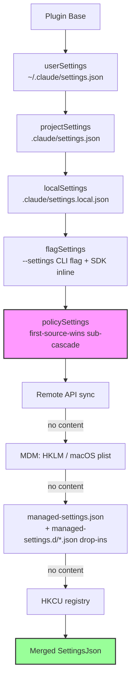
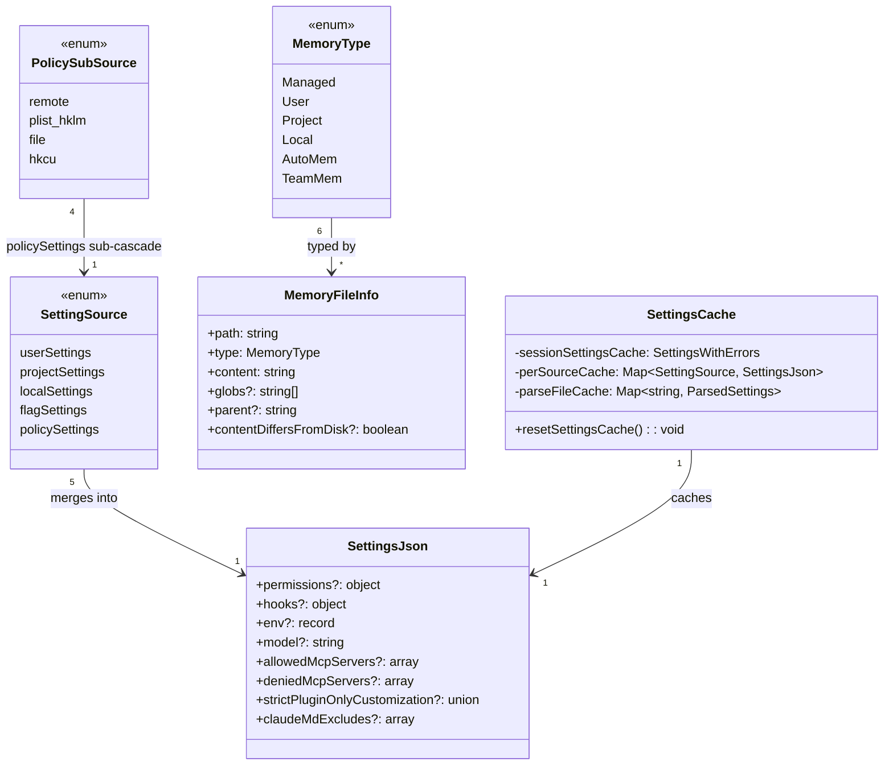

# CLAUDE.md, Settings Cascade, and Managed Settings

## Overview

Every invocation of Claude Code assembles its behavior from two deeply layered systems: the settings cascade, which merges JSON configuration from five ordered sources, and the CLAUDE.md discovery pipeline, which walks the filesystem from root to working directory collecting Markdown instructions. Together they form the harness's guide layer -- the component that shapes agent behavior through prompts, permission rules, and lifecycle hooks rather than through code changes. The settings cascade is a late-merge system: sources are loaded from lowest to highest priority, arrays are concatenated and deduplicated, and the last value to write a scalar key wins. The CLAUDE.md pipeline is a late-attention system: files loaded later in the discovery order receive more weight from the model because they appear closer to the user's immediate context. For enterprise deployments, the policy settings source introduces a "first source wins" sub-cascade (remote sync beats MDM beats file beats registry) and a set of lockdown flags (`allowManagedHooksOnly`, `allowManagedPermissionRulesOnly`, `strictPluginOnlyCustomization`) that restrict which lower-priority sources can contribute at all.

These two systems are not independent. The settings cascade controls which CLAUDE.md sources are active: the `--setting-sources` CLI flag can disable `userSettings`, `projectSettings`, or `localSettings`, and the `isSettingSourceEnabled()` check in `getMemoryFiles()` gates each phase of CLAUDE.md discovery accordingly. Conversely, the `claudeMdExcludes` setting -- itself a product of the cascade -- can suppress specific CLAUDE.md files that would otherwise be loaded. The `env` field in `SettingsJson` at `src/utils/settings/types.ts:L333-L335` provides a third bridging mechanism: environment variables defined in settings are injected into the session environment and can be referenced by hooks, skills, and CLAUDE.md `@include` paths that use `~/` expansion. This bidirectional dependency means that the cascade must be fully resolved before CLAUDE.md discovery begins, and the session cache ensures it is resolved exactly once per session.

The two systems also differ in their merge semantics. The settings cascade uses deep merge with array concatenation: overlapping arrays are unioned, overlapping objects are recursively merged, and scalar collisions are resolved by last-writer-wins. The CLAUDE.md pipeline uses simple string concatenation with a preamble: each file's content is appended to the instruction block, and the model's attention mechanism (which weights later tokens more heavily) provides the effective "override" behavior. There is no deduplication of CLAUDE.md content -- if two files contain identical instructions, those instructions appear twice. The `processedPaths` set at `src/utils/claudemd.ts:L796` prevents the same file from being loaded twice via `@include` cycles, but it does not deduplicate semantically identical content across different files.

## Data structures and contracts

The central type for the settings cascade is `SettingsJson`, inferred from the `SettingsSchema` lazy Zod schema. Every settings file on disk is parsed against this schema; invalid files produce errors but do not block the merge -- their contributions are omitted.

```typescript
// src/utils/settings/types.ts:L1104-L1104 — SettingsJson inferred type
export type SettingsJson = z.infer<ReturnType<typeof SettingsSchema>>
```

The `SettingsJson` type covers dozens of optional fields ranging from `permissions` and `hooks` to `env`, `model`, `sandbox`, `allowedMcpServers`, and enterprise lockdown flags like `allowManagedHooksOnly`. The schema uses `.passthrough()` on the outer object and on the `permissions` sub-object, so unknown keys survive validation and are preserved across writes -- a backward-compatibility guarantee documented in the schema's comment block at `src/utils/settings/types.ts:L209-L241`. This design choice means that a future version of Claude Code can add new settings fields without breaking older clients: the older client ignores the unknown key during schema validation, and the `.passthrough()` ensures it is not stripped during the merge-and-write cycle.

The five sources are enumerated in a constant array whose order is the merge order:

```typescript
// src/utils/settings/constants.ts:L7-L22 — SettingSource order definition
export const SETTING_SOURCES = [
  // User settings (global)
  'userSettings',

  // Project settings (shared per-directory)
  'projectSettings',

  // Local settings (gitignored)
  'localSettings',

  // Flag settings (from --settings flag)
  'flagSettings',

  // Policy settings (managed-settings.json or remote settings from API)
  'policySettings',
] as const
```

The comment "Order matters - later sources override earlier ones" is the contract. User settings at `~/.claude/settings.json` provide the base; project settings at `.claude/settings.json` override; local settings at `.claude/settings.local.json` override those; CLI flag settings and policy settings have the final word. The `EditableSettingSource` type at `src/utils/settings/constants.ts:L182-L185` excludes `policySettings` and `flagSettings` from the set of sources that `updateSettingsForSource()` can write to, since these are read-only surfaces controlled by administrators and the SDK respectively.

The `SettingsWithSources` return type provides introspection into the cascade:

```typescript
// src/utils/settings/settings.ts:L822-L826 — SettingsWithSources type
export type SettingsWithSources = {
  effective: SettingsJson
  /** Ordered low-to-high priority — later entries override earlier ones. */
  sources: Array<{ source: SettingSource; settings: SettingsJson }>
}
```

The `effective` field contains the fully merged result, while `sources` preserves the per-source breakdown in merge order. The `getSettingsWithSources()` function at `src/utils/settings/settings.ts:L836-L848` always resets the cache before reading, ensuring that the per-source and merged views are consistent even if the file-change detector has not yet fired.

The CLAUDE.md side uses a different but complementary type:

```typescript
// src/utils/claudemd.ts:L229-L243 — MemoryFileInfo type
export type MemoryFileInfo = {
  path: string
  type: MemoryType
  content: string
  parent?: string // Path of the file that included this one
  globs?: string[] // Glob patterns for file paths this rule applies to
  contentDiffersFromDisk?: boolean
  rawContent?: string
}
```

The `type` field maps to the `MemoryType` enum (`Managed`, `User`, `Project`, `Local`, `AutoMem`, `TeamMem`), which mirrors the settings source hierarchy. The `globs` field enables conditional rules -- Markdown files in `.claude/rules/` can declare frontmatter `paths` that restrict them to matching file paths, a progressive-disclosure mechanism that avoids injecting irrelevant instructions into context. The `contentDiffersFromDisk` flag is set when auto-injection transforms the content (stripping HTML comments, stripping frontmatter, or truncating AutoMem entries), and `rawContent` preserves the unmodified disk bytes so that callers can cache a `isPartialView` readFileState entry for change detection.

The cache layer is deliberately thin but strategically layered:

```typescript
// src/utils/settings/settingsCache.ts:L5-L13 — Session settings cache
let sessionSettingsCache: SettingsWithErrors | null = null

export function getSessionSettingsCache(): SettingsWithErrors | null {
  return sessionSettingsCache
}

export function setSessionSettingsCache(value: SettingsWithErrors): void {
  sessionSettingsCache = value
}
```

The session cache stores the merged result of `loadSettingsFromDisk()` so that repeated calls to `getInitialSettings()` during a session hit an in-memory object rather than re-reading every settings file. Below it, the `perSourceCache` map at `src/utils/settings/settingsCache.ts:L20` caches per-source reads (so that `getSettingsForSource()` and `loadSettingsFromDisk()` do not re-parse the same file), and the `parseFileCache` map at `src/utils/settings/settingsCache.ts:L45` deduplicates the raw file-read-plus-Zod-parse step. All three caches are cleared atomically by `resetSettingsCache()` at `src/utils/settings/settingsCache.ts:L55-L59`, which fires after any settings write, `--add-dir` change, plugin init, or hooks refresh.

The cache also carries a plugin settings base layer:

```typescript
// src/utils/settings/settingsCache.ts:L62-L67 — Plugin settings base
let pluginSettingsBase: Record<string, unknown> | undefined

export function getPluginSettingsBase(): Record<string, unknown> | undefined {
  return pluginSettingsBase
}
```

The plugin loader writes here after loading plugins, and `loadSettingsFromDisk()` reads it as the lowest-priority base -- even below user settings. This allows plugins to contribute defaults (for example, an agent name or a set of permission rules) that any standard settings source can override.

## Control flow

The settings merge begins when `getInitialSettings()` is called during bootstrap. It delegates to `getSettingsWithErrors()`, which checks the session cache and, on a miss, calls `loadSettingsFromDisk()`. That function iterates over `getEnabledSettingSources()` -- which always includes `policySettings` and `flagSettings` regardless of the `--setting-sources` flag, as guaranteed by `src/utils/settings/constants.ts:L159-L167` -- and deep-merges each source using lodash `mergeWith` with the `settingsMergeCustomizer`.

```typescript
// src/utils/settings/settings.ts:L657-L684 — Settings cascade merge loop
    // Start with plugin settings as the lowest priority base.
    const pluginSettings = getPluginSettingsBase()
    let mergedSettings: SettingsJson = {}
    if (pluginSettings) {
      mergedSettings = mergeWith(
        mergedSettings,
        pluginSettings,
        settingsMergeCustomizer,
      )
    }
    const allErrors: ValidationError[] = []
    const seenErrors = new Set<string>()
    const seenFiles = new Set<string>()

    // Merge settings from each source in priority order with deep merging
    for (const source of getEnabledSettingSources()) {
      // policySettings: "first source wins" — use the highest-priority source
      // that has content. Priority: remote > HKLM/plist > managed-settings.json > HKCU
      if (source === 'policySettings') {
        // ... (handled separately)
        continue
      }
```

The `settingsMergeCustomizer` at `src/utils/settings/settings.ts:L538-L547` ensures arrays are concatenated and deduplicated rather than replaced, so `permissions.allow` entries from all sources accumulate:

```typescript
// src/utils/settings/settings.ts:L538-L547 — Array merge customizer
export function settingsMergeCustomizer(
  objValue: unknown,
  srcValue: unknown,
): unknown {
  if (Array.isArray(objValue) && Array.isArray(srcValue)) {
    return mergeArrays(objValue, srcValue)
  }
  // Return undefined to let lodash handle default merge behavior
  return undefined
}
```

This means that if user settings define `permissions.allow: ["Bash(npm test)"]` and project settings define `permissions.allow: ["Bash(npm build)"]`, the merged result contains both entries. Scalar values, by contrast, follow the standard lodash behavior where the last writer wins: if both sources set `model: "claude-sonnet"`, the higher-priority source's value prevails.



The policy settings source breaks the late-merge pattern. Within the policy sub-cascade, the first source that has content wins entirely -- there is no merging among the four policy sub-sources. The `getSettingsForSourceUncached()` function at `src/utils/settings/settings.ts:L319-L368` implements this: it checks remote, then MDM, then file, then HKCU, and returns the first non-empty result. This design prevents a low-priority enterprise policy from being diluted by a higher-priority one; instead, the most authoritative policy source takes full control.

Within the file-based policy sub-source, there is a second merge: the `loadManagedFileSettings()` function at `src/utils/settings/settings.ts:L74-L121` first loads the base `managed-settings.json`, then scans the `managed-settings.d/` drop-in directory for additional `.json` files sorted alphabetically. Each drop-in is deep-merged on top of the base using the same `settingsMergeCustomizer`. This follows the systemd/sudoers convention: the base file provides defaults, and independent teams can ship their own policy fragments (e.g., `10-otel.json`, `20-security.json`) without coordinating edits to a single admin-owned file. Later filenames win for overlapping keys.

The `getPolicySettingsOrigin()` function at `src/utils/settings/settings.ts:L375-L407` provides observability into which sub-source won, returning one of `'remote'`, `'plist'`, `'hklm'`, `'file'`, or `'hkcu'`. On macOS, MDM settings are read from a plist; on Windows, from the HKLM registry hive. The distinction is surfaced for the `/status` command and for diagnostic logging.

The flag settings source also has a sub-merge. At `src/utils/settings/settings.ts:L352-L365`, after loading the file specified by the `--settings` CLI flag, the function checks for inline settings set via the SDK (`getFlagSettingsInline()`). If inline settings exist, they are parsed against `SettingsSchema` and merged on top of the file-based flag settings. This two-step merge allows the SDK to override flag-file settings without modifying the file on disk.

For the CLAUDE.md discovery pipeline, the `getMemoryFiles()` function at `src/utils/claudemd.ts:L790-L1075` is memoized and proceeds in four phases. The comment at the top of the file documents the loading order:

```typescript
// src/utils/claudemd.ts:L4-L9 — Memory file loading order
 * 1. Managed memory (eg. /etc/claude-code/CLAUDE.md) - Global instructions for all users
 * 2. User memory (~/.claude/CLAUDE.md) - Private global instructions for all projects
 * 3. Project memory (CLAUDE.md, .claude/CLAUDE.md, and .claude/rules/*.md in project roots)
 * 4. Local memory (CLAUDE.local.md in project roots) - Private project-specific instructions
```

The comment continues: "Files are loaded in reverse order of priority, i.e. the latest files are highest priority with the model paying more attention to them." This is the late-attention principle in action. Phase 1 loads Managed memory first (always loaded, gated by `isSettingSourceEnabled` which always includes policy). Phase 2 loads User memory only if `isSettingSourceEnabled('userSettings')` returns true, as shown at `src/utils/claudemd.ts:L826-L847`. Phase 3 walks from root to CWD, loading Project and Local files at each directory level. Phase 4 loads AutoMem and TeamMem entrypoints if their respective features are enabled.



The directory walk in phase 3 uses a bottom-up traversal that is then reversed. At `src/utils/claudemd.ts:L850-L858`, the code builds an array of directories from CWD up to root, then iterates in reverse (root-first) so that closer-to-CWD files are appended later to the `result` array. This ordering is critical because the `getClaudeMds()` function at `src/utils/claudemd.ts:L1153-L1195` joins all file contents with the `MEMORY_INSTRUCTION_PROMPT` preamble, and later entries in the string receive more attention from the model. At each directory level, the walk loads `CLAUDE.md` (Project), `.claude/CLAUDE.md` (Project), `.claude/rules/*.md` (Project conditional and unconditional), and `CLAUDE.local.md` (Local), with Project files gated by `isSettingSourceEnabled('projectSettings')` and Local files gated by `isSettingSourceEnabled('localSettings')`.

Each memory file is processed through `parseMemoryFileContent()` at `src/utils/claudemd.ts:L343-L400`, which performs four transformations in sequence: (1) strips YAML frontmatter using `parseFrontmatterPaths()`, extracting any `paths` globs for conditional rule matching; (2) lexes the content with the marked lexer to identify block-level HTML comments and `@include` directives; (3) strips HTML comments while preserving inline code spans and fenced code blocks; (4) truncates AutoMem and TeamMem entrypoints to character limits via `truncateEntrypointContent()`. The `@include` directive supports `@path`, `@./relative/path`, `@~/home/path`, and `@/absolute/path` syntax, with a maximum recursion depth of 5 (`MAX_INCLUDE_DEPTH` at `src/utils/claudemd.ts:L537`). Circular references are prevented by a `processedPaths` set that tracks normalized file paths across the entire walk.

The `processMemoryFile()` function at `src/utils/claudemd.ts:L618-L685` orchestrates the recursive include resolution. It first checks whether the file has already been processed (using normalized path comparison) or whether the recursion depth exceeds `MAX_INCLUDE_DEPTH`. It then checks `isClaudeMdExcluded()` against the `claudeMdExcludes` setting. After reading and parsing the file, it pushes the main file first, then recursively processes each `@include` path. Files outside the original CWD are only included if `includeExternal` is true and the user has approved external includes. The `parent` field on `MemoryFileInfo` tracks which file included which, enabling the `getExternalClaudeMdIncludes()` function at `src/utils/claudemd.ts:L1404-L1414` to surface external-include warnings.

After all memory files are collected, the `getMemoryFiles()` function fires the `InstructionsLoaded` hook for each instruction file (excluding AutoMem and TeamMem, which are a separate memory system, not "instructions" in the CLAUDE.md/rules sense). The hook is gated by a `shouldFireHook` one-shot flag at `src/utils/claudemd.ts:L1100` that is consumed on the first non-force-include cache miss. This prevents double-firing when `getExternalClaudeMdIncludes()` calls `getMemoryFiles(true)` for approval checks. The one-shot flag is consumed on every non-force-include cache miss regardless of whether a hook is configured, so the flag is released even when no hook exists -- otherwise a mid-session hook registration followed by a direct `.cache.clear()` would spuriously fire with a stale `'session_start'` reason. The `resetGetMemoryFilesCache()` function at `src/utils/claudemd.ts:L1124-L1130` re-enables the hook and sets the load reason (e.g., `'compact'` when compaction clears the cache, rather than the default `'session_start'`). For cache invalidation that is purely for correctness (e.g., worktree enter/exit, settings sync, the `/memory` dialog), the `clearMemoryFileCaches()` function at `src/utils/claudemd.ts:L1119-L1122` clears the memoize cache without re-enabling the hook, avoiding spurious hook fires.

The `getMemoryFiles()` function also supports an additional-directories mechanism controlled by the `CLAUDE_CODE_ADDITIONAL_DIRECTORIES_CLAUDE_MD` environment variable. When this variable is set to a truthy value, the function at `src/utils/claudemd.ts:L940-L977` processes CLAUDE.md, `.claude/CLAUDE.md`, and `.claude/rules/*.md` from each directory specified via the `--add-dir` CLI flag. This is not gated by `isSettingSourceEnabled('projectSettings')` because `--add-dir` is an explicit user action and the SDK defaults `settingSources` to an empty array when not specified.

## Edge cases and failure modes

**Broken symlinks in settings paths**: The `parseSettingsFileUncached()` function at `src/utils/settings/settings.ts:L201-L231` uses `safeResolvePath()` before reading, so a broken symlink produces an ENOENT that is silently handled rather than crashing the merge. The `handleFileSystemError()` function at `src/utils/settings/settings.ts:L157-L170` logs a debug message for broken symlinks but escalates other errors to `logError()`.

**Policy sub-cascade fallback with invalid remote settings**: If the remote API returns settings that fail Zod validation, the code at `src/utils/settings/settings.ts:L682-L692` surfaces the errors but falls through to the next sub-source (MDM, then file, then HKCU). An invalid remote policy does not block the merge; it is treated as absent for selection purposes. This is a deliberate defense against a malformed API response taking down the entire settings system.

**CLAUDE.md exclusion patterns and symlink resolution**: The `claudeMdExcludes` setting at `src/utils/settings/types.ts:L1053-L1061` allows glob patterns to suppress specific CLAUDE.md files. The `isClaudeMdExcluded()` function at `src/utils/claudemd.ts:L547-L573` respects this setting only for User, Project, and Local memory types -- Managed and policy files are never excludable. On macOS, the function also resolves symlink paths via `resolveExcludePatterns()` at `src/utils/claudemd.ts:L581-L612` (e.g., `/tmp` to `/private/tmp`) to handle cases where the exclude pattern uses the symlink path but the filesystem reports the real path. For glob patterns containing wildcards, the function resolves only the static prefix before the first wildcard character.

**Nested worktree duplicate loading**: When running from a git worktree inside a main repo, the upward directory walk in `getMemoryFiles()` would encounter both the worktree root and the main repo root, loading checked-in files like `CLAUDE.md` twice. The code at `src/utils/claudemd.ts:L866-L884` detects this situation by comparing `findGitRoot()` with `findCanonicalGitRoot()` and skips Project-type files from directories above the worktree but within the main repo. `CLAUDE.local.md` is still loaded because it is gitignored and only exists in the main repo.

**Drop-in directory sorting**: The managed settings drop-in directory (`managed-settings.d/`) is sorted alphabetically at `src/utils/settings/settings.ts:L93-L101`, following the systemd/sudoers convention. Later filenames win, so `20-security.json` overrides `10-otel.json` for overlapping keys. Dot-prefixed files are excluded, allowing temporary disablement via renaming.

**Settings write with invalid JSON**: The `updateSettingsForSource()` function at `src/utils/settings/settings.ts:L416-L524` reads the existing file before merging. If the file contains invalid JSON (a syntax error, not merely schema-invalid content), the function returns an error rather than overwriting -- preventing data loss from a corrupted settings file. If the file contains valid JSON but fails schema validation, the raw parsed data is used as the merge base with a debug log, so that one invalid field does not prevent the user from updating other fields.

**Project settings excluded from security-sensitive checks**: The `hasSkipDangerousModePermissionPrompt()` function at `src/utils/settings/settings.ts:L882-L889` and the `hasAutoModeOptIn()` function at `src/utils/settings/settings.ts:L896-L911` both intentionally exclude `projectSettings` from their checks. A malicious project could otherwise auto-bypass the dangerous-mode permission dialog or the auto-mode opt-in dialog by setting the corresponding flag in `.claude/settings.json`, which is checked into version control and could be cloned by an unsuspecting developer. This is a defense-in-depth measure: only user-level, local, flag, and policy sources are trusted for these security-sensitive booleans.

**Cache mutation safety**: The `parseSettingsFile()` function at `src/utils/settings/settings.ts:L178-L199` clones both the cached and newly-computed results before returning. This is necessary because `mergeWith` mutates its target argument (including nested references), and mutating a cached object would leak unpersisted state if the write fails before `resetSettingsCache()` is called.

**Trusted source filtering for project settings**: The `getUseAutoModeDuringPlan()` function at `src/utils/settings/settings.ts:L918-L928` checks policy, flag, user, and local sources but excludes project settings, following the same RCE-defense principle. The function returns `true` (the safe default) unless any trusted source explicitly sets `useAutoModeDuringPlan` to `false`, making this an opt-out rather than opt-in.

## Where cc diverges from the published pattern

HER section 7 identifies six configuration surfaces: CLAUDE.md/AGENTS.md files, MCP servers, skills, sub-agents, hooks, and back-pressure mechanisms. The settings cascade and CLAUDE.md pipeline map to the first and fifth surfaces, but cc's implementation diverges in several significant ways.

The ETH Zurich study cited in HER section 7.1 found that context files "tend to reduce task success rates compared to providing no repository context, while also increasing inference cost by over 20%." The study recommends describing only "minimal requirements" and warns that verbose instructions and detailed directory trees hurt rather than help. CC's implementation addresses this concern through three mechanisms: the `claudeMdExcludes` setting, which allows selective suppression of specific CLAUDE.md files; the conditional rules mechanism (frontmatter `paths` globs in `.claude/rules/*.md` files), which scopes instructions to relevant file paths; and the `MAX_MEMORY_CHARACTER_COUNT` of 40,000 characters at `src/utils/claudemd.ts:L92`, which provides a hard per-file cap. The AutoMem truncation at `src/utils/claudemd.ts:L382-L385` applies an additional line-and-byte budget to the memory index file. These mechanisms collectively implement the HER's recommendation for minimal, targeted context rather than comprehensive documentation dumps.

The settings cascade's policy sub-cascade "first source wins" design is not discussed in the HER. The published pattern assumes a uniform late-merge across all sources, but cc explicitly breaks this for enterprise policy: a remote policy from the API takes full control, with no merging against MDM or file-based policy. This prevents the "policy dilution" problem where a permissive MDM rule could override a restrictive remote policy. The `getPolicySettingsOrigin()` function provides observability into which sub-source won, enabling administrators to diagnose why a particular policy is or is not in effect.

The `strictPluginOnlyCustomization` setting at `src/utils/settings/types.ts:L518-L548` is an enterprise lockdown mechanism with no HER analogue. When set in managed settings, it blocks non-plugin customization sources for the listed surfaces (skills, agents, hooks, mcp). The `CUSTOMIZATION_SURFACES` constant at `src/utils/settings/types.ts:L248-L253` defines the lockable surfaces. The schema uses a `.preprocess()` step that filters unknown surface names, so a future enum value (e.g., `'commands'`) on a newer client is silently dropped on an older client rather than failing `safeParse` and nulling the entire managed-settings file. The `.catch(undefined)` fallback at `src/utils/settings/types.ts:L540` handles non-array invalid values the same way: degrading to unlocked-for-this-field rather than everything-broken.

CC also diverges from the HER's recommendation of a three-part CLAUDE.md structure (WHY/WHAT/HOW). Instead, cc supports a file-per-convention model through `.claude/rules/*.md`, where each rule file can declare its own frontmatter `paths` globs for conditional applicability. The `processMdRules()` function at `src/utils/claudemd.ts:L697-L788` recursively scans the rules directory and filters files based on the `conditionalRule` parameter: when `true`, only files with frontmatter `paths` are included; when `false`, only files without `paths` are included. The `processConditionedMdRules()` function at `src/utils/claudemd.ts:L1354-L1397` then matches the glob patterns against the target file path using the `ignore` package, with patterns resolved relative to the directory containing `.claude/` for Project rules or relative to the original CWD for Managed and User rules. This is a progressive-disclosure approach: rather than loading a monolithic CLAUDE.md, the harness loads only the rules relevant to the file being edited.

The `allowManagedHooksOnly` and `allowManagedPermissionRulesOnly` settings represent a second lockdown axis not covered by the HER. These flags, when set in managed settings, completely suppress hooks or permission rules from user, project, and local sources. This is distinct from `strictPluginOnlyCustomization`, which blocks customization through filesystem surfaces (files in `~/.claude/{surface}/` and `.claude/{surface}/`) but still allows settings.json contributions. Together, these three lockdown mechanisms provide enterprise administrators with fine-grained control over which configuration surfaces are available to end users, from "everything allowed" to "only admin-approved plugins may customize behavior."

## Developer takeaways for building a long-running agent

The settings cascade and CLAUDE.md pipeline demonstrate three principles essential for any long-running agent harness. First, configuration must be layered and overridable: a single flat config file cannot serve the needs of individual developers, project teams, and enterprise administrators simultaneously. The five-source cascade with deep-merge semantics allows each constituency to set defaults that the next layer can refine or override, and the "first source wins" sub-cascade for policy ensures that the most authoritative source takes unambiguous control without dilution. Second, instruction injection must be scoped and bounded: loading every available instruction file into context degrades model performance and increases cost, as the ETH Zurich study confirms. Conditional rules with frontmatter globs, exclusion patterns, and per-file character caps are not optional niceties -- they are the mechanisms that keep the context window productive and the inference bill manageable. Third, cache invalidation must be atomic and co-located with writes: the `resetSettingsCache()` call that clears all three cache layers (session, per-source, parse-file) appears immediately after every settings write in `updateSettingsForSource()`, and the CLAUDE.md memoize cache is cleared alongside it. Splitting cache invalidation across multiple call sites or deferring it to a periodic sweep would create windows where the agent operates on stale configuration, producing subtle misbehavior that is difficult to reproduce or diagnose. The defense-in-depth pattern of excluding project settings from security-sensitive checks is also worth adopting: any configuration source that is checked into version control and automatically cloned is a remote code execution vector, and the harness must not trust it for permission-gating decisions.
