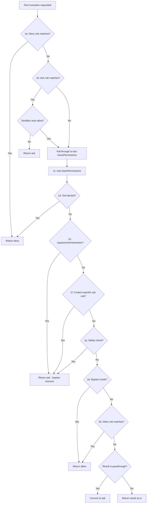
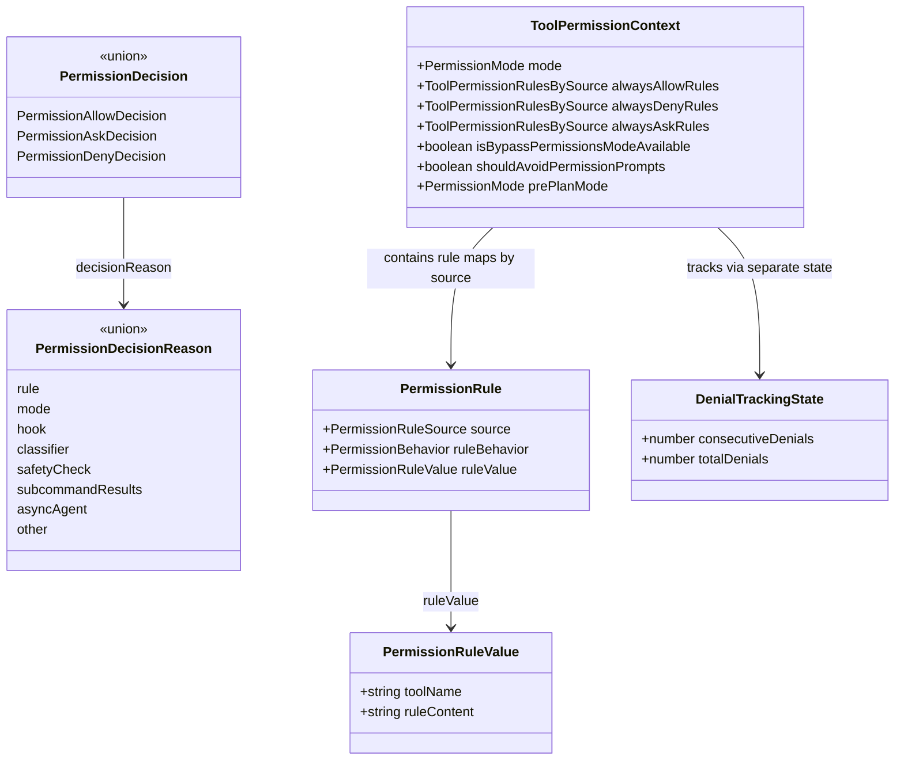

# The Permission Model: Modes and Rules

## Overview

Every tool invocation in cc passes through a permission gate before execution. This gate is governed by two orthogonal axes: a **permission mode** that sets the broad authorization posture (ask, auto-approve, or deny-by-default), and a **rule system** that encodes per-tool, per-content, and per-source allow/deny/ask policies. The combination determines whether a tool call proceeds, prompts the user, or is rejected outright.

The permission pipeline lives in `src/utils/permissions/permissions.ts` (1486 lines) and is anchored by `hasPermissionsToUseTool`, the function that every tool dispatch path calls before executing. The mode definitions and display logic live in `src/utils/permissions/PermissionMode.ts`. Rule schemas and the Zod validators for rule values are in `src/utils/permissions/PermissionRule.ts`. Together they implement what the Harness Engineering Report (HER) calls the five-layer defense-in-depth: prompt-level guardrails, schema-level restrictions, runtime approval, tool-level validation, and lifecycle hooks (HER section 12.1).

This chapter traces the full evaluation pipeline from mode selection through rule resolution, explains how the six permission modes differ in behavior, and shows how cc's design diverges from the simpler "ask-every-time" pattern described in the HER.

## Data structures and contracts

### Permission mode configuration

The display and mapping logic for each permission mode lives in `src/utils/permissions/PermissionMode.ts`. Each mode has a configuration object that controls its title, symbol, color, and external mapping:

```typescript
// src/utils/permissions/PermissionMode.ts:L34-L91
type PermissionModeConfig = {
  title: string
  shortTitle: string
  symbol: string
  color: ModeColorKey
  external: ExternalPermissionMode
}

const PERMISSION_MODE_CONFIG: Partial<
  Record<PermissionMode, PermissionModeConfig>
> = {
  default: {
    title: 'Default',
    shortTitle: 'Default',
    symbol: '',
    color: 'text',
    external: 'default',
  },
  plan: {
    title: 'Plan Mode',
    shortTitle: 'Plan',
    symbol: PAUSE_ICON,
    color: 'planMode',
    external: 'plan',
  },
  acceptEdits: {
    title: 'Accept edits',
    shortTitle: 'Accept',
    symbol: '⏵⏵',
    color: 'autoAccept',
    external: 'acceptEdits',
  },
  bypassPermissions: {
    title: 'Bypass Permissions',
    shortTitle: 'Bypass',
    symbol: '⏵⏵',
    color: 'error',
    external: 'bypassPermissions',
  },
  dontAsk: {
    title: "Don't Ask",
    shortTitle: 'DontAsk',
    symbol: '⏵⏵',
    color: 'error',
    external: 'dontAsk',
  },
  ...(feature('TRANSCRIPT_CLASSIFIER')
    ? {
        auto: {
          title: 'Auto mode',
          shortTitle: 'Auto',
          symbol: '⏵⏵',
          color: 'warning' as ModeColorKey,
          external: 'default' as ExternalPermissionMode,
        },
      }
    : {}),
}
```

The `color` field determines the UI rendering: `'text'` (neutral) for default, `'planMode'` for plan, `'autoAccept'` for acceptEdits, `'error'` for both bypassPermissions and dontAsk, and `'warning'` for auto. The `error` color signals that bypassPermissions and dontAsk carry risk, while `warning` indicates conditional trust. The `auto` mode at line L80 is conditionally included via the `TRANSCRIPT_CLASSIFIER` feature flag. Its `external` field maps to `'default'`, meaning that when the mode is serialized for external consumers (API, session storage), it appears as `default`, preventing external tooling from treating auto mode as a privileged escalation path.

The `getModeConfig` helper at line L107 resolves any mode to its config, falling back to `default` for unrecognized values. This fallback is also used by `permissionModeFromString` at line L117, which coerces unknown strings to `'default'` rather than throwing. The `isExternalPermissionMode` type guard at line L97 determines which modes are user-addressable: for non-`ant` users, all modes are external; for `ant` users, `auto` and `bubble` are excluded from the external set.

Each mode serves a distinct purpose in the safety posture. `default` is the baseline: every tool call not explicitly allowed by a rule triggers a user prompt. `plan` enforces read-only exploration -- write tools are blocked before the permission pipeline is even reached. `acceptEdits` auto-approves file-edit and file-write operations but still prompts for shell commands. `bypassPermissions` skips all mode-based and rule-based allowances (steps 2a and 2b in the pipeline), though hard constraints from steps 1a through 1g remain enforced. `dontAsk` converts every `ask` result to `deny`, implementing a "silently skip" policy. `auto` replaces the interactive prompt with a YOLO classifier that makes the allow/deny decision.

### Permission rule schema

The rule value schema defines how a single rule is structured. The Zod validators in `src/utils/permissions/PermissionRule.ts` establish the wire format:

```typescript
// src/utils/permissions/PermissionRule.ts:L25-L40
export const permissionBehaviorSchema = lazySchema(() =>
  z.enum(['allow', 'deny', 'ask']),
)

/**
 * PermissionRuleValue is the content of a permission rule.
 * @param toolName - The name of the tool this rule applies to
 * @param ruleContent - The optional content of the rule.
 *   Each tool may implement custom handling in `checkPermissions()`
 */
export const permissionRuleValueSchema = lazySchema(() =>
  z.object({
    toolName: z.string(),
    ruleContent: z.string().optional(),
  }),
)
```

The `permissionBehaviorSchema` at line L25 defines the three possible behaviors: `'allow'` permits the tool to run, `'deny'` blocks it, and `'ask'` forces a prompt to be shown to the user. The `permissionRuleValueSchema` at line L35 defines the rule content: `toolName` identifies the tool (e.g., `"Bash"`), while `ruleContent` optionally narrows the scope (e.g., `"npm install"` in `Bash(npm install)`). The `lazySchema` wrapper defers schema construction to break circular dependencies, as noted by the re-export comment at line L12.

The `PermissionRule` type itself bundles a rule value with its source and behavior. It is re-exported from `PermissionRule.ts` at line L14, having been extracted to a separate types file to break import cycles. The source field tracks where the rule originated -- one of eight values including `'userSettings'`, `'projectSettings'`, `'localSettings'`, `'flagSettings'`, `'policySettings'`, `'cliArg'`, `'command'`, and `'session'`. The first five map to persistent settings files with different scopes; the last three are in-memory sources.

## Control flow

### Permission mode state diagram

The six permission modes form a state machine. Transitions occur via CLI flags (`--permission-mode`), the `/mode` slash command, the `EnterPlanModeTool`/`ExitPlanModeV2Tool` tools, and programmatic mode changes during tool execution:

```mermaid
stateDiagram-v2
    [*] --> default : session start
    default --> plan : /plan or EnterPlanModeTool
    default --> acceptEdits : /mode acceptEdits
    default --> bypassPermissions : --permission-mode bypassPermissions
    default --> dontAsk : /mode dontAsk
    default --> auto : /mode auto (TRANSCRIPT_CLASSIFIER)
    plan --> default : ExitPlanModeV2Tool
    plan --> bypassPermissions : inherits bypass if parent had it
    acceptEdits --> default : /mode default
    bypassPermissions --> default : /mode default
    dontAsk --> default : /mode default
    auto --> default : /mode default
```

### The main permission evaluation pipeline

The entry point is `hasPermissionsToUseTool` at `src/utils/permissions/permissions.ts:L473`. It delegates to `hasPermissionsToUseToolInner` (line L1158) for the core rule-based evaluation, then applies mode-specific transformations on the result. The inner function follows a strict sequence of checks, each of which can short-circuit the pipeline:

```typescript
// src/utils/permissions/permissions.ts:L1158-L1228
async function hasPermissionsToUseToolInner(
  tool: Tool,
  input: { [key: string]: unknown },
  context: ToolUseContext,
): Promise<PermissionDecision> {
  if (context.abortController.signal.aborted) {
    throw new AbortError()
  }

  let appState = context.getAppState()

  // 1a. Entire tool is denied
  const denyRule = getDenyRuleForTool(appState.toolPermissionContext, tool)
  if (denyRule) {
    return {
      behavior: 'deny',
      decisionReason: {
        type: 'rule',
        rule: denyRule,
      },
      message: `Permission to use ${tool.name} has been denied.`,
    }
  }

  // 1b. Check if the entire tool should always ask for permission
  const askRule = getAskRuleForTool(appState.toolPermissionContext, tool)
  if (askRule) {
    const canSandboxAutoAllow =
      tool.name === BASH_TOOL_NAME &&
      SandboxManager.isSandboxingEnabled() &&
      SandboxManager.isAutoAllowBashIfSandboxedEnabled() &&
      shouldUseSandbox(input)

    if (!canSandboxAutoAllow) {
      return {
        behavior: 'ask',
        decisionReason: {
          type: 'rule',
          rule: askRule,
        },
        message: createPermissionRequestMessage(tool.name),
      }
    }
    // Fall through to let Bash's checkPermissions handle command-specific rules
  }

  // 1c. Ask the tool implementation for a permission result
  let toolPermissionResult: PermissionResult = {
    behavior: 'passthrough',
    message: createPermissionRequestMessage(tool.name),
  }
  try {
    const parsedInput = tool.inputSchema.parse(input)
    toolPermissionResult = await tool.checkPermissions(parsedInput, context)
  } catch (e) {
    if (e instanceof AbortError || e instanceof APIUserAbortError) {
      throw e
    }
    logError(e)
  }

  // 1d. Tool implementation denied permission
  if (toolPermissionResult?.behavior === 'deny') {
    return toolPermissionResult
  }
```

The `getDenyRuleForTool` call at line L1171 searches all deny rules across all sources for a match. The `getAskRuleForTool` call at line L1184 does the same for ask rules, with a special case for sandboxed Bash commands: when `autoAllowBashIfSandboxed` is enabled and the command will run in a sandbox, the ask rule is bypassed and the tool's own `checkPermissions` method decides. The `tool.checkPermissions` call at line L1216 delegates to each tool's implementation -- for Bash, this runs the command classifier and subcommand-level rule matching.

After the tool-specific check, the inner function continues through the remaining steps:

```typescript
// src/utils/permissions/permissions.ts:L1231-L1318
  // 1e. Tool requires user interaction even in bypass mode
  if (
    tool.requiresUserInteraction?.() &&
    toolPermissionResult?.behavior === 'ask'
  ) {
    return toolPermissionResult
  }

  // 1f. Content-specific ask rules from tool.checkPermissions take precedence
  // over bypassPermissions mode.
  if (
    toolPermissionResult?.behavior === 'ask' &&
    toolPermissionResult.decisionReason?.type === 'rule' &&
    toolPermissionResult.decisionReason.rule.ruleBehavior === 'ask'
  ) {
    return toolPermissionResult
  }

  // 1g. Safety checks are bypass-immune
  if (
    toolPermissionResult?.behavior === 'ask' &&
    toolPermissionResult.decisionReason?.type === 'safetyCheck'
  ) {
    return toolPermissionResult
  }

  // 2a. Check if mode allows the tool to run
  appState = context.getAppState()
  const shouldBypassPermissions =
    appState.toolPermissionContext.mode === 'bypassPermissions' ||
    (appState.toolPermissionContext.mode === 'plan' &&
      appState.toolPermissionContext.isBypassPermissionsModeAvailable)
  if (shouldBypassPermissions) {
    return {
      behavior: 'allow',
      updatedInput: getUpdatedInputOrFallback(toolPermissionResult, input),
      decisionReason: {
        type: 'mode',
        mode: appState.toolPermissionContext.mode,
      },
    }
  }

  // 2b. Entire tool is allowed
  const alwaysAllowedRule = toolAlwaysAllowedRule(
    appState.toolPermissionContext,
    tool,
  )
  if (alwaysAllowedRule) {
    return {
      behavior: 'allow',
      updatedInput: getUpdatedInputOrFallback(toolPermissionResult, input),
      decisionReason: {
        type: 'rule',
        rule: alwaysAllowedRule,
      },
    }
  }

  // 3. Convert "passthrough" to "ask"
  const result: PermissionDecision =
    toolPermissionResult.behavior === 'passthrough'
      ? {
          ...toolPermissionResult,
          behavior: 'ask' as const,
          message: createPermissionRequestMessage(
            tool.name,
            toolPermissionResult.decisionReason,
          ),
        }
      : toolPermissionResult

  return result
```

The pipeline has three conceptual phases. Phase 1 (steps 1a through 1g) enforces hard constraints: deny rules, ask rules, tool-specific permission checks, user-interaction requirements, content-specific ask rules, and safety checks. These cannot be overridden by mode changes. Phase 2 (steps 2a and 2b) checks mode-level and rule-level allowances: bypass mode auto-approves, and allow rules match. Phase 3 (step 3) converts any remaining `passthrough` result to `ask`, triggering the interactive prompt.

The ordering is deliberate and load-bearing. Deny rules fire first because they represent explicit user or policy prohibitions that must never be circumvented. Safety checks at step 1g are marked as "bypass-immune" -- they enforce protections for `.git/`, `.claude/`, `.vscode/`, and shell configuration files even when the mode is `bypassPermissions`. Only after all hard constraints pass does the pipeline check permissive paths.

### Rule evaluation flowchart

The following diagram shows the decision flow through the inner permission pipeline:



### Post-inner mode transformations

After `hasPermissionsToUseToolInner` returns, `hasPermissionsToUseTool` at `src/utils/permissions/permissions.ts:L473` applies mode-specific transformations on the inner result.

First, if the inner result is `allow`, the function checks whether auto mode denial tracking needs to be reset at line L486. A successful tool use breaks the consecutive denial streak, so the classifier is not penalized for previously blocked actions once a tool succeeds.

Second, if the inner result is `ask`, the function applies transformations at lines L505-L953 based on the current mode:

**dontAsk transformation** (line L508): If the current mode is `dontAsk`, the behavior is converted to `deny`. This implements the "never prompt" semantics -- the agent silently skips actions it would otherwise ask about. The `DONT_ASK_REJECT_MESSAGE` function generates a user-facing explanation identifying the blocked tool. This transformation is applied at the end of the pipeline, ensuring it cannot be bypassed by early returns from the inner function.

**auto mode transformation** (lines L520-L927): If the current mode is `auto`, cc runs a YOLO classifier (a secondary model call) to decide whether to allow or deny. This is the most complex path in the permission system, with several sub-paths:

1. **Safety-check exemption** (line L532): Non-classifier-approvable safety checks (Windows path bypass attempts, cross-machine bridge messages) remain immune to auto-approval and force a prompt. Classifier-approvable safety checks (sensitive-file paths like `.claude/` or `.git/`) fall through to the classifier, which can see the surrounding context and decide.

2. **User-interaction tools** (line L549): Tools that call `requiresUserInteraction()` are excluded from the classifier path and always prompt the user, since their design requires interactive input.

3. **acceptEdits fast-path** (line L600): Before invoking the classifier, cc checks whether the tool call would be allowed in `acceptEdits` mode. This avoids an expensive classifier API call for operations like file edits within the working directory. The check works by calling `tool.checkPermissions` with a modified context where the mode is temporarily set to `acceptEdits`. The Agent and REPL tools are excluded from this fast-path because their `checkPermissions` would return `allow` for acceptEdits mode, silently bypassing the classifier for code that may contain VM escapes.

4. **Safe-tool allowlist** (line L660): Tools on the `isAutoModeAllowlistedTool` list (read-only tools with no side effects) are auto-approved without classifier consultation.

5. **YOLO classifier** (line L693): The remaining cases are sent to `classifyYoloAction`, which builds a transcript of recent messages and tool calls, sends it to the classifier model, and receives a block/allow decision with a reason string.

6. **Denial tracking and limits** (line L879): The classifier's decisions are tracked using a `DenialTrackingState` that records both consecutive and total denial counts. After 3 consecutive denials or 20 total denials, the system falls back to interactive prompting so the user can review the transcript. This prevents the classifier from entering an infinite denial loop. When a limit is hit in headless mode (where prompting is impossible), the agent is aborted via `AbortError`. The `persistDenialState` function at line L963 handles state persistence: for async subagents with `localDenialTracking`, it mutates the local state in place (since `setAppState` is a no-op for subagents); otherwise, it writes to appState with an `Object.is` optimization that skips listener loops when the state reference is unchanged.

7. **Iron gate fail-closed** (line L845): When the classifier is unavailable (API error), the behavior depends on the `tengu_iron_gate_closed` feature flag, cached with a 30-minute refresh interval (`CLASSIFIER_FAIL_CLOSED_REFRESH_MS` at `src/utils/permissions/permissions.ts:L107`). When the gate is closed, the request is denied with retry guidance. When open, the system falls back to normal interactive prompting. This implements a configurable fail-closed vs. fail-open policy for the classifier.

### Headless agent handling

For async subagents that cannot display prompts, the `shouldAvoidPermissionPrompts` flag on `ToolPermissionContext` triggers a different path at line L932. First, `runPermissionRequestHooksForHeadlessAgent` at `src/utils/permissions/permissions.ts:L400` gives lifecycle hooks a chance to allow or deny the tool call. The function iterates over `executePermissionRequestHooks` results, returning the first hook decision it finds. If a hook returns `allow` with `updatedPermissions`, those updates are persisted and applied to the app state before returning. If a hook returns `deny` with `interrupt: true`, the abort controller is triggered, terminating the subagent. If no hook provides a decision, the system returns `deny` with `AUTO_REJECT_MESSAGE`. This ensures that headless agents never hang waiting for a human who will never respond, consistent with the async approval pattern described in HER section 11.3.

### Rule matching and MCP support

The rule matching logic in `toolMatchesRule` at `src/utils/permissions/permissions.ts:L238-L269` supports three matching strategies:

```typescript
// src/utils/permissions/permissions.ts:L238-L269
function toolMatchesRule(
  tool: Pick<Tool, 'name' | 'mcpInfo'>,
  rule: PermissionRule,
): boolean {
  // Rule must not have content to match the entire tool
  if (rule.ruleValue.ruleContent !== undefined) {
    return false
  }

  // MCP tools are matched by their fully qualified mcp__server__tool name. In
  // skip-prefix mode (CLAUDE_AGENT_SDK_MCP_NO_PREFIX), MCP tools have unprefixed
  // display names (e.g., "Write") that collide with builtin names; rules targeting
  // builtins should not match their MCP replacements.
  const nameForRuleMatch = getToolNameForPermissionCheck(tool)

  // Direct tool name match
  if (rule.ruleValue.toolName === nameForRuleMatch) {
    return true
  }

  // MCP server-level permission: rule "mcp__server1" matches tool "mcp__server1__tool1"
  // Also supports wildcard: rule "mcp__server1__*" matches all tools from server1
  const ruleInfo = mcpInfoFromString(rule.ruleValue.toolName)
  const toolInfo = mcpInfoFromString(nameForRuleMatch)

  return (
    ruleInfo !== null &&
    toolInfo !== null &&
    (ruleInfo.toolName === undefined || ruleInfo.toolName === '*') &&
    ruleInfo.serverName === toolInfo.serverName
  )
}
```

The check at line L243 ensures that rules with `ruleContent` do not match whole-tool patterns -- a rule like `Bash(npm install)` only matches the specific content, not all Bash invocations. The `getToolNameForPermissionCheck` call at line L251 adjusts for MCP prefix stripping, ensuring that rules targeting builtins do not unintentionally match MCP tools with the same display name. The MCP server-level matching at lines L260-L268 parses both the rule name and the tool name through `mcpInfoFromString`, then compares server names with optional wildcard tool matching. A rule like `"mcp__server1"` matches any tool from that server; `"mcp__server1__*"` is the explicit wildcard form.

The `getRuleByContentsForTool` function at line L349 builds a `Map<string, PermissionRule>` that indexes rules by their `ruleContent` string for a given tool and behavior. This is used by tool implementations (particularly BashTool) to check whether a specific command prefix matches an allow or deny rule. The `filterDeniedAgents` function at line L325 uses a `Set`-based optimization: rather than calling `getDenyRuleForAgent` per agent (which would re-parse every deny rule for every agent, yielding O(agents x rules) parse calls), it collects all denied agent types into a `Set` in a single pass and then filters.

### Permission request messages

The `createPermissionRequestMessage` function at `src/utils/permissions/permissions.ts:L137` generates human-readable messages that explain why a permission request was made. It dispatches on the `decisionReason.type` to produce context-appropriate text:

```typescript
// src/utils/permissions/permissions.ts:L137-L211
export function createPermissionRequestMessage(
  toolName: string,
  decisionReason?: PermissionDecisionReason,
): string {
  if (decisionReason) {
    if (
      (feature('BASH_CLASSIFIER') || feature('TRANSCRIPT_CLASSIFIER')) &&
      decisionReason.type === 'classifier'
    ) {
      return `Classifier '${decisionReason.classifier}' requires approval for this ${toolName} command: ${decisionReason.reason}`
    }
    switch (decisionReason.type) {
      case 'hook': {
        const hookMessage = decisionReason.reason
          ? `Hook '${decisionReason.hookName}' blocked this action: ${decisionReason.reason}`
          : `Hook '${decisionReason.hookName}' requires approval for this ${toolName} command`
        return hookMessage
      }
      case 'rule': {
        const ruleString = permissionRuleValueToString(
          decisionReason.rule.ruleValue,
        )
        const sourceString = permissionRuleSourceDisplayString(
          decisionReason.rule.source,
        )
        return `Permission rule '${ruleString}' from ${sourceString} requires approval for this ${toolName} command`
      }
      // ...additional cases for subcommandResults, permissionPromptTool,
      // sandboxOverride, workingDir, safetyCheck, mode, asyncAgent...
    }
  }

  // Default message without listing allowed commands
  const message = `Claude requested permissions to use ${toolName}, but you haven't granted it yet.`

  return message
}
```

For `'classifier'` reasons, the message includes the classifier name and its reason string. For `'hook'` reasons, it names the hook and includes its optional reason. For `'rule'` reasons at line L156, it includes the rule string (via `permissionRuleValueToString`) and its source display name (via `permissionRuleSourceDisplayString`), so the user can see exactly which rule triggered the prompt and where it came from. For `'subcommandResults'` reasons, it lists the specific subcommands requiring approval, with special handling for Bash to strip output redirections from the display. For `'mode'` reasons, it names the current permission mode. This function is the bridge between the internal decision reason machinery and the user-facing prompt UI.

### The checkRuleBasedPermissions subset

The `checkRuleBasedPermissions` function at `src/utils/permissions/permissions.ts:L1071` extracts the rule-based steps (1a through 1g) into a standalone check. This function is called by the `bypassPermissions` mode to enforce hard constraints even when bypassing the interactive pipeline. It returns `null` when no rule-based objection exists, allowing the caller to proceed with mode-based approval. Unlike `hasPermissionsToUseTool`, it does not run the auto mode classifier, mode-based transformations, or PermissionRequest hooks. The comment at line L1062 notes that it covers "the subset that bypassPermissions mode respects (everything that fires before step 2a)." This extraction ensures that the hard-constraint ordering is consistent whether the caller is the full pipeline or the bypass path.

### Rule types class diagram



## Edge cases and failure modes

**Bypass-immune safety checks.** Steps 1f and 1g in the pipeline enforce content-specific ask rules and safety checks even in `bypassPermissions` mode. A rule like `Bash(npm publish:*)` with behavior `ask` will still prompt despite bypass mode, and editing files in `.git/` or `.claude/` directories triggers a `safetyCheck` that cannot be bypassed. The `checkRuleBasedPermissions` function at `src/utils/permissions/permissions.ts:L1071` replicates these same checks for the bypass path, ensuring consistency. This is a deliberate design choice: the HER section 12.4 identifies supply chain attacks and data exfiltration through tool calls as high-severity threats, and bypass-immune checks are the mitigation for the most sensitive paths.

**Classifier unavailability and iron gate.** When the YOLO classifier API returns an error, the system must decide whether to fail closed (deny) or fail open (fall back to prompting). The `tengu_iron_gate_closed` feature flag at `src/utils/permissions/permissions.ts:L847` controls this. Fail-closed is the safer default, but fail-open is needed when the classifier is experiencing transient outages. The flag is cached with a 30-minute refresh interval (`CLASSIFIER_FAIL_CLOSED_REFRESH_MS` at line L107), so operators can change the gate state without restarting sessions.

**Transcript-too-long fallback.** When the classifier's transcript exceeds the model's context window, the classifier returns `transcriptTooLong: true`. This is a deterministic error -- the same transcript always produces the same result on retry. Rather than denying or retrying, the system falls back to interactive prompting at line L834, preserving the user's ability to approve or deny the action. In headless mode, this condition triggers an `AbortError` at line L826, since the transcript will only grow larger and the condition will never self-resolve.

**Denial limit escalation.** The denial tracking system sets limits of 3 consecutive denials and 20 total denials. When a limit is exceeded, `handleDenialLimitExceeded` at `src/utils/permissions/permissions.ts:L984` resets the tracking counters and returns an `ask` decision, forcing the user to review. The `hitTotalLimit` check at line L999 distinguishes between the two limits, producing different warning messages. In headless mode, exceeding the limit throws `AbortError`, terminating the subagent cleanly. The `persistDenialState` function at line L963 handles the state update: for async subagents with `localDenialTracking`, it mutates the local state in place; otherwise, it writes to appState with an `Object.is` optimization that skips listener loops when the state reference is unchanged.

**dontAsk mode denial cascade.** In `dontAsk` mode, every `ask` result is converted to `deny` at `src/utils/permissions/permissions.ts:L508-L517`. This means that if a tool has no allow rule and the mode is `dontAsk`, the tool is permanently blocked for the session. The `DONT_ASK_REJECT_MESSAGE` function provides the user with the name of the blocked tool, but the only way to recover is to switch out of `dontAsk` mode or add an explicit allow rule. This transformation is applied at the end of the pipeline (after `hasPermissionsToUseToolInner` returns), ensuring it cannot be bypassed by early returns.

**PowerShell in auto mode.** The PowerShell tool is excluded from the auto mode classifier at line L573 when the `POWERSHELL_AUTO_MODE` feature flag is disabled. This guard keeps PowerShell out of the classifier and the acceptEdits fast-path, requiring interactive approval instead. When the flag is enabled, PowerShell flows through to the classifier like Bash, with `POWERSHELL_DENY_GUIDANCE` appended to the classifier prompt so it recognizes patterns like `iex (iwr ...)` as download-and-execute. Allow rules that fire earlier (step 2b `toolAlwaysAllowedRule`, PowerShell prefix allow rules) return before reaching this guard.

**MCP prefix stripping.** In "skip-prefix" mode (`CLAUDE_AGENT_SDK_MCP_NO_PREFIX`), MCP tools have unprefixed display names that can collide with builtin tool names. The `getToolNameForPermissionCheck` function at `src/utils/permissions/permissions.ts:L251` ensures that rules targeting builtins do not match their MCP replacements, preventing a rule intended for the `Write` builtin from unintentionally allowing an MCP tool also named `Write`.

**Sandbox auto-allow for ask rules.** When the `autoAllowBashIfSandboxed` setting is enabled and a Bash command will run in a sandbox, the ask rule at step 1b is bypassed at `src/utils/permissions/permissions.ts:L1189-L1194`. The reasoning is that sandboxed commands are already isolated from the host system, so the additional confirmation is unnecessary. However, commands that are excluded from the sandbox or have `dangerouslyDisableSandbox` set still respect the ask rule.

## Where cc diverges from the published pattern

The HER section 12.1 describes a five-layer defense-in-depth model with a clear hierarchy: prompt-level guardrails, schema-level restrictions, runtime approval, tool-level validation, and lifecycle hooks. cc implements all five layers but deviates in several important ways.

**Layered override immunity.** The HER model implies that each layer is independent and that higher layers can override lower ones. cc's pipeline explicitly does *not* allow this. Deny rules (step 1a) cannot be overridden by any mode, not even `bypassPermissions`. Safety checks (step 1g) are bypass-immune. Content-specific ask rules (step 1f) override bypass mode. This "hard constraint" ordering means that the permission pipeline is not a simple priority stack -- it is a layered checkpoint where certain checks are absolute barriers. The `checkRuleBasedPermissions` function at `src/utils/permissions/permissions.ts:L1071` enforces this same ordering for the bypass path, ensuring that the hard constraints are always evaluated regardless of mode.

**Classifier-mediated human-in-the-loop.** HER section 11.1 describes confidence-based routing as a model of the agent's own confidence in its action. cc's auto mode uses a fundamentally different mechanism: a separate classifier model evaluates the *safety* of the action, not the agent's confidence. This is a more conservative approach because the classifier has no stake in the agent's success -- it is an independent safety evaluator. The two-stage architecture (fast XML classification, then thinking-model verification) and the iron-gate fail-closed policy go beyond what the HER describes for confidence routing. The denial tracking circuit breaker adds another layer of protection absent from the confidence-based routing model.

**Denial tracking as a circuit breaker.** The HER's tiered escalation pattern (section 11.2) describes four tiers of increasing human involvement: automated checks, agent self-correction, human front-line, and human expert. cc's denial tracking implements a different pattern: rather than escalating from automated to human review based on risk level, it uses consecutive and total denial counts as a *circuit breaker* that forces human review when the classifier is consistently blocking actions. This is more akin to a rate-limiting pattern (HER section 12.3, pattern 4) than to the described escalation hierarchy. The key insight is that repeated classifier denials indicate either a misaligned classifier or an agent that is persistently attempting unsafe actions -- both scenarios require human review.

**Rule source provenance.** The HER does not address the provenance of permission rules -- where they came from and who set them. cc tracks each rule's source through the `PermissionRuleSource` type, distinguishing user settings from project settings from enterprise policy. This enables the `shouldAllowManagedPermissionRulesOnly` gate at `src/utils/permissions/permissions.ts:L1426`, which can clear all non-policy rules in managed environments. The `deletePermissionRule` function at line L1329 refuses to delete rules from read-only sources (`policySettings`, `flagSettings`, `command`). The `syncPermissionRulesFromDisk` function at line L1419 clears all disk-based rules before applying new ones, preventing stale rules from persisting when a rule is removed from a settings file. This provenance tracking is a production-grade feature absent from the HER's threat model.

**Context-rich escalation messages.** HER section 11.4 prescribes that when an agent escalates to a human, it must provide what it was trying to do, what it tried, why it failed, what options it sees, and what it recommends. cc's `createPermissionRequestMessage` function at `src/utils/permissions/permissions.ts:L137` partially implements this: for classifier and hook decisions, it includes the reason string. For subcommand decisions, it lists the specific subcommands requiring approval. However, it does not include the agent's recommended action or alternative options -- the permission prompt is a binary allow/deny choice with optional rule-suggestion shortcuts, not a full context-rich escalation.

## Developer takeaways for building a long-running agent

When designing a permission system for a long-running agent, the ordering of checks matters more than the checks themselves. Place hard constraints (deny rules, safety checks) at the top of the pipeline, before any mode-based or rule-based allowances, and mark certain checks as override-immune so that no mode can bypass them. When adding an AI classifier for auto-approval, implement a circuit breaker based on consecutive denials rather than relying on the classifier to self-correct; a misaligned classifier in an auto-approval loop can cause unrecoverable side effects before a human notices. Track the provenance of every permission rule so that managed environments can enforce policy-only rule sets, and so that deletion operations respect read-only sources. For headless subagents, never let the pipeline block on a prompt that no human will see -- instead, give lifecycle hooks a chance to decide, then auto-deny with a clear message. When the classifier is unavailable, default to fail-closed with a configurable escape hatch; a feature-flag cache with a 30-minute refresh lets operators open the gate during transient outages without redeploying. Finally, distinguish between classifier-approvable and non-classifier-approvable safety checks: sensitive-file paths like `.git/` can safely fall through to the classifier (which has context to make an informed decision), but Windows path bypass attempts and cross-machine bridge messages must force a prompt regardless of mode.
