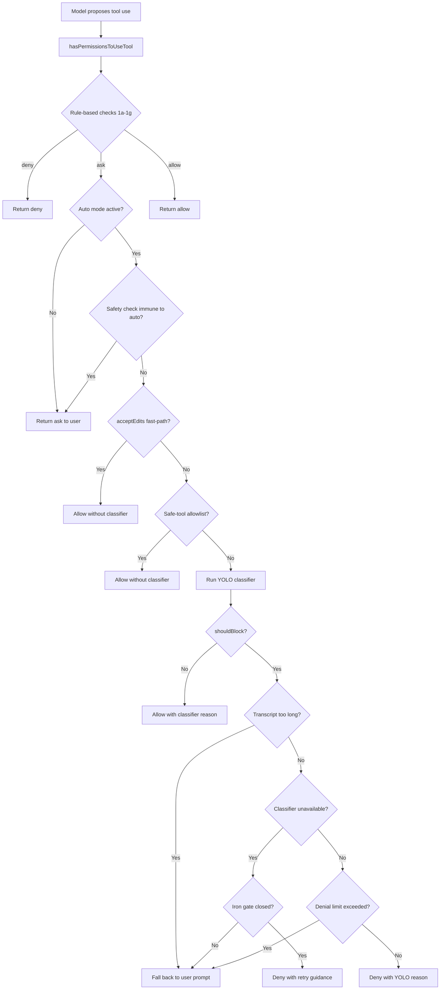
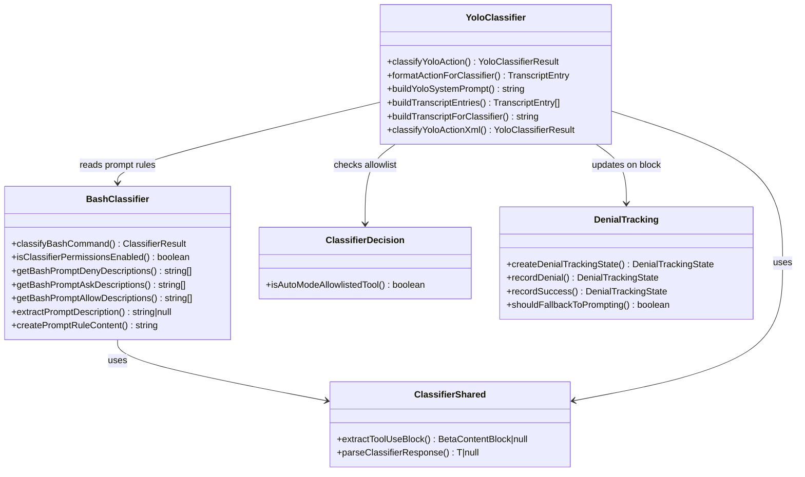

# Bash Classifier and YOLO Scoring

## Overview

Every time the model proposes a bash command, cc must decide whether to execute it, ask the user, or deny it outright. This decision is not made by a single gate but by a layered pipeline of deterministic and probabilistic classifiers. At the foundation sits the bash classifier -- a function that maps a command string to a risk band (safe, risky, destructive) and a confidence level. Above it rides the YOLO scorer, a model-based heuristic that evaluates tool actions against the full conversation transcript in auto mode. Together they form the two-tier classification system that integrates with cc's broader permission model.

The bash classifier lives in `src/utils/permissions/bashClassifier.ts` and operates as a deterministic pre-filter: it checks prompt-based rules (`Bash(prompt: ...)`) using a secondary model call, returning a `ClassifierResult` with a confidence field. The YOLO scorer, implemented in `src/utils/permissions/yoloClassifier.ts`, is a more heavyweight system that feeds the entire conversation transcript to a classifier model (typically the same model running the main loop) and asks it to decide whether the proposed action should be blocked or allowed. The YOLO scorer only activates in auto mode, where no human is in the loop to approve commands interactively.

The terminology registry defines a **classifier** as "a function that maps a bash command string to a risk band (safe, risky, destructive) to determine whether automatic approval is appropriate." This chapter traces how that abstract definition is realized in code, how the YOLO scorer extends it with transcript context, and how both plug into the permission pipeline examined in Chapter 32.

The interaction between these two classifiers reveals a fundamental design tension in agentic systems: deterministic rules are fast and auditable but cannot handle semantic ambiguity, while LLM-based classifiers can reason about intent but are probabilistic and manipulable. cc resolves this tension by making deterministic checks authoritative (they always run first and cannot be overridden by the classifier) and the LLM classifier advisory (it short-circuits user prompting but falls back to human review on repeated denials). This layered approach implements the defense-in-depth principle identified in HER section 12.4, where deterministic validation handles security-critical decisions and LLM judgment serves as a latency optimization for non-critical paths.

It is worth understanding why two classifiers exist rather than one. The bash classifier is narrow: it evaluates a single command string against a list of prompt-based descriptions (e.g., "install packages safely", "never run curl piped to bash"). It cannot see the conversation context, so it cannot determine whether a `rm` command is dangerous in context (deleting build artifacts) or genuinely destructive (removing source files). The YOLO scorer, by contrast, sees the full transcript and can distinguish between these cases -- but at the cost of a model API call on every tool use. The bash classifier fills the gap for non-auto-mode sessions where the YOLO scorer is inactive, providing a lightweight semantic check that prompt-based rules alone cannot achieve. The two systems are complementary: the bash classifier handles per-command risk in interactive sessions, while the YOLO scorer handles transcript-aware risk in autonomous sessions.

The permission modes described in Chapter 32 determine which classifier (if any) is active. In `default` mode, neither classifier runs automatically -- the user approves every action. In `acceptEdits` mode, the acceptEdits fast-path (described below) short-circuits most file operations. In `auto` mode, the YOLO scorer handles all classification. The bash classifier runs only in modes where prompt-based rules exist and auto mode is not active. This mode-dependent activation means the classifiers are not competing for the same decisions -- they serve different operational contexts.

## Data structures and contracts

The bash classifier exports a small but carefully shaped type surface. The primary return type is `ClassifierResult`, which captures both the decision and the rationale:

```typescript
// src/utils/permissions/bashClassifier.ts:L5-L10 — ClassifierResult type
export type ClassifierResult = {
  matches: boolean
  matchedDescription?: string
  confidence: 'high' | 'medium' | 'low'
  reason: string
}
```

The `matches` field indicates whether the command matched a classifier rule; `confidence` is a three-level signal that downstream code uses to gate auto-approval. Only `high`-confidence matches trigger automatic decisions -- medium and low confidence fall through to user prompting. The `matchedDescription` field carries the human-readable description of the matched prompt rule, which surfaces in denial messages and analytics. The `reason` field provides a textual explanation that gets logged for internal analysis via `logClassifierResultForAnts` at `src/tools/BashTool/bashPermissions.ts:L117-L144`.

The classifier also defines a `ClassifierBehavior` type that governs which prompt-rule set is being evaluated:

```typescript
// src/utils/permissions/bashClassifier.ts:L12-L12 — ClassifierBehavior type
export type ClassifierBehavior = 'deny' | 'ask' | 'allow'
```

This tri-valued behavior mirrors the permission model's `PermissionBehavior` (allow, deny, ask) but is scoped to classifier-specific prompt rules. When the classifier evaluates deny descriptions, it returns a result with `ClassifierBehavior = 'deny'`; when evaluating allow descriptions, it returns `'allow'`. The parallel evaluation of deny and ask classifiers (described in the Control flow section below) relies on this distinction to establish precedence: deny always wins over ask when both match.

The stub nature of the external build is significant. The file opens with a comment: `// Stub for external builds - classifier permissions feature is ANT-ONLY` (`src/utils/permissions/bashClassifier.ts:L1`). Every function returns a no-op result: `classifyBashCommand` always returns `{ matches: false, confidence: 'high', reason: 'This feature is disabled' }`, `isClassifierPermissionsEnabled` returns `false`, and the description-extraction functions return empty arrays. The actual implementation lives behind a build-time feature flag (`TRANSCRIPT_CLASSIFIER`) and is compiled out for external distributions. This means the open-source codebase contains only the type definitions and contract signatures, not the runtime logic.

The bash classifier also exports helper functions for constructing and extracting prompt rules. The `PROMPT_PREFIX` constant at `src/utils/permissions/bashClassifier.ts:L3` defines the `'prompt:'` prefix that distinguishes semantic prompt rules from structural prefix rules in the permission system. When a user adds a rule like `Bash(prompt: install packages safely)`, the `createPromptRuleContent` function wraps it as `'prompt: install packages safely'`, and `extractPromptDescription` reverses the transformation to recover the description for classifier evaluation.

The YOLO scorer defines a richer type surface. Its central return type is `YoloClassifierResult`, defined in `src/types/permissions.ts` rather than inline, containing fields for `shouldBlock`, `reason`, `model`, `usage`, `durationMs`, `promptLengths`, and optional two-stage metadata (`stage1Usage`, `stage2Usage`, etc.). The scorer also defines its own response schema:

```typescript
// src/utils/permissions/yoloClassifier.ts:L252-L258 — YOLO classifier response schema
const yoloClassifierResponseSchema = lazySchema(() =>
  z.object({
    thinking: z.string(),
    shouldBlock: z.boolean(),
    reason: z.string(),
  }),
)
```

The `shouldBlock` boolean is the decisive output -- true means the action must be denied, false means it may proceed. The `thinking` field captures the model's chain-of-thought reasoning, which is preserved in the result for telemetry but not exposed to the agent. The `reason` field is a human-readable explanation that gets embedded in the denial message shown to the model via `buildYoloRejectionMessage` at `src/utils/messages.ts:L267-L282`.

A key architectural type is the `TranscriptEntry`, which represents a single turn in the compact transcript format the classifier consumes:

```typescript
// src/utils/permissions/yoloClassifier.ts:L287-L294 — TranscriptEntry type
type TranscriptBlock =
  | { type: 'text'; text: string }
  | { type: 'tool_use'; name: string; input: unknown }

export type TranscriptEntry = {
  role: 'user' | 'assistant'
  content: TranscriptBlock[]
}
```

The classifier never sees raw `Message` objects. Instead, `buildTranscriptEntries` at `src/utils/permissions/yoloClassifier.ts:L302-L360` filters and projects the full message history into this compact form, keeping only user text messages and assistant tool_use blocks. Assistant text is deliberately excluded because model-authored prose could be crafted to influence the classifier's decision -- a direct mitigation of the indirect prompt injection threat identified in HER section 12.4. The function also extracts queued user commands from attachment messages, ensuring that user intent expressed through `queued_command` attachments is visible to the classifier.

The `AutoModeRules` type at `src/utils/permissions/yoloClassifier.ts:L85-L89` defines the user-configurable sections of the classifier prompt:

```typescript
// src/utils/permissions/yoloClassifier.ts:L85-L89 — AutoModeRules type
export type AutoModeRules = {
  allow: string[]
  soft_deny: string[]
  environment: string[]
}
```

These three arrays map to the `<user_allow_rules_to_replace>`, `<user_deny_rules_to_replace>`, and `<user_environment_to_replace>` template tags in the classifier's system prompt. The `_to_replace` naming convention signals that user-provided values replace (not append to) the template defaults in the external permissions template, while in the Anthropic-internal template the user values are additive. This distinction is implemented in `buildYoloSystemPrompt` at `src/utils/permissions/yoloClassifier.ts:L484-L540`.

## Control flow

The classification pipeline has two distinct flows that converge at the permission decision point. The bash classifier flow handles per-command risk assessment for prompt-based rules. The YOLO scorer flow handles transcript-level security decisions in auto mode. Both are invoked from `hasPermissionsToUseTool` in `src/utils/permissions/permissions.ts`.



### Bash classifier integration

The bash classifier integrates at an earlier stage in the pipeline than the YOLO scorer. When `bashToolHasPermission` in `src/tools/BashTool/bashPermissions.ts` evaluates a bash command, it checks whether the classifier is enabled before running prompt-based deny and ask evaluations:

```typescript
// src/tools/BashTool/bashPermissions.ts:L1859-L1871 — Bash classifier deny/ask check
if (
  isClassifierPermissionsEnabled() &&
  !(
    feature('TRANSCRIPT_CLASSIFIER') &&
    appState.toolPermissionContext.mode === 'auto'
  )
) {
  const denyDescriptions = getBashPromptDenyDescriptions(
    appState.toolPermissionContext,
  )
  const askDescriptions = getBashPromptAskDescriptions(
    appState.toolPermissionContext,
  )
  const hasDeny = denyDescriptions.length > 0
  const hasAsk = askDescriptions.length > 0
```

This block runs the bash classifier only when prompt-based rules exist and the session is not in auto mode (auto mode delegates all classification to the YOLO scorer). When both deny and ask descriptions are present, the classifiers run in parallel via `Promise.all` at `src/tools/BashTool/bashPermissions.ts:L1876-L1897`. Deny takes precedence: if the deny classifier returns a high-confidence match, the command is blocked immediately regardless of the ask classifier's result. If the deny classifier does not match but the ask classifier does, the command is escalated to a user prompt with the matched description included in the reason text.

The bash classifier also supports asynchronous allow checks that run in parallel with the user permission dialog. When a command would normally require user approval (passthrough or ask behavior), the system attaches a `pendingClassifierCheck` via `buildPendingClassifierCheck` at `src/tools/BashTool/bashPermissions.ts:L1459-L1481`. This metadata contains the command, working directory, and allow descriptions. The `executeAsyncClassifierCheck` function at `src/tools/BashTool/bashPermissions.ts:L1605-L1658` runs the allow classifier in the background and auto-approves the command if the classifier returns a high-confidence match before the user interacts with the dialog.

The speculative classifier mechanism at `src/tools/BashTool/bashPermissions.ts:L1483-L1545` takes this further by starting the classifier API call before the permission dialog is even constructed. The `startSpeculativeClassifierCheck` function fires the `classifyBashCommand` call and stores the resulting promise in a `Map<string, Promise<ClassifierResult>>`. The `consumeSpeculativeClassifierCheck` function retrieves and removes the promise later. This pattern means the classifier latency overlaps with pre-tool hook execution and deny/ask classifier evaluation, reducing the total wall-clock time before a decision is reached.

### YOLO scorer pipeline

The YOLO scorer activates later in the pipeline, inside `hasPermissionsToUseTool` at `src/utils/permissions/permissions.ts:L520-L527`. It only runs when the tool's own `checkPermissions` returned `ask` and the session is in auto mode. Before invoking the classifier, several gates and fast-path checks can skip the expensive API call.

The first gate is the safety-check immunity test at `src/utils/permissions/permissions.ts:L532-L548`. When a `checkPermissions` result has `decisionReason.type === 'safetyCheck'` and `classifierApprovable` is not set, the result is immune to all auto-approve paths -- including the classifier. This ensures that safety-critical checks (protected paths like `.git/`, `.claude/`, `.vscode/`, shell configurations) cannot be silently bypassed by the classifier, even in auto mode. The `classifierApprovable` flag exists because some safety checks (sensitive-file paths) are appropriate for the classifier to evaluate, while others (structural protections) are not.

The second gate is the `requiresUserInteraction` check at `src/utils/permissions/permissions.ts:L549-L551`. Some tools inherently require user interaction (e.g., `AskUserQuestionTool`). These tools bypass the classifier entirely, even in auto mode, because their purpose is to communicate with the user.

The acceptEdits fast-path at `src/utils/permissions/permissions.ts:L600-L656` re-runs the tool's `checkPermissions` with the mode set to `acceptEdits`. If that returns `allow`, the action is approved without calling the classifier. This optimization avoids spending classifier tokens on operations like file edits within the working directory, which are safe under acceptEdits rules. The `AgentTool` and `REPLTool` are explicitly excluded from this fast path at `src/utils/permissions/permissions.ts:L602-L604` because their `checkPermissions` would return `allow` in acceptEdits mode, but REPL code can contain VM escapes between inner tool calls and the classifier must see the full JavaScript context.

The safe-tool allowlist in `src/utils/permissions/classifierDecision.ts:L56-L94` enumerates tools that are inherently safe:

```typescript
// src/utils/permissions/classifierDecision.ts:L56-L65 — Safe tool allowlist
const SAFE_YOLO_ALLOWLISTED_TOOLS = new Set([
  // Read-only file operations
  FILE_READ_TOOL_NAME,
  // Search / read-only
  GREP_TOOL_NAME,
  GLOB_TOOL_NAME,
  LSP_TOOL_NAME,
  TOOL_SEARCH_TOOL_NAME,
  LIST_MCP_RESOURCES_TOOL_NAME,
  'ReadMcpResourceTool',
  // Task management (metadata only)
  TODO_WRITE_TOOL_NAME,
  TASK_CREATE_TOOL_NAME,
  TASK_GET_TOOL_NAME,
  TASK_UPDATE_TOOL_NAME,
  TASK_LIST_TOOL_NAME,
  TASK_STOP_TOOL_NAME,
  TASK_OUTPUT_TOOL_NAME,
```

Tools on this list are allowed immediately without classifier consultation. The list excludes write and edit tools, which are handled by the acceptEdits fast-path (allowed in CWD, classified outside CWD).

When all fast paths are exhausted, the YOLO classifier runs via `classifyYoloAction` at `src/utils/permissions/yoloClassifier.ts:L1012-L1018`:

```typescript
// src/utils/permissions/yoloClassifier.ts:L1012-L1018 — classifyYoloAction entry
export async function classifyYoloAction(
  messages: Message[],
  action: TranscriptEntry,
  tools: Tools,
  context: ToolPermissionContext,
  signal: AbortSignal,
): Promise<YoloClassifierResult> {
```

The function receives the full message history, the proposed action as a `TranscriptEntry`, the tool registry, and the permission context. It builds a compact transcript using `buildTranscriptEntries`, constructs the system prompt by merging the base prompt with permission templates and user allow/deny rules via `buildYoloSystemPrompt`, and dispatches to the classifier model via `sideQuery`.

### Two-stage XML classifier

The two-stage XML classifier adds a crucial optimization. When enabled (via GrowthBook flag `tengu_auto_mode_config.twoStageClassifier` or environment variable `CLAUDE_CODE_TWO_STAGE_CLASSIFIER`), the classifier runs in two stages: a fast stage with `max_tokens=64` and stop sequences that nudge an immediate `<block>yes</block>` or `<block>no</block>` response, and a thinking stage with `max_tokens=4096` that includes chain-of-thought reasoning. If stage 1 returns "allow," the action proceeds without waiting for stage 2. If stage 1 returns "block," stage 2 runs to reduce false positives.

```typescript
// src/utils/permissions/yoloClassifier.ts:L769-L794 — Stage 1 fast classifier
if (mode !== 'thinking') {
  const stage1Start = Date.now()
  const stage1Content = [
    ...wrappedContent,
    { type: 'text' as const, text: XML_S1_SUFFIX },
  ]
  stage1Opts = {
    model,
    max_tokens: (mode === 'fast' ? 256 : 64) + thinkingPadding,
    system: systemBlocks,
    skipSystemPromptPrefix: true,
    temperature: 0,
    thinking: disableThinking,
    messages: [
      ...prefixMessages,
      { role: 'user' as const, content: stage1Content },
    ],
    maxRetries: getDefaultMaxRetries(),
    signal,
    ...(mode !== 'fast' && { stop_sequences: ['</block>'] }),
    querySource: 'auto_mode',
  }
```

Stage 1 uses `temperature: 0` for deterministic responses and a stop sequence of `</block>` to truncate the response as soon as the block decision is emitted. The `XML_S1_SUFFIX` at `src/utils/permissions/yoloClassifier.ts:L550` appends `'Err on the side of blocking. <block> immediately.'` to bias toward blocking on uncertainty. This bias is intentional: false positives (blocking a safe action) are recovered by stage 2, while false negatives (allowing a dangerous action) have no such recovery path.

Stage 2 appends `XML_S2_SUFFIX` at `src/utils/permissions/yoloClassifier.ts:L560-L561`, which asks the model to "Review the classification process and follow it carefully, making sure you deny actions that should be blocked." The stage 2 response includes `<thinking>` and `<reason>` tags in addition to `<block>`, providing a richer audit trail. The `parseXmlBlock` function at `src/utils/permissions/yoloClassifier.ts:L578-L584` strips thinking content before parsing to prevent model reasoning from being misinterpreted as decision tags.

The `getClassifierThinkingConfig` function at `src/utils/permissions/yoloClassifier.ts:L683-L693` handles a subtle model compatibility issue. Models with `alwaysOnThinking` enabled reject the `thinking: { type: 'disabled' }` parameter with a 400 error. For these models, the function returns `undefined` for the thinking disable flag and adds 2048 tokens of headroom to `max_tokens`, ensuring adaptive thinking does not exhaust the budget before the `<block>` tag is emitted.

### Denial tracking

The denial tracking mechanism provides a safety net for repeated classifier blocks. When the YOLO classifier blocks an action, the denial state is updated and checked against limits:

```typescript
// src/utils/permissions/denialTracking.ts:L7-L15 — Denial tracking limits
export type DenialTrackingState = {
  consecutiveDenials: number
  totalDenials: number
}

export const DENIAL_LIMITS = {
  maxConsecutive: 3,
  maxTotal: 20,
} as const
```

After 3 consecutive denials or 20 total denials in a session, `shouldFallbackToPrompting` at `src/utils/permissions/denialTracking.ts:L40-L44` returns true and the system falls back to interactive user prompting, preventing an infinite loop of classifier blocks. The `handleDenialLimitExceeded` function at `src/utils/permissions/permissions.ts:L984-L1058` constructs an `ask` result with the classifier's reason and a warning message indicating how many actions were blocked. In headless mode, hitting the denial limit throws an `AbortError` since there is no user to prompt.

The `recordSuccess` function at `src/utils/permissions/denialTracking.ts:L32-L38` resets `consecutiveDenials` to 0 on any allowed tool use, even one auto-allowed by rules. This ensures that a single successful action breaks the consecutive denial streak. The `totalDenials` counter is never reset (it tracks cumulative blocks for the session), while `consecutiveDenials` tracks the current streak.



## Edge cases and failure modes

**Classifier unavailable (fail-closed vs. fail-open)**: When the classifier API returns an error (429, 500, network timeout), the result has `unavailable: true`. The behavior depends on the `tengu_iron_gate_closed` GrowthBook flag, checked at `src/utils/permissions/permissions.ts:L847-L876`. When the gate is closed (default), unavailable classifiers cause a deny with retry guidance via `buildClassifierUnavailableMessage` at `src/utils/messages.ts:L288-L298`. When open, the system falls back to interactive prompting. The 30-minute cache TTL (`CLASSIFIER_FAIL_CLOSED_REFRESH_MS` at `src/utils/permissions/permissions.ts:L107`) means a temporary API outage does not permanently lock the session. The fail-closed default is a security-critical choice: an unavailable classifier should not silently approve actions.

**Transcript too long**: As conversations grow, the classifier transcript can exceed the model's context window. The `detectPromptTooLong` function at `src/utils/permissions/yoloClassifier.ts:L1463-L1471` parses the API error message to extract actual and limit token counts. When this occurs in interactive mode, the system falls back to manual prompting since the condition is permanent (transcripts only grow). In headless mode, an `AbortError` is thrown at `src/utils/permissions/permissions.ts:L826-L828`. The `dumpErrorPrompts` function at `src/utils/permissions/yoloClassifier.ts:L213-L250` writes the full classifier input to a session-scoped file in the claude temp directory, enabling post-hoc diagnosis of projection divergence (classifier tokens growing faster than main-loop tokens).

**Speculative classifier checks**: The bash classifier supports speculative execution via `startSpeculativeClassifierCheck` at `src/tools/BashTool/bashPermissions.ts:L1497-L1527`. This fires the classifier API call in parallel with other permission work (pre-tool hooks, deny/ask classifiers, UI setup). The result is consumed later by `consumeSpeculativeClassifierCheck` at `src/tools/BashTool/bashPermissions.ts:L1533-L1541`. If the user approves or denies before the classifier returns, the speculative result is discarded. The `speculativeChecks` Map at `src/tools/BashTool/bashPermissions.ts:L1483` is keyed by command string, which means identical commands reuse the same speculative promise. The `promise.catch(() => {})` at `src/tools/BashTool/bashPermissions.ts:L1524` prevents unhandled rejection when the abort signal fires before the promise is consumed.

**Safe wrapper stripping attacks**: The `stripSafeWrappers` function at `src/tools/BashTool/bashPermissions.ts:L524-L615` removes prefix commands like `timeout`, `nice`, `nohup`, and safe environment variables before rule matching. The security boundary is critical: the function uses `[ \t]+` rather than `\s+` because `\s` matches newlines, which are command separators in bash. Matching across a newline would strip the wrapper from one line and leave a different command on the next line. The `SAFE_ENV_VARS` whitelist at `src/tools/BashTool/bashPermissions.ts:L378-L430` explicitly excludes `PATH`, `LD_PRELOAD`, `NODE_OPTIONS`, and other execution-affecting variables. For deny rules, the system uses `stripAllLeadingEnvVars` at `src/tools/BashTool/bashPermissions.ts:L733-L776`, which strips all env vars regardless of the safe-list. This prevents bypass via `FOO=bar denied_command` where `FOO` is not in the safe-list. The two functions apply a fixed-point iteration to handle interleaved patterns like `nohup FOO=bar timeout 5 claude` where wrapper stripping and env var stripping must alternate.

**Compound command bypass**: Prefix rules like `Bash(cd:*)` must not match compound commands like `cd /path && python3 evil.py`. The `filterRulesByContentsMatchingInput` function at `src/tools/BashTool/bashPermissions.ts:L778-L935` re-splits compound commands and rejects prefix matches when `splitCommand(cmd).length > 1`. This guard exists because shell escaping can defeat the first split pass -- e.g., `cd src\&\& python3 hello.py` parses as a single subcommand in the initial split. The word-boundary enforcement at `src/tools/BashTool/bashPermissions.ts:L896-L901` ensures `ls:*` does not match `lsof` or `lsattr` by requiring the prefix to be followed by a space or end-of-string.

**Two-stage classifier false positive reduction**: Stage 1 is biased toward blocking (suffix says "Err on the side of blocking"). This produces false positives that stage 2 resolves with chain-of-thought reasoning. The two-stage design means safe actions pay the latency of only stage 1, while blocked actions pay both stages but benefit from reduced false positive rates. The `replaceOutputFormatWithXml` function at `src/utils/permissions/yoloClassifier.ts:L648-L664` replaces the tool_use output instruction with XML output tags, which are simpler for the model to emit at low token counts.

**Zsh and PowerShell attack vectors**: The bash security module at `src/tools/BashTool/bashSecurity.ts:L45-L74` blocks Zsh-specific dangers like `zmodload`, process substitution (`<()`, `>()`), and equals expansion (`=cmd`). PowerShell deny guidance is appended to the YOLO classifier's deny rules when `POWERSHELL_AUTO_MODE` is enabled, mapping PowerShell idioms like `iex (iwr ...)` and `Remove-Item -Recurse -Force` to the classifier's existing block categories. This guidance is defined at `src/utils/permissions/yoloClassifier.ts:L1402-L1411` and guarded by a DCE-safe feature check so the string content is absent from external builds.

**Empty classifier input**: Some tools declare no security-relevant input via `toAutoClassifierInput` returning `''`. The check at `src/utils/permissions/yoloClassifier.ts:L1023-L1029` short-circuits these cases, returning `{ shouldBlock: false, reason: 'Tool declares no classifier-relevant input' }` without making an API call. Without this guard, the empty action block plus `cache_control` would trigger an API 400 error.

**Malformed tool input in transcript**: The `toCompactBlock` function at `src/utils/permissions/yoloClassifier.ts:L384-L424` handles the case where historical tool_use blocks contain unvalidated model output. A tool_use rejected for bad parameters (e.g., an array emitted as a JSON string) still lands in the transcript. The function wraps each `tool.toAutoClassifierInput` call in a try-catch at `src/utils/permissions/yoloClassifier.ts:L399-L410` and falls back to the raw input object on failure, logging the error for internal analysis. This defensive coding prevents a single malformed historical tool call from crashing the entire classifier pipeline.

**PowerShell in auto mode**: When `POWERSHELL_AUTO_MODE` is not enabled, PowerShell commands are excluded from the classifier entirely at `src/utils/permissions/permissions.ts:L572-L591`. The `POWERSHELL_AUTO_MODE` feature flag gates whether PowerShell commands flow through the classifier like Bash. When disabled, PowerShell requires explicit user permission in auto mode because its idioms (`iex`, `Invoke-Expression`, `Start-Process`) are harder for the classifier to evaluate without specific guidance. When enabled, the `POWERSHELL_DENY_GUIDANCE` at `src/utils/permissions/yoloClassifier.ts:L1402-L1411` is appended to the deny list so the classifier recognizes PowerShell-specific attack patterns.

**Bun DCE complexity cliff**: The `bashToolHasPermission` function in `src/tools/BashTool/bashPermissions.ts` is tightly constrained by Bun's dead-code elimination complexity budget. Multiple comments throughout the file (e.g., at `src/tools/BashTool/bashPermissions.ts:L81-L88`) warn that adding too many import aliases or inline logic can push the function over Bun's threshold, causing `feature('BASH_CLASSIFIER')` to evaluate incorrectly and silently drop `pendingClassifierCheck` spreads. This constraint has led to several helper functions being extracted (e.g., `filterCdCwdSubcommands`, `checkEarlyExitDeny`, `checkSemanticsDeny`) to keep the main function under the complexity limit.

## Where cc diverges from the published pattern

HER section 10 identifies "Command Risk Classification: Deterministic pre-parsing and per-tool permission gating" as a core harness pattern. The implementation diverges from this description in three ways.

First, the published pattern implies a single deterministic classifier. cc uses two classifiers operating at different levels of abstraction: the bash classifier evaluates individual commands against prompt-based rules, while the YOLO scorer evaluates tool actions against the full conversation transcript. The YOLO scorer is explicitly probabilistic -- it uses a language model, not deterministic rules -- which the HER pattern does not account for. The two classifiers are also non-overlapping in their activation conditions: the bash classifier runs only when prompt-based rules exist and the session is not in auto mode, while the YOLO scorer runs only in auto mode after deterministic checks return `ask`.

Second, the published pattern treats classification as a standalone security boundary. In cc, classification is an optimization layer that short-circuits the user prompt, not a substitute for it. The denial tracking mechanism at `src/utils/permissions/denialTracking.ts:L40-L44` ensures that repeated classifier blocks fall back to human review. The `shouldFallbackToPrompting` function overrides the classifier's decision after 3 consecutive or 20 total denials, treating classification as advisory rather than authoritative. The safety-check immunity at `src/utils/permissions/permissions.ts:L532-L548` further constrains the classifier by making certain `safetyCheck` results immune to all auto-approve paths.

Third, the bash classifier stub at `src/utils/permissions/bashClassifier.ts:L1` reveals that prompt-based classification is ANT-only. External builds get a no-op classifier that never matches and never auto-approves. The YOLO scorer's `TRANSCRIPT_CLASSIFIER` feature flag similarly gates auto mode. This means the published pattern's "deterministic pre-parsing" is not available to most users of the open-source codebase -- it is an internal-only feature. The `auto` permission mode itself is excluded from `ExternalPermissionMode` at `src/utils/permissions/PermissionMode.ts:L97-L105`, where `isExternalPermissionMode` always returns `true` for non-ant users because they cannot have `auto` or `bubble` modes.

HER section 12.4 identifies indirect prompt injection as a critical threat for agent systems, recommending "deterministic validation (not LLM judgment) for security-critical decisions." cc's YOLO scorer violates this recommendation by using LLM judgment for security-critical auto-approval decisions. The mitigation is defense-in-depth: the classifier sits behind deterministic rule-based checks (deny rules, safety checks for protected paths, and the acceptEdits fast-path), so the LLM classifier only runs on actions that passed all deterministic gates. The transcript filtering in `buildTranscriptEntries` -- excluding model-authored text and keeping only tool_use blocks -- further mitigates injection risk by preventing the model from embedding adversarial instructions in its own reasoning that the classifier would then read.

## Developer takeaways for building a long-running agent

Building a classification system for a long-running agent requires careful attention to the interaction between deterministic and probabilistic decision-making. The key lesson from cc's implementation is that LLM-based classifiers should be treated as an optimization layer, not a security boundary. Deterministic rules (deny rules, path constraints, safety checks) must run first and must be immune to classifier override. The YOLO scorer only sees actions that passed every deterministic gate, and even then, its decisions are subject to denial limits that fall back to human review. The two-stage classifier design is worth studying: stage 1 is fast and biased toward blocking, which means safe actions get approved quickly while suspicious actions pay the latency cost of a second, more careful evaluation. For transcript management, compact representations (tool_use blocks only, excluding model-authored text) prevent the classifier from being influenced by adversarial content in its own context window -- a direct mitigation for indirect prompt injection. Finally, the speculative execution pattern (firing the classifier in parallel with other permission work) reduces perceived latency without compromising safety, since the speculative result is only consumed if no other decision has been made.
