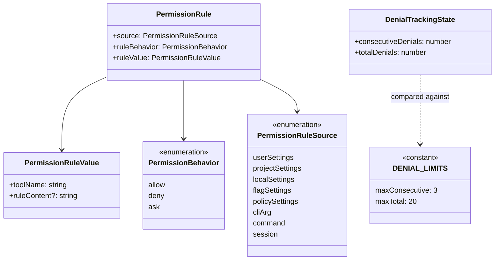
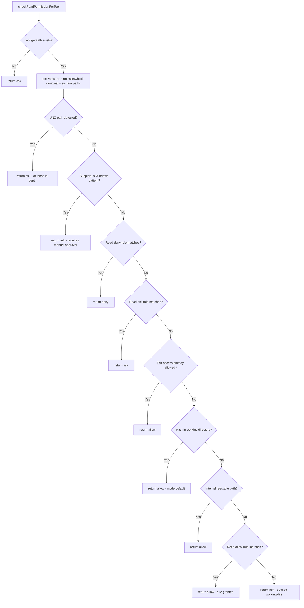

# Filesystem Permissions and Path Guards

## Overview

Every tool invocation in cc that touches the filesystem passes through a layered permission system before any I/O occurs. The two files at the center of this system---`src/utils/permissions/filesystem.ts` at 1777 lines and `src/utils/permissions/denialTracking.ts` at 45 lines---implement a defense-in-depth model that combines rule-based access control, path-based guards, case-normalization defenses, and rate-limited denial tracking. The filesystem permission module answers a single question for each tool call: should this read or write proceed, be denied outright, or be escalated to a human? The denial tracker then monitors how often the answer is "no," and forces a human review when the agent appears stuck in a denial loop.

The design reflects the HER guardrail principle from Section 12.4: agents can exfiltrate data or execute malicious code through filesystem operations, so every path must be validated against a set of dangerous patterns before the operation is allowed to proceed silently. The threat model is explicit: "Agent sends sensitive data to external services via tool calls," and the mitigations include "monitor tool call parameters for sensitive data patterns; require human approval for external communications." At the same time, the HER human-in-the-loop pattern from Section 11 requires that the system know when to stop auto-deny chains and surface the decision to a person. The denial tracker with its consecutive and total limits is the mechanism that implements this escalation.

The filesystem permission module sits at the boundary between the tool dispatch pipeline and the operating system. When a tool like FileEditTool, FileReadTool, or FileWriteTool is about to perform an I/O operation, it calls into `checkReadPermissionForTool` or `checkWritePermissionForTool` before proceeding. These functions examine the target path through multiple lenses: is it a dangerous file? Does it resolve through a symlink to a protected location? Does it contain Windows canonicalization patterns that could bypass string-matching guards? Is it inside or outside the working directory? Does an explicit rule grant or deny access? Only after all these checks pass does the function return `'allow'`, and even then, the permission mode (see the `permission mode` entry in the terminology registry) may override the decision.

## Data structures and contracts

The permission system rests on three type hierarchies: the rule types that govern access, the decision types that result from checking those rules, and the denial tracking state that monitors classifier rejection patterns.

The `PermissionRule` type is the fundamental unit of access control:

```typescript
// src/types/permissions.ts:L75-L79 — PermissionRule composite type
export type PermissionRule = {
  source: PermissionRuleSource
  ruleBehavior: PermissionBehavior
  ruleValue: PermissionRuleValue
}
```

Each rule carries its origin (`PermissionRuleSource`), which can be `userSettings`, `projectSettings`, `localSettings`, `flagSettings`, `policySettings`, `cliArg`, `command`, or `session` (`src/types/permissions.ts:L54-L62`). The source determines the rule's precedence and persistence: `session` rules last only for the current session, while `userSettings` rules persist across sessions. The `ruleBehavior` field is one of `'allow'`, `'deny'`, or `'ask'` (`src/types/permissions.ts:L44`). The `ruleValue` pairs a `toolName` string with an optional `ruleContent` that provides path-pattern specificity (`src/types/permissions.ts:L67-L70`). A rule like `Edit(.env)` has `toolName: "Edit"` and `ruleContent: ".env"`, while a bare `Edit` rule has no `ruleContent` and matches all edit operations for that tool.

The filesystem module defines two constant arrays that guard against auto-editing sensitive paths:

```typescript
// src/utils/permissions/filesystem.ts:L57-L79 — Dangerous file and directory lists
export const DANGEROUS_FILES = [
  '.gitconfig',
  '.gitmodules',
  '.bashrc',
  '.bash_profile',
  '.zshrc',
  '.zprofile',
  '.profile',
  '.ripgreprc',
  '.mcp.json',
  '.claude.json',
] as const

export const DANGEROUS_DIRECTORIES = [
  '.git',
  '.vscode',
  '.idea',
  '.claude',
] as const
```

These lists protect shell startup scripts, git configuration, IDE settings, and cc's own configuration from being silently modified. The `.claude` directory is included because it contains `settings.json`, hooks, and agent definitions---all vectors for privilege escalation if auto-edited without human review. The `.mcp.json` and `.claude.json` entries in `DANGEROUS_FILES` protect MCP server configuration, which could be modified to route tool calls through an attacker-controlled server. The `.ripgreprc` entry prevents an agent from modifying ripgrep's configuration to alter search behavior or exclude files from results.

The denial tracking contract is minimal and immutable:

```typescript
// src/utils/permissions/denialTracking.ts:L7-L15 — Denial tracking state and limits
export type DenialTrackingState = {
  consecutiveDenials: number
  totalDenials: number
}

export const DENIAL_LIMITS = {
  maxConsecutive: 3,
  maxTotal: 20,
} as const
```

The `consecutiveDenials` counter resets to zero on any success, while `totalDenials` only accumulates upward during a session. The limits---3 consecutive or 20 total---are the thresholds at which the system stops auto-denying and falls back to prompting the user. These values represent a balance: three consecutive denials likely indicate the agent is looping on a fundamentally disallowed action, while twenty total denials suggest the session has drifted into territory the classifier cannot safely navigate. The `as const` assertion ensures these values are treated as literal types, preventing accidental modification.

The following class diagram shows how these types relate:



## Control flow

### Read permission check

The `checkReadPermissionForTool` function implements an eight-step decision pipeline. Each step either returns a terminal decision or falls through to the next step. The ordering is security-critical: deny checks precede allow checks, and defense-in-depth checks (UNC paths, Windows patterns) come first.

```typescript
// src/utils/permissions/filesystem.ts:L1030-L1064 — Read permission check opening steps
export function checkReadPermissionForTool(
  tool: Tool,
  input: { [key: string]: unknown },
  toolPermissionContext: ToolPermissionContext,
): PermissionDecision {
  if (typeof tool.getPath !== 'function') {
    return {
      behavior: 'ask',
      message: `Claude requested permissions to use ${tool.name}, but you haven't granted it yet.`,
    }
  }
  const path = tool.getPath(input)
  const pathsToCheck = getPathsForPermissionCheck(path)

  // 1. Defense-in-depth: Block UNC paths early (before other checks)
  for (const pathToCheck of pathsToCheck) {
    if (pathToCheck.startsWith('\\\\') || pathToCheck.startsWith('//')) {
      return {
        behavior: 'ask',
        message: `Claude requested permissions to read from ${path}, which appears to be a UNC path that could access network resources.`,
        decisionReason: {
          type: 'other',
          reason: 'UNC path detected (defense-in-depth check)',
        },
      }
    }
  }
```

The `pathsToCheck` array produced by `getPathsForPermissionCheck` contains both the original path and any symlink-resolved alternatives. This is a critical design choice: without resolving symlinks, an attacker could create a symlink from a permitted path to a protected target (e.g., `ln -s /etc/passwd ./allowed-dir/link`) and bypass the working-directory check. Every subsequent step iterates over all resolved paths, and a denial on any resolved path blocks the operation. The performance impact is addressed by computing `pathsToCheck` once and threading it through the entire check chain---the comment on step 5 notes that this avoids "redundant existsSync/lstatSync/realpathSync syscalls on the same path (previously 6 = 30 syscalls per Read permission check)" (`src/utils/permissions/filesystem.ts:L1046-L1047`).

After UNC and Windows-pattern checks (steps 1-2), the function checks read-specific deny rules (step 3), then read-specific ask rules (step 4). The comment on step 3 is explicit: "This must come before any allow checks (including 'edit access implies read access') to prevent bypassing explicit read deny rules" (`src/utils/permissions/filesystem.ts:L1082-L1083`). Step 5 is the "edit implies read" shortcut---if write access is already granted, read access follows. Step 6 allows reads within working directories. Step 7 checks internal harness paths (session memory, plan files, tool results). Step 8 checks allow rules. The default at the end is `'ask'`, with a `decisionReason` of `{ type: 'workingDir', reason: 'Path is outside allowed working directories' }` (`src/utils/permissions/filesystem.ts:L1190-L1192`).

### Write permission check

The write path is more involved because it must handle dangerous-file protection, session-scoped `.claude/` overrides, and the `acceptEdits` permission mode. The `checkWritePermissionForTool` function begins with deny-rule checking (step 1), then carves out internal editable paths (step 1.5), then evaluates a session-scoped `.claude/**` allow rule before the safety check (step 1.6), so that a user who explicitly grants session access to `.claude/` is not blocked by the `DANGEROUS_DIRECTORIES` guard.

The step 1.5 carve-out for internal editable paths is essential because several internal paths live under `.claude/`, which is in `DANGEROUS_DIRECTORIES`. Without this carve-out, plan files, scratchpad files, and agent memory files would always trigger the dangerous-directory check. The `checkEditableInternalPath` function (`src/utils/permissions/filesystem.ts:L1479-L1605`) checks plan files, scratchpad, job directories, agent memory, and the memdir path before the safety check runs. Each check normalizes the input path with `normalize()` as defense-in-depth against `..` traversal segments.

The step 1.6 session-scoped `.claude/**` bypass is the most nuanced part of the write check. It scopes the `matchingRuleForInput` search to session-only rules by replacing `toolPermissionContext.alwaysAllowRules` with a filtered version containing only the `session` key (`src/utils/permissions/filesystem.ts:L1262-L1272`). This prevents a `userSettings` rule like `Edit(.claude/**)` from bypassing the safety check---only rules created during the current session (typically through the permission dialog) qualify. The rule must also pass a pattern-validation check: it must start with `/.claude/` or `~/.claude/`, must not contain `..`, and must end with `/**`. This prevents a rule like `/.claude/../**` from leaking the bypass outside the `.claude/` directory.

The safety check itself---`checkPathSafetyForAutoEdit`---is the gatekeeper for auto-editing:

```typescript
// src/utils/permissions/filesystem.ts:L620-L665 — Path safety check for auto-edit
export function checkPathSafetyForAutoEdit(
  path: string,
  precomputedPathsToCheck?: readonly string[],
):
  | { safe: true }
  | { safe: false; message: string; classifierApprovable: boolean } {
  const pathsToCheck =
    precomputedPathsToCheck ?? getPathsForPermissionCheck(path)

  for (const pathToCheck of pathsToCheck) {
    if (hasSuspiciousWindowsPathPattern(pathToCheck)) {
      return {
        safe: false,
        message: `Claude requested permissions to write to ${path}, which contains a suspicious Windows path pattern that requires manual approval.`,
        classifierApprovable: false,
      }
    }
  }

  for (const pathToCheck of pathsToCheck) {
    if (isClaudeConfigFilePath(pathToCheck)) {
      return {
        safe: false,
        message: `Claude requested permissions to write to ${path}, but you haven't granted it yet.`,
        classifierApprovable: true,
      }
    }
  }

  for (const pathToCheck of pathsToCheck) {
    if (isDangerousFilePathToAutoEdit(pathToCheck)) {
      return {
        safe: false,
        message: `Claude requested permissions to edit ${path} which is a sensitive file.`,
        classifierApprovable: true,
      }
    }
  }

  return { safe: true }
}
```

The `classifierApprovable` flag distinguishes between paths that are inherently unsafe (Windows bypass patterns, which no classifier should ever auto-approve) and paths that are merely sensitive (`.bashrc`, `.git/`), which a classifier in auto mode may approve if it judges the edit safe. This two-tier model ensures that Windows canonicalization attacks are always escalated to a human, while edits to shell configs can be auto-approved in limited circumstances.

When the safety check fails, the write path attempts to generate a skill-scoped suggestion via `getClaudeSkillScope` (`src/utils/permissions/filesystem.ts:L101-L157`). If the target path is inside `.claude/skills/{name}/`, this function returns a narrowed pattern like `/.claude/skills/my-skill/**` instead of the broader `setMode:acceptEdits` suggestion. The function validates the skill name against traversal (`..`), glob metacharacters (`*?[]`), and empty strings---a directory literally named `*` on POSIX would otherwise produce `/.claude/skills/*/**`, which matches all skills when consumed by the `ignore` library.

The following flowchart shows the complete read permission check path:



### Denial tracking and rate limiting

When the auto-mode classifier blocks an action, the denial tracking system records the rejection and checks whether the agent has hit a denial limit. The three functions that manage this state are pure: they return new objects rather than mutating the input.

```typescript
// src/utils/permissions/denialTracking.ts:L24-L45 — Denial recording and fallback check
export function recordDenial(state: DenialTrackingState): DenialTrackingState {
  return {
    ...state,
    consecutiveDenials: state.consecutiveDenials + 1,
    totalDenials: state.totalDenials + 1,
  }
}

export function recordSuccess(state: DenialTrackingState): DenialTrackingState {
  if (state.consecutiveDenials === 0) return state
  return {
    ...state,
    consecutiveDenials: 0,
  }
}

export function shouldFallbackToPrompting(state: DenialTrackingState): boolean {
  return (
    state.consecutiveDenials >= DENIAL_LIMITS.maxConsecutive ||
    state.totalDenials >= DENIAL_LIMITS.maxTotal
  )
}
```

The `recordSuccess` function has an optimization: if `consecutiveDenials` is already zero, it returns the same object reference. The persistence layer in `persistDenialState` (`src/utils/permissions/permissions.ts:L963-L978`) uses `Object.is` identity checking on the state store, so returning the same reference skips the listener loop entirely---a performance detail that matters because this code path runs on every tool use. The `recordDenial` function increments both counters: `consecutiveDenials` because a streak is ongoing, and `totalDenials` because the session-wide count is cumulative regardless of intervening successes.

The `handleDenialLimitExceeded` function in `src/utils/permissions/permissions.ts:L984-L1057` is where denial tracking triggers human escalation. When `shouldFallbackToPrompting` returns true, the function constructs a warning message distinguishing between consecutive and total limits. The message for the total limit reads: "20 actions were blocked this session. Please review the transcript before continuing." (`src/utils/permissions/permissions.ts:L1006`). For headless agents (`shouldAvoidPermissionPrompts`), it throws an `AbortError` instead, because no human is available to review---continuing to retry would waste tokens without resolution. If the total limit was hit (not just consecutive), it resets both counters after persisting---the rationale is that twenty total denials indicate a systemic issue requiring human review, and once that review occurs, the agent deserves a fresh start. The function preserves the original classifier reason in the `decisionReason` so that downstream analytics can log the correct user-override event.

### Pattern matching with gitignore semantics

The `matchingRuleForInput` function (`src/utils/permissions/filesystem.ts:L955-L1025`) implements permission rule matching using the `ignore` library, which follows gitignore semantics. This choice means that patterns like `.env` match any file named `.env` at any depth, while `/.env` only matches at the root. Patterns ending with `/**` are stripped to the directory name because the `ignore` library already treats a directory pattern as matching all contents. The function creates an `ignore` instance for each root, adds the adjusted patterns, and tests the relative path of the input file. If the path is outside the root (the relative path starts with `../`), it skips that root entirely.

The `patternWithRoot` helper (`src/utils/permissions/filesystem.ts:L853-L917`) resolves where each pattern is anchored. Patterns starting with `//` are anchored to the filesystem root. Patterns starting with `~/` are anchored to the home directory. Patterns starting with `/` (single slash) are anchored to the settings source directory---for example, a rule from `projectSettings` is anchored to the project's `.claude/` directory. Unprefixed patterns match anywhere, which is the gitignore default behavior. The helper also normalizes patterns starting with `./` by stripping the prefix, ensuring that `./.env` and `.env` are treated identically.

### Case normalization defense

A recurring theme in the filesystem module is case-insensitive path comparison. The `normalizeCaseForComparison` function (`src/utils/permissions/filesystem.ts:L90-L92`) unconditionally lowercases paths, regardless of platform. The comment explains: "We always normalize to lowercase regardless of platform for consistent security" (`src/utils/permissions/filesystem.ts:L88-L89`). On macOS and Windows, the filesystem is typically case-insensitive, so `.cLauDe/Settings.loCAj.json` would resolve to the same file as `.claude/settings.local.json`. Without normalization, an agent could bypass the `DANGEROUS_DIRECTORIES` and `isClaudeSettingsPath` guards by varying the case of path segments.

This normalization is applied consistently in `isClaudeSettingsPath` (`src/utils/permissions/filesystem.ts:L200-L222`), `pathInWorkingPath` (`src/utils/permissions/filesystem.ts:L709-L744`), and `isDangerousFilePathToAutoEdit` (`src/utils/permissions/filesystem.ts:L435-L488`). The `isDangerousFilePathToAutoEdit` function iterates over every path segment and normalizes each one before comparing against the `DANGEROUS_DIRECTORIES` list, ensuring that `.GIT` or `.ClAuDe` cannot slip past the guard. The `isClaudeSettingsPath` function also normalizes the expanded input path before comparing it against known settings paths, preventing a mixed-case variant like `.CLAUDE/SETTINGS.JSON` from evading detection.

### Internal path carve-outs

The `checkEditableInternalPath` and `checkReadableInternalPath` functions define a set of harness-managed paths that bypass the normal permission flow. These carve-outs exist because several internal paths live under directories that would otherwise be blocked by `DANGEROUS_DIRECTORIES` or would require repeated user approval for routine operations.

The editable internal paths include session plan files, the scratchpad directory, job directories (for the template system), agent memory paths, the memdir path (when using the default location under `~/.claude/`), and `.claude/launch.json` for the desktop preview workflow. Each carve-out includes a security justification in its `decisionReason`. The memdir carve-out is explicitly conditional on `!hasAutoMemPathOverride()`---when an override path is set, the memdir files are treated as ordinary files that go through the normal permission flow, because the override path could point anywhere on the filesystem.

The readable internal paths are more expansive: they include session memory, the project directory (for cross-session memory access), plan files, the tool results directory, the scratchpad, the project temp directory, agent memory, the memdir path, the tasks directory, the teams directory, and the bundled skills root. The project temp directory carve-out intentionally allows reading from all sessions within the same project, not just the current session, enabling cross-session file sharing. The bundled skills root carve-out relies on the per-process nonce in the path to prevent pre-creation attacks, as discussed in the edge cases section below.

### Suggestions and mode transitions

When a permission check returns `'ask'`, the `generateSuggestions` function (`src/utils/permissions/filesystem.ts:L1414-L1473`) produces a list of `PermissionUpdate` objects that the user can apply to resolve the permission issue. The suggestions vary by operation type and whether the path is inside or outside the working directory.

For read operations outside the working directory, the function suggests adding a session-scoped read rule for the directory containing the file. It includes both the symlink path and the resolved path so that subsequent checks pass regardless of which form the tool uses. For write operations, the function suggests switching to `acceptEdits` mode via a `setMode` update, but only when the current mode is `default` or `plan`---suggesting it in `auto` mode would silently downgrade the classifier, and in `bypassPermissions` mode it would be a no-op. When the path is outside the working directory, the function additionally suggests adding the directory as an additional working directory via `addDirectories`.

## Edge cases and failure modes

**Symlink bypass.** The primary defense against symlink-based bypass is `getPathsForPermissionCheck`, which resolves symlinks before checking. However, this creates a TOCTOU (Time-Of-Check-Time-Of-Use) window: between the permission check and the actual file operation, an attacker with local access could replace a benign file with a symlink to a protected target. The cc codebase acknowledges this risk in the `hasSuspiciousWindowsPathPattern` documentation (`src/utils/permissions/filesystem.ts:L520-L524`), where it explains that normalization-based approaches are rejected in favor of detection because of filesystem-dependent race conditions. The macOS symlink handling in `pathInWorkingPath` (`src/utils/permissions/filesystem.ts:L716-L721`) normalizes `/private/var/` to `/var/` and `/private/tmp/` to `/tmp/` before comparison, addressing the common case where `/tmp` is a symlink to `/private/tmp` on macOS. The `getClaudeTempDir` function (`src/utils/permissions/filesystem.ts:L331-L347`) also resolves the base temp directory via `realpathSync` so that the permission check path and the actual temp path agree.

**Windows canonicalization attacks.** The `hasSuspiciousWindowsPathPattern` function (`src/utils/permissions/filesystem.ts:L537-L602`) detects NTFS Alternate Data Streams (e.g., `file.txt::$DATA`), 8.3 short names (e.g., `GIT~1`), long path prefixes (e.g., `\\?\C:\...`), trailing dots and spaces (e.g., `.git.`), DOS device names (e.g., `.git.CON`), and triple-dot path components. These patterns are checked on all platforms, not just Windows, because NTFS filesystems can be mounted on Linux via ntfs-3g. The ADS colon check is Windows/WSL-only because on Linux and macOS, colons are valid filename characters and ADS is accessed via xattrs instead. Paths matching any of these patterns return `classifierApprovable: false`, ensuring no automated path can ever approve them. The function deliberately uses pattern detection rather than normalization because short-path normalization requires the target file to exist (creating issues for write-to-new-file operations) and introduces TOCTOU vulnerabilities.

**The `.claude/worktrees/` carve-out.** The `DANGEROUS_DIRECTORIES` list includes `.claude`, which would block edits to files inside `.claude/worktrees/`---a structural directory where cc stores git worktrees. The `isDangerousFilePathToAutoEdit` function contains a special case (`src/utils/permissions/filesystem.ts:L460-L468`): when a `.claude` segment is immediately followed by a `worktrees` segment, it breaks out of the dangerous-directory check for that segment only. Nested `.claude` directories within the worktree (not followed by `worktrees`) are still blocked. This carve-out is necessary because worktree files are user project files that happen to live under a `.claude` prefix.

**Bundled skills nonce defense.** The `getBundledSkillsRoot` function (`src/utils/permissions/filesystem.ts:L365-L370`) generates a per-process random nonce for the extraction directory path. The comment explains that "the per-process random nonce is the load-bearing defense here" (`src/utils/permissions/filesystem.ts:L352-L353`): without it, a local attacker could pre-create the directory tree on a shared `/tmp` and either symlink an intermediate directory or own a parent directory to swap file contents for prompt injection via the read allowlist. The nonce is 16 random bytes (128 bits), making it infeasible to guess. The memoization ensures that the extraction writes and the permission check agree on the path for the life of the process, and the version scoping ensures that stale extractions from other binaries do not fall under the allowlist.

**Denial tracking in async subagents.** The `persistDenialState` function (`src/utils/permissions/permissions.ts:L963-L978`) handles a subtle interaction with async subagents. These subagents have a `localDenialTracking` object and a `setAppState` that is a no-op. Rather than attempting to persist to the unreachable app state, the function uses `Object.assign` to mutate the local tracking object in place. This ensures that denial counts accumulate correctly even when the subagent cannot communicate state changes back to the parent store. The function also checks `prev.denialTracking === newState` before creating a new state object, leveraging the reference-equality optimization from `recordSuccess`.

**Scratchpad directory permissions.** The `ensureScratchpadDir` function (`src/utils/permissions/filesystem.ts:L394-L407`) creates the scratchpad directory with mode `0o700` (owner-only access). This is a security measure: the scratchpad may contain temporary data from the agent's work, and on shared systems, other users should not be able to read it. The function uses the `getFsImplementation()` abstraction rather than calling `fs.mkdir` directly, ensuring that the permission model is consistent across different filesystem implementations.

## Where cc diverges from the published pattern

The HER Section 12.4 describes a threat model where agents exfiltrate data through tool calls to external services. The mitigation recommended is to "allowlist external endpoints; monitor tool call parameters for sensitive data patterns; require human approval for external communications." The cc implementation diverges from this in several ways.

First, cc does not maintain an endpoint allowlist for filesystem paths. Instead, it uses a working-directory containment model: reads are allowed within the project directory by default, and writes require either explicit permission rules or the `acceptEdits` permission mode. The `pathInAllowedWorkingPath` function (`src/utils/permissions/filesystem.ts:L683-L707`) checks that every resolved path is inside at least one working directory. This is a more permissive default than an allowlist---any file within the project tree is readable---but it is paired with the deny-rule system and dangerous-file checks to narrow the effective scope. The working-directory approach trades precision for usability: an allowlist would require users to enumerate every readable path, while the containment model allows the agent to explore the project freely while blocking access to paths outside it.

Second, the HER Section 6.15 recommends "context isolation via separate file namespaces" to prevent data leakage between sessions. The cc implementation uses a different approach: internal paths (session memory, plan files, scratchpad) are checked against the current session ID in functions like `isSessionPlanFile` (`src/utils/permissions/filesystem.ts:L245-L255`) and `isSessionMemoryPath` (`src/utils/permissions/filesystem.ts:L274-L278`). Session isolation comes from path construction (the session ID is embedded in the directory path) rather than namespace separation. This is less robust than true namespace isolation---a bug in path construction could leak data across sessions---but it is simpler to implement and audit. The HER also recommends "cleanup protocols" for file-based communication, which cc does not implement automatically; session data persists until the user or the system cleans it up.

Third, the denial tracking system implements a form of the HER human-in-the-loop pattern that goes beyond what the report describes. The HER recommends that "human approval for external communications" be a single gate. The cc implementation adds rate limiting to that gate: after three consecutive denials or twenty total denials, the system forces a human review even in auto mode. This is a back-pressure mechanism (see Chapter 33 on back-pressure) that prevents the agent from burning tokens on an endlessly repeated denied action. The two-tier limit (consecutive and total) addresses different failure modes: consecutive denials catch tight loops where the agent keeps trying the same disallowed action, while total denials catch slower drift where the agent gradually accumulates rejections across different operations over a long session.

## Developer takeaways for building a long-running agent

When building a long-running agent that interacts with the filesystem, invest early in a multi-layered permission model that separates deny logic from allow logic and ensures deny checks always run first. The cc codebase demonstrates that a single misordered check---placing an allow rule before a deny rule---can create a bypass that no amount of downstream validation will catch. Resolve symlinks before every permission check, and check all resolved paths, not just the original. On case-insensitive filesystems, normalize paths to a consistent case before comparison, and do this regardless of the current platform because NTFS volumes can be mounted anywhere. Implement rate-limited denial tracking with both consecutive and total counters: consecutive limits catch tight loops, while total limits catch slow drift into unsafe territory over a long session. Make your dangerous-file lists configurable but provide sensible defaults---shell configs, VCS directories, and IDE settings are universal vectors. Treat internal harness paths (session state, temp directories, extracted resources) as a separate permission domain with its own carve-outs, and guard those carve-outs with additional constraints like per-process nonces or session-ID scoping to prevent cross-session leakage. Use pattern detection over path normalization when the filesystem state is mutable between check and use, because normalization-dependent checks introduce TOCTOU vulnerabilities that detection-based checks avoid.
