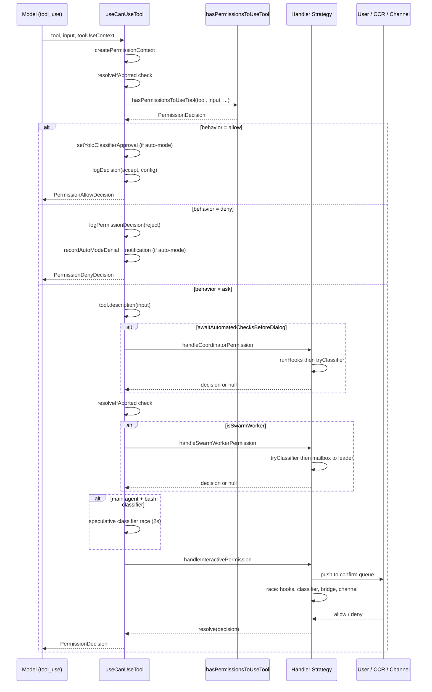
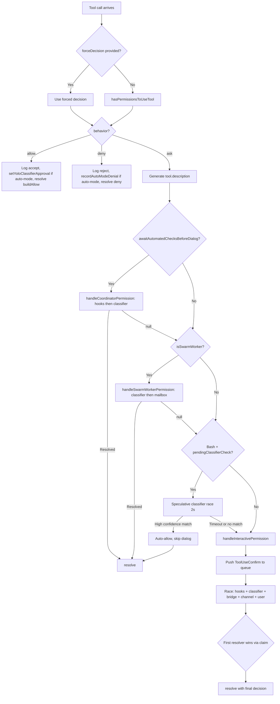

# `useCanUseTool`: The Engine Hook

## Overview

Every tool invocation in cc passes through a single React hook before execution begins. That hook, `useCanUseTool`, is the gatekeeper that transforms a model's tool-call intent into an allow, deny, or ask decision. It sits at the intersection of the permission model, the classifier system, lifecycle hooks, and the interactive user dialog -- making it the most consequential 200-line function in the entire harness.

The hook's design reflects a core principle from HER §12 Guardrails: automated checks should resolve as many permission decisions as possible without human involvement, but human-in-the-loop approval must remain the floor when automation cannot decide. The hook implements a tiered escalation path -- config rules, then hooks, then classifiers, then interactive prompts -- that mirrors the tiered escalation pattern described in HER §11.2, where Tier 1 handles deterministic checks and Tier 3 brings in human front-line review.

This chapter traces the full decision pipeline from the moment a tool call arrives at `useCanUseTool` to the moment it resolves with a `PermissionDecision`. We will examine the hook's integration with `hasPermissionsToUseTool`, the three handler strategies (coordinator, swarm worker, interactive), and the racing architecture that allows automated and human decisions to compete concurrently.

## Data structures and contracts

The hook's type signature establishes the contract between the React layer and the permission engine:

```typescript
// src/hooks/useCanUseTool.tsx:L27-L27 — CanUseToolFn type definition
export type CanUseToolFn<Input extends Record<string, unknown> = Record<string, unknown>> = (tool: ToolType, input: Input, toolUseContext: ToolUseContext, assistantMessage: AssistantMessage, toolUseID: string, forceDecision?: PermissionDecision<Input>) => Promise<PermissionDecision<Input>>;
```

The `CanUseToolFn` type is the authoritative interface for the permission check. Every parameter serves a specific role: `tool` and `input` identify what the model wants to do; `toolUseContext` carries the abort controller, app state accessor, and session options; `assistantMessage` provides the message ID for telemetry correlation; `toolUseID` is the unique identifier for this specific tool use block. The optional `forceDecision` parameter allows callers to bypass the entire permission pipeline and inject a pre-determined outcome, which is used when a higher-level orchestrator has already resolved the decision.

The return type, `PermissionDecision`, is a discriminated union with three branches -- `allow`, `deny`, and `ask`. The `PermissionAllowDecision` carries `updatedInput` (the classifier or hook may have modified the tool's input), `userModified` (whether the user edited the input in the dialog), and `decisionReason` for audit trail. The `PermissionDenyDecision` carries a `message` and mandatory `decisionReason`. The `PermissionAskDecision` is the intermediate state that triggers the interactive flow and carries additional fields like `suggestions` (permission rule updates the dialog can apply), `blockedPath` (the filesystem path that triggered the ask), and `pendingClassifierCheck` (a descriptor for an asynchronous classifier evaluation). These types are defined in the centralized permission types module and re-exported for backwards compatibility.

The `ToolPermissionContext` type encapsulates the runtime permission configuration. Its `mode` field determines the overall permission posture: `default` asks the user, `plan` restricts to read-only operations, `acceptEdits` auto-allows file modifications in the working directory, `bypassPermissions` skips most checks, `dontAsk` converts ask decisions to deny, and `auto` uses the AI classifier instead of prompting. The `awaitAutomatedChecksBeforeDialog` field is the toggle that distinguishes coordinator workers from main agents. When true, hooks and classifiers run to completion before the interactive dialog appears. When false (the default for the main agent), automated checks race against user interaction -- the dialog appears immediately, and if an automated check resolves first, it wins. The `alwaysAllowRules`, `alwaysDenyRules`, and `alwaysAskRules` fields are keyed by `PermissionRuleSource` (userSettings, projectSettings, localSettings, flagSettings, policySettings, cliArg, command, session), providing a layered rule hierarchy where project-level rules override user-level rules and CLI arguments override both.

The `PermissionDecisionReason` union documents every possible explanation for a permission outcome. Its discriminants -- `rule`, `mode`, `hook`, `classifier`, `safetyCheck`, `subcommandResults`, `sandboxOverride`, `workingDir`, `permissionPromptTool`, `asyncAgent`, and `other` -- are the auditable breadcrumbs that the `logPermissionDecision` function records for every decision. The `classifier` discriminant further sub-classifies into `auto-mode` (the YOLO classifier) and `bash_allow` (the prompt-rule-based bash classifier), each with a human-readable `reason` string.

## Control flow

### The hook entry point

The `useCanUseTool` hook is a React hook that returns a memoized `CanUseToolFn`. Its body constructs a single async callback wrapped in a Promise:

```typescript
// src/hooks/useCanUseTool.tsx:L28-L54 — useCanUseTool hook body (first half)
function useCanUseTool(setToolUseConfirmQueue, setToolPermissionContext) {
  const $ = _c(3);
  let t0;
  if ($[0] !== setToolPermissionContext || $[1] !== setToolUseConfirmQueue) {
    t0 = async (tool, input, toolUseContext, assistantMessage, toolUseID, forceDecision) => new Promise(resolve => {
      const ctx = createPermissionContext(tool, input, toolUseContext, assistantMessage, toolUseID, setToolPermissionContext, createPermissionQueueOps(setToolUseConfirmQueue));
      if (ctx.resolveIfAborted(resolve)) {
        return;
      }
      const decisionPromise = forceDecision !== undefined ? Promise.resolve(forceDecision) : hasPermissionsToUseTool(tool, input, toolUseContext, assistantMessage, toolUseID);
      return decisionPromise.then(async result => {
        if (result.behavior === "allow") {
          if (ctx.resolveIfAborted(resolve)) {
            return;
          }
          if (feature("TRANSCRIPT_CLASSIFIER") && result.decisionReason?.type === "classifier" && result.decisionReason.classifier === "auto-mode") {
            setYoloClassifierApproval(toolUseID, result.decisionReason.reason);
          }
          ctx.logDecision({
            decision: "accept",
            source: "config"
          });
          resolve(ctx.buildAllow(result.updatedInput ?? input, {
            decisionReason: result.decisionReason
          }));
          return;
        }
```

The hook receives two React state setters -- `setToolUseConfirmQueue` and `setToolPermissionContext` -- and uses the React compiler runtime (`_c`) to memoize the callback based on their identity. The `$[0]` and `$[1]` checks ensure that the callback is only recreated when these setters change, which happens only on re-render with a different dispatch function.

The first action inside the callback is creating a `PermissionContext` object via `createPermissionContext`. This frozen context object bundles the tool, input, context, and queue operations together with a suite of helper methods: `logDecision` (telemetry), `logCancelled` (abort tracking), `persistPermissions` (writing permission updates to settings), `resolveIfAborted` (abort detection), `cancelAndAbort` (combining cancel with abort-signal propagation), `buildAllow` and `buildDeny` (typed decision constructors), `handleUserAllow` and `handleHookAllow` (decision handlers that persist updates and log telemetry), `runHooks` (executing PreToolUse hooks), and `tryClassifier` (bash classifier auto-approval). The context also provides queue manipulation methods (`pushToQueue`, `removeFromQueue`, `updateQueueItem`) that delegate to the `PermissionQueueOps` interface. The `PermissionQueueOps` interface decouples queue manipulation from React state with three operations: `push`, `remove`, and `update`. It is implemented by `createPermissionQueueOps`, which wraps the React `setToolUseConfirmQueue` dispatcher. By decoupling queue operations from React, the permission context can be passed to handler functions that have no direct dependency on React state, enabling the handler modules to be tested and reasoned about independently.

The `resolveIfAborted` check appears at multiple points throughout the flow. It inspects `toolUseContext.abortController.signal.aborted` and, if true, resolves the outer Promise with a cancel decision and returns true to short-circuit. This is critical for long-running permission checks: if the model's response is aborted (e.g., the user cancels the query), any in-flight permission decision must be discarded rather than applied to a stale context.

The `decisionPromise` branches on `forceDecision`: if the caller provides a pre-resolved decision, the pipeline skips `hasPermissionsToUseTool` entirely. Otherwise, it calls `hasPermissionsToUseTool`, which is the rule-checking engine that evaluates deny rules, ask rules, tool-specific `checkPermissions`, auto-mode classifier logic, and denial tracking. This function delegates to `hasPermissionsToUseToolInner` and then applies post-processing for denial tracking and mode-specific transformations (converting `ask` to `deny` in `dontAsk` mode, running the auto-mode classifier in `auto` mode).

### The three-behavior switch

After `hasPermissionsToUseTool` returns, the hook switches on `result.behavior`:

- **`allow`**: The tool is pre-approved by configuration. The hook logs the decision and resolves with `ctx.buildAllow`. If the decision came from the auto-mode classifier (`decisionReason.classifier === "auto-mode"`), it also calls `setYoloClassifierApproval` to record the approval for UI display -- the checkmark indicator that tells the user the classifier approved this tool use.

- **`deny`**: The tool is explicitly denied by configuration. The hook logs the rejection via `logPermissionDecision`. If the denial came from the auto-mode classifier, it records the denial via `recordAutoModeDenial` and fires an immediate notification:

```typescript
// src/hooks/useCanUseTool.tsx:L64-L91 — The deny branch
switch (result.behavior) {
  case "deny":
    {
      logPermissionDecision({
        tool,
        input,
        toolUseContext,
        messageId: ctx.messageId,
        toolUseID
      }, {
        decision: "reject",
        source: "config"
      });
      if (feature("TRANSCRIPT_CLASSIFIER") && result.decisionReason?.type === "classifier" && result.decisionReason.classifier === "auto-mode") {
        recordAutoModeDenial({
          toolName: tool.name,
          display: description,
          reason: result.decisionReason.reason ?? "",
          timestamp: Date.now()
        });
        toolUseContext.addNotification?.({
          key: "auto-mode-denied",
          priority: "immediate",
          jsx: <><Text color="error">{tool.userFacingName(input).toLowerCase()} denied by auto mode</Text><Text dimColor={true}> · /permissions</Text></>
        });
      }
      resolve(result);
      return;
    }
```

The `recordAutoModeDenial` call at line L78 captures the tool name, description, reason, and timestamp for each auto-mode denial. The `addNotification` call at line L84 renders a red "denied by auto mode" message alongside a dimmed "/permissions" hint, giving the user a clear path to adjust the rules. The JSX notification is built with Ink's `Text` component, using `color="error"` for the denial message and `dimColor` for the hint.

- **`ask`**: The most complex branch. This is where the three handler strategies come into play.

### The ask branch: coordinator, swarm, and interactive

When `result.behavior === "ask"`, the hook first fetches the tool's human-readable description by calling `tool.description(input, ...)`. This description is used by the interactive dialog and the swarm worker's permission request to the leader. Then the hook checks `appState.toolPermissionContext.awaitAutomatedChecksBeforeDialog` and `isSwarmWorker()` to determine which handler strategy to use. It tries three strategies in sequence, each of which may resolve the decision and short-circuit the rest:

```typescript
// src/hooks/useCanUseTool.tsx:L95-L168 — The ask branch handler sequence
if (appState.toolPermissionContext.awaitAutomatedChecksBeforeDialog) {
  const coordinatorDecision = await handleCoordinatorPermission({
    ctx,
    ...(feature("BASH_CLASSIFIER") ? {
      pendingClassifierCheck: result.pendingClassifierCheck
    } : {}),
    updatedInput: result.updatedInput,
    suggestions: result.suggestions,
    permissionMode: appState.toolPermissionContext.mode
  });
  if (coordinatorDecision) {
    resolve(coordinatorDecision);
    return;
  }
}
if (ctx.resolveIfAborted(resolve)) {
  return;
}
const swarmDecision = await handleSwarmWorkerPermission({
  ctx,
  description,
  ...(feature("BASH_CLASSIFIER") ? {
    pendingClassifierCheck: result.pendingClassifierCheck
  } : {}),
  updatedInput: result.updatedInput,
  suggestions: result.suggestions
});
if (swarmDecision) {
  resolve(swarmDecision);
  return;
}
// ...speculative classifier race...
handleInteractivePermission({ctx, description, result, /* ... */ }, resolve);
```

The sequence is: coordinator handler, then swarm worker handler, then speculative classifier race, then interactive handler. Each returns `null` if it cannot handle the request, allowing fallthrough to the next. Note the `resolveIfAborted` check at line L110 between the coordinator and swarm handlers -- this catches the case where the coordinator handler took enough time for the abort signal to fire.

### Coordinator handler

The `handleCoordinatorPermission` function runs automated checks to completion before falling through to the interactive dialog. It is only invoked when `awaitAutomatedChecksBeforeDialog` is true, which is the case for coordinator workers -- background agents that should only interrupt the user when automated checks cannot decide. The function tries hooks first (fast, local), then the classifier (slow, inference-based). The `ctx.runHooks` method iterates over `executePermissionRequestHooks` results, checking each hook's `permissionRequestResult`. If a hook returns `allow`, the method calls `handleHookAllow` which persists any permission updates and logs the decision. If a hook returns `deny`, it logs the rejection and optionally aborts the entire tool use if `decision.interrupt` is set. The `ctx.tryClassifier` method, only available when the `BASH_CLASSIFIER` feature flag is enabled, awaits the classifier's auto-approval result for bash commands.

The error handling is notable: if automated checks fail unexpectedly, the handler returns `null` to fall through to the interactive dialog, ensuring the user can always decide manually. This fail-open-on-error pattern is a deliberate choice: a broken hook or classifier should never block the agent from making progress when a human is available. Non-Error throws get a context prefix so the log is traceable.

### Swarm worker handler

The `handleSwarmWorkerPermission` function handles permission requests from swarm worker agents. These workers cannot show their own UI; instead, they forward permission requests to the leader agent via a mailbox mechanism. The function first checks if swarms are enabled and if the current agent is a worker. If not, it returns `null` immediately. For swarm workers, it tries the classifier for auto-approval before forwarding to the leader, because the classifier is faster than a round-trip to the leader. Agents await the classifier result rather than racing it against user interaction, since the worker has no local user to race against.

The mailbox communication pattern uses a register-before-send discipline. The callback is registered via `registerPermissionCallback` before `sendPermissionRequestViaMailbox` is called, preventing the race condition where the leader responds before the callback is in place. The `createResolveOnce` guard ensures that exactly one resolution path -- classifier, leader allow, leader reject, or abort -- can win. The `claim()` call in the `onAllow` and `onReject` callbacks is the atomic check-and-mark that prevents double resolution. It returns `true` only for the first caller, allowing that caller to proceed with `resolveOnce`. Subsequent callers get `false` and return immediately.

While waiting for the leader, the worker shows a visual indicator by setting `pendingWorkerRequest` on the app state. If the abort signal fires during the wait, the abort listener calls `claim()` and resolves with a cancel decision, ensuring the Promise never hangs. If the mailbox communication fails entirely (e.g., the leader has disconnected), the handler returns `null` and falls through to local UI handling.

### Speculative classifier race

For the main agent (not a coordinator or swarm worker), the hook runs a speculative classifier race before showing the interactive dialog. This race, at `src/hooks/useCanUseTool.tsx:L126-L159`, waits up to 2 seconds for the bash classifier to resolve:

```typescript
// src/hooks/useCanUseTool.tsx:L126-L157 — Speculative classifier race
if (feature("BASH_CLASSIFIER") && result.pendingClassifierCheck && tool.name === BASH_TOOL_NAME && !appState.toolPermissionContext.awaitAutomatedChecksBeforeDialog) {
  const speculativePromise = peekSpeculativeClassifierCheck((input as {
    command: string;
  }).command);
  if (speculativePromise) {
    const raceResult = await Promise.race([speculativePromise.then(_temp), new Promise(_temp2)]);
    if (ctx.resolveIfAborted(resolve)) {
      return;
    }
    if (raceResult.type === "result" && raceResult.result.matches && raceResult.result.confidence === "high" && feature("BASH_CLASSIFIER")) {
      consumeSpeculativeClassifierCheck((input as {
        command: string;
      }).command);
      const matchedRule = raceResult.result.matchedDescription ?? undefined;
      if (matchedRule) {
        setClassifierApproval(toolUseID, matchedRule);
      }
      ctx.logDecision({
        decision: "accept",
        source: {
          type: "classifier"
        }
      });
      resolve(ctx.buildAllow(result.updatedInput ?? input as Record<string, unknown>, {
        decisionReason: {
          type: "classifier" as const,
          classifier: "bash_allow" as const,
          reason: `Allowed by prompt rule: "${raceResult.result.matchedDescription}"`
        }
      }));
      return;
    }
  }
}
```

The race uses `peekSpeculativeClassifierCheck` (which returns the existing in-flight classifier promise without starting a new one) and a 2-second timeout implemented via `setTimeout(res, 2000, { type: 'timeout' })`. If the classifier returns a high-confidence match within the grace period, the dialog is skipped entirely and the tool is auto-approved. This is the mechanism that allows common bash commands like `git status` or `ls` to execute without a visible permission prompt, even when the permission mode would otherwise require one. The `consumeSpeculativeClassifierCheck` call marks the check as consumed so the interactive handler does not duplicate the work. The `setClassifierApproval` call at line L141 records the matched rule for UI display, so the user can see which prompt rule triggered the auto-approval.

Only high-confidence classifier matches are accepted during the speculative race. Medium and low confidence results cause the race to fall through to the interactive dialog, where the classifier continues running in the background and may still auto-approve before the user acts.

### Interactive handler

The `handleInteractivePermission` function is the most complex handler. It pushes a `ToolUseConfirm` entry to the React confirm queue, sets up callbacks for the interactive dialog, and then races four concurrent resolution sources against each other: local user interaction, bridge (claude.ai web UI) response, channel (Telegram/iMessage) response, and background hook/classifier checks.

The function does not return a value -- instead, it eventually calls `resolve` (the outer Promise resolver) from one of its callbacks. The `createResolveOnce` guard ensures that exactly one resolution wins, even when multiple racers fire concurrently. The `claim()` method provides an atomic check-and-mark that prevents the race window between checking `isResolved()` and calling `resolve()`.

The `ToolUseConfirm` object pushed to the queue contains the dialog state and all the callbacks, including `onUserInteraction` (called when the user starts interacting with the permission dialog), `onAbort` (called when the user cancels), `onAllow` (called when the user approves), `onReject` (called when the user denies), and `recheckPermission` (called to re-evaluate the permission from scratch). The `onUserInteraction` callback sets `userInteracted = true` and clears the classifier indicator, since auto-approve is no longer possible once the user is engaged. A 200ms grace period prevents accidental keypresses from canceling the classifier prematurely -- a key press arriving within 200ms of the dialog appearing is likely a buffered keystroke, not an intentional interaction.

The dialog's `onAllow` callback calls `claim()` before any async work, then notifies the bridge and channel racers that the local user has decided. The `onReject` callback does the same. The `onAbort` callback also cancels the bridge request and removes the channel subscription. All three callbacks use `claim()` to atomically mark the resolution as taken, preventing a concurrent classifier or bridge response from resolving the same Promise.

After pushing the queue entry, the interactive handler sets up the four racing paths. The bridge race forwards the permission request to claude.ai when the REPL bridge is connected. The bridge sends both a request and subscribes for a response; whichever side (CLI or CCR) responds first wins via `claim()`. All tools are forwarded to the bridge -- the generic allow/deny modal handles any tool, and tools whose local dialog injects fields tolerate the field being missing so generic remote approval degrades gracefully. The channel race sends a structured notification to every active channel client (Telegram, iMessage, etc.) and subscribes for a reply. Channel replies are intercepted in the notification handler before they reach Claude as conversation turns, so a "yes abc123" response never becomes a conversation message.

The hook race runs `executePermissionRequestHooks` asynchronously if the coordinator handler has not already run them. If a hook returns a decision before the user responds, it claims the resolution and removes the queue entry. The classifier race runs the async bash classifier check, which may auto-approve the command while the dialog is visible.

### The classifier checkmark transition

When the async classifier auto-approves a command while the interactive dialog is showing, the handler implements a "checkmark transition" UX pattern. Instead of immediately removing the dialog (which would cause a jarring visual flash), the handler updates the queue item with `classifierAutoApproved: true` and `classifierMatchedRule`, which renders a checkmark indicator. The dialog then auto-dismisses after a delay: 3 seconds if the terminal is focused (the user can see it), 1 second if not. The user can dismiss the checkmark early with Esc via the `onDismissCheckmark` callback.

This pattern balances two concerns: the user needs to see that the classifier approved the command (transparency), but the dialog should not linger longer than necessary (latency). A `checkmarkAbortHandler` ensures that if a sibling tool execution fails and cascades via `siblingAbortController`, the cosmetic checkmark dialog is cleaned up immediately rather than blocking the next queued item.

### The recheckPermission callback

The `recheckPermission` callback on the interactive dialog re-evaluates the permission from scratch by calling `hasPermissionsToUseTool` again. This is triggered when the permission mode changes while the dialog is showing -- for example, when a bridge (CCR) response includes a mode switch that retroactively allows the tool. The callback uses `claim()` rather than `isResolved()` because the async `hasPermissionsToUseTool` call opens a window where a CCR response could arrive in flight, and `claim()` atomically prevents both from resolving. If the re-evaluation returns `allow`, the callback cancels the bridge request and removes the queue entry, ensuring the web UI does not show a stale prompt for a tool that is already executing.

### The full permission flow

The following sequence diagram shows the complete flow from tool call to resolution:



### The allow/deny decision flowchart

The following flowchart shows the branching logic inside the hook's main Promise callback:



### Error handling and abort semantics

The hook's `.catch` handler at `src/hooks/useCanUseTool.tsx:L171-L182` distinguishes between abort errors and unexpected errors. For `AbortError` and `APIUserAbortError`, it logs a debug message and resolves with `ctx.cancelAndAbort(undefined, true)`. For all other errors, it logs via `logError` and resolves with the same cancel-and-abort decision:

```typescript
// src/hooks/useCanUseTool.tsx:L171-L182 — Error handler and cleanup
}).catch(error => {
  if (error instanceof AbortError || error instanceof APIUserAbortError) {
    logForDebugging(`Permission check threw ${error.constructor.name} for tool=${tool.name}: ${error.message}`);
    ctx.logCancelled();
    resolve(ctx.cancelAndAbort(undefined, true));
  } else {
    logError(error);
    resolve(ctx.cancelAndAbort(undefined, true));
  }
}).finally(() => {
  clearClassifierChecking(toolUseID);
});
```

The `.finally` block calls `clearClassifierChecking(toolUseID)` to clean up any classifier state associated with this tool use, preventing stale indicators from persisting in the UI. This cleanup runs regardless of whether the Promise resolved or rejected. Both error paths resolve with the same `cancelAndAbort` decision -- the difference is that abort errors log via `logForDebugging` (debug-level) while unexpected errors log via `logError` (error-level), reflecting the fact that aborts are an expected part of the lifecycle while unexpected errors indicate a bug.

The `cancelAndAbort` method on the permission context handles both abort and reject semantics. It constructs the appropriate rejection message based on whether the context belongs to a subagent (which uses `SUBAGENT_REJECT_MESSAGE`) or the main agent (which uses `REJECT_MESSAGE` with `withMemoryCorrectionHint`). If `isAbort` is true (or there is no feedback and no content blocks and this is not a subagent), it calls `toolUseContext.abortController.abort()` to signal the entire tool use chain to stop. This cascading abort ensures that sibling tool executions in the same turn are also cancelled.

## Edge cases and failure modes

**Race conditions between automated and human decisions.** The interactive handler races up to five concurrent resolution sources against each other. Without the `createResolveOnce` / `claim()` guard, a classifier auto-approval arriving milliseconds after a user click could overwrite the user's decision, or a bridge response from claude.ai could resolve the Promise twice. The `claim()` method uses a simple boolean flag to ensure that exactly one racer wins, and the `userInteracted` flag ensures that once a user starts interacting with the permission dialog (e.g., pressing arrow keys), the classifier can no longer auto-approve. There is also a 200ms grace period after the dialog appears during which user interactions are ignored, preventing accidental keypresses from canceling the classifier prematurely.

**Aborted tool use mid-permission-check.** The `resolveIfAborted` check appears at four points in the flow: immediately after context creation at line L34, after `hasPermissionsToUseTool` returns at line L39, after the tool description is generated at line L61, and after the coordinator handler returns at line L110. This ensures that an abort signal (from the user cancelling the query) is detected promptly rather than allowing the permission pipeline to continue resolving for a tool use that will never execute.

**Swarm worker permission round-trip failure.** The `handleSwarmWorkerPermission` function wraps its mailbox communication in a try/catch. If the request to the leader fails (e.g., the leader has disconnected), the handler returns `null` and falls through to local UI handling. This graceful degradation ensures that a broken swarm communication channel does not permanently block the worker.

**Classifier unavailability.** When the bash classifier API is unreachable (network failure, rate limit, context window exceeded), the classifier returns a "not available" result. The `hasPermissionsToUseTool` function then falls back to prompting the user. The auto-mode classifier's `transcriptTooLong` flag is specifically handled: since it is deterministic (the same transcript will always produce the same error), the system falls back to prompting rather than retrying or failing closed, consistent with the fail-open-on-error principle from HER §12.

**Force decision bypass.** The `forceDecision` parameter allows callers to skip the entire permission pipeline. This is used by higher-level orchestrators that have already resolved the decision, but it also means that a bug in the calling code could bypass all safety checks. The parameter is typed as `PermissionDecision<Input>`, which means it must be a fully-formed decision object -- there is no "force allow without a reason" shortcut. The decision still flows through the same `.then` handler that checks `resolveIfAborted`, ensuring that forced decisions on aborted tool uses are still discarded.

**Auto-mode denial tracking.** When the auto-mode classifier denies a tool use, cc tracks consecutive denials. The `denialTracking` module limits consecutive denials before falling back to interactive prompting, preventing the agent from getting stuck in an auto-mode denial loop where it repeatedly attempts the same blocked action. The `hasPermissionsToUseTool` function reads the denial state from `context.localDenialTracking` for async subagents (whose `setAppState` is a no-op) or from `appState.denialTracking` for the main agent, creating a new tracking state if neither exists. The `recordAutoModeDenial` call at `src/hooks/useCanUseTool.tsx:L78` captures the tool name, description, reason, and timestamp for each denial, feeding the tracking module that determines when to fall back to prompting.

**RecheckPermission during mode switch.** The `recheckPermission` callback on the interactive dialog can trigger a full re-evaluation of the permission rules. This happens when a CCR-initiated mode switch occurs while the dialog is showing -- for instance, the user approving a mode change on claude.ai that retroactively allows the current tool. The re-evaluation calls `hasPermissionsToUseTool` from scratch, which may return `allow` this time. The callback then claims the resolution via `claim()` (not `isResolved()`) and cancels the bridge request, ensuring the web UI does not show a stale prompt for a tool that is already executing.

## Where cc diverges from the published pattern

HER §12 Guardrails describes a permission system where every tool invocation is either pre-approved by configuration or requires human approval. The cc implementation diverges in three significant ways.

First, cc introduces a classifier layer between the config rules and the human prompt. The auto-mode classifier (the YOLO classifier) and the bash classifier can approve tool uses that would otherwise require human intervention, based on AI-driven risk assessment. This is a layer that the HER pattern does not anticipate -- it creates a "Tier 1.5" between automated deterministic checks and human review. The auto-mode classifier uses a two-stage architecture: a fast stage and a thinking stage. The bash classifier uses prompt-rule matching with confidence levels (high, medium, low), where only high-confidence matches are accepted for auto-approval. The classifier can also deny tool uses that config rules would allow, providing a safety net for overly broad permission rules -- this is particularly visible in auto mode, where the classifier sees the full conversation context and can detect prompt injection attempts (HER §6.13) that static rules cannot. The `decisionReason.classifier` field distinguishes between `auto-mode` (YOLO) and `bash_allow` (prompt-rule) classifiers in the audit trail.

Second, cc's interactive handler races automated checks against user interaction rather than running them sequentially. The HER pattern implies a sequential pipeline (check rules, then hooks, then ask human), but cc's racing architecture allows the classifier to auto-approve a command while the user is already looking at the permission dialog, seamlessly resolving the permission without requiring the user to wait. This is a deliberate tradeoff: the racing architecture is more complex and has subtle edge cases (the grace period, the `userInteracted` flag, the `claim()` guard), but it provides a significantly better user experience for the common case where the classifier would approve the command anyway. The speculative classifier race in the main `useCanUseTool` hook adds a 2-second grace period before showing the dialog at all, which means that for fast classifier responses, the user never sees a permission prompt.

Third, cc's swarm worker permission flow forwards requests to a leader agent via mailbox rather than directly to a human. This is an implementation of the async approval pattern from HER §11.3, but it extends the pattern by allowing the leader's classifier to auto-approve requests from workers, creating a two-level classifier hierarchy. The worker's own classifier runs first (fast, local), and if it cannot decide, the leader's classifier runs as part of the leader's normal permission flow. This is consistent with HER §11.3's guidance that "the agent should never fully block on human input" -- the worker can continue with non-blocked work while waiting for the leader's response, and the classifier provides a fast-path that often avoids the human round-trip entirely.

## Developer takeaways for building a long-running agent

When building a long-running agent that must gate tool invocations through a permission system, the most important lesson from `useCanUseTool` is to make the permission pipeline interruptible at every await point. Long-running permission checks (especially classifier API calls that can take seconds) must be cancellable via an abort signal, and the resolution must be guarded against multiple concurrent resolvers. Use an atomic claim-and-resolve pattern rather than a check-then-resolve pattern to close the window between checking whether a decision has been made and actually making it. Race automated checks against user interaction rather than running them sequentially -- this eliminates the perceived latency of the classifier for the common case where it would approve the command anyway. Add a grace period before showing the interactive dialog to give fast automated checks a chance to resolve, and use a `userInteracted` flag to prevent the classifier from overwriting a decision the user is already engaging with. Always fail open on automated check errors: a broken hook or classifier should fall through to human approval rather than blocking the agent indefinitely or silently denying operations that should have been allowed. Track consecutive denials in auto mode and fall back to prompting when the threshold is exceeded, preventing denial loops. The permission system is the harness's most critical safety boundary, and its correctness depends on never losing a decision, never resolving twice, and never blocking permanently when a human is available to decide.
