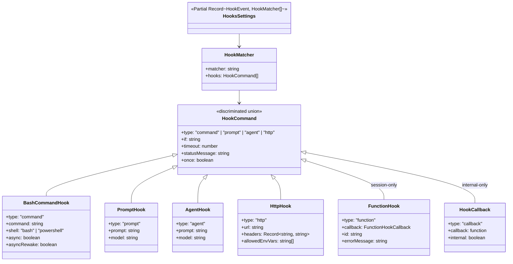
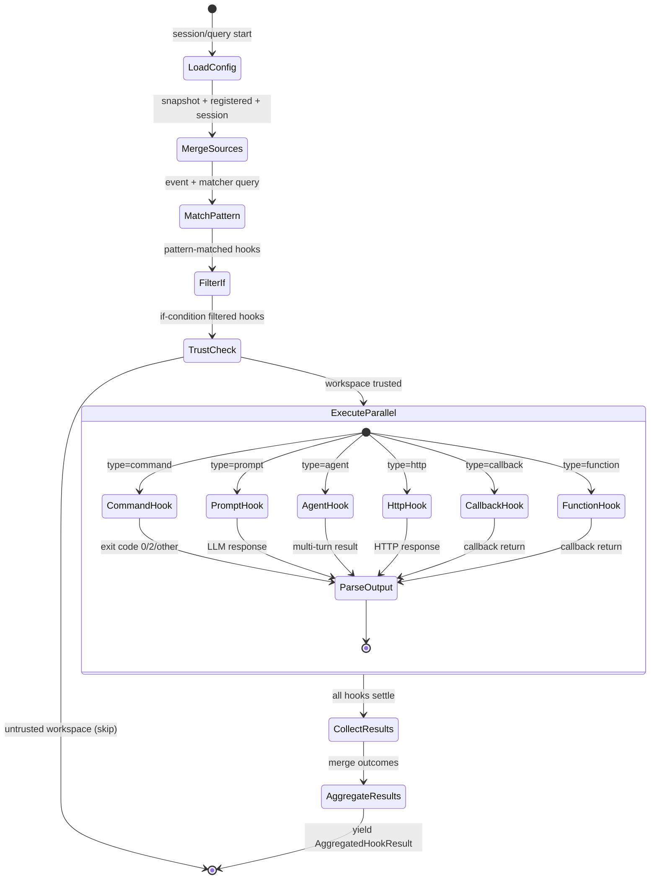

# Chapter 36: The Hook Schema and Lifecycle Events

## Overview

Hooks are deterministic lifecycle event handlers registered in `settings.json` that execute user-defined commands at well-defined points in cc's execution. They form the twelfth pattern in the HER's agentic harness taxonomy: deterministic shell commands at lifecycle points that give operators programmatic control over the agent loop without modifying the harness itself. The hook system spans four layers: a Zod schema layer that defines the configuration contract (`src/schemas/hooks.ts`), a settings integration layer that merges hooks from multiple sources (`src/utils/hooks/hooksSettings.ts`, `src/utils/hooks/hooksConfigManager.ts`), an execution engine that spawns shells or LLM queries (`src/utils/hooks.ts`), and an event-broadcast system for SDK consumers (`src/utils/hooks/hookEvents.ts`). This chapter traces the data structures from their schema definitions through the matching, merging, and execution pipeline, with particular attention to the exit-code protocol that makes hooks a powerful guardrail mechanism.

The HER identifies hooks as one of six configuration surfaces in a modern harness (HER §7.5), alongside CLAUDE.md files, MCP servers, skills, sub-agents, and back-pressure mechanisms. Common patterns listed in the HER include auto-formatting after file edits, file protection via PreToolUse, premature-completion prevention via Stop hooks, and quality gates via TaskCompleted hooks. The cc implementation realizes all of these patterns and extends them with LLM-based evaluation, HTTP-based policy delegation, and enterprise-grade managed-only policy enforcement.

## Data structures and contracts

### The HookCommand discriminated union

The central schema definition lives in `src/schemas/hooks.ts`. The file was extracted from `src/utils/settings/types.ts` specifically to break a circular dependency between settings types and plugin schemas --- both files now import from this shared location instead of each other, as noted in the file header comment at `src/schemas/hooks.ts:L1-L9`. Four concrete hook types share a common `type` discriminator field and are composed into a Zod `discriminatedUnion`:

```typescript
// src/schemas/hooks.ts:L176-L189 — HookCommandSchema discriminated union
export const HookCommandSchema = lazySchema(() => {
  const {
    BashCommandHookSchema,
    PromptHookSchema,
    AgentHookSchema,
    HttpHookSchema,
  } = buildHookSchemas()
  return z.discriminatedUnion('type', [
    BashCommandHookSchema,
    PromptHookSchema,
    AgentHookSchema,
    HttpHookSchema,
  ])
})
```

The four members are `command` (shell subprocess), `prompt` (single LLM call), `agent` (multi-turn LLM subagent), and `http` (HTTP POST). Each shares a set of common optional fields --- `if`, `timeout`, `statusMessage`, `once` --- and a type-specific required field (`command`, `prompt`, `prompt`, `url` respectively). The `lazySchema` wrapper defers schema construction until first access, which breaks the circular dependency and also allows the schema to reference `HOOK_EVENTS` from `agentSdkTypes` without import-order issues.

The `BashCommandHookSchema` is the most feature-rich variant, carrying exclusive fields for shell selection and async execution:

```typescript
// src/schemas/hooks.ts:L32-L65 — BashCommandHookSchema definition
const BashCommandHookSchema = z.object({
  type: z.literal('command').describe('Shell command hook type'),
  command: z.string().describe('Shell command to execute'),
  if: IfConditionSchema(),
  shell: z
    .enum(SHELL_TYPES)
    .optional()
    .describe(
      "Shell interpreter. 'bash' uses your $SHELL (bash/zsh/sh); 'powershell' uses pwsh. Defaults to bash.",
    ),
  timeout: z
    .number()
    .positive()
    .optional()
    .describe('Timeout in seconds for this specific command'),
  statusMessage: z
    .string()
    .optional()
    .describe('Custom status message to display in spinner while hook runs'),
  once: z
    .boolean()
    .optional()
    .describe('If true, hook runs once and is removed after execution'),
  async: z
    .boolean()
    .optional()
    .describe('If true, hook runs in background without blocking'),
  asyncRewake: z
    .boolean()
    .optional()
    .describe(
      'If true, hook runs in background and wakes the model on exit code 2 (blocking error). Implies async.',
    ),
})
```

The `if` field uses permission-rule syntax (e.g., `"Bash(git *)"`) to gate execution to specific tool calls. The `async` and `asyncRewake` flags enable non-blocking execution where the hook runs in the background and, in the `asyncRewake` case, re-injects the model if the hook exits with code 2. The `once` flag triggers automatic removal after first successful execution, implemented via the `onHookSuccess` callback in `src/utils/hooks/registerSkillHooks.ts:L36-L43`.

The `HttpHookSchema` carries its own security-specific fields for environment variable interpolation in headers:

```typescript
// src/schemas/hooks.ts:L97-L126 — HttpHookSchema definition
const HttpHookSchema = z.object({
  type: z.literal('http').describe('HTTP hook type'),
  url: z.string().url().describe('URL to POST the hook input JSON to'),
  if: IfConditionSchema(),
  timeout: z
    .number()
    .positive()
    .optional()
    .describe('Timeout in seconds for this specific request'),
  headers: z
    .record(z.string(), z.string())
    .optional()
    .describe(
      'Additional headers to include in the request. Values may reference environment variables using $VAR_NAME or ${VAR_NAME} syntax (e.g., "Authorization": "Bearer $MY_TOKEN"). Only variables listed in allowedEnvVars will be interpolated.',
    ),
  allowedEnvVars: z
    .array(z.string())
    .optional()
    .describe(
      'Explicit list of environment variable names that may be interpolated in header values. Only variables listed here will be resolved; all other $VAR references are left as empty strings. Required for env var interpolation to work.',
    ),
  statusMessage: z
    .string()
    .optional()
    .describe('Custom status message to display in spinner while hook runs'),
  once: z
    .boolean()
    .optional()
    .describe('If true, hook runs once and is removed after execution'),
})
```

The `allowedEnvVars` field is a security gate: without it, environment variable references in header values resolve to empty strings. This prevents a malicious `settings.json` in a cloned repository from exfiltrating secrets via HTTP header interpolation.

### The IfConditionSchema and permission-rule syntax

The `if` condition is shared across all four hook types via the `IfConditionSchema` factory:

```typescript
// src/schemas/hooks.ts:L19-L27 — IfConditionSchema shared condition field
const IfConditionSchema = lazySchema(() =>
  z
    .string()
    .optional()
    .describe(
      'Permission rule syntax to filter when this hook runs (e.g., "Bash(git *)"). ' +
        'Only runs if the tool call matches the pattern. Avoids spawning hooks for non-matching commands.',
    ),
)
```

The condition uses the same permission-rule syntax that cc uses for tool permissions: `"ToolName(pattern)"`. This means a `PreToolUse` hook with `"if": "Bash(git *)"` only fires when the agent invokes a Bash command whose content matches `git *`. The `prepareIfConditionMatcher()` function at `src/utils/hooks.ts:L1390-L1421` parses the rule, looks up the tool's Zod schema, and creates a closure that evaluates the condition against the tool's validated input. This is expensive work done once per hook execution batch, not once per hook, so the cost scales with the number of distinct `if` conditions rather than the number of hooks.

### The HookMatcher and HooksSchema wrappers

Hooks are grouped by event and matcher. A `HookMatcherSchema` pairs a matcher pattern with an array of `HookCommand` values:

```typescript
// src/schemas/hooks.ts:L194-L204 — HookMatcherSchema
export const HookMatcherSchema = lazySchema(() =>
  z.object({
    matcher: z
      .string()
      .optional()
      .describe('String pattern to match (e.g. tool names like "Write")'),
    hooks: z
      .array(HookCommandSchema())
      .describe('List of hooks to execute when the matcher matches'),
  }),
)
```

The top-level `HooksSchema` maps `HookEvent` enum values to arrays of matchers, using `z.partialRecord` since not all events need configuration:

```typescript
// src/schemas/hooks.ts:L211-L213 — HooksSchema top-level
export const HooksSchema = lazySchema(() =>
  z.partialRecord(z.enum(HOOK_EVENTS), z.array(HookMatcherSchema())),
)
```

A typical configuration in `settings.json` looks like:

```json
{
  "hooks": {
    "PreToolUse": [
      {
        "matcher": "Bash",
        "hooks": [
          {
            "type": "command",
            "command": "check-bash-safety.sh",
            "if": "Bash(rm *)"
          }
        ]
      }
    ],
    "Stop": [
      {
        "hooks": [
          {
            "type": "command",
            "command": "prevent-premature-stop.sh"
          }
        ]
      }
    ]
  }
}
```

### The HookEvent enum and lifecycle events

The `HOOK_EVENTS` constant in `src/entrypoints/sdk/coreTypes.ts:L25-L53` enumerates all 26 lifecycle events. These span the entire agent lifecycle from session initialization through tool execution, compaction, and teardown:

```typescript
// src/entrypoints/sdk/coreTypes.ts:L25-L53 — HOOK_EVENTS enumeration
export const HOOK_EVENTS = [
  'PreToolUse',
  'PostToolUse',
  'PostToolUseFailure',
  'Notification',
  'UserPromptSubmit',
  'SessionStart',
  'SessionEnd',
  'Stop',
  'StopFailure',
  'SubagentStart',
  'SubagentStop',
  'PreCompact',
  'PostCompact',
  'PermissionRequest',
  'PermissionDenied',
  'Setup',
  'TeammateIdle',
  'TaskCreated',
  'TaskCompleted',
  'Elicitation',
  'ElicitationResult',
  'ConfigChange',
  'WorktreeCreate',
  'WorktreeRemove',
  'InstructionsLoaded',
  'CwdChanged',
  'FileChanged',
] as const
```

Each event has structured metadata in `src/utils/hooks/hooksConfigManager.ts` that documents its exit-code semantics, matcher field, and allowed matcher values. The metadata is memoized by sorted tool-names via `lodash-es/memoize` so that frequent re-renders in the hooks configuration UI do not recompute the entire object. The memo key uses a sorted-joined string so callers passing a fresh `toolNames` array each render hit the cache instead of leaking a new entry per call (`src/utils/hooks/hooksConfigManager.ts:L266`).

The metadata for `PreToolUse` shows the exit-code protocol in its most consequential form:

```typescript
// src/utils/hooks/hooksConfigManager.ts:L29-L36 — PreToolUse event metadata
PreToolUse: {
  summary: 'Before tool execution',
  description:
    'Input to command is JSON of tool call arguments.\nExit code 0 - stdout/stderr not shown\nExit code 2 - show stderr to model and block tool call\nOther exit codes - show stderr to user only but continue with tool call',
  matcherMetadata: {
    fieldToMatch: 'tool_name',
    values: toolNames,
  },
},
```

The `Stop` event is where premature-completion prevention lives, one of the most commonly cited hook patterns in the HER:

```typescript
// src/utils/hooks/hooksConfigManager.ts:L95-L99 — Stop event metadata
Stop: {
  summary: 'Right before Claude concludes its response',
  description:
    'Exit code 0 - stdout/stderr not shown\nExit code 2 - show stderr to model and continue conversation\nOther exit codes - show stderr to user only',
},
```

A `Stop` hook that exits 2 forces the model to continue working instead of concluding its turn. This is the mechanism behind "premature-completion prevention" as described in HER §7.5: the hook inspects the model's output and, if it detects incomplete work, blocks the stop and feeds the model a continuation prompt via stderr.

### The HookSource hierarchy and settings resolution

Hooks originate from six sources, each with a distinct trust boundary and persistence model. The `HookSource` type in `src/utils/hooks/hooksSettings.ts:L15-L21` enumerates these:

```typescript
// src/utils/hooks/hooksSettings.ts:L15-L21 — HookSource type definition
export type HookSource =
  | EditableSettingSource
  | 'policySettings'
  | 'pluginHook'
  | 'sessionHook'
  | 'builtinHook'
```

The `EditableSettingSource` expands to `'userSettings' | 'projectSettings' | 'localSettings'`, corresponding to `~/.claude/settings.json`, `.claude/settings.json`, and `.claude/settings.local.json`. The `getAllHooks()` function at `src/utils/hooks/hooksSettings.ts:L92-L161` iterates these three sources, deduplicates by resolved file path (to handle the case where running from the home directory makes user and project settings resolve to the same file), then appends session hooks.

The priority ordering of sources is enforced by `sortMatchersByPriority()` at `src/utils/hooks/hooksSettings.ts:L230-L271`, which sorts matchers so that hooks from higher-priority sources (user settings, lower index in `SOURCES`) appear before lower-priority ones. Plugin hooks and builtin hooks get the lowest priority (numeric value 999), ensuring they never override user-configured hooks.

### Class diagram of the hook schema



The `FunctionHook` and `HookCallback` types are not part of the persisted schema --- they exist only in session state and cannot be written to `settings.json`. The `AgentHook` schema explicitly forbids `.transform()` because a previous transform wrapping the prompt string in a closure was silently dropped by `JSON.stringify` round-trips through `updateSettingsForSource`, deleting user configuration (see the comment at `src/schemas/hooks.ts:L130-L137`). The inferred types at the bottom of the schema file export type aliases that Zod derives: `HookCommand`, `BashCommandHook`, `PromptHook`, `AgentHook`, `HttpHook`, `HookMatcher`, and `HooksSettings` (`src/schemas/hooks.ts:L216-L222`).

## Control flow

### Hook lifecycle: from registration to execution

The hook system follows a clear pipeline: configuration is loaded and merged from multiple sources, hooks are matched against the current event and matcher query, `if` conditions are evaluated to filter candidates, and surviving hooks are dispatched to type-specific executors that run in parallel.



### Configuration merging: the getHooksConfig function

Hooks originate from five sources, assembled in `getHooksConfig()` in `src/utils/hooks.ts:L1492-L1566`. The snapshot (captured at session start from all settings files) is the base layer. Registered hooks (SDK callbacks and plugin hooks) are layered on top. Session hooks (in-memory, scoped to the current agent) are merged last, but are entirely skipped when `allowManagedHooksOnly` is set in policy settings.

```typescript
// src/utils/hooks.ts:L1492-L1513 — getHooksConfig assembly
function getHooksConfig(
  appState: AppState | undefined,
  sessionId: string,
  hookEvent: HookEvent,
): Array<
  | HookMatcher
  | HookCallbackMatcher
  | FunctionHookMatcher
  | PluginHookMatcher
  | SkillHookMatcher
  | SessionDerivedHookMatcher
> {
  const hooks: Array<...> = [...(getHooksConfigFromSnapshot()?.[hookEvent] ?? [])]
  const managedOnly = shouldAllowManagedHooksOnly()
  const registeredHooks = getRegisteredHooks()?.[hookEvent]
  if (registeredHooks) {
    for (const matcher of registeredHooks) {
      if (managedOnly && 'pluginRoot' in matcher) {
        continue
      }
      hooks.push(matcher)
    }
  }
  // ...
}
```

The `managedOnly` flag is the policy enforcement mechanism: when `allowManagedHooksOnly` is true in managed (enterprise) settings, user, project, and local hooks are suppressed, and only admin-defined hooks run. This prevents a malicious `settings.json` in a cloned repository from executing arbitrary commands. The comment at `src/utils/hooks.ts:L1533-L1539` explains the nuance: `strictPluginOnlyCustomization` does NOT block session hooks at this layer because that flag gates at the registration sites (where `agentDefinition.source` is known), whereas a blanket block here would also kill plugin-provided agents' frontmatter hooks.

A lightweight `hasHookForEvent()` function at `src/utils/hooks.ts:L1582-L1593` mirrors the source assembly but stops at the first hit without building the full merged config. This is a performance optimization for hot paths where hooks are typically unconfigured: it avoids the cost of `createBaseHookInput` (which calls `getTranscriptPathForSession`, involving path joins) and the full `getMatchingHooks` pipeline when no hooks exist for the event.

### The matching and deduplication pipeline

After configuration assembly, `getMatchingHooks()` (`src/utils/hooks.ts:L1603-L1874`) applies three successive filters. First, it computes a `matchQuery` from the hook input based on the event type. The switch block at `src/utils/hooks.ts:L1616-L1670` maps each event to its corresponding input field: `PreToolUse` maps to `tool_name`, `SessionStart` to `source`, `Notification` to `notification_type`, `PreCompact` and `PostCompact` to `trigger`, `SubagentStart` and `SubagentStop` to `agent_type`, `ConfigChange` to `source`, `InstructionsLoaded` to `load_reason`, and `FileChanged` to `basename(hookInput.file_path)`. Events like `TeammateIdle`, `TaskCreated`, and `TaskCompleted` have no match query, meaning all configured hooks for these events run unconditionally.

Second, matcher patterns are evaluated by `matchesPattern()` at `src/utils/hooks.ts:L1346-L1381`. A matcher can be a simple string for exact match (`"Write"`), a pipe-separated list for multiple exact matches (`"Write|Edit"`), or a regex pattern (`"^Write.*"`). The function first checks for the simple/pipe pattern using the regex `/^[a-zA-Z0-9_|]+$/`; if that matches, it splits on `|` and checks for membership. Otherwise it compiles the full matcher as a `RegExp` and tests against both the canonical tool name and any legacy names.

Third, the `if` condition is evaluated using `prepareIfConditionMatcher()`, which parses the permission-rule syntax and matches against the tool's Zod-validated input. The result is a closure `(ifCondition: string) => boolean` that is called per hook, so the expensive work of tool lookup and schema validation happens once per batch rather than once per hook.

Deduplication follows matching. Hooks are deduplicated by content key (command string, prompt text, URL) within each source context. The `hookDedupKey()` function at `src/utils/hooks.ts:L1453-L1455` namespaces the key by `pluginRoot` or `skillRoot` so that two plugins with identical command templates do not collapse into one. The deduplication logic at `src/utils/hooks.ts:L1720-L1806` separates hooks by type, deduplicates each type independently using `new Map` (which keeps the last entry on key collision), and recombines them. The `shell` field is part of the identity key for command hooks: same command with different shells are distinct hooks, with the default normalized to `'bash'`. A fast path at `src/utils/hooks.ts:L1723-L1729` skips deduplication entirely when all matched hooks are callback or function types (each is unique by definition), measuring 44x faster in microbenchmarks.

### The exit-code protocol

The exit-code protocol is the core contract between hooks and the harness. It is documented per-event in the metadata but follows a consistent pattern:

- **Exit code 0**: Success. Stdout is processed according to the event type. For `PreToolUse`, stdout/stderr are not shown to the user or model. For `PostToolUse`, stdout is shown in transcript mode (Ctrl+O). For `UserPromptSubmit`, stdout is shown to Claude. For `PreCompact`, stdout is appended as custom compact instructions.
- **Exit code 2**: Blocking error. The semantics are event-specific but always represent a deliberate intervention. For `PreToolUse`, stderr is shown to the model and the tool call is blocked. For `Stop`, stderr is shown to the model and the conversation continues. For `UserPromptSubmit`, the original prompt is erased and stderr is shown to the user. For `PreCompact`, compaction is blocked entirely.
- **Other non-zero codes**: Non-blocking error. Stderr is shown to the user only; the tool call proceeds. This is the "fail open" default that prevents a buggy hook from accidentally blocking the agent.

The exit code 2 convention creates a powerful asymmetry: hooks can block actions without needing to implement complex permission logic. A `PreToolUse` hook that exits 2 with a message like "Direct file writes require review" is a complete guardrail implementation. The convention is consistent across events but differs in who receives the feedback: for `PreToolUse` and `Stop`, stderr goes to the model (so it can adapt), while for `UserPromptSubmit`, stderr goes to the user (since the model never sees the blocked prompt).

### The executeHooks async generator

The main execution entry point is `executeHooks()` at `src/utils/hooks.ts:L1952-L1977`, an async generator that yields `AggregatedHookResult` objects as each hook completes. The generator design allows the query loop to interleave hook results with model processing.

```typescript
// src/utils/hooks.ts:L1952-L1977 — executeHooks async generator signature
async function* executeHooks({
  hookInput,
  toolUseID,
  matchQuery,
  signal,
  timeoutMs = TOOL_HOOK_EXECUTION_TIMEOUT_MS,
  toolUseContext,
  messages,
  forceSyncExecution,
  requestPrompt,
  toolInputSummary,
}: {
  hookInput: HookInput
  toolUseID: string
  matchQuery?: string
  signal?: AbortSignal
  timeoutMs?: number
  toolUseContext?: ToolUseContext
  messages?: Message[]
  forceSyncExecution?: boolean
  requestPrompt?: (
    sourceName: string,
    toolInputSummary?: string | null,
  ) => (request: PromptRequest) => Promise<PromptResponse>
  toolInputSummary?: string | null
}): AsyncGenerator<AggregatedHookResult> {
```

The function begins with three early-exit checks: `shouldDisableAllHooksIncludingManaged()` (a managed-settings kill switch), the `CLAUDE_CODE_SIMPLE` environment variable (a minimal mode that skips hooks entirely), and `shouldSkipHookDueToTrust()` (the centralized workspace-trust gate). If any of these return true, the generator returns immediately without yielding any results.

All hooks for a given event run in parallel via the `all()` combinator imported from `src/utils/generators.ts` and called at `src/utils/hooks.ts:L2744`. Each hook's result is processed immediately as it resolves: blocking errors are yielded, permission behaviors are aggregated with `deny > ask > allow` precedence (`src/utils/hooks.ts:L2820-L2847`), and `additionalContext` strings are collected. The `updatedInput` field from `PreToolUse` hooks allows a hook to modify the tool's input before execution, enabling patterns like auto-formatting or parameter injection.

A fast path for internal-only hooks (callback hooks with `internal: true`, such as `sessionFileAccessHooks` and `attributionHooks`) skips the entire span/progress/abort-signal/result-loop machinery at `src/utils/hooks.ts:L2041-L2067`, reducing per-hook overhead from 6.01 microseconds to approximately 1.8 microseconds (a 70% reduction).

### Command hook execution

`execCommandHook()` at `src/utils/hooks.ts:L747-L1335` is the most complex executor. It resolves the shell (bash or PowerShell via `hook.shell ?? DEFAULT_HOOK_SHELL`), substitutes `${CLAUDE_PLUGIN_ROOT}` and `${CLAUDE_PLUGIN_DATA}` variables in the command string, builds environment variables, and spawns a child process.

The shell resolution has two distinct paths. On Windows, bash hooks use Git Bash explicitly (via `findGitBashPath()`) with POSIX path conversion (`windowsPathToPosixPath`), while PowerShell hooks use the native `pwsh` executable with `-NoProfile -NonInteractive -Command` arguments and native Windows paths. On other platforms, `shell: true` delegates to `/bin/sh`. The `CLAUDE_CODE_SHELL_PREFIX` environment variable wraps the command via POSIX quoting for bash hooks but is intentionally ignored for PowerShell hooks, as documented in a design document referenced at `src/utils/hooks.ts:L868-L875`.

Environment variables passed to the hook process include `CLAUDE_PROJECT_DIR` (the stable project root, never updated when entering a worktree), `CLAUDE_PLUGIN_ROOT` and `CLAUDE_PLUGIN_DATA` for plugin hooks, `CLAUDE_PLUGIN_OPTION_*` for user-configured plugin options, and `CLAUDE_ENV_FILE` for hooks that need to export environment variables back to the session. The `CLAUDE_ENV_FILE` is only set for `SessionStart`, `Setup`, `CwdChanged`, and `FileChanged` events, and only for bash hooks (PowerShell syntax is incompatible with the bash-oriented environment script).

The stdin pipe receives the hook input as JSON with a trailing newline. The trailing newline is significant: without it, `bash read -r line` returns exit 1 (EOF before delimiter) even though the variable is populated, breaking `if read -r line; then ...` patterns (documented at `src/utils/hooks.ts:L1003-L1006`).

The stdout pipe is monitored for async detection: if the first output line is `{"async":true,...}`, the process is backgrounded and the executor returns immediately. The async protocol is implemented at `src/utils/hooks.ts:L1112-L1164`: the first line of stdout is checked for the `async` key, and if present, the process is transferred to the `AsyncHookRegistry` via `registerPendingAsyncHook()`. The `asyncRewake` variant, handled at `src/utils/hooks.ts:L205-L246`, bypasses the registry entirely and instead enqueues a notification on exit code 2 that wakes the model via the queue processor.

### Prompt and agent hook execution

Prompt hooks delegate to `execPromptHook()` in `src/utils/hooks/execPromptHook.ts`. The hook's prompt string has `$ARGUMENTS` replaced with the JSON hook input via `addArgumentsToPrompt()`. The resulting prompt is sent to an LLM as a single user message with a system prompt instructing the model to return `{"ok": true}` or `{"ok": false, "reason": "..."}`. The model defaults to `getSmallFastModel()` (typically Haiku) but can be overridden per-hook via the `model` field. The response is parsed through `hookResponseSchema()` to extract the structured output.

Agent hooks delegate to `execAgentHook()` in `src/utils/hooks/execAgentHook.ts`. Unlike prompt hooks, agent hooks run a full multi-turn query via the `query()` function, giving the subagent access to tools. The agent hook spawns a separate agent session with a scoped set of disallowed tools (`ALL_AGENT_DISALLOWED_TOOLS`), a transcript path computed from the parent's agent ID, and structured output enforcement via a `SyntheticOutputTool`. The default timeout is 60 seconds, overridable via the `timeout` field. This makes agent hooks the most powerful guardrail type: a `PreToolUse` agent hook can execute a full verification workflow (read files, run tests, inspect git status) before deciding whether to allow a tool call.

### Hook output parsing and JSON validation

Hook stdout is parsed by `parseHookOutput()` at `src/utils/hooks.ts:L399-L451`. If the output starts with `{`, it is validated against `hookJSONOutputSchema()` from `src/types/hooks.ts:L169-L176`. The schema is a union of two variants: the async response schema `{"async": true, "asyncTimeout?}` and the sync response schema containing `continue`, `suppressOutput`, `stopReason`, `decision`, `reason`, `systemMessage`, and `hookSpecificOutput`.

The `hookSpecificOutput` field is a discriminated union on `hookEventName` that provides event-specific fields:

```typescript
// src/types/hooks.ts:L50-L77 — syncHookResponseSchema (partial)
export const syncHookResponseSchema = lazySchema(() =>
  z.object({
    continue: z.boolean().optional(),
    suppressOutput: z.boolean().optional(),
    stopReason: z.string().optional(),
    decision: z.enum(['approve', 'block']).optional(),
    reason: z.string().optional(),
    systemMessage: z.string().optional(),
    hookSpecificOutput: z.union([
      z.object({
        hookEventName: z.literal('PreToolUse'),
        permissionDecision: permissionBehaviorSchema().optional(),
        permissionDecisionReason: z.string().optional(),
        updatedInput: z.record(z.string(), z.unknown()).optional(),
        additionalContext: z.string().optional(),
      }),
      // ... other event-specific schemas
    ]).optional(),
  }),
)
```

Validated JSON output is processed by `processHookJSONOutput()` at `src/utils/hooks.ts:L489-L737`, which extracts event-specific fields. For `PreToolUse`, it handles `permissionDecision` (mapped to `permissionBehavior`), `permissionDecisionReason`, and `updatedInput`. For `PostToolUse`, it handles `additionalContext` and `updatedMCPToolOutput`. For `PermissionDenied`, it extracts the `retry` flag. The function also validates that the `hookEventName` matches the expected event, throwing an error on mismatch to prevent hooks from accidentally returning output for the wrong event type.

When validation fails, `parseHookOutput()` includes a schema hint in the error message showing the expected JSON structure, so hook authors can debug their output without consulting external documentation. The hint is appended at `src/utils/hooks.ts:L416-L445` and lists all `hookSpecificOutput` variants with their fields and types.

Plain-text output from non-JSON hooks is treated according to exit code: exit 0 produces a success attachment, exit 2 produces a blocking error, and other non-zero codes produce a non-blocking error. The exit code 2 path at `src/utils/hooks.ts:L2648-L2668` wraps the stderr in a `HookBlockingError` object that includes the original command string for display in the UI.

### Session hooks and function hooks

Session hooks, managed in `src/utils/hooks/sessionHooks.ts`, are in-memory, session-scoped hooks that never persist to `settings.json`. They use a `Map<string, SessionStore>` rather than a `Record` so that `.set()` and `.delete()` do not change the container's identity. This design choice, explained in a comment at `src/utils/hooks/sessionHooks.ts:L49-L61`, avoids O(N^2) copy costs when parallel agents add function hooks synchronously, and prevents unnecessary listener notification in the store's `Object.is(next, prev)` check.

```typescript
// src/utils/hooks/sessionHooks.ts:L49-L62 — SessionHooksState Map design rationale
export type SessionHooksState = Map<string, SessionStore>
/**
 * Map (not Record) so .set/.delete don't change the container's identity.
 * Mutator functions mutate the Map and return prev unchanged, letting
 * store.ts's Object.is(next, prev) check short-circuit and skip listener
 * notification. Session hooks are ephemeral per-agent runtime callbacks,
 * never reactively read (only getAppState() snapshots in the query loop).
 * ...
 * This matters under high-concurrency workflows: parallel() with N
 * schema-mode agents fires N addFunctionHook calls in one synchronous
 * tick. With a Record + spread, each call cost O(N) to copy the growing
 * map (O(N^2) total) plus fired all ~30 store listeners. With Map: .set()
 * is O(1), return prev means zero listener fires.
 */
```

Function hooks are a special session-only type that execute TypeScript callbacks directly. They cannot be compared for equality (no stable identifier) and are excluded from deduplication. The `addFunctionHook()` function at `src/utils/hooks/sessionHooks.ts:L93-L115` generates a unique ID using `Date.now()` and `Math.random()` and wraps the callback with a configurable timeout (default 5000ms).

Skill hooks are registered by `registerSkillHooks()` at `src/utils/hooks/registerSkillHooks.ts:L20-L64`. When a skill is activated, any hooks defined in its YAML frontmatter are registered as session hooks with the skill's root directory as `skillRoot`. The `once: true` flag is handled via an `onHookSuccess` callback that calls `removeSessionHook()` after the first successful execution.

### Hook event broadcasting

The `src/utils/hooks/hookEvents.ts` module provides an event bus separate from the main message stream. It emits `started`, `progress`, and `response` events for SDK consumers. The three event types are `HookStartedEvent` (hook began executing), `HookProgressEvent` (periodic stdout/stderr snapshot), and `HookResponseEvent` (hook completed with output and exit code).

The `shouldEmit()` function at `src/utils/hooks/hookEvents.ts:L83-L91` gates emission: `SessionStart` and `Setup` events are always emitted (low-noise, backwards-compatible), while all other events require `allHookEventsEnabled` to be set via `setAllHookEventsEnabled()`. The enablement flag is set by the SDK `includeHookEvents` option or when running in `CLAUDE_CODE_REMOTE` mode (`src/utils/hooks/hookEvents.ts:L184-L186`).

A pending-events buffer with a 100-event cap (`MAX_PENDING_EVENTS`) handles the race where events fire before a handler is registered. When a handler is subsequently registered via `registerHookEventHandler()`, all buffered events are replayed and the buffer is cleared (`src/utils/hooks/hookEvents.ts:L61-L70`). The progress interval uses `setInterval` with `interval.unref()` to avoid keeping the Node.js event loop alive for progress polling.

### The HookResult and permission aggregation

After all hooks in a batch complete, their results are aggregated with specific precedence rules. The `AggregatedHookResult` type at `src/utils/hooks.ts:L359-L376` collects blocking errors, permission behaviors, additional contexts, updated inputs, and other event-specific outputs.

Permission behavior aggregation follows strict precedence: `deny` overrides `ask` overrides `allow`. This is implemented in the switch block at `src/utils/hooks.ts:L2820-L2847`:

```typescript
// src/utils/hooks.ts:L2822-L2846 — Permission behavior aggregation with precedence
switch (result.permissionBehavior) {
  case 'deny':
    // deny always takes precedence
    permissionBehavior = 'deny'
    break
  case 'ask':
    // ask takes precedence over allow but not deny
    if (permissionBehavior !== 'deny') {
      permissionBehavior = 'ask'
    }
    break
  case 'allow':
    // allow only if no other behavior set
    if (!permissionBehavior) {
      permissionBehavior = 'allow'
    }
    break
  case 'passthrough':
    // passthrough doesn't set permission behavior
    break
}
```

The `passthrough` behavior is a fifth option that allows a hook to modify tool input (via `updatedInput`) without making a permission decision. This enables patterns like auto-formatting where a hook adjusts a file-write command's content but does not want to approve or deny the write itself.

### The executeHooksOutsideREPL path

Not all hooks fire within the REPL's query loop. Session-end hooks, notifications, and worktree creation/removal hooks use `executeHooksOutsideREPL()` at `src/utils/hooks.ts:L3003-L3050`. This function returns `HookOutsideReplResult[]` rather than yielding `AggregatedHookResult` objects, because there is no model context to receive messages. Errors are logged via `logForDebugging` (visible with `--debug`) rather than surfaced as system messages. Prompt hooks and agent hooks are not supported outside the REPL because they require `toolUseContext` and `messages`, and function hooks log an error if they reach this path (`src/utils/hooks.ts:L3174-L3186`).

## Edge cases and failure modes

**Missing plugin directories**. When a plugin directory is deleted (GC race, concurrent session cleanup), `execCommandHook()` throws an error rather than letting the shell fail with exit code 2. This distinction matters because exit 2 from a missing script is indistinguishable from an intentional block, which would brick `UserPromptSubmit` or `Stop` hooks until restart (`src/utils/hooks.ts:L826-L836`).

**CWD after worktree removal**. When agent worktrees are removed, `getCwd()` may return a deleted path via `AsyncLocalStorage`. The executor validates the path with `pathExists()` before spawning and falls back to `getOriginalCwd()` if the path is gone, logging a warning (`src/utils/hooks.ts:L931-L938`).

**EPIPE on stdin write**. If a hook command exits before reading its stdin, the `child.stdin.write()` call emits an EPIPE error. The executor catches this and returns a non-blocking error message instead of propagating the exception. When `requestPrompt` is provided (for interactive prompt requests), EPIPE errors from later writes are expected and suppressed, since the process may have already exited (`src/utils/hooks.ts:L1288-L1300`).

**HTTP hooks blocked for SessionStart/Setup**. HTTP hooks cannot run for `SessionStart` or `Setup` events because in headless mode the sandbox ask callback deadlocks --- the structuredInput consumer has not started yet when these hooks fire (`src/utils/hooks.ts:L1852-L1864`).

**SSRF protection for HTTP hooks**. The `src/utils/hooks/ssrfGuard.ts` module blocks private, link-local, and cloud-metadata IP ranges (10.0.0.0/8, 169.254.169.254/16, 172.16.0.0/12, 192.168.0.0/16, 100.64.0.0/10, and IPv6 equivalents) but intentionally allows loopback (127.0.0.0/8, ::1) for local development policy servers. When a global proxy or sandbox network proxy is in use, the guard is effectively bypassed for the target host because the proxy performs DNS resolution. The sandbox proxy enforces its own domain allowlist. Header values are sanitized to strip CR/LF/NUL bytes preventing CRLF injection via environment variable interpolation (`src/utils/hooks/execHttpHook.ts:L76-L79`).

**SessionEnd timeout**. SessionEnd hooks run during shutdown and have a 1500ms default timeout (configurable via `CLAUDE_CODE_SESSIONEND_HOOKS_TIMEOUT_MS`), much tighter than the 10-minute default for tool hooks (`src/utils/hooks.ts:L175-L182`). This prevents hooks from blocking session teardown indefinitely.

**AgentHook transform removal**. The `AgentHook` schema used to include a `.transform()` that wrapped the prompt string in a closure for programmatic construction by `ExitPlanModeV2Tool`. This was removed because `parseSettingsFile` round-trips through `JSON.stringify`, which silently drops function values, deleting the user's prompt from `settings.json`. The consumer was refactored into `VerifyPlanExecutionTool`, which no longer constructs `AgentHook` objects at all (documented at `src/schemas/hooks.ts:L130-L137`).

**Workspace trust gating**. All hooks require workspace trust in interactive mode. The centralized `shouldSkipHookDueToTrust()` check at `src/utils/hooks.ts:L286-L296` was introduced after historical vulnerabilities where `SessionEnd` hooks executed when the user declined the trust dialog and `SubagentStop` hooks executed when a subagent completed before trust was established. The check is bypassed entirely in non-interactive (SDK) mode, where trust is implicit.

**Dedup key collision across plugins**. The dedup key is namespaced by `pluginRoot` or `skillRoot` so that two plugins sharing an unexpanded `${CLAUDE_PLUGIN_ROOT}/hook.sh` template do not collapse into one hook. Without this namespacing, after variable expansion, each plugin's hook would point to a different file, but the pre-expansion template strings would be identical, causing the dedup to incorrectly drop one of them (`src/utils/hooks.ts:L1445-L1455`).

**`allowManagedHooksOnly` suppressing user hooks in the UI**. When this policy flag is set, `getAllHooks()` at `src/utils/hooks/hooksSettings.ts:L96-L142` returns an empty array for the user/project/local sources, and managed hooks are intentionally hidden. The result is that the hooks configuration UI shows nothing, which is the desired behavior for enterprise deployments where only admin-defined hooks should run.

## Where cc diverges from the published pattern

HER §12 describes deterministic lifecycle hooks as shell commands at 25+ lifecycle points. The cc implementation goes well beyond this in three dimensions. First, cc supports four hook types (command, prompt, agent, http) plus two in-memory-only types (callback, function), whereas the HER pattern describes only shell commands. The prompt and agent hook types are notable because they leverage LLM evaluation as a guardrail mechanism, turning the agent's own capability against misuse: a `PreToolUse` agent hook can evaluate whether a bash command is safe in ways that static pattern matching cannot.

Second, HER §7.5 describes hooks as "user-defined commands at lifecycle events" configuration surface. cc implements a five-layer merging hierarchy (snapshot settings, registered SDK hooks, plugin hooks, skill hooks, session hooks) with deduplication, `if`-condition filtering, and managed-only policy enforcement. This is substantially more sophisticated than the flat configuration model the HER implies.

Third, the exit-code protocol with code 2 as "blocking error" creates a bidirectional control channel that the HER does not describe. A hook can not only observe but actively control the agent loop: `PreToolUse` exit 2 blocks the tool, `Stop` exit 2 forces continuation, `UserPromptSubmit` exit 2 erases the prompt, and `PreCompact` exit 2 prevents compaction. This makes hooks a genuine guardrail mechanism, not merely an observability surface.

The SSRF guard on HTTP hooks and the CRLF-injection sanitization on header values represent security hardening absent from the HER's treatment. The `allowManagedHooksOnly` policy flag is an enterprise-specific addition that the HER's open-source-oriented description does not address. The `asyncRewake` pattern, where a background hook can re-inject the model on exit code 2, is a novel concurrency mechanism not described in the HER, enabling long-running verification tasks that do not block the main query loop but can interrupt it if they detect a problem.

## Developer takeaways for building a long-running agent

The hook system demonstrates several principles worth applying to any long-running agent. The exit-code protocol is a model of simplicity: three codes cover success, blocking, and non-blocking error, and the asymmetry between code 2 (model-visible block) and other non-zero codes (user-visible error only) gives hook authors fine-grained control over who sees what. The five-layer configuration merge with deduplication by content key shows how to handle the complexity that arises when hooks come from user settings, project settings, enterprise policy, plugins, and in-memory session state. The `if` condition field, which avoids spawning a process for non-matching commands, is a performance pattern that matters at scale: a `PreToolUse` hook fires for every tool call, and without the filter, the overhead of spawning a shell for every `Read` or `Grep` would be prohibitive. The session-hooks-as-Map pattern, where mutators return the same reference to avoid reactive listener notification, is a subtle but important optimization for high-concurrency workflows. The workspace-trust gating, applied centrally rather than per-hook-type, shows how to prevent an entire category of vulnerability (RCE via repository settings) with a single check.
