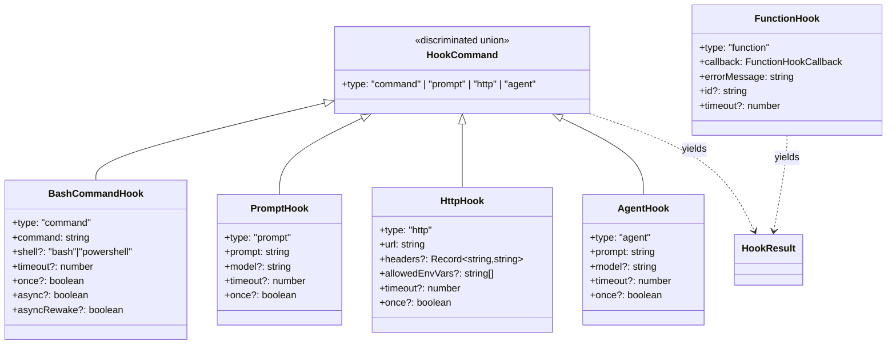
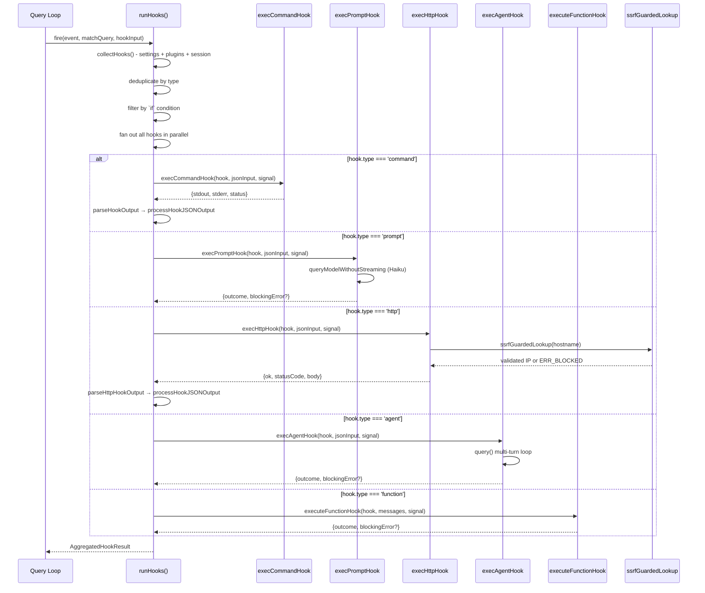
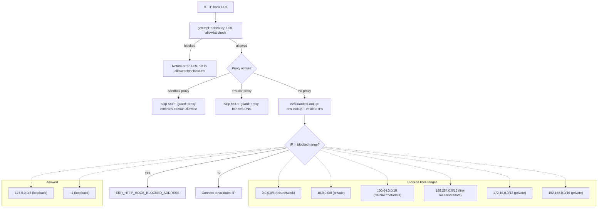

# Hook Execution: Command, Prompt, HTTP, Agent, Function

## Overview

A hook in cc is a deterministic lifecycle event handler -- a piece of code that fires at one of the 25+ well-defined points in the agent's execution and returns a verdict. The 25 lifecycle events are enumerated in `src/entrypoints/sdk/coreTypes.ts:L25-L53` and span the full agent lifecycle: `PreToolUse`, `PostToolUse`, `PostToolUseFailure`, `Notification`, `UserPromptSubmit`, `SessionStart`, `SessionEnd`, `Stop`, `StopFailure`, `SubagentStart`, `SubagentStop`, `PreCompact`, `PostCompact`, `PermissionRequest`, `PermissionDenied`, `Setup`, `TeammateIdle`, `TaskCreated`, `TaskCompleted`, `Elicitation`, `ElicitationResult`, `ConfigChange`, `WorktreeCreate`, `WorktreeRemove`, `InstructionsLoaded`, `CwdChanged`, and `FileChanged`. The schema layer (Chapter 36) defines *what* a hook looks like in `settings.json`; this chapter covers *how* each of the five execution backends actually runs: command hooks spawn a shell, prompt hooks call the model, HTTP hooks POST to a webhook, agent hooks launch a subagent, and function hooks invoke an in-process TypeScript callback.

The dispatch logic lives in the `runHooks` generator inside `src/utils/hooks.ts`. It gathers all matching hooks for an event from three sources -- persisted settings, plugin manifests, and the session hook store -- then deduplicates them by type, filters by `if` condition, and fans them out in parallel. Each hook type has its own executor module: `execCommandHook` for shell hooks (in `src/utils/hooks.ts` itself), `execPromptHook.ts` for model hooks, `execHttpHook.ts` for webhooks, `execAgentHook.ts` for subagent hooks, and `sessionHooks.ts` for the in-process function hooks. The results are aggregated into an `AggregatedHookResult` that the query loop inspects to decide whether to proceed, block, or inject additional context.

This chapter traces the full lifecycle from dispatch through each backend, examines the SSRF guard that protects HTTP hooks, and explains the session-scoped hook store that makes function hooks safe for high-concurrency workflows.

## Data structures and contracts

The five hook types share a common discriminator (`type`) and diverge in their execution payloads. The Zod schemas in `src/schemas/hooks.ts` define the persisted shape -- the types that survive a round-trip through `settings.json`:

```
// src/schemas/hooks.ts:L176-L189 — HookCommandSchema discriminated union
export const HookCommandSchema = lazySchema(() => {
  const {
    BashCommandHookSchema,
    PromptHookSchema,
    AgentHookSchema,
    HttpHookSchema,
  } = buildHookSchemas()
  return z.discriminatedUnion('type', [
    BashCommandHookSchema,
    PromptHookSchema,
    AgentHookSchema,
    HttpHookSchema,
  ])
})
```

The `HookCommandSchema` is a Zod discriminated union over the four persistable types: `command`, `prompt`, `agent`, and `http`. The `type` field is the discriminator; each variant has its own payload (`command` for shell, `prompt` for model, `url` for webhooks, `prompt` for agent). Function hooks are deliberately absent from this union because they carry a JavaScript callback that cannot be serialized to JSON. They are defined separately in `src/utils/hooks/sessionHooks.ts`:

```
// src/utils/hooks/sessionHooks.ts:L14-L31 — FunctionHook type definition
export type FunctionHookCallback = (
  messages: Message[],
  signal?: AbortSignal,
) => boolean | Promise<boolean>

export type FunctionHook = {
  type: 'function'
  id?: string
  timeout?: number
  callback: FunctionHookCallback
  errorMessage: string
  statusMessage?: string
}
```

The `FunctionHook` type is session-scoped only: it cannot be persisted to `settings.json` because `callback` is a live function reference. The `errorMessage` field supplies the blocking message when the callback returns `false`, and `timeout` defaults to 5000 ms in `addFunctionHook`. The `id` field enables targeted removal via `removeFunctionHook`.

All five types share the `HookResult` contract that the dispatch loop consumes:

```
// src/utils/hooks.ts:L338-L357 — HookResult interface
export interface HookResult {
  message?: HookResultMessage
  systemMessage?: string
  blockingError?: HookBlockingError
  outcome: 'success' | 'blocking' | 'non_blocking_error' | 'cancelled'
  preventContinuation?: boolean
  stopReason?: string
  permissionBehavior?: 'ask' | 'deny' | 'allow' | 'passthrough'
  hookPermissionDecisionReason?: string
  additionalContext?: string
  updatedInput?: Record<string, unknown>
  updatedMCPToolOutput?: unknown
  hook: HookCommand | HookCallback | FunctionHook
}
```

The `outcome` field is the single most important return value: `'success'` allows continuation, `'blocking'` halts the current tool call or turn, `'non_blocking_error'` logs the failure but proceeds, and `'cancelled'` means the hook was aborted by signal or timeout. The `permissionBehavior` and `updatedInput` fields let PreToolUse hooks override the permission decision or mutate tool input before execution.



## Control flow

### Hook dispatch

When a lifecycle event fires (PreToolUse, PostToolUse, Stop, etc.), the `runHooks` async generator inside `src/utils/hooks.ts` collects all matching hooks from three sources: persisted settings, plugin manifests, and the session hook store. After deduplication and `if`-condition filtering, it fans out all matching hooks in parallel using `Promise.allSettled` semantics.

The dispatch branches on `hook.type`. The relevant dispatch code starts at line 2147 in `src/utils/hooks.ts`. Callback hooks run first (they are the legacy API), then function hooks, then prompt hooks, agent hooks, HTTP hooks, and finally command hooks. The ordering matters for timing injection: prompt, agent, and HTTP hooks inject `durationMs` and `command` into their result attachments after completion, while command hooks collect stdout/stderr.



### Command hooks

Command hooks are the original and most feature-rich backend. The `execCommandHook` function at `src/utils/hooks.ts:L747` spawns a child process via Node's `child_process.spawn`. The shell interpreter is selected by `hook.shell` (falling back to `DEFAULT_HOOK_SHELL`), which means a hook can opt into PowerShell with `shell: 'powershell'`. On Windows, bash hooks are routed through Git Bash; PowerShell hooks use `pwsh -NoProfile -NonInteractive -Command`.

The function writes the serialized `hookInput` as JSON to the child's stdin, collects stdout/stderr, and parses the output. If the output starts with `{`, it is validated against `hookJSONOutputSchema`; otherwise it is treated as plain text. The parsed JSON is then processed by `processHookJSONOutput` (line 489), which maps fields like `decision: "approve"` to `permissionBehavior: 'allow'`, `decision: "block"` to `permissionBehavior: 'deny'`, and event-specific fields like `hookSpecificOutput.updatedInput` for PreToolUse hooks. Plain-text output (non-JSON) from exit code 0 is treated as success; exit code 2 is treated as a blocking error -- this is the protocol-level contract between cc and user-written hook scripts.

Command hooks also support `async: true` (fire-and-forget) and `asyncRewake: true` (background, but re-wake the model on exit code 2), managed by the `AsyncHookRegistry`. The async path is triggered early in `execCommandHook` (line 995): if the hook declares `async` or `asyncRewake`, the stdin is written immediately, the child is backgrounded via `executeInBackground`, and the dispatch loop receives `{outcome: 'success', backgrounded: true}` without waiting for the process to complete. For `asyncRewake` hooks specifically, the `executeInBackground` function at `src/utils/hooks.ts:L184` awaits the process result and, if the exit code is 2, enqueues a `task-notification` via `enqueuePendingNotification` that re-wakes the model.

The command hook also sets several environment variables for the child process. `CLAUDE_PROJECT_DIR` points to the stable project root (not the worktree path, which may be transient). Plugin hooks set `CLAUDE_PLUGIN_ROOT` and `CLAUDE_PLUGIN_DATA`, and plugin user-config values are exposed as `CLAUDE_PLUGIN_OPTION_*` variables (line 899). For `SessionStart`, `Setup`, `CwdChanged`, and `FileChanged` events, `CLAUDE_ENV_FILE` is set to a path where the hook can write env var definitions that get injected into subsequent bash commands.

### Prompt hooks

Prompt hooks delegate evaluation to the model. The `execPromptHook` function at `src/utils/hooks/execPromptHook.ts:L21` sends the hook's prompt (with `$ARGUMENTS` substituted) as a user message to the small-fast model (Haiku by default, overridable via `hook.model`). The system prompt instructs the model to return a JSON object with `{ok: true}` or `{ok: false, reason: "..."}`. The response is validated through `hookResponseSchema()`.

```
// src/utils/hooks/execPromptHook.ts:L62-L100 — Query the model with structured output
const response = await queryModelWithoutStreaming({
  messages: messagesToQuery,
  systemPrompt: asSystemPrompt([
    `You are evaluating a hook in Claude Code.

Your response must be a JSON object matching one of the following schemas:
1. If the condition is met, return: {"ok": true}
2. If the condition is not met, return: {"ok": false, "reason": "Reason for why it is not met"}`,
  ]),
  thinkingConfig: { type: 'disabled' as const },
  tools: toolUseContext.options.tools,
  signal: combinedSignal,
  options: {
    async getToolPermissionContext() {
      const appState = toolUseContext.getAppState()
      return appState.toolPermissionContext
    },
    model: hook.model ?? getSmallFastModel(),
    toolChoice: undefined,
    isNonInteractiveSession: true,
    hasAppendSystemPrompt: false,
    agents: [],
    querySource: 'hook_prompt',
    mcpTools: [],
    agentId: toolUseContext.agentId,
    outputFormat: {
      type: 'json_schema',
      schema: {
        type: 'object',
        properties: {
          ok: { type: 'boolean' },
          reason: { type: 'string' },
        },
        required: ['ok'],
        additionalProperties: false,
      },
    },
  },
})
```

The `queryModelWithoutStreaming` call on line 62 performs a single-shot model invocation with JSON-structured output enforcement. The `outputFormat` field uses `json_schema` mode so the model is constrained to emit valid JSON matching `{ok: boolean, reason?: string}`. The default timeout is 30 seconds (overridable via `hook.timeout`). On success, the parsed `ok` field determines the outcome: `true` yields `outcome: 'success'`, `false` yields `outcome: 'blocking'` with the model's `reason` as the `blockingError`. Non-parseable responses yield `outcome: 'non_blocking_error'`.

A critical detail: the user message is created via `createUserMessage` directly (line 42), bypassing `processUserInput`. This avoids triggering `UserPromptSubmit` hooks, which would cause infinite recursion -- a hook that fires on every user prompt would itself submit a prompt that triggers the same hook.

### HTTP hooks

HTTP hooks POST the serialized `hookInput` to a configured URL and parse the response as JSON. The `execHttpHook` function at `src/utils/hooks/execHttpHook.ts:L123` uses axios with several security measures layered on top. The default timeout is 10 minutes (`DEFAULT_HTTP_HOOK_TIMEOUT_MS` at line 12), matching the command hook timeout.

First, the URL allowlist. Before any I/O, `execHttpHook` checks the URL against `allowedHttpHookUrls` from merged settings (`src/utils/hooks/execHttpHook.ts:L137-L145`). Undefined means no restriction; an empty array blocks all; a non-empty array requires a pattern match. The pattern matching uses `urlMatchesPattern` (line 64), which converts `*` to `.*` in a regex, following the same wildcard semantics as the MCP server allowlist. This three-state semantics (undefined = open, empty = deny-all, non-empty = whitelist) mirrors the `allowedMcpServers` design.

Second, header env var interpolation. Header values can reference environment variables (`$MY_TOKEN`, `${MY_TOKEN}`) so that secrets are not stored in `settings.json`. But only variables explicitly listed in the hook's `allowedEnvVars` are resolved; all other references are replaced with empty strings. The `allowedEnvVars` list is further intersected with the policy-level `httpHookAllowedEnvVars` when the policy is set (line 165), ensuring that even if a hook declares `allowedEnvVars: ["AWS_SECRET_KEY"]`, a managed policy can strip that variable from the effective set. This prevents exfiltration of secrets via project-configured HTTP hooks:

```
// src/utils/hooks/execHttpHook.ts:L89-L108 — Interpolate env vars with allowlist
function interpolateEnvVars(
  value: string,
  allowedEnvVars: ReadonlySet<string>,
): string {
  const interpolated = value.replace(
    /\$\{([A-Z_][A-Z0-9_]*)\}|\$([A-Z_][A-Z0-9_]*)/g,
    (_, braced, unbraced) => {
      const varName = braced ?? unbraced
      if (!allowedEnvVars.has(varName)) {
        logForDebugging(
          `Hooks: env var $${varName} not in allowedEnvVars, skipping interpolation`,
          { level: 'warn' },
        )
        return ''
      }
      return process.env[varName] ?? ''
    },
  )
  return sanitizeHeaderValue(interpolated)
}
```

The `interpolateEnvVars` function on line 89 uses a regex to find `$VAR` and `${VAR}` patterns, checks membership in `allowedEnvVars`, and replaces unmatched references with empty strings. The `sanitizeHeaderValue` call (line 107) strips CR, LF, and NUL bytes to prevent HTTP header injection (CRLF injection) via malicious env var values.

Third, the SSRF guard. The `ssrfGuardedLookup` function at `src/utils/hooks/ssrfGuard.ts:L216` is passed as the `lookup` option to axios, ensuring that DNS resolution and IP validation happen atomically -- the validated IP is the one the socket connects to, with no rebinding window.

The axios configuration also includes `maxRedirects: 0` (line 206) to prevent open-redirect attacks, and `validateStatus: () => true` so that non-2xx responses are handled as normal results rather than thrown exceptions. The response is then parsed by `parseHttpHookOutput` in `src/utils/hooks.ts`, which validates the JSON body against `hookJSONOutputSchema` and dispatches the result through `processHookJSONOutput`.

When a sandbox proxy or env-var proxy is active, the SSRF guard is deliberately skipped (line 216: `lookup: sandboxProxy || envProxyActive ? undefined : ssrfGuardedLookup`). The proxy handles DNS for the target, and applying the guard would validate the proxy's own IP (which may be on a private network like 10.0.0.1:3128) rather than the target's, breaking connections to corporate proxies. The sandbox proxy enforces its own domain allowlist, providing equivalent protection.

### Agent hooks

Agent hooks are the most powerful backend: they launch a multi-turn subagent that can use tools to inspect the codebase and verify a condition. The `execAgentHook` function at `src/utils/hooks/execAgentHook.ts:L36` creates a fresh `query()` loop with a system prompt instructing the subagent to verify a stop condition and return results via a `StructuredOutput` tool.

```
// src/utils/hooks/execAgentHook.ts:L88-L105 — Build tool list and structured output tool
const structuredOutputTool = createStructuredOutputTool()

const filteredTools = toolUseContext.options.tools.filter(
  tool => !toolMatchesName(tool, SYNTHETIC_OUTPUT_TOOL_NAME),
)

const tools: Tool[] = [
  ...filteredTools.filter(
    tool => !ALL_AGENT_DISALLOWED_TOOLS.has(tool.name),
  ),
  structuredOutputTool,
]
```

The `filteredTools` on line 93 removes any existing `StructuredOutput` tool from the parent context (to avoid schema conflicts), then `ALL_AGENT_DISALLOWED_TOOLS` on line 100 prevents the subagent from spawning further subagents or entering plan mode -- a stop hook agent must not recursively trigger hook dispatch. The structured output schema is `{ok: boolean, reason?: string}`, matching the prompt hook contract.

The system prompt for the agent hook at `src/utils/hooks/execAgentHook.ts:L107-L116` is instructive: it tells the subagent it is "verifying a stop condition in Claude Code" and provides the transcript path so the agent can read conversation history to evaluate the condition. The prompt also says "Use as few steps as possible - be efficient and direct," which is important because every turn the agent takes consumes tokens and wall-clock time against the timeout.

The agent runs up to 50 turns (`MAX_AGENT_TURNS` at line 119) with `dontAsk` permission mode and a transcript-read allowlist rule (lines 140-152). The `registerStructuredOutputEnforcement` call on line 157 adds a session-level Stop hook to the agent that forces it to call the StructuredOutput tool, preventing the agent from completing without returning a result. After the agent loop finishes, `clearSessionHooks` on line 233 removes all session hooks registered for the agent's `hookAgentId`, cleaning up the enforcement hook.

When the agent produces a structured output attachment (line 214-227), it is parsed via `hookResponseSchema().safeParse`. If the result is `ok: false`, the hook returns `outcome: 'blocking'` with the reason from the structured output; if `ok: true`, it returns `outcome: 'success'`. The `thinkingConfig` is set to `{type: 'disabled'}` (line 135) because thinking tokens would waste budget on a verification task that only needs a boolean result.

The default timeout for agent hooks is 60 seconds (overridable via `hook.timeout`), and the model defaults to the small-fast model unless `hook.model` is specified.

### Function hooks

Function hooks are the simplest backend: they invoke an in-process TypeScript callback and use the return value as the verdict. The `executeFunctionHook` helper at `src/utils/hooks.ts:L4740` wraps the callback invocation in a promise with abort-signal handling:

```
// src/utils/hooks.ts:L4773-L4788 — Execute callback with abort signal
const passed = await new Promise<boolean>((resolve, reject) => {
  const onAbort = () => reject(new Error('Function hook cancelled'))
  abortSignal.addEventListener('abort', onAbort)

  Promise.resolve(hook.callback(messages, abortSignal))
    .then(result => {
      abortSignal.removeEventListener('abort', onAbort)
      resolve(result)
    })
    .catch(error => {
      abortSignal.removeEventListener('abort', onAbort)
      reject(error)
    })
})
```

The callback receives the current `messages` array and an `AbortSignal`, and returns a boolean (or a promise thereof). If `true`, the hook succeeds; if `false`, it blocks with `hook.errorMessage` as the blocking reason. Cancellation is handled by listening for the abort signal and rejecting the promise. The `Promise.resolve(hook.callback(...))` wrapper on line 4779 ensures both synchronous and asynchronous callbacks are handled uniformly -- a sync `return true` and an async `return await someCheck()` follow the same code path.

Function hooks are registered via `addFunctionHook` in `src/utils/hooks/sessionHooks.ts:L93`. The function auto-generates an ID (`function-hook-${Date.now()}-${Math.random()}`) if one is not provided, wraps the callback in a `FunctionHook` object with a default 5000 ms timeout, and stores it in the session hook Map. The `removeFunctionHook` function (line 120) enables targeted cleanup by ID, scanning all matchers for the given event and filtering out the hook with the matching `id`.

### Session hook lifecycle

Session hooks are ephemeral: they exist only in memory for the duration of a session and are cleared when the session ends. The `SessionHooksState` type at `src/utils/hooks/sessionHooks.ts:L62` uses a `Map<string, SessionStore>` keyed by session ID. The choice of `Map` over `Record` is deliberate and performance-critical:

```
// src/utils/hooks/sessionHooks.ts:L49-L61 — Why Map instead of Record
export type SessionHooksState = Map<string, SessionStore>
```

The comment on lines 49-61 explains: under high-concurrency workflows, parallel agents fire `N` `addFunctionHook` calls in one synchronous tick. With a `Record` and spread, each call costs O(N) to copy the growing map (O(N^2) total) and fires all ~30 store listeners. With `Map`, `.set()` is O(1) and returning `prev` unchanged means zero listener notifications.

The `addSessionHook` and `addFunctionHook` functions both delegate to `addHookToSession` (line 167), which mutates the Map in place via `setAppState(prev => { prev.sessionHooks.set(...); return prev })`. The return of `prev` (not a copy) is what triggers the listener-skip optimization: the store's `Object.is(next, prev)` check short-circuits, preventing the ~30 reactive listeners from being notified on every hook mutation. The `clearSessionHooks` function (line 437) deletes the session's entry from the Map entirely.

The session store also supports two read paths. `getSessionHooks` (line 302) returns command/prompt/agent/http hooks as `SessionDerivedHookMatcher` objects (filtering out function hooks, which cannot be serialized). `getSessionFunctionHooks` (line 345) returns only function hooks, keeping them in their original `FunctionHook` form with the callback intact. This separation is necessary because the dispatch loop needs the callback reference to execute function hooks, while the settings persistence layer only handles the serializable `HookCommand` types.

Skills register their hooks through `registerSkillHooks` at `src/utils/hooks/registerSkillHooks.ts:L20`. This function iterates over all hook events in a skill's frontmatter, calling `addSessionHook` for each. Hooks with `once: true` get an `onHookSuccess` callback that calls `removeSessionHook` after the first successful execution, enabling one-shot skill hooks. The `skillRoot` parameter is passed through so that `CLAUDE_PLUGIN_ROOT` is set correctly for the hook's child process environment.

### Hook event system

The `hookEvents` module at `src/utils/hooks/hookEvents.ts` provides a decoupled event bus for hook execution lifecycle. It emits three event types -- `started`, `progress`, and `response` -- to registered handlers. This is used by the SDK and remote mode to surface hook execution status without coupling to the main message stream.

```
// src/utils/hooks/hookEvents.ts:L22-L55 — Event types and handler
export type HookStartedEvent = {
  type: 'started'
  hookId: string
  hookName: string
  hookEvent: string
}

export type HookProgressEvent = {
  type: 'progress'
  hookId: string
  hookName: string
  hookEvent: string
  stdout: string
  stderr: string
  output: string
}

export type HookResponseEvent = {
  type: 'response'
  hookId: string
  hookName: string
  hookEvent: string
  output: string
  stdout: string
  stderr: string
  exitCode?: number
  outcome: 'success' | 'error' | 'cancelled'
}

export type HookExecutionEvent =
  | HookStartedEvent
  | HookProgressEvent
  | HookResponseEvent
export type HookEventHandler = (event: HookExecutionEvent) => void
```

Events are gated by `shouldEmit` (line 83), which always allows `SessionStart` and `Setup` events (for backwards compatibility) and conditionally allows all other events when `allHookEventsEnabled` is set (via the SDK `includeHookEvents` option or `CLAUDE_CODE_REMOTE` mode). The `emit` function (line 72) implements a simple buffering strategy: if no handler is registered, events are pushed onto the `pendingEvents` array (capped at `MAX_PENDING_EVENTS = 100` with FIFO eviction); when a handler does register via `registerHookEventHandler` (line 61), all buffered events are immediately drained and delivered. This prevents event loss during startup, when the handler may not yet be attached.

The `startHookProgressInterval` helper (line 124) creates a polling interval (default 1000 ms) that periodically reads the current stdout/stderr from a running command hook and emits `progress` events. The interval's `.unref()` call ensures the timer does not keep the Node.js event loop alive -- important because hooks may outlive the main query loop. The progress deduplication (`if (output === lastEmittedOutput) return`) avoids flooding the event bus with identical progress updates.

### SSRF guard

The SSRF guard at `src/utils/hooks/ssrfGuard.ts` prevents HTTP hooks from reaching cloud metadata endpoints and internal infrastructure. The `isBlockedAddress` function (line 42) checks resolved IP addresses against a blocklist of private and link-local ranges:



The guard blocks the standard private ranges (10.0.0.0/8, 172.16.0.0/12, 192.168.0.0/16), link-local (169.254.0.0/16), the "this" network (0.0.0.0/8), and CGNAT/shared address space (100.64.0.0/10) -- the last one blocks Alibaba Cloud's metadata endpoint at 100.100.100.200. Loopback (127.0.0.0/8, ::1) is intentionally allowed because local dev policy servers are a primary HTTP hook use case.

```
// src/utils/hooks/ssrfGuard.ts:L55-L86 — IPv4 blocklist check
function isBlockedV4(address: string): boolean {
  const parts = address.split('.').map(Number)
  const [a, b] = parts
  if (
    parts.length !== 4 ||
    a === undefined ||
    b === undefined ||
    parts.some(n => Number.isNaN(n))
  ) {
    return false
  }

  // Loopback explicitly allowed
  if (a === 127) return false

  // 0.0.0.0/8
  if (a === 0) return true
  // 10.0.0.0/8
  if (a === 10) return true
  // 169.254.0.0/16 — link-local, cloud metadata
  if (a === 169 && b === 254) return true
  // 172.16.0.0/12
  if (a === 172 && b >= 16 && b <= 31) return true
  // 100.64.0.0/10 — shared address space (RFC 6598, CGNAT)
  if (a === 100 && b >= 64 && b <= 127) return true
  // 192.168.0.0/16
  if (a === 192 && b === 168) return true

  return false
}
```

The IPv6 check at `isBlockedV6` (line 88) handles IPv4-mapped addresses (`::ffff:a.b.c.d`) by extracting the embedded IPv4 and delegating to `isBlockedV4`. This prevents bypasses like `::ffff:a9fe:a9fe` (which maps to 169.254.169.254). The `expandIPv6Groups` helper (line 133) normalizes IPv6 addresses into exactly 8 hex groups, handling `::` expansion and trailing dotted-decimal.

The `ssrfGuardedLookup` function (line 216) is the axios `lookup` callback. It performs DNS resolution via `dns.lookup`, validates all returned addresses against `isBlockedAddress`, and either returns the validated addresses or throws `ERR_HTTP_HOOK_BLOCKED_ADDRESS`. The guard is skipped when a proxy (sandbox or env-var) is in use, because the proxy performs its own DNS resolution and the guard would incorrectly validate the proxy's IP rather than the target's.

## Edge cases and failure modes

**Infinite recursion in prompt hooks.** If `execPromptHook` used `processUserInput` instead of `createUserMessage`, it would trigger `UserPromptSubmit` hooks, causing infinite recursion. The direct `createUserMessage` call at `src/utils/hooks/execPromptHook.ts:L42` breaks this cycle.

**HTTP hooks on SessionStart/Setup.** HTTP hooks are filtered out for `SessionStart` and `Setup` events (`src/utils/hooks.ts:L1853-L1864`). In headless mode, the sandbox ask callback deadlocks because the structured input consumer has not started yet when these hooks fire.

**Agent hook max turns.** Agent hooks cap at 50 turns (`MAX_AGENT_TURNS` at `src/utils/hooks/execAgentHook.ts:L119`). If the subagent exhausts its turns without calling the StructuredOutput tool, the hook returns `outcome: 'cancelled'` rather than erroring, because a non-blocking error would display a confusing message to the user.

**Function hooks without messages.** Function hooks require the `messages` parameter because their callbacks inspect the conversation. If `messages` is not provided, the dispatch yields `outcome: 'non_blocking_error'` with "Messages not provided for function hook" (`src/utils/hooks.ts:L2165-L2179`).

**IPv6-mapped IPv4 bypass.** The `extractMappedIPv4` function at `src/utils/hooks/ssrfGuard.ts:L187` handles the edge case where an attacker specifies an IPv4-mapped IPv6 address (e.g., `::ffff:169.254.169.254`) to bypass the v4 blocklist. The function expands the IPv6 address into 8 groups, checks the well-known-mapped prefix (80 zero bits + 0xffff), and delegates the embedded address to the v4 checker.

**Missing plugin directory.** If a plugin directory is deleted between config snapshot and hook execution, `execCommandHook` throws an error rather than spawning a command that would fail with exit code 2 (which the hook protocol interprets as "block"). This prevents an orphaned plugin from bricking `UserPromptSubmit`/`Stop` hooks until restart (`src/utils/hooks.ts:L831-L836`).

**Sandbox proxy race.** The `getSandboxProxyConfig` function in `src/utils/hooks/execHttpHook.ts:L21` uses `SandboxManager.waitForNetworkInitialization()` because in REPL mode the sandbox is fire-and-forget -- the proxy may not be ready when the first hook fires.

**Workspace trust gating.** All hooks require workspace trust before execution, enforced by `shouldSkipHookDueToTrust` at `src/utils/hooks.ts:L286`. In non-interactive (SDK) mode, trust is implicit; in interactive mode, the trust dialog must have been accepted. This check prevents historical vulnerabilities where `SessionEnd` hooks executed when a user declined the trust dialog, and `SubagentStop` hooks executing before trust was established.

**Deduplication across sources.** Hooks from settings, plugins, and skills are deduplicated by type-specific keys within the same source context. Command hooks deduplicate on `shell + command + if`; prompt and agent hooks deduplicate on `prompt + if`; HTTP hooks deduplicate on `url + if` (`src/utils/hooks.ts:L1735-L1806`). The dedup key is namespaced by `pluginRoot/skillRoot` so that cross-plugin template collisions do not drop hooks. However, function hooks and callback hooks are explicitly excluded from deduplication because each callback is a unique object reference.

**HTTP hook response parsing.** HTTP hooks must return valid JSON. If the response body is empty, it is validated as an empty JSON object `{}` (`src/utils/hooks.ts:L459-L467`). If the body does not start with `{`, the hook returns a validation error. This is stricter than command hooks, which accept plain-text output. The rationale is that HTTP hooks are structured APIs; returning HTML or plain text from a webhook endpoint almost certainly indicates a misconfiguration.

**Agent hook structured output enforcement.** The `registerStructuredOutputEnforcement` call at `src/utils/hooks/execAgentHook.ts:L157` adds a session-level Stop hook to the agent. If the agent completes its turns without calling the StructuredOutput tool, this enforcement hook intercepts the stop and forces the agent to produce output. This is a safety net: without it, an agent could stop responding without producing output, leaving the hook in an ambiguous state. The enforcement hook is cleaned up by `clearSessionHooks` on line 233 after the agent loop finishes.

## Where cc diverges from the published pattern

The HER Pattern 12 (Deterministic Lifecycle Hooks) describes shell commands at lifecycle points. cc's implementation goes substantially beyond this in several ways.

First, the five-type taxonomy (command, prompt, HTTP, agent, function) is richer than the HER's single "shell command" model. Prompt and agent hooks introduce model-in-the-loop verification, which the HER does not address. This is significant because it means hooks can make *semantic* judgments (e.g., "did the tests actually pass?") rather than just syntactic ones (e.g., "did the command exit 0?").

Second, the SSRF guard for HTTP hooks (with CGNAT-range blocking, IPv6-mapped-IPv4 extraction, and proxy-aware bypass) is a defense-in-depth measure that the HER's threat model for supply chain attacks identifies but does not prescribe a specific implementation for. The HER notes that "a malicious hook definition is equivalent to a supply chain attack" (Section 12.4); the URL allowlist and env var allowlist implement the HER's "restrict tool permissions to minimum required" mitigation for HTTP hooks specifically.

Third, the `asyncRewake` mode for command hooks is a cc-specific innovation. Standard async hooks are fire-and-forget, but `asyncRewake` hooks re-inject blocking errors back into the query loop via `enqueuePendingNotification` when the hook exits with code 2. This allows long-running verification hooks (e.g., a linter that takes 30 seconds) to block the model *after* the result is known, without freezing the query loop during execution.

Fourth, function hooks are entirely absent from the HER. They exist to support high-concurrency internal hooks (session file access guards, attribution hooks) that cannot afford process-spawning overhead. The `Map`-based `SessionHooksState` design avoids the O(N^2) listener notification problem that a naive `Record` implementation would cause under parallel agent workflows.

Fifth, the `if` condition field on hooks (using permission rule syntax like `Bash(git *)`) is a cc-specific optimization. The HER does not address the overhead of spawning hooks for non-matching events; cc's `prepareIfConditionMatcher` (`src/utils/hooks.ts:L1820`) evaluates conditions before spawning to avoid unnecessary process creation.

## Developer takeaways for building a long-running agent

When building a long-running agent, hooks are your primary extensibility mechanism for injecting deterministic checks into the agent loop. Use command hooks for fast, shell-based gates (linters, formatters, file watchers); use prompt hooks when you need the model to evaluate a semantic condition; use agent hooks for multi-step verification that requires tool access; use HTTP hooks to delegate decisions to external services; and use function hooks for zero-overhead in-process checks that must run at high frequency. Always set `timeout` on your hooks -- the defaults are generous (10 minutes for command, 30 seconds for prompt, 60 seconds for agent) and a hung hook will block the entire query loop. For HTTP hooks, always specify `allowedEnvVars` to prevent accidental secret exfiltration through header interpolation. Use the `if` field to scope hooks narrowly (e.g., `if: "Bash(git *)"` on a pre-tool hook) so you are not spawning processes or making network requests for non-matching events. Function hooks should be preferred for internal bookkeeping (access tracking, permission checks) because they avoid the process-spawning overhead entirely. Remember that `once: true` hooks auto-remove after first execution, making them ideal for one-time setup or teardown tasks. The session hook lifecycle means hooks registered by skills are automatically cleaned up when the session ends -- you do not need manual teardown for skill-registered hooks.
