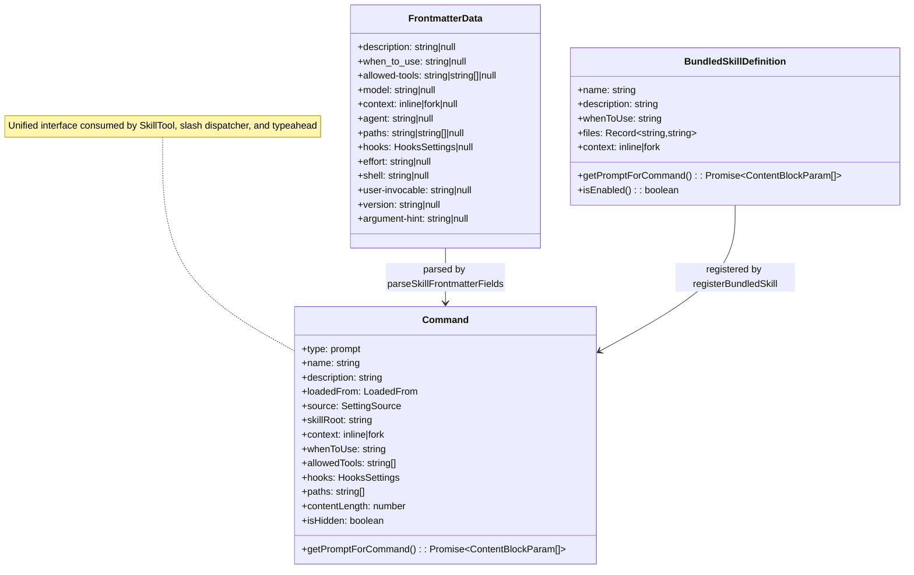
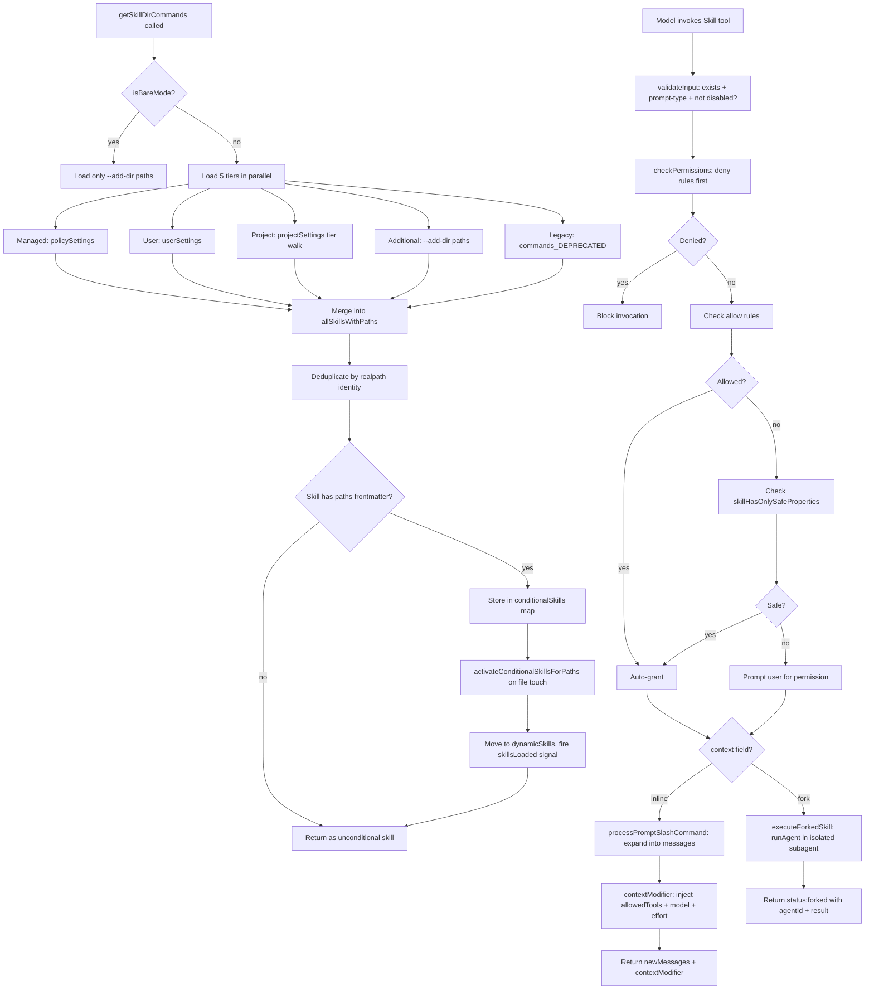

# Skills: Discovery, Frontmatter, Progressive Disclosure

## Overview

Skills are cc's reusable prompt templates -- markdown files discovered from a tiered directory hierarchy, parsed for YAML frontmatter metadata, and exposed to the model on demand. They embody two architectural principles identified in the Harness Engineering Report: progressive disclosure (HER Pattern 9) and the guide component of a harness (HER Pattern 3). Rather than stuffing every instruction into the system prompt at session start, cc loads only a skill's name, description, and `whenToUse` into the model's context. The full markdown body is injected only when the model invokes the Skill tool. This keeps the baseline tool list small and the cognitive load manageable, while preserving the ability to expand into detailed instructions when contextually needed.

The discovery pipeline spans three source files. `src/skills/loadSkillsDir.ts` (1086 lines) handles directory traversal, frontmatter parsing, deduplication, conditional activation, and dynamic runtime discovery. `src/skills/bundledSkills.ts` (220 lines) registers skills that ship compiled into the CLI binary, extracting their reference files to disk lazily on first invocation. `src/tools/SkillTool/SkillTool.ts` (1108 lines) implements the Skill tool itself -- the model-facing dispatch point that validates, authorizes, and executes skill invocations, supporting both inline and forked execution modes.

The security dimension is real. As HER Section 12.4 warns, compromised or malicious tools can exfiltrate data, modify behavior, or escalate privileges. Skills are a dual-edged configuration surface: they provide progressive disclosure that reduces cognitive load, but they also introduce a supply chain attack vector. A skill loaded on demand is code the agent trusts and executes. The same vetting discipline applied to npm packages must apply to skills. cc addresses this through multiple layers: MCP skills have shell execution disabled, the safe-properties allowlist gates auto-approval, and the permission system requires explicit user consent for skills with security-relevant capabilities.

## Data structures and contracts

### FrontmatterData -- the skill metadata schema

Every skill's SKILL.md file begins with optional YAML frontmatter delimited by `---`. The `FrontmatterData` type in `src/utils/frontmatterParser.ts` defines the full schema that the parser produces after extracting and parsing the YAML block:

```typescript
// src/utils/frontmatterParser.ts:L10-L59 — FrontmatterData type definition
export type FrontmatterData = {
  'allowed-tools'?: string | string[] | null
  description?: string | null
  type?: string | null
  'argument-hint'?: string | null
  when_to_use?: string | null
  version?: string | null
  'hide-from-slash-command-tool'?: string | null
  model?: string | null
  skills?: string | null
  'user-invocable'?: string | null
  hooks?: HooksSettings | null
  effort?: string | null
  context?: 'inline' | 'fork' | null
  agent?: string | null
  paths?: string | string[] | null
  shell?: string | null
  [key: string]: unknown
}
```

The `FrontmatterData` type is intentionally permissive. The index signature `[key: string]: unknown` allows unknown keys without breaking the parser, which is essential for forward compatibility -- a new frontmatter field added in a future release should not cause skills authored with that field to fail on older versions. Every field is optional and nullable because YAML interprets `key:` with no value as `null`.

Several fields carry security implications. The `context` field controls execution mode: `context: fork` tells the Skill tool to run the skill in an isolated subagent rather than expanding it inline. The `agent` field specifies which agent type to use when forked (e.g., `'Bash'`, `'general-purpose'`). The `hooks` field connects skills to the lifecycle hook system -- when a skill is invoked, its declared hooks are registered for the duration of the skill's execution. The `paths` field enables conditional activation, discussed in the Control flow section. The `allowed-tools` field scopes which tools the skill can use, and the `effort` field controls the thinking effort level for the agent's model.

### BundledSkillDefinition -- compiled-in skills

Bundled skills -- those compiled into the CLI binary rather than loaded from disk -- use a separate type that replaces file-based content with programmatic prompt generation:

```typescript
// src/skills/bundledSkills.ts:L15-L41 — BundledSkillDefinition type
export type BundledSkillDefinition = {
  name: string
  description: string
  aliases?: string[]
  whenToUse?: string
  argumentHint?: string
  allowedTools?: string[]
  model?: string
  disableModelInvocation?: boolean
  userInvocable?: boolean
  isEnabled?: () => boolean
  hooks?: HooksSettings
  context?: 'inline' | 'fork'
  agent?: string
  files?: Record<string, string>
  getPromptForCommand: (
    args: string,
    context: ToolUseContext,
  ) => Promise<ContentBlockParam[]>
}
```

The key difference from file-based skills is the `getPromptForCommand` function and the `files` map. Bundled skills carry their markdown content in code, not on disk. The `files` field holds reference files (schemas, templates, helper scripts) that the skill needs the model to access during execution. These are extracted lazily to a per-process temporary directory on first invocation, with the `Base directory for this skill: <dir>` header prepended so the model can use Read/Grep to find them. The `isEnabled` callback allows bundled skills to gate themselves on feature flags or environment conditions at invocation time rather than at registration time, enabling conditional availability without restarting the session.

### The Command type as the unified skill interface

Both file-based and bundled skills are eventually converted to a `Command` object (specifically `type: 'prompt'`) via the `createSkillCommand` factory. This normalization means downstream consumers -- the Skill tool, the slash command dispatcher, the typeahead system -- see a single interface regardless of provenance. The `loadedFrom` field (`'skills' | 'commands_DEPRECATED' | 'bundled' | 'mcp' | 'plugin' | 'managed'`) traces the origin for telemetry and security decisions, and the `source` field identifies the setting source tier that contributed the skill.

The `createSkillCommand` factory in `src/skills/loadSkillsDir.ts:L270-L401` is the central normalization point. It takes the parsed frontmatter fields, the raw markdown content, and metadata about the skill's provenance, and returns a `Command` whose `getPromptForCommand` closure captures all the state needed for deferred execution:

```typescript
// src/skills/loadSkillsDir.ts:L317-L401 — createSkillCommand returns Command with deferred prompt
  return {
    type: 'prompt',
    name: skillName,
    description,
    hasUserSpecifiedDescription,
    allowedTools,
    argumentHint,
    argNames: argumentNames.length > 0 ? argumentNames : undefined,
    whenToUse,
    version,
    model,
    disableModelInvocation,
    userInvocable,
    context: executionContext,
    agent,
    effort,
    paths,
    contentLength: markdownContent.length,
    isHidden: !userInvocable,
    progressMessage: 'running',
    userFacingName(): string {
      return displayName || skillName
    },
    source,
    loadedFrom,
    hooks,
    skillRoot: baseDir,
    async getPromptForCommand(args, toolUseContext) {
      let finalContent = baseDir
        ? `Base directory for this skill: ${baseDir}\n\n${markdownContent}`
        : markdownContent

      finalContent = substituteArguments(
        finalContent,
        args,
        true,
        argumentNames,
      )

      if (baseDir) {
        const skillDir =
          process.platform === 'win32' ? baseDir.replace(/\\/g, '/') : baseDir
        finalContent = finalContent.replace(/\$\{CLAUDE_SKILL_DIR\}/g, skillDir)
      }

      finalContent = finalContent.replace(
        /\$\{CLAUDE_SESSION_ID\}/g,
        getSessionId(),
      )

      if (loadedFrom !== 'mcp') {
        finalContent = await executeShellCommandsInPrompt(
          finalContent,
          {
            ...toolUseContext,
            getAppState() {
              const appState = toolUseContext.getAppState()
              return {
                ...appState,
                toolPermissionContext: {
                  ...appState.toolPermissionContext,
                  alwaysAllowRules: {
                    ...appState.toolPermissionContext.alwaysAllowRules,
                    command: allowedTools,
                  },
                },
              }
            },
          },
          `/${skillName}`,
          shell,
        )
      }

      return [{ type: 'text', text: finalContent }]
    },
  } satisfies Command
```

The `getPromptForCommand` closure performs four transformations at invocation time, not at load time. First, it prepends the `Base directory for this skill:` header when the skill has a `skillRoot` directory. Second, it substitutes positional arguments via `substituteArguments`. Third, it replaces `${CLAUDE_SKILL_DIR}` and `${CLAUDE_SESSION_ID}` template variables. Fourth, it executes inline shell commands (`!` backtick blocks) unless the skill was loaded from an MCP source. The MCP guard at `src/skills/loadSkillsDir.ts:L374-L396` is a hard security boundary: remote skills are untrusted and their markdown bodies never receive shell execution.



## Control flow

### Skill discovery: the directory walk

The entry point for skill discovery is `getSkillDirCommands`, a memoized async function in `src/skills/loadSkillsDir.ts:L638-L804`. It walks five directory tiers in parallel, each gated by a setting source check. The function is memoized via `lodash-es/memoize`, meaning the directory walk happens once per session (or until `clearSkillCaches` is called when dynamic skills are loaded).

The five tiers, in evaluation order, are:

1. **Managed** (`policySettings`): `{managedPath}/.claude/skills/` -- enterprise policy skills deployed by administrators. Disabled by the `CLAUDE_CODE_DISABLE_POLICY_SKILLS` environment variable.
2. **User** (`userSettings`): `~/.claude/skills/` -- personal skills available across all projects. Gated by `isSettingSourceEnabled('userSettings')` and `isRestrictedToPluginOnly('skills')`.
3. **Project** (`projectSettings`): `.claude/skills/` in each project directory from cwd up to home, discovered by `getProjectDirsUpToHome`.
4. **Additional** (`projectSettings`): `{--add-dir}/.claude/skills/` -- extra directories passed via the `--add-dir` CLI flag, treated as project-level skills.
5. **Legacy commands** (`commands_DEPRECATED`): `.claude/commands/` directories, supporting both single `.md` files and the `SKILL.md` directory format. Gated by `skillsLocked` because these are skills regardless of the directory they load from.

The parallel loading is structured as a single `Promise.all` over five independent async operations:

```typescript
// src/skills/loadSkillsDir.ts:L679-L714 — Parallel loading from five tiers
const [
  managedSkills,
  userSkills,
  projectSkillsNested,
  additionalSkillsNested,
  legacyCommands,
] = await Promise.all([
  isEnvTruthy(process.env.CLAUDE_CODE_DISABLE_POLICY_SKILLS)
    ? Promise.resolve([])
    : loadSkillsFromSkillsDir(managedSkillsDir, 'policySettings'),
  isSettingSourceEnabled('userSettings') && !skillsLocked
    ? loadSkillsFromSkillsDir(userSkillsDir, 'userSettings')
    : Promise.resolve([]),
  projectSettingsEnabled
    ? Promise.all(
        projectSkillsDirs.map(dir =>
          loadSkillsFromSkillsDir(dir, 'projectSettings'),
        ),
      )
    : Promise.resolve([]),
  projectSettingsEnabled
    ? Promise.all(
        additionalDirs.map(dir =>
          loadSkillsFromSkillsDir(
            join(dir, '.claude', 'skills'),
            'projectSettings',
          ),
        ),
      )
    : Promise.resolve([]),
  skillsLocked ? Promise.resolve([]) : loadSkillsFromCommandsDir(cwd),
])
```

Each tier that is disabled by policy or settings resolves immediately to an empty array via `Promise.resolve([])`, avoiding unnecessary filesystem access. The `isRestrictedToPluginOnly('skills')` check implements a plugin-only policy that prevents non-plugin skills from loading, useful in controlled environments where only vetted plugin skills are permitted.

In `--bare` mode, the entire auto-discovery pipeline is skipped. Only the `--add-dir` paths are walked, and even those are conditional on `projectSettingsEnabled`. This mode is designed for CI/CD and scripted use cases where predictable, minimal skill loading is required.

### Per-directory loading: loadSkillsFromSkillsDir

The `loadSkillsFromSkillsDir` function in `src/skills/loadSkillsDir.ts:L407-L480` handles the actual directory reading for a single path. It enforces a strict directory-only format for the `/skills/` hierarchy: each skill must be a subdirectory containing a `SKILL.md` file. Single `.md` files at the top level are explicitly rejected -- the function checks `entry.isDirectory() || entry.isSymbolicLink()` and returns `null` for regular files. This constraint ensures that skills can bundle auxiliary files (schemas, scripts, templates) alongside their SKILL.md, which would be impossible with a flat-file format.

For each valid directory entry, the function reads `SKILL.md`, parses frontmatter via `parseFrontmatter`, extracts the skill name from the directory entry (not from the frontmatter `name` field), and delegates to `parseSkillFrontmatterFields` for structured field extraction. The resulting `SkillWithPath` object pairs the `Command` with the `SKILL.md` file path for subsequent deduplication.

```typescript
// src/skills/loadSkillsDir.ts:L421-L479 — Per-entry loading in loadSkillsFromSkillsDir
  const results = await Promise.all(
    entries.map(async (entry): Promise<SkillWithPath | null> => {
      try {
        if (!entry.isDirectory() && !entry.isSymbolicLink()) {
          return null
        }

        const skillDirPath = join(basePath, entry.name)
        const skillFilePath = join(skillDirPath, 'SKILL.md')

        let content: string
        try {
          content = await fs.readFile(skillFilePath, { encoding: 'utf-8' })
        } catch (e: unknown) {
          if (!isENOENT(e)) {
            logForDebugging(`[skills] failed to read ${skillFilePath}: ${e}`, {
              level: 'warn',
            })
          }
          return null
        }

        const { frontmatter, content: markdownContent } = parseFrontmatter(
          content,
          skillFilePath,
        )

        const skillName = entry.name
        const parsed = parseSkillFrontmatterFields(
          frontmatter,
          markdownContent,
          skillName,
        )
        const paths = parseSkillPaths(frontmatter)

        return {
          skill: createSkillCommand({
            ...parsed,
            skillName,
            markdownContent,
            source,
            baseDir: skillDirPath,
            loadedFrom: 'skills',
            paths,
          }),
          filePath: skillFilePath,
        }
      } catch (error) {
        logError(error)
        return null
      }
    }),
  )

  return results.filter((r): r is SkillWithPath => r !== null)
```

Error handling follows a tiered approach. If the directory itself does not exist or is inaccessible, the outer `try/catch` at the `readdir` call returns an empty array. If an individual SKILL.md cannot be read, ENOENT errors (file not found) are silently skipped since it is normal for a directory in `/skills/` to not contain a SKILL.md, while permission errors (EACCES, EPERM, EIO) are logged at warn level for diagnosis. Any unexpected error during parsing is caught and logged at the entry level, preventing one malformed skill from blocking the entire directory load.

### Deduplication by canonical path

After loading, skills from all five tiers are merged into a single `allSkillsWithPaths` array. Deduplication uses `realpath(2)` to resolve each skill's file path to its canonical identity, handling symlinks and overlapping parent directories. The `getFileIdentity` function in `src/skills/loadSkillsDir.ts:L118-L124` performs the resolution:

```typescript
// src/skills/loadSkillsDir.ts:L118-L124 — Canonical path resolution for dedup
async function getFileIdentity(filePath: string): Promise<string | null> {
  try {
    return await realpath(filePath)
  } catch {
    return null
  }
}
```

The `realpath` approach was chosen over the traditional `(dev, ino)` inode pair because some virtual, container, and NFS filesystems report unreliable inode values (notably inode 0 on certain configurations, or precision loss on ExFAT). The comment at `src/skills/loadSkillsDir.ts:L116` references GitHub issue #13893 as the specific bug that motivated this choice.

Deduplication is first-encounter-wins: the managed tier loads before the user tier, which loads before project tiers. If the same skill file is found through multiple directory tiers (e.g., a symlink from `~/.claude/skills/my-skill` pointing to a project-level skill), the earlier tier's version is kept and the duplicate is logged for debugging.

### Conditional skills: path-driven progressive disclosure

Skills with a `paths` frontmatter field are separated into a "conditional" bucket. They are not returned to the model immediately; instead, they are stored in the `conditionalSkills` map and activated only when the model touches a file matching one of the glob patterns. The `parseSkillPaths` function in `src/skills/loadSkillsDir.ts:L159-L178` extracts and normalizes these patterns:

```typescript
// src/skills/loadSkillsDir.ts:L159-L178 — Parsing paths frontmatter for conditional activation
function parseSkillPaths(frontmatter: FrontmatterData): string[] | undefined {
  if (!frontmatter.paths) {
    return undefined
  }

  const patterns = splitPathInFrontmatter(frontmatter.paths)
    .map(pattern => {
      return pattern.endsWith('/**') ? pattern.slice(0, -3) : pattern
    })
    .filter((p: string) => p.length > 0)

  if (patterns.length === 0 || patterns.every((p: string) => p === '**')) {
    return undefined
  }

  return patterns
}
```

The `/**` suffix is stripped because the `ignore` library (gitignore-style matching) treats a directory path as matching both the path itself and everything inside it, making the glob suffix redundant. The match-all pattern `**` is treated as equivalent to having no paths filter at all, so skills with `paths: **` are treated as unconditional.

When the model touches a file, the `activateConditionalSkillsForPaths` function in `src/skills/loadSkillsDir.ts:L997-L1058` checks each conditional skill's patterns against the file path using the `ignore` library. If a match is found, the skill is promoted from the `conditionalSkills` map to the `dynamicSkills` map, its name is added to `activatedConditionalSkillNames` (which survives cache clears within a session), and the `skillsLoaded` signal fires to notify listeners such as the typeahead cache. This mechanism means a skill declaring `paths: "src/**/*.tsx"` will not appear in the model's available skills until the model reads or edits a `.tsx` file in `src/`.

### Dynamic runtime discovery

Static discovery at session start is insufficient for projects with deeply nested skill directories. When the model reads or edits a file at a path not covered by the initial directory walk, cc performs dynamic discovery. The `discoverSkillDirsForPaths` function in `src/skills/loadSkillsDir.ts:L861-L915` walks up from each file path toward cwd, checking for `.claude/skills/` directories at each level:

```typescript
// src/skills/loadSkillsDir.ts:L869-L909 — Walking up from file path to cwd
for (const filePath of filePaths) {
  let currentDir = dirname(filePath)
  while (currentDir.startsWith(resolvedCwd + pathSep)) {
    const skillDir = join(currentDir, '.claude', 'skills')
    if (!dynamicSkillDirs.has(skillDir)) {
      dynamicSkillDirs.add(skillDir)
      try {
        await fs.stat(skillDir)
        if (await isPathGitignored(currentDir, resolvedCwd)) {
          logForDebugging(
            `[skills] Skipped gitignored skills dir: ${skillDir}`,
          )
          continue
        }
        newDirs.push(skillDir)
      } catch {
        // Directory doesn't exist — already recorded above
      }
    }
    const parent = dirname(currentDir)
    if (parent === currentDir) break
    currentDir = parent
  }
}
```

The `dynamicSkillDirs` set serves as a negative cache: once a path has been checked (whether a skills directory was found or not), it is never checked again. This prevents the common case -- no skills directory exists at most file paths -- from triggering repeated `stat` calls on every Read/Write/Edit invocation. The gitignore check on line L892 is a security boundary: it prevents `node_modules/pkg/.claude/skills/` from silently loading into the agent's context. The `isPathGitignored` function handles nested `.gitignore`, `.git/info/exclude`, and global gitignore rules. It fails open outside a git repo (exit code 128 returns false), with the invocation-time trust dialog serving as the actual security gate.

Discovered directories are sorted deepest-first by path depth so that skills closer to the file take precedence. The `addSkillDirectories` function in `src/skills/loadSkillsDir.ts:L923-L975` processes them in reverse order (shallower first) so that deeper paths override, matching the "nearest wins" principle used throughout cc's configuration system.

### The Skill tool: validation, authorization, execution

The Skill tool (`src/tools/SkillTool/SkillTool.ts`) is the model-facing dispatch point that bridges skill discovery to skill execution. Its input schema is minimal -- a skill name and optional arguments:

```typescript
// src/tools/SkillTool/SkillTool.ts:L291-L298 — Input schema for the Skill tool
export const inputSchema = lazySchema(() =>
  z.object({
    skill: z
      .string()
      .describe('The skill name. E.g., "commit", "review-pr", or "pdf"'),
    args: z.string().optional().describe('Optional arguments for the skill'),
  }),
)
```

The output schema is a discriminated union: inline skills return `{success, commandName, allowedTools?, model?, status: 'inline'}` while forked skills return `{success, commandName, status: 'forked', agentId, result}`. This distinction is important because inline skills inject messages into the current conversation and return a `contextModifier`, while forked skills return a final result string from a subagent that has already completed.

#### Validation pipeline

The `validateInput` method in `src/tools/SkillTool/SkillTool.ts:L354-L430` performs four checks. First, it normalizes the skill name by stripping a leading slash (for compatibility with slash-command syntax). Second, it checks for remote canonical skill names (prefixed `_canonical_`) when the experimental skill search feature is enabled. Third, it resolves the skill name against the full command registry (including MCP skills) via `findCommand`. Fourth, it verifies that the command is a prompt-type skill without `disableModelInvocation`. Each failure returns a distinct error code (1 for invalid format, 2 for unknown skill, 4 for disabled invocation, 5 for non-prompt type, 6 for undiscovered remote skill), enabling the model to distinguish between "I typoed the name" and "this skill exists but cannot be invoked."

#### Three-tier authorization

The `checkPermissions` method in `src/tools/SkillTool/SkillTool.ts:L432-L578` implements a three-tier authorization model:

1. **Deny rules** are checked first. If any rule matches the skill name (exact match or prefix match with `:*`), the invocation is blocked immediately. Deny rules take absolute precedence.
2. **Allow rules** are checked second. Matching rules grant automatic approval with a `decisionReason` tracking which rule authorized the invocation.
3. **Safe properties auto-allow** is the fallback. The `skillHasOnlySafeProperties` function (lines L910-L933) checks whether the skill's Command object has only properties in the `SAFE_SKILL_PROPERTIES` allowlist. If a skill carries hooks, allowed-tools, or any other security-relevant property with a meaningful value, the auto-allow fails and the user is prompted.

```typescript
// src/tools/SkillTool/SkillTool.ts:L875-L933 — Safe properties allowlist and check
const SAFE_SKILL_PROPERTIES = new Set([
  'type', 'progressMessage', 'contentLength', 'argNames',
  'model', 'effort', 'source', 'pluginInfo', 'disableNonInteractive',
  'skillRoot', 'context', 'agent', 'getPromptForCommand', 'frontmatterKeys',
  'name', 'description', 'hasUserSpecifiedDescription', 'isEnabled',
  'isHidden', 'aliases', 'isMcp', 'argumentHint', 'whenToUse', 'paths',
  'version', 'disableModelInvocation', 'userInvocable', 'loadedFrom',
  'immediate', 'userFacingName',
])

function skillHasOnlySafeProperties(command: Command): boolean {
  for (const key of Object.keys(command)) {
    if (SAFE_SKILL_PROPERTIES.has(key)) continue
    const value = (command as Record<string, unknown>)[key]
    if (value === undefined || value === null) continue
    if (Array.isArray(value) && value.length === 0) continue
    if (typeof value === 'object' && !Array.isArray(value) &&
        Object.keys(value).length === 0) continue
    return false
  }
  return true
}
```

The design is deliberately conservative: new properties added to `Command` or `PromptCommand` in the future default to requiring permission until explicitly reviewed and added to the allowlist. The function also considers "meaningless" values -- undefined, null, empty arrays, and empty objects -- as safe, which prevents a skill with `allowedTools: []` from triggering a permission prompt when it grants no additional tool access.

If none of the three tiers grants approval, the user is prompted with two suggested permission rules: an exact match (`Skill: my-skill`) and a prefix match (`Skill: my-skill:*`). The prefix suggestion allows any arguments to be passed without re-prompting.

#### Inline execution and context modification

When a skill executes inline (the default mode), the `call` method delegates to `processPromptSlashCommand`, which expands the skill's markdown content into user messages. The returned `ToolResult` includes a `contextModifier` function that modifies the session context in three ways:

1. **Allowed tools injection**: The skill's `allowedTools` are merged into the `alwaysAllowRules.command` array in the tool permission context. The merge uses `new Set([...existing, ...allowedTools])` to deduplicate.
2. **Model override**: If the skill specifies a `model`, the `mainLoopModel` in the context options is replaced via `resolveSkillModelOverride`, which carries the `[1m]` suffix (extended context window) over from the session model -- otherwise a skill with `model: opus` on an `opus[1m]` session would drop the effective window to 200K tokens and trigger premature autocompact.
3. **Effort override**: If the skill specifies an `effort` level, the `effortValue` in the app state is overridden for the skill's duration.

The `contextModifier` pattern is significant: it allows the skill to temporarily elevate permissions and change model behavior without permanently modifying the session state. The modification is scoped to the tool's execution context, and the original state is restored when the skill completes.

#### Forked execution

When `command.context === 'fork'`, the Skill tool delegates to `executeForkedSkill` (lines L122-L289), which runs the skill prompt in an isolated subagent via the `runAgent` function (the same function used by the Agent tool). The forked subagent receives its own message history, token budget, and tool permissions. Progress is reported back to the parent via the `onProgress` callback, which fires for each tool use or tool result produced by the subagent.

The forked execution path produces a `status: 'forked'` result containing the `agentId` and the final `result` text extracted from the subagent's messages. After extraction, `agentMessages.length = 0` is set to release the message array from memory. The `clearInvokedSkillsForAgent` call in the `finally` block ensures that skill content registered with the compaction-preservation system is cleaned up when the subagent completes.



### Frontmatter parsing: the two-pass YAML strategy

The frontmatter parser in `src/utils/frontmatterParser.ts` implements a two-pass parsing strategy that is essential for practical skill authoring. Skill authors routinely write glob patterns like `paths: src/**/*.{ts,tsx}` without realizing that `{`, `}`, `*`, and `!` are YAML special characters. A direct parse would fail or produce incorrect results.

The `FRONTMATTER_REGEX` at `src/utils/frontmatterParser.ts:L123` matches the standard `---\n...\n---\n` delimiter pattern. The `parseFrontmatter` function first attempts a direct YAML parse. If that fails, the `quoteProblematicValues` function (lines L85-L121) rewrites the frontmatter by double-quoting values containing special characters, then retries the parse. This fallback is invisible to skill authors but critical for robustness.

The `FrontmatterData` type's `paths` field accepts both a comma-separated string and a YAML list of strings. The `splitPathInFrontmatter` function (lines L189-L232) handles both formats and expands brace patterns: `src/*.{ts,tsx}` becomes `["src/*.ts", "src/*.tsx"]`. The brace expansion is recursive, so `{a,b}/{c,d}` correctly produces `["a/c", "a/d", "b/c", "b/d"]`.

### The signal-based cache invalidation pattern

When dynamic skills are loaded (either through runtime directory discovery or conditional skill activation), downstream systems need to update their caches. Rather than coupling the skill loading system directly to each consumer, cc uses a signal-based pattern. The `skillsLoaded` signal, created via `createSignal()` at `src/skills/loadSkillsDir.ts:L832`, is emitted after every dynamic skill load. Consumers subscribe via `onDynamicSkillsLoaded`, which wraps the callback in a try/catch so a throwing listener is logged and skipped rather than aborting the `emit()` call. This pattern mirrors the one used in `growthbook.ts` and addresses a limitation of `createSignal.emit()`, which has no per-listener error handling.

## Edge cases and failure modes

**Symlink and overlapping directory deduplication.** A skill file accessible through both `~/.claude/skills/my-skill/SKILL.md` and a project-level symlink resolves to the same canonical path via `realpath(2)`. On filesystems that report unreliable inode values (inode 0 on some virtual/NFS filesystems, or precision loss on ExFAT), `realpath` is used instead of `(dev, ino)` pairs, as documented at `src/skills/loadSkillsDir.ts:L116`. The first-encounter-wins semantics mean the managed tier's version of a skill takes precedence over the user tier's version when both point to the same file.

**Missing or malformed SKILL.md.** The `loadSkillsFromSkillsDir` function skips directory entries that lack a `SKILL.md` file silently (returning `null`), but logs non-ENOENT errors (EACCES, EPERM, EIO) at warn level so permission problems are diagnosable. YAML parsing failures are similarly resilient: if both the direct parse and the `quoteProblematicValues` retry fail, the frontmatter is left as an empty object and the skill loads with default values. The description falls back to the first paragraph of the markdown body via `extractDescriptionFromMarkdown`.

**Bundled skill file extraction races.** The `extractBundledSkillFiles` function in `src/skills/bundledSkills.ts:L131-L145` uses closure-local promise memoization to prevent concurrent callers from racing into separate writes. The `extractionPromise ??= extractBundledSkillFiles(...)` pattern ensures that multiple invocations of the same skill before the first extraction completes all await the same promise. The extraction directory is created with mode `0o700` (owner-only), and individual files are written with `O_EXCL | O_NOFOLLOW` flags to prevent symlink attacks. The code deliberately does NOT unlink-and-retry on `EEXIST`, because `unlink()` follows intermediate symlinks. If extraction fails, the skill continues to work without the base-directory prefix -- degraded functionality, not a crash.

**MCP skill security boundary.** Skills loaded from MCP sources (`loadedFrom === 'mcp'`) have shell command execution disabled entirely. The `createSkillCommand` factory at `src/skills/loadSkillsDir.ts:L374-L396` skips `executeShellCommandsInPrompt` for MCP skills with an explicit comment: "Security: MCP skills are remote and untrusted -- never execute inline shell commands." This is a hard boundary, not a configurable option. The `${CLAUDE_SKILL_DIR}` variable is also meaningless for MCP skills since they have no local filesystem root.

**Legacy commands directory.** The `/commands/` directory format is deprecated (`loadedFrom: 'commands_DEPRECATED'`) but still supported for backward compatibility. It differs from `/skills/` in two ways: single `.md` files are supported (not just directory format), and the description fallback label is "Custom command" rather than "Skill". When a directory contains both a `SKILL.md` file and other `.md` files, the `transformSkillFiles` function at `src/skills/loadSkillsDir.ts:L493-L521` ensures only the `SKILL.md` is loaded, with a debug log if multiple skill files are found. The `buildNamespace` function constructs colon-separated namespace prefixes from the directory structure, so `commands/review/pr.md` becomes `review:pr`.

**Remote canonical skill loading.** The experimental remote skill feature (gated by `feature('EXPERIMENTAL_SKILL_SEARCH')` and `process.env.USER_TYPE === 'ant'`) loads skills from a remote registry. The `executeRemoteSkill` function in `src/tools/SkillTool/SkillTool.ts:L969-L1108` fetches the SKILL.md content from a URL, strips its frontmatter, and injects it as a user message. Remote skills bypass the slash-command expansion pipeline entirely -- no `!command` substitution, no `$ARGUMENTS` interpolation -- because they are declarative markdown. They are registered with `addInvokedSkill` so their content survives compaction, matching the preservation behavior of local skills.

## Where cc diverges from the published pattern

HER Pattern 9 (Progressive Tool Expansion) describes starting with fewer than 20 tools and activating more on demand. cc's skill system implements this principle but diverges in an important way: skills are not tools. They are prompt templates that expand into the conversation as user messages, not tool definitions that add callable endpoints. The Skill tool itself is the single tool; each skill is a named prompt the model can request. This means the tool list stays constant (one Skill tool) while the prompt space grows on demand. The advantage is that the model never needs to learn new tool schemas mid-session. The disadvantage is that the model must understand the skill's `whenToUse` description well enough to know when to invoke it, which is a prompt-engineering challenge rather than a tool-discovery challenge.

The conditional skills mechanism (path-driven activation) is not mentioned in HER. It adds a sensor-driven dimension to progressive disclosure: the harness observes which files the agent touches and activates relevant skills reactively. This is closer to the "sensor" component of a harness (HER Pattern 3) than to progressive tool expansion per se. The model does not request activation; the harness performs it automatically based on observed behavior. The activated skill then becomes available for the model to invoke on subsequent turns.

The safe-properties auto-allow system for the Skill tool's permission check diverges from HER Pattern 10 (Command Risk Classification) by using a property-allowlist approach rather than a risk-band classifier. A skill with only safe properties (name, description, whenToUse) is auto-approved; any skill with hooks, allowedTools, or other security-relevant properties requires explicit user consent. This is more coarse-grained than the bash command classifier's safe/risky/destructive bands but appropriate for the skill surface where the risk vector is the skill's declared capabilities, not its argument string.

The bundled skill extraction pattern -- lazy, once-per-process, with `O_EXCL` and `0o700` protections -- represents a security posture that goes beyond what HER prescribes. The per-process nonce in `getBundledSkillsRoot()` is the primary defense against pre-created symlinks, and the explicit `0o700`/`0o600` modes keep the nonce subtree owner-only even on systems with `umask=0`. This defense-in-depth approach (nonce + permissions + O_NOFOLLOW) acknowledges that a single defensive layer can be bypassed.

## Developer takeaways for building a long-running agent

Skills demonstrate that progressive disclosure is not merely a performance optimization but a design requirement for agents that accumulate context over long sessions. Loading every prompt template at session start would consume tens of thousands of tokens before the first user message. The two-phase approach -- frontmatter-only at discovery, full content at invocation -- keeps the baseline footprint proportional to skill count, not skill size. For builders, the critical insight is that the discovery metadata (name, description, whenToUse) must be rich enough for the model to decide when to invoke the skill, yet compact enough to scale to dozens of skills without overwhelming the context window. The conditional activation pattern -- gating skills on file-path patterns -- generalizes beyond cc: any agent that operates on a filesystem can benefit from reactively loading instructions relevant to the files being touched, rather than front-loading all instructions for all possible file types. The safe-properties permission model shows that a property-allowlist approach, where new properties default to requiring permission, is a practical way to handle the evolving surface area of a skill system without auditing every addition manually. The bundled skill extraction pattern -- lazy, once-per-process, with `O_EXCL` and `0o700` protections -- is a reusable template for safely materializing embedded resources in any agent that ships compiled binaries. The signal-based cache invalidation pattern decouples skill loading from downstream consumers, preventing a growing list of subscribers from creating tight coupling or circular dependencies.