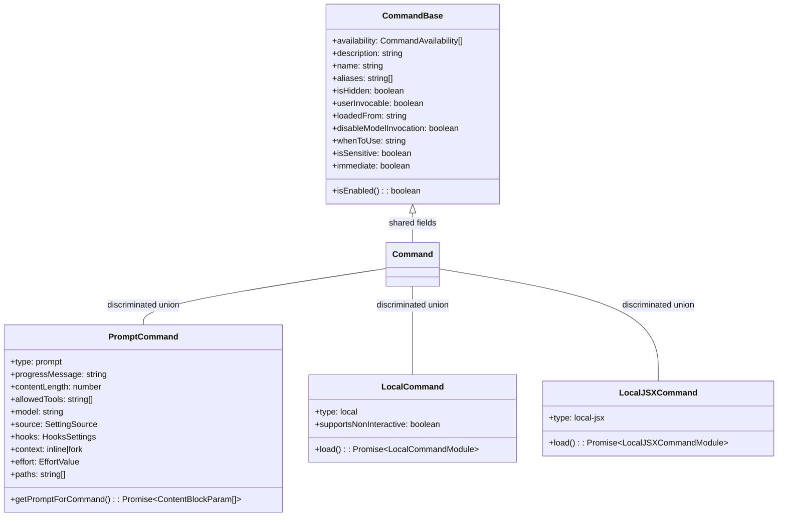
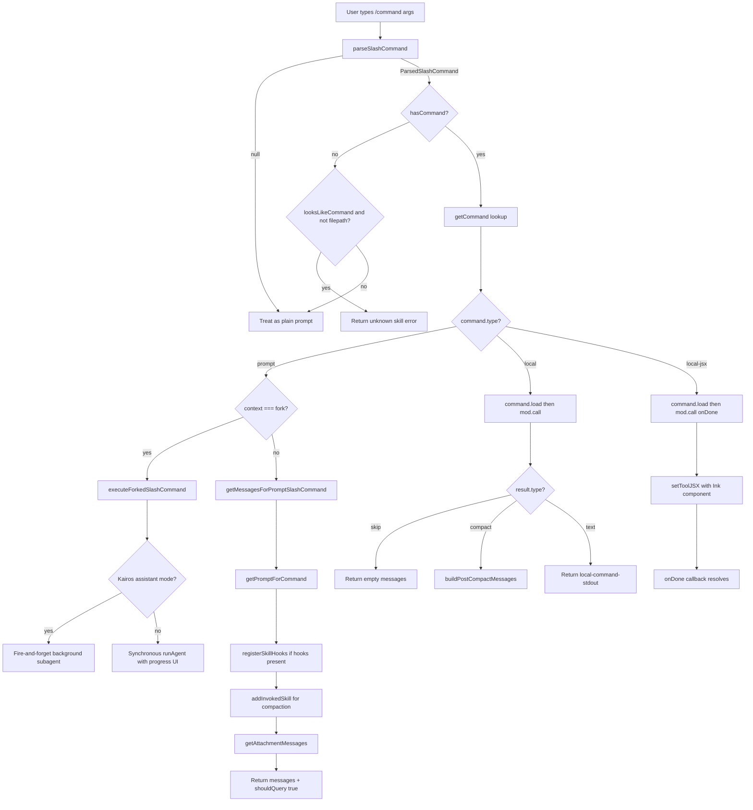

# Slash Commands: 90+ Commands and the Registry

## Overview

The slash command system is the primary interaction surface through which users invoke structured operations inside the cc terminal. When a user types `/compact`, `/commit`, or `/skills`, they are engaging a registry that resolves over 90 built-in commands alongside dynamically loaded skills, plugin commands, and MCP-provided tools. The registry is not a static lookup table -- it is a live, memoized assembly line that consults feature flags, authentication state, plugin availability, and filesystem-discovered skill directories on every resolution cycle.

Three source files form the backbone of this system. `src/commands.ts` defines the central registry: the `COMMANDS()` memoized array, the `loadAllCommands()` async loader, and the `getCommands()` public API that filters by availability and enablement. `src/utils/slashCommandParsing.ts` provides the lightweight parser that splits a raw input string into command name, arguments, and an MCP flag. `src/utils/processUserInput/processSlashCommand.tsx` is the dispatch pipeline: it parses the input, resolves the command, and routes execution to one of three codepaths based on command type (`prompt`, `local`, or `local-jsx`).

The architecture embodies two HER patterns. HER section 9, Progressive Disclosure, describes the principle that agents should access specific instructions and tools only when contextually needed. The slash command registry implements this through skill commands that are discovered on demand from `~/.claude/skills/` and plugin directories, and through the `getSkillToolCommands` filter that only surfaces prompt-type commands with descriptions to the model. HER section 3.4, Lifecycle Hooks, describes how skills can register hooks at invocation time. When a `prompt`-type command carries a `hooks` field, `processSlashCommand` calls `registerSkillHooks` to wire those lifecycle events into the session, creating a tight coupling between command dispatch and the hook system described in Chapter 36.

## Data structures and contracts

The `Command` type is the central contract. It is a discriminated union of three variants: `PromptCommand`, `LocalCommand`, and `LocalJSXCommand`, all sharing a `CommandBase` common field set.

```typescript
// src/types/command.ts:L175-L206
export type CommandBase = {
  availability?: CommandAvailability[]
  description: string
  hasUserSpecifiedDescription?: boolean
  isEnabled?: () => boolean
  isHidden?: boolean
  name: string
  aliases?: string[]
  isMcp?: boolean
  argumentHint?: string
  whenToUse?: string
  version?: string
  disableModelInvocation?: boolean
  userInvocable?: boolean
  loadedFrom?:
    | 'commands_DEPRECATED'
    | 'skills'
    | 'plugin'
    | 'managed'
    | 'bundled'
    | 'mcp'
  kind?: 'workflow'
  immediate?: boolean
  isSensitive?: boolean
  userFacingName?: () => string
}

export type Command = CommandBase &
  (PromptCommand | LocalCommand | LocalJSXCommand)
```

The `CommandBase` fields encode a rich set of capabilities and constraints. The `availability` array gates commands to specific authentication contexts -- `'claude-ai'` for OAuth subscribers, `'console'` for direct API key users. The `isEnabled` callback allows runtime checks against feature flags and environment variables. The `loadedFrom` discriminator tracks the provenance of each command across six sources, which determines display formatting and permission scoping. The `userInvocable` flag, when `false`, restricts a command to model-only invocation via the Skill tool, implementing a key progressive disclosure boundary. The `whenToUse` field, drawn from the skill specification, provides detailed usage scenarios that the Skill tool surfaces to the model. The `isSensitive` flag, when true, causes the dispatch pipeline to redact arguments from the conversation history, replacing them with `***` in the user-visible transcript.

The three command variants differ in their execution model. `PromptCommand` expands into model-visible content blocks via `getPromptForCommand`. `LocalCommand` performs a synchronous side effect and returns a `LocalCommandResult` discriminated union (`text`, `compact`, or `skip`). `LocalJSXCommand` renders an interactive Ink UI component and communicates completion through an `onDone` callback.

```typescript
// src/types/command.ts:L25-L57
export type PromptCommand = {
  type: 'prompt'
  progressMessage: string
  contentLength: number
  argNames?: string[]
  allowedTools?: string[]
  model?: string
  source: SettingSource | 'builtin' | 'mcp' | 'plugin' | 'bundled'
  pluginInfo?: {
    pluginManifest: PluginManifest
    repository: string
  }
  disableNonInteractive?: boolean
  hooks?: HooksSettings
  skillRoot?: string
  context?: 'inline' | 'fork'
  agent?: string
  effort?: EffortValue
  paths?: string[]
  getPromptForCommand(
    args: string,
    context: ToolUseContext,
  ): Promise<ContentBlockParam[]>
}
```

The `PromptCommand` type carries fields that connect slash commands to several other subsystems. The `allowedTools` field grants temporary tool permissions for the duration of the skill's execution, a mechanism that mirrors the permission expansion described in Chapter 32. The `hooks` field enables skill-scoped lifecycle hooks, bridging to the system covered in Chapter 36. The `context` field determines whether a skill runs inline (expanding into the current conversation) or as a forked subagent with isolated context, connecting to the fork architecture of Chapter 19. The `paths` glob patterns enable progressive visibility: skills with `paths` set only appear after the model touches matching files. The `pluginInfo` field carries plugin metadata through to the analytics pipeline, where the dispatch function extracts the plugin name, marketplace, and repository for telemetry events. The `effort` field allows a skill to specify a reasoning effort level that gets merged into the agent definition when the command runs in forked mode.

```typescript
// src/utils/slashCommandParsing.ts:L5-L25
export type ParsedSlashCommand = {
  commandName: string
  args: string
  isMcp: boolean
}

export function parseSlashCommand(input: string): ParsedSlashCommand | null {
  const trimmedInput = input.trim()
  if (!trimmedInput.startsWith('/')) {
    return null
  }
  const withoutSlash = trimmedInput.slice(1)
  const words = withoutSlash.split(' ')
  if (!words[0]) {
    return null
  }
  let commandName = words[0]
  let isMcp = false
  let argsStartIndex = 1
  if (words.length > 1 && words[1] === '(MCP)') {
    commandName = commandName + ' (MCP)'
    isMcp = true
    argsStartIndex = 2
  }
  const args = words.slice(argsStartIndex).join(' ')
  return { commandName, args, isMcp }
}
```

The `parseSlashCommand` function is deliberately minimal: 60 lines of pure string manipulation with no side effects. It strips the leading slash, splits on whitespace, detects the `(MCP)` sentinel in the second position for MCP-provided commands, and joins the remaining words back into an args string. The MCP sentinel is a display convention: when the typeahead renders MCP tool names, it appends `(MCP)` to distinguish them from built-in commands. The parser absorbs this convention so that `/mcp:tool (MCP) arg1 arg2` is parsed as command name `mcp:tool (MCP)` with args `arg1 arg2`. The `argsStartIndex` variable shifts from 1 to 2 when the MCP sentinel is detected, ensuring that `(MCP)` itself is not included in the arguments. This parser is the first gate in the dispatch pipeline -- if `parseSlashCommand` returns `null`, the input is treated as a plain user prompt rather than a command. The parser's purity makes it straightforward to test in isolation and guarantees that no parsing error can corrupt session state.



The class diagram shows how `Command` is a union type that shares the `CommandBase` field set across three variants. Each variant has a distinct execution strategy: `PromptCommand` generates model content, `LocalCommand` returns structured results, and `LocalJSXCommand` renders interactive UI. The `type` discriminator on each variant enables the dispatch logic in `getMessagesForSlashCommand` to route correctly via a `switch` statement. The `LocalCommand` and `LocalJSXCommand` variants both use lazy loading through their `load()` method, which defers importing heavy dependencies until the command is actually invoked -- an important optimization when the registry contains 90+ commands but a typical session uses only a handful.

## Control flow

The slash command pipeline begins when the user submits input that starts with `/`. The REPL's input handler delegates to `processSlashCommand`, which orchestrates parsing, lookup, validation, and execution in a layered sequence.



The flowchart traces the complete dispatch path from raw input to message production. The critical branching point is the `command.type` discriminator at `getMessagesForSlashCommand`. Each branch produces different message shapes and different values of `shouldQuery`, which determines whether the model is invoked after the command completes. Prompt commands always set `shouldQuery: true` because their purpose is to inject instructions into the model's context. Local and local-jsx commands set `shouldQuery: false` because they produce side effects and display output without requiring model processing.

The entry function `processSlashCommand` at `src/utils/processUserInput/processSlashCommand.tsx:L309` performs the initial parse and validation. It calls `parseSlashCommand` to split the input, then `hasCommand` to check the registry. When the command is not found, the function applies a heuristic -- `looksLikeCommand` -- to distinguish genuine command attempts from file paths. The `looksLikeCommand` function at `src/utils/processUserInput/processSlashCommand.tsx:L304-L308` checks that the command name contains only alphanumeric characters, colons, hyphens, and underscores, rejecting anything that looks like a Unix path.

```typescript
// src/utils/processUserInput/processSlashCommand.tsx:L304-L308
export function looksLikeCommand(commandName: string): boolean {
  // Command names should only contain [a-zA-Z0-9:_-]
  // If it contains other characters, it's probably a file path or other input
  return !/[^a-zA-Z0-9:\-_]/.test(commandName);
}
```

The `looksLikeCommand` guard prevents false-positive command errors. When a user types `/var/log/syslog`, the regex detects the forward slashes in the path segments and returns `false`, causing the input to be treated as a plain prompt. Without this guard, every Unix path starting with `/` would trigger the "Unknown skill" error message. The negative character class `[^a-zA-Z0-9:\-_]` also rejects inputs containing dots (like `/etc/passwd`), spaces (which the parser already consumed), and any Unicode characters.

Once the command is resolved, `getMessagesForSlashCommand` at `src/utils/processUserInput/processSlashCommand.tsx:L525` dispatches based on `command.type`. Before entering the switch, it checks `command.userInvocable`: if the flag is `false`, the function returns immediately with a message telling the user that only the model can invoke this skill. This enforcement at the dispatch level ensures that model-only skills cannot be bypassed by typing their name directly.

The `prompt` branch is the most complex because it handles two sub-branches: inline execution and forked execution. When `command.context === 'fork'`, the function delegates to `executeForkedSlashCommand`, which creates a subagent via `runAgent` with isolated context. The forked path has a further split: in Kairos assistant mode (scheduled tasks), the subagent runs as a fire-and-forget background process that re-enqueues its result via `enqueuePendingNotification`, while in normal mode it runs synchronously with a progress spinner.

```typescript
// src/utils/processUserInput/processSlashCommand.tsx:L550-L573
      case 'local-jsx':
        {
          return new Promise<SlashCommandResult>(resolve => {
            let doneWasCalled = false;
            const onDone = (result?: string, options?: {
              display?: CommandResultDisplay;
              shouldQuery?: boolean;
              metaMessages?: string[];
              nextInput?: string;
              submitNextInput?: boolean;
            }) => {
              doneWasCalled = true;
              if (options?.display === 'skip') {
                void resolve({
                  messages: [],
                  shouldQuery: false,
                  command,
                  nextInput: options?.nextInput,
                  submitNextInput: options?.submitNextInput
                });
                return;
              }
              // Meta messages are model-visible but hidden from the user
              const metaMessages = (options?.metaMessages ?? []).map(
                (content: string) => createUserMessage({ content, isMeta: true })
              );
```

The `local-jsx` branch wraps execution in a `Promise` that resolves when the command calls `onDone`. This callback-driven pattern accommodates Ink's asynchronous rendering model: the command's `call()` function returns a React element that is rendered via `setToolJSX`, and the command signals completion by calling `onDone` from within the rendered component. The `doneWasCalled` guard prevents a race condition where `onDone` fires during `mod.call()` before the JSX return value is processed, which would leave a stale `isLocalJSXCommand` flag blocking the queue processor. The `onDone` callback accepts an options bag with a `display` field that controls transcript rendering: `'skip'` produces no messages, `'system'` renders output as a system message rather than a user bubble, and the default renders the command input and output as user-visible transcript entries.

The `local` branch at `src/utils/processUserInput/processSlashCommand.tsx:L657-L722` follows a simpler synchronous pattern. It calls `command.load()` to lazy-load the module, then `mod.call(args, context)` to execute it. The return value is a `LocalCommandResult` discriminated union with three variants: `skip` (return empty messages), `compact` (invoke the full compaction pipeline), and `text` (wrap the result in `<local-command-stdout>` tags). The `compact` variant is the most involved: it appends slash command messages to the compaction result's `messagesToKeep` array and then calls `buildPostCompactMessages` to reconstruct the conversation, as described in Chapter 28. Error results are wrapped in `<local-command-stderr>` tags for visual distinction in the transcript.

```typescript
// src/utils/processUserInput/processSlashCommand.tsx:L657-L677
      case 'local':
        {
          const displayArgs = command.isSensitive && args.trim() ? '***' : args;
          const userMessage = createUserMessage({
            content: prepareUserContent({
              inputString: formatCommandInput(command, displayArgs),
              precedingInputBlocks
            })
          });
          try {
            const syntheticCaveatMessage = createSyntheticUserCaveatMessage();
            const mod = await command.load();
            const result = await mod.call(args, context);
            if (result.type === 'skip') {
              return {
                messages: [],
                shouldQuery: false,
                command
              };
            }
```

The `local` branch applies argument redaction when `command.isSensitive` is true. The `displayArgs` variable replaces the real args with `***` for display purposes, while the original `args` string is still passed to `mod.call()`. This separation ensures that sensitive inputs like API keys typed after `/login` are redacted from the transcript without breaking the command's actual functionality. The `formatCommandInput` helper wraps the command name and display args in XML metadata tags (`<command_message>` and `<command_name>`) that the transcript renderer uses for consistent formatting.

The `prompt` branch for inline execution calls `getMessagesForPromptSlashCommand` at `src/utils/processUserInput/processSlashCommand.tsx:L827`. This function orchestrates several steps: it calls `command.getPromptForCommand` to generate the content blocks, registers skill hooks if the command defines them, records the skill invocation for compaction preservation via `addInvokedSkill`, and collects attachment messages from `@`-mentions in the skill content. The resulting messages are tagged with metadata XML tags (`<command_message>`, `<command_name>`) that the transcript renderer uses for display formatting. The function also passes the skill content through `getAttachmentMessages` with the `skipSkillDiscovery` flag set to true, preventing the skill's own content from triggering recursive skill discovery -- a critical guard given that some skill files can exceed 100KB.

The command registry itself lives in `src/commands.ts`. The `COMMANDS()` function at `src/commands.ts:L258-L346` is a `lodash.memoize`-wrapped closure that returns the static array of built-in commands. This array is populated at module scope through dozens of imports from `src/commands/*/index.js`. Conditional commands -- those gated behind feature flags -- are loaded via dynamic `require()` calls that the bundler can eliminate in external builds. For example, the `proactive` command at `src/commands.ts:L62-L65` is only loaded when the `PROACTIVE` or `KAIROS` feature flag is active, and the `bridge` command at `src/commands.ts:L73-L75` requires `BRIDGE_MODE`. The `INTERNAL_ONLY_COMMANDS` list at `src/commands.ts:L225-L254` collects commands that are stripped from the external build entirely, including `backfillSessions`, `breakCache`, `mockLimits`, and `agentsPlatform`.

```typescript
// src/commands.ts:L449-L469
const loadAllCommands = memoize(async (cwd: string): Promise<Command[]> => {
  const [
    { skillDirCommands, pluginSkills, bundledSkills, builtinPluginSkills },
    pluginCommands,
    workflowCommands,
  ] = await Promise.all([
    getSkills(cwd),
    getPluginCommands(),
    getWorkflowCommands ? getWorkflowCommands(cwd) : Promise.resolve([]),
  ])

  return [
    ...bundledSkills,
    ...builtinPluginSkills,
    ...skillDirCommands,
    ...workflowCommands,
    ...pluginCommands,
    ...pluginSkills,
    ...COMMANDS(),
  ]
})
```

The `loadAllCommands` function at `src/commands.ts:L449` assembles the full command list from five sources in a specific precedence order. Bundled skills (shipped with cc) come first, followed by built-in plugin skills, skill directory commands (from `~/.claude/skills/`), workflow commands, plugin commands, plugin skills, and finally the static built-in `COMMANDS()`. This ordering means that skills discovered from the filesystem take precedence over built-in commands of the same name, enabling user customization without modifying the source. The three disk-bound sources (`getSkills`, `getPluginCommands`, `getWorkflowCommands`) are loaded in parallel via `Promise.all`, and each individual loader catches its own errors to prevent a failing plugin from breaking the entire command registry.

The public API `getCommands` at `src/commands.ts:L476` wraps `loadAllCommands` with two post-processing steps: it filters out commands that fail `meetsAvailabilityRequirement` or `isCommandEnabled`, and it injects dynamically discovered skills (skills that appear during file operations) with deduplication against the base list. The availability check at `src/commands.ts:L417-L443` is deliberately not memoized because auth state can change mid-session (for example, after `/login`), so it must be re-evaluated on every call.

```typescript
// src/commands.ts:L417-L443
export function meetsAvailabilityRequirement(cmd: Command): boolean {
  if (!cmd.availability) return true
  for (const a of cmd.availability) {
    switch (a) {
      case 'claude-ai':
        if (isClaudeAISubscriber()) return true
        break
      case 'console':
        if (
          !isClaudeAISubscriber() &&
          !isUsing3PServices() &&
          isFirstPartyAnthropicBaseUrl()
        )
          return true
        break
      default: {
        const _exhaustive: never = a
        void _exhaustive
        break
      }
    }
  }
  return false
}
```

The `meetsAvailabilityRequirement` function uses an exhaustive switch with a `never` default to ensure that every `CommandAvailability` value is handled. The `'console'` case is the most restrictive: it requires the user to be on a first-party Anthropic base URL (`api.anthropic.com`), not a claude.ai subscriber, and not using third-party services (Bedrock, Vertex, Foundry). This triple-negative logic distinguishes direct API key customers from gateway users who proxy through custom base URLs. Commands without an `availability` field default to universally available, which covers the majority of built-in commands.

The registry also provides two filtered views for the model's skill tools. `getSkillToolCommands` at `src/commands.ts:L563-L581` returns all prompt-type commands that the model can invoke, filtering out built-in commands (which have `source === 'builtin'`), commands with `disableModelInvocation` set, and plugin/MCP commands without explicit descriptions. `getSlashCommandToolSkills` at `src/commands.ts:L586-L608` is a stricter filter that requires commands to come from `skills`, `plugin`, or `bundled` sources and to have either a user-specified description or a `whenToUse` field. Both functions are memoized by `cwd` because loading is expensive, and both return empty arrays on failure rather than throwing, treating skills as non-critical.

The lookup functions `findCommand`, `hasCommand`, and `getCommand` at `src/commands.ts:L688-L718` resolve command names against the registry. The `findCommand` function matches against three identifiers: the command's `name` field, the result of `getCommandName()` (which may differ from `name` when `userFacingName` is overridden), and the `aliases` array. The `getCommand` function wraps `findCommand` and throws a `ReferenceError` with a sorted list of all available commands when the lookup fails, providing actionable debugging information rather than a silent `undefined`.

The registry also defines two safety sets for remote execution contexts. `REMOTE_SAFE_COMMANDS` at `src/commands.ts:L619-L637` lists commands that are safe to use in `--remote` mode, pre-filtering the typeahead before the CCR initialization message arrives. `BRIDGE_SAFE_COMMANDS` at `src/commands.ts:L651-L660` lists `local`-type commands that produce text output safe for the mobile/web bridge. The `isBridgeSafeCommand` predicate at `src/commands.ts:L672-L676` applies a three-tier policy: `prompt` commands are allowed by construction (they expand to model text), `local` commands require explicit opt-in via the set, and `local-jsx` commands are blocked because they render terminal-only Ink UI.

## Edge cases and failure modes

**File paths disguised as commands.** When a user types `/tmp/output.log`, the leading `/` triggers the command parser, but the `looksLikeCommand` heuristic rejects it because the second segment contains a `/`. However, the code also calls `getFsImplementation().stat()` at `src/utils/processUserInput/processSlashCommand.tsx:L337-L341` to check whether the input resolves to an actual file path. This dual check prevents both false positives (treating `/tmp/output.log` as a failed command) and false negatives (treating `/my-custom-command` as a file path when no such file exists). If the stat succeeds, the input is treated as a plain prompt; if it fails and `looksLikeCommand` returns true, the "Unknown skill" error is shown.

**Dynamic skill deduplication.** The `getCommands` function at `src/commands.ts:L476` must handle the case where dynamic skills (discovered during file operations) overlap with skills already loaded from disk. The deduplication logic at `src/commands.ts:L492-L498` uses a `Set` of base command names to filter out duplicates, then inserts unique dynamic skills at the boundary between plugin skills and built-in commands. This insertion point is found by scanning `baseCommands` for the first entry whose name appears in `COMMANDS()`, ensuring that user-discovered skills appear in the typeahead alongside loaded skills rather than after all built-in commands.

**Cache invalidation across memoization layers.** The `clearCommandMemoizationCaches` function at `src/commands.ts:L523-L532` must clear not only `loadAllCommands` and `getSkillToolCommands` but also the `getSkillIndex` cache in the skill search module. The comment at `src/commands.ts:L527-L531` explains the subtlety: lodash's `memoize` returns cached results without reaching the inner functions, so clearing only the inner caches is a no-op for the outer memoization layer. The skill index cache sits on top of `getSkillToolCommands` and `getCommands`, and it must be cleared explicitly via `clearSkillIndexCache`. The `clearCommandsCache` function at `src/commands.ts:L534-L539` provides a comprehensive flush that clears memoization caches, plugin caches, and skill caches in sequence.

**The `local-jsx` done guard.** The `doneWasCalled` boolean at `src/utils/processUserInput/processSlashCommand.tsx:L554-L629` prevents a race condition where a `local-jsx` command calls `onDone` during `mod.call()` (the early-exit path) and then the `.then()` chain attempts to set `isLocalJSXCommand` on `setToolJSX` after the outer promise has already resolved. Without this guard, the `isLocalJSXCommand` flag would remain `true` permanently, blocking the queue processor and text input focus. The comment at line 623 explains that the `.then()` chain is fire-and-forget -- the outer Promise resolves when `onDone` is called, so `executeUserInput` may have already run its `setToolJSX({clearLocalJSX: true})` before the chain reaches `setToolJSX`.

**Forked command MCP settle timing.** The `executeForkedSlashCommand` function includes a polling loop at `src/utils/processUserInput/processSlashCommand.tsx:L141-L147` that waits for MCP clients to reach a non-pending state before launching a background subagent. The comment explains that scheduled tasks fire at startup and all N drain within milliseconds, capturing the tool list before MCP connects. The sync path accidentally avoided this -- tasks serialized, so task N's drain happened after task N-1's 30-second run, by which time MCP was up. The poll interval is 200ms with a 10-second deadline (`MCP_SETTLE_TIMEOUT_MS`), covering slow SSE handshakes without blocking indefinitely. After the settle period, the function refreshes the tool list via `context.options.refreshTools?.()` to ensure the subagent sees MCP-provided tools.

**Unknown command arg preservation.** When a command is not found but `looksLikeCommand` returns true, the error response at `src/utils/processUserInput/processSlashCommand.tsx:L348-L361` includes the parsed args as a system warning message. The comment references `gh-32591`: preserving args allows the user to copy and resubmit without retyping. The system warning is UI-only and filtered before API submission, so it does not consume model context. The args are passed as `createSystemMessage(\`Args from unknown skill: ${parsedArgs}\`, 'warning')`, which renders as a yellow warning line in the transcript.

**Compact result timestamp ordering.** The `local` branch for compact results at `src/utils/processUserInput/processSlashCommand.tsx:L682-L704` sets the timestamp of the last synthetic message to `Date.now() + 100` (100ms in the future). This is a performance optimization for `--resume` mode, which looks at the latest timestamp to determine which message to resume from. Without the offset, synthetic messages created during compaction would have the same timestamp as the preceding user message, causing `--resume` to resume from the wrong position. The comment notes this is particularly important for SDK and `-p` mode.

**Sensitive argument redaction.** The `local` branch at `src/utils/processUserInput/processSlashCommand.tsx:L659` applies argument redaction when `command.isSensitive` is true. The `displayArgs` variable replaces the real args with `***` for display, while the original `args` string is still passed to `mod.call()`. This separation ensures that sensitive inputs like API keys typed after `/login` are redacted from the transcript without breaking the command's actual functionality. The `formatCommandInput` helper wraps the display args in XML metadata tags, so the redaction applies uniformly to both the command input message and the typeahead history.

**Loader failure isolation.** The `loadAllCommands` function at `src/commands.ts:L449` runs its three disk-bound loaders in parallel via `Promise.all`, but each individual loader (`getSkills`, `getPluginCommands`, `getWorkflowCommands`) catches its own errors internally. The `getSkills` function at `src/commands.ts:L353-L398` wraps each sub-loader in a `.catch()` that logs the error and returns an empty array, with a defensive outer try-catch that returns all-empty results as a last resort. This isolation means a failing skill directory or a broken plugin cannot prevent the core built-in commands from loading.

## Where cc diverges from the published pattern

HER section 9 recommends progressive disclosure: "Agents access specific instructions/tools only when contextually needed" and "reduces cognitive load by not front-loading all instructions." The cc implementation goes further than the pattern in two respects.

First, cc implements progressive disclosure not only for skill content (which is loaded on demand via `getPromptForCommand`) but also for command existence. Skills with the `paths` field are invisible until the model touches matching files, and skills with `userInvocable: false` are invisible to users entirely -- only the model can invoke them through the Skill tool. This creates a three-tier visibility model: always visible commands, conditionally visible skills, and model-only skills. The HER pattern describes a two-tier system (available vs. not available); cc adds a model-exclusive tier that the pattern does not account for. The `getSkillToolCommands` filter at `src/commands.ts:L563-L581` further segments this: even among model-visible skills, plugin and MCP commands require an explicit description or `whenToUse` field to appear, while skills from `~/.claude/skills/` and bundled skills get an auto-derived description from the first line of their content.

Second, HER section 3.4 describes lifecycle hooks as a standalone configuration surface. In cc, hooks are not only standalone but also composable at the skill level: when a `prompt` command carries a `hooks` field, the dispatch pipeline calls `registerSkillHooks` at `src/utils/processUserInput/processSlashCommand.tsx:L855` during execution. This means hooks are not purely declarative configuration -- they are dynamically registered and scoped to a command's lifetime. The HER pattern treats hooks as static event handlers; cc treats them as a dynamic capability that commands grant and revoke as part of their execution lifecycle.

Third, the HER pattern recommends treating skills like untrusted npm packages as a security posture. The cc implementation enforces this through the `isRestrictedToPluginOnly` guard at `src/utils/processUserInput/processSlashCommand.tsx:L855`, which blocks hook registration for skills whose source is not admin-trusted. This goes beyond the HER recommendation by implementing a trust tier: skills from admin-trusted sources can register hooks, while all others cannot, even if they define a `hooks` field. The guard function `isSourceAdminTrusted` inspects the command's `source` field to make this determination, providing a runtime security boundary that the static type system cannot enforce.

Fourth, the `loadAllCommands` precedence order at `src/commands.ts:L460-L468` places bundled skills before built-in commands. This means a bundled skill with the same name as a built-in command will shadow the built-in. The HER pattern does not address name collision resolution across command sources; cc handles it through fixed precedence rather than explicit conflict detection or user configuration. The `builtInCommandNames` memoized function at `src/commands.ts:L348-L351` flattens names and aliases into a `Set` used only for the sanitized telemetry event name -- it does not participate in collision resolution.

Fifth, the HER pattern describes MCP servers as a single configuration surface for extending capabilities. The cc registry treats MCP-provided commands differently from all other sources: they are parsed through the `(MCP)` sentinel convention in `parseSlashCommand`, filtered through the `getMcpSkillCommands` function at `src/commands.ts:L547-L559` (which only surfaces prompt-type, model-invocable MCP commands when the `MCP_SKILLS` feature flag is active), and blocked from the bridge by the `isBridgeSafeCommand` predicate. This multi-layer filtering is more granular than the HER pattern's unified treatment of extension surfaces.

## Developer takeaways for building a long-running agent

The slash command registry demonstrates several principles worth adopting when building a command dispatch system for a long-running agent. Memoize the expensive loading path (disk I/O, dynamic imports) but re-evaluate authorization checks on every call, because auth state is mutable within a session -- the `loadAllCommands` memoization at `src/commands.ts:L449` is keyed by `cwd` while `meetsAvailabilityRequirement` runs fresh on each invocation. Use a discriminated union for command types rather than a single interface with optional methods -- the switch-based dispatch in `getMessagesForSlashCommand` makes the three execution paths impossible to confuse, and the TypeScript compiler enforces exhaustiveness through the `never` default in the availability switch. Separate command existence from command visibility: the registry knows about all commands, but the typeahead, the Skill tool, and the help screen each apply their own filters (availability, enablement, model-invocability, user-invocability). Guard against race conditions in callback-driven command types with a simple boolean flag rather than complex state machines -- the `doneWasCalled` pattern at `src/utils/processUserInput/processSlashCommand.tsx:L554` is a one-line guard that prevents an entire class of deadlocks. When implementing progressive disclosure, consider not just content loading (what the model sees) but command discovery (whether the command appears at all), and establish clear precedence rules for name collisions across multiple command sources. Isolate loader failures so that a broken plugin cannot prevent core commands from loading -- the `.catch()` chains in `getSkills` and the `Promise.all` structure in `loadAllCommands` ensure graceful degradation. Finally, treat the command parser as a pure function with no side effects -- it makes the dispatch pipeline testable and ensures that parsing failures never corrupt session state.
