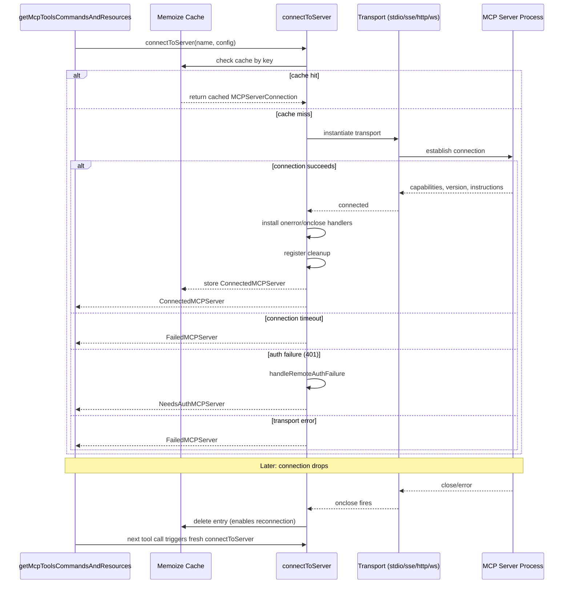

# Chapter 40: MCP: Clients, Transports, and Lifecycle

## Overview

The Model Context Protocol (MCP) is the mechanism by which cc extends its capabilities with external tool access. Rather than baking every capability into the agent's harness, MCP lets the agent discover and call tools exposed by independently running servers -- local subprocesses or remote HTTP endpoints. This chapter covers the client-side implementation: how cc creates connections, selects transports, manages authentication, and keeps those connections alive across failures.

The MCP subsystem spans six source files with distinct responsibilities. `src/services/mcp/types.ts` defines the configuration schemas and connection-state types. `src/services/mcp/config.ts` handles configuration loading, merging, deduplication, and enterprise policy enforcement. `src/services/mcp/client.ts` is the 3348-line core: it creates transports, connects clients, fetches tools and resources, and manages the connection lifecycle including reconnection and error recovery. `src/services/mcp/auth.ts` implements the OAuth2 flow, token storage, and the `ClaudeAuthProvider`. `src/services/mcp/MCPConnectionManager.tsx` provides the React context that surfaces `reconnectMcpServer` and `toggleMcpServer` to the UI tree. `src/entrypoints/mcp.ts` exposes cc itself as an MCP server for other tools to consume.

HER Section 7.2 warns that "too many tools is bad" -- excess tool descriptions push agents into "the dumb zone" faster, compounding the security risk because MCP servers are a supply-chain attack surface. The implementation reflects this concern through description-length caps, deduplication logic, and policy-based allow/deny lists. HER Section 12.4 further emphasizes that compromised or malicious tools can exfiltrate data, modify behavior, or escalate privileges, and recommends vetting all MCP servers, restricting tool permissions, and auditing tool call logs.

## Data structures and contracts

The type system for MCP connections is a discriminated union over five states. Each variant carries the server name and the scoped configuration that produced it.

```
// src/services/mcp/types.ts:L180-L227 — MCP server connection state types
export type ConnectedMCPServer = {
  client: Client
  name: string
  type: 'connected'
  capabilities: ServerCapabilities
  serverInfo?: {
    name: string
    version: string
  }
  instructions?: string
  config: ScopedMcpServerConfig
  cleanup: () => Promise<void>
}

export type FailedMCPServer = {
  name: string
  type: 'failed'
  config: ScopedMcpServerConfig
  error?: string
}

export type NeedsAuthMCPServer = {
  name: string
  type: 'needs-auth'
  config: ScopedMcpServerConfig
}

export type PendingMCPServer = {
  name: string
  type: 'pending'
  config: ScopedMcpServerConfig
  reconnectAttempt?: number
  maxReconnectAttempts?: number
}

export type DisabledMCPServer = {
  name: string
  type: 'disabled'
  config: ScopedMcpServerConfig
}

export type MCPServerConnection =
  | ConnectedMCPServer
  | FailedMCPServer
  | NeedsAuthMCPServer
  | PendingMCPServer
  | DisabledMCPServer
```

The `MCPServerConnection` union is the central contract of the subsystem. Every function that touches an MCP server receives or produces one of these variants. The `ConnectedMCPServer` type is the only one that carries the SDK `Client` instance and a `cleanup` function for tearing down the transport. The `PendingMCPServer` carries optional reconnection counters. The `FailedMCPServer` carries an error string. The `NeedsAuthMCPServer` signals that OAuth is required before a connection can succeed -- when this variant appears, a special `McpAuthTool` is synthesized to guide the user through the auth flow. The `DisabledMCPServer` represents servers the user has toggled off via the `/mcp` UI.

The configuration side uses a union of nine server config types, discriminated by the `type` field, each with its own Zod schema. The `ScopedMcpServerConfig` type at `src/services/mcp/types.ts:L163-L169` wraps any `McpServerConfig` with a `scope` field (`local`, `user`, `project`, `dynamic`, `enterprise`, `claudeai`, `managed`) and an optional `pluginSource` string. This scope determines where the configuration was loaded from and how it interacts with policy enforcement and deduplication.

```
// src/services/mcp/types.ts:L28-L35 — Stdio server config schema
export const McpStdioServerConfigSchema = lazySchema(() =>
  z.object({
    type: z.literal('stdio').optional(),
    command: z.string().min(1, 'Command cannot be empty'),
    args: z.array(z.string()).default([]),
    env: z.record(z.string(), z.string()).optional(),
  }),
)
```

The `McpStdioServerConfigSchema` shows the stdio configuration contract. The `type` field is optional for backward compatibility -- servers without an explicit type default to stdio. The `args` field defaults to an empty array, and `env` allows injecting environment variables into the subprocess. All schemas use `lazySchema` to defer evaluation and avoid circular dependency issues during module initialization.

The `McpOAuthConfigSchema` at `src/services/mcp/types.ts:L43-L56` defines the OAuth configuration for remote servers. It includes optional `clientId`, `callbackPort`, and `authServerMetadataUrl` fields, plus an `xaa` boolean flag for Cross-App Access. The `authServerMetadataUrl` must use HTTPS, enforced at the schema level. The `TransportSchema` at `src/services/mcp/types.ts:L23-L26` enumerates six transport types: `stdio`, `sse`, `sse-ide`, `http`, `ws`, and `sdk`. Each maps to a distinct code path in the client's `connectToServer` function.

The `MCPCliState` interface at `src/services/mcp/types.ts:L252-L258` provides a serialization format for the MCP subsystem's state, used by the print/SDK mode to communicate connection status back to the host process. It includes `SerializedClient` entries (name, type, optional capabilities), the full config map, serialized tool definitions, resource maps, and a `normalizedNames` map that tracks how tool names were normalized for the MCP protocol. The `SerializedTool` interface at `src/services/mcp/types.ts:L232-L244` captures the essential tool metadata -- name, description, optional input JSON schema, and flags for `isMcp` and `originalToolName` -- enabling the host process to reconstruct the tool list without a live MCP connection.

## Control flow

### Connection lifecycle

The entry point for establishing all MCP connections is the `connectToServer` function, a memoized async function at `src/services/mcp/client.ts:L595-L1641`. The memoization key is computed by `getServerCacheKey` at `src/services/mcp/client.ts:L581-L586`, which concatenates the server name with the JSON-serialized configuration. Memoization ensures that concurrent calls for the same server name and configuration share a single connection attempt rather than spawning duplicate transports.

The connection lifecycle proceeds through these phases:

1. **Transport selection** -- Based on `serverRef.type`, the function instantiates the appropriate transport class (`StdioClientTransport`, `SSEClientTransport`, `StreamableHTTPClientTransport`, `WebSocketTransport`, or `SdkControlClientTransport`).
2. **Client creation** -- A new SDK `Client` is created with cc's capabilities declaration (roots, elicitation).
3. **Connection with timeout** -- `client.connect(transport)` races against a configurable timeout (default 30 seconds, overridden by `MCP_TIMEOUT` env var).
4. **Capability discovery** -- On success, `client.getServerCapabilities()`, `client.getServerVersion()`, and `client.getInstructions()` are called.
5. **Error/close handler installation** -- The `client.onerror` and `client.onclose` handlers are wired to clear the memoization cache and fetch caches, enabling automatic reconnection on the next tool call.
6. **Cleanup registration** -- A cleanup function is registered via `registerCleanup` to ensure the transport is torn down when the process exits.



### Transport instantiation

The transport selection logic is a chain of `if/else if` branches in `connectToServer` starting at `src/services/mcp/client.ts:L619-L961`. Each branch creates the appropriate transport with its options. The branching order matters: special cases (in-process Chrome MCP, Computer Use) are checked before the generic stdio handler, and the `sdk` type throws an error because SDK servers are handled separately by `setupSdkMcpClients`.

- **stdio** (`serverRef.type === 'stdio'` or absent): Creates a `StdioClientTransport` with the command, args, and merged environment. The `CLAUDE_CODE_SHELL_PREFIX` env var can override the command for debugging. In-process servers (Chrome MCP, Computer Use) use a linked transport pair instead of spawning a subprocess.
- **sse**: Creates an `SSEClientTransport` with a `ClaudeAuthProvider`, combined headers, and a layered fetch wrapper chain.
- **sse-ide** and **ws-ide**: Lightweight transports for IDE extensions that bypass OAuth.
- **ws**: Creates a `WebSocketTransport` with headers, proxy support, and TLS options.
- **http**: Creates a `StreamableHTTPClientTransport` with `ClaudeAuthProvider`, proxy options, and the session ingress token if available.
- **claudeai-proxy**: Creates a `StreamableHTTPClientTransport` pointing at the claude.ai proxy, using `createClaudeAiProxyFetch` for automatic OAuth token injection and 401 retry.
- **sdk**: Throws an error -- SDK servers are handled separately by `setupSdkMcpClients`.

```typescript
// src/services/mcp/client.ts:L619-L677 — SSE transport instantiation with auth provider
if (serverRef.type === 'sse') {
  const authProvider = new ClaudeAuthProvider(name, serverRef)
  const combinedHeaders = await getMcpServerHeaders(name, serverRef)
  const transportOptions: SSEClientTransportOptions = {
    authProvider,
    fetch: wrapFetchWithTimeout(
      wrapFetchWithStepUpDetection(createFetchWithInit(), authProvider),
    ),
    requestInit: {
      headers: {
        'User-Agent': getMCPUserAgent(),
        ...combinedHeaders,
      },
    },
  }
  transportOptions.eventSourceInit = {
    fetch: async (url: string | URL, init?: RequestInit) => {
      const authHeaders: Record<string, string> = {}
      const tokens = await authProvider.tokens()
      if (tokens) {
        authHeaders.Authorization = `Bearer ${tokens.access_token}`
      }
      const proxyOptions = getProxyFetchOptions()
      return fetch(url, {
        ...init,
        ...proxyOptions,
        headers: {
          'User-Agent': getMCPUserAgent(),
          ...authHeaders,
          ...init?.headers,
          ...combinedHeaders,
          Accept: 'text/event-stream',
        },
      })
    },
  }
  transport = new SSEClientTransport(new URL(serverRef.url), transportOptions)
}
```

The SSE transport configuration shows the layered fetch wrapper pattern: `createFetchWithInit` is the base, `wrapFetchWithStepUpDetection` intercepts 403 responses to detect scope elevation requirements, and `wrapFetchWithTimeout` applies a per-request 60-second timeout with proper cleanup. The `eventSourceInit` fetch is intentionally separate from the `transportOptions.fetch` -- it must not have the timeout wrapper because SSE streams are long-lived. Each SSE stream fetch manually reads tokens from the `authProvider` and attaches them as a `Bearer` header, plus merges proxy options and the `Accept: text/event-stream` header.

The stdio transport instantiation at `src/services/mcp/client.ts:L944-L958` is simpler but includes an important override mechanism:

```typescript
// src/services/mcp/client.ts:L944-L958 — Stdio transport instantiation
} else if (serverRef.type === 'stdio' || !serverRef.type) {
  const finalCommand =
    process.env.CLAUDE_CODE_SHELL_PREFIX || serverRef.command
  const finalArgs = process.env.CLAUDE_CODE_SHELL_PREFIX
    ? [[serverRef.command, ...serverRef.args].join(' ')]
    : serverRef.args
  transport = new StdioClientTransport({
    command: finalCommand,
    args: finalArgs,
    env: {
      ...subprocessEnv(),
      ...serverRef.env,
    } as Record<string, string>,
    stderr: 'pipe',
  })
}
```

The `CLAUDE_CODE_SHELL_PREFIX` environment variable wraps the MCP server command inside a prefix (e.g., a debugging wrapper). When set, the original command and args are joined into a single string and passed as the sole argument to the prefix command. The `subprocessEnv()` function provides the base environment, which is then overridden by any `env` values from the server config. Setting `stderr: 'pipe'` prevents error output from the MCP server from printing directly to the UI; instead, stderr is captured and logged separately.

### Client creation and capability negotiation

After transport instantiation, a new SDK `Client` is created at `src/services/mcp/client.ts:L985-L1002`:

```typescript
// src/services/mcp/client.ts:L985-L1002 — Client creation with capabilities
const client = new Client(
  {
    name: 'claude-code',
    title: 'Claude Code',
    version: MACRO.VERSION ?? 'unknown',
    description: "Anthropic's agentic coding tool",
    websiteUrl: PRODUCT_URL,
  },
  {
    capabilities: {
      roots: {},
      elicitation: {},
    },
  },
)
```

The client declares two capabilities. `roots` tells the server about the filesystem roots the agent can access -- the `ListRootsRequestSchema` handler at `src/services/mcp/client.ts:L1009-L1018` returns `file://${getOriginalCwd()}`. The `elicitation` capability tells the server that cc can handle user-interaction requests (URL prompts, consent dialogs). The empty-object form `{}` is intentional: sending `{form:{},url:{}}` breaks Java MCP SDK servers (Spring AI) whose `Elicitation` class has zero fields and fails on unknown properties.

The connection itself races against a timeout at `src/services/mcp/client.ts:L1048-L1077`. The `connectPromise` is the `client.connect(transport)` call; the `timeoutPromise` rejects after `getConnectionTimeoutMs()` milliseconds (default 30 seconds, configurable via `MCP_TIMEOUT`). If the timeout fires, the in-process server (if any) and the transport are both closed before rejecting.

### Batched connection and concurrency

The `getMcpToolsCommandsAndResources` function at `src/services/mcp/client.ts:L2226-L2403` is the orchestrator that connects to all configured MCP servers. Before connecting, it partitions servers into three categories: disabled (immediately reported as `DisabledMCPServer` without any network or process interaction), local (stdio/sdk), and remote (sse/http/ws/ide). The partition prevents disabled servers from generating HTTP connections or flowing through batch processing.

Local and remote groups are processed with different concurrency limits. Local servers use a batch size of 3 (configurable via `MCP_SERVER_CONNECTION_BATCH_SIZE`) to avoid process-spawning resource contention, while remote servers use a batch size of 20 (configurable via `MCP_REMOTE_SERVER_CONNECTION_BATCH_SIZE`). The implementation uses `pMap` for concurrency control rather than fixed-size sequential batches:

```typescript
// src/services/mcp/client.ts:L2212-L2224 — pMap replaces fixed-size sequential batches
// Replaced 2026-03: previous implementation ran fixed-size sequential batches
// (await batch 1 fully, then start batch 2). That meant one slow server in
// batch N held up ALL servers in batch N+1, even if the other 19 slots were
// idle. pMap frees each slot as soon as its server completes, so a single
// slow server only occupies one slot instead of blocking an entire batch
// boundary. Same concurrency ceiling, same results, better scheduling.
async function processBatched<T>(
  items: T[],
  concurrency: number,
  processor: (item: T) => Promise<void>,
): Promise<void> {
  await pMap(items, processor, { concurrency })
}
```

Before attempting connection, the `processServer` function at `src/services/mcp/client.ts:L2282-L2386` checks two skip conditions. First, the needs-auth cache at `src/services/mcp/client.ts:L259-L316` tracks servers that recently returned 401, with a 15-minute TTL. Second, the `hasMcpDiscoveryButNoToken` function at `src/services/mcp/auth.ts:L349-L363` checks whether OAuth discovery has been performed for a server but no credentials exist -- a connection attempt in this state is guaranteed to 401. Both checks prevent unnecessary network round-trips to servers that cannot succeed until the user runs `/mcp` to authenticate.

### Connection drop detection and reconnection

The `onerror` and `onclose` handlers installed after a successful connection implement cc's reconnection strategy. The `onerror` handler at `src/services/mcp/client.ts:L1266-L1371` tracks consecutive terminal connection errors. A helper function `isTerminalConnectionError` at `src/services/mcp/client.ts:L1249-L1263` classifies errors by message content: ECONNRESET, ETIMEDOUT, EPIPE, EHOSTUNREACH, ECONNREFUSED, Body Timeout Error, terminated, SSE stream disconnected, and Failed to reconnect SSE stream are all considered terminal.

After `MAX_ERRORS_BEFORE_RECONNECT` (3) consecutive terminal errors, the handler calls `closeTransportAndRejectPending`. Non-terminal errors (transient issues) reset the counter. The `closeTransportAndRejectPending` function at `src/services/mcp/client.ts:L1240-L1247` is guarded against re-entry by the `hasTriggeredClose` flag, because `client.close()` aborts in-flight streams which may fire `onerror` again before the close chain completes.

The `onclose` handler at `src/services/mcp/client.ts:L1374-L1402` clears both the connection cache and the fetch caches (tools, resources, commands). This ensures that the next tool call will trigger a fresh `connectToServer` invocation with a new transport.

```typescript
// src/services/mcp/client.ts:L1374-L1402 — onclose handler clears caches for reconnection
client.onclose = () => {
  const uptime = Date.now() - connectionStartTime
  const transportType = serverRef.type ?? 'unknown'

  logMCPDebug(
    name,
    `${transportType.toUpperCase()} connection closed after ${Math.floor(uptime / 1000)}s (${hasErrorOccurred ? 'with errors' : 'cleanly'})`,
  )

  const key = getServerCacheKey(name, serverRef)
  fetchToolsForClient.cache.delete(name)
  fetchResourcesForClient.cache.delete(name)
  fetchCommandsForClient.cache.delete(name)
  if (feature('MCP_SKILLS')) {
    fetchMcpSkillsForClient!.cache.delete(name)
  }
  connectToServer.cache.delete(key)
  logMCPDebug(name, `Cleared connection cache for reconnection`)

  if (originalOnclose) {
    originalOnclose()
  }
}
```

The `ensureConnectedClient` function at `src/services/mcp/client.ts:L1688-L1704` is the gatekeeper for tool calls. It checks the memoization cache for a valid connection, reconnects if the cache was cleared (e.g., after `onclose`), and throws if the server cannot be reconnected. The `McpSessionExpiredError` class triggers a single retry within the tool `call()` method -- the connection cache is cleared via `clearServerCache`, and `ensureConnectedClient` creates a fresh session on the next attempt. The `MAX_SESSION_RETRIES` constant at `src/services/mcp/client.ts:L1859` limits this to one retry.

### Authentication: ClaudeAuthProvider

The `ClaudeAuthProvider` class at `src/services/mcp/auth.ts:L1376-L1654` implements the MCP SDK's `OAuthClientProvider` interface. It manages the full OAuth2 lifecycle: client metadata generation, state/verifier creation, token storage in the platform's secure storage, and token refresh.

The `tokens()` method at `src/services/mcp/auth.ts:L1540-L1654` is called by the SDK on every request. It reads stored tokens from secure storage, checks expiry, and initiates a proactive refresh if the token expires within 5 minutes (300 seconds). This proactive refresh is a UX improvement -- it avoids the latency of a failed request followed by a token refresh cycle. The method also handles XAA (Cross-App Access) servers: when `oauth.xaa` is set and the server lacks a refresh token, it attempts a silent token exchange using a cached IdP id_token before falling back to the needs-auth path.

The step-up detection mechanism works through `wrapFetchWithStepUpDetection` at `src/services/mcp/auth.ts:L1354-L1374`:

```typescript
// src/services/mcp/auth.ts:L1354-L1374 — Step-up detection fetch wrapper
export function wrapFetchWithStepUpDetection(
  baseFetch: FetchLike,
  provider: ClaudeAuthProvider,
): FetchLike {
  return async (url, init) => {
    const response = await baseFetch(url, init)
    if (response.status === 403) {
      const wwwAuth = response.headers.get('WWW-Authenticate')
      if (wwwAuth?.includes('insufficient_scope')) {
        const match = wwwAuth.match(/scope=(?:"([^"]+)"|([^\s,]+))/)
        const scope = match?.[1] ?? match?.[2]
        if (scope) {
          provider.markStepUpPending(scope)
        }
      }
    }
    return response
  }
}
```

When a 403 response with `WWW-Authenticate: Bearer ... insufficient_scope` is detected, the fetch wrapper calls `provider.markStepUpPending(scope)`. On the next `tokens()` call, the provider checks whether the current token's scope includes the step-up scope. If not, it omits the refresh_token, forcing the SDK to skip its refresh path and fall through to a new PKCE authorization flow with the elevated scope. This implements RFC 6749 Section 6, which forbids scope elevation via refresh -- refreshing would return the same-scoped token and the retry would 403 again.

The `clientMetadata` getter at `src/services/mcp/auth.ts:L1417-L1437` generates the OAuth client metadata for Dynamic Client Registration. It declares cc as a public client (`token_endpoint_auth_method: 'none'`) with `authorization_code` and `refresh_token` grant types. The `clientMetadataUrl` getter at `src/services/mcp/auth.ts:L1445-L1452` supports the Client ID Metadata Document (CIMD) extension, which lets the auth server use a URL as the `client_id` instead of performing DCR.

### Tool fetching and registration

After a successful connection, `fetchToolsForClient` at `src/services/mcp/client.ts:L1743-L1998` calls `tools/list` on the MCP server and converts each tool into cc's internal `Tool` type. Each MCP tool gets a fully qualified name via `buildMcpToolName` (typically `mcp__serverName__toolName`), an `mcpInfo` field for permission routing, and a `call()` method that delegates to `callMCPToolWithUrlElicitationRetry`.

The tool `call()` method at `src/services/mcp/client.ts:L1833-L1970` calls `ensureConnectedClient` before each invocation, handles `McpSessionExpiredError` with a single retry, and emits progress events. Tool descriptions are capped at 2048 characters (`MAX_MCP_DESCRIPTION_LENGTH` at `src/services/mcp/client.ts:L218`) to prevent OpenAPI-generated servers from flooding the context with 15-60KB of documentation. The `isReadOnly()` method reads `tool.annotations?.readOnlyHint`, which the MCP specification defines as a hint about whether the tool modifies external state. The `isDestructive()` method reads `tool.annotations?.destructiveHint`.

The `fetchResourcesForClient` function at `src/services/mcp/client.ts:L2000-L2031` fetches server resources if the server declares the `resources` capability. Resources are tagged with the server name via the `ServerResource` type at `src/services/mcp/types.ts:L229`. The `fetchCommandsForClient` function at `src/services/mcp/client.ts:L2033-L2107` fetches MCP prompts and converts them to cc's `Command` type, prefixing names with `mcp__` and normalizing the server name. All three fetch functions use `memoizeWithLRU` with a cache size of 20 entries, keyed by server name.

### The MCP server entrypoint

The `startMCPServer` function at `src/entrypoints/mcp.ts:L35-L196` exposes cc's own tools as an MCP server for external consumers. It creates an MCP SDK `Server` with `tools` capability, registers handlers for `ListToolsRequestSchema` and `CallToolRequestSchema`, and listens on a `StdioServerTransport`.

```typescript
// src/entrypoints/mcp.ts:L47-L57 — MCP server creation with capability declaration
const server = new Server(
  {
    name: 'claude/tengu',
    version: MACRO.VERSION,
  },
  {
    capabilities: {
      tools: {},
    },
  },
)
```

The server name `claude/tengu` identifies cc in the MCP protocol. The `CallTool` handler at `src/entrypoints/mcp.ts:L99-L188` creates a minimal `ToolUseContext` with a size-limited LRU cache for `readFileState` (100 files, 25MB limit) to prevent unbounded memory growth in long-running MCP server mode. It validates that the requested tool exists and is enabled, runs optional input validation, and calls `tool.call()`. Errors are caught and returned as `{ isError: true, content: [...] }` per the MCP specification, rather than propagated as JSON-RPC errors. The `ListTools` handler at `src/entrypoints/mcp.ts:L59-L97` converts cc's internal tool definitions to MCP's wire format, including Zod-to-JSON-Schema conversion for input schemas. Output schemas with `anyOf` or `oneOf` at the root level (from `z.union` or `z.discriminatedUnion`) are skipped because the MCP SDK requires `type: "object"` at the root.

### MCPConnectionManager: React context

The `MCPConnectionManager` component at `src/services/mcp/MCPConnectionManager.tsx:L38-L72` is a React context provider that exposes two functions to the component tree: `reconnectMcpServer` and `toggleMcpServer`. These come from the `useManageMCPConnections` hook. The component uses React Compiler's `_c` runtime for memoization. Two custom hooks, `useMcpReconnect` and `useMcpToggleEnabled`, provide type-safe access to these functions with guard clauses that throw if used outside the provider.

The `MCPConnectionContextValue` interface at `src/services/mcp/MCPConnectionManager.tsx:L7-L15` defines the contract: `reconnectMcpServer` takes a server name and returns a promise resolving to the reconnected client, its tools, commands, and optional resources. `toggleMcpServer` takes a server name and returns a promise of void, enabling or disabling the server. The component accepts `dynamicMcpConfig` (runtime-provided configurations from claude.ai or plugins) and `isStrictMcpConfig` (whether only managed configurations are allowed).

### Configuration and policy

The config layer at `src/services/mcp/config.ts` handles loading MCP server definitions from seven scopes, merging them with correct precedence, deduplicating plugin and claude.ai connector servers against manual configs, and enforcing enterprise policy via allow/deny lists.

The `getMcpServerSignature` function at `src/services/mcp/config.ts:L202-L212` computes a content-based dedup key from the server's command array (stdio) or URL (remote). For stdio servers, the signature is `stdio:` followed by the JSON-serialized command array. For remote servers, it is `url:` followed by the unwrapped URL (with CCR proxy prefixes stripped). Two servers with the same signature are considered identical regardless of their names.

The `dedupPluginMcpServers` function at `src/services/mcp/config.ts:L223-L266` uses these signatures to suppress plugin-provided servers that duplicate manually configured ones. Manual wins over plugin, and first-loaded wins among plugins. Plugin servers are namespaced `plugin:name:server` so they never key-collide with manual servers in the merge -- the content-based signature check catches the case where both launch the same underlying process.

The `dedupClaudeAiMcpServers` function at `src/services/mcp/config.ts:L281-L310` applies similar logic for claude.ai connectors. Only enabled manual servers count as dedup targets -- a disabled manual server must not suppress its connector twin, or neither would run.

The policy enforcement at `src/services/mcp/config.ts:L364-L508` implements three matching modes: name-based (exact string match), command-based (stdio, exact array match), and URL-based (remote, with wildcard support via `urlPatternToRegex`). Denylist takes absolute precedence over allowlist. When `allowManagedMcpServersOnly` is set in policy settings, only managed settings control which servers are allowed. SDK-type servers are exempt from policy checks because they are in-process transport placeholders, not CLI-managed connections.

The `addMcpConfig` function at `src/services/mcp/config.ts:L625-L761` validates the configuration against `McpServerConfigSchema`, checks both denylist and allowlist, verifies the server does not already exist in the target scope, and then writes to the appropriate storage: `.mcp.json` for project scope, global config for user scope, or project config for local scope. It blocks the reserved names `claude-in-chrome` and (when the feature flag is enabled) the computer-use server name. Enterprise MCP configurations have exclusive control -- `addMcpConfig` throws when an enterprise config exists.

## Edge cases and failure modes

**Stale AbortSignal bug**: The `wrapFetchWithTimeout` function at `src/services/mcp/client.ts:L492-L550` exists because a single `AbortSignal.timeout()` created at connection time becomes stale after 60 seconds, causing all subsequent requests to fail immediately with "The operation timed out." The wrapper creates a fresh `setTimeout` for each request and properly cleans up the timer on completion. It uses `setTimeout` instead of `AbortSignal.timeout()` because the latter's internal timer is only released when the signal is garbage collected, which in Bun is lazy -- approximately 2.4KB of native memory per request lingers for the full 60 seconds even when the request completes in milliseconds. The wrapper also normalizes the `Accept` header for Streamable HTTP transports by constructing a `new Headers(init?.headers)` and setting `accept` to `application/json, text/event-stream` if not already present.

**Non-standard OAuth error codes**: Some OAuth servers (notably Slack) return HTTP 200 for error responses, embedding the error in the JSON body. The `normalizeOAuthErrorBody` function at `src/services/mcp/auth.ts:L157-L190` peeks at 2xx POST response bodies and rewrites ones matching `OAuthErrorResponseSchema` (but not `OAuthTokensSchema`) to a 400 Response, so the SDK's normal error-class mapping applies. Non-standard error codes like `invalid_refresh_token`, `expired_refresh_token`, and `token_expired` are normalized to `invalid_grant` via the `NONSTANDARD_INVALID_GRANT_ALIASES` set at `src/services/mcp/auth.ts:L147-L151`.

**Process cleanup escalation**: For stdio transports, `StdioClientTransport.close()` only sends an abort signal, which is insufficient for Docker containers and other servers that need explicit signals. The cleanup function at `src/services/mcp/client.ts:L1404-L1570` sends SIGINT, waits 100ms, escalates to SIGTERM after another 400ms, and finally SIGKILL, with a 600ms failsafe timeout. A polling interval checks `process.kill(pid, 0)` every 50ms to detect when the process has exited. This escalation sequence prevents zombie processes while keeping the CLI responsive -- the total cleanup time is bounded at approximately 600ms.

**SSE stream vs request timeout**: The `wrapFetchWithTimeout` skips timeout for GET requests because MCP transport GETs are long-lived SSE streams meant to stay open indefinitely. Applying a 60-second timeout to these would kill the stream. OAuth discovery GETs in auth.ts use a separate `createAuthFetch()` with its own 30-second timeout at `src/services/mcp/auth.ts:L198-L237`.

**Session expiry on HTTP transports**: MCP servers can return a 404 with JSON-RPC error code -32001 ("Session not found") when a session ID is no longer valid. The `isMcpSessionExpiredError` function at `src/services/mcp/client.ts:L193-L206` checks both the HTTP status code and the JSON-RPC error code to avoid false positives from generic 404s. When detected, the connection cache is cleared via `clearServerCache` at `src/services/mcp/client.ts:L1648-L1673` and the tool call is retried once. The `clearServerCache` function cleans up the old connected client (calling its `cleanup()` method), then deletes the entry from both the connection cache and all fetch caches.

**Concurrent 401 handling for claude.ai proxy**: The `createClaudeAiProxyFetch` function at `src/services/mcp/client.ts:L372-L422` handles a subtle race: when multiple claude.ai connectors all get 401s simultaneously, another connector's `handleOAuth401Error` may have already refreshed the token. The function captures `sentToken` before the request and checks whether the token changed after a 401, avoiding a redundant refresh cycle. It only retries when `handleOAuth401Error` returns true (meaning the token actually changed due to a force-refresh).

**Memory management**: The auth cache at `src/services/mcp/client.ts:L259-L316` serializes writes through a promise chain (`writeChain`) to prevent concurrent read-modify-write races when multiple servers return 401 in the same batch. The memoized file read (`authCachePromise`) is invalidated on write by setting it to `null`, so subsequent reads see the new entry. Stderr accumulation for stdio servers is capped at 64MB (`stderrOutput.length < 64 * 1024 * 1024` at `src/services/mcp/client.ts:L974`) to prevent unbounded memory growth from verbose servers. The accumulated string is released after logging on successful connection.

**Tool output handling**: The `processMCPResult` function at `src/services/mcp/client.ts:L2720-L2799` handles large MCP tool outputs by persisting them to disk and returning instructions for reading the file, rather than injecting the full content into the context. Images are excluded from this persistence path -- they fall back to truncation because persisting images as JSON defeats the image compression logic and makes them non-viewable. The `mcpContentNeedsTruncation` check determines whether content exceeds token limits; if the `ENABLE_MCP_LARGE_OUTPUT_FILES` environment variable is set to a falsy value, the old truncation behavior is used instead.

## Where cc diverges from the published pattern

**Memoized connections vs ephemeral clients**: The MCP specification does not prescribe a connection management strategy. cc's use of `memoize` on `connectToServer` means that all tool calls within a session share the same transport instance. This is a deliberate performance choice -- creating a new subprocess or HTTP session for each tool call would be prohibitively expensive -- but it creates a coupling between connection lifetime and session lifetime that requires the complex cache-invalidation logic in `onclose` and `clearServerCache`. The memoization also complicates reconnection: the `areMcpConfigsEqual` function at `src/services/mcp/client.ts:L1710-L1722` compares configs by serializing and excluding `scope`, so that a config change detected during reconnection actually creates a new connection rather than returning a stale cached one.

**Step-up auth via cache manipulation**: RFC 6749 Section 6 forbids scope elevation via refresh_token. The MCP SDK's auth flow would try to refresh the token and get the same scopes back, leading to an infinite 403 loop. cc's solution -- `markStepUpPending` causes `tokens()` to omit the refresh_token -- is a pragmatic workaround that manipulates the SDK's auth flow by controlling what data the provider returns, rather than extending the SDK's API. The `_pendingStepUpScope` field is set by the fetch wrapper and read by `tokens()`, creating a side-channel between the transport layer and the auth provider that the SDK never designed for.

**In-process transports**: The Chrome MCP and Computer Use servers run in-process rather than spawning a subprocess. This avoids a ~325MB subprocess overhead for Chrome and native module loading issues for Computer Use. The `createLinkedTransportPair` function creates a pair of in-process transport objects that communicate directly. This pattern is not part of the MCP specification but is a practical optimization for high-overhead servers. The in-process path is detected by server name (`isClaudeInChromeMCPServer`, `isComputerUseMCPServer`) before falling through to the generic stdio handler.

**Connection error escalation**: The SDK's SSE/HTTP transport fires `onerror` when it exhausts its own reconnection attempts but never calls `onclose`, leaving pending `callTool()` promises hanging indefinitely. cc bridges this gap by tracking consecutive terminal errors and manually closing after 3 failures. The `closeTransportAndRejectPending` function at `src/services/mcp/client.ts:L1240-L1247` ensures that `client.close()` is called, which causes the SDK to reject all pending requests and then fire `onclose`. The `hasTriggeredClose` guard prevents re-entry when `close()` aborts in-flight streams that fire `onerror` again.

**Server-side revocation with fallback**: The `revokeToken` function at `src/services/mcp/auth.ts:L381-L459` implements RFC 7009 token revocation but includes a fallback for non-compliant servers. It first tries the compliant approach (client_id in body, no Authorization header). If that returns 401, it retries with Bearer auth, clearing `client_id` and `client_secret` from the body to comply with RFC 6749 Section 2.3.1's prohibition on multiple authentication methods. The revocation endpoint auth method is selected from `revocation_endpoint_auth_methods_supported` in the AS metadata, falling back to `token_endpoint_auth_methods_supported`, and defaulting to `client_secret_basic`.

## Developer takeaways for building a long-running agent

MCP connection management is fundamentally a caching problem with invalidation on failure. The memoization pattern in `connectToServer` works because tool calls are frequent and connections are expensive to establish, but it demands rigorous cache cleanup in every failure path -- `onclose`, `onerror`, and explicit `clearServerCache` calls. When building a long-running agent that depends on external tool servers, design your reconnection strategy around cache invalidation rather than connection pooling: let the next tool call trigger a fresh connection, and ensure every failure mode clears the relevant caches. Pay special attention to the gap between `onerror` and `onclose` in SDK transports -- the SDK may fire `onerror` without `onclose` in some failure modes, leaving your tool calls hanging. The proactive token refresh pattern in `ClaudeAuthProvider.tokens()` (refreshing within 5 minutes of expiry rather than waiting for a 401) is a UX win for long-running sessions: it eliminates the latency spike of a failed request followed by a refresh cycle. The per-request timeout wrapper (`wrapFetchWithTimeout`) prevents stale signals from killing subsequent requests after the first timeout, a bug that is easy to miss when reusing a single `AbortSignal.timeout()` across a long session. For stdio-based tool servers, the SIGINT-to-SIGTERM-to-SIGKILL escalation with bounded timeouts prevents zombie processes without blocking the agent's main loop. Finally, treat MCP server descriptions as untrusted input: the 2048-character cap on tool descriptions and the `recursivelySanitizeUnicode` call on tool data defend against context-window attacks from compromised servers, a risk the HER highlights as particularly dangerous for agent systems.

```mermaid
classDiagram
    class MCPServerConnection {
        <<union type>>
    }
    class ConnectedMCPServer {
        +Client client
        +string name
        +ServerCapabilities capabilities
        +ScopedMcpServerConfig config
        +cleanup() Promise~void~
    }
    class FailedMCPServer {
        +string name
        +ScopedMcpServerConfig config
        +string error
    }
    class NeedsAuthMCPServer {
        +string name
        +ScopedMcpServerConfig config
    }
    class PendingMCPServer {
        +string name
        +ScopedMcpServerConfig config
        +number reconnectAttempt
        +number maxReconnectAttempts
    }
    class DisabledMCPServer {
        +string name
        +ScopedMcpServerConfig config
    }
    MCPServerConnection <|.. ConnectedMCPServer
    MCPServerConnection <|.. FailedMCPServer
    MCPServerConnection <|.. NeedsAuthMCPServer
    MCPServerConnection <|.. PendingMCPServer
    MCPServerConnection <|.. DisabledMCPServer

    class ScopedMcpServerConfig {
        +McpServerConfig config
        +ConfigScope scope
        +string pluginSource
    }
    ConnectedMCPServer --> ScopedMcpServerConfig
    FailedMCPServer --> ScopedMcpServerConfig

    class McpServerConfig {
        <<union type>>
    }
    class McpStdioServerConfig {
        +string command
        +string[] args
        +Record env
    }
    class McpSSEServerConfig {
        +string url
        +Record headers
        +McpOAuthConfig oauth
    }
    class McpHTTPServerConfig {
        +string url
        +Record headers
        +McpOAuthConfig oauth
    }
    class McpWebSocketServerConfig {
        +string url
        +Record headers
    }
    McpServerConfig <|.. McpStdioServerConfig
    McpServerConfig <|.. McpSSEServerConfig
    McpServerConfig <|.. McpHTTPServerConfig
    McpServerConfig <|.. McpWebSocketServerConfig
    ScopedMcpServerConfig --> McpServerConfig

    class ClaudeAuthProvider {
        -string serverName
        -McpSSEServerConfig|McpHTTPServerConfig serverConfig
        -string redirectUri
        -string _pendingStepUpScope
        +tokens() Promise~OAuthTokens~
        +markStepUpPending(scope) void
        +saveClientInformation(info) Promise~void~
    }
    ConnectedMCPServer ..> ClaudeAuthProvider : uses for sse/http
