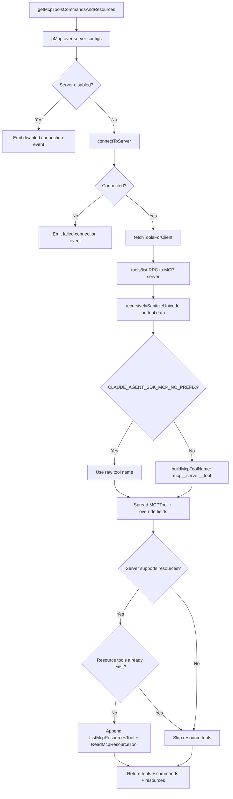
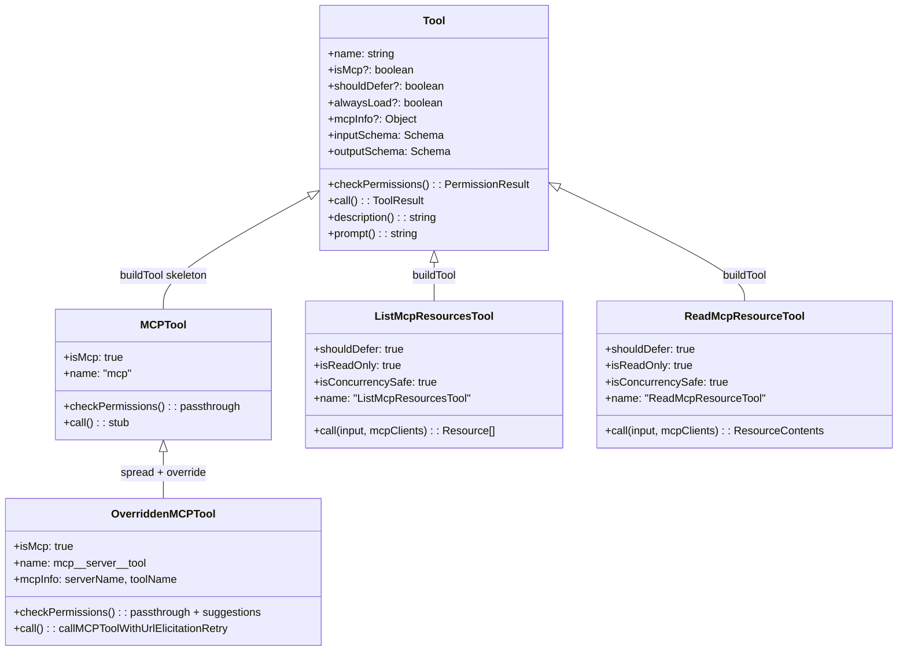

# MCP Tools: Passthrough Permissions and Deferred Loading

## Overview

MCP (Model Context Protocol) servers expose arbitrary tools and resources to cc at runtime. Unlike the built-in tools -- BashTool, FileReadTool, GrepTool -- whose schemas and permission logic are known at compile time, MCP tools arrive from external processes with schemas that cc cannot predict. This chapter examines how cc bridges that gap: a single skeleton type (`MCPTool`) is spread and overridden for each server-discovered tool, a passthrough permission model delegates authorization decisions to the user, and a deferred loading mechanism keeps the tool list small until the model actually needs an MCP tool. Two dedicated resource tools -- `ListMcpResourcesTool` and `ReadMcpResourceTool` -- provide read-only access to the MCP resource protocol, with special handling for binary content that would otherwise bloat the context window.

The design reflects HER Pattern 9 (Progressive Tool Expansion): rather than loading all MCP tool definitions into the initial prompt, cc starts with a compact deferred-tool list and activates the full schema only on demand via ToolSearch. This keeps the initial tool count below the threshold where model selection accuracy degrades (see HER Section 6.8, Tool Explosion). HER Section 7.2 reinforces the point bluntly: "Too many tools is bad" -- excess tool descriptions push agents into what the report calls "the dumb zone" faster, degrading both selection accuracy and response quality. The implication for MCP is clear: every additional MCP server that connects adds tools to the model's universe, and without deferred loading, a user with five MCP servers could easily present 40 or more tools on the first turn.

## Data structures and contracts

### The MCPTool skeleton

`MCPTool` is not a usable tool in its own right. Every field that depends on server-specific knowledge -- `name`, `description`, `prompt`, `call`, `checkPermissions` -- carries a stub or placeholder. The real implementation is assembled later by spreading `MCPTool` and overriding those fields per server tool:

```typescript
// src/tools/MCPTool/MCPTool.ts:L1-L77 — MCPTool skeleton definition
export const inputSchema = lazySchema(() => z.object({}).passthrough())
type InputSchema = ReturnType<typeof inputSchema>

export const outputSchema = lazySchema(() =>
  z.string().describe('MCP tool execution result'),
)
type OutputSchema = ReturnType<typeof outputSchema>

export type Output = z.infer<OutputSchema>

export type { MCPProgress } from '../../types/tools.js'

export const MCPTool = buildTool({
  isMcp: true,
  isOpenWorld() { return false },
  name: 'mcp',
  maxResultSizeChars: 100_000,
  async description() { return DESCRIPTION },
  async prompt() { return PROMPT },
  get inputSchema(): InputSchema { return inputSchema() },
  get outputSchema(): OutputSchema { return outputSchema() },
  async call() { return { data: '' } },
  async checkPermissions(): Promise<PermissionResult> {
    return {
      behavior: 'passthrough',
      message: 'MCPTool requires permission.',
    }
  },
  renderToolUseMessage,
  userFacingName: () => 'mcp',
  renderToolUseProgressMessage,
  renderToolResultMessage,
  isResultTruncated(output: Output): boolean {
    return isOutputLineTruncated(output)
  },
  mapToolResultToToolResultBlockParam(content, toolUseID) {
    return {
      tool_use_id: toolUseID,
      type: 'tool_result',
      content,
    }
  },
} satisfies ToolDef<InputSchema, Output>)
```

The `inputSchema` uses `z.object({}).passthrough()`, which accepts any key-value pairs without validation. This is necessary because MCP tools define their own schemas externally; cc cannot enforce a fixed shape at the TypeScript level. The `lazySchema` wrapper defers Zod schema construction from module-init time to first access, avoiding circular dependency issues during startup.

The `isMcp: true` flag on line 28 marks this as an MCP-originated tool. The `Tool` type definition reserves this field so that downstream code (permission validators, UI renderers, hook dispatchers) can distinguish MCP tools from builtins without string-matching on the name `src/Tool.ts:L436`. A companion flag `isLsp` exists on the same type `src/Tool.ts:L437` for LSP-originated tools, establishing a two-category taxonomy of externally sourced tools within the cc tool dispatch pipeline.

The `outputSchema` on line 17 is typed as `z.string()`, but the actual MCP tool response can contain structured content (arrays, objects, images). This apparent mismatch exists because the output schema serves the internal type system, while the real response shape is determined by the MCP server at runtime. The `call()` method in the overridden version returns the raw `content` field from the MCP response, which the `mapToolResultToToolResultBlockParam` method on line 70 passes through as a `tool_result` block without re-validation.

### Passthrough permission model

The `checkPermissions` method on line 56 returns `{ behavior: 'passthrough', message: 'MCPTool requires permission.' }`. This is the core of the passthrough permission model: cc does not attempt to classify MCP tool invocations as safe, risky, or destructive on its own. Instead, it punts the decision to the user, who must explicitly grant or deny each call. The model differs sharply from builtins like BashTool, which runs commands through a classifier (`src/utils/permissions/bashClassifier.ts`) that can auto-approve read-only operations.

When `fetchToolsForClient` builds the real tool objects, it overrides `checkPermissions` with a slightly richer version that includes a suggestion to add an allow rule:

```typescript
// src/services/mcp/client.ts:L1814-L1832 — Per-MCP-tool checkPermissions override
            async checkPermissions() {
              return {
                behavior: 'passthrough' as const,
                message: 'MCPTool requires permission.',
                suggestions: [
                  {
                    type: 'addRules' as const,
                    rules: [
                      {
                        toolName: fullyQualifiedName,
                        ruleContent: undefined,
                      },
                    ],
                    behavior: 'allow' as const,
                    destination: 'localSettings' as const,
                  },
                ],
              }
            },
```

The `suggestions` array provides the UI with a one-click path to create an allow rule for the fully qualified tool name (e.g., `mcp__github__search_code`). Once added to local settings, subsequent calls to the same MCP tool skip the permission prompt. This is the escape hatch from the passthrough model: users can opt specific tools into auto-approval after they have verified the tool is trustworthy. The `destination: 'localSettings'` scopes the rule to the project, preventing global privilege escalation from a single approval.

Compare this with the default `checkPermissions` for builtins, which returns `{ behavior: 'allow', updatedInput: input }` (auto-approved) unless the tool explicitly overrides it `src/Tool.ts:L762-L766`. The contrast is stark: builtins are trusted by default and restricted by classifiers, while MCP tools are untrusted by default and promoted to allowed only through explicit user action. This is HER Pattern 10 (Command Risk Classification) applied conservatively: since cc cannot classify MCP tool risk at compile time, it classifies all MCP tools as "risky" and requires human confirmation.

### Deferred loading flags

Two fields on the `Tool` type control whether an MCP tool's full schema appears in the initial prompt or is hidden behind ToolSearch:

- `shouldDefer` (line 442 of `src/Tool.ts`): when `true`, the tool is sent with `defer_loading: true` and the model must use ToolSearch before it can call the tool.
- `alwaysLoad` (line 449 of `src/Tool.ts`): when `true`, the tool's full schema appears in the initial prompt even when ToolSearch is enabled. Set via `_meta['anthropic/alwaysLoad']` on the MCP server's tool definition.

```typescript
// src/Tool.ts:L439-L455 — shouldDefer and alwaysLoad definitions
  readonly shouldDefer?: boolean
  /**
   * When true, this tool is never deferred — its full schema appears in the
   * initial prompt even when ToolSearch is enabled. For MCP tools, set via
   * `_meta['anthropic/alwaysLoad']`. Use for tools the model must see on
   * turn 1 without a ToolSearch round-trip.
   */
  readonly alwaysLoad?: boolean
  /**
   * For MCP tools: the server and tool names as received from the MCP server (unnormalized).
   * Present on all MCP tools regardless of whether `name` is prefixed (mcp__server__tool)
   * or unprefixed (CLAUDE_AGENT_SDK_MCP_NO_PREFIX mode).
   */
  mcpInfo?: { serverName: string; toolName: string }
```

The `mcpInfo` field stores the raw server and tool names separately from the `name` field, which may be prefixed (`mcp__server__tool`) or unprefixed depending on the `CLAUDE_AGENT_SDK_MCP_NO_PREFIX` environment variable. Permission checking always uses the fully qualified name via `getToolNameForPermissionCheck` `src/services/mcp/mcpStringUtils.ts:L60-L67`, ensuring that deny rules targeting builtins like `Write` do not accidentally match an unprefixed MCP replacement. The SDK no-prefix mode is activated when `CLAUDE_AGENT_SDK_MCP_NO_PREFIX` is truthy and the server config type is `'sdk'` `src/services/mcp/client.ts:L1761-L1763`, allowing MCP tools to override builtins by name in embedded SDK contexts where the agent runs inside a controlled environment.

### Fully qualified naming

The `buildMcpToolName` function constructs the `mcp__server__tool` naming convention:

```typescript
// src/services/mcp/mcpStringUtils.ts:L50-L52 — buildMcpToolName
export function buildMcpToolName(serverName: string, toolName: string): string {
  return `${getMcpPrefix(serverName)}${normalizeNameForMCP(toolName)}`
}
```

The inverse operation, `mcpInfoFromString`, splits on `__` and handles the edge case where tool names themselves contain double underscores `src/services/mcp/mcpStringUtils.ts:L19-L32`. This naming convention is not cosmetic: it is the foundation of the permission rule system, which matches against fully qualified names to prevent cross-server rule leakage.

## Control flow

### MCP tool loading pipeline

The end-to-end flow from MCP server connection to an active tool in the model's tool list involves several stages: connection, capability discovery, tool fetching, schema sanitization, and registration.



The pipeline begins with `getMcpToolsCommandsAndResources` `src/services/mcp/client.ts:L2226`, which iterates over all configured MCP servers. Disabled servers are filtered early to avoid unnecessary network connections. The function uses `pMap` for batched concurrency rather than fixed-size sequential batches; the comment at line 2212 explains the scheduling improvement: a single slow server in the old approach held up all servers in the next batch, whereas `pMap` frees each slot as soon as its server completes. For each active server, `connectToServer` establishes a transport (stdio, SSE, or streamable HTTP). Once connected, `fetchToolsForClient` issues a `tools/list` RPC to the MCP server, receives the raw tool definitions, and sanitizes them with `recursivelySanitizeUnicode` `src/services/mcp/client.ts:L1758` to strip potentially malicious Unicode characters from tool metadata. The fetch function itself is memoized with an LRU cache of size 20 `src/services/mcp/client.ts:L1743-L1998`, keyed by server name to avoid redundant RPC calls across reconnects.

The tool-to-cc conversion happens in the `.map()` callback starting at line 1767. Each MCP tool definition becomes a cc `Tool` object by spreading `MCPTool` and overriding the stub fields with server-specific values:

```typescript
// src/services/mcp/client.ts:L1766-L1809 — Converting MCP tools to cc Tool format
      return toolsToProcess
        .map((tool): Tool => {
          const fullyQualifiedName = buildMcpToolName(client.name, tool.name)
          return {
            ...MCPTool,
            name: skipPrefix ? tool.name : fullyQualifiedName,
            mcpInfo: { serverName: client.name, toolName: tool.name },
            isMcp: true,
            searchHint:
              typeof tool._meta?.['anthropic/searchHint'] === 'string'
                ? tool._meta['anthropic/searchHint']
                    .replace(/\s+/g, ' ')
                    .trim() || undefined
                : undefined,
            alwaysLoad: tool._meta?.['anthropic/alwaysLoad'] === true,
            async description() {
              return tool.description ?? ''
            },
            async prompt() {
              const desc = tool.description ?? ''
              return desc.length > MAX_MCP_DESCRIPTION_LENGTH
                ? desc.slice(0, MAX_MCP_DESCRIPTION_LENGTH) + '… [truncated]'
                : desc
            },
            isConcurrencySafe() {
              return tool.annotations?.readOnlyHint ?? false
            },
            isReadOnly() {
              return tool.annotations?.readOnlyHint ?? false
            },
            toAutoClassifierInput(input) {
              return mcpToolInputToAutoClassifierInput(input, tool.name)
            },
            isDestructive() {
              return tool.annotations?.destructiveHint ?? false
            },
            isOpenWorld() {
              return tool.annotations?.openWorldHint ?? false
            },
```

The spread-and-override pattern means the MCPTool skeleton provides all the infrastructure (renderers, truncation detection, result mapping) while the override supplies the server-specific identity. MCP tool annotations (`readOnlyHint`, `destructiveHint`, `openWorldHint`) are mapped directly to the corresponding cc `Tool` methods, allowing the permission system and auto-classifier to operate on MCP tools with the same interface as builtins.

The `searchHint` on line 1779 is extracted from `tool._meta['anthropic/searchHint']`, an extension field that MCP servers can set to provide a short description for the deferred-tool list. Whitespace is collapsed because newlines in the hint would inject orphan lines into the deferred-tool display format.

The `MAX_MCP_DESCRIPTION_LENGTH` constant (2048 characters, `src/services/mcp/client.ts:L218`) truncates excessively long descriptions before they reach the model. This is a defense against tool explosion: an MCP server that returns a 50 KB description for each of its 30 tools would consume the entire context window before the model even starts working. The same constant is also applied to MCP server instructions at line 1163, which are truncated from their full length to 2048 characters when they exceed the limit.

The `isIncludedMcpTool` filter `src/services/mcp/client.ts:L569-L573` runs after tool fetching to exclude IDE-specific tools that would clutter the model's tool list. Only `mcp__ide__executeCode` and `mcp__ide__getDiagnostics` are allowed through; all other `mcp__ide__` tools are silently dropped. This filter is applied at the end of `fetchToolsForClient` (line 1990) before the tools are returned to the connection manager.

### Resource tool injection

When an MCP server supports the resources capability, cc adds two read-only tools to the tool list: `ListMcpResourcesTool` and `ReadMcpResourceTool`. However, they are only added if no existing MCP tool already matches their names, preventing duplicate tools when multiple servers are connected:

```typescript
// src/services/mcp/client.ts:L2181-L2191 — Conditional resource tool injection
    const resourceTools: Tool[] = []
    if (supportsResources) {
      const hasResourceTools = [ListMcpResourcesTool, ReadMcpResourceTool].some(
        tool => tools.some(t => toolMatchesName(t, tool.name)),
      )
      if (!hasResourceTools) {
        resourceTools.push(ListMcpResourcesTool, ReadMcpResourceTool)
      }
    }
```

The `resourceTools` array is appended to the server's tool list only when the deduplication check passes. This means that across all connected MCP servers, the resource tools appear at most once in the model's tool list. The `getMcpToolsCommandsAndResources` function at line 2235 tracks this globally with a `resourceToolsAdded` boolean, ensuring that even when multiple servers support resources, the `ListMcpResourcesTool` and `ReadMcpResourceTool` pair is added only once across the entire batch of connections.

### ListMcpResourcesTool

`ListMcpResourcesTool` queries all connected MCP servers for their available resources. It is marked as `shouldDefer: true` and `isReadOnly: true`, meaning it appears in the deferred-tool list and can be auto-approved in read-only permission modes:

```typescript
// src/tools/ListMcpResourcesTool/ListMcpResourcesTool.ts:L40-L101 — ListMcpResourcesTool definition
export const ListMcpResourcesTool = buildTool({
  isConcurrencySafe() { return true },
  isReadOnly() { return true },
  toAutoClassifierInput(input) { return input.server ?? '' },
  shouldDefer: true,
  name: LIST_MCP_RESOURCES_TOOL_NAME,
  searchHint: 'list resources from connected MCP servers',
  maxResultSizeChars: 100_000,
  async description() { return DESCRIPTION },
  async prompt() { return PROMPT },
  get inputSchema(): InputSchema { return inputSchema() },
  get outputSchema(): OutputSchema { return outputSchema() },
  async call(input, { options: { mcpClients } }) {
    const { server: targetServer } = input

    const clientsToProcess = targetServer
      ? mcpClients.filter(client => client.name === targetServer)
      : mcpClients

    if (targetServer && clientsToProcess.length === 0) {
      throw new Error(
        `Server "${targetServer}" not found. Available servers: ${mcpClients.map(c => c.name).join(', ')}`,
      )
    }

    const results = await Promise.all(
      clientsToProcess.map(async client => {
        if (client.type !== 'connected') return []
        try {
          const fresh = await ensureConnectedClient(client)
          return await fetchResourcesForClient(fresh)
        } catch (error) {
          logMCPError(client.name, errorMessage(error))
          return []
        }
      }),
    )

    return {
      data: results.flat(),
    }
  },
```

The `call` method on line 66 receives the `mcpClients` array from the tool execution context. When a `server` parameter is provided, it filters to that server; otherwise it queries all connected servers in parallel via `Promise.all`. The `fetchResourcesForClient` function is LRU-cached (up to 20 entries, keyed by server name) and already warm from startup prefetch `src/services/mcp/client.ts:L2000-L2031`. Cache invalidation occurs on connection close and on `resources/list_changed` notifications from the MCP server.

Error handling follows a fail-soft pattern: if one server's reconnection fails, it logs the error and returns an empty array rather than sinking the entire result. This is critical because MCP servers are external processes that may be temporarily unavailable. The `mapToolResultToToolResultBlockParam` method on line 108 provides a fallback message when the result is empty: "No resources found. MCP servers may still provide tools even if they have no resources." This informative message prevents the model from interpreting an empty result as a tool failure.

The output schema of `ListMcpResourcesTool` defines each resource with five fields: `uri`, `name`, `mimeType` (optional), `description` (optional), and `server` (the MCP server name). The `server` field is added by `fetchResourcesForClient` during the `resources/list` RPC response mapping `src/services/mcp/client.ts:L2017-L2020`, which tags each resource with its origin server so that the model can target a specific server when reading resources.

### ReadMcpResourceTool

`ReadMcpResourceTool` reads a specific resource by URI from a named MCP server. Its most interesting feature is the binary blob handling logic, which intercepts base64-encoded blobs and persists them to disk before they can bloat the context window:

```typescript
// src/tools/ReadMcpResourceTool/ReadMcpResourceTool.ts:L75-L143 — Resource reading with binary persistence
  async call(input, { options: { mcpClients } }) {
    const { server: serverName, uri } = input

    const client = mcpClients.find(client => client.name === serverName)

    if (!client) {
      throw new Error(
        `Server "${serverName}" not found. Available servers: ${mcpClients.map(c => c.name).join(', ')}`,
      )
    }

    if (client.type !== 'connected') {
      throw new Error(`Server "${serverName}" is not connected`)
    }

    if (!client.capabilities?.resources) {
      throw new Error(`Server "${serverName}" does not support resources`)
    }

    const connectedClient = await ensureConnectedClient(client)
    const result = (await connectedClient.client.request(
      { method: 'resources/read', params: { uri } },
      ReadResourceResultSchema,
    )) as ReadResourceResult

    const contents = await Promise.all(
      result.contents.map(async (c, i) => {
        if ('text' in c) {
          return { uri: c.uri, mimeType: c.mimeType, text: c.text }
        }
        if (!('blob' in c) || typeof c.blob !== 'string') {
          return { uri: c.uri, mimeType: c.mimeType }
        }
        const persistId = `mcp-resource-${Date.now()}-${i}-${Math.random().toString(36).slice(2, 8)}`
        const persisted = await persistBinaryContent(
          Buffer.from(c.blob, 'base64'),
          c.mimeType,
          persistId,
        )
        if ('error' in persisted) {
          return {
            uri: c.uri,
            mimeType: c.mimeType,
            text: `Binary content could not be saved to disk: ${persisted.error}`,
          }
        }
        return {
          uri: c.uri,
          mimeType: c.mimeType,
          blobSavedTo: persisted.filepath,
          text: getBinaryBlobSavedMessage(
            persisted.filepath,
            c.mimeType,
            persisted.size,
            `[Resource from ${serverName} at ${c.uri}] `,
          ),
        }
      }),
    )

    return {
      data: { contents },
    }
  },
```

The call method first validates that the target server exists, is connected, and supports resources. It then issues a `resources/read` RPC and processes each content item in the response. Text content passes through directly. Binary blobs (base64-encoded) are decoded, written to disk via `persistBinaryContent`, and replaced with a `blobSavedTo` path and a human-readable message. This prevents megabytes of base64 from being stringified into the model's context -- a practical application of observation masking, where verbose tool outputs are replaced with compressed references before reaching the model.

The `persistId` on line 114 combines a timestamp, an index, and a random suffix to generate a unique filename, avoiding collisions when multiple resources are fetched concurrently.

### MCP tool collapse classification

cc applies observation masking to MCP tool results, collapsing verbose search and read operations into a condensed UI display. The `classifyMcpToolForCollapse` function `src/tools/MCPTool/classifyForCollapse.ts:L595-L604` uses explicit per-tool allowlists keyed on the normalized tool name (camelCase and kebab-case are converted to snake_case). Tools in the `SEARCH_TOOLS` set are collapsed with `isSearch: true`; tools in the `READ_TOOLS` set are collapsed with `isRead: true`; all other tools are not collapsed. This is a conservative approach: unknown tools default to no collapse, ensuring that write operations are never accidentally hidden from the user's view. The allowlists cover over 30 popular MCP servers (Slack, GitHub, Linear, Datadog, Sentry, Notion, Gmail, Google Drive, and more), with tool names that are stable across installs even when the server name varies.

### Class diagram



The diagram shows the relationship between the base `Tool` type, the `MCPTool` skeleton, the two resource tools, and the dynamically created per-server MCP tools. The `OverriddenMCPTool` is not a class in the codebase; it is the object produced by `{ ...MCPTool, name: fullyQualifiedName, ... }` in `fetchToolsForClient`.

## Edge cases and failure modes

**MCP server disconnects mid-query.** The `ensureConnectedClient` function `src/services/mcp/client.ts:L1688-L1704` is a memoized reconnection guard. When a healthy connection exists, it returns immediately (cache hit). When the connection has been closed (detected via the `onclose` event), the cache is invalidated and a fresh connection is established. If reconnection fails, `ensureConnectedClient` throws, and the calling tool decides how to handle it. In `ListMcpResourcesTool`, the error is caught and an empty array is returned for that server. In `ReadMcpResourceTool`, the error propagates to the model as a tool error, since a single missing resource is actionable information.

**Prompt injection via MCP responses.** HER Section 6.13 identifies MCP tool responses as a specific attack vector: a malicious MCP server can return tool responses containing injected instructions that the agent follows as if they were legitimate context. The passthrough permission model does not mitigate this; it only governs whether the tool can be called, not whether its output is trustworthy. The `recursivelySanitizeUnicode` function strips certain Unicode attacks from tool metadata, but the tool response content itself is passed through unfiltered. This is a known architectural limitation: the model cannot reliably distinguish tool output from legitimate instructions.

**IDE tool filtering.** The `isIncludedMcpTool` function `src/services/mcp/client.ts:L569-L573` blocks most `mcp__ide__` tools, allowing only `executeCode` and `getDiagnostics`. This prevents IDE servers from flooding the tool list with UI-specific tools that are irrelevant to the model. The filter runs after tool fetching but before the spread-and-override step, so excluded IDE tools never reach the tool list. The allowed list is hardcoded as a constant array at line 568, meaning adding a new IDE tool requires a code change rather than a configuration update.

**Double-underscore server names.** The `mcpInfoFromString` parser `src/services/mcp/mcpStringUtils.ts:L19-L32` splits on `__` and takes the second segment as the server name. If a server name itself contains `__`, the parser will produce an incorrect server name. The code documents this as a known limitation with the note that server names rarely contain double underscores in practice.

**Binary blob persistence failure.** If `persistBinaryContent` fails (e.g., disk full, permission denied), the `ReadMcpResourceTool` does not throw. Instead, it returns a text message describing the failure `src/tools/ReadMcpResourceTool/ReadMcpResourceTool.ts:L120-L126`. This degrades gracefully: the model learns that the resource could not be saved and can attempt an alternative approach rather than treating the entire tool call as failed.

**Description truncation.** When an MCP tool description exceeds 2048 characters, it is silently truncated with an ellipsis suffix `src/services/mcp/client.ts:L1791-L1792`. The model receives no indication of how much content was removed. For tools with complex parameter descriptions, this can lead to incorrect invocation if the truncated portion contained critical parameter constraints. The same 2048-character limit applies to MCP server instructions at line 1163, which are the server-level system prompts that MCP servers can inject into the agent's context. Both truncation points serve the same purpose: preventing a single chatty MCP server from dominating the context window.

**Resource fetch caching and invalidation.** The `fetchResourcesForClient` function `src/services/mcp/client.ts:L2000-L2031` is LRU-cached with a maximum of 20 entries, keyed by server name. The cache is invalidated in two scenarios: when the server connection closes (line 1390 deletes the cache entry), and when the server sends a `resources/list_changed` notification (line 1668). The `ensureConnectedClient` function works in tandem: when a connection is healthy, it returns immediately (no-op), but after a close event it re-establishes the connection so the subsequent `fetchResourcesForClient` call hits a fresh server rather than stale cached data.

## Where cc diverges from the published pattern

The MCP specification defines tool annotations (`readOnlyHint`, `destructiveHint`, `openWorldHint`) as optional hints that servers may provide. cc treats these hints as authoritative: `isReadOnly()` returns `tool.annotations?.readOnlyHint ?? false` `src/services/mcp/client.ts:L1798-L1799`, meaning a tool without the annotation is assumed to be non-read-only and potentially destructive. This fail-closed default is more conservative than the spec suggests, where the absence of an annotation might reasonably be interpreted as "unknown" rather than "unsafe." The tradeoff is that legitimate read-only MCP tools that omit the annotation will be denied auto-approval, requiring explicit user permission on every call.

The passthrough permission model itself diverges from the approach used for builtins. BashTool and FileEditTool have sophisticated classifiers that can auto-approve read-only operations based on command analysis. MCP tools receive no such analysis; every call goes through the user. This is a deliberate architectural choice: the classifier cannot reason about the semantics of an external tool it has never seen, and the cost of a false auto-approve (executing an unintended side effect on an external system) is considered higher than the friction of repeated permission prompts.

The `_meta` fields (`anthropic/searchHint`, `anthropic/alwaysLoad`) are cc-specific extensions to the MCP tool definition format. They are not part of the MCP specification and will be ignored by other MCP clients. This creates a subtle vendor lock-in: MCP servers that optimize for cc by setting these fields do not benefit other clients, and the fields will be silently ignored if cc changes its tool discovery mechanism in the future.

## Developer takeaways for building a long-running agent

When integrating external tool providers into a long-running agent, the spread-and-override pattern from MCPTool provides a clean separation between infrastructure (renderers, truncation detection, result mapping) and identity (name, schema, permission behavior). By keeping the skeleton stable and overriding only the server-specific fields, you avoid duplicating infrastructure code across dozens of tool definitions. The passthrough permission model is the correct default for tools whose semantics you cannot inspect at runtime; invest in server-side annotations (readOnlyHint, destructiveHint) so that your permission system can auto-approve safe operations without manual intervention. Deferred loading via shouldDefer and ToolSearch is essential for keeping the initial prompt small: every tool schema you include costs tokens and reduces the model's selection accuracy, so load tool definitions on demand unless the tool is needed on turn one (via alwaysLoad). For binary content in tool responses, always persist to disk and return a reference rather than embedding raw data in the context; base64 blobs in the context window waste tokens and provide no value to a text model. Finally, treat all MCP tool output as untrusted input; the agent cannot distinguish legitimate tool results from prompt injection, so any sanitization or validation must happen before the output reaches the model's context.
