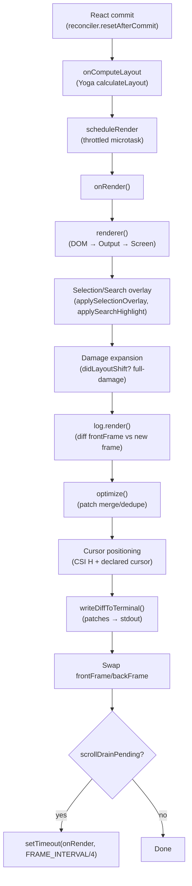

# The Ink Renderer and Terminal Engine

## Overview

cc's entire terminal user interface runs through Ink, a React-for-CLI framework that treats the terminal as a rendering surface much like a browser treats the DOM. Unlike traditional CLI programs that print lines sequentially, cc maintains a persistent virtual screen buffer, diffs it against the previous frame, and writes only the changed cells to the physical terminal. This architecture enables rich interactions that feel closer to a GUI than a command line: streaming text, inline spinners, scrollable output regions, full-screen text selection, and search highlighting that updates every frame.

The rendering pipeline spans four files that form a clean layering: `ink.tsx` orchestrates the React reconciler, frame lifecycle, and terminal I/O; `screen.ts` defines the packed-cell buffer that represents a virtual screen; `output.ts` collects render-tree operations and commits them to a Screen; and `Ansi.tsx` bridges external ANSI-formatted strings into the Ink component tree. Together they implement what the HER calls progressive disclosure (section 9) -- the terminal shows a narrow viewport of the conversation, expanding on demand as the user scrolls, and the render pipeline ensures only the visible delta reaches stdout.

This chapter traces the full lifecycle: from React component tree through Yoga layout, into the Screen buffer, across the diff engine, and out to the physical terminal as ANSI escape sequences.

## Data structures and contracts

### The Screen type

The `Screen` type is the central data structure. It represents a 2D grid of cells backed by packed `Int32Array` storage, eliminating per-cell object allocation and GC pressure for a typical 200x120 terminal (24,000 cells). Each cell occupies two `Int32` words: word 0 holds a character ID (index into `CharPool`), and word 1 packs three fields via bit shifting -- `styleId` in bits 17-31, `hyperlinkId` in bits 2-16, and `CellWidth` in bits 0-1.

```
// src/ink/screen.ts:L366-L415 — Screen packed-cell buffer type
export type Screen = Size & {
  // Packed cell data — 2 Int32s per cell: [charId, packed(styleId|hyperlinkId|width)]
  // cells and cells64 are views over the same ArrayBuffer.
  cells: Int32Array
  cells64: BigInt64Array // 1 BigInt64 per cell — used for bulk fill in resetScreen/clearRegion

  // Shared pools — IDs are valid across all screens using the same pools
  charPool: CharPool
  hyperlinkPool: HyperlinkPool

  // Empty style ID for comparisons
  emptyStyleId: number

  /**
   * Bounding box of cells that were written to (not blitted) during rendering.
   * Used by diff() to limit iteration to only the region that could have changed.
   */
  damage: Rectangle | undefined

  /**
   * Per-cell noSelect bitmap — 1 byte per cell, 1 = exclude from text
   * selection (copy + highlight).
   */
  noSelect: Uint8Array

  /**
   * Per-ROW soft-wrap continuation marker. softWrap[r]=N>0 means row r
   * is a word-wrap continuation of row r-1.
   */
  softWrap: Int32Array
}
```

The `cells64` view is a `BigInt64Array` over the same `ArrayBuffer`. This dual-view design is the key to fast clears: `resetScreen` fills all cells with a single `cells64.fill(0n)` call rather than iterating with `Int32Array` writes. The empty cell value (char index 0 = space, styleId 0, no hyperlink, narrow width) packs to exactly 0 in both `Int32` words, so a zero-fill is equivalent to resetting every cell to blank.

The `damage` rectangle tracks which cells were written (not blitted) during rendering. The diff engine uses this to limit iteration to only the region that could have changed, skipping the vast majority of cells in a typical frame where most content is unchanged.

The `noSelect` bitmap marks cells that should be excluded from text selection and highlighting. This is used by `<NoSelect>` components to fence off gutters (line numbers, diff sigils) so click-drag over a diff yields clean, copyable code without unwanted sigil characters.

### The CharPool and StylePool

The `CharPool` class provides string interning with an ASCII fast path. When a character's code point is below 128, it uses a direct `Int32Array` lookup instead of a `Map.get`, avoiding hash computation for the majority of terminal content.

```
// src/ink/screen.ts:L22-L48 — CharPool with ASCII fast path
export class CharPool {
  private strings: string[] = [' ', ''] // Index 0 = space, 1 = empty (spacer)
  private stringMap = new Map<string, number>([
    [' ', 0],
    ['', 1],
  ])
  private ascii: Int32Array = initCharAscii() // charCode → index, -1 = not interned

  intern(char: string): number {
    // ASCII fast-path: direct array lookup instead of Map.get
    if (char.length === 1) {
      const code = char.charCodeAt(0)
      if (code < 128) {
        const cached = this.ascii[code]!
        if (cached !== -1) return cached
        const index = this.strings.length
        this.strings.push(char)
        this.ascii[code] = index
        return index
      }
    }
    const existing = this.stringMap.get(char)
    if (existing !== undefined) return existing
    const index = this.strings.length
    this.strings.push(char)
    this.stringMap.set(char, index)
    return index
  }

  get(index: number): string {
    return this.strings[index] ?? ' '
  }
}
```

The `StylePool` class interns `AnsiCode[]` arrays and caches style transitions. Given two style IDs, `transition(fromId, toId)` returns the pre-serialized ANSI string to switch between them, eliminating per-cell `diffAnsiCodes` + `ansiCodesToString` calls after the first transition of any given pair. The style ID encoding uses bit 0 as a visibility flag: foreground-only styles get even IDs, and styles with visible effects on space characters (background, inverse, underline, strikethrough, overline) get odd IDs. This lets the renderer skip invisible spaces with a single bitmask check.

The `StylePool` also provides `withInverse(baseId)` and `withCurrentMatch(baseId)` methods for selection and search-highlight overlays. The `withCurrentMatch` method pushes yellow-fg (which inverse swaps to yellow-bg), bold, underline, and inverse onto the base style, producing a distinctive "you are here" visual marker. The `withSelectionBg` method replaces the cell's background with a solid theme-aware color instead of SGR-7 inverse, matching native terminal selection behavior.

### The Frame type

A `Frame` wraps a `Screen` together with viewport dimensions and cursor position. It is the unit of double-buffering -- `ink.tsx` maintains `frontFrame` (the last-rendered state) and `backFrame` (a reusable buffer), swapping them after each render cycle.

```
// src/ink/frame.ts:L12-L20 — Frame type
export type Frame = {
  readonly screen: Screen
  readonly viewport: Size
  readonly cursor: Cursor
  /** DECSTBM scroll optimization hint (alt-screen only, null otherwise). */
  readonly scrollHint?: ScrollHint | null
  /** A ScrollBox has remaining pendingScrollDelta — schedule another frame. */
  readonly scrollDrainPending?: boolean
}
```

The `scrollDrainPending` flag drives the drain mechanism: when a ScrollBox has pending scroll delta left after a frame, `onRender` schedules a follow-up frame via `setTimeout` at a quarter of `FRAME_INTERVAL_MS` (~250 fps practical floor), keeping scroll smooth without coupling to React's commit cycle. Drain frames are cheap -- typically a DECSTBM scroll plus ~10 patches, ~200 bytes -- so the high scheduling rate does not burden the terminal.

### The Output operation collector

`Output` does not write directly to a Screen. Instead, it collects a list of typed operations and commits them all in `get()`. This deferred-execution design enables the two-pass commit: pass 1 expands damage regions from `ClearOperation`s and collects absolute-positioned clears; pass 2 executes blits, writes, and shifts in DOM order, with clip stacking and absolute-clear exclusion.

```
// src/ink/output.ts:L62-L69 — Operation union type
export type Operation =
  | WriteOperation
  | ClipOperation
  | UnclipOperation
  | BlitOperation
  | ClearOperation
  | NoSelectOperation
  | ShiftOperation
```

Each operation type serves a distinct purpose. `WriteOperation` writes styled text at a position with optional soft-wrap tracking. `BlitOperation` bulk-copies a rectangular region from a source Screen using `TypedArray.set()`, which is the fast path for unchanged subtrees. `ClipOperation` and `UnclipOperation` push and pop a clip rectangle stack, intersecting nested clips so overflow-hidden boxes cannot write outside their ancestors. `ShiftOperation` scrolls rows within a range, mirroring DECSTBM + SU/SD terminal commands. `ClearOperation` zeroes a region, with a `fromAbsolute` flag for the absolute-positioned node ghosting problem. `NoSelectOperation` marks a region as non-selectable and runs last so it wins over blits and writes.

The `Output` also maintains a `charCache` that persists across frames. This is the main performance win: most lines do not change between renders, so tokenization + grapheme clustering becomes a cache hit. The cache is capped at 16384 entries to prevent unbounded growth, cleared when the threshold is exceeded.

### The Ink class

The `Ink` class in `ink.tsx` is the top-level orchestrator. It owns the React reconciler container, the `FocusManager`, the terminal I/O abstraction, the selection state, and the search-highlight state. Its constructor wires together the render pipeline, from React reconciliation through terminal writes.

```
// src/ink/ink.tsx:L76-L98 — Ink class fields (partial)
export default class Ink {
  private readonly log: LogUpdate;
  private readonly terminal: Terminal;
  private scheduleRender: (() => void) & { cancel?: () => void; };
  private isUnmounted = false;
  private isPaused = false;
  private readonly container: FiberRoot;
  private rootNode: dom.DOMElement;
  readonly focusManager: FocusManager;
  private renderer: Renderer;
  private readonly stylePool: StylePool;
  private charPool: CharPool;
  private hyperlinkPool: HyperlinkPool;
  private frontFrame: Frame;
  private backFrame: Frame;
  // ...
}
```

The `scheduleRender` function is a throttled wrapper around `queueMicrotask(this.onRender)`, bounded to `FRAME_INTERVAL_MS` with both leading and trailing edges. The microtask deferral is critical: the reconciler's `resetAfterCommit` fires before React's layout phase, so any state set in `useLayoutEffect` (notably `cursorDeclaration` from `useDeclaredCursor`) would lag one commit behind if rendering were synchronous. The trailing edge ensures that the final state after a burst of commits is always rendered, even if intermediate commits are collapsed by throttling.

### The CellWidth enum

Wide characters (CJK ideographs, emoji) occupy two terminal cells. The `CellWidth` const enum classifies each cell's width role:

```
// src/ink/screen.ts:L289-L300 — CellWidth classification
export const enum CellWidth {
  // Not a wide character, cell width 1
  Narrow = 0,
  // Wide character, cell width 2. This cell contains the actual character.
  Wide = 1,
  // Spacer occupying the second visual column of a wide character. Do not render.
  SpacerTail = 2,
  // Spacer at the end of a soft-wrapped line indicating that a wide character
  // continues on the next line.
  SpacerHead = 3,
}
```

The two-cell model for wide characters is self-describing: the `Wide` cell contains the actual character, and the `SpacerTail` cell in the next column is automatically created by `setCellAt`. This makes cursor positioning straightforward -- every cell in the array maps to exactly one visual column, and wide characters are always followed by their spacer. The `SpacerHead` variant handles the edge case where a wide character at the end of a soft-wrapped line cannot fit and wraps to the next row.

## Control flow

### The render pipeline

The render pipeline runs on every frame, driven by `onRender()`. The following diagram shows the major stages from React commit through terminal write.



The pipeline begins when React commits a state update. The reconciler's `resetAfterCommit` fires, which calls `rootNode.onRender` (wired to `scheduleRender`). The `onComputeLayout` callback runs during the commit phase to calculate Yoga layout with the current terminal dimensions, so `useLayoutEffect` hooks have access to fresh layout data.

When the throttled microtask fires, `onRender()` calls `renderer()` to produce a new `Frame`. The renderer walks the DOM tree, calls `renderNodeToOutput()` to populate an `Output` with operations, and commits them via `output.get()`. The `renderNodeToOutput` function is the workhorse: it traverses each DOM node, translates its Yoga-computed position and size into screen coordinates, and generates write, blit, clip, clear, and shift operations.

A critical optimization in the renderer is the `prevScreen` parameter passed to `renderNodeToOutput`. When `prevFrameContaminated` is false and no absolute-positioned child was removed, the renderer passes the previous frame's screen as `prevScreen`. Each node can then blit its unchanged subtree directly from the previous frame's buffer instead of re-rendering all children. This is the O(unchanged) fast path for steady-state frames where only a spinner rotates or a clock ticks.

After the renderer returns, `onRender()` applies overlays. `applySelectionOverlay` inverts selected cells in the screen buffer, and `applySearchHighlight` inverts cells matching the search query. These overlays mutate the screen buffer directly via `setCellStyleId`, which does not track damage -- so when selection or highlight is active, `onRender()` forces full-screen damage to ensure the diff engine inspects every cell.

The diff engine (`log.render()`) compares `frontFrame` (the previous frame) against the new frame and produces a list of `Patch` objects. The optimizer merges adjacent patches and deduplicates redundant cursor moves. Finally, `writeDiffToTerminal()` serializes the patches into ANSI escape sequences and writes them to stdout.

### The onRender method

The `onRender` method is the frame's control center. It orchestrates diff computation, overlay application, cursor positioning, and terminal writes.

```
// src/ink/ink.tsx:L420-L448 — onRender entry (abbreviated)
onRender() {
  if (this.isUnmounted || this.isPaused) {
    return;
  }
  // ...
  const frame = this.renderer({
    frontFrame: this.frontFrame,
    backFrame: this.backFrame,
    isTTY: this.options.stdout.isTTY,
    terminalWidth,
    terminalRows,
    altScreen: this.altScreenActive,
    prevFrameContaminated: this.prevFrameContaminated
  });
  // ... selection/highlight overlays, damage expansion ...
  const diff = this.log.render(prevFrame, frame, this.altScreenActive,
    SYNC_OUTPUT_SUPPORTED);
  // Swap buffers
  this.backFrame = this.frontFrame;
  this.frontFrame = frame;
  // ... cursor positioning, writeDiffToTerminal ...
}
```

The `renderer()` call at line 440 produces a new `Frame` by walking the React DOM tree and rendering each node into the Output operation collector. The `prevFrameContaminated` flag tells the renderer whether blitting from `frontFrame.screen` is safe -- it is not when the previous frame's screen was mutated by the selection overlay, reset to blanks, or reset to 0x0 by `forceRedraw()`.

After the diff, the code swaps `frontFrame` and `backFrame`. This double-buffering means the next frame's renderer can blit unchanged subtrees from `frontFrame.screen` (now the previous frame) without re-rendering them, while the new frame is written into the recycled `backFrame` screen buffer.

The method then handles cursor positioning. For alt-screen mode, it prepends a `CSI H` (cursor home) to anchor the physical cursor at (0,0) before the diff writes, and appends a cursor position to park the physical cursor at the bottom row where the prompt input is. For main-screen mode, it emits relative cursor moves to adjust from the previous frame's cursor position. A `cursorDeclaration` mechanism allows components (via `useDeclaredCursor`) to declare where the terminal cursor should be parked after each frame, enabling IME preedit text to appear inline and screen readers to follow the input caret.

### The renderer function

The `createRenderer` function in `renderer.ts` returns a closure that reuses the `Output` instance across frames to preserve `charCache`. It reads the Yoga-computed dimensions from the root DOM node and creates or resets a Screen buffer.

```
// src/ink/renderer.ts:L31-L37 — createRenderer factory
export default function createRenderer(
  node: DOMElement,
  stylePool: StylePool,
): Renderer {
  let output: Output | undefined
  return options => {
    // ...
    if (output) {
      output.reset(width, height, screen)
    } else {
      output = new Output({ width, height, stylePool, screen })
    }
```

The renderer clamps alt-screen height to `terminalRows` even if Yoga computes a larger value. This guards against bugs where a component renders outside `<AlternateScreen>` as a sibling, which would exceed the terminal's row count and corrupt the cursor model. When overflow is detected, a debug warning is logged.

For alt-screen frames, the renderer fakes `viewport.height = rows + 1` so that the `shouldClearScreen()` check (which treats exactly-filling content as "overflows" for scrollback purposes) never fires. Alt-screen content is always exactly `rows` tall but never scrolls -- the cursor.y clamp keeps the cursor-restore from emitting an LF at the last row.

### The diff engine

The `diffEach` function in `screen.ts` compares two Screens and invokes a callback for each cell that changed. It uses the `damage` rectangles from both screens to narrow the comparison region, then dispatches each row to a small, JIT-friendly function.

```
// src/ink/screen.ts:L1156-L1206 — diffEach entry point
export function diffEach(
  prev: Screen,
  next: Screen,
  cb: DiffCallback,
): boolean {
  const prevWidth = prev.width
  const nextWidth = next.width
  // ...
  let region: Rectangle
  if (prevWidth === 0 && prevHeight === 0) {
    region = { x: 0, y: 0, width: nextWidth, height: nextHeight }
  } else if (next.damage) {
    region = next.damage
    if (prev.damage) {
      region = unionRect(region, prev.damage)
    }
  } else if (prev.damage) {
    region = prev.damage
  } else {
    region = { x: 0, y: 0, width: 0, height: 0 }
  }
  // ...
  if (prevWidth === nextWidth) {
    return diffSameWidth(prev, next, region.x, endX, region.y, endY, cb)
  }
  return diffDifferentWidth(prev, next, region.x, endX, region.y, endY, cb)
}
```

When both screens have the same width, `diffSameWidth` dispatches each row to `diffRowBoth`, `diffRowRemoved`, or `diffRowAdded` depending on whether the row exists in one or both screens. The `diffRowBoth` function uses `findNextDiff` -- a tiny pure function that scans `Int32` pairs and returns the offset of the first difference -- to skip long runs of identical cells without per-cell callback overhead. The two reusable `Cell` objects (`prevCell` and `nextCell`) are allocated once and overwritten each call, avoiding per-change allocations.

When widths differ (after a resize), `diffDifferentWidth` maintains separate indices for both screens and handles the boundary columns that exist in only one screen.

### The Output commit and writeLineToScreen

The `Output.get()` method executes all collected operations in order, producing a populated `Screen`. Its two-pass design handles a subtle interaction between absolute-positioned nodes and the blit optimization.

Pass 1 iterates all `ClearOperation`s to expand the damage region and collect `absoluteClears` -- rectangles where absolute-positioned nodes previously painted. Pass 2 processes `BlitOperation`s, `WriteOperation`s, `ShiftOperation`s, and clip stack management. For blits, the code checks each row against `absoluteClears` to avoid re-copying stale content from an absolute node's previous frame paint.

The `writeLineToScreen` function handles the per-character hot loop: tokenization, grapheme clustering (via `Intl.Segmenter`), style interning, wide-character spacer insertion, and C0 control character handling.

```
// src/ink/output.ts:L633-L651 — writeLineToScreen entry
function writeLineToScreen(
  screen: Screen,
  line: string,
  x: number,
  y: number,
  screenWidth: number,
  stylePool: StylePool,
  charCache: Map<string, ClusteredChar[]>,
): number {
  let characters = charCache.get(line)
  if (!characters) {
    characters = reorderBidi(
      styledCharsWithGraphemeClustering(
        styledCharsFromTokens(tokenize(line)),
        stylePool,
      ),
    )
    charCache.set(line, characters)
  }
```

The function first checks `charCache` for a previously computed `ClusteredChar[]`. On cache hit, the per-character loop is reduced to property reads and `setCellAt` calls -- no stringWidth, no style interning, no hyperlink extraction. On cache miss, it tokenizes the line (splitting ANSI escape sequences from plain text), clusters grapheme segments (handling family emoji and combining marks), reorders for bidirectional text, and caches the result.

The C0 control character handling deserves attention. Tab (0x09) is expanded to spaces reaching the next 8-column tab stop. ESC (0x1B) sequences that `ansi-tokenize` did not recognize are skipped entirely -- this includes cursor movement sequences, screen clearing, and terminal title settings that would otherwise desync the virtual cursor model. Carriage return, backspace, bell, and other control characters are also skipped, since their cursor-moving effects would conflict with the screen buffer's position tracking.

### The Ansi component

The `Ansi` component is the bridge between external ANSI-formatted strings and Ink's component tree. When a tool produces colored output (e.g., syntax-highlighted code from `cli-highlight`), that output arrives as a string containing embedded ANSI escape sequences. `Ansi` parses those sequences into styled spans and renders each span as an Ink `Text` or `Link` component.

```
// src/ink/Ansi.tsx:L32-L49 — Ansi component (React.memo)
export const Ansi = React.memo(function Ansi(t0) {
  const $ = _c(12);
  const {
    children,
    dimColor
  } = t0;
  if (typeof children !== "string") {
    // non-string children: coerce with String(), optionally dim
  }
  if (children === "") {
    return null;
  }
  // ... parseToSpans, render spans with Text/Link/StyledText ...
});
```

The component is memoized with `React.memo` to prevent re-renders when the parent changes but the children string is the same. The `parseToSpans` function uses the `termio` `Parser` to tokenize the input, then converts each `TextStyle` into `SpanProps` (color, bold, italic, underline, etc.). Adjacent spans with identical props are merged to minimize React element count.

The `StyledText` wrapper handles the mutual exclusivity of `bold` and `dim` in terminal rendering. When both are set, `dim` takes precedence because most terminal emulators treat them as mutually exclusive SGR attributes (SGR 1 = bold, SGR 2 = dim). The `colorToString` function maps termio's `Color` type into Ink's color format strings: named colors become `ansi:name`, indexed colors become `ansi256(n)`, and RGB colors become `rgb(r,g,b)`.

```mermaid
classDiagram
    class Ink {
        +frontFrame: Frame
        +backFrame: Frame
        +stylePool: StylePool
        +charPool: CharPool
        +hyperlinkPool: HyperlinkPool
        +selection: SelectionState
        +altScreenActive: boolean
        +onRender()
        +scheduleRender()
        +render(node)
        +unmount()
        +enterAlternateScreen()
        +exitAlternateScreen()
        +forceRedraw()
        +setSearchHighlight(query)
    }
    class Frame {
        +screen: Screen
        +viewport: Size
        +cursor: Cursor
        +scrollHint: ScrollHint
        +scrollDrainPending: boolean
    }
    class Screen {
        +cells: Int32Array
        +cells64: BigInt64Array
        +charPool: CharPool
        +hyperlinkPool: HyperlinkPool
        +emptyStyleId: number
        +damage: Rectangle
        +noSelect: Uint8Array
        +softWrap: Int32Array
    }
    class Output {
        +width: number
        +height: number
        +operations: Operation[]
        +write()
        +blit()
        +clip()
        +clear()
        +shift()
        +noSelect()
        +get() Screen
    }
    class StylePool {
        +none: number
        +intern(styles) number
        +transition(from, to) string
        +withInverse(baseId) number
        +withCurrentMatch(baseId) number
        +withSelectionBg(baseId) number
    }
    class CharPool {
        +intern(char) number
        +get(index) string
    }
    class Ansi {
        +children: string
        +dimColor: boolean
    }
    Ink --> Frame : frontFrame, backFrame
    Frame --> Screen : screen
    Ink --> StylePool : stylePool
    Ink --> Output : via renderer
    Screen --> CharPool : charPool
    Screen --> StylePool : emptyStyleId
    Output --> Screen : produces
    Ansi --> "Text/Link" : renders spans
```

### Alt-screen vs main-screen

cc operates in two modes with fundamentally different cursor semantics. In main-screen mode (the default for non-interactive output), Ink uses `LogUpdate`'s relative cursor moves, and `cursor.y` tracks scrollback rows that `CSI H` cannot reach. In alt-screen mode (fullscreen REPL), every frame begins with `CSI H` (cursor home) to anchor the physical cursor at (0,0), and all subsequent moves are relative to that known position. This self-heals against external cursor drift from tmux pane redraws or terminal status bar refreshes.

The `ALT_SCREEN_ANCHOR_CURSOR` frozen object at line 45 replaces the previous frame's cursor for diff computation in alt-screen:

```
// src/ink/ink.tsx:L45-L49 — Alt-screen anchor cursor
const ALT_SCREEN_ANCHOR_CURSOR = Object.freeze({
  x: 0,
  y: 0,
  visible: false
});
```

By passing `prevFrame = { ...this.frontFrame, cursor: ALT_SCREEN_ANCHOR_CURSOR }` to `log.render()`, the diff engine computes moves relative to (0,0) regardless of where the previous frame's cursor ended up. The `CSI H` write is deferred until after the diff is computed so it can be skipped for empty diffs (no writes means the physical cursor position is irrelevant).

The alt-screen mode also handles SIGCONT (resume after Ctrl+Z), resize, and terminal sleep/wake scenarios. The `handleResume` method detects alt-screen mode and calls `reenterAltScreen()`, which writes `ENTER_ALT_SCREEN + ERASE_SCREEN + CURSOR_HOME` and resets frame buffers. The `reassertTerminalModes` method is called on >5s stdin silence to re-enable extended key reporting and mouse tracking, with a pop-before-push strategy for the Kitty keyboard protocol to prevent stack depth accumulation.

### Pool reset and generational migration

During long sessions, the `CharPool` and `HyperlinkPool` accumulate entries that are no longer referenced. `onRender` checks every frame whether 5 minutes have elapsed since the last pool reset.

```
// src/ink/ink.tsx:L598-L603 — Pool reset timing
if (renderStart - this.lastPoolResetTime > 5 * 60 * 1000) {
  this.resetPools();
  this.lastPoolResetTime = renderStart;
}
```

The `migrateScreenPools` function in `screen.ts` walks the packed `cells` array, re-interning each character ID and hyperlink ID into the new pools. It uses bit manipulation to extract and repack the `hyperlinkId` field from word1 while preserving the `styleId` and `width` fields.

```
// src/ink/screen.ts:L554-L587 — migrateScreenPools
export function migrateScreenPools(
  screen: Screen,
  charPool: CharPool,
  hyperlinkPool: HyperlinkPool,
): void {
  const oldCharPool = screen.charPool
  const oldHyperlinkPool = screen.hyperlinkPool
  if (oldCharPool === charPool && oldHyperlinkPool === hyperlinkPool) return

  const size = screen.width * screen.height
  const cells = screen.cells

  for (let ci = 0; ci < size << 1; ci += 2) {
    const oldCharId = cells[ci]!
    cells[ci] = charPool.intern(oldCharPool.get(oldCharId))

    const word1 = cells[ci + 1]!
    const oldHyperlinkId = (word1 >>> HYPERLINK_SHIFT) & HYPERLINK_MASK
    if (oldHyperlinkId !== 0) {
      const oldStr = oldHyperlinkPool.get(oldHyperlinkId)
      const newHyperlinkId = hyperlinkPool.intern(oldStr)
      const styleId = word1 >>> STYLE_SHIFT
      const width = word1 & WIDTH_MASK
      cells[ci + 1] = packWord1(styleId, newHyperlinkId, width)
    }
  }

  screen.charPool = charPool
  screen.hyperlinkPool = hyperlinkPool
}
```

This is O(width * height) but runs at most once per 5 minutes, making the cost negligible. The `StylePool` is not reset because it is session-lived -- style IDs are stable across pool generations since the pool is never discarded, only its transition cache grows.

### The blit fast path

The `blitRegion` function in `screen.ts` is the workhorse of the O(unchanged) optimization. It bulk-copies a rectangular region from a source Screen to a destination Screen using `TypedArray.set()`, which is implemented as a native memory copy in V8 and Bun.

```
// src/ink/screen.ts:L858-L910 — blitRegion (partial)
export function blitRegion(
  dst: Screen,
  src: Screen,
  regionX: number,
  regionY: number,
  maxX: number,
  maxY: number,
): void {
  // ...
  // Fast path: contiguous memory when copying full-width rows at same stride
  if (regionX === 0 && maxX === src.width && src.width === dst.width) {
    const srcStart = regionY * srcStride
    const totalBytes = (maxY - regionY) * srcStride
    dstCells.set(
      srcCells.subarray(srcStart, srcStart + totalBytes),
      srcStart,
    )
    // noSelect is 1 byte/cell vs cells' 8 — same region, different scale
    const nsStart = regionY * src.width
    const nsLen = (maxY - regionY) * src.width
    dstNoSel.set(srcNoSel.subarray(nsStart, nsStart + nsLen), nsStart)
  } else {
    // Per-row copy for partial-width or mismatched-stride regions
    // ...
  }
```

The fast path checks whether the blit covers full-width rows with matching strides. When it does, a single `TypedArray.set()` call copies the entire region in one native memory operation. The slow path handles partial-width or mismatched-stride regions with per-row copies. Both paths also copy the `noSelect` bitmap and `softWrap` array alongside the cell data, preserving selection markers and wrap provenance across blits.

The `shiftRows` function similarly uses `BigInt64Array.copyWithin()` to shift rows in-place, which is equivalent to the terminal's DECSTBM + SU/SD scroll operations but performed in the virtual buffer. This avoids re-rendering the entire scroll region when only the viewport position changes.

## Edge cases and failure modes

### Wide character desync

CJK characters and emoji occupy two terminal cells. If a wide character lands at the last column, it cannot fit -- the terminal would wrap it to the next line, desyncing the virtual cursor model. `writeLineToScreen` handles this by placing a `SpacerHead` at the last column instead, matching terminal behavior. The `setCellAt` function in `screen.ts` must also clean up orphaned spacers: when a wide character is overwritten by a narrow one, its `SpacerTail` in the next column remains as a ghost cell that the diff/render pipeline would skip, causing stale content from previous frames to leak through. The code checks `prevWidth === CellWidth.Wide && cell.width !== CellWidth.Wide` and explicitly clears the orphaned spacer. Symmetrically, when overwriting a `SpacerTail` with a non-spacer cell, the code clears the orphaned `Wide` character at the preceding column to prevent a desync where the terminal still renders it with width 2.

### Alt-screen cursor drift

In alt-screen mode, any external process that perturbs the physical cursor (tmux status bar refresh, pane redraw, Cmd+K wipe) causes relative cursor moves to drift, making content creep up one row per frame. The `CSI H` (cursor home) at the start of every alt-screen diff self-heals this by resetting the physical cursor to (0,0). The diff then computes all moves relative to that known anchor. The `ALT_SCREEN_ANCHOR_CURSOR` object substitutes the previous frame's cursor position for diff computation, so the diff engine always starts from (0,0).

The `needsEraseBeforePaint` flag handles the resize case. When the terminal width increases, existing shorter lines leave old-width text tails visible. The diff only writes cells that changed; cells where new=blank and prev-buffer=blank get skipped, but the physical terminal still has stale content. The `ERASE_SCREEN` is prepended to the diff inside the BSU/ESU (Begin Synchronized Update / End Synchronized Update) block, so old content stays visible until the whole erase+paint lands atomically.

### Selection overlay contamination

The selection and search-highlight overlays mutate the screen buffer in-place via `setCellStyleId`. After the frame is rendered and the frontFrame is swapped, those mutated cells persist in the buffer. Blitting from that buffer in the next frame would copy inverted cells as if they were normal content. The `prevFrameContaminated` flag marks this condition. When set, the next frame's renderer receives `prevScreen: undefined` (disabling the blit optimization) and forces full-screen damage (every cell is compared). The flag is cleared at the end of each `onRender` call, making it one-shot.

A subtler contamination path occurs when an absolute-positioned node (like a modal overlay) is removed. The previous frame's screen contains the overlay's painted cells, and a normal-flow sibling's blit would restore those cells from the previous frame as if they were still current. The `consumeAbsoluteRemovedFlag()` check in the renderer detects this condition and also passes `prevScreen: undefined` to force a full re-render.

### Pool growth during long sessions

The `CharPool`, `HyperlinkPool`, and `StylePool` accumulate entries monotonically. For a multi-hour session, this growth is bounded by the number of unique characters, hyperlinks, and style combinations the terminal has ever displayed. The `StylePool.transitionCache` is particularly susceptible because it caches every (fromId, toId) pair ever encountered -- in a session with thousands of distinct style transitions, this cache can grow without bound. The 5-minute generational pool reset addresses this by creating fresh pools and migrating existing screen buffers via `migrateScreenPools`. The `StylePool` itself is not reset since style IDs are used directly in the packed cell storage; instead, its caches grow to a steady-state size determined by the number of unique style combinations in the UI.

### Resize flicker

Terminal emulators often emit 2+ resize events for a single user action (window settling). `handleResize` is not debounced precisely because a debounce opens a window where `stdout.columns` is new but `terminalColumns`/Yoga are old -- any `scheduleRender` during that window (spinner, clock) makes `log-update` detect a width change and clear the screen, then the debounce fires and clears again (double blank-then-paint flicker). The synchronous resize handler updates `terminalColumns` and `terminalRows` immediately, calls `render()` to propagate the new dimensions through React and Yoga, and lets the resulting `onRender` handle the repaint atomically.

### Layout shift and sibling-resize bleed

When flexbox siblings resize between frames (e.g., a spinner appears, the bottom section grows, the scrollbox shrinks), the per-node damage tracking can miss transition cells at the boundary. A node's cached-clear + clip-and-cull + `setCellAt` damage union covers its own region, but the boundary row where two siblings meet may have stale content from the previous frame's layout. The `didLayoutShift()` function tracks whether any node's Yoga position or size differs from the previous frame. When layout has shifted, `onRender()` forces full-screen damage as a correctness backstop. Steady-state frames (spinner rotation, clock tick, text stream into a fixed-height box) do not shift layout, so normal damage bounds are correct and `diffEach` only compares the damaged region.

### Editor handoff stdin leak

When cc hands the terminal over to an external editor (vim, nano, less) via `enterAlternateScreen()`, it must disable Ink's stdin handling to prevent keystrokes from being swallowed. The `suspendStdin` method removes all `readable` event listeners from stdin and disables raw mode. The `resumeStdin` method re-attaches the stored listeners and re-enables raw mode. The `exitAlternateScreen` method also re-enables extended key reporting (Kitty keyboard protocol and modifyOtherKeys) with a pop-before-push strategy: terminal editors write their own `modifyOtherKeys` level on entry and reset it on exit, leaving cc unable to distinguish Ctrl+Shift+letter from Ctrl+letter. The pop restores the stack to its pre-editor depth, then the push re-enables the protocol.

## Where cc diverges from the published pattern

The HER reference architecture (section 21, Layer 3) prescribes "Progressive compaction at token thresholds" and "observation masking (suppress successful outputs)." cc's Ink renderer implements a different form of progressive disclosure: the terminal shows only the visible viewport of the conversation, and the scroll mechanism loads content on demand. This is not token-level compaction but viewport-level occlusion -- the entire conversation is rendered into the virtual screen buffer, but only the diff between frames reaches the physical terminal. The observation masking pattern (HER section 8.1, which reports 52% cost reduction) applies at the model context level, not the terminal level; the renderer's job is to show everything the user can see, not to suppress it.

HER section 3.4 (Lifecycle Hooks) describes `PreToolUse` and `PostToolUse` as the primary lifecycle events. cc's render pipeline adds frame-level lifecycle hooks: `onFrame` fires after every render with timing breakdowns (renderer ms, diff ms, optimize ms, write ms, yoga ms, commit ms, yoga node counts). This observability is critical for diagnosing performance regressions in long sessions where the render pipeline is on the hot path. The `FlickerReason` type (`'resize' | 'offscreen' | 'clear'`) categorizes full-screen repaints so developers can distinguish legitimate resize handling from pathological rendering loops.

The `Screen` packed-cell design diverges from typical Ink implementations (including the original Ink library) that store cells as JavaScript objects. cc's `Int32Array` + `BigInt64Array` approach eliminates 24,000 object allocations per frame for a 200x120 terminal, reducing GC pressure to near zero. The `visibleCellAtIndex` function further optimizes the diff path by returning `undefined` for spacer cells and invisible spaces without allocating a `Cell` object, using a `0x3fffc` bitmask to detect cells with no hyperlink and at most a foreground-only style.

The `Output` deferred-execution pattern also diverges from the simpler "write directly to screen" approach. By collecting operations and committing them in a two-pass process, cc can handle the absolute-positioned node ghosting problem (where a blit copies stale overlay paint from the previous frame) without special-casing in the render tree. The `absoluteClears` collection in pass 1 and the row-by-row exclusion in pass 2 are a render-pipeline-level solution to what would otherwise require per-component coordination.

## Developer takeaways for building a long-running agent

A terminal-rendering engine for a long-running agent must treat the screen as a persistent data structure, not a write-once output stream. The double-buffered Frame + Screen architecture gives you diff-based updates (only changed cells reach the terminal), blit optimization (unchanged subtrees copy from the previous frame without re-rendering), and correct overlay handling (selection and search highlights mutate the buffer in-place, with contamination flags to prevent stale blits). The packed Int32Array cell storage eliminates per-frame GC pressure that would cause jank in a 24,000-cell screen. The StylePool's transition cache and the CharPool's ASCII fast path matter more than they seem: the diff engine calls `transition()` for every cell that changes style, and `intern()` for every character that is written, so these inner-loop allocations compound quickly across thousands of frames. The alt-screen self-healing pattern (CSI H anchor + ALT_SCREEN_ANCHOR_CURSOR substitution) is essential for any agent that runs under tmux or ssh, where the terminal state can diverge from the virtual model without notification. The deferred ERASE_SCREEN inside BSU/ESU is the pattern to follow for resize handling: never clear the physical terminal synchronously, because the render that follows takes tens of milliseconds during which the user sees a blank screen. Finally, the damage-tracking + diffEach combination is what makes 60-fps terminal rendering feasible: narrowing the comparison to the damaged region means most frames compare only a few hundred cells instead of 24,000, and `findNextDiff`'s tight Int32 scan skips runs of identical cells without callback overhead.
