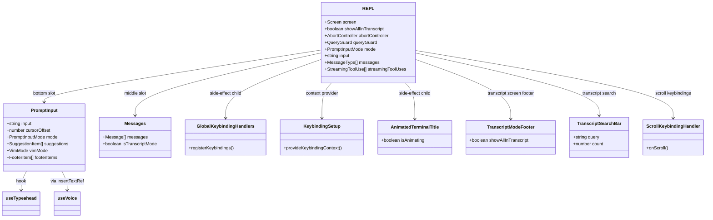
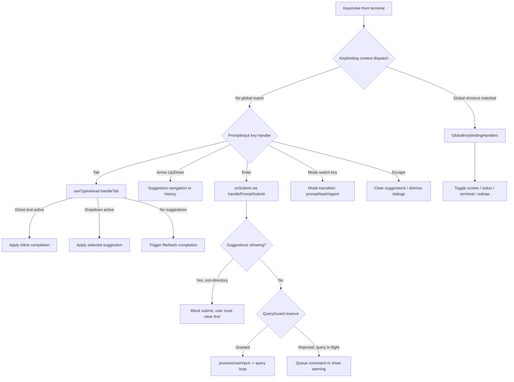

# REPL, PromptInput, Typeahead, Voice, Keybindings

## Overview

The REPL screen is cc's primary interaction surface -- the terminal view where the user types prompts, observes streaming model output, and manages the query lifecycle. At 5005 lines, `src/screens/REPL.tsx` is the largest component in the codebase. It orchestrates the full-screen layout, delegates prompt editing to `PromptInput`, and wires together a constellation of hooks that handle typeahead completion, voice dictation, and global keybindings. This chapter traces the component tree from the top-level `REPL` function down through `PromptInput`, `useTypeahead`, `useVoice`, and `useGlobalKeybindings`, examining how each layer transforms raw keystrokes into structured agent actions.

The REPL is not a simple read-eval-print loop in the Lisp sense. It is a stateful React component that manages two mutually exclusive screens -- `prompt` and `transcript` -- along with a gallery of modal overlays (model picker, quick-open, global search, history picker, and more). The `Screen` type is defined as a union of two string literals:

```
// src/screens/REPL.tsx:L571 — Screen type definition
export type Screen = 'prompt' | 'transcript';
```

The `prompt` screen shows the conversation with the `PromptInput` bar at the bottom; the `transcript` screen, toggled via `ctrl+o`, shows a scrollable, searchable log of all messages including tool invocations and their results. The transition between these two screens is governed by `GlobalKeybindingHandlers`, which also manages the toggle for todo lists, brief mode, terminal panels, and force-redraw recovery.

The REPL function at `src/screens/REPL.tsx:L572` begins by extracting its props and initializing a dense constellation of state. The `screen` state defaults to `'prompt'`. A `QueryGuard` instance provides a synchronous state machine for the query lifecycle, replacing the error-prone dual-state pattern where `isLoading` (React state, async-batched) and `isQueryRunning` (ref, sync) could desync. The `queryGuard` is consumed via `useSyncExternalStore` so React re-renders when the guard transitions, but synchronous readers (like the abort path) never see stale values. The comment at `src/screens/REPL.tsx:L897-L900` explains the motivation: the old pattern allowed `isLoading` and `isQueryRunning` to diverge during rapid submit/abort cycles, causing phantom loading states.

The REPL also manages a `setMessages` wrapper that eagerly updates a `messagesRef` before delegating to React's `rawSetMessages`. This is the Zustand pattern applied to React state: the ref is the source of truth, and React state is the render projection. The callback at `src/screens/REPL.tsx:L1198-L1222` applies the updater against the ref immediately, then hands React the computed value (not the function). Without this, paths that queue functional updaters then synchronously read the ref (such as `handleSpeculationAccept` followed by `onQuery`) would see stale data.

## Data structures and contracts

The `PromptInput` component accepts a large props object that reflects its responsibilities: it must handle text input, mode switching, suggestion state, queued commands, paste tracking, and voice integration. The type definition captures the surface area of this contract:

```
// src/components/PromptInput/PromptInput.tsx:L124-L189 — PromptInput Props type
type Props = {
  debug: boolean;
  ideSelection: IDESelection | undefined;
  toolPermissionContext: ToolPermissionContext;
  setToolPermissionContext: (ctx: ToolPermissionContext) => void;
  apiKeyStatus: VerificationStatus;
  commands: Command[];
  agents: AgentDefinition[];
  isLoading: boolean;
  verbose: boolean;
  messages: Message[];
  onAutoUpdaterResult: (result: AutoUpdaterResult) => void;
  autoUpdaterResult: AutoUpdaterResult | null;
  input: string;
  onInputChange: (value: string) => void;
  mode: PromptInputMode;
  onModeChange: (mode: PromptInputMode) => void;
  stashedPrompt: {
    text: string;
    cursorOffset: number;
    pastedContents: Record<number, PastedContent>;
  } | undefined;
  setStashedPrompt: (value: { ... }) => void;
  submitCount: number;
  onShowMessageSelector: () => void;
  onMessageActionsEnter?: () => void;
  mcpClients: MCPServerConnection[];
  pastedContents: Record<number, PastedContent>;
  setPastedContents: React.Dispatch<React.SetStateAction<Record<number, PastedContent>>>;
  vimMode: VimMode;
  setVimMode: (mode: VimMode) => void;
  showBashesDialog: string | boolean;
  setShowBashesDialog: (show: string | boolean) => void;
  onExit: () => void;
  getToolUseContext: (...) => ProcessUserInputContext;
  onSubmit: (input: string, helpers: PromptInputHelpers, ...) => Promise<void>;
  onAgentSubmit?: (input: string, task: ..., helpers: PromptInputHelpers) => Promise<void>;
  isSearchingHistory: boolean;
  setIsSearchingHistory: (isSearchingHistory: boolean) => void;
  onDismissSideQuestion?: () => void;
  isSideQuestionVisible?: boolean;
  helpOpen: boolean;
  setHelpOpen: React.Dispatch<React.SetStateAction<boolean>>;
  hasSuppressedDialogs?: boolean;
  isLocalJSXCommandActive?: boolean;
  insertTextRef?: React.MutableRefObject<{ insert: (text: string) => void; ... } | null>;
  voiceInterimRange?: { start: number; end: number; } | null;
};
```

The `insertTextRef` prop is the mechanism by which voice dictation injects text at the cursor position rather than replacing the entire input. Inside `PromptInput`, the ref is populated with an `insert` function that splices text at the current cursor offset, adding a leading space when the cursor is not at the start or end of existing text. The `voiceInterimRange` prop marks the span of interim (not-yet-finalized) speech-to-text output so that `PromptInput` can render it in a dim color. The `mode` prop is a `PromptInputMode` -- one of `prompt`, `bash`, or `agent` -- that determines which suggestion types and keybinding behaviors are active.

The `useTypeahead` hook has its own props contract, which mirrors a subset of `PromptInput`'s state:

```
// src/hooks/useTypeahead.tsx:L81-L117 — useTypeahead Props and return type
type Props = {
  onInputChange: (value: string) => void;
  onSubmit: (value: string, isSubmittingSlashCommand?: boolean) => void;
  setCursorOffset: (offset: number) => void;
  input: string;
  cursorOffset: number;
  commands: Command[];
  mode: string;
  agents: AgentDefinition[];
  setSuggestionsState: (f: (previousSuggestionsState: { ... }) => { ... }) => void;
  suggestionsState: { suggestions: SuggestionItem[]; selectedSuggestion: number; commandArgumentHint?: string; };
  suppressSuggestions?: boolean;
  markAccepted: () => void;
  onModeChange?: (mode: PromptInputMode) => void;
};
type UseTypeaheadResult = {
  suggestions: SuggestionItem[];
  selectedSuggestion: number;
  suggestionType: SuggestionType;
  maxColumnWidth?: number;
  commandArgumentHint?: string;
  inlineGhostText?: InlineGhostText;
  handleKeyDown: (e: KeyboardEvent) => void;
};
```

The `suggestionType` field drives a union of suggestion categories: `command`, `file`, `directory`, `agent`, `slack-channel`, `custom-title`, `shell`, or `none`. Each type maps to a distinct rendering mode in the footer and a distinct completion strategy in `handleTab`. The `commandArgumentHint` field shows a progressive hint for slash command arguments (e.g., after typing `/add-dir `, the hint displays the expected argument name). The `inlineGhostText` field provides a ghost-text completion that appears inline within the text input, used for both mid-input slash command completion and bash history completion.

The voice hook defines a compact contract centered on its three-state machine:

```
// src/hooks/useVoice.ts:L143-L155 — VoiceState and UseVoiceOptions/Return
type VoiceState = 'idle' | 'recording' | 'processing'

type UseVoiceOptions = {
  onTranscript: (text: string) => void
  onError?: (message: string) => void
  enabled: boolean
  focusMode: boolean
}

type UseVoiceReturn = {
  state: VoiceState
  handleKeyEvent: (fallbackMs?: number) => void
}
```

The `idle -> recording -> processing -> idle` cycle reflects the hold-to-talk interaction model: the user presses a key to start recording, releases to stop, and the hook transitions through `processing` while the WebSocket finalizes the transcript before returning to `idle`. The `focusMode` option switches to a focus-driven model where recording starts on terminal focus and stops on blur, with each final transcript flushed immediately for continuous dictation.

## Control flow

### REPL component tree

The `REPL` component is a full-screen layout container. Its render tree spans three major areas: a top slot for notifications and callouts, a middle slot for the `Messages` component (which renders the conversation transcript), and a bottom slot for `PromptInput` and its footer. The component also renders `GlobalKeybindingHandlers`, `KeybindingSetup`, and `AnimatedTerminalTitle` as side-effect-only children that register handlers and manage terminal state without producing visible UI.



The `AnimatedTerminalTitle` component at `src/screens/REPL.tsx:L484-L519` was extracted specifically to prevent the 960ms animation tick from re-rendering the entire REPL tree. Before extraction, every tick caused a full REPL render (including `PromptInput` and all its hooks) once per second for the duration of every turn. After extraction, the tick only re-renders the leaf component that returns `null` -- a pure side-effect on the terminal title. The `useTerminalTitle` hook inside it sets the tab title string, and the `isAnimating` prop controls whether the prefix cycles through the animation frames `['⠂', '⠐']`.

### Input processing pipeline

When a keystroke arrives at the terminal, Ink routes it through a chain of handlers. The `KeybindingSetup` provider establishes a keybinding context at the root; `GlobalKeybindingHandlers` registers handlers for global shortcuts (toggle todos, toggle transcript, redraw); `PromptInput` registers its own handlers for text editing, mode switching, and submission; and `useTypeahead`'s `handleKeyDown` intercepts Tab, arrow keys, and Escape to manage suggestion selection and dismissal.



The `handleTab` function in `useTypeahead` is the primary completion dispatch. It first checks for inline ghost text (synchronous slash-command completion in prompt mode, or async shell-history completion in bash mode). If ghost text is active, it applies the completion directly -- replacing the partial command with the full command plus a trailing space. Otherwise, it checks for active dropdown suggestions and applies the currently selected one. The `suggestionType` field determines the completion strategy: `command` suggestions are applied via `applyCommandSuggestion`, `directory` suggestions via `applyDirectorySuggestion`, and `custom-title` suggestions build a `/resume` command string.

For file suggestions specifically, `handleTab` at `src/hooks/useTypeahead.tsx:L1033-L1089` first computes the longest common prefix across all suggestions. If the common prefix is longer than what the user has typed, it applies the partial completion (common prefix) without clearing the suggestion list, so the user can continue typing to narrow the selection. Only when a single suggestion is selected does it apply the full replacement and clear the list. This two-level Tab behavior -- partial prefix completion on first Tab, full replacement on second -- mirrors the behavior of IDE autocomplete systems.

The `handleEnter` function at `src/hooks/useTypeahead.tsx:L1136-L1200` mirrors `handleTab`'s dispatch structure but with one critical difference: slash command suggestions are executed immediately on Enter (the second argument to `applyCommandSuggestion` is `true`), whereas Tab only inserts the command without executing it. For other suggestion types, Enter applies the completion without executing it, leaving the user in the input bar to review the result before pressing Enter again to submit.

### Typeahead suggestion pipeline

The `updateSuggestions` callback in `useTypeahead` is the central dispatch for all suggestion generation. It runs on every input change and implements a priority-ordered cascade:

1. **Mid-input slash commands** (prompt mode): `findMidInputSlashCommand` locates a `/` token at a non-initial position, and `getBestCommandMatch` looks up the closest match. Ghost text is computed synchronously via `syncPromptGhostText` (a `useMemo`), eliminating the one-frame flicker that occurred with the older `useState` + `useEffect` approach. The ghost text appears as faded characters after the cursor, showing how the partial command would be completed.

2. **Shell history** (bash mode): `getShellHistoryCompletion` performs an async lookup against the shell history cache and sets inline ghost text. The ghost text shows the suffix of the matching history entry after the cursor position.

3. **Agent/team-member mentions** (`@name`): Matches the `(^|\s)@([\w-]*)$` regex, reads the `agentNameRegistry` and `teamContext` from AppState, and produces `dm-` prefixed suggestions with descriptions like "send message" or "send message · running". Team leads are excluded from the list via a `TEAM_LEAD_NAME` check.

4. **Slack channel mentions** (`#channel`): Delegates to `getSlackChannelSuggestions` via a debounced fetch (150ms), gated on the presence of a Slack MCP server. The longer debounce reflects the MCP round-trip latency; subsequent keystrokes that share the same first-word segment hit the cache synchronously.

5. **Slash command dropdown** (input starts with `/`): `generateCommandSuggestions` filters the `commands` array. The `allCommandsMaxWidth` is computed once from all visible commands to prevent layout shift during filtering -- without it, the dropdown width would jump as the user types and narrows the list.

6. **File and MCP resource suggestions** (`@` symbol): `extractCompletionToken` identifies the completable token at the cursor, and `generateUnifiedSuggestions` merges file-system results with MCP resource results. A 50ms debounce sits above macOS default key-repeat (~33ms) so held-delete/backspace coalesces into one search instead of stuttering on each repeated key. The search itself takes approximately 8-15ms on a 270k-file index.

7. **Directory completion** (path-like tokens after `@`): `getPathCompletions` handles `~/`, `./`, and `/` prefixed paths directly, bypassing the fuzzy search. This avoids the latency of building a file index for absolute paths.

8. **Bash shell completions** (bash mode, no special trigger): `generateBashSuggestions` calls `getShellCompletions` which shells out to the user's shell for command and variable completion. If a single suggestion is returned, it is applied immediately without showing a dropdown.

The stale-result guards are critical for correctness. `latestSearchTokenRef`, `latestPathTokenRef`, `latestBashInputRef`, and `latestSlackTokenRef` each track the most recent query token; when an async operation resolves, it checks whether the token still matches the current input. If not, the result is silently discarded. The `dismissedForInputRef` prevents suggestions from re-appearing after the user explicitly dismisses them with Escape, until the input changes. The `prevInputRef` tracks the previous input value to detect actual text changes versus callback recreations, resetting `latestSearchTokenRef` when the input genuinely changes so that the same query can be re-fetched (fixing the case where the user types `@readme.md`, clears, and retypes `@readme.md` with no suggestions on the second attempt).

The file suggestion index is pre-warmed on mount via `startBackgroundCacheRefresh()`, which builds the file index in the background with ~4ms event-loop yields so it does not delay first render. If the user types an `@` before the build finishes, they get partial results from the ready chunks; when the build completes, the `onIndexBuildComplete` callback re-fires the last search so partial results upgrade to full. This is skipped under `NODE_ENV=test` because REPL-mounting tests would spawn `git ls-files` against the real CI workspace, and the background build outlives the test, leaking its `setImmediate` chain into subsequent tests.

### PromptInput mode switching and submission

The `PromptInput` component implements mode switching through the `onChange` callback at `src/components/PromptInput/PromptInput.tsx:L854-L901`. When the user types a single character at the start of an empty input, `getModeFromInput` checks whether the character is a mode prefix: `!` switches to bash mode, `@` triggers file/agent completion, and so on. The mode is updated via `onModeChange`, and in the case of a single-character insertion, the function returns early without pushing to the undo buffer or updating the input value -- the mode change itself causes a re-render with the appropriate mode indicator.

The `onSubmit` callback at `src/components/PromptInput/PromptInput.tsx:L984-L1099` implements a multi-gate submission pipeline. First, it checks whether a footer indicator is selected -- if so, Enter should open the indicator, not submit the prompt. It reads the footer selection fresh from the store rather than from the closure, because the `footer:openSelected` handler calls `selectFooterItem(null)` and `onSubmit` in the same tick, and the closure value has not updated yet. Second, it checks for prompt suggestions -- if the input matches the suggestion text and speculation is active, the suggestion is accepted inline and the speculation result is submitted. Third, it checks for `@name` direct messages via `parseDirectMemberMessage`, which routes the message to a specific teammate's mailbox if the input matches the `@name message` pattern. Fourth, it gates on the suggestions dropdown -- if suggestions are showing (other than directory suggestions), submission is blocked until the user clears them.

### Voice input lifecycle

The voice system implements hold-to-talk recording with an auto-repeat-aware release detector. Terminals send auto-repeat key events at 30-80ms intervals when a key is held. The `RELEASE_TIMEOUT_MS` constant (200ms) comfortably covers jitter while still feeling responsive. A separate `FIRST_PRESS_FALLBACK_MS` (2000ms) handles the case where a modifier-combo activates recording before any auto-repeat starts -- the OS initial repeat delay can be up to approximately 2 seconds on macOS.

```
// src/hooks/useVoice.ts:L157-L177 — Release timing constants
const RELEASE_TIMEOUT_MS = 200
export const FIRST_PRESS_FALLBACK_MS = 2000
const REPEAT_FALLBACK_MS = 600
const FOCUS_SILENCE_TIMEOUT_MS = 5_000
const AUDIO_LEVEL_BARS = 16
```

The `FOCUS_SILENCE_TIMEOUT_MS` (5 seconds) is the focus-mode session timeout. In focus mode, recording starts when the terminal gains focus and stops on blur, enabling a "multi-clauding army" workflow where voice input follows window focus. After 5 seconds without speech, the session is torn down to free the WebSocket connection. The silence timer is re-armed on each final transcript and on interim speech events. The comment at `src/hooks/useVoice.ts:L822-L829` explains: Nova 3 disables auto-finalize, so `isFinal` is never true mid-stream. Without the interim re-arm, the timer would fire during active speech and tear down the session while the user is still talking.

The `startRecordingSession` function at `src/hooks/useVoice.ts:L633` transitions to `'recording'` synchronously before any `await`. This ordering is critical: callers like `useVoiceIntegration.tsx` read `voiceState` from the store immediately after `void startRecordingSession()`. If an `await` ran first, those callers would see stale `'idle'` and leak space-bar auto-repeat into the text input. The comment at `src/hooks/useVoice.ts:L642-L648` documents this as a 100% reproducible bug found in PR #20873 review.

Audio recording begins immediately, buffering chunks in `audioBuffer` while the WebSocket connects. This eliminates the 1-2 second latency from waiting for OAuth token refresh plus WebSocket handshake. Once `onReady` fires, buffered chunks are flushed and subsequent chunks are sent directly. Each audio chunk is also pushed to `fullAudioRef` for the silent-drop replay mechanism, unless recording is in focus mode (where replay is gated on `!focusTriggered`, so the buffer would be dead weight up to approximately 20MB for a 10-minute session).

The `computeLevel` function at `src/hooks/useVoice.ts:L185-L197` computes RMS amplitude from a 16-bit signed PCM buffer and returns a normalized 0-1 value. A `Math.sqrt` curve spreads quieter levels across more of the visual range so the waveform uses the full set of `AUDIO_LEVEL_BARS` (16) block heights. The levels array is capped at 16 entries and copied on each push so React sees a new reference and re-renders the visualizer.

The `finishRecording` function captures all ref-backed values (recording duration, audio signal flag, focus state, generation counter) before the async `finalize()` call. This prevents a keypress during the finalize wait from starting a new session and resetting those refs, which would reproduce the silent-drop false-positive the `focusFlushedCharsRef` ref exists to prevent. The generation counter pattern is used throughout the voice hook: `sessionGenRef` is incremented on each new session, and every continuation captures its generation at the point of capture, bailing if `sessionGenRef.current` has advanced. Similarly, `attemptGenRef` tracks retry attempts within a session so that a stale connection's trailing close-error does not overwrite the current attempt's error.

The silent-drop replay mechanism at `src/hooks/useVoice.ts:L379-L454` handles a roughly 1% session-sticky backend bug where the server accepts audio but returns zero transcripts. When `finalize()` resolves via `no_data_timeout` with `hadAudioSignal=true` and `wsConnected=true`, the hook replays the buffered audio on a fresh WebSocket connection once. A 250ms backoff clears the same-pod rapid-reconnect race. The replay is gated on `!focusTriggered` (focus mode flushes each transcript immediately, so `accumulatedRef.current` being empty is expected between flushes) and on `focusFlushedChars === 0` (ensuring some transcript was actually produced). The replay sends audio in 32KB slices to avoid hitting the WebSocket frame size limit.

The early-error retry at `src/hooks/useVoice.ts:L866-L891` handles a different failure mode: the WebSocket errors before delivering any transcript, likely due to a transient upstream race (conversation engine rejection or Deepgram not ready). The retry is gated on `!opts?.fatal` (fatal errors like Cloudflare bot challenges or auth rejection would fail identically on retry), `!sawTranscript` (retrying after a successful transcript is pointless), and `stateRef.current === 'recording'` (if the user has released the key, the session is ending and retrying is wasteful). The retry increments `attemptGenRef` so that the first connection's trailing close-error is swallowed by the staleness check.

### Text highlighting and trigger detection

PromptInput computes a rich set of text highlights that overlay the input string with color, inverse, and shimmer effects. The `combinedHighlights` memo at `src/components/PromptInput/PromptInput.tsx:L601-L741` aggregates highlights from multiple trigger detectors, each returning start/end positions within the displayed value. The trigger types include: `btwTriggers` (solid yellow for the "btw" side-question keyword), `slashCommandTriggers` (blue for `/command` tokens, filtered to only highlight valid commands), `tokenBudgetTriggers` (blue for token budget keywords), `slackChannelTriggers` (blue for `#channel` mentions), `memberMentionHighlights` (per-teammate theme color for `@name` mentions), `thinkTriggers` and `ultraplanTriggers` and `ultrareviewTriggers` and `buddyTriggers` (rainbow per-character cycling for special keywords), and `voiceInterimRange` (dim color for interim dictation text).

The image reference chips (`[Image #N]`) use an inverse highlight when the cursor is at the chip's start position, providing visual feedback that backspace will delete the entire chip. The `cursorAtImageChip` flag at `src/components/PromptInput/PromptInput.tsx:L589` checks whether the cursor offset matches any chip's start position. The `useEffect` at `src/components/PromptInput/PromptInput.tsx:L594-L600` snaps the cursor to the nearer boundary when it lands strictly inside a chip, preventing character-by-character editing of the chip text.

The `onImagePaste` function at `src/components/PromptInput/PromptInput.tsx:L1151-L1183` handles image paste by creating a `PastedContent` object with a unique paste ID, caching the image path immediately (so links work on render), storing the image to disk in the background, and inserting a `[Image #N]` reference at the cursor position. The `pendingSpaceAfterPillRef` flag is armed after each image insertion; the `lazySpaceInputFilter` at `src/components/PromptInput/PromptInput.tsx:L1241-L1246` prepends a space before the next non-space printable character, ensuring that consecutive image pills are separated. Any other input (arrow, escape, backspace, paste, space) disarms the flag without inserting a space.

The `onTextPaste` function at `src/components/PromptInput/PromptInput.tsx:L1201-L1240` handles text paste with a threshold-based routing strategy. Short pastes (below `PASTE_THRESHOLD` characters and within the line count limit) are inserted directly at the cursor. Long pastes are converted into a `[Text #N]` reference pill similar to image pills, keeping the input area compact. The `numLines` calculation uses `getPastedTextRefNumLines` which accounts for the actual rendered height of the pasted content. The line limit is computed as `Math.min(rows - 10, 2)` to prevent the input area from consuming too much vertical space, which would force Ink to repaint the entire terminal.

### Language normalization for STT

The `normalizeLanguageForSTT` function at `src/hooks/useVoice.ts:L121-L134` maps a user's language preference to a BCP-47 code supported by the voice_stream Deepgram backend. It handles three input formats: BCP-47 codes directly (e.g., `'ja'`), language names in English (e.g., `'japanese'`), and language names in the native script (e.g., `'日本語'`). The `SUPPORTED_LANGUAGE_CODES` set at `src/hooks/useVoice.ts:L93-L114` is a subset of the server-side `supported_language_codes` allowlist configured in GrowthBook. If the CLI sends a code the server rejects, the WebSocket closes with 1008 "Unsupported language" and voice breaks. The function falls back to `DEFAULT_STT_LANGUAGE` ('en') for unsupported inputs, and sets `fellBackFrom` so callers can surface a warning.

### Global keybinding system

The `GlobalKeybindingHandlers` component at `src/hooks/useGlobalKeybindings.tsx:L36` renders nothing -- it registers side-effect handlers via `useKeybinding`. Each handler is registered with a context (`Global` or `Transcript`) and an optional `isActive` flag that gates whether the handler fires.

```
// src/hooks/useGlobalKeybindings.tsx:L185-L246 — Keybinding registrations
useKeybinding('app:toggleTodos', handleToggleTodos, { context: 'Global' });
useKeybinding('app:toggleTranscript', handleToggleTranscript, { context: 'Global' });
useKeybinding('app:toggleBrief', handleToggleBrief, { context: 'Global' });
useKeybinding('app:toggleTeammatePreview', () => { ... }, { context: 'Global' });
useKeybinding('app:toggleTerminal', handleToggleTerminal, { context: 'Global' });
useKeybinding('app:redraw', handleRedraw, { context: 'Global' });
useKeybinding('transcript:toggleShowAll', handleToggleShowAll, {
  context: 'Transcript',
  isActive: isInTranscript && !virtualScrollActive,
});
useKeybinding('transcript:exit', handleExitTranscript, {
  context: 'Transcript',
  isActive: isInTranscript && !searchBarOpen,
});
```

The `app:toggleTodos` handler at `src/hooks/useGlobalKeybindings.tsx:L51-L88` cycles through an `expandedView` state machine. When teammates are running, the cycle is `none -> tasks -> teammates -> none`; when only tasks exist, it toggles `none <-> tasks`. The teammate check is performed imperatively by requiring `InProcessTeammateTask.js` inside the `setAppState` callback, because the teammate list is derived from `tasks` which is already in the `prev` state. This three-way cycle ensures that `ctrl+t` always provides a meaningful toggle regardless of the session's task topology.

The `app:toggleTranscript` handler at `src/hooks/useGlobalKeybindings.tsx:L95-L132` implements an escape hatch for a GrowthBook kill-switch scenario: if `isBriefOnly` is stuck on (because the default view was persisted as `chat` before the kill-switch fired), pressing `ctrl+o` clears the stuck state first, then proceeds to toggle the transcript on the next press. This asymmetric gate mirrors the `/brief` command: the OFF transition is always allowed so the same key that activated the mode can always deactivate it, even if the feature flag has been flipped mid-session.

The `transcript:exit` handler at `src/hooks/useGlobalKeybindings.tsx:L238-L246` includes an `isActive` gate that prevents Escape from exiting transcript mode when the search bar is open. Without this gate, the search bar's `onCancel` handler and the exit handler would both fire on a single Escape, because `useSearchInput` does not call `stopPropagation`. The comment explains the design rationale: "Bar-open is a mode (owns keystrokes). Navigating (highlights visible, n/N active, bar closed) is NOT -- Esc exits transcript directly, same as less q."

The `app:redraw` handler at `src/hooks/useGlobalKeybindings.tsx:L225-L230` addresses a specific terminal recovery path. When the terminal is cleared externally (e.g., macOS Cmd+K), Ink's diff engine thinks unchanged cells do not need repainting. The `forceRedraw()` call on the Ink instance clears the diff state and forces a full repaint.

The `app:toggleTerminal` handler at `src/hooks/useGlobalKeybindings.tsx:L210-L220` toggles a built-in tmux-based terminal panel. The `toggle()` method blocks in `spawnSync` until the user detaches from tmux, which is why the handler is registered as a keybinding rather than an inline callback -- the blocking call would freeze the event loop if invoked during render. The handler is gated on both a feature flag (`TERMINAL_PANEL`) and a GrowthBook flag (`tengu_terminal_panel`), providing a double kill-switch.

### REPL state management and query lifecycle

The REPL component manages a substantial body of local state beyond the screen toggle. The `inputValue` state at `src/screens/REPL.tsx:L1331` is initialized with `consumeEarlyInput()`, which captures any input that arrived before the REPL component mounted (e.g., piped input via stdin). The `setInputValue` wrapper at `src/screens/REPL.tsx:L1344-L1363` co-locates several state updates that must happen synchronously: it updates `inputValueRef` immediately (so callers that read the ref before React commits see the fresh value), calls `setInputValueRaw` for the React render, and updates `isPromptInputActive` based on whether the input is non-empty. Both `setState` calls happen in the same synchronous context so React batches them into a single render, eliminating the extra render that a `useEffect`-based pattern would cause.

The `isPromptInputActive` state drives dialog suppression. When the user is actively typing, interrupt dialogs (permission requests, approval prompts) are deferred for `PROMPT_SUPPRESSION_MS` (1500ms) after the last keystroke. This prevents accidental dismissal or approval of a dialog the user has not yet read. The timeout is managed by a `useEffect` at `src/screens/REPL.tsx:L1367-L1371` that schedules `setIsPromptInputActive(false)` after the suppression window expires.

The `streamMode` state tracks the current phase of the streaming response: `requesting`, `responding`, or `tool-use`. It flips between these phases approximately 10 times per turn during streaming. To prevent this high-frequency state change from cascading into `PromptInput` prop churn and downstream `useCallback`/`useMemo` invalidation, the REPL maintains a `streamModeRef` at `src/screens/REPL.tsx:L847-L848` that mirrors the state value. Callbacks that only need the stream mode for debug logging or telemetry read the ref instead of closing over the state variable, breaking the re-render chain.

The `toolJSX` state at `src/screens/REPL.tsx:L1032-L1100` manages the overlay that tools render into the prompt area (e.g., the model picker, the config editor). A special `isLocalJSXCommand` flag distinguishes overlays from immediate commands (like `/btw`) from those registered by running tools. Local JSX commands are tracked in a separate `localJSXCommandRef` and persist even when tools try to overwrite the overlay, preventing a tool's `setToolJSX({ jsx: null })` from dismissing a user-facing dialog that was opened by an immediate command. Only an explicit `clearLocalJSX: true` flag (from the command's `onDone` callback) can dismiss a local JSX command overlay.

The `setMessages` wrapper at `src/screens/REPL.tsx:L1198-L1222` implements the Zustand-style eager-update pattern. It applies the updater against `messagesRef.current` immediately, then hands React the computed value (not the function). This makes `rawSetMessages` batching last-write-wins, and the last write is correct because each call composes against the already-updated ref. The wrapper also handles baseline tracking for the `userInputOnProcessing` placeholder: when messages grow while `userMessagePendingRef` is true, it checks whether the added messages include a human-turn message. If so, `userMessagePendingRef` is cleared; otherwise, the baseline is bumped so the placeholder stays visible until the actual user message lands.

The `frozenTranscriptState` at `src/screens/REPL.tsx:L1325-L1328` stores the lengths of the messages and streaming tool uses arrays when the user enters transcript mode, rather than cloning the arrays. This is a memory optimization for long sessions: cloning a large messages array on every transcript entry would be expensive, while storing the lengths alone allows the transcript view to determine which messages to display without holding a duplicate reference.

## Edge cases and failure modes

**Stale suggestion race.** The `useTypeahead` hook runs multiple async operations (file suggestions, Slack channel fetch, shell history) that can resolve in any order. The `latestSearchTokenRef`, `latestPathTokenRef`, `latestBashInputRef`, and `latestSlackTokenRef` refs implement a discard-on-stale pattern: when an async result arrives, it checks whether the search token still matches the current input. If the user has typed further, the result is silently dropped. Without these guards, a slow file-system search returning after the user typed additional characters would overwrite the correct, more recent suggestions.

**Voice recording start ordering.** The `startRecordingSession` function must transition to `'recording'` synchronously before any `await`. If an `await` (e.g., `checkRecordingAvailability()`) runs first, the `voiceState` in the store remains `'idle'`, causing `useVoiceIntegration.tsx`'s space-hold guard to clear `isSpaceHoldActiveRef` and leak space auto-repeat into the text input. This is documented as a 100% reproducible bug in PR #20873 review at `src/hooks/useVoice.ts:L642-L648`.

**Voice silent-drop replay.** A session-sticky backend bug (approximately 1% of sessions) causes the conversation engine to accept audio but return zero transcripts. The `finishRecording` path detects this pattern (`no_data_timeout` + `hadAudioSignal` + `wsConnected` + no prior retry) and replays the buffered audio on a fresh WebSocket connection. The `fullAudioRef` stores a copy of all audio chunks during recording, bounded at roughly 2MB for a 60-second session (32KB/s). The replay uses a 250ms backoff to avoid the same-pod rapid-reconnect race that caused the original failure.

**Footer pill navigation boundaries.** The `footerItems` array in `PromptInput` is dynamically computed from the current session state (tasks running, bridge connected, companion enabled). When a pill disappears (e.g., a task finishes), `footerItemSelected` may reference a non-existent item. The effect at `src/components/PromptInput/PromptInput.tsx:L468-L475` clears `footerSelection` when the selected item is no longer in the list, preventing an invisible selection stop. The derivation `footerItemSelected = rawFooterSelection && footerItems.includes(rawFooterSelection) ? rawFooterSelection : null` ensures the UI is correct immediately, while the effect clears the raw state so it does not resurrect when the same pill reappears.

**Transcript mode exit with search open.** The search bar in transcript mode registers its own Escape handler via `useSearchInput`. Without the `isActive: !searchBarOpen` gate on `transcript:exit`, pressing Escape while the search bar is open would fire both `onCancel` (closing the search) and `handleExitTranscript` (exiting transcript mode), because `useSearchInput` does not call `stopPropagation`. The gate ensures that one Escape closes the search, and a second Escape exits transcript mode, matching the behavior of `less`.

**Cursor snapping inside image chips.** The `[Image #N]` reference chips in `PromptInput` are atomic -- they should not be editable character by character. A `useEffect` at `src/components/PromptInput/PromptInput.tsx:L594-L600` detects when the cursor lands strictly inside a chip and snaps it to the nearer boundary (start or end), using the midpoint of the chip as the decision threshold.

**Stash hint on gradual clear.** The `useEffect` at `src/components/PromptInput/PromptInput.tsx:L793-L830` detects when the user gradually clears a substantial input (peak length >= 20 chars, current length <= 5 chars, not a rapid single-step clear). When this pattern is detected and the user has not previously used the stash feature, a notification is shown with a configurable shortcut hint for `chat:stash`. The `hasUsedStash` flag in the global config prevents the hint from showing again after the user learns about stashing. Rapid clears (pressing Escape-Escape to wipe the input in one step) are excluded by checking whether the previous length was already below the threshold.

**Type-into-empty scroll repin.** In fullscreen mode, typing into an empty prompt re-pins scroll to the bottom. The `setInputValue` wrapper at `src/screens/REPL.tsx:L1344-L1363` checks `inputValueRef.current === '' && value !== ''` and calls `repinScroll()` to snap the view back to the end of the conversation. A `RECENT_SCROLL_REPIN_WINDOW_MS` (3 seconds) guard prevents this from firing when the user has scrolled up to read something and is starting a new composition -- the repin only fires if the user has not scrolled within the last 3 seconds.

## Where cc diverges from the published pattern

HER section 9 (Progressive Disclosure) describes skills as a mechanism for "reducing cognitive load by not front-loading all instructions." The `useTypeahead` hook applies the same principle to the command surface: slash commands are only surfaced when the user types `/`, file suggestions only when the user types `@`, and Slack channel suggestions only when the user types `#` with a Slack MCP server present. This is progressive disclosure at the interaction layer -- the user is never shown the full menu of 50+ slash commands unless they explicitly invoke the command prefix. The argument hint system extends this further: after typing `/command-name `, a progressive hint shows which arguments are expected, but the hint disappears once the user starts typing arguments, reducing visual noise to the minimum necessary for discovery.

HER section 11 (Human-in-the-Loop) describes tiered escalation and async approval patterns. The `PromptInput` component implements a lightweight version of these patterns through its permission mode system. The `mode` prop (`PromptInputMode`) determines whether tool-use requests are automatically approved or queued for human review. The `cyclePermissionMode` function and its `getNextPermissionMode` helper implement the tiered escalation: `default` (ask) is Tier 3, `auto` is Tier 1, and `plan` (read-only) is a special pre-approval tier that prevents all mutations. The `isPromptInputActive` state at `src/screens/REPL.tsx:L982` implements a form of async approval deferral: when the user is actively typing, interrupt dialogs (permission requests, approval prompts) are suppressed for `PROMPT_SUPPRESSION_MS` (1500ms) after the last keystroke, preventing accidental dismissal or approval of a dialog the user has not yet read.

The voice input system diverges from the typical "submit-on-release" pattern described in most STT documentation. In focus mode, the hook flushes each final transcript immediately and keeps recording, implementing continuous transcription rather than batched hold-to-talk. This enables a "multi-clauding army" workflow where the user can dictate to multiple cc instances by switching terminal focus, without needing to press and hold a key for each one. The focus mode also skips buffering audio in `fullAudioRef` because replay is gated on `!focusTriggered`, recognizing that the replay mechanism is not useful in a continuous-dictation context.

The `GlobalKeybindingHandlers` component's `app:toggleBrief` handler implements an asymmetric gate that mirrors the `/brief` command's behavior: the OFF transition is always allowed, even if the GrowthBook kill-switch has disabled the feature. This is not a standard keybinding toggle pattern -- most toggles are symmetric. The asymmetry exists because a kill-switch firing mid-session could leave `isBriefOnly` stuck on, and the user's instinctive response is to press the same key that activated the mode. Without the asymmetric gate, that keypress would be silently ignored, trapping the user in a blank brief-only view.

## Developer takeaways for building a long-running agent

The REPL architecture demonstrates that a terminal-based agent interface needs three structural elements to remain responsive over multi-hour sessions: a synchronous state machine for query lifecycle management (the `QueryGuard` pattern), stale-result guards on all async suggestion pipelines, and a voice input system that decouples recording start from WebSocket connection establishment. The `QueryGuard` replaces a dual-state pattern where React state and refs could desync, and its `subscribe`/`getSnapshot` interface integrates cleanly with `useSyncExternalStore` for synchronous loading reads. The stale-result guards in `useTypeahead` (one ref per async pipeline) are a minimal but effective pattern for preventing suggestion flicker and overwrite without introducing request cancellation complexity. The voice hook's buffer-then-flush pattern eliminates the user-perceived latency of OAuth token refresh and WebSocket handshake by starting audio capture immediately and buffering chunks until the connection is ready. All three patterns share a common principle: capture state synchronously at the decision point, then discard stale results at the resolution point, rather than trying to cancel in-flight operations that may have already mutated shared state. The REPL also demonstrates that extracting high-frequency side effects (like the terminal title animation tick) into leaf components that return `null` prevents render cascades from dragging the entire component tree through unnecessary re-renders -- a pattern worth applying whenever a side effect runs on a timer or animation frame.
