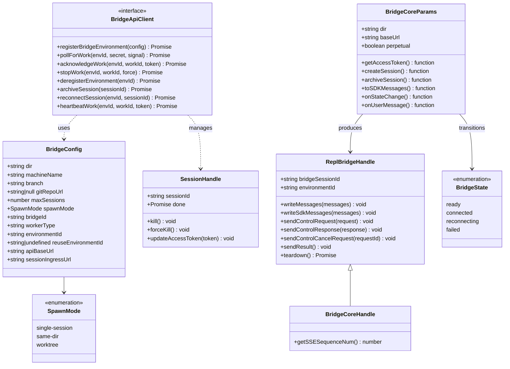
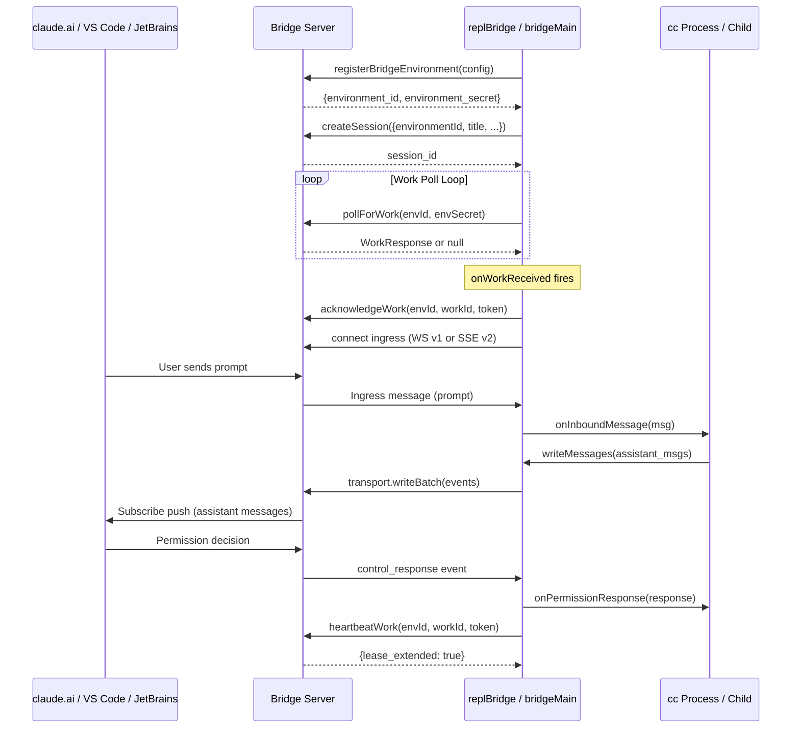

# Bridges: VS Code, JetBrains, and Web

## Overview

The bridge layer is the conduit between a local cc process and remote clients -- the claude.ai web interface, VS Code and JetBrains extensions, and mobile apps. Two files form its backbone: `replBridge.ts` (2406 LOC) manages an in-process bridge embedded in a REPL session, while `bridgeMain.ts` (2999 LOC) implements the standalone `claude remote-control` server that spawns child processes. Both share the same fundamental protocol: register an environment, poll for work items, connect an ingress transport (WebSocket or SSE), and relay messages bidirectionally. The bridge is what makes "start a session on your laptop, continue it on your phone" possible.

The architecture splits into two transport generations. The v1 transport uses a HybridTransport (WebSocket reads + HTTP POST writes to Session-Ingress). The v2 transport, governed by the `use_code_sessions` flag in the work secret, uses SSE for reads and CCR (Code Code Runner) `/worker/*` endpoints for writes. The server decides per-session which transport to use, with `CLAUDE_BRIDGE_USE_CCR_V2` as an ant-dev override for forcing v2 before the server flag is on (`src/bridge/replBridge.ts:L1139-L1141`).

The two bridge implementations serve different deployment models. The REPL bridge (`initBridgeCore`) runs inside the interactive cc process -- the user types in a terminal and the bridge mirrors their conversation to claude.ai. The standalone bridge (`runBridgeLoop`) runs as a persistent server that accepts work from the cloud and spawns child processes to handle each session. The REPL bridge is the "attach my running session to the web" path; the standalone bridge is the "run a headless server that the web can dispatch work to" path.

## Data structures and contracts

The bridge's type system is defined in `src/bridge/types.ts`. The central configuration type is `BridgeConfig`, which captures everything the bridge needs to register with the server.

```typescript
// src/bridge/types.ts:L81-L115 — BridgeConfig
export type BridgeConfig = {
  dir: string
  machineName: string
  branch: string
  gitRepoUrl: string | null
  maxSessions: number
  spawnMode: SpawnMode
  verbose: boolean
  sandbox: boolean
  bridgeId: string
  workerType: string
  environmentId: string
  reuseEnvironmentId?: string
  apiBaseUrl: string
  sessionIngressUrl: string
  debugFile?: string
  sessionTimeoutMs?: number
}
```

The `BridgeConfig` type carries identity (`bridgeId`, `environmentId`), topology (`maxSessions`, `spawnMode`), and connectivity (`apiBaseUrl`, `sessionIngressUrl`) fields. The `reuseEnvironmentId` field is the key to crash recovery and session resumption -- when set, the backend treats registration as a reconnect to the existing environment rather than creating a new one. The `spawnMode` determines whether the bridge runs one session and exits (`single-session`), shares the working directory across sessions (`same-dir`), or isolates each session in its own git worktree (`worktree`).

The work item protocol types define what the server delivers to the bridge:

```typescript
// src/bridge/types.ts:L18-L51 — WorkData and WorkSecret
export type WorkData = {
  type: 'session' | 'healthcheck'
  id: string
}

export type WorkSecret = {
  version: number
  session_ingress_token: string
  api_base_url: string
  sources: Array<{
    type: string
    git_info?: { type: string; repo: string; ref?: string; token?: string }
  }>
  auth: Array<{ type: string; token: string }>
  claude_code_args?: Record<string, string> | null
  mcp_config?: unknown | null
  environment_variables?: Record<string, string> | null
  use_code_sessions?: boolean
}
```

The `WorkSecret` type is the decoded payload from the base64url-encoded `secret` field on each work item. The `session_ingress_token` is a JWT used for both acknowledging work and authenticating the ingress transport. The `use_code_sessions` boolean is the server-driven v2 transport selector -- when true, the bridge uses the CCR `/worker/*` endpoints instead of Session-Ingress. This single field controls the transport bifurcation that runs through the entire bridge layer.

The `BridgeApiClient` interface defines the server protocol that both bridge implementations depend on:

```typescript
// src/bridge/types.ts:L133-L176 — BridgeApiClient
export type BridgeApiClient = {
  registerBridgeEnvironment(config: BridgeConfig): Promise<{
    environment_id: string
    environment_secret: string
  }>
  pollForWork(
    environmentId: string,
    environmentSecret: string,
    signal?: AbortSignal,
    reclaimOlderThanMs?: number,
  ): Promise<WorkResponse | null>
  acknowledgeWork(
    environmentId: string,
    workId: string,
    sessionToken: string,
  ): Promise<void>
  stopWork(environmentId: string, workId: string, force: boolean): Promise<void>
  deregisterEnvironment(environmentId: string): Promise<void>
  sendPermissionResponseEvent(
    sessionId: string,
    event: PermissionResponseEvent,
    sessionToken: string,
  ): Promise<void>
  archiveSession(sessionId: string): Promise<void>
  reconnectSession(environmentId: string, sessionId: string): Promise<void>
  heartbeatWork(
    environmentId: string,
    workId: string,
    sessionToken: string,
  ): Promise<{ lease_extended: boolean; state: string }>
}
```

The `BridgeApiClient` interface encodes the full lifecycle: `registerBridgeEnvironment` allocates a server-side environment, `pollForWork` long-polls for dispatched work items, `acknowledgeWork` confirms receipt, `heartbeatWork` extends a work-item lease, and `stopWork` / `archiveSession` / `deregisterEnvironment` clean up. The `reconnectSession` call is the recovery primitive introduced for crash resumption -- it force-stops stale workers and re-queues the session so a fresh bridge can pick it up. The `stopWork` method takes a `force` boolean: when `true`, the work item is permanently terminated; when `false`, it is re-queued so the server can re-dispatch it to a live worker.

The REPL bridge exposes a `ReplBridgeHandle` to the rest of the cc process:

```typescript
// src/bridge/replBridge.ts:L70-L81 — ReplBridgeHandle
export type ReplBridgeHandle = {
  bridgeSessionId: string
  environmentId: string
  sessionIngressUrl: string
  writeMessages(messages: Message[]): void
  writeSdkMessages(messages: SDKMessage[]): void
  sendControlRequest(request: SDKControlRequest): void
  sendControlResponse(response: SDKControlResponse): void
  sendControlCancelRequest(requestId: string): void
  sendResult(): void
  teardown(): Promise<void>
}
```

The handle is the narrow surface that the REPL uses to send messages outbound and receive control responses inbound. `writeMessages` converts internal `Message[]` to `SDKMessage[]` via an injected `toSDKMessages` callback, while `writeSdkMessages` skips conversion for the daemon path. The `sendControlResponse` method is how permission decisions from the REPL's interactive prompt are relayed back to the server, while `sendControlCancelRequest` lets the REPL cancel a pending permission request.

The `BridgeCoreParams` type is the parameter object for `initBridgeCore`, and its design warrants attention because it demonstrates the dependency-injection pattern that keeps the bridge bootstrap-free:

```typescript
// src/bridge/replBridge.ts:L91-L221 — BridgeCoreParams (excerpt)
export type BridgeCoreParams = {
  dir: string
  machineName: string
  branch: string
  gitRepoUrl: string | null
  title: string
  baseUrl: string
  sessionIngressUrl: string
  workerType: string
  getAccessToken: () => string | undefined
  createSession: (opts: {
    environmentId: string
    title: string
    gitRepoUrl: string | null
    branch: string
    signal: AbortSignal
  }) => Promise<string | null>
  archiveSession: (sessionId: string) => Promise<void>
  toSDKMessages?: (messages: Message[]) => SDKMessage[]
  onAuth401?: (staleAccessToken: string) => Promise<boolean>
  getPollIntervalConfig?: () => PollIntervalConfig
  initialHistoryCap?: number
  onInboundMessage?: (msg: SDKMessage) => void
  onPermissionResponse?: (response: SDKControlResponse) => void
  onInterrupt?: () => void
  onSetModel?: (model: string | undefined) => void
  onSetPermissionMode?: (
    mode: PermissionMode,
  ) => { ok: true } | { ok: false; error: string }
  onStateChange?: (state: BridgeState, detail?: string) => void
  onUserMessage?: (text: string, sessionId: string) => boolean
  perpetual?: boolean
  initialSSESequenceNum?: number
}
```

Every dependency that would normally be imported from bootstrap state or the command registry is instead injected as a callback. The `createSession` and `archiveSession` callbacks are injected because their source modules pull in the entire command registry via transitive imports. The `toSDKMessages` callback avoids dragging the React component tree into the Agent SDK bundle. The `onSetPermissionMode` callback returns a policy verdict so the bridge module can emit an error `control_response` without importing permission checks itself. The `onUserMessage` callback fires on each real user message for title derivation -- it keeps calling until it returns `true`, implementing a derive-at-count-1-and-3 policy in the caller. This injection pattern is a bootstrap-isolation constraint documented directly in the type definition.

The bridge state machine has four states, defined by the `BridgeState` type:

```typescript
// src/bridge/replBridge.ts:L83 — BridgeState
export type BridgeState = 'ready' | 'connected' | 'reconnecting' | 'failed'
```

The `ready` state means the environment is registered and the bridge is polling for work. `connected` means the ingress transport is wired and messages are flowing. `reconnecting` means the transport dropped or the environment was lost and recovery is in progress. `failed` is terminal -- the bridge cannot recover and the user must take action.



## Control flow

The bridge lifecycle has five phases: environment registration, session creation, work polling, transport wiring, and message relay. Both `replBridge.ts` and `bridgeMain.ts` follow this sequence, but they differ in who owns the query loop. In the REPL bridge, the cc process itself runs the query loop and the bridge relays its messages. In the standalone bridge, the `bridgeMain` loop spawns child `claude` processes and proxies their I/O.

### Registration and session creation

`initBridgeCore` starts by registering the bridge environment via `api.registerBridgeEnvironment`, which returns a server-assigned `environment_id` and `environment_secret`. If registration fails, the bridge returns null and the REPL continues without remote control. The registration call sends the full `BridgeConfig` including the client-generated `bridgeId` and `environmentId` UUIDs. The server may return a different `environment_id` than the one requested -- this happens when `reuseEnvironmentId` is set but the original environment expired or was reaped.

After registration, a session is created via the injected `createSession` callback. The session ID becomes the `bridgeSessionId` on the returned handle. Session creation is gated by a 15-second timeout via `AbortSignal.timeout(15_000)` (`src/bridge/replBridge.ts:L462`). If creation fails, the bridge deregisters the environment and returns null.

For perpetual mode (daemon callers), the bridge reads a crash-recovery pointer before registration. If the pointer records a prior `repl` session on the same environment, `tryReconnectInPlace` is called to re-queue the existing session rather than creating a new one. The `tryReconnectInPlace` function tries both the `session_*` and `cse_*` forms of the session ID when calling `reconnectSession`, because the pointer stores the compat-surface form but the `/bridge/reconnect` endpoint may require the infrastructure tag under the v2 compat gate (`src/bridge/replBridge.ts:L425-L430`).

### Work polling

After registration and session creation, the bridge starts the work poll loop via `startWorkPollLoop`. This loop runs for the lifetime of the bridge. When no work is available, the loop sleeps at a configurable interval. When a work item arrives, the loop decodes the work secret via `decodeWorkSecret`, acknowledges the work, and invokes the `onWorkReceived` callback with the session ID, ingress token, work ID, and the `useCodeSessions` boolean.

The poll loop implements several resilience mechanisms. Exponential backoff on poll errors starts at 2 seconds and caps at 60 seconds, with a 15-minute give-up threshold (`src/bridge/replBridge.ts:L244-L246`). System sleep/wake detection resets the error budget when the gap between poll errors exceeds twice the maximum backoff delay. When the environment is lost (poll returns 404), `onEnvironmentLost` triggers a reconnection attempt. A `capacityWake` signal interrupts the at-capacity sleep when a session completes or a transport is lost, so the poll loop can immediately start fast-polling for new work.

The at-capacity logic is where REPL bridge and standalone bridge differ most. In the REPL bridge, `isAtCapacity()` is `transport !== null` -- having any transport means the single session is active. In the standalone bridge, capacity is determined by `activeSessions.size >= config.maxSessions`, which can be up to 32 concurrent sessions.

### Transport wiring

The `onWorkReceived` callback is where the v1/v2 transport choice is resolved. The server signals its preference via `secret.use_code_sessions` in the work secret. The `onWorkReceived` handler then constructs the appropriate transport and wires it with `wireTransport`:

```typescript
// src/bridge/replBridge.ts:L1208-L1371 — wireTransport (key sections)
const wireTransport = (newTransport: ReplBridgeTransport): void => {
  transport = newTransport

  newTransport.setOnConnect(() => {
    // Guard: if transport was replaced by a newer onWorkReceived call
    // while the WS was connecting, ignore this stale callback.
    if (transport !== newTransport) return
    // ... initial flush logic ...
    onStateChange?.('connected')
  })

  newTransport.setOnData(data => {
    handleIngressMessage(
      data,
      recentPostedUUIDs,
      recentInboundUUIDs,
      onInboundMessage,
      onPermissionResponse,
      onServerControlRequest,
    )
  })

  newTransport.setOnClose(closeCode => {
    if (transport !== newTransport) return
    handleTransportPermanentClose(closeCode)
  })

  // Start the flush gate before connect() to cover the WS handshake window.
  if (!initialFlushDone && initialMessages && initialMessages.length > 0) {
    flushGate.start()
  }

  newTransport.connect()
}
```

The `wireTransport` function installs three callbacks on the transport: `setOnConnect` handles the initial message flush and state transitions, `setOnData` routes inbound messages through `handleIngressMessage`, and `setOnClose` delegates to `handleTransportPermanentClose` for reconnection logic. The stale-transport guard (`transport !== newTransport`) prevents callbacks from a replaced transport from interfering with the current one.

For the v1 path, a `HybridTransport` is created with OAuth token authentication. The transport auto-reconnects on transient drops with exponential backoff, and POST writes continue during reconnection using `getSessionIngressAuthToken()` independently of WebSocket state. For the v2 path, `createV2ReplTransport` is called asynchronously -- it first registers the worker via `registerWorker`, then constructs the SSE transport. A generation counter (`v2Generation`) prevents stale handshake resolutions from installing an outdated transport when multiple `onWorkReceived` calls race. The generation check is essential because `registerWorker` is asynchronous: if two calls race, both see `transport === null`, but only the second resolution (with the correct epoch) should install the transport (`src/bridge/replBridge.ts:L548-L550`).

Auth is the one place v1 and v2 diverge hard. The v1 transport accepts OAuth or JWT; the bridge prefers OAuth because the standard OAuth refresh flow handles expiry without a separate scheduler. The v2 transport requires the JWT because `register_worker.go` validates the `session_id` claim that OAuth tokens do not carry. The `onWorkReceived` handler branches on `useCcrV2` to select the appropriate token type, storing it via `updateSessionIngressAuthToken` before touching the network (`src/bridge/replBridge.ts:L1155-L1165`).

### Message relay

The `writeMessages` method on the bridge handle is the primary outbound path. It performs two layers of deduplication: `initialMessageUUIDs` filters messages already sent as session creation events, and `recentPostedUUIDs` filters messages recently sent via POST. Messages pass through a `FlushGate` that queues them during the initial history flush to prevent interleaving with historical messages.



The inbound path processes messages through `handleIngressMessage`, which maintains a `BoundedUUIDSet` of recent inbound UUIDs to deduplicate server re-deliveries caused by sequence-number negotiation failures or transport swap races. The outbound path uses `recentPostedUUIDs` for echo filtering -- messages the bridge sent that bounce back on the WebSocket are recognized and dropped. The `BoundedUUIDSet` has a capacity of 2000 entries, which covers well over any realistic echo window and any messages that might be re-encountered after compaction (`src/bridge/replBridge.ts:L518`).

The initial message flush is a critical ordering concern. When the ingress transport first connects, the bridge flushes up to `initialHistoryCap` (default 200) historical messages to the server so the web UI can display the conversation context. New messages arriving during this flush are queued in the `FlushGate` and drained after the flush completes. The `onStateChange('connected')` callback is deferred until the flush completes, which prevents the web UI from showing the session as active before history is persisted (`src/bridge/replBridge.ts:L1240-L1243`).

### Standalone bridge: runBridgeLoop

The `bridgeMain.ts` entry point serves the `claude remote-control` command. Its `runBridgeLoop` function manages the same registration-poll-transport lifecycle but with a critical architectural difference: instead of running a query loop in-process, it spawns child `claude` processes and proxies their I/O. Each child process receives the SDK URL and access token via environment variables, connects its own transport, and runs independently.

The `runBridgeLoop` function maintains a richer set of bookkeeping structures for multi-session management:

```typescript
// src/bridge/bridgeMain.ts:L163-L194 — Session tracking maps
const activeSessions = new Map<string, SessionHandle>()
const sessionStartTimes = new Map<string, number>()
const sessionWorkIds = new Map<string, string>()
const sessionCompatIds = new Map<string, string>()
const sessionIngressTokens = new Map<string, string>()
const sessionTimers = new Map<string, ReturnType<typeof setTimeout>>()
const completedWorkIds = new Set<string>()
const sessionWorktrees = new Map<string, {...}>()
const timedOutSessions = new Set<string>()
const titledSessions = new Set<string>()
```

These maps track session state across the lifecycle. `sessionWorkIds` maps sessions to their work items for `stopWork` calls. `sessionCompatIds` stores the `session_*` form (compat-surface ID) computed once at spawn, because the work poll returns `cse_*` under the v2 compat gate but the Sessions API validates `TagSession`. `completedWorkIds` prevents duplicate session spawns when the server re-delivers a stale work item before processing a `stopWork` request. `sessionIngressTokens` stores the JWTs separately from `handle.accessToken` because the token refresh scheduler overwrites the handle field with the OAuth token after approximately 3 hours 55 minutes.

When a work item of type `session` arrives and the session is already running, the bridge updates its access token rather than spawning a new child:

```typescript
// src/bridge/bridgeMain.ts:L873-L886 — Existing session token refresh
const existingHandle = activeSessions.get(sessionId)
if (existingHandle) {
  existingHandle.updateAccessToken(secret.session_ingress_token)
  sessionIngressTokens.set(sessionId, secret.session_ingress_token)
  sessionWorkIds.set(sessionId, work.id)
  tokenRefresh?.schedule(sessionId, secret.session_ingress_token)
  logForDebugging(
    `[bridge:work] Updated access token for existing sessionId=${sessionId} workId=${work.id}`,
  )
  await ackWork()
  break
}
```

This handles the case where the server re-dispatches work for an existing session after the WebSocket drops -- the child process gets a fresh ingress token and can reconnect. The `tokenRefresh?.schedule` call re-schedules the proactive refresh from the new JWT's expiry time.

The standalone bridge also implements worktree isolation for multi-session mode. When `spawnMode` is `worktree`, each on-demand session (except the initial pre-created session) gets an isolated git worktree via `createAgentWorktree`. The worktree path becomes the session's working directory, preventing concurrent sessions from interfering with each other's file changes (`src/bridge/bridgeMain.ts:L976-L1013`). On session completion, the worktree is cleaned up via `removeAgentWorktree`.

### Reconnection strategies

When the environment is lost (poll returns 404), `reconnectEnvironmentWithSession` tries two strategies in order. Strategy 1 reconnects in place by re-registering with the same `environmentId` -- if the backend resurrects the same environment, `reconnectSession` re-queues the existing session and the URL on the user's phone stays valid. Strategy 2 falls back to a fresh session: it archives the old session and creates a new one on the now-registered environment (`src/bridge/replBridge.ts:L684-L836`).

The reconnection is guarded by a reentrancy lock (`reconnectPromise`) so concurrent callers share the same attempt. The `MAX_ENVIRONMENT_RECREATIONS` limit of 3 prevents infinite reconnection loops. After each successful poll, the counter resets so independent reconnections hours apart do not exhaust the limit.

Strategy 2 has a subtle session-state reset that prevents data corruption. After the old session is archived and a new session is created, the bridge must reset `lastTransportSequenceNum` to 0, clear `recentInboundUUIDs`, and re-latch `userMessageCallbackDone`. Without this reset, the SSE sequence number from the old session would be carried over to the new session's event stream (starting at 1), causing all events in the gap to be silently dropped. The UUID dedup set is session-scoped, and the title derivation callback must be reset so the new session can derive its own title (`src/bridge/replBridge.ts:L805-L813`).

### Heartbeat and lease management

Work items have a server-side lease with a 300-second TTL. The bridge maintains this lease through `heartbeatWork` calls during at-capacity sleep intervals. The heartbeat uses `SessionIngressAuth` (JWT, no database hit) instead of `EnvironmentSecretAuth`, making it cheap for the server to validate.

When the heartbeat encounters a `BridgeFatalError` (401/403/404/410), the `onHeartbeatFatal` callback tears down the transport and work state so `isAtCapacity()` flips to false, enabling the poll loop to fast-poll for the server's re-dispatched work item (`src/bridge/replBridge.ts:L1038-L1069`). Without this recovery path, a daemon session would enter a ~25-minute dead window where the work lease expires and the server stops forwarding prompts.

The standalone bridge proactively schedules token refresh before the session ingress JWT expires via `createTokenRefreshScheduler`. For v1 sessions, the scheduler delivers a fresh OAuth token to the child process via `handle.updateAccessToken`. For v2 sessions, it calls `reconnectSession` to trigger server-side re-dispatch -- v2 CCR worker endpoints require the JWT's `session_id` claim, which OAuth tokens do not carry (`src/bridge/bridgeMain.ts:L272-L313`). The `heartbeatActiveWorkItems` function in the standalone bridge iterates over all active sessions and heartbeats each one, aggregating the results into a single status (`ok`, `auth_failed`, `fatal`, or `failed`) that drives the at-capacity sleep behavior.

### Teardown

The teardown sequence differs between perpetual and non-perpetual modes. In perpetual mode, teardown is local-only -- the bridge stops polling and lets the socket die with the process, but does not send a result message, call `stopWork`, or close the transport. The backend times the work-item lease back to pending on its own (300-second TTL). Next daemon start reads the crash-recovery pointer and `reconnectSession` re-queues work (`src/bridge/replBridge.ts:L1595-L1616`).

In non-perpetual mode, teardown follows a precise ordering: fire the result message, then archive the session, then close the transport. This ordering matters because `transport.write()` only enqueues (the `SerialBatchEventUploader` resolves on buffer-add); the `stopWork`/`archiveSession` latency (200-500 ms) is the drain window for the result POST. Closing before archive would rely on `HybridTransport`'s void-ed 3-second grace period, which nothing awaits -- `forceExit` can kill the socket mid-POST (`src/bridge/replBridge.ts:L1618-L1628`).

The standalone bridge shutdown is more involved. It sends SIGTERM to all active child processes, waits up to `shutdownGraceMs` (default 30 seconds) for them to exit, then SIGKILL any that remain. It then stops all work items, archives all sessions, and deregisters the environment. In single-session mode with a known session ID, the bridge skips archive and deregister so that `claude remote-control --continue` can resume the session later (`src/bridge/bridgeMain.ts:L1525-L1538`).

## Edge cases and failure modes

**Session ID tag mismatch.** When CCR v2's compat layer creates a session, `createBridgeSession` receives a `session_*` ID from the v1-facing API, but the infrastructure layer delivers a `cse_*` ID in the work queue. The `sameSessionId` function compares by underlying UUID, not by tagged-ID prefix, so the mismatch does not cause a session rejection (`src/bridge/replBridge.ts:L1120-L1124`). The `tryReconnectInPlace` function tries both forms when calling `reconnectSession`.

**Stale v2 handshake resolution.** When two `onWorkReceived` calls race while the v2 transport is null, both call `registerWorker` (bumping the server epoch), and whichever resolves second is the correct one. The `v2Generation` counter catches stale resolutions regardless of transport state. When a stale transport arrives, it is closed and discarded (`src/bridge/replBridge.ts:L1408-L1414`). When `createV2ReplTransport` fails entirely, the bridge calls `stopWork(force=false)` so the server re-dispatches immediately instead of waiting for its own timeout.

**Process suspension detection.** A `setTimeout` that overruns its deadline by more than 60 seconds indicates the process was suspended (laptop lid closed, SIGSTOP, VM pause). The poll loop detects this and forces one fast-poll cycle, because `isAtCapacity()` stays true while the transport auto-reconnects, and the poll loop would otherwise go straight back to a 10-minute sleep on a transport pointed at a dead socket (`src/bridge/replBridge.ts:L2121-L2130`). The standalone bridge has an identical detection threshold at twice the connection backoff cap (`src/bridge/bridgeMain.ts:L107-L109`).

**Initial flush interleaving.** New messages arriving during the initial history flush could interleave with historical messages on the server. The `FlushGate` queues messages during this window and drains them after the flush completes (`src/bridge/replBridge.ts:L574`). If the flush drops batches (Session-Ingress down for `maxConsecutiveFailures` attempts), the UUIDs are not marked as flushed so they remain eligible for re-send on the next work dispatch. The `onStateChange('connected')` signal is deferred until after the flush, preventing the web UI from showing the session as active before history is persisted.

**Crash recovery pointer.** The bridge writes a `bridge-pointer.json` file after session creation so that a `kill -9` at any subsequent point leaves a recoverable trail. In perpetual mode, the pointer survives clean exits too, and an hourly timer refreshes its mtime so sessions lasting longer than the 4-hour TTL threshold do not appear stale on next launch (`src/bridge/replBridge.ts:L1510-L1526`). On next launch, `readBridgePointer` checks the pointer's age and validity, and `tryReconnectInPlace` re-queues the session. Non-perpetual mode clears the pointer on clean teardown (`src/bridge/replBridge.ts:L479-L488`).

**SSE sequence-number carryover.** Without carrying the SSE sequence-number high-water mark across transport swaps, each new SSE transport starts at 0 and the server replays the entire session event history -- every prompt ever sent re-delivered as fresh inbound messages on every `onWorkReceived`. The `lastTransportSequenceNum` variable is captured before every transport close and passed as `initialSequenceNum` when constructing the next transport. On session swap (Strategy 2 reconnection), the sequence number is reset to 0 because the new session's event stream starts at 1 (`src/bridge/replBridge.ts:L805`).

**Worktree mode isolation failure.** In `bridgeMain.ts`, if worktree creation fails for an on-demand session, the bridge logs the error, marks the work item as completed, and stops the work -- the session is not spawned at all rather than spawned in a shared directory where it could conflict with other sessions (`src/bridge/bridgeMain.ts:L997-L1013`).

**Transport permanent close codes.** The `handleTransportPermanentClose` function differentiates between close code 1000 (clean close -- session ended normally, triggers full teardown) and all other codes (reconnect budget exhausted or permanent server rejection, triggers environment reconnection). With `autoReconnect: true` on the transport, this callback only fires on clean close, permanent server rejection (4001/1002/4003), or 10-minute budget exhaustion -- transient drops are retried internally by the transport.

**Concurrent reconnection and poll loop.** When `doReconnect` runs concurrently with the poll loop (the `ws_closed` handler calls it void, unlike the awaited `onEnvironmentLost` path), `onWorkReceived` can fire during the `stopWork` await and set a fresh `currentWorkId`. If the work ID changed, `doReconnect` defers to the poll loop rather than proceeding to `archiveSession`, which would destroy the session the new transport is connected to (`src/bridge/replBridge.ts:L667-L672`).

## Where cc diverges from the published pattern

The HER identifies a three-tier agent model (in-process subagents, local orchestrators, cloud async) and notes that the bridge between tiers is a data leakage channel. The cc bridge layer diverges from a naive bridge in several respects.

First, the dependency injection pattern in `BridgeCoreParams` is unusual for a bridge layer. Most RPC-style bridges import their dependencies directly. cc injects them because of a concrete build constraint: `bun --outfile` inlines dynamic imports, so lazy-loading modules to keep the Agent SDK bundle small does not work. Every callback that would normally be imported from a module that transitively pulls in the command registry is instead injected. The comment on `toSDKMessages` explains the chain: `mappers.ts` transitively pulls in `src/commands.ts` via `messages.ts`, `api.ts`, `prompts.ts`, dragging the entire command registry and React tree into the Agent SDK bundle (`src/bridge/replBridge.ts:L146-L155`). This is a build-system-driven architectural decision, not a purity-driven one.

Second, the dual-transport design (v1 HybridTransport vs. v2 SSE+CCR) means the bridge must handle two different authentication models simultaneously. The v1 transport accepts OAuth or JWT; the bridge prefers OAuth because the standard refresh flow handles expiry. The v2 transport requires the JWT because `register_worker.go` validates the `session_id` claim that OAuth tokens do not carry. This auth divergence is managed by the `onWorkReceived` handler, which branches on `useCcrV2` to select the appropriate token type (`src/bridge/replBridge.ts:L1155-L1165`). The published pattern of a unified auth model does not apply here because the v1 and v2 server endpoints have different validation requirements. The `CLAUDE_BRIDGE_USE_CCR_V2` environment variable is kept separate from `CLAUDE_CODE_USE_CCR_V2` (the child-SDK transport selector) specifically to avoid an inheritance hazard in spawn mode where the parent's orchestrator variable would leak into a v1 child.

Third, the HER recommends file-based communication for cross-agent handoffs (Section 9.3). The bridge does not use file-based communication for message relay -- it uses WebSocket/SSE and HTTP POST. The bridge pointer file is the only file-based channel, and it serves crash recovery, not message passing. This is intentional: file-based communication would add latency and requires cleanup protocols to avoid data leakage between sessions, as the HER itself warns (Section 6.15). The bridge pointer uses ephemeral directory semantics and is cleaned up on explicit disconnect.

Fourth, the reconnection strategy in `replBridge.ts` goes beyond simple retry. Strategy 1 (reconnect-in-place) preserves the session ID, the URL on the user's phone, and the previously-flushed UUID set. This is not a standard reconnection pattern -- it is a user-experience optimization that avoids the "your session URL just broke" problem that a naive fresh-session fallback would cause. The HER's cloud-async tier (Tier 3) describes distributed agents with message-passing, but the cc bridge's reconnect-in-place strategy treats session continuity as a first-class concern, not just a transport concern.

Fifth, the HER's progressive disclosure pattern (Section 9) suggests that capabilities should be revealed incrementally as the agent needs them. The bridge's `BridgeState` machine (`ready` -> `connected` -> `reconnecting` -> `failed`) implements a form of progressive disclosure at the connection layer: the REPL does not expose bridge controls to the user until the bridge transitions to `connected`, and the `reconnecting` state hides interactive controls while recovery is in progress. This is state-driven progressive disclosure at the UX boundary, distinct from the tool-level progressive disclosure that the `ToolSearch` mechanism provides.

## Developer takeaways for building a long-running agent

The bridge layer demonstrates that building a reliable long-running agent connection requires investing in three areas: idempotent recovery primitives, deduplication at every boundary, and dependency injection for build isolation. The `reconnectSession` API and `tryReconnectInPlace` function show that recovery must be idempotent -- the caller should be able to invoke recovery multiple times without side effects, and the system should prefer preserving existing session identity over creating fresh state. The two-strategy reconnection (reconnect-in-place then fresh-session fallback) is a pattern worth adopting: try the cheap recovery path first, and only fall back to expensive state reconstruction when the cheap path fails. The `BoundedUUIDSet` structures for both inbound and outbound messages, the `FlushGate` for ordering, and the `v2Generation` counter for race detection all demonstrate that distributed message relay requires dedup at every boundary because the server, the transport, and the local process can all independently re-deliver or reorder events. The `BridgeCoreParams` injection pattern shows that when a build system inlines dynamic imports, the only escape is to invert the dependency -- inject callbacks rather than import modules. For any agent system that must ship as a compiled binary while also supporting a lightweight SDK subset, this pattern prevents the transitive-import problem from inflating the bundle. The heartbeat-with-lease pattern (300-second TTL, proactive refresh, fatal-error recovery) is the minimum viable approach for maintaining liveness across network boundaries -- without it, a dropped connection silently kills the session after the lease expires.
