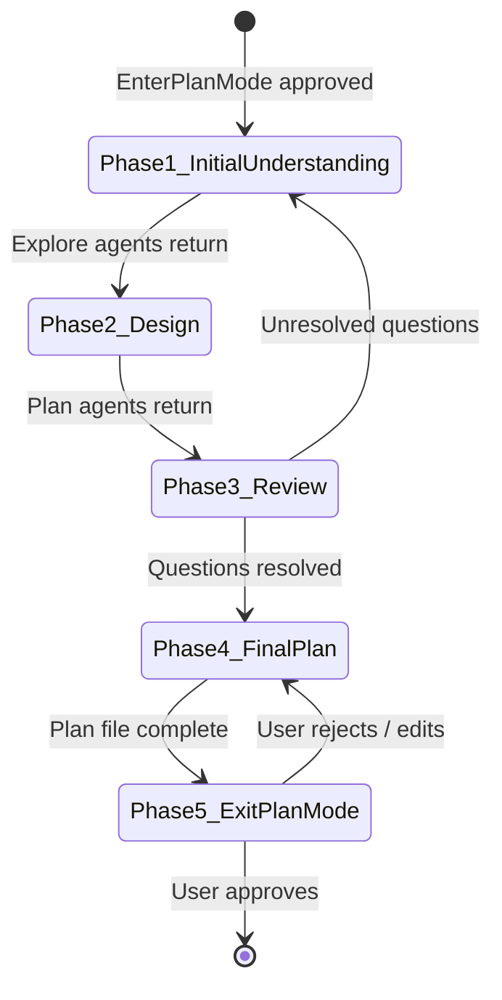
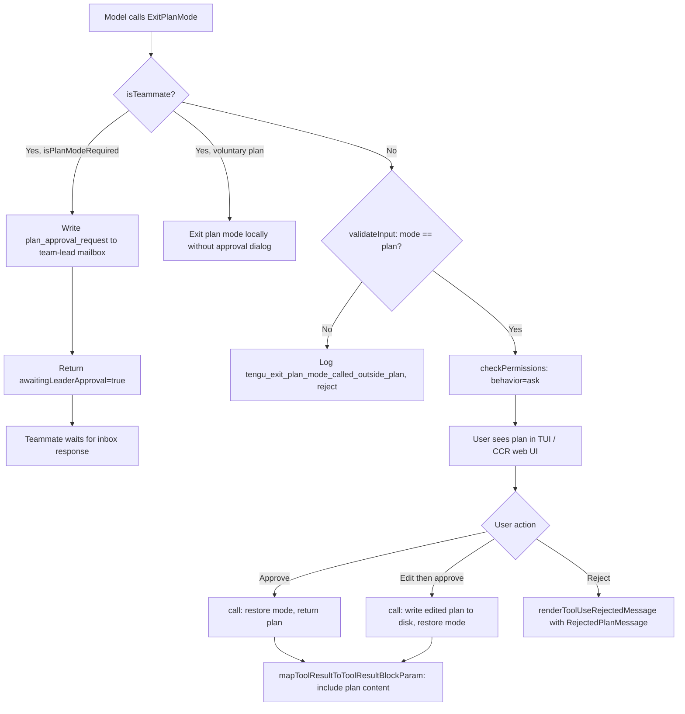

# Plan Mode V2: The Five-Phase Model

## Overview

Plan mode is cc's dedicated read-only exploration phase where the agent investigates the codebase and designs an implementation approach before making any changes. It implements the Explore-Plan-Act pattern identified in HER Section 7 as a checkpoint-restore mechanism: the agent saves its understanding into a plan file, the user reviews and approves it, and then execution proceeds from a known-good state of shared understanding. The pattern maps onto the HER's session protocol (ORIENT+SETUP+VERIFY corresponds to Explore, SELECT corresponds to Plan, and IMPLEMENT+TEST corresponds to Act), with the escalating permission model ensuring the agent cannot make changes during the orientation phase, preventing premature action on incomplete understanding.

Plan Mode V2 expands the earlier three-phase model (explore, discuss, act) into a structured five-phase workflow. The phases are: (1) Initial Understanding via parallel explore subagents, (2) Design via plan subagents, (3) Review with human clarification, (4) Final Plan written to a file, and (5) calling ExitPlanMode for approval. Two tools govern entry and exit: `EnterPlanMode` transitions the agent into read-only mode and gates all write-capable tools, while `ExitPlanMode` reads the plan from disk, presents it for human approval, and restores the previous permission mode. The plan file itself is persisted outside the conversation context at `~/.claude/plans/<slug>.md`, making it durable across context compaction and session resume.

The terminology registry defines plan mode as "a read-only exploration phase where the agent can read files and search but cannot write or execute tools. Has five phases and enforced tool gating." The key phrase is "enforced tool gating" -- plan mode relies on the permission system, not on prompt instructions, to prevent the model from making changes. This distinction is the structural foundation of the entire workflow. This chapter traces the complete lifecycle from entry to approval, including the teammate approval workflow that extends the model to multi-agent teams and the Pewter Ledger experiment that tests whether constraining plan length improves outcomes.

## Data structures and contracts

### ExitPlanMode output schema

The `ExitPlanModeV2Tool` defines the output contract that flows from the tool back to the model after plan approval. This schema is the authoritative definition of what information survives the plan-approval gate:

```typescript
// src/tools/ExitPlanModeTool/ExitPlanModeV2Tool.ts:L110-L143 — output schema
export const outputSchema = lazySchema(() =>
  z.object({
    plan: z
      .string()
      .nullable()
      .describe('The plan that was presented to the user'),
    isAgent: z.boolean(),
    filePath: z
      .string()
      .optional()
      .describe('The file path where the plan was saved'),
    hasTaskTool: z
      .boolean()
      .optional()
      .describe('Whether the Agent tool is available in the current context'),
    planWasEdited: z
      .boolean()
      .optional()
      .describe(
        'True when the user edited the plan (CCR web UI or Ctrl+G); determines whether the plan is echoed back in tool_result',
      ),
    awaitingLeaderApproval: z
      .boolean()
      .optional()
      .describe(
        'When true, the teammate has sent a plan approval request to the team leader',
      ),
    requestId: z
      .string()
      .optional()
      .describe('Unique identifier for the plan approval request'),
  }),
)
```

The `plan` field is nullable because the user can approve exiting plan mode without having written a plan file -- in that case, `plan` is null and the tool result message says "User has approved exiting plan mode. You can now proceed." The `planWasEdited` field is set when the user modifies the plan content through the CCR web UI or the Ctrl+G edit shortcut before approving. When true, the tool result labels the plan "Approved Plan (edited by user)" rather than "Approved Plan," signaling to the model that the user changed something and the model should re-read the plan file rather than relying on its cached version. The `awaitingLeaderApproval` and `requestId` fields are only populated when a teammate subagent submits a plan for team-lead review instead of local user approval. The `hasTaskTool` field informs the model whether the Agent tool is available, which determines whether it can parallelize implementation after approval.

### Allowed prompt schema for plan-mode exit

When exiting plan mode, the model can request prompt-based permissions that describe categories of actions rather than specific commands. This mechanism lets the model declare intent ("run tests," "install dependencies") rather than requesting approval for specific shell commands:

```typescript
// src/tools/ExitPlanModeTool/ExitPlanModeV2Tool.ts:L64-L75 — allowedPrompt schema
const allowedPromptSchema = lazySchema(() =>
  z.object({
    tool: z.enum(['Bash']).describe('The tool this prompt applies to'),
    prompt: z
      .string()
      .describe(
        'Semantic description of the action, e.g. "run tests", "install dependencies"',
      ),
  }),
)
```

The `tool` field is constrained to `['Bash']` because only Bash commands benefit from semantic pre-approval -- other tools like FileEdit have their own permission mechanisms. The `allowedPrompts` array in the input schema lets the model bundle permission requests with the plan, so the user can approve both the plan and the requested permissions in a single interaction. The input schema itself is a `strictObject` with `passthrough()`, which means the internal schema rejects unknown properties but the passthrough allows `normalizeToolInput` to inject additional fields like `plan` and `planFilePath` for SDK and hook consumption.

### Agent count and feature gate configuration

The `planModeV2.ts` module exports configuration functions that determine agent parallelism and feature gates. These functions are called from the message-construction layer to interpolate agent counts into the five-phase template:

```typescript
// src/utils/planModeV2.ts:L5-L29 — agent count configuration
export function getPlanModeV2AgentCount(): number {
  if (process.env.CLAUDE_CODE_PLAN_V2_AGENT_COUNT) {
    const count = parseInt(process.env.CLAUDE_CODE_PLAN_V2_AGENT_COUNT, 10)
    if (!isNaN(count) && count > 0 && count <= 10) {
      return count
    }
  }

  const subscriptionType = getSubscriptionType()
  const rateLimitTier = getRateLimitTier()

  if (
    subscriptionType === 'max' &&
    rateLimitTier === 'default_claude_max_20x'
  ) {
    return 3
  }

  if (subscriptionType === 'enterprise' || subscriptionType === 'team') {
    return 3
  }

  return 1
}
```

The agent count controls how many plan subagents can be launched in Phase 2. Enterprise and team subscribers get three parallel agents; other users get one. The environment variable `CLAUDE_CODE_PLAN_V2_AGENT_COUNT` overrides the subscription-based default, capped at 10. The explore agent count (`getPlanModeV2ExploreAgentCount` at `src/utils/planModeV2.ts:L31-L43`) always returns three, independent of subscription tier, because exploration is a cheaper operation that benefits from broader parallel coverage even for users with lower rate limits.

The interview phase gate controls whether the five-phase workflow or the iterative interview loop is used:

```typescript
// src/utils/planModeV2.ts:L50-L62 — interview phase gate
export function isPlanModeInterviewPhaseEnabled(): boolean {
  if (process.env.USER_TYPE === 'ant') return true

  const env = process.env.CLAUDE_CODE_PLAN_MODE_INTERVIEW_PHASE
  if (isEnvTruthy(env)) return true
  if (isEnvDefinedFalsy(env)) return false

  return getFeatureValue_CACHED_MAY_BE_STALE(
    'tengu_plan_mode_interview_phase',
    false,
  )
}
```

Internal ("ant") users always get the interview phase. External users are controlled by the `tengu_plan_mode_interview_phase` Growthbook feature flag, with an environment variable escape hatch for local testing. The three-tier evaluation order (hardcoded ant check, environment variable, feature flag) ensures that internal users are never accidentally affected by a feature-flag misconfiguration while external users can still be gradually rolled out.

### Pewter Ledger experiment arms

The Pewter Ledger experiment tests progressively stricter guidance on Phase 4 plan file size. The variant type and selector are defined in `planModeV2.ts`:

```typescript
// src/utils/planModeV2.ts:L64-L95 — Pewter Ledger variant selector
export type PewterLedgerVariant = 'trim' | 'cut' | 'cap' | null

export function getPewterLedgerVariant(): PewterLedgerVariant {
  const raw = getFeatureValue_CACHED_MAY_BE_STALE<string | null>(
    'tengu_pewter_ledger',
    null,
  )
  if (raw === 'trim' || raw === 'cut' || raw === 'cap') return raw
  return null
}
```

The baseline data (control arm, 14-day period, N=26.3M) shows p50 plan length of 4,906 characters, p90 of 11,617, and mean of 6,207. The reject rate is monotonic with size: 20% at under 2K characters rising to 50% at over 20K. The primary metric is session-level average cost (an output-weighted proxy since Opus output is 5x input price), with `planLengthChars` on the `tengu_plan_exit` event as the mechanism but not the goal -- the cap arm could shrink the plan file while increasing total output via write-count-edit cycles. Guardrail metrics include feedback-bad rate, requests per session (too-thin plans lead to more implementation iterations), and tool error rate. The `PewterLedgerVariant` type is exhaustive: the `getPewterLedgerVariant` function narrows the Growthbook feature value to the known arms, returning null for any unknown value.

## Control flow

### Entering plan mode

The `EnterPlanMode` tool is a deferred, read-only tool that transitions the permission context into plan mode. Its `call()` method performs three actions: it rejects invocations from agent contexts, triggers the `handlePlanModeTransition` state function, and updates the `toolPermissionContext` to the `plan` mode.

```typescript
// src/tools/EnterPlanModeTool/EnterPlanModeTool.ts:L77-L101 — EnterPlanMode call method
  async call(_input, context) {
    if (context.agentId) {
      throw new Error('EnterPlanMode tool cannot be used in agent contexts')
    }

    const appState = context.getAppState()
    handlePlanModeTransition(appState.toolPermissionContext.mode, 'plan')

    context.setAppState(prev => ({
      ...prev,
      toolPermissionContext: applyPermissionUpdate(
        prepareContextForPlanMode(prev.toolPermissionContext),
        { type: 'setMode', mode: 'plan', destination: 'session' },
      ),
    }))

    return {
      data: {
        message:
          'Entered plan mode. You should now focus on exploring the codebase and designing an implementation approach.',
      },
    }
  },
```

The `handlePlanModeTransition` function manages attachment flags that control which instructions are injected into the model's context. When entering plan mode, it clears any pending `needsPlanModeExitAttachment` to prevent a stale exit attachment from leaking into the next context. When leaving plan mode, it sets that flag to true so the message layer injects the "plan mode has ended" attachment. The `prepareContextForPlanMode` function stashes the current mode into `prePlanMode` so that `ExitPlanMode` can restore it later. When the user's current mode is `auto`, the function may either keep auto semantics active during planning (if `shouldPlanUseAutoMode()` returns true) or deactivate auto and restore dangerous permissions.

The `applyPermissionUpdate` call with `{ type: 'setMode', mode: 'plan', destination: 'session' }` applies the mode change to the session-level permission context. The `destination: 'session'` parameter ensures that the mode change persists across tool invocations within the session, rather than being scoped to a single tool call. Once this update is applied, the tool dispatch pipeline will reject any tool that requires write access, enforcing the read-only constraint structurally rather than through prompt instructions.

After `call()` returns, `mapToolResultToToolResultBlockParam` generates the instruction text fed back to the model. When the interview phase is enabled (controlled by the `isPlanModeInterviewPhaseEnabled()` gate), the instructions are deliberately sparse: "DO NOT write or edit any files except the plan file. Detailed workflow instructions will follow." The full five-phase instructions arrive separately via the `plan_mode` attachment in the message stream. When the interview phase is disabled, the tool result includes a numbered list of six instructions guiding the model through exploration, design, and exit. The `EnterPlanMode` tool's `isReadOnly()` method returns true, which means the permission system treats its invocation as a non-destructive action even though it permanently changes the session state.

### The five-phase workflow

Once plan mode is active, the `plan_mode` attachment injected into the context provides the full five-phase workflow template. The template is constructed by `getPlanModeV2Instructions()`, which interpolates the agent count, explore agent count, plan file path, and tool names into the instruction text. The instruction begins with a strict prohibition: "The user indicated that they do not want you to execute yet -- you MUST NOT make any edits (with the exception of the plan file mentioned below), run any non-readonly tools (including changing configs or making commits), or otherwise make any changes to the system. This supercedes any other instructions you have received." The phases form a linear progression from exploration through design to human approval:



**Phase 1: Initial Understanding.** The model launches up to three `explore` subagents in parallel. Each subagent receives a focused search area. The template instructs: "Focus on understanding the user's request and the code associated with their request. Actively search for existing functions, utilities, and patterns that can be reused -- avoid proposing new code when suitable implementations already exist." The instructions emphasize quality over quantity -- the explore agent count is three, but the model should use the minimum number necessary, usually just one. When using multiple agents, each should receive a specific search focus: one agent searches for existing implementations, another explores related components, a third investigates testing patterns. The template requires that the model launch these agents "IN PARALLEL" using a single message with multiple tool calls, rather than sequentially, to minimize latency.

**Phase 2: Design.** The model launches `plan` subagents to design the implementation. The parallelism is controlled by `getPlanModeV2AgentCount()`: enterprise and team subscribers get up to three plan agents; other users get one. The instructions specify that each plan agent receives comprehensive background context from Phase 1 including filenames and code path traces. The guidelines distinguish three tiers: "Default" (launch at least one plan agent for most tasks), "Skip agents" (for truly trivial tasks like typo fixes), and "Multiple agents" (for complex tasks that benefit from different perspectives such as simplicity versus performance versus maintainability). When using multiple plan agents, the template provides examples by task type: for new features, contrast simplicity versus performance versus maintainability; for bug fixes, contrast root cause versus workaround versus prevention; for refactoring, contrast minimal change versus clean architecture.

**Phase 3: Review.** The model reads the critical files identified by agents to deepen its understanding, ensures the plans align with the user's original request, and uses `AskUserQuestion` to clarify remaining questions. This is the human-in-the-loop checkpoint from HER Section 11 -- the model can loop back to Phase 1 if it discovers unresolved ambiguities. The review phase is where the model consolidates the outputs from potentially multiple plan agents into a single coherent approach. The state diagram shows a back-edge from Phase 3 to Phase 1 for this reason.

**Phase 4: Final Plan.** The model writes the final plan to the plan file -- the only file it is allowed to edit during plan mode. The content of this phase is subject to the Pewter Ledger experiment, which tests progressively stricter guidance on plan file size. The four arms are:

- **Control** (null): Requires a Context section explaining why the change is being made, the recommended approach (not all alternatives), concise but detailed enough to execute, paths of critical files, references to existing functions and utilities, and a verification section describing how to test the changes end-to-end.
- **Trim**: Collapses Context to one line and verification to a single command. Removes numbered test procedures.
- **Cut**: Eliminates Context entirely, asks for one line per file, and warns "Most good plans are under 40 lines. Prose is a sign you are padding."
- **Cap**: Adds a hard 40-line limit and forbids prose paragraphs entirely. References must use `file:line` format.

The `getPlanPhase4Section()` function selects the arm by calling `getPewterLedgerVariant()` and switching on the result. The control arm (null) is the default for all users not assigned to an experiment bucket. The `variant satisfies never` exhaustiveness check in the switch statement ensures that adding a new arm requires updating the function.

**Phase 5: Call ExitPlanMode.** The model calls the `ExitPlanMode` tool to signal that planning is complete. The template enforces this as a hard constraint: "your turn should only end with either using the AskUserQuestion tool OR calling ExitPlanMode. Do not stop unless it's for these 2 reasons." The template also explicitly prohibits using `AskUserQuestion` to ask about plan approval: "Phrases like 'Is this plan okay?', 'Should I proceed?', 'How does this plan look?', 'Any changes before we start?', or similar MUST use ExitPlanMode." This prevents the model from circumventing the approval gate by asking the user informally.

### The interview phase variant

When `isPlanModeInterviewPhaseEnabled()` returns true (always on for internal "ant" users, controlled by the `tengu_plan_mode_interview_phase` feature gate for external users), the five-phase workflow is replaced by an iterative loop. The instructions describe a three-step cycle: (1) Explore using read-only tools (Glob, Grep, Read, or explore subagents when available), (2) Update the plan file after each discovery, and (3) Ask the user when hitting ambiguities that cannot be resolved from code alone. This variant eliminates the subagent-launching phases and instead keeps the model in a tight explore-write-ask loop, emphasizing incremental plan building over parallel delegation.

The interview phase variant differs in several structural ways from the five-phase model. It instructs the model to start by quickly scanning a few key files, then write a skeleton plan (headers and rough notes) and ask the first round of questions. The model should not explore exhaustively before engaging the user. The "Asking Good Questions" guidance establishes four rules: never ask what you could find out by reading the code, batch related questions together, focus on things only the user can answer (requirements, preferences, tradeoffs, edge case priorities), and scale depth to the task. The convergence criterion is when all ambiguities are addressed and the plan covers what to change, which files to modify, what existing code to reuse, and how to verify the changes.

Both variants share the same sparse reminder injected on subsequent context windows. The sparse reminder is a compressed version that references the full instructions earlier in the conversation: "Plan mode still active (see full instructions earlier in conversation). Read-only except plan file. Follow 5-phase workflow. End turns with AskUserQuestion (for clarifications) or ExitPlanMode (for plan approval). Never ask about plan approval via text or AskUserQuestion." The sparse reminder avoids re-sending the full template on every context window, saving tokens while preserving the critical constraints.

### Plan file persistence

The plan file is stored at a path determined by `getPlanFilePath()`. For the main conversation, the path is `{plansDirectory}/{slug}.md`, where `slug` is a random word string generated by `generateWordSlug()`. For subagents, the path is `{plansDirectory}/{slug}-agent-{agentId}.md`. The separate naming scheme prevents the main conversation and subagents from clobbering each other's plan files. The plans directory defaults to `~/.claude/plans/` but can be overridden via the `plansDirectory` setting in `settings.json`, subject to a path-traversal guard that ensures the resolved path stays within the project root. If the guard fails (the resolved path escapes the project root), the function falls back to the default directory.

The plan file is read from disk at exit time by `getPlan()`, which catches `ENOENT` and returns null rather than throwing. This disk-based approach means the plan survives context compaction: when autocompact summarizes the conversation, the plan content is preserved in the file, and a `plan_file_reference` attachment is injected to point the model to the file path. On session resume, `copyPlanForResume()` attempts to recover the plan file from three sources in priority order: the disk file itself (fastest, if it still exists), a file snapshot in the transcript (for CCR remote sessions where local files do not persist between sessions), and a backward scan of message history looking for ExitPlanMode tool inputs, `planContent` fields on user messages, or `plan_file_reference` attachments. The backward scan in `recoverPlanFromMessages()` checks three message types in reverse chronological order: ExitPlanMode tool_use inputs (where `normalizeToolInput` injects the plan content), `planContent` fields on user messages (set during the "clear context and implement" flow), and `plan_file_reference` attachments (created by autocompact to preserve the plan across compaction boundaries). Recovery only triggers for remote sessions; local sessions that lose the plan file are not recovered because the file should persist on the local filesystem.

For forked sessions, `copyPlanForFork()` generates a new slug and copies the plan content to a new file, preventing the original and forked sessions from clobbering each other's plan files when both are active simultaneously. The slug is cached per session ID, and `clearPlanSlug()` is called on `/clear` to ensure a fresh plan file is used after clearing the conversation.

### Exiting plan mode

The `ExitPlanModeV2Tool` is the counterpart to `EnterPlanMode`. It is a deferred, non-read-only tool that requires user interaction (for non-teammates) and performs the mode restoration. Its `call()` method handles three distinct paths, with the teammate path being the most complex:

```typescript
// src/tools/ExitPlanModeTool/ExitPlanModeV2Tool.ts:L243-L313 — ExitPlanMode call method (teammate path)
  async call(input, context) {
    const isAgent = !!context.agentId
    const filePath = getPlanFilePath(context.agentId)
    const inputPlan =
      'plan' in input && typeof input.plan === 'string' ? input.plan : undefined
    const plan = inputPlan ?? getPlan(context.agentId)

    // Sync disk so VerifyPlanExecution / Read see the edit.
    if (inputPlan !== undefined && filePath) {
      await writeFile(filePath, inputPlan, 'utf-8').catch(e => logError(e))
      void persistFileSnapshotIfRemote()
    }

    // Teammate requiring leader approval
    if (isTeammate() && isPlanModeRequired()) {
      if (!plan) {
        throw new Error(
          `No plan file found at ${filePath}. Please write your plan to this file before calling ExitPlanMode.`,
        )
      }
      const agentName = getAgentName() || 'unknown'
      const teamName = getTeamName()
      const requestId = generateRequestId(
        'plan_approval',
        formatAgentId(agentName, teamName || 'default'),
      )
      const approvalRequest = {
        type: 'plan_approval_request',
        from: agentName,
        timestamp: new Date().toISOString(),
        planFilePath: filePath,
        planContent: plan,
        requestId,
      }

      await writeToMailbox(
        'team-lead',
        {
          from: agentName,
          text: jsonStringify(approvalRequest),
          timestamp: new Date().toISOString(),
        },
        teamName,
      )
      // ...
      return {
        data: {
          plan,
          isAgent: true,
          filePath,
          awaitingLeaderApproval: true,
          requestId,
        },
      }
    }
```

The teammate approval path writes a `plan_approval_request` message to the team leader's mailbox using the `writeToMailbox` function. The request includes the full plan content, file path, and a unique request ID generated by `generateRequestId`. The `setAwaitingPlanApproval` call updates the in-process teammate task state so the UI can display a waiting indicator. After returning, the `mapToolResultToToolResultBlockParam` method generates a detailed waiting message listing what happens next: wait for the team lead to review, receive an inbox response with approval or rejection, proceed with implementation if approved or refine the plan if rejected. The message concludes with "Important: Do NOT proceed until you receive approval," enforcing the teammate's wait condition structurally.

For the non-teammate path, the `call()` method restores the permission mode. The critical logic handles mode restoration with circuit-breaker protection:

```typescript
// src/tools/ExitPlanModeTool/ExitPlanModeV2Tool.ts:L357-L403 — mode restoration logic
    context.setAppState(prev => {
      if (prev.toolPermissionContext.mode !== 'plan') return prev
      setHasExitedPlanMode(true)
      setNeedsPlanModeExitAttachment(true)
      let restoreMode = prev.toolPermissionContext.prePlanMode ?? 'default'
      if (feature('TRANSCRIPT_CLASSIFIER')) {
        if (
          restoreMode === 'auto' &&
          !(permissionSetupModule?.isAutoModeGateEnabled() ?? false)
        ) {
          restoreMode = 'default'
        }
        const finalRestoringAuto = restoreMode === 'auto'
        const autoWasUsedDuringPlan =
          autoModeStateModule?.isAutoModeActive() ?? false
        autoModeStateModule?.setAutoModeActive(finalRestoringAuto)
        if (autoWasUsedDuringPlan && !finalRestoringAuto) {
          setNeedsAutoModeExitAttachment(true)
        }
      }
      const restoringToAuto = restoreMode === 'auto'
      let baseContext = prev.toolPermissionContext
      if (restoringToAuto) {
        baseContext =
          permissionSetupModule?.stripDangerousPermissionsForAutoMode(
            baseContext,
          ) ?? baseContext
      } else if (prev.toolPermissionContext.strippedDangerousRules) {
        baseContext =
          permissionSetupModule?.restoreDangerousPermissions(baseContext) ??
          baseContext
      }
      return {
        ...prev,
        toolPermissionContext: {
          ...baseContext,
          mode: restoreMode,
          prePlanMode: undefined,
        },
      },
    })
```

The `restoreMode` variable is derived from the `prePlanMode` field that `prepareContextForPlanMode` stashed on entry. A circuit-breaker defense checks whether auto mode is still available: if `prePlanMode` was `auto` but the auto-mode gate has been disabled since entry (due to a circuit breaker trip or settings change), the tool falls back to `default` mode and pushes a notification to the user. The `autoWasUsedDuringPlan` variable uses `isAutoModeActive()` as the authoritative signal rather than `prePlanMode` or `strippedDangerousRules`, which can become stale if auto mode was deactivated mid-plan by the `transitionPlanAutoMode` function. If dangerous permissions were stripped on entry (when entering plan from auto mode), they are restored on exit unless the restored mode is still auto. The `prePlanMode` field is then cleared to `undefined` to prevent stale restoration in subsequent transitions. The guard `if (prev.toolPermissionContext.mode !== 'plan') return prev` at the top of the `setAppState` callback ensures that if the mode has already been changed by a concurrent operation, the restoration is skipped entirely.

### Plan approval flow

The complete approval flow from model invocation to user confirmation involves multiple layers of validation and permission checks:



When the user edits the plan before approving (via the CCR web UI or Ctrl+G), the edited content arrives through `permissionResult.updatedInput`. The `call()` method detects this via the `inputPlan` variable and writes the edited content back to disk, ensuring that subsequent file reads see the user's version. It also calls `persistFileSnapshotIfRemote()` to update the CCR transcript snapshot. The plan is then included in the tool result labeled "Approved Plan (edited by user)" so the model knows to re-read the file rather than relying on its internal representation. The `inputPlan` variable is extracted via `'plan' in input && typeof input.plan === 'string'` rather than direct access because the internal input schema does not include the `plan` field -- it is injected by `normalizeToolInput` for SDK and hook consumption.

The `validateInput` method runs before `checkPermissions` and serves as a guard against the model calling ExitPlanMode when it is no longer in plan mode. The model can call ExitPlanMode after plan approval because the deferred-tool list announces the tool regardless of mode (to handle fresh deltas after compaction or clear). The `validateInput` check prevents the approval dialog from appearing when the model has already exited plan mode. When rejected, it logs an analytics event `tengu_exit_plan_mode_called_outside_plan` that captures the current mode and whether the session has previously exited plan mode.

The `checkPermissions` method returns `behavior: 'ask'` for non-teammates, which triggers the permission request UI. For teammates, it returns `behavior: 'allow'` because the approval happens asynchronously via the mailbox. This distinction is important: the permission request UI is a synchronous blocking dialog that would hang the teammate's execution loop if it were shown. The `requiresUserInteraction()` method on the tool returns `true` for non-teammates and `false` for all teammates, matching the `checkPermissions` behavior.

After approval, the `mapToolResultToToolResultBlockParam` method generates the final instruction message. For non-empty plans, it includes the full plan text so that the model has immediate access to it without needing to re-read the file. It also includes a hint about using the TeamCreate tool when `hasTaskTool` is true, suggesting that the model consider parallelizing implementation if the plan can be broken down into independent tasks. For agent contexts (subagents), the message is simply "User has approved the plan. There is nothing else needed from you now. Please respond with 'ok'" -- a minimal acknowledgment that avoids injecting unnecessary content into the subagent's context.

## Edge cases and failure modes

**EnterPlanMode in agent contexts.** The tool throws an error if `context.agentId` is set (`src/tools/EnterPlanModeTool/EnterPlanModeTool.ts:L78-L80`). Subagents receive separate, simplified plan-mode instructions via `getPlanModeV2SubAgentInstructions`, which instruct them to explore read-only and ask clarifying questions, without launching nested subagents of their own. This prevents an unbounded nesting of plan-mode subagents that would consume context and produce diminishing returns.

**ExitPlanMode called outside plan mode.** The `validateInput` method at `src/tools/ExitPlanModeTool/ExitPlanModeV2Tool.ts:L195-L220` rejects the call with a descriptive error message: "You are not in plan mode. This tool is only for exiting plan mode after writing a plan. If your plan was already approved, continue with implementation." The `errorCode: 1` in the rejection result tells the tool dispatch pipeline to treat this as a validation failure rather than a permission denial, which affects how the model processes the rejection.

**Channels mode trap.** When the `--channels` feature is active (Kairos), both `EnterPlanMode` and `ExitPlanMode` are disabled (`src/tools/EnterPlanModeTool/EnterPlanModeTool.ts:L61-L66`, `src/tools/ExitPlanModeTool/ExitPlanModeV2Tool.ts:L171-L178`). The rationale is that channel users are on Telegram or Discord, not watching the TUI, so the plan-approval dialog would hang indefinitely. Disabling entry prevents the model from entering a mode it cannot exit -- a trap scenario where the agent would be stuck in plan mode with no way to present the plan to the user. Both tools check `getAllowedChannels().length > 0` with the same feature flags to ensure they are disabled in lockstep.

**Missing plan file for teammates.** When a teammate with `isPlanModeRequired()` calls ExitPlanMode without having written a plan file, the tool throws an error naming the expected file path (`src/tools/ExitPlanModeTool/ExitPlanModeV2Tool.ts:L266-L269`). This is a hard failure because the teammate approval workflow requires the plan content to be included in the mailbox message. For non-teammates, an empty or missing plan is handled gracefully: the tool result says "User has approved exiting plan mode. You can now proceed." (`src/tools/ExitPlanModeTool/ExitPlanModeV2Tool.ts:L462-L468`), allowing the model to begin implementation without a formal plan.

**Auto-mode circuit breaker during plan.** If auto mode was active when the user entered plan mode, but the auto-mode gate was disabled by the time the plan is approved (due to a circuit breaker trip from too many errors), the `call()` method falls back to `default` mode instead of restoring `auto`. This is a defense against the scenario where ExitPlanMode would bypass the circuit breaker by directly setting `setAutoModeActive(true)`. The user receives a notification with the reason why auto mode is unavailable (`src/tools/ExitPlanModeTool/ExitPlanModeV2Tool.ts:L347-L355`). The fallback is computed before `setAppState` so that the notification can be pushed to the user before the state change takes effect. The `gateFallbackNotification` variable is set to null by default and only populated when the circuit-breaker condition is detected.

**Plan file recovery on resume.** When a session is resumed (via `cc --resume`), the plan slug is restored from the transcript log. If the plan file is missing on disk (common in CCR remote sessions where local files do not persist between sessions), `copyPlanForResume()` attempts recovery from two sources: the most recent `file_snapshot` system message in the transcript, and a backward scan of message history by `recoverPlanFromMessages()`. The backward scan checks three message types in reverse chronological order: ExitPlanMode tool_use inputs, `planContent` fields on user messages, and `plan_file_reference` attachments. Recovery only triggers for remote sessions; local sessions that lose the plan file are not recovered because the file should persist on the local filesystem. When recovery succeeds, the plan content is written back to disk so subsequent tool calls can read it.

**Re-entry into plan mode.** When the user re-enters plan mode after having previously exited, a `plan_mode_reentry` attachment is injected. This attachment informs the model that a plan file already exists from the previous planning session and it should read and incrementally edit the existing plan rather than starting from scratch. The `handlePlanModeTransition` function clears the exit attachment flag on re-entry to prevent sending both `plan_mode` and `plan_mode_exit` attachments when the user toggles quickly between modes.

## Where cc diverges from the published pattern

The HER Section 7 checkpoint-restore pattern assumes that the agent's state can be saved and restored at a known-good point, with side effects being the primary obstacle to correct restoration. cc's plan mode diverges in two ways. First, the "checkpoint" is not a serialized agent state but a human-readable markdown file. The plan file is not a resumption token; it is a contract between the agent and the user that specifies what the agent intends to do. This choice trades machine-resumability for human-auditability: the user can read, edit, and reason about the plan before approving it, which is not possible with an opaque serialized state. Second, the "restore" does not rewind side effects (file writes, API calls) because plan mode prevents side effects entirely through tool gating. The only side effect during plan mode is writing the plan file itself, which is the desired output, not something to be reversed. This is a stronger guarantee than checkpoint-restore: rather than undoing side effects after the fact, cc prevents them from occurring in the first place.

HER Section 11 describes human-in-the-loop as a pattern where the agent pauses for human input at decision points. cc's implementation goes further by making the human approval gate structural rather than ad hoc. The `requiresUserInteraction()` method on `ExitPlanModeV2Tool` returns `true` for non-teammates (`src/tools/ExitPlanModeTool/ExitPlanModeV2Tool.ts:L185-L193`), which means the tool dispatch pipeline will not execute the tool until the user explicitly approves. This is not a soft prompt that the model can work around; it is a hard permission gate enforced by the tool execution layer. The model cannot exit plan mode without human consent, even if it generates text that appears to indicate approval. The structural enforcement extends to the prompt level as well: the five-phase template explicitly prohibits asking about plan approval via text or AskUserQuestion, reserving that function exclusively for the ExitPlanMode tool.

The Pewter Ledger experiment introduces a dimension not discussed in the HER: the relationship between plan size and approval rates. The control arm data shows that reject rate increases monotonically with plan length, from 20% for plans under 2,000 characters to 50% for plans over 20,000 characters. This suggests that the checkpoint-restore pattern works best when the checkpoint is concise -- a finding that has no direct parallel in the HER's theoretical treatment. The experiment also reveals an interesting tension: the primary metric is average cost (an output-weighted proxy), not plan length. The cap arm could shrink the plan file while increasing total output via write-count-edit cycles, where the model writes code, counts the result, and then edits to correct errors. This means that shorter plans might lead to more implementation iterations, which could increase total cost even as they improve approval rates.

The five-phase model's use of subagents for Phase 1 and Phase 2 introduces a form of context isolation not described in the HER's Explore-Plan-Act pattern. The explore and plan subagents run in separate context windows (see Chapter 42 on the Agent tool), preventing the exploration results from consuming the parent agent's context budget. This is a practical adaptation: large codebases generate large exploration outputs, and keeping them in subagent contexts preserves the parent's token budget for the review and plan-writing phases. The tradeoff is that the parent must summarize and distill the subagent results rather than having direct access to the raw exploration data, which can lose nuance.

The teammate approval workflow extends the single-user human-in-the-loop pattern to multi-agent teams. Instead of a local TUI dialog, the approval request is serialized as a mailbox message and sent to the team leader. This introduces an asynchronous approval loop where the teammate blocks until a response arrives. The HER's human-in-the-loop pattern assumes a single human operator; cc's implementation generalizes it to a team lead who may be managing multiple approval requests simultaneously, each identified by a unique request ID.

## Developer takeaways for building a long-running agent

Plan mode demonstrates that separating exploration from execution is not merely a best practice but a structural requirement for agents that modify user files. The five-phase model provides a template: gather context in parallel (Phase 1), design in parallel (Phase 2), review with the human (Phase 3), write a concrete plan (Phase 4), and gate execution on explicit approval (Phase 5). The critical implementation detail is that tool gating, not prompt instructions, enforces read-only behavior. Prompts tell the model what to do; the permission system prevents it from doing anything else. The plan file's persistence outside the conversation context (on disk, not in the message history) makes it resilient to compaction and session boundaries. For multi-agent systems, the teammate approval path shows how to extend the single-user approval gate to a team lead: write the request to a mailbox, include a unique request ID, and block the subagent until a response arrives. The Pewter Ledger experiment reveals a counterintuitive finding: shorter plans are approved more often. When building a planning system, invest in mechanisms that constrain plan verbosity, not only in mechanisms that improve plan accuracy. Finally, the circuit-breaker defense in ExitPlanMode -- checking whether the auto-mode gate is still enabled before restoring the pre-plan mode -- illustrates a general principle: any mode transition that stashes and restores state must re-validate the restore target at restoration time, because conditions can change during the interim.
