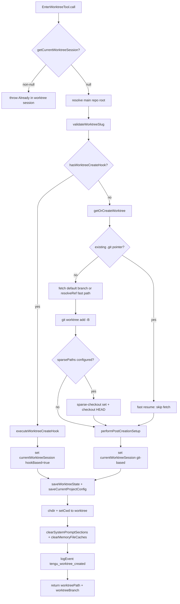
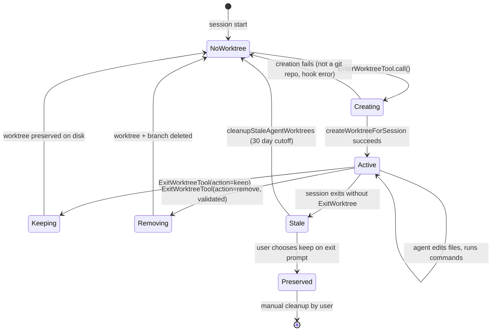

# Worktrees: Isolated Parallel Branches

## Overview

When a long-running agent operates on a repository, its file edits, branch operations, and build artifacts collide with whatever else the developer might be doing in that same working directory. The cc harness solves this isolation problem through git worktrees — lightweight checkouts that share the same `.git` object store but maintain independent working trees and branches. A worktree, as defined in the cc terminology registry, is "a git worktree created as an isolated working directory for parallel agent execution, with its own branch and symlinked node_modules," managed by the `EnterWorktreeTool` and `ExitWorktreeTool` pair.

The worktree subsystem spans three source areas. The `EnterWorktreeTool` (`src/tools/EnterWorktreeTool/EnterWorktreeTool.ts`) creates an isolated checkout and switches the session into it. The `ExitWorktreeTool` (`src/tools/ExitWorktreeTool/ExitWorktreeTool.ts`) restores the session to its original directory, optionally cleaning up the worktree. The utility layer (`src/utils/worktree.ts`) handles the low-level git operations, slug validation, symlink propagation, stale-worktree garbage collection, and tmux integration.

This chapter traces the full lifecycle — from slug validation through worktree creation, post-creation setup, session switching, exit, and eventual garbage collection — and shows how cc enforces safety constraints that prevent data loss even when the agent or the user makes a mistake.

## Data structures and contracts

The central data contract is the `WorktreeSession` type, which captures everything the exit path needs to know about a worktree that was created during the current session:

```typescript
// src/utils/worktree.ts:L140-L154
export type WorktreeSession = {
  originalCwd: string
  worktreePath: string
  worktreeName: string
  worktreeBranch?: string
  originalBranch?: string
  originalHeadCommit?: string
  sessionId: string
  tmuxSessionName?: string
  hookBased?: boolean
  /** How long worktree creation took (unset when resuming an existing worktree). */
  creationDurationMs?: number
  /** True if git sparse-checkout was applied via settings.worktree.sparsePaths. */
  usedSparsePaths?: boolean
}
```

The `originalCwd` and `originalHeadCommit` fields are the two anchors that make safe exit possible. `originalCwd` records where the session was before entering the worktree so that `ExitWorktreeTool` can restore it. `originalHeadCommit` records the SHA that the worktree branch was based on, which enables the `countWorktreeChanges` function (discussed in the Edge Cases section) to count commits the agent made inside the worktree. The `hookBased` flag distinguishes git worktrees from VCS-agnostic hook-based worktrees, because the cleanup paths diverge: git worktrees use `git worktree remove --force`, while hook-based ones delegate to a `WorktreeRemove` hook.

A module-level variable `currentWorktreeSession` (`src/utils/worktree.ts:L156`) holds the live session. It is `null` when no worktree is active, and set exactly once by `createWorktreeForSession`. The `EnterWorktreeTool` checks this variable as a guard: if `getCurrentWorktreeSession()` returns a non-null value, the tool throws `"Already in a worktree session"` (`src/tools/EnterWorktreeTool/EnterWorktreeTool.ts:L79-L81`). This prevents nested worktree creation within a single session.

The `EnterWorktreeTool` input schema uses a `lazySchema` wrapper around a `z.strictObject` with a single optional `name` field. The name undergoes a `superRefine` that calls `validateWorktreeSlug` synchronously, converting any validation error into a Zod custom issue (`src/tools/EnterWorktreeTool/EnterWorktreeTool.ts:L23-L38`). The `ExitWorktreeTool` input schema is stricter — the `action` field is a required enum of `"keep"` or `"remove"`, and the `discard_changes` boolean is optional but semantically required when removing a worktree with uncommitted changes:

```typescript
// src/tools/ExitWorktreeTool/ExitWorktreeTool.ts:L30-L44
const inputSchema = lazySchema(() =>
  z.strictObject({
    action: z
      .enum(['keep', 'remove'])
      .describe(
        '"keep" leaves the worktree and branch on disk; "remove" deletes both.',
      ),
    discard_changes: z
      .boolean()
      .optional()
      .describe(
        'Required true when action is "remove" and the worktree has uncommitted files or unmerged commits. The tool will refuse and list them otherwise.',
      ),
  }),
)
```

The `ExitWorktreeTool` output schema is richer than the enter side — it includes `action`, `originalCwd`, `discardedFiles`, `discardedCommits`, and `tmuxSessionName` (`src/tools/ExitWorktreeTool/ExitWorktreeTool.ts:L47-L58`) — because the exit path must report exactly what was preserved or destroyed. The `isDestructive` method on `ExitWorktreeTool` returns `true` when `input.action === 'remove'` (`src/tools/ExitWorktreeTool/ExitWorktreeTool.ts:L168-L170`), which signals to the permission system that this tool call needs additional scrutiny.

Both tools set `shouldDefer: true` (`src/tools/EnterWorktreeTool/EnterWorktreeTool.ts:L71`, `src/tools/ExitWorktreeTool/ExitWorktreeTool.ts:L167`), which means they are not loaded into the model's tool list at session start but are discovered on-demand via the `ToolSearch` mechanism. This implements the deferred tool pattern from the cc terminology registry, reducing the initial tool surface and saving context tokens for tools the user is unlikely to invoke in every session.

## Control flow

### Worktree creation

Worktree creation begins when the model invokes `EnterWorktreeTool` with an optional `name` parameter. The slug is validated synchronously before any side effects occur:

```typescript
// src/utils/worktree.ts:L66-L87
export function validateWorktreeSlug(slug: string): void {
  if (slug.length > MAX_WORKTREE_SLUG_LENGTH) {
    throw new Error(
      `Invalid worktree name: must be ${MAX_WORKTREE_SLUG_LENGTH} characters or fewer (got ${slug.length})`,
    )
  }
  for (const segment of slug.split('/')) {
    if (segment === '.' || segment === '..') {
      throw new Error(
        `Invalid worktree name "${slug}": must not contain "." or ".." path segments`,
      )
    }
    if (!VALID_WORKTREE_SLUG_SEGMENT.test(segment)) {
      throw new Error(
        `Invalid worktree name "${slug}": each "/"-separated segment must be non-empty and contain only letters, digits, dots, underscores, and dashes`,
      )
    }
  }
}
```

This function is the first line of defense against path traversal. Because the slug is joined into `.claude/worktrees/<slug>` via `path.join`, a slug like `../../../target` would escape the worktrees directory. The validation rejects `.` and `..` segments, rejects empty segments (which catch leading/trailing slashes), and enforces an allowlist regex `[a-zA-Z0-9._-]+` per segment. Forward slashes are allowed for nesting (e.g., `asm/feature-foo`), but each segment is validated independently. The function throws synchronously, ensuring no git commands or hook executions run when the slug is malformed.

After validation, the control flow diverges based on whether a `WorktreeCreate` hook is configured. If the hook exists (`hasWorktreeCreateHook()` returns true), cc delegates entirely to the hook, enabling VCS-agnostic isolation. Otherwise, the git path runs `getOrCreateWorktree`, which first checks for a fast-resume path by reading the worktree's `.git` pointer file directly (`src/utils/worktree.ts:L247-L255`). If the worktree already exists, the function returns immediately without spawning `git fetch`, avoiding both the network round-trip and the credential prompt risk. For new worktrees, the function fetches the default branch (with a `resolveRef` fast path that skips fetch when the remote ref is already local), creates the worktree with `git worktree add -B`, and optionally configures sparse-checkout if `settings.worktree.sparsePaths` is set.

The core creation logic in `getOrCreateWorktree` constructs the `git worktree add` command with specific flags. The `-B` flag (uppercase) resets any orphan branch left behind by a removed worktree directory, saving a separate `git branch -D` subprocess on every create. The environment variables `GIT_TERMINAL_PROMPT=0` and `GIT_ASKPASS=''` (`src/utils/worktree.ts:L199-L202`) prevent git from opening credential prompts that would hang the CLI:

```typescript
// src/utils/worktree.ts:L321-L334
const sparsePaths = getInitialSettings().worktree?.sparsePaths
const addArgs = ['worktree', 'add']
if (sparsePaths?.length) {
  addArgs.push('--no-checkout')
}
// -B (not -b): reset any orphan branch left behind by a removed worktree dir.
addArgs.push('-B', worktreeBranch, worktreePath, baseBranch)

const { code: createCode, stderr: createStderr } =
  await execFileNoThrowWithCwd(gitExe(), addArgs, { cwd: repoRoot })
if (createCode !== 0) {
  throw new Error(`Failed to create worktree: ${createStderr}`)
}
```

When `sparsePaths` are configured, the worktree is added with `--no-checkout` first, then `git sparse-checkout set --cone` and `git checkout HEAD` are run separately. This two-phase approach allows the sparse-checkout patterns to take effect before populating the working tree, avoiding the overhead of checking out the entire repository and then deleting files outside the sparse cone.



The post-creation setup (`performPostCreationSetup` at `src/utils/worktree.ts:L510-L624`) is a multi-step operation that brings the worktree to a usable state. It copies `settings.local.json` into the worktree's `.claude` directory (propagating local settings that may contain secrets), configures `core.hooksPath` to point back to the main repo's hooks, symlinks directories listed in `settings.worktree.symlinkDirectories` (typically `node_modules` to avoid disk bloat from duplicated dependencies), and copies gitignored files matching `.worktreeinclude` patterns. Each of these steps is individually best-effort — failures are logged but do not abort the worktree creation, because a worktree without `node_modules` is still usable, while a failed creation would leave the user stranded.

After the worktree is created and the session state is updated, `EnterWorktreeTool.call` performs four session-level mutations (`src/tools/EnterWorktreeTool/EnterWorktreeTool.ts:L94-L103`): `process.chdir` and `setCwd` to the worktree path, `setOriginalCwd` to the new CWD, `saveWorktreeState` for session persistence, and cache invalidation via `clearSystemPromptSections`, `clearMemoryFileCaches`, and `getPlansDirectory.cache.clear`. The cache invalidation is critical: without it, the system prompt would contain stale environment info (old CWD, old project root) from the main repo. The `saveWorktreeState` call persists the worktree session to session storage, enabling `--resume` to restore it later via `restoreWorktreeSession` (`src/utils/worktree.ts:L167-L169`).

### Worktree exit

The exit path is the inverse of creation, but with significantly more safety machinery. `ExitWorktreeTool` takes two parameters: `action` (required, `"keep"` or `"remove"`) and `discard_changes` (optional, default `false`). The `validateInput` method gates the exit based on worktree state:

```typescript
// src/tools/ExitWorktreeTool/ExitWorktreeTool.ts:L174-L224
async validateInput(input) {
    const session = getCurrentWorktreeSession()
    if (!session) {
      return {
        result: false,
        message:
          'No-op: there is no active EnterWorktree session to exit...',
        errorCode: 1,
      }
    }

    if (input.action === 'remove' && !input.discard_changes) {
      const summary = await countWorktreeChanges(
        session.worktreePath,
        session.originalHeadCommit,
      )
      if (summary === null) {
        return {
          result: false,
          message: `Could not verify worktree state...`,
          errorCode: 3,
        }
      }
      const { changedFiles, commits } = summary
      if (changedFiles > 0 || commits > 0) {
        // ...
        return {
          result: false,
          message: `Worktree has ${parts.join(' and ')}...`,
          errorCode: 2,
        }
      }
    }

    return { result: true }
  },
```

The scoping guard at the top of `validateInput` is the most important safety constraint in the entire worktree subsystem. `getCurrentWorktreeSession()` returns `null` unless `EnterWorktreeTool` (specifically `createWorktreeForSession`) ran in the current session. Worktrees created by `git worktree add` on the command line, or by `EnterWorktreeTool` in a previous session that was resumed, do not populate `currentWorktreeSession`. This means `ExitWorktreeTool` will never touch a worktree it did not create — it becomes a no-op that reports the absence and takes no filesystem action (`src/tools/ExitWorktreeTool/ExitWorktreeTool.ts:L181-L188`).

When `action` is `"remove"` and `discard_changes` is `false`, the tool counts uncommitted files and commits on the worktree branch. If any exist, validation fails with a descriptive message listing the counts. The model is instructed to confirm with the user before re-invoking with `discard_changes: true`. This two-step protocol prevents accidental data loss: the first invocation informs, the second (with explicit confirmation) destroys.

The `countWorktreeChanges` function is itself a careful implementation that uses two separate git commands to assess the state of the worktree:

```typescript
// src/tools/ExitWorktreeTool/ExitWorktreeTool.ts:L79-L113
async function countWorktreeChanges(
  worktreePath: string,
  originalHeadCommit: string | undefined,
): Promise<ChangeSummary | null> {
  const status = await execFileNoThrow('git', [
    '-C',
    worktreePath,
    'status',
    '--porcelain',
  ])
  if (status.code !== 0) {
    return null
  }
  const changedFiles = count(status.stdout.split('\n'), l => l.trim() !== '')

  if (!originalHeadCommit) {
    return null
  }

  const revList = await execFileNoThrow('git', [
    '-C',
    worktreePath,
    'rev-list',
    '--count',
    `${originalHeadCommit}..HEAD`,
  ])
  if (revList.code !== 0) {
    return null
  }
  const commits = parseInt(revList.stdout.trim(), 10) || 0

  return { changedFiles, commits }
}
```

The function first runs `git status --porcelain` with the `-C` flag to target the worktree path without changing the process working directory. If that fails, it returns `null` (fail-closed). It then checks whether `originalHeadCommit` exists — for hook-based worktrees it is undefined, and without a baseline commit the function cannot count commits, so it returns `null` rather than reporting zero. When `originalHeadCommit` is available, `git rev-list --count` counts the commits between the original HEAD and the current HEAD, giving an exact count of work the agent performed inside the worktree.

On the `"keep"` path, `keepWorktree()` (`src/utils/worktree.ts:L780-L811`) changes back to the original directory, nulls out `currentWorktreeSession`, and updates the project config. The worktree directory and branch remain on disk for the user to return to later. On the `"remove"` path, `cleanupWorktree()` (`src/utils/worktree.ts:L813-L894`) runs `git worktree remove --force`, deletes the worktree branch with `git branch -D`, and for hook-based worktrees delegates to the `WorktreeRemove` hook. A 100ms sleep before branch deletion (`src/utils/worktree.ts:L868`) ensures git has released internal lock files from the just-completed worktree removal. The `--force` flag on `git worktree remove` is necessary because the worktree may contain untracked files that would otherwise prevent removal, but the safety gating has already confirmed that the user explicitly chose to discard those changes.

After the worktree utility returns, `restoreSessionToOriginalCwd` (`src/tools/ExitWorktreeTool/ExitWorktreeTool.ts:L122-L146`) reverses the session-level mutations. This function is the symmetric inverse of the enter path, but with one subtlety: `setProjectRoot(originalCwd)` is called only when `projectRootIsWorktree` is true (`src/tools/ExitWorktreeTool/ExitWorktreeTool.ts:L135-L141`). The `--worktree` startup flag sets both `originalCwd` and `projectRoot` to the worktree path, but mid-session `EnterWorktreeTool` only sets `originalCwd`. Blindly resetting `projectRoot` when it was never changed would move it to wherever the user had cd'd before entering the worktree, breaking the "stable project identity" contract. The same conditional logic applies to `updateHooksConfigSnapshot()`, which is only called when `--worktree` startup had originally set up hooks from the worktree's directory.

### Worktree lifecycle

The complete lifecycle from creation through exit and garbage collection is captured in the following state diagram:



The `Stale` state represents the common scenario where a session ends (crash, Ctrl+C, user closes terminal) without the agent calling `ExitWorktreeTool`. In this case, cc prompts the user to keep or remove the worktree on the next session start. For ephemeral agent worktrees (created by `AgentTool`, `WorkflowTool`, and `bridgeMain`), the `cleanupStaleAgentWorktrees` function (`src/utils/worktree.ts:L1058-L1136`) performs automatic garbage collection of worktrees older than a cutoff date, but only when they match specific ephemeral slug patterns and have no uncommitted changes or unpushed commits.

The dual-track design — session worktrees managed by `EnterWorktreeTool`/`ExitWorktreeTool` versus agent worktrees managed by `createAgentWorktree`/`removeAgentWorktree` — means there are two independent flows through the lifecycle. Session worktrees interact with `currentWorktreeSession` and mutate process state; agent worktrees do neither, because a subagent's worktree must not interfere with the parent session's CWD or session state. The `createAgentWorktree` function (`src/utils/worktree.ts:L902-L952`) calls `findCanonicalGitRoot` instead of `findGitRoot` so that agent worktrees always land in the main repo's `.claude/worktrees/` directory, even when the agent is spawned from inside a session worktree. Without this, they would nest at `<worktree>/.claude/worktrees/`, and the periodic cleanup scan (which scans the canonical root) would never find them.

## Edge cases and failure modes

**Path traversal defense.** The slug validation described earlier is the primary defense, but the worktree utility adds a second layer. The `symlinkDirectories` function calls `containsPathTraversal(dir)` on each directory name before symlinking (`src/utils/worktree.ts:L109-L115`). Even if a directory name somehow bypassed earlier checks, the symlink path would be rejected. This defense-in-depth approach is essential for the fork-join parallelism pattern described in the HER: multiple subagents operating in isolated worktrees must not be able to traverse outside their assigned directories. The HER further notes that cached parent context reuse means the parent's file paths are shared with children, making path traversal prevention at the tool level critical.

**Fail-closed change counting.** The `countWorktreeChanges` function in `ExitWorktreeTool` returns `null` when it cannot reliably determine the worktree state — when `git status` or `git rev-list` exit non-zero (lock file, corrupt index, bad ref), or when `originalHeadCommit` is undefined but `git status` succeeded. The latter case covers hook-based worktrees, which do not set `originalHeadCommit` (`src/utils/worktree.ts:L721-L728`). Callers that use `countWorktreeChanges` as a safety gate treat `null` as "unknown, assume unsafe" (fail-closed). A silent `0/0` would let `cleanupWorktree` destroy real work. The function's JSDoc comment (`src/tools/ExitWorktreeTool/ExitWorktreeTool.ts:L68-L78`) explicitly documents this contract: "callers that use this as a safety gate must treat null as 'unknown, assume unsafe' (fail-closed)."

**Nested slug flattening.** Forward slashes in slugs allow hierarchical names like `user/feature`, but nesting in the branch name or directory path is dangerous. In git refs, `worktree-user` (a file) versus `worktree-user/feature` (needs a directory) is a D/F conflict that git rejects. In the filesystem, `.claude/worktrees/user/feature/` lives inside the `user` worktree, and `git worktree remove` on the parent would delete children with uncommitted work. The `flattenSlug` function (`src/utils/worktree.ts:L217-L219`) replaces all slashes with `+` characters: `user/feature` becomes `user+feature`. The `+` character is valid in git branch names and filesystem paths but is not in the slug-segment allowlist `[a-zA-Z0-9._-]`, making the mapping injective — no two distinct slugs can flatten to the same branch name or directory path.

**Sparse-checkout rollback.** When sparse-checkout or checkout fail after `git worktree add --no-checkout`, the worktree is registered and HEAD is set but the working tree is empty. A subsequent fast-resume (which reads the HEAD pointer directly) would succeed and present a broken worktree as "resumed." The `getOrCreateWorktree` function handles this by tearing down the worktree before propagating the error (`src/utils/worktree.ts:L341-L348`). The `tearDown` helper runs `git worktree remove --force` and then throws, ensuring the `.git` pointer file is cleaned up so the next attempt starts fresh rather than hitting the fast-resume path with a corrupted worktree.

**Husky hooks reset.** The post-creation setup sets `core.hooksPath` to the main repo's hooks directory, but husky's prepare script (`git config core.hooksPath .husky`) runs on every `bun install` and resets the shared `.git/config` value back to a relative path. This causes each worktree to resolve to its own `.husky/` again, which lacks the attribution hook file (it is in `.git/info/exclude`, not tracked). The mitigation installs the attribution hook directly into the worktree's `.husky/` directory (`src/utils/worktree.ts:L603-L623`), which husky never deletes because its install operation is additive-only. The code uses a dynamic `import()` for the attribution module with nested `.catch` handlers — the inner one for install failures, the outer one for module-load failures — to avoid unhandled promise rejections from either source.

**Ephemeral worktree garbage collection.** The `cleanupStaleAgentWorktrees` function (`src/utils/worktree.ts:L1058-L1136`) uses exact-shape regex patterns for ephemeral slugs:

```typescript
// src/utils/worktree.ts:L1030-L1041
const EPHEMERAL_WORKTREE_PATTERNS = [
  /^agent-a[0-9a-f]{7}$/,
  /^wf_[0-9a-f]{8}-[0-9a-f]{3}-\d+$/,
  /^wf-\d+$/,
  /^bridge-[A-Za-z0-9_]+(-[A-Za-z0-9_]+)*$/,
  /^job-[a-zA-Z0-9._-]{1,55}-[0-9a-f]{8}$/,
]
```

These patterns match worktrees created by `AgentTool` (slugs like `agent-a3f7b2c1`), `WorkflowTool` (slugs like `wf_8a3f7b2c-d4e-1`), bridgeMain (`bridge-` prefix), and template jobs (`job-` prefix with 8-hex suffix). The patterns are intentionally specific to avoid sweeping user-named worktrees like `wf-myfeature`. Before removing a worktree, the function checks that `git status --porcelain -uno` shows no tracked changes and that `git rev-list --max-count=1 HEAD --not --remotes` shows no unpushed commits. Both checks must succeed with empty output; any non-zero exit code or non-empty output means the worktree is skipped (fail-closed). After successful removal, `git worktree prune` is run to clean up stale administrative files in the main `.git` directory.

**Race between validation and execution.** Although `validateInput` gates the exit, `ExitWorktreeTool.call` re-checks `getCurrentWorktreeSession()` at the top (`src/tools/ExitWorktreeTool/ExitWorktreeTool.ts:L228-L233`). The session is module-level mutable state — a concurrent `ExitWorktreeTool` invocation (unlikely but possible in theory) could null it out between validation and execution. The defensive throw prevents operating on a stale session reference. The comment in the code acknowledges this is a defense against a race condition between validation and execution over mutable shared state.

**Re-counting at execution time.** Even after validation succeeds, `ExitWorktreeTool.call` re-counts changes at execution time (`src/tools/ExitWorktreeTool/ExitWorktreeTool.ts:L253-L259`). The worktree state at `validateInput` time may not match the current state — the model could have made additional edits between validation and execution. The null case (git failure) falls back to `0/0` for analytics purposes, because the safety gating already happened in `validateInput`. This re-count ensures the analytics event (`tengu_worktree_kept` or `tengu_worktree_removed`) reports accurate commit and file counts, and the output message to the user reflects the actual state of the worktree at the moment of exit.

## Where cc diverges from the published pattern

The HER identifies Fork-Join Parallelism (Pattern 8) as "multiple subagents in isolated git worktrees; cached parent context reuse." The cc implementation diverges from this pattern in several ways.

First, the HER pattern implies that worktree creation and destruction are symmetric operations managed by the orchestration layer. In cc, `EnterWorktreeTool` and `ExitWorktreeTool` are exposed as model-invocable tools, not orchestration primitives. The model decides when to enter and exit a worktree, guided by the prompt's instruction to only use the tool when the user explicitly says "worktree" (`src/tools/EnterWorktreeTool/prompt.ts:L2-L12`). This design gives the model discretion, which the HER's checkpoint-restore concerns (Section 7) flag as risky: if the model re-synthesizes a worktree entry after a checkpoint-restore, it could replay actions against the wrong directory. cc mitigates this by making `currentWorktreeSession` a single-assignment variable — once set, it cannot be overwritten, and the "Already in a worktree session" guard prevents replay. The HER specifically identifies checkpoint-restore attacks where LLM agents re-synthesize subtly different requests after restoration, causing duplicate payments and unauthorized credential reuse. The single-assignment worktree session variable is a structural defense against this class of attack.

Second, the HER's back-pressure pattern (Section 5) recommends that resource-constrained agents slow down or stop. The worktree subsystem has no explicit back-pressure mechanism — creating a worktree is a synchronous, one-shot operation that either succeeds or fails. However, the stale-worktree garbage collector acts as an implicit pressure release: if the `.claude/worktrees/` directory accumulates too many abandoned worktrees from crashed agent runs, the 30-day sweep reclaims disk space. The fail-closed safety checks ensure this reclamation never destroys valuable work. The HER notes that back-pressure prevents runaway loops and excessive API usage — in the worktree context, the analogous concern is unbounded disk consumption from leaked worktrees, and the garbage collector serves as the back-pressure mechanism.

Third, the HER suggests that file-based communication between subagents in different worktrees should use git for audit trails. The cc implementation goes further: worktrees share the same `.git` object store by design, so a commit in one worktree is immediately visible via `git log` from another. The `copyWorktreeIncludeFiles` function (`src/utils/worktree.ts:L391-L504`) copies gitignored files (like `.env.local` or build configs) from the main repo to the worktree, enabling shared configuration without shared working-tree state. The function uses the `ignore` library to match `.worktreeinclude` patterns against gitignored entries, with a sophisticated two-pass strategy: the first pass uses `git ls-files --directory` to collapse fully-gitignored directories (avoiding a full tree walk of `node_modules/`), and the second pass expands only collapsed directories where a `.worktreeinclude` pattern explicitly targets a path inside them.

Fourth, the `createAgentWorktree` function (`src/utils/worktree.ts:L902-L952`) provides a separate entry point for subagent worktrees that deliberately does not touch global session state (`currentWorktreeSession`, `process.chdir`, project config). This separation means agent worktrees and session worktrees have independent lifecycles — an agent worktree can be created and removed without affecting the user's active worktree session. The HER pattern does not account for this dual-track design. When resuming an existing agent worktree, the function bumps its mtime (`src/utils/worktree.ts:L946-L947`) so the periodic stale-worktree cleanup does not consider it stale — the fast-resume path is read-only and leaves the original creation-time mtime intact, which could be past the 30-day cutoff.

Fifth, the HER notes that privilege boundaries (different agents having different permission levels) are a universal safety pattern. The cc worktree implementation reinforces this through the scoping guard in `ExitWorktreeTool.validateInput` — the tool will only operate on worktrees created by the current session, not on worktrees from other sessions or from manual `git worktree add` commands. This creates a privilege boundary where each session has exclusive control over its own worktrees.

## Developer takeaways for building a long-running agent

Building a worktree isolation layer for a long-running agent requires three invariants. First, validate all user-supplied path components before joining them into filesystem paths — `path.join` normalizes `..` segments, so allowlist validation (not blocklist) is the only reliable defense. The cc implementation demonstrates this with `validateWorktreeSlug`, which runs before any side effects and rejects path traversal at the schema level. Second, maintain a single-assignment session reference that records the pre-entry state (original CWD, original HEAD commit) so the exit path can restore it exactly; treat the absence of this reference as a hard no-op, never as an implicit "proceed." The `ExitWorktreeTool` scoping guard that checks `getCurrentWorktreeSession()` is the key example — it ensures the tool never touches a worktree it did not create. Third, separate the validation gate from the execution path and make the validation fail-closed: when you cannot prove the worktree is safe to destroy, refuse. The two-step remove protocol (inform first, destroy on explicit confirmation) prevents the model from accidentally discarding user work during an autonomous loop. For garbage collection, use exact-shape patterns to distinguish ephemeral agent worktrees from user-named ones, and require both clean working-tree status and no unpushed commits before reclaiming disk space. The cc worktree subsystem demonstrates that the complexity of correct isolation lies not in the creation path (which git handles well) but in the exit and cleanup paths, where every edge case is a potential data-loss scenario.
