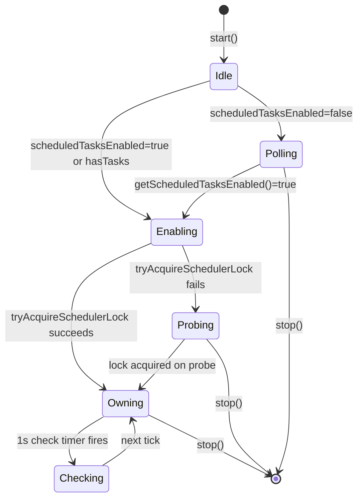
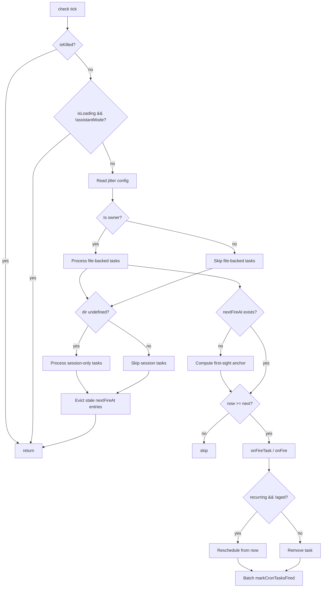

# Cron, Schedule, Loop, and Wakeup

## Overview

cc's scheduling subsystem transforms a stateless, request-response agent loop into a long-running worker capable of self-paced iteration. The mechanism rests on three pillars: a cron expression parser and next-run calculator (`cron.ts`), a durable task store with jitter-aware fire computation (`cronTasks.ts`), and a scheduler core with file watching and lock-based ownership (`cronScheduler.ts`). Three tools -- CronCreate, CronDelete, CronList -- expose the system to the model, while the `/loop` skill provides a user-facing shorthand for the most common workflow: "do X every Y minutes."

The design addresses a specific operational concern documented in HER Section 5 (Back-Pressure): when thousands of CLI sessions across the fleet all schedule `0 9 * * *` (9 AM sharp), the resulting inference spike at minute boundaries creates a thundering herd. cc's answer is deterministic, per-task jitter derived from the task ID itself -- no coordination, no random number generator, fully reproducible across process restarts. Recurring tasks fire slightly late (proportional to the interval, capped at 15 minutes); one-shot tasks fire slightly early when they land on a round wall-clock boundary.

The system also grapples with the checkpoint-restore problem identified in HER Section 7: a recurring task that fires while the REPL is idle must have its state persisted so that a process restart does not re-fire it or lose the reschedule anchor. The `lastFiredAt` field in `.claude/scheduled_tasks.json` serves as the restore point -- on startup, the scheduler anchors first-sight computation from `lastFiredAt` (if present) or `createdAt` (if never fired), ensuring idempotent reconstruction of the in-memory `nextFireAt` map.

The HER excerpt in Chapter 47's reference material reinforces the practical stakes: METR research (March 2025) found that 95% per-step reliability yields only 36% success over 20 steps, and doubling task duration quadruples the failure rate. This implies that multi-hour agent tasks must be decomposed into shorter sessions with state handoffs between them. cc's cron system is the mechanism for those handoffs -- each fire enqueues a fresh prompt that runs in its own turn, inheriting the session's accumulated context but starting from a known-good state rather than attempting to continue a degraded long-running turn.

## Data structures and contracts

The central data contract is the `CronTask` type, defined in `cronTasks.ts`:

```typescript
// src/utils/cronTasks.ts:L30-L70 — CronTask type definition
export type CronTask = {
  id: string
  /** 5-field cron string (local time) — validated on write, re-validated on read. */
  cron: string
  /** Prompt to enqueue when the task fires. */
  prompt: string
  /** Epoch ms when the task was created. Anchor for missed-task detection. */
  createdAt: number
  /**
   * Epoch ms of the most recent fire. Written back by the scheduler after
   * each recurring fire so next-fire computation survives process restarts.
   * The scheduler anchors first-sight from `lastFiredAt ?? createdAt` — a
   * never-fired task uses createdAt (correct for pinned crons like
   * `30 14 27 2 *` whose next-from-now is next year); a fired-before task
   * reconstructs the same `nextFireAt` the prior process had in memory.
   * Never set for one-shots (they're deleted on fire).
   */
  lastFiredAt?: number
  /** When true, the task reschedules after firing instead of being deleted. */
  recurring?: boolean
  /**
   * When true, the task is exempt from recurringMaxAgeMs auto-expiry.
   * System escape hatch for assistant mode's built-in tasks (catch-up/
   * morning-checkin/dream) — the installer's writeIfMissing() skips existing
   * files so re-install can't recreate them. Not settable via CronCreateTool;
   * only written directly to scheduled_tasks.json by src/assistant/install.ts.
   */
  permanent?: boolean
  /**
   * Runtime-only flag. false → session-scoped (never written to disk).
   * File-backed tasks leave this undefined; writeCronTasks strips it so
   * the on-disk shape stays { id, cron, prompt, createdAt, lastFiredAt?, recurring?, permanent? }.
   */
  durable?: boolean
  /**
   * Runtime-only. When set, the task was created by an in-process teammate.
   * The scheduler routes fires to that teammate's queue instead of the main
   * REPL's. Never written to disk (teammate crons are always session-only).
   */
  agentId?: string
}
```

Several fields deserve attention. The `durable` field is a runtime-only tag: when `false`, the task lives exclusively in the process's in-memory session store (held in `bootstrap/state.ts` as `sessionCronTasks`) and is never written to `.claude/scheduled_tasks.json`. The `writeCronTasks` function explicitly strips it before serialization (`src/utils/cronTasks.ts:L175`). The `agentId` field routes teammate-originated cron fires to the appropriate in-process teammate queue rather than the main REPL's command queue. Because teammates are session-scoped, teammate crons are always `durable: false`, so `agentId` is never persisted to disk.

The `permanent` field exempts assistant mode's built-in tasks (catch-up, morning-checkin, dream) from the auto-expiry timer. It is written directly to the JSON file by `src/assistant/install.ts` and is not settable through `CronCreateTool`, preventing the model from creating unkillable tasks.

The on-disk format is a simple JSON file at `.claude/scheduled_tasks.json`:

```typescript
// src/utils/cronTasks.ts:L72-L74 — CronFile type
type CronFile = { tasks: CronTask[] }

const CRON_FILE_REL = join('.claude', 'scheduled_tasks.json')
```

The persistence layer has two tiers. File-backed (durable) tasks live in `scheduled_tasks.json` and survive process restarts. Session-only (non-durable) tasks live in the `sessionCronTasks` array inside `bootstrap/state.ts` and die with the process. The `listAllCronTasks` function merges both tiers, tagging session tasks with `durable: false` so callers can distinguish them:

```typescript
// src/utils/cronTasks.ts:L288-L296 — listAllCronTasks merges file and session stores
export async function listAllCronTasks(dir?: string): Promise<CronTask[]> {
  const fileTasks = await readCronTasks(dir)
  if (dir !== undefined) return fileTasks
  const sessionTasks = getSessionCronTasks().map(t => ({
    ...t,
    durable: false as const,
  }))
  return [...fileTasks, ...sessionTasks]
}
```

The `dir !== undefined` guard ensures daemon callers (which pass an explicit directory and have no session store) receive only file-backed tasks. REPL callers get the merged view.

The jitter configuration contract controls the anti-herd behavior:

```typescript
// src/utils/cronTasks.ts:L315-L346 — CronJitterConfig type
export type CronJitterConfig = {
  /** Recurring-task forward delay as a fraction of the interval between fires. */
  recurringFrac: number
  /** Upper bound on recurring forward delay regardless of interval length. */
  recurringCapMs: number
  /** One-shot backward lead: maximum ms a task may fire early. */
  oneShotMaxMs: number
  /**
   * One-shot backward lead: minimum ms a task fires early when the minute-mod
   * gate matches. 0 = taskIds hashing near zero fire on the exact mark. Raise
   * this to guarantee nobody lands on the wall-clock boundary.
   */
  oneShotFloorMs: number
  /**
   * Jitter fires landing on minutes where `minute % N === 0`. 30 → :00/:30
   * (the human-rounding hotspots). 15 → :00/:15/:30/:45. 1 → every minute.
   */
  oneShotMinuteMod: number
  /**
   * Recurring tasks auto-expire this many ms after creation (unless marked
   * `permanent`). The default (7 days) covers "check my PRs every hour this
   * week" workflows while capping worst-case session lifetime.
   */
  recurringMaxAgeMs: number
}
```

The defaults at `src/utils/cronTasks.ts:L348-L355` set `recurringFrac: 0.1`, `recurringCapMs: 15 * 60 * 1000`, `oneShotMaxMs: 90 * 1000`, `oneShotFloorMs: 0`, `oneShotMinuteMod: 30`, and `recurringMaxAgeMs: 7 * 24 * 60 * 60 * 1000`. These values are runtime-tunable via GrowthBook (`cronJitterConfig.ts` reads `tengu_kairos_cron_config` on a 60-second refresh), so ops can widen the jitter window mid-session during a load spike without restarting clients.

The parsed-cron contract is `CronFields`, a five-element array-of-arrays representation:

```typescript
// src/utils/cron.ts:L10-L16 — CronFields type
export type CronFields = {
  minute: number[]
  hour: number[]
  dayOfMonth: number[]
  month: number[]
  dayOfWeek: number[]
}
```

Each field is a sorted array of matching integers. The parser supports wildcards, steps (`*/5`), ranges (`1-5`), lists (`0,30`), and the day-of-week Sunday alias (7 maps to 0). It does not support `L`, `W`, `?`, or name aliases -- the implementation intentionally covers the common subset.

The session store in `bootstrap/state.ts` mirrors the `CronTask` shape but as a separate `SessionCronTask` type (lines 1280-1292) to keep bootstrap a leaf of the import DAG. The store provides `addSessionCronTask`, `getSessionCronTasks`, and `removeSessionCronTasks` -- the last of which returns the count of removed tasks so callers like `removeCronTasks` can skip a disk read when all requested IDs were found in the session store.

## Control flow

### Cron expression parsing and next-run computation

The parser in `src/utils/cron.ts` converts a 5-field cron string into `CronFields` via `parseCronExpression` (`src/utils/cron.ts:L83-L101`). Each field is expanded individually by `expandField`, which handles wildcard, step, range, and list syntax. The `expandField` function at `src/utils/cron.ts:L31-L77` iterates over comma-separated parts within a field, matching each against three patterns in order: star-slash-N (wildcard with optional step), N-M or N-M/S (range with optional step), and plain N (single value). Values are collected into a `Set` to deduplicate, then sorted.

The next-run calculator `computeNextCronRun` (`src/utils/cron.ts:L119-L181`) walks forward minute-by-minute from a strictly-after starting point, bounded at 366 days. It implements standard cron OR semantics: when both `dayOfMonth` and `dayOfWeek` are constrained (neither is the full range), a date matches if either field matches. DST gaps are handled naturally -- a fixed-hour cron targeting a spring-forward gap simply skips the transition day because the gap hour never appears in local time.

```typescript
// src/utils/cron.ts:L119-L158 — computeNextCronRun core loop
export function computeNextCronRun(
  fields: CronFields,
  from: Date,
): Date | null {
  const minuteSet = new Set(fields.minute)
  const hourSet = new Set(fields.hour)
  const domSet = new Set(fields.dayOfMonth)
  const monthSet = new Set(fields.month)
  const dowSet = new Set(fields.dayOfWeek)

  const domWild = fields.dayOfMonth.length === 31
  const dowWild = fields.dayOfWeek.length === 7

  const t = new Date(from.getTime())
  t.setSeconds(0, 0)
  t.setMinutes(t.getMinutes() + 1)

  const maxIter = 366 * 24 * 60
  for (let i = 0; i < maxIter; i++) {
    const month = t.getMonth() + 1
    if (!monthSet.has(month)) {
      t.setMonth(t.getMonth() + 1, 1)
      t.setHours(0, 0, 0, 0)
      continue
    }

    const dom = t.getDate()
    const dow = t.getDay()
    const dayMatches =
      domWild && dowWild
        ? true
        : domWild
          ? dowSet.has(dow)
          : dowWild
            ? domSet.has(dom)
            : domSet.has(dom) || dowSet.has(dow)
    // ... hour and minute checks follow
```

The `dayMatches` logic on lines 151-158 implements the OR semantics: when both day fields are wildcarded, every day matches; when only one is constrained, it controls; when both are constrained, either suffices. The walk skips entire months when the month field does not match (jumping to day 1 of the next month) and entire days when the day field does not match (jumping to midnight of the next day). This keeps the worst-case iteration count far below the 366-day bound for most practical cron expressions.

The `cronToHuman` function at `src/utils/cron.ts:L218-L308` provides human-readable descriptions for common patterns (every N minutes, hourly, daily at a specific time, weekdays, specific day of week). It falls through to the raw cron string for anything it does not recognize, avoiding false generalizations. A `utc` option exists for CCR remote triggers, which run on servers and use UTC cron strings -- that path translates UTC times to the user's local timezone for display, including midnight-crossing logic for weekday names.

### Scheduler lifecycle

The scheduler is created by `createCronScheduler` in `src/utils/cronScheduler.ts` and wrapped by the `useScheduledTasks` React hook in `src/hooks/useScheduledTasks.ts`. The lifecycle proceeds through these states:



On `start()`, the scheduler checks `getScheduledTasksEnabled()` (a boolean flag in `bootstrap/state.ts` at line 137). If false, it polls every second until it flips true. CronCreateTool calls `setScheduledTasksEnabled(true)` after adding a task, which triggers the poll to resolve and the scheduler to transition to the Enabling state. In assistant mode, the scheduler auto-enables without waiting for the flag, because assistant mode has tasks in `scheduled_tasks.json` at install time and should not wait on a skill trigger to flip the flag.

Enabling involves importing chokidar, acquiring a per-project scheduler lock (to prevent double-firing when multiple cc sessions share a working directory), loading tasks from disk, and starting both a file watcher and a 1-second check timer. The file watcher on `.claude/scheduled_tasks.json` triggers a `load(false)` call on add/change/unlink events, keeping the in-memory task list in sync with disk. The `awaitWriteFinish` option with a 300ms stability threshold prevents partial-write reloads. On file unlink (the last task was removed), the scheduler clears its in-memory task list and `nextFireAt` map.

If the lock cannot be acquired (another session owns it), the scheduler enters a Probing state, re-attempting lock acquisition every 5 seconds. Only the lock owner runs `check()` on file-backed tasks; session-only tasks are always processed regardless of lock ownership because they are process-private and carry no double-fire risk.

The `stop()` method tears down all timers, closes the file watcher, and releases the scheduler lock. This is called from the `useEffect` cleanup in `useScheduledTasks` (line 122: `return () => scheduler.stop()`), ensuring the scheduler is destroyed when the React component unmounts.

### Check-and-fire dispatch

The `check()` function (`src/utils/cronScheduler.ts:L230-L394`) is the scheduler's heart. It runs every second and decides whether to fire any tasks. The dispatch flow is:



The first-sight anchor on line 264-276 is critical for checkpoint-restore correctness. A never-fired recurring task anchors from `createdAt`; a previously-fired task anchors from `lastFiredAt`. This ensures that if the process restarts, the first-sight computation reconstructs the same `nextFireAt` that the previous process had in memory. Without this, a daemon child despawning on idle would lose its `nextFireAt` map, and the next spawn would re-anchor from a stale `createdAt`, firing every task immediately.

The `process` function inside `check()` handles both file-backed and session-only tasks with a shared loop body. The `isSession` boolean routes the cleanup path: session tasks are removed synchronously from memory via `removeSessionCronTasks`, while file tasks go through the async `removeCronTasks` plus chokidar reload chain. The `inFlight` set guards against double-fire during this async window.

For recurring tasks that fire successfully, the scheduler reschedules from `now` (not from the previous `nextFireAt`) to avoid rapid catch-up if the session was blocked. The new fire time is computed via `jitteredNextCronRunMs`, and `lastFiredAt` is persisted to disk in a batched write so N fires in one tick produce only one read-modify-write cycle. The `markCronTasksFired` function at `src/utils/cronTasks.ts:L261-L278` performs this write, and chokidar picks it up and re-seeds the in-memory state idempotently.

### Jitter: anti-herd deterministic delay

The jitter system addresses the fleet-wide load problem described in HER Section 5. The `jitterFrac` function (`src/utils/cronTasks.ts:L362-L365`) deterministically maps an 8-hex-char task ID to a number in `[0, 1)` by parsing it as a u32 and dividing by `0x1_0000_0000`. This value is stable across process restarts because the ID is generated once at task creation and stored on disk.

```typescript
// src/utils/cronTasks.ts:L362-L365 — jitterFrac: deterministic per-task fraction
function jitterFrac(taskId: string): number {
  const frac = parseInt(taskId.slice(0, 8), 16) / 0x1_0000_0000
  return Number.isFinite(frac) ? frac : 0
}
```

Non-hex IDs (from hand-edited JSON) fall back to 0, meaning no jitter -- a safe default since such IDs are rare and the impact of one unjittered task is negligible.

For recurring tasks, `jitteredNextCronRunMs` (`src/utils/cronTasks.ts:L381-L398`) computes the raw next fire time `t1`, then the one after that `t2`, and adds `jitterFrac(taskId) * recurringFrac * (t2 - t1)` capped at `recurringCapMs`. At defaults, an hourly task (3600s between fires) gets `0.1 * 3600s = 360s` of potential delay, well within the 15-minute cap, spreading fires across a 6-minute window after the scheduled mark. A per-minute task only spreads by `0.1 * 60s = 6s` because the inter-fire gap is small. If there is no second match within 366 days (a pinned-date cron like `30 14 27 2 *`), `t2` is null and the function returns `t1` without jitter -- near-certainly not a herd risk.

For one-shot tasks, `oneShotJitteredNextCronRunMs` (`src/utils/cronTasks.ts:L421-L445`) uses backward jitter (firing early) because delaying a user-pinned reminder breaks the contract. The jitter applies only when the fire time lands on a minute boundary matching `oneShotMinuteMod` (default: 30, meaning only `:00` and `:30` are jittered -- the human-rounding hotspots). The lead time is `oneShotFloorMs + jitterFrac(taskId) * (oneShotMaxMs - oneShotFloorMs)`, clamped to `fromMs` so a task created inside its own jitter window does not fire before it was created. The minute check uses `getMinutes()` in local time, not UTC, because "user picked a round time" means round in their timezone -- in half-hour-offset zones like India (UTC+5:30), local `:00` is UTC `:30`, and a UTC check would jitter the wrong marks.

During an incident, ops can push a GrowthBook config with e.g. `{oneShotMinuteMod: 15, oneShotMaxMs: 300000, oneShotFloorMs: 30000}` to spread `:00/:15/:30/:45` fires across a `[t-5min, t-30s]` window. The `oneShotFloorMs` parameter guarantees every task gets at least 30 seconds of lead so nobody lands on the exact mark.

### The /loop skill

The `/loop` skill (`src/skills/bundled/loop.ts`) is a user-facing entry point that translates natural-language interval requests into CronCreate calls. It parses the input in priority order: leading interval token (e.g., `5m`), trailing "every" clause (e.g., `every 20 minutes`), or default to 10 minutes. The skill then instructs the model to convert the interval to a cron expression using a conversion table, call CronCreate, and immediately execute the prompt once rather than waiting for the first cron fire.

```typescript
// src/skills/bundled/loop.ts:L25-L71 — /loop prompt builder
function buildPrompt(args: string): string {
  return `# /loop — schedule a recurring prompt

Parse the input below into \`[interval] <prompt…>\` and schedule it with ${CRON_CREATE_TOOL_NAME}.

## Parsing (in priority order)

1. **Leading token**: if the first whitespace-delimited token matches \`^\\d+[smhd]$\` (e.g. \`5m\`, \`2h\`), that's the interval; the rest is the prompt.
2. **Trailing "every" clause**: otherwise, if the input ends with \`every <N><unit>\` or \`every <N> <unit-word>\` (e.g. \`every 20m\`, \`every 5 minutes\`, \`every 2 hours\`), extract that as the interval and strip it from the prompt.
3. **Default**: otherwise, interval is \`${DEFAULT_INTERVAL}\` and the entire input is the prompt.
// ...
```

The key design decision is "fire immediately, then schedule." The prompt instructs: "Then immediately execute the parsed prompt now -- don't wait for the first cron fire." This gives the user instant feedback and avoids the perception that nothing happened after `/loop` was invoked. The skill also handles edge cases in the interval-to-cron conversion table: intervals that do not cleanly divide their unit (e.g., `7m` produces uneven gaps at `:56` to `:00`, `90m` cannot be expressed in cron) are rounded to the nearest clean interval, with the model instructed to inform the user about the rounding.

The skill's `isEnabled` gate is `isKairosCronEnabled`, the same GrowthBook-backed flag that controls the three cron tools. When the flag is off, the skill does not appear in the skill registry. The default is `true` because `/loop` is GA, and GrowthBook is disabled for Bedrock/Vertex/Foundry users -- a `false` default would break `/loop` for those users.

### CronCreate validation and execution

CronCreateTool (`src/tools/ScheduleCronTool/CronCreateTool.ts`) validates the cron expression, checks that it matches at least one calendar date in the next year, enforces the 50-job limit, and prevents teammates from creating durable crons (which would orphan on restart since `agentId` would point to a nonexistent teammate). The `call()` method at line 117-142 forces `durable` to false when the `isDurableCronEnabled()` gate returns false (a kill switch for disk-persistent tasks that leaves session-only cron untouched), adds the task via `addCronTask`, and enables the scheduler via `setScheduledTasksEnabled(true)`.

```typescript
// src/tools/ScheduleCronTool/CronCreateTool.ts:L117-L142 — CronCreate call implementation
  async call({ cron, prompt, recurring = true, durable = false }) {
    // Kill switch forces session-only; schema stays stable so the model sees
    // no validation errors when the gate flips mid-session.
    const effectiveDurable = durable && isDurableCronEnabled()
    const id = await addCronTask(
      cron,
      prompt,
      recurring,
      effectiveDurable,
      getTeammateContext()?.agentId,
    )
    // Enable the scheduler so the task fires in this session. The
    // useScheduledTasks hook polls this flag and will start watching
    // on the next tick.
    setScheduledTasksEnabled(true)
    return {
      data: {
        id,
        humanSchedule: cronToHuman(cron),
        recurring,
        durable: effectiveDurable,
      },
    }
  },
```

The `effectiveDurable` computation on line 120 is the mechanism by which the `isDurableCronEnabled` kill switch operates: if the gate returns false, the `durable` flag is forced to false regardless of what the model requested. The schema remains stable so the model sees no validation errors when the gate flips mid-session. This is a pattern cc uses elsewhere (see Chapter 11 on tool anatomy) -- schema stability across feature-gate transitions prevents confusing model behavior.

The `addCronTask` function at `src/utils/cronTasks.ts:L194-L219` generates an 8-hex-char ID by slicing a UUID, creates the task object, and either writes it to the file store (durable) or adds it to the session store (non-durable). For non-durable tasks, no file change event is produced -- the scheduler picks them up on its next tick directly from the session store.

### CronDelete and CronList

CronDeleteTool (`src/tools/ScheduleCronTool/CronDeleteTool.ts`) validates that the requested ID exists and that the caller owns it (teammates may only delete their own crons, enforced at lines 72-79). The `call()` method delegates to `removeCronTasks`, which first sweeps the session store and only reads the file if the session store did not account for all requested IDs.

CronListTool (`src/tools/ScheduleCronTool/CronListTool.ts`) merges file-backed and session tasks, filters by teammate context (teammates see only their own crons; the team lead sees all), and returns each job with its human-readable schedule via `cronToHuman`. The `isConcurrencySafe` and `isReadOnly` flags on the tool definition (lines 51-56) mark it as safe to call during concurrent operations and having no side effects, respectively.

### Feature gates and the scheduler kill switch

The cron system is controlled by two feature gates defined in `src/tools/ScheduleCronTool/prompt.ts`. The `isKairosCronEnabled` function (lines 36-45) combines a build-time `feature('AGENT_TRIGGERS')` flag with a runtime GrowthBook gate on a 5-minute refresh window. When it returns false, the three cron tools report `isEnabled() = false`, the `/loop` skill is unregistered, and the `isKilled` callback passed to the scheduler causes `check()` to bail before firing anything. This is a fleet-wide kill switch -- flipping the GrowthBook gate stops already-running schedulers on their next tick, not new ones.

The `isDurableCronEnabled` function (lines 56-62) is narrower: it controls only whether tasks can be persisted to disk. When flipped off, `CronCreateTool.call()` forces `effectiveDurable = false`, leaving session-only cron untouched. This allows ops to disable disk persistence during an incident without breaking the in-session scheduling workflow.

Both gates default to `true` because GrowthBook is disabled for Bedrock/Vertex/Foundry and when `DISABLE_TELEMETRY` is set. A `false` default would break cron for those users. The `CLAUDE_CODE_DISABLE_CRON` environment variable overrides GrowthBook and kills the entire scheduler.

The scheduler's `isKilled` option is polled once per `check()` tick. In REPL mode, it is wired to `() => !isKairosCronEnabled()` (set at `src/hooks/useScheduledTasks.ts:L119`). When the gate flips to false mid-session, the next check tick returns early without firing any tasks, effectively pausing the scheduler. The scheduler is not destroyed -- it continues watching the file and running the check timer, but all fire logic is suppressed. When the gate flips back, the next tick resumes normal operation.

## Edge cases and failure modes

**Missed one-shot tasks on startup.** When the REPL starts and finds one-shot tasks whose scheduled time has passed, the scheduler surfaces them to the user with explicit instructions not to execute immediately. The `buildMissedTaskNotification` function (`src/utils/cronScheduler.ts:L542-L565`) wraps each task's prompt in a backtick fence (with the fence length dynamically computed to be longer than any backtick run inside the prompt, preventing accidental early fence closure) and instructs the model to use AskUserQuestion before executing. The missed tasks are deleted from disk before the notification is shown, preventing re-surfacing on subsequent starts.

```typescript
// src/utils/cronScheduler.ts:L542-L556 — buildMissedTaskNotification
export function buildMissedTaskNotification(missed: CronTask[]): string {
  const plural = missed.length > 1
  const header =
    `The following one-shot scheduled task${plural ? 's were' : ' was'} missed while Claude was not running. ` +
    `${plural ? 'They have' : 'It has'} already been removed from .claude/scheduled_tasks.json.\n\n` +
    `Do NOT execute ${plural ? 'these prompts' : 'this prompt'} yet. ` +
    `First use the AskUserQuestion tool to ask whether to run ${plural ? 'each one' : 'it'} now. ` +
    `Only execute if the user confirms.`

  const blocks = missed.map(t => {
    const meta = `[${cronToHuman(t.cron)}, created ${new Date(t.createdAt).toLocaleString()}]`
    const longestRun = (t.prompt.match(/`+/g) ?? []).reduce(
      (max, run) => Math.max(max, run.length),
      0,
    )
    const fence = '`'.repeat(Math.max(3, longestRun + 1))
    return `${meta}\n${fence}\n${t.prompt}\n${fence}`
  })
```

The fence-length computation on lines 556-560 uses CommonMark's fence-matching rule: a closing fence must be at least as long as the opening fence and use the same character. By making the opening fence one backtick longer than any run in the prompt, the prompt cannot accidentally close the fence and expose the trailing text as raw instructions.

**Double-fire prevention.** The `inFlight` set in the scheduler guards against the race condition where a one-shot file task fires, `removeCronTasks` is called asynchronously, but the check timer ticks again before the chokidar reload completes. Without `inFlight`, the task would fire a second time because the in-memory `tasks` array still contains it. The `inFlight` set is also used for the batched `markCronTasksFired` write on recurring tasks, preventing a chokidar-triggered reload from re-anchoring a task that has already been rescheduled in memory.

**Lock contention across sessions.** When multiple cc sessions share a working directory, only the lock owner processes file-backed tasks. Non-owners probe the lock every 5 seconds and take over if the owner's process has died (the lock file contains the owner's PID as a liveness probe). Session-only tasks bypass the lock entirely -- they are process-private and carry no double-fire risk.

**Recurring task auto-expiry.** Recurring tasks that are not marked `permanent` auto-expire after `recurringMaxAgeMs` (default: 7 days). The `isRecurringTaskAged` function (`src/utils/cronScheduler.ts:L53-L60`) checks this on every fire. An aged task fires one last time, then enters the one-shot deletion path. This bounds session lifetime because unbounded recurrence lets heap leaks compound indefinitely (the comment at `src/utils/cronTasks.ts:L336-L337` notes that cron is the primary driver of multi-day sessions, with p99 uptime jumping from 61 minutes to 53 hours after a specific change).

**DST transitions.** The minute-by-minute walk in `computeNextCronRun` handles DST gaps naturally. A fixed-hour cron targeting a spring-forward gap (e.g., `30 2 * * *` in a US timezone) simply skips the transition day because the gap hour never appears in local time. Wildcard-hour crons fire at the first valid minute after the gap. Fall-back repeats fire once because the step-forward logic jumps past the second occurrence. This matches vixie-cron behavior as documented in the source comment at `src/utils/cron.ts:L113-L117`.

**Pinned-date crons.** A cron like `30 14 27 2 *` (February 27 at 2:30 PM) has a next-fire that could be almost a year away. The scheduler anchors first-sight from `createdAt` rather than `now` to avoid computing "next year" for a never-fired task. If `lastFiredAt` is set, it uses that instead, ensuring the reschedule point is preserved across restarts.

**Teammate orphan cleanup.** When a teammate cron fires but the teammate task is no longer running (it completed or was stopped), the scheduler removes the orphaned cron to prevent it from firing into nowhere every tick. This is handled in `useScheduledTasks.ts` at lines 97-108: the `findTeammateTaskByAgentId` call checks whether the teammate is still alive, and if not, `removeCronTasks` is called to clean up. One-shots would auto-delete on fire anyway, but recurring crons would loop until auto-expiry without this cleanup.

**Malformed task entries.** The `readCronTasks` function at `src/utils/cronTasks.ts:L91-L140` silently drops tasks with invalid cron strings rather than failing the entire file read. Each task is individually validated for the required fields (`id`, `cron`, `prompt`, `createdAt`) and the cron expression is re-parsed. Invalid entries are logged at debug level. This ensures a single bad entry (e.g., from a hand-edited JSON file) never blocks the whole file.

## Where cc diverges from the published pattern

HER Section 7 (Checkpoint-Restore) identifies side effects as the primary obstacle to correct agent state restoration. cc's cron system addresses this by making the scheduler's fire decisions a pure function of persisted data (`lastFiredAt`, `createdAt`, the cron expression, and the deterministic jitter derived from the task ID). There is no in-memory state that cannot be reconstructed from disk. This diverges from the general checkpoint-restore pattern, which typically requires serializing the entire agent state -- cc avoids that by designing the fire computation to be idempotent. The `lastFiredAt` field is the key innovation: it is stamped to disk after every recurring fire, and on process restart the scheduler reconstructs the same `nextFireAt` map by anchoring from `lastFiredAt` rather than from the current wall-clock time.

HER Section 5 (Back-Pressure) recommends slowing or stopping the agent loop when resource limits are approached. cc's jitter system is a form of distributed back-pressure: rather than rate-limiting individual sessions, it spreads the fleet-wide load across a time window so that no single wall-clock instant receives a disproportionate share of inference requests. The jitter is not random -- it is deterministic based on the task ID, which means the same task always fires at the same offset within its jitter window. This makes the system predictable for debugging while still achieving the load-spreading goal. A truly random jitter would prevent reproducible test scenarios and make incident post-mortems harder. The GrowthBook-backed `cronJitterConfig.ts` adds a further dimension: ops can dynamically widen the jitter window during an ongoing incident without restarting clients, converting what would be a manual fleet coordination problem into a single config push.

The `/loop` skill's "fire immediately" behavior diverges from the strict cron model, where the first fire happens at the next scheduled time. This is a deliberate UX decision: users expect immediate feedback when they say "check the deploy every 5 minutes," not a 5-minute wait before anything happens. This pattern -- execute now, then schedule -- aligns with the HER-excerpted research on task sizing: short sessions (15-30 minutes) with state handoffs between them are more reliable than single long-running turns. Each cron fire produces a fresh turn with a fresh context window, naturally decomposing what would be a multi-hour task into a series of short sessions.

The two-tier storage model (file-backed vs. session-only) diverges from a traditional cron daemon, which always persists to disk. cc's design recognizes that most cron requests in a conversational agent are ephemeral ("remind me in an hour") and should not survive restarts. The `durable` field defaults to `false`, and the model's prompt explicitly instructs it to use `durable: true` only when the user asks for persistence. This reduces the risk of stale tasks accumulating in `scheduled_tasks.json` across many short-lived sessions.

## Developer takeaways for building a long-running agent

Scheduled task execution in a long-running agent requires solving three problems that do not arise in request-response patterns. First, the agent must persist fire-state across process restarts -- cc uses `lastFiredAt` stamped to disk after each recurring fire, making the next-fire computation a pure function of persisted data rather than in-memory state. This idempotent-reconstruction approach avoids the complexity of full checkpoint-restore while still guaranteeing that a restarted process does not re-fire already-completed tasks. Second, the system must handle the thundering herd problem when many agents share the same schedule -- deterministic jitter derived from a stable task identifier spreads load without coordination and without sacrificing reproducibility. The jitter must be deterministic (not random) to allow incident post-mortem analysis and reproducible test runs, and it must be proportional to the inter-fire interval to avoid over-jittering short-period tasks. Third, one-shot tasks that were missed during downtime must be surfaced carefully: cc deletes them from disk before notifying the user and fences the prompt to prevent accidental prompt injection, treating the missed-task notification as untrusted input. The scheduler lock prevents double-firing when multiple sessions share a working directory, and auto-expiry bounds the worst-case session lifetime that unbounded recurrence would otherwise produce. These patterns -- persisted fire anchors, deterministic anti-herd jitter, defensive missed-task handling, cooperative locking, and bounded recurrence -- form a coherent toolkit for any agent that must schedule its own future work.
