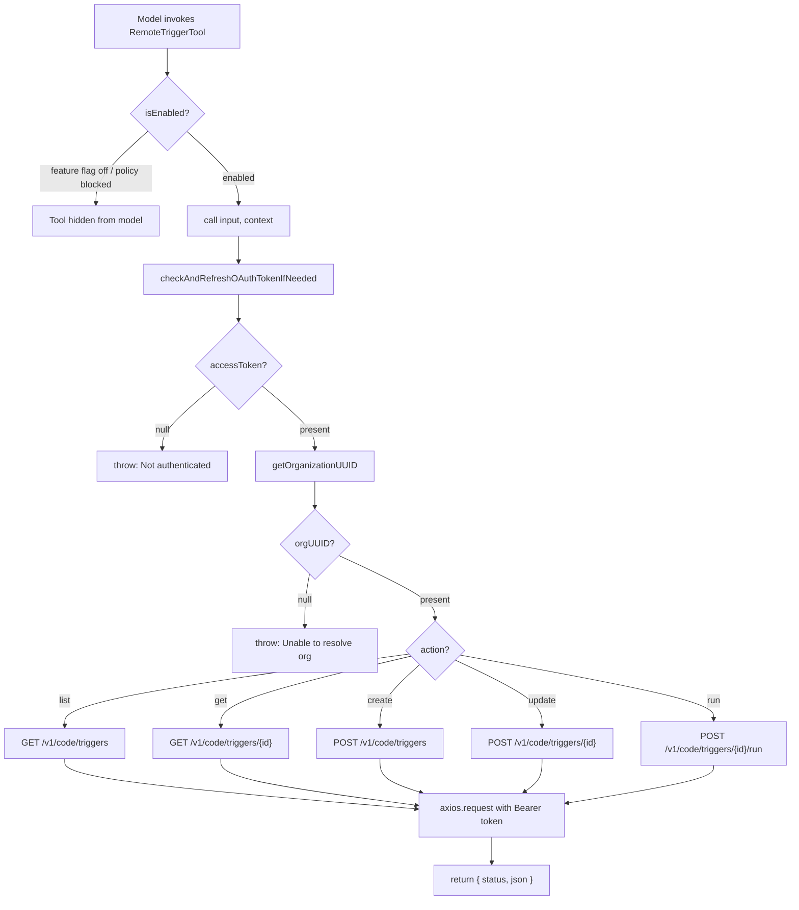
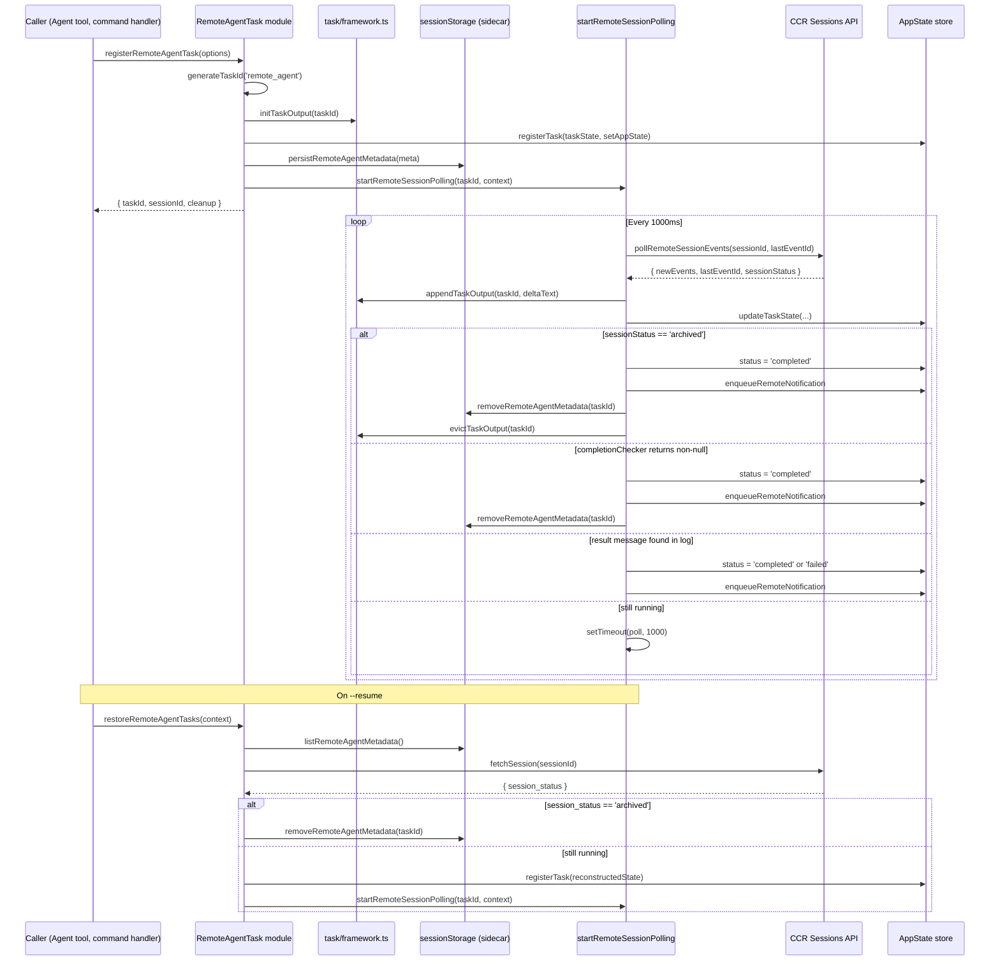

# Remote Agents and CCR Integration

## Overview

Remote agents are cc's mechanism for dispatching long-running work to Claude Code Remote (CCR), Anthropic's cloud-hosted agent runtime. Unlike in-process subagents that share the same Node.js process and context window (see Chapter 18), remote agents execute on distributed infrastructure, communicate through HTTP polling, and persist their state across client disconnects. The two primary modules --- `RemoteTriggerTool` for CRUD operations on scheduled triggers, and `RemoteAgentTask` for lifecycle management of running remote sessions --- form the bridge between the local REPL and the CCR API.

The design reflects the third tier of multi-agent orchestration described in HER Section 9: Cloud Async. Agents run on distributed infrastructure with message-passing coordination; remote triggers and webhook-based coordination replace local process management; each distributed agent has its own context, tools, and permissions. The operational complexity is substantial: polling loops must distinguish between transient idle states and genuine completion, checkpoint-restore semantics must prevent duplicate side effects, and the OAuth token must reach the API without ever being exposed to the shell.

This chapter examines how `RemoteTriggerTool` wraps the CCR triggers API with in-process authentication, how `RemoteAgentTask` orchestrates the full remote session lifecycle from creation through polling to cleanup, how `teleportToRemote` provisions a CCR session with either a GitHub source or a git bundle, and how the system handles the tricky edge cases that arise when an agent runs for hours on infrastructure you cannot directly observe.

The relationship between the two modules is one of scope and abstraction. `RemoteTriggerTool` is a thin, stateless API proxy: it translates tool invocations into HTTP requests and returns raw JSON. It knows nothing about tasks, polling, or state transitions. `RemoteAgentTask` is the lifecycle manager: it creates tasks, runs polling loops, processes events, detects completion, and manages sidecar persistence. The model can use `RemoteTriggerTool` to manage scheduled triggers (a CCR concept for recurring remote executions) independently of any running task. When the model dispatches a one-shot remote execution through a command like `/ultrareview` or the autofix flow, `RemoteAgentTask` is the orchestrator.

## Data structures and contracts

### RemoteTriggerTool input schema

The `RemoteTriggerTool` exposes a single `action` enum with five operations, each mapping to a specific CCR API endpoint. The tool is a deferred tool --- it does not appear in the model's initial tool list and must be discovered through `ToolSearch` (see Chapter 38 on skills and progressive disclosure).

```typescript
// src/tools/RemoteTriggerTool/RemoteTriggerTool.ts:L18-L31 — RemoteTriggerTool input schema
const inputSchema = lazySchema(() =>
  z.strictObject({
    action: z.enum(['list', 'get', 'create', 'update', 'run']),
    trigger_id: z
      .string()
      .regex(/^[\w-]+$/)
      .optional()
      .describe('Required for get, update, and run'),
    body: z
      .record(z.string(), z.unknown())
      .optional()
      .describe('JSON body for create and update'),
  }),
)
```

The `action` field determines the HTTP method and URL path. `list` and `get` are read-only (the `isReadOnly` method returns `true` for them at `src/tools/RemoteTriggerTool/RemoteTriggerTool.ts:L66-L68`); `create`, `update`, and `run` are mutating. The `trigger_id` is required for `get`, `update`, and `run` --- the `call()` method throws if it is missing (lines 110, 121, 128). The `body` is an arbitrary JSON record passed through to the CCR API for `create` and `update`. This passthrough design means the tool does not validate the body's internal structure against a schema; it trusts the CCR API to enforce that contract server-side.

The output schema at `src/tools/RemoteTriggerTool/RemoteTriggerTool.ts:L35-L40` captures the raw HTTP response as `{ status, json }`. The `mapToolResultToToolResultBlockParam` method at line 152 formats this as `"HTTP {status}\n{json}"`, giving the model direct access to the API's response body. The `maxResultSizeChars: 100_000` at line 49 allows large trigger lists to pass through without truncation, which is necessary for organizations with many scheduled triggers.

### RemoteTaskType and the task-type taxonomy

Remote agents are not a monolithic concept. The `REMOTE_TASK_TYPES` constant at `src/tasks/RemoteAgentTask/RemoteAgentTask.tsx:L60` defines five distinct variants:

```typescript
// src/tasks/RemoteAgentTask/RemoteAgentTask.tsx:L60-L61 — Remote task type taxonomy
const REMOTE_TASK_TYPES = ['remote-agent', 'ultraplan', 'ultrareview', 'autofix-pr', 'background-pr'] as const;
export type RemoteTaskType = (typeof REMOTE_TASK_TYPES)[number];
```

Each variant has subtly different completion semantics. The generic `remote-agent` type completes when a `result` message appears in the log. The `ultrareview` type completes when a `<remote-review>` tag is found in hook stdout or when the session reaches stable idle. The `ultraplan` type defers completion to a separate `startDetachedPoll` mechanism (the generic poller still runs to populate the log for the detail view, but the result-lookup guard at `src/tasks/RemoteAgentTask/RemoteAgentTask.tsx:L610-L611` prevents early completion). The `autofix-pr` and `background-pr` types are long-running monitors that emit a result per notification cycle, so `isLongRunning: true` skips the result-lookup entirely and relies on completion checkers instead. This taxonomy is not just a label --- it drives fundamentally different branching logic in the poller.

### RemoteAgentTaskState

The task state for a remote agent carries significantly more metadata than the base `TaskStateBase`. The `RemoteAgentTaskState` type in `src/tasks/RemoteAgentTask/RemoteAgentTask.tsx:L22-L59` captures the full lifecycle:

```typescript
// src/tasks/RemoteAgentTask/RemoteAgentTask.tsx:L22-L59 — RemoteAgentTaskState type
export type RemoteAgentTaskState = TaskStateBase & {
  type: 'remote_agent';
  remoteTaskType: RemoteTaskType;
  remoteTaskMetadata?: RemoteTaskMetadata;
  sessionId: string;
  command: string;
  title: string;
  todoList: TodoList;
  log: SDKMessage[];
  isLongRunning?: boolean;
  pollStartedAt: number;
  isRemoteReview?: boolean;
  reviewProgress?: {
    stage?: 'finding' | 'verifying' | 'synthesizing';
    bugsFound: number;
    bugsVerified: number;
    bugsRefuted: number;
  };
  isUltraplan?: boolean;
  ultraplanPhase?: Exclude<UltraplanPhase, 'running'>;
};
```

The `sessionId` is the CCR session identifier used for all API calls. The `pollStartedAt` timestamp is critical: it anchors the review timeout clock to when the local poller started watching, not when the session was created, so a `--resume` restore does not immediately time out a task spawned hours ago. The `reviewProgress` sub-object is populated only for `ultrareview` tasks, parsing heartbeat progress tags from the orchestrator's hook stdout --- the `bugsFound`, `bugsVerified`, and `bugsRefuted` counters give the user a live progress view in the task detail panel. The `log` array accumulates all SDK messages from CCR, enabling the detail view to render the remote session's transcript without making additional API calls.

### RemoteAgentMetadata and session-sidecar persistence

The `RemoteAgentMetadata` type at `src/utils/sessionStorage.ts:L305-L318` is the persistence contract that survives across `--resume` invocations:

```typescript
// src/utils/sessionStorage.ts:L305-L318 — RemoteAgentMetadata sidecar schema
export type RemoteAgentMetadata = {
  taskId: string
  remoteTaskType: string
  sessionId: string
  title: string
  command: string
  spawnedAt: number
  toolUseId?: string
  isLongRunning?: boolean
  isUltraplan?: boolean
  isRemoteReview?: boolean
  remoteTaskMetadata?: Record<string, unknown>
}
```

Only identity is persisted locally. Status is never stored in the sidecar --- it is always fetched fresh from CCR on restore. This is a deliberate design choice: the CCR session is the source of truth for whether work is still running, and a stale local status would be misleading if the local client was offline while the remote session completed or failed. The sidecar files live in `<sessionProjectDir>/<sessionId>/remote-agents/remote-agent-<taskId>.meta.json` (the path is constructed at `src/utils/sessionStorage.ts:L320-L325`), a sibling directory to the `subagents/` directory used by in-process subagents. The `writeRemoteAgentMetadata` function at line 337 creates the directory recursively and writes the JSON atomically; `readRemoteAgentMetadata` at line 346 returns `null` on missing files rather than throwing, so the restore path degrades gracefully when sidecar files are manually deleted.

### PollRemoteSessionResponse

The polling contract at `src/utils/teleport.tsx:L621-L626` defines what the poller receives from CCR on each tick:

```typescript
// src/utils/teleport.tsx:L621-L626 — PollRemoteSessionResponse
export type PollRemoteSessionResponse = {
  newEvents: SDKMessage[];
  lastEventId: string | null;
  branch?: string;
  sessionStatus?: 'idle' | 'running' | 'requires_action' | 'archived';
};
```

The `lastEventId` cursor enables delta-based polling: each call passes the previous response's cursor as `afterId`, so only new events are returned. The `sessionStatus` field maps directly from the CCR `SessionStatus` type at `src/utils/teleport/api.ts:L84` (`'requires_action' | 'running' | 'idle' | 'archived'`), and is the primary signal for detecting completion (`archived`) or transient idle states. The `branch` field is populated from a separate `fetchSession` metadata call and tracks which git branch the remote session is working on, which is important for `autofix-pr` tasks where the branch name identifies the PR.

### Session provisioning: teleportToRemote

Before a `RemoteAgentTask` can poll a CCR session, the session must be created. The `teleportToRemote` function at `src/utils/teleport.tsx:L730` handles this provisioning. It supports two source modes that determine how the remote container receives the repository:

- **GitHub mode (default)**: The backend clones from the repo's origin URL. Requires a GitHub remote and a CCR-side GitHub connection. This covers the common case where the user is working on a public or org repo with a GitHub remote.
- **Bundle mode (`useBundle: true`)**: The CLI creates a `git bundle --all`, uploads it via the Files API, and passes the `file_id` as `seed_bundle_file_id` on the session context. CCR downloads the bundle and clones from it. This works for local-only repos with no GitHub remote, and captures the caller's exact local state including uncommitted changes (via `refs/seed/stash`).

The function also injects `CLAUDE_CODE_OAUTH_TOKEN` into the session's environment variables when an explicit `environmentId` is set (line 828-830), so the remote container's hooks can authenticate with the Anthropic API. The `skipBundle` option disables the git-bundle fallback entirely for flows like autofix where CCR must push to GitHub --- a bundle-based session cannot push because the container has no GitHub credentials.

## Control flow

### Remote dispatch flow

When the model invokes the `RemoteTriggerTool`, the `call` method performs OAuth token refresh, resolves the organization UUID, constructs the appropriate HTTP request, and returns the raw API response. The full dispatch flow from tool invocation to CCR API call is shown below.



The `isEnabled()` guard at `src/tools/RemoteTriggerTool/RemoteTriggerTool.ts:L57-L62` requires both a feature flag (`tengu_surreal_dali`) and a policy check (`allow_remote_sessions`). If either fails, the tool is invisible to the model entirely --- it will not appear in the tool list and `ToolSearch` will not find it. This dual-gate pattern is common in cc for features that have both an A/B rollout component and an organizational policy component.

The `shouldDefer: true` flag at `src/tools/RemoteTriggerTool/RemoteTriggerTool.ts:L50` marks the tool as a deferred tool per the terminology registry: it is not loaded into the model's tool list at session start but is discovered on-demand via `ToolSearch`. This conserves context window space for tools the model is more likely to need on turn 1. The `isConcurrencySafe` flag at line 63 returns `true`, indicating that multiple `RemoteTriggerTool` invocations can run concurrently without interference --- a reasonable design since each HTTP request is independent and the tool has no mutable local state.

The `call()` method at `src/tools/RemoteTriggerTool/RemoteTriggerTool.ts:L78-L151` constructs the CCR API request. The base URL is assembled from `getOauthConfig().BASE_API_URL` with the path `/v1/code/triggers`, and each action maps to an HTTP method and URL suffix. The `anthropic-beta` header at line 44 is set to `ccr-triggers-2026-01-30`, a beta identifier that gates access to the triggers API. The `validateStatus: () => true` at line 142 tells axios to resolve the promise for all HTTP status codes, allowing the tool to return error responses to the model rather than throwing. The `context.abortController.signal` at line 141 propagates the tool's abort signal to the HTTP request, enabling cancellation when the user interrupts the agent's turn.

### Remote agent lifecycle

The remote agent lifecycle begins when `registerRemoteAgentTask` is called and ends when the poller detects completion, failure, or a kill signal. The following sequence diagram illustrates the full lifecycle from registration through polling to restore.



### The registration function

The `registerRemoteAgentTask` function at `src/tasks/RemoteAgentTask/RemoteAgentTask.tsx:L386-L466` is the single entry point for creating a remote agent task. It bundles task ID generation, output file initialization, state creation, registration, metadata persistence, and polling startup into one transactional unit:

```typescript
// src/tasks/RemoteAgentTask/RemoteAgentTask.tsx:L386-L466 — registerRemoteAgentTask
export function registerRemoteAgentTask(options: {
  remoteTaskType: RemoteTaskType;
  session: {
    id: string;
    title: string;
  };
  command: string;
  context: TaskContext;
  toolUseId?: string;
  isRemoteReview?: boolean;
  isUltraplan?: boolean;
  isLongRunning?: boolean;
  remoteTaskMetadata?: RemoteTaskMetadata;
}): {
  taskId: string;
  sessionId: string;
  cleanup: () => void;
} {
  const {
    remoteTaskType,
    session,
    command,
    context,
    toolUseId,
    isRemoteReview,
    isUltraplan,
    isLongRunning,
    remoteTaskMetadata
  } = options;
  const taskId = generateTaskId('remote_agent');

  void initTaskOutput(taskId);
  const taskState: RemoteAgentTaskState = {
    ...createTaskStateBase(taskId, 'remote_agent', session.title, toolUseId),
    type: 'remote_agent',
    remoteTaskType,
    status: 'running',
    sessionId: session.id,
    command,
    title: session.title,
    todoList: [],
    log: [],
    isRemoteReview,
    isUltraplan,
    isLongRunning,
    pollStartedAt: Date.now(),
    remoteTaskMetadata
  };
  registerTask(taskState, context.setAppState);

  void persistRemoteAgentMetadata({
    taskId,
    remoteTaskType,
    sessionId: session.id,
    title: session.title,
    command,
    spawnedAt: Date.now(),
    toolUseId,
    isUltraplan,
    isRemoteReview,
    isLongRunning,
    remoteTaskMetadata
  });

  const stopPolling = startRemoteSessionPolling(taskId, context);
  return {
    taskId,
    sessionId: session.id,
    cleanup: stopPolling
  };
}
```

Several design decisions are worth noting. The `void` prefix on `initTaskOutput`, `persistRemoteAgentMetadata` marks these as fire-and-forget: their failures must not block the task registration. The comment at `src/tasks/RemoteAgentTask/RemoteAgentTask.tsx:L417-L419` explains that the output file must exist before readers query it because remote agents use `appendTaskOutput()` rather than the `TaskOutput` streaming approach. The `cleanup` function returned to the caller is the poller's stop handle --- callers can kill the task and halt polling without going through `TaskStopTool`.

The `registerTask` call at line 437 inserts the task state into `AppState.tasks` via `setAppState`. The `updateTaskState` helper at `src/utils/task/framework.ts:L48-L72` is the same function used by the poller: it takes an updater function and applies it inside the `setAppState` transaction, returning the previous state reference if the updater returns the same object (a no-op optimization that prevents unnecessary re-renders across the 18 `s.tasks` subscribers in the REPL).

### The polling loop

The `startRemoteSessionPolling` function at `src/tasks/RemoteAgentTask/RemoteAgentTask.tsx:L538-L831` is the core of the remote agent's control flow. It runs a 1-second polling loop that accumulates CCR events, detects completion, and manages state transitions. The poller uses several sophisticated mechanisms to handle the ambiguity inherent in remote session status:

**Delta-based event accumulation.** Each poll call passes the previous `lastEventId` as the cursor, so only new events are fetched. Events are appended to `accumulatedLog`, and the delta text is written to the task output file via `appendTaskOutput()`. The comment at `src/tasks/RemoteAgentTask/RemoteAgentTask.tsx:L549-L551` explains that `cachedReviewContent` avoids re-scanning the full log on each tick because the review tag appears only once at the end of the run. When new events arrive, the poller extracts text from assistant content blocks and JSON-serializes system events, writing the combined delta to disk at lines 567-578.

**Stable-idle detection.** CCR sessions flip to `idle` between every tool turn, so a single idle observation is meaningless. The poller requires `STABLE_IDLE_POLLS = 5` consecutive idle polls with no log growth before believing the session is genuinely done (lines 545-546). This debounce is essential for correctness: without it, a session that takes 100 rapid tool turns would falsely complete on the first idle gap. The `consecutiveIdlePolls` counter resets to zero on any poll with log growth or non-idle status, and also resets on API errors (line 812) to prevent non-consecutive idle ticks from accumulating across transient failures.

**Completion checkers.** The `completionCheckers` map at `src/tasks/RemoteAgentTask/RemoteAgentTask.tsx:L78` allows task types to register custom completion logic that runs on every poll tick. For example, an `autofix-pr` task can check whether the PR has been merged by calling the GitHub API, independent of the CCR session status. The `registerCompletionChecker` function at line 84 is the public API for registering these checkers; they survive `--resume` via the `remoteTaskType` and `remoteTaskMetadata` fields in the sidecar. When a checker returns a non-null string, the task is completed with that string as the notification summary, and the poller exits.

**Result-lookup with type-dependent guards.** The `result` message in `accumulatedLog` is the primary completion signal for generic `remote-agent` tasks. But for `ultraplan` and `isLongRunning` tasks, `result` messages fire after every CCR turn, so looking them up would cause premature completion. At `src/tasks/RemoteAgentTask/RemoteAgentTask.tsx:L610-L611`, these task types set `result` to `undefined`, effectively disabling the result-lookup path and delegating completion to type-specific mechanisms.

**Race termination guard.** After each poll, `updateTaskState` is called with a guard that checks whether the task is still in `running` status. If `TaskStopTool` raced and set the status to `killed` while `pollRemoteSessionEvents` was in-flight, the poller bails without overwriting the status or enqueuing duplicate notifications (lines 715-718). The `raceTerminated` flag is set inside the updater and checked after the `updateTaskState` call returns.

**No-op optimization.** When there is no log growth and the status is unchanged (`running` or `starting`), the updater returns the previous state reference unchanged. The `updateTaskState` function at `src/utils/task/framework.ts:L59-L62` detects this and skips the spread, preventing 18 `s.tasks` subscribers (REPL, Spinner, PromptInput, etc.) from re-rendering on idle ticks. This is a meaningful performance optimization for long-running tasks that may poll thousands of times.

### The remote review lifecycle

The `ultrareview` task type has the most complex completion logic in the system because it must handle two fundamentally different execution modes. In **bughunter mode**, a `SessionStart` hook (`run_hunt.sh`) runs and produces no assistant turns --- only `hook_progress` and `hook_response` system events. In **prompt mode**, the remote agent takes real assistant turns and the review is wrapped in a `<remote-review>` tag. The poller must correctly handle both.

The `extractReviewFromLog` function at `src/tasks/RemoteAgentTask/RemoteAgentTask.tsx:L254-L283` implements a three-tier extraction strategy. First, it scans `hook_progress` and `hook_response` events in reverse order (bughunter path). Second, it scans assistant messages in reverse order (prompt path). Third, it concatenates all hook stdout and re-scans (split-tag recovery). The `extractReviewTagFromLog` variant at line 295 omits the third tier and the assistant-text fallback because early untagged assistant messages in prompt mode would prematurely set `cachedReviewContent`, completing the review before the actual tagged output arrives.

The `isRemoteReview` completion detection at `src/tasks/RemoteAgentTask/RemoteAgentTask.tsx:L690-L695` uses the presence of a `SessionStart` hook event as the discriminator between bughunter and prompt modes. When a `SessionStart` hook is running, only the `<remote-review>` tag or the 30-minute `REMOTE_REVIEW_TIMEOUT_MS` can complete the task. This prevents the stable-idle heuristic from falsely completing a bughunter session that is legitimately idle during hook execution.

The review progress counters (`bugsFound`, `bugsVerified`, `bugsRefuted`) are parsed from `<remote-review-progress>` heartbeat tags at `src/tasks/RemoteAgentTask/RemoteAgentTask.tsx:L640-L668`. The parsing is careful to use `lastIndexOf` rather than the first match, because hook_progress stdout is cumulative --- every echo since hook start --- so `extractTag` would return the earliest (zero-valued) occurrence. The `lastIndexOf` approach grabs the most recent counts, which reflect the current state of the bughunter's analysis.

### The kill path

When a user stops a remote agent task, `RemoteAgentTask.kill()` at `src/tasks/RemoteAgentTask/RemoteAgentTask.tsx:L821-L853` does three things: sets the task status to `killed` with `notified: true` (preventing the poller from enqueuing a duplicate notification), emits an SDK termination event, and archives the remote CCR session so it stops consuming cloud resources. The archive call is fire-and-forget: `archiveRemoteSession` at `src/utils/teleport.tsx:L1200` POSTs to `/v1/sessions/{id}/archive` and accepts both 200 (archived) and 409 (already archived) as success.

```typescript
// src/tasks/RemoteAgentTask/RemoteAgentTask.tsx:L821-L853 — RemoteAgentTask.kill()
export const RemoteAgentTask: Task = {
  name: 'RemoteAgentTask',
  type: 'remote_agent',
  async kill(taskId, setAppState) {
    let toolUseId: string | undefined;
    let description: string | undefined;
    let sessionId: string | undefined;
    let killed = false;
    updateTaskState<RemoteAgentTaskState>(taskId, setAppState, task => {
      if (task.status !== 'running') {
        return task;
      }
      toolUseId = task.toolUseId;
      description = task.description;
      sessionId = task.sessionId;
      killed = true;
      return {
        ...task,
        status: 'killed',
        notified: true,
        endTime: Date.now()
      };
    });

    if (killed) {
      emitTaskTerminatedSdk(taskId, 'stopped', {
        toolUseId,
        summary: description
      });
      if (sessionId) {
        void archiveRemoteSession(sessionId).catch(e => logForDebugging(`RemoteAgentTask archive failed: ${String(e)}`));
      }
    }
    void evictTaskOutput(taskId);
    void removeRemoteAgentMetadata(taskId);
  }
};
```

The `notified: true` flag is set atomically with the status change, which prevents the poller's `markTaskNotified` check at `src/tasks/RemoteAgentTask/RemoteAgentTask.tsx:L189-L201` from enqueuing a completion notification for a task the user explicitly killed. The `killed` boolean is captured via closure from inside the `updateTaskState` updater and checked afterward to conditionally emit the SDK event and archive the session. This pattern avoids the need for a separate `getAppState()` read after the update.

### Restore on session resume

When the user runs `cc --resume`, the `restoreRemoteAgentTasks` function at `src/tasks/RemoteAgentTask/RemoteAgentTask.tsx:L477-L532` reconnects to any remote sessions that were running when the previous session ended. It scans the sidecar directory for persisted metadata, calls `fetchSession` for each entry to get the live CCR status, and reconstructs the task state:

```typescript
// src/tasks/RemoteAgentTask/RemoteAgentTask.tsx:L484-L532 — restoreRemoteAgentTasksImpl
async function restoreRemoteAgentTasksImpl(context: TaskContext): Promise<void> {
  const persisted = await listRemoteAgentMetadata();
  if (persisted.length === 0) return;
  for (const meta of persisted) {
    let remoteStatus: string;
    try {
      const session = await fetchSession(meta.sessionId);
      remoteStatus = session.session_status;
    } catch (e) {
      if (e instanceof Error && e.message.startsWith('Session not found:')) {
        logForDebugging(`restoreRemoteAgentTasks: dropping ${meta.taskId} (404: ${String(e)})`);
        void removeRemoteAgentMetadata(meta.taskId);
      } else {
        logForDebugging(`restoreRemoteAgentTasks: skipping ${meta.taskId} (recoverable: ${String(e)})`);
      }
      continue;
    }
    if (remoteStatus === 'archived') {
      void removeRemoteAgentMetadata(meta.taskId);
      continue;
    }
    const taskState: RemoteAgentTaskState = {
      ...createTaskStateBase(meta.taskId, 'remote_agent', meta.title, meta.toolUseId),
      type: 'remote_agent',
      remoteTaskType: isRemoteTaskType(meta.remoteTaskType) ? meta.remoteTaskType : 'remote-agent',
      status: 'running',
      sessionId: meta.sessionId,
      command: meta.command,
      title: meta.title,
      todoList: [],
      log: [],
      isRemoteReview: meta.isRemoteReview,
      isUltraplan: meta.isUltraplan,
      isLongRunning: meta.isLongRunning,
      startTime: meta.spawnedAt,
      pollStartedAt: Date.now(),
      remoteTaskMetadata: meta.remoteTaskMetadata as RemoteTaskMetadata | undefined
    };
    registerTask(taskState, context.setAppState);
    void initTaskOutput(meta.taskId);
    startRemoteSessionPolling(meta.taskId, context);
  }
}
```

The `pollStartedAt: Date.now()` on line 525 is the timestamp safeguard discussed in the checkpoint-restore section below. The `startTime: meta.spawnedAt` preserves the original spawn time for the task panel's sort order. The `isRemoteTaskType` guard at line 514 handles sidecar files from older versions that may have unrecognized task types, defaulting to the generic `remote-agent`. Note that the `log` array starts empty on restore --- the full log is not re-fetched from CCR because the events API supports cursor-based pagination and the poller will accumulate the log incrementally from the current cursor position.

## Edge cases and failure modes

### Transient idle vs. genuine completion

The most subtle edge case in the remote polling loop is distinguishing between a session that is temporarily idle (between tool turns) and one that has genuinely completed. CCR sessions flip to `idle` between every tool turn, so a single idle observation means nothing. The `STABLE_IDLE_POLLS = 5` constant requires five consecutive idle polls with no log growth. But even this is not sufficient for bughunter-mode reviews: the session is "idle" the entire time the `SessionStart` hook runs, because the hook does not produce assistant turns. The code at `src/tasks/RemoteAgentTask/RemoteAgentTask.tsx:L680-L695` uses the presence of a `SessionStart` hook event as the discriminator: bughunter mode always has one, prompt mode never does. When a `SessionStart` hook is running, only the `<remote-review>` tag or the 30-minute timeout can complete the task.

The stable-idle check also requires `hasAnyOutput` (line 678) --- at least one assistant message or, for remote-review tasks, at least one hook_progress/hook_response event. Without this guard, a session that has not yet produced any output (perhaps the container is still starting up) would falsely accumulate idle polls and complete before the agent has written anything.

### Checkpoint-restore and side-effect safety

HER Section 6.16 identifies a critical threat model for LLM agent checkpoint-restore: Action Replay (replaying completed actions) and Authority Resurrection (reusing expired credentials). The cc remote agent system is specifically designed to avoid these pitfalls. On `--resume`, the `restoreRemoteAgentTasks` function at `src/tasks/RemoteAgentTask/RemoteAgentTask.tsx:L477-L532` never replays actions --- it only reconstructs the task state and restarts polling. The CCR session is the source of truth; the local client is a passive observer. Credentials are refreshed via `checkAndRefreshOAuthTokenIfNeeded()` before each API call, and the OAuth token is never persisted in the sidecar metadata.

The `pollStartedAt` timestamp is the key safeguard against timeout-based false failures. Without it, restoring a task that was spawned 25 minutes ago would immediately trigger the 30-minute review timeout, even though the remote session might still be actively running. By anchoring the timeout clock to when the local poller started watching, the system gives restored tasks a full 30 minutes of poll time. This aligns with HER Section 12.6's guidance on idempotency: the system records that a timeout check is relative to the local observer, not the remote session's creation, ensuring deterministic behavior across restore cycles.

### 404 vs. recoverable errors on restore

When `restoreRemoteAgentTasks` calls `fetchSession` for each sidecar entry, it must distinguish between a 404 (the CCR session has been garbage-collected and is permanently gone) and other errors like 401 (the user's OAuth token has expired but the session is still running). At `src/tasks/RemoteAgentTask/RemoteAgentTask.tsx:L497-L505`, only a 404 triggers metadata removal; all other errors are logged and skipped, allowing the restore to succeed on a subsequent attempt after the user runs `/login`. The comment at line 494 explains the reasoning: `fetchSession` throws a plain `Error` for all 4xx status codes because `validateStatus` treats non-500 responses as success, so the code matches the 404 message text rather than using a status code check.

### Split-tag recovery in hook stdout

Large JSON payloads from the bughunter hook can flush across two pipe-buffer writes, splitting a `<remote-review>` tag across two events. The `extractReviewFromLog` function at `src/tasks/RemoteAgentTask/RemoteAgentTask.tsx:L254-L283` handles this with a three-tier strategy: per-message scan (fast path), hook-stdout concatenation (split-tag recovery), and full assistant-text concatenation (last resort). The `extractReviewTagFromLog` variant at line 295 omits the last-resort fallback because early untagged assistant messages in prompt mode would prematurely set `cachedReviewContent`, completing the review before the actual tagged output arrives.

The comment at `src/tasks/RemoteAgentTask/RemoteAgentTask.tsx:L274-L276` explains the split-tag scenario in detail: a large JSON payload can flush across two events if the pipe buffer fills mid-write. The per-message scan above misses a tag split across events, but concatenating all hook stdout and re-scanning catches the merged tag. This is a pragmatic defense against a real operating-system-level edge case that would be easy to overlook in a simpler implementation.

### Notification deduplication

The `markTaskNotified` function at `src/tasks/RemoteAgentTask/RemoteAgentTask.tsx:L189-L201` atomically checks and sets a `notified` flag inside `updateTaskState`. This prevents duplicate notifications when the poller and `kill()` race: if `kill()` sets `notified: true` while the poller is in-flight, the poller's subsequent `markTaskNotified` call returns `false` and the notification is suppressed. The same pattern applies to the various notification enqueue functions (`enqueueRemoteNotification`, `enqueueRemoteReviewNotification`, `enqueueUltraplanFailureNotification`), all of which call `markTaskNotified` as their first action.

The `enqueueRemoteNotification` function at `src/tasks/RemoteAgentTask/RemoteAgentTask.tsx:L166-L183` constructs an XML-structured notification message with `<task-notification>`, `<task-id>`, `<task-type>`, `<output-file>`, `<status>`, and `<summary>` tags. This XML format is consumed by the `enqueuePendingNotification` function at line 179, which adds the message to the pending notification queue with `mode: 'task-notification'`. The model receives this notification on its next turn, allowing it to inform the user that the remote task has completed.

### API error handling in the poller

The poller's catch block at `src/tasks/RemoteAgentTask/RemoteAgentTask.tsx:L809-L831` handles two concerns. First, it resets `consecutiveIdlePolls` to zero so that an API error between two idle ticks does not allow non-consecutive idle polls to accumulate toward the stable-idle threshold. Second, it checks the review timeout even when the API call fails --- without this, persistent API errors would skip the timeout check and poll forever. The best-effort inner try/catch at lines 819-829 guards against `getAppState` itself failing, which would leave the poller in an unrecoverable state.

## Where cc diverges from the published pattern

**In-process authentication instead of shell-exposed tokens.** The `RemoteTriggerTool` prompt at `src/tools/RemoteTriggerTool/prompt.ts:L6-L15` explicitly instructs the model to use the tool instead of `curl` because the OAuth token is added automatically in-process and never exposed. This is a security-first design: the token never reaches the shell history, process arguments, or environment variables visible to other tools. In a typical API wrapper, the token would be injected as an environment variable or command-line argument; cc treats the token as a runtime secret that stays inside the Node.js process. The `RemoteTriggerTool` prompt reinforces this: "Auth is handled in-process --- the token never reaches the shell" (`src/tools/RemoteTriggerTool/prompt.ts:L4`).

**Sidecar persistence with status fetched fresh.** The `RemoteAgentMetadata` sidecar at `src/utils/sessionStorage.ts:L305-L318` persists only identity (task ID, session ID, type, command), never status. This diverges from the common pattern of caching remote state locally and invalidating on a schedule. The rationale is that CCR session status can change at any moment (the remote agent can complete, fail, or be archived), and a stale local cache would produce incorrect UI state. The trade-off is an extra API call on every `--resume`, but `fetchSession` is a lightweight GET that typically completes in under 100ms.

**Stable-idle debounce instead of heartbeats.** Rather than implementing an explicit heartbeat protocol where the remote agent periodically signals "still alive," cc infers liveness from the CCR session event stream. The `STABLE_IDLE_POLLS` mechanism is a heuristic, not a protocol guarantee. This works because CCR's event model makes idle a transient state between tool turns; a session that is truly done stays idle permanently, while a running session oscillates. The trade-off is a 5-second detection latency (5 polls at 1 second each) for genuine completion, which is acceptable for tasks that run for minutes or hours.

**Completion checkers as a plugin system.** The `completionCheckers` map at `src/tasks/RemoteAgentTask/RemoteAgentTask.tsx:L78` is an unusual pattern: rather than hardcoding completion logic per task type, it allows external modules to register checkers at runtime. This means the `RemoteAgentTask` module does not need to import GitHub API clients, PR merge status checks, or any other task-type-specific logic. The trade-off is that completion checkers must be re-registered on every session start (they are not persisted in the sidecar), but this is a natural consequence of the "identity-only persistence" design.

**Dual source-mode provisioning.** The `teleportToRemote` function supports both GitHub and bundle modes for provisioning the remote container's repository. This is unusual compared to typical CI/CD systems that assume a GitHub-only workflow. The bundle mode at `src/utils/teleport.tsx:L838-L856` is specifically designed for the 54% of CLI sessions that have a `.git/` directory but no GitHub remote, allowing them to use CCR without first pushing to GitHub. The `useBundle` option captures the caller's exact local state including uncommitted changes, which a GitHub-based clone cannot provide.

## Developer takeaways for building a long-running agent

Building a long-running agent that dispatches work to remote infrastructure requires careful attention to three concerns that do not arise in local, synchronous execution. First, the polling loop must handle the fundamental ambiguity of remote state: idle does not mean done, and running does not mean making progress. The stable-idle debounce pattern --- requiring N consecutive idle observations with no event growth --- is a robust heuristic that handles both prompt-mode sessions (where idle means the agent stopped writing) and hook-mode sessions (where idle is the normal state during a long-running hook). The key insight is that you must also account for execution modes where idle is the steady state: the `SessionStart` hook discriminator prevents bughunter sessions from being falsely completed by the stable-idle heuristic. Second, checkpoint-restore safety demands that you never replay side effects. Persist only identity, fetch state fresh from the source of truth, and anchor timeout clocks to the local observer's start time rather than the remote session's creation time. The `pollStartedAt` pattern is essential: without it, restoring a long-running task would immediately trigger timeouts based on the remote session's age, not the local client's observation window. Third, notification deduplication in a system with concurrent state transitions (poller vs. kill vs. restore) requires atomic flag checks inside the same state-update transaction that changes the status. A simple boolean check-then-set outside the transaction is racy and will produce duplicate notifications under load. The `markTaskNotified` pattern, where the flag is set atomically with the status change inside `updateTaskState`, is the correct approach.
