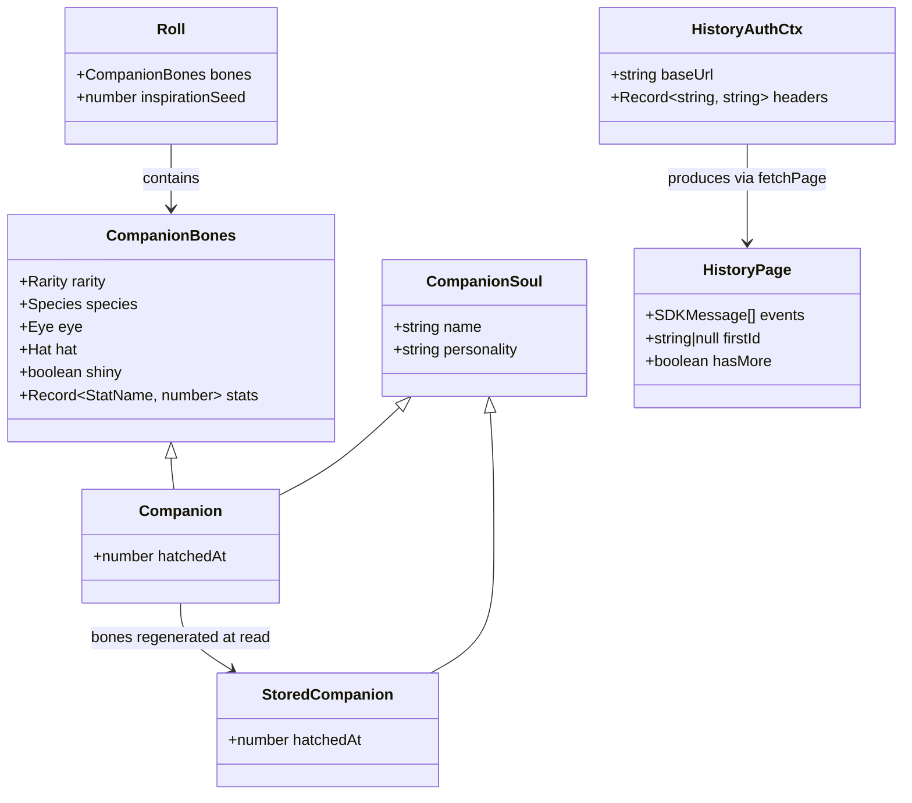
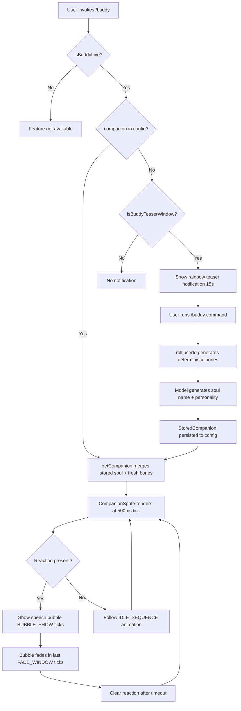

# Chapter 49: KAIROS Assistant, Buddy, and Experimental Layers

## Overview

The cc codebase contains several subsystems that extend the core agent loop into companion and ambient layers. The session history module (`src/assistant/sessionHistory.ts`) provides paginated access to remote session events, enabling cross-session continuity for long-running work. The buddy system (`src/buddy/`) implements a deterministic companion creature that lives beside the user's prompt input, complete with sprite rendering, rarity mechanics, stat rolling, and a gated feature lifecycle that progresses from teaser to full availability. Together these layers form cc's approach to progressive disclosure: the agent is always present, the companion is opt-in and feature-flagged, and the history API is called only when needed. This chapter examines how each layer is structured, how the buddy lifecycle gates experimental features from general availability, how the sprite animation system works, and how session history provides the temporal backbone for long-running work.

## Data structures and contracts

The buddy system's type hierarchy begins with `CompanionBones` — the deterministic, hash-derived parts of a companion that are regenerated on every read rather than persisted:

```typescript
// src/buddy/types.ts:L100-L108 — CompanionBones deterministic type
export type CompanionBones = {
  rarity: Rarity
  species: Species
  eye: Eye
  hat: Hat
  shiny: boolean
  stats: Record<StatName, number>
}
```

The `CompanionBones` type intentionally omits the model-generated personality fields. Bones are derived from `hash(userId)` at read time, so species renames or array reordering cannot break stored companions, and users cannot edit their config to fake a legendary rarity. The `CompanionSoul` type holds the persisted personality data (`name` and `personality` fields at `src/buddy/types.ts:L111-L114`), and the full `Companion` type intersects both with a `hatchedAt` timestamp (`src/buddy/types.ts:L116-L119`). The `StoredCompanion` type — what actually lives in config — contains only `CompanionSoul` plus `hatchedAt`, because bones are never serialized (`src/buddy/types.ts:L124`). This separation of deterministic bones from persisted soul is the central architectural decision of the companion system.

Rarity weights define the probability distribution for companion generation:

```typescript
// src/buddy/types.ts:L126-L132 — Rarity probability weights
export const RARITY_WEIGHTS = {
  common: 60,
  uncommon: 25,
  rare: 10,
  epic: 4,
  legendary: 1,
} as const satisfies Record<Rarity, number>
```

These weights sum to 100, making them directly interpretable as percentages. A legendary companion has a 1% chance per roll. The `RARITY_FLOOR` map in `src/buddy/companion.ts:L53-L59` sets minimum stat values per rarity tier — common companions have a floor of 5, while legendary companions start at 50 — ensuring that higher-rarity companions have proportionally stronger stats. The rarity system also determines cosmetic properties: common companions never receive hats (`src/buddy/companion.ts:L97`), and the `RARITY_COLORS` map at `src/buddy/types.ts:L142-L148` assigns each rarity tier a theme color for the sprite border and name display.

The species enumeration uses a defensive encoding pattern. Rather than declaring string literals directly, each species is constructed at runtime via `String.fromCharCode`:

```typescript
// src/buddy/types.ts:L17-L18 — Species constructed via charCode to avoid canary collision
export const duck = c(0x64,0x75,0x63,0x6b) as 'duck'
export const goose = c(0x67, 0x6f, 0x6f, 0x73, 0x65) as 'goose'
```

The `as` casts are type-position only and are erased before bundling. The reason for this indirection is that one species name collides with a model-codename canary in the project's excluded-strings check. By constructing the value at runtime, the literal never appears in the bundled output, keeping the canary check armed while the runtime value resolves correctly (`src/buddy/types.ts:L10-L13`). The `SPECIES` array at `src/buddy/types.ts:L54-L73` lists all 18 species, and the `EYES`, `HATS`, and `STAT_NAMES` arrays define the remaining companion dimensions.

The stat system defines five named stats — `DEBUGGING`, `PATIENCE`, `CHAOS`, `WISDOM`, and `SNARK` — at `src/buddy/types.ts:L91-L98`. Each stat is a number between 1 and 100. The `RARITY_STARS` map at `src/buddy/types.ts:L134-L140` provides a visual rarity indicator using star characters, and `RARITY_COLORS` maps each rarity to an Ink theme color key for terminal rendering.

The session history module defines its core paging contract:

```typescript
// src/assistant/sessionHistory.ts:L9-L16 — HistoryPage paging contract
export type HistoryPage = {
  /** Chronological order within the page. */
  events: SDKMessage[]
  /** Oldest event ID in this page → before_id cursor for next-older page. */
  firstId: string | null
  /** true = older events exist. */
  hasMore: boolean
}
```

The `HistoryPage` type implements a cursor-based pagination model. The `firstId` field serves as the `before_id` cursor for fetching the next older page, while `hasMore` signals whether additional history exists beyond the current page boundary. This design avoids offset-based pagination drift when new events arrive during traversal. The page size is set to 100 events via `HISTORY_PAGE_SIZE` at `src/assistant/sessionHistory.ts:L7`.

The authentication context type bundles the base URL and OAuth headers for reuse across multiple page fetches:

```typescript
// src/assistant/sessionHistory.ts:L25-L28 — HistoryAuthCtx for request reuse
export type HistoryAuthCtx = {
  baseUrl: string
  headers: Record<string, string>
}
```

The `HistoryAuthCtx` is created once by `createHistoryAuthCtx` at `src/assistant/sessionHistory.ts:L31-L43` and then passed to all subsequent page fetches, avoiding repeated OAuth token refreshes during a single history traversal.



The class diagram shows how `Companion` intersects `CompanionBones` and `CompanionSoul`, while `StoredCompanion` contains only the soul and timestamp. The `Roll` type bundles the generated bones with an `inspirationSeed` used by the model to generate the companion's personality. The `HistoryAuthCtx` produces `HistoryPage` instances through the shared `fetchPage` helper.

## Control flow

### Companion generation and deterministic rolling

The companion generation flow begins when a user first invokes `/buddy`. The `roll` function in `src/buddy/companion.ts:L107-L113` takes a `userId` string and produces a deterministic `Roll` result by seeding a Mulberry32 PRNG with the hash of `userId + SALT`:

```typescript
// src/buddy/companion.ts:L107-L113 — Deterministic companion roll with cache
export function roll(userId: string): Roll {
  const key = userId + SALT
  if (rollCache?.key === key) return rollCache.value
  const value = rollFrom(mulberry32(hashString(key)))
  rollCache = { key, value }
  return value
}
```

The `rollCache` memo is critical for performance — this function is called from three hot paths: the 500ms sprite tick, per-keystroke prompt input rendering, and per-turn observer callbacks (`src/buddy/companion.ts:L104-L105`). Without the cache, the hashing and PRNG computation would repeat on every render cycle. The `SALT` constant (`'friend-2026-401'` at `src/buddy/companion.ts:L84`) ensures the roll output is domain-specific and cannot be predicted from the userId alone. Changing the salt invalidates all existing rolls, which is the intended mechanism for forcing companion re-generation after rarity weight adjustments.

The hash function itself has two code paths. When running under Bun, it uses `Bun.hash(s)` cast to a 32-bit integer for speed (`src/buddy/companion.ts:L28-L29`). When running under Node.js, it falls back to a FNV-1a implementation that XORs each character code and multiplies by the FNV prime 16777619 (`src/buddy/companion.ts:L31-L36`). Both paths produce a 32-bit unsigned integer suitable for seeding the PRNG.

The `rollFrom` function orchestrates the generation sequence: first `rollRarity` draws from the weighted distribution, then `pick` selects species, eye, and hat from their respective arrays. The `rollRarity` function at `src/buddy/companion.ts:L43-L51` iterates through rarity tiers in order, subtracting each tier's weight from the roll until the remainder goes negative. Common companions never receive hats (`src/buddy/companion.ts:L97`). The `shiny` flag has a 1% probability independent of rarity (`src/buddy/companion.ts:L98`). The `rollStats` function assigns one peak stat and one dump stat, with the remaining stats scattered around the rarity floor (`src/buddy/companion.ts:L62-L82`).

The `getCompanion` function at `src/buddy/companion.ts:L127-L133` merges stored soul data with freshly generated bones. This design means bones are never serialized to config, so species renames and array edits cannot break stored companions, and editing `config.companion` cannot fake a rarity:

```typescript
// src/buddy/companion.ts:L127-L133 — Merge stored soul with fresh bones
export function getCompanion(): Companion | undefined {
  const stored = getGlobalConfig().companion
  if (!stored) return undefined
  const { bones } = roll(companionUserId())
  // bones last so stale bones fields in old-format configs get overridden
  return { ...stored, ...bones }
}
```

The spread order matters: `{ ...stored, ...bones }` ensures that any stale bone fields left over from old-format configs are overridden by the freshly generated values. The `companionUserId` helper at `src/buddy/companion.ts:L119-L122` resolves the user identity from OAuth account UUID, falling back to the local `userID`, and finally to `'anon'` for unauthenticated sessions.

### Sprite rendering and animation

The sprite renderer in `src/buddy/sprites.ts:L454-L469` takes a `CompanionBones` object and a frame index, producing an array of string lines that form the ASCII-art body:

```typescript
// src/buddy/sprites.ts:L454-L469 — Sprite rendering with hat and blank-line optimization
export function renderSprite(bones: CompanionBones, frame = 0): string[] {
  const frames = BODIES[bones.species]
  const body = frames[frame % frames.length]!.map(line =>
    line.replaceAll('{E}', bones.eye),
  )
  const lines = [...body]
  // Only replace with hat if line 0 is empty (some fidget frames use it for smoke etc)
  if (bones.hat !== 'none' && !lines[0]!.trim()) {
    lines[0] = HAT_LINES[bones.hat]
  }
  // Drop blank hat slot — wastes a row in the Card and ambient sprite when
  // there's no hat and the frame isn't using it for smoke/antenna/etc.
  if (!lines[0]!.trim() && frames.every(f => !f[0]!.trim())) lines.shift()
  return lines
}
```

Each species has three animation frames stored in the `BODIES` lookup (`src/buddy/sprites.ts:L26-L441`). The `{E}` placeholder in the sprite templates is replaced with the companion's `eye` character at render time via `replaceAll`. Hat rendering is conditional on whether line 0 of the current frame is empty — some fidget frames use line 0 for smoke, antenna, or sparkle effects (see the dragon's third frame at `src/buddy/sprites.ts:L135-L141` which places `~` characters on line 0). The blank-line optimization at `src/buddy/sprites.ts:L467` drops line 0 entirely when it is blank across all frames, saving a row of vertical space in the terminal. The `spriteFrameCount` helper at `src/buddy/sprites.ts:L471-L473` exposes the number of frames per species for the animation tick logic.

The `renderFace` function at `src/buddy/sprites.ts:L475-L514` produces a compact single-line face string for narrow terminal mode. Each species has a unique face pattern — for example, the cat face is `={eye}ω{eye}=` while the dragon face is `<{eye}~{eye}>`. The snail face uses a different structure where the eye is on one side of the shell: `{eye}(@)` (`src/buddy/sprites.ts:L249`).

The `CompanionSprite` component at `src/buddy/CompanionSprite.tsx:L176-L290` drives the animation loop with a 500ms tick interval (`TICK_MS` at `src/buddy/CompanionSprite.tsx:L16`). The `IDLE_SEQUENCE` array at `src/buddy/CompanionSprite.tsx:L23` maps tick offsets to frame indices: `[0, 0, 0, 0, 1, 0, 0, 0, -1, 0, 0, 2, 0, 0, 0]`. A value of `-1` indicates a blink on frame 0, where the eye character is replaced with `-` via a `replaceAll` call (`src/buddy/CompanionSprite.tsx:L258`). When the companion is reacting or being petted, the sprite cycles through all fidget frames rapidly — one frame per tick — instead of following the idle sequence.

The speech bubble lifecycle is managed by two constants: `BUBBLE_SHOW` (20 ticks, approximately 10 seconds at 500ms) and `FADE_WINDOW` (6 ticks, approximately 3 seconds) at `src/buddy/CompanionSprite.tsx:L17-L18`. During the last `FADE_WINDOW` ticks, the bubble border color changes to `"inactive"` and the text dims, giving the user a visual signal that the bubble is about to disappear. The `PET_BURST_MS` constant (2500ms) at `src/buddy/CompanionSprite.tsx:L19` controls how long heart characters float above the sprite after the `/buddy pet` command. The `PET_HEARTS` array at `src/buddy/CompanionSprite.tsx:L27` contains five ascending heart patterns that animate upward over the sprite during the pet burst.

The `companionReservedColumns` function at `src/buddy/CompanionSprite.tsx:L167-L175` calculates how many terminal columns the sprite and bubble consume, so the prompt input can shrink accordingly. In fullscreen mode, the bubble floats over scrollback and does not reserve additional columns; in non-fullscreen mode, the bubble sits inline beside the sprite and needs `BUBBLE_WIDTH` (36) extra columns. Terminals narrower than `MIN_COLS_FOR_FULL_SPRITE` (100 columns) reserve zero columns — the REPL component stacks the one-liner face on its own row instead.

### Session history pagination

The session history module uses a two-function pagination strategy. `fetchLatestEvents` (`src/assistant/sessionHistory.ts:L73-L78`) fetches the most recent events using the `anchor_to_latest` parameter, while `fetchOlderEvents` (`src/assistant/sessionHistory.ts:L81-L87`) traverses backward using a `before_id` cursor. Both delegate to the shared `fetchPage` helper, which handles HTTP errors gracefully by returning `null` rather than throwing:

```typescript
// src/assistant/sessionHistory.ts:L45-L67 — Shared pagination fetch helper
async function fetchPage(
  ctx: HistoryAuthCtx,
  params: Record<string, string | number | boolean>,
  label: string,
): Promise<HistoryPage | null> {
  const resp = await axios
    .get<SessionEventsResponse>(ctx.baseUrl, {
      headers: ctx.headers,
      params,
      timeout: 15000,
      validateStatus: () => true,
    })
    .catch(() => null)
  if (!resp || resp.status !== 200) {
    logForDebugging(`[${label}] HTTP ${resp?.status ?? 'error'}`)
    return null
  }
  return {
    events: Array.isArray(resp.data.data) ? resp.data.data : [],
    firstId: resp.data.first_id,
    hasMore: resp.data.has_more,
  }
}
```

The `validateStatus: () => true` configuration combined with the explicit status check means non-200 responses are logged via `logForDebugging` and returned as `null`, keeping the caller's control flow simple. The `.catch(() => null)` at `src/assistant/sessionHistory.ts:L56` converts network errors (DNS failures, timeouts, connection resets) into the same `null` return value, creating a uniform error model. The `Array.isArray` guard on `resp.data.data` at `src/assistant/sessionHistory.ts:L63` defends against malformed API responses where the data field might be `undefined` or a non-array value.

The `createHistoryAuthCtx` function at `src/assistant/sessionHistory.ts:L31-L43` prepares the authentication context by calling `prepareApiRequest()` to obtain an OAuth access token and organization UUID, then constructing the session events endpoint URL from the OAuth configuration's `BASE_API_URL`. The headers include the standard OAuth authorization header, an `anthropic-beta` header with the value `'ccr-byoc-2025-07-29'` (`src/assistant/sessionHistory.ts:L39`), and an `x-organization-uuid` header. The beta header signals the server that the client supports the session events API, which is behind a feature flag on the server side. By creating the auth context once and reusing it across all page fetches, the module avoids repeated token refreshes during a single history traversal.

### Companion system prompt integration

The companion's presence is communicated to the model through the `companionIntroText` function at `src/buddy/prompt.ts:L7-L12`. This function generates a system prompt attachment that describes the companion as a "separate watcher" and instructs the model to stay out of the way when the user addresses the companion by name. The `getCompanionIntroAttachment` function at `src/buddy/prompt.ts:L15-L36` checks three conditions before injecting the attachment: the `BUDDY` feature flag must be enabled, a companion must exist and not be muted, and the intro must not have been announced before for this companion (checked by scanning existing messages for a matching `companion_intro` attachment type). This deduplication prevents the intro from being injected on every turn, which would waste context budget on redundant instructions.



The buddy lifecycle flowchart shows the progression from feature-gated availability through companion generation, persistence, and the render loop. The teaser window check at `src/buddy/useBuddyNotification.tsx:L12-L16` uses local time rather than UTC, creating a 24-hour rolling wave across timezones that avoids a single load spike on the soul-generation endpoint. After April 7, 2026, the teaser window closes but the `/buddy` command remains live forever after — the `isBuddyLive` function at `src/buddy/useBuddyNotification.tsx:L17-L21` returns true for any date in April 2026 or later.

## Edge cases and failure modes

**Stale bone fields in old-format configs.** The `{ ...stored, ...bones }` spread order in `getCompanion` at `src/buddy/companion.ts:L132` exists specifically because older config formats may have persisted bone fields. When a config is read from disk and contains `species: "old_name"`, the freshly generated bones override it. Without this spread order, a species rename in the codebase would leave the stored companion pointing to a nonexistent species key, causing a runtime crash in the `BODIES` lookup at `src/buddy/sprites.ts:L455`.

**Species name collision with canary strings.** The `types.ts` file uses `String.fromCharCode` to construct species names at runtime (`src/buddy/types.ts:L14-L52`). This is not obfuscation for its own sake — one species name collides with a model-codename canary in the project's excluded-strings check. The canary check greps the build output for forbidden strings, and if a species name were declared as a string literal, it would trigger the check and fail the build. By constructing the value at runtime, the literal never appears in the bundled output, keeping the canary check armed while the runtime value works correctly. The `as` casts are type-position only and are erased before bundling, so they do not reintroduce the literal.

**Narrow terminal fallback.** When the terminal width is below `MIN_COLS_FOR_FULL_SPRITE` (100 columns), the `CompanionSprite` component collapses from a multi-line sprite to a single-line face rendered by `renderFace` (`src/buddy/sprites.ts:L475-L514`). Speech bubble text is truncated to `NARROW_QUIP_CAP` (24 characters) with an ellipsis suffix, because the narrow layout has no room for a full bubble. The quip replaces the companion name in the label, so the user still sees a reaction even on small terminals.

**Session history fetch failures.** The `fetchPage` helper returns `null` on any failure — network errors, non-200 status codes, or malformed response bodies. Callers must handle `null` by either retrying or gracefully degrading. The 15-second timeout at `src/assistant/sessionHistory.ts:L54` prevents indefinite hangs on slow or unresponsive API endpoints. The `logForDebugging` call at `src/assistant/sessionHistory.ts:L59` records the failure for post-mortem analysis without surfacing it to the user, consistent with cc's philosophy of silent degradation for non-critical features.

**Animation frame consistency.** The sprite renderer drops line 0 when it is blank across all frames of a species (`src/buddy/sprites.ts:L467`). This optimization avoids wasting a row in the card and ambient sprite display, but it depends on the invariant that all frames of a given species agree on whether line 0 is used. If frames were inconsistent — some using line 0 for effects and others not — the sprite would oscillate in height between ticks, causing visual jitter. The current sprites are designed to satisfy this invariant, but any new species must be reviewed for frame-zero consistency.

**Companion muting and the notification guard.** The `companionMuted` config flag at `src/buddy/companion.ts:L129` and `src/buddy/CompanionSprite.tsx:L217` causes both the sprite and the intro attachment to be suppressed without removing the companion data from config. This is distinct from not having a companion at all — the data persists, but the visual presence is hidden. The `useBuddyNotification` hook at `src/buddy/useBuddyNotification.tsx:L43-L78` also checks `companionMuted` implicitly by checking `config.companion` first (a muted companion still exists in config, so the teaser notification is not shown for users who have already hatched a companion).

## Where cc diverges from the published pattern

HER Section 9 describes Progressive Disclosure as a mechanism for gradually revealing capabilities to the user. The buddy system implements this literally across three dimensions: temporal (the `/buddy` command is gated behind `isBuddyLive()`), spatial (the teaser notification appears only during a specific calendar window), and environmental (the companion's full sprite with speech bubble only renders on terminals wider than 100 columns). Each layer of the feature is progressively more visible and interactive. The narrow-terminal face render is the most minimal disclosure; the full sprite with hat and bubble is the most expansive.

HER Section 3.4 discusses Lifecycle Hooks as deterministic event handlers that fire at defined points. The buddy system uses a different kind of lifecycle — not hook-based but feature-flag-based. The `feature('BUDDY')` check at `src/buddy/useBuddyNotification.tsx:L53` and `src/buddy/CompanionSprite.tsx:L215` acts as a compile-time/launch-time gate that prevents any buddy code from executing when the feature is disabled. This is more restrictive than a hook, which can observe and modify but cannot prevent execution. The feature flag pattern is appropriate for experimental features where the entire subsystem should be absent rather than merely suppressed, because hooks can still observe events even when the feature is nominally disabled.

The tiered escalation model from HER Section 11.2 (automated, agent self-correction, human front-line, human expert) has an analog in the companion's reaction system. The companion observes agent behavior but its interventions are purely cosmetic — speech bubbles and sprite animations. This is a deliberate design choice: the companion is explicitly described as "a separate watcher" in the system prompt (`src/buddy/prompt.ts:L10`), and the model is instructed not to narrate what the companion might say. The companion cannot escalate or intervene in the agent's control flow, which avoids the Ouroboros risk identified in HER Section 18.2 where an LLM evaluator can hallucinate approval. By restricting the companion to observation and cosmetic commentary, cc ensures that the companion's presence cannot corrupt the agent's decision-making.

The session history module diverges from the HER's checkpoint-restore pattern (Section 6.16) by providing read-only traversal rather than state restoration. The `HistoryPage` cursor model lets the agent observe past events but cannot rewind or branch from them. This is consistent with cc's session model (see Chapter 17 on session persistence), where each session is an append-only JSONL stream and resumption replays from the head. The decision to make history read-only avoids the primary obstacle to correct restoration identified in the HER: side effects such as filesystem changes and API calls cannot be undone by rewinding the event stream.

## Developer takeaways for building a long-running agent

Deterministic generation from user identity is a powerful pattern for companion and personalization features. By deriving all visual properties from `hash(userId + SALT)` rather than storing them, the system eliminates an entire class of consistency bugs: no migrations when species arrays change, no config tampering to gain advantages, and no stale references. The trade-off is that the generation algorithm is fixed at deploy time — changing rarity weights or stat floors requires bumping the salt to force re-rolls for existing users. Cache the deterministic result aggressively, because these lookups happen on every render tick and the companion's `roll` function is invoked from three independent hot paths. When designing a pagination system for remote event history, use cursor-based traversal with `before_id` rather than offset-based pagination, because long-running sessions can accumulate thousands of events and offset-based queries drift when new events arrive between pages. Create the authentication context once and share it across all fetches to avoid redundant OAuth token refreshes. For experimental features, use feature flags checked at every public entry point rather than a single centralized gate, because different code paths may reach the same function from different call sites. The buddy teaser window's use of local time for a rolling timezone wave is a pattern worth adopting for any feature launch that depends on an external service — spreading the adoption curve across 24 hours is gentler on backend capacity than a single UTC-midnight spike.
