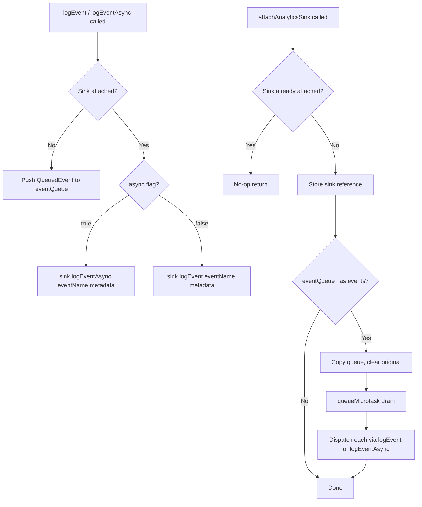
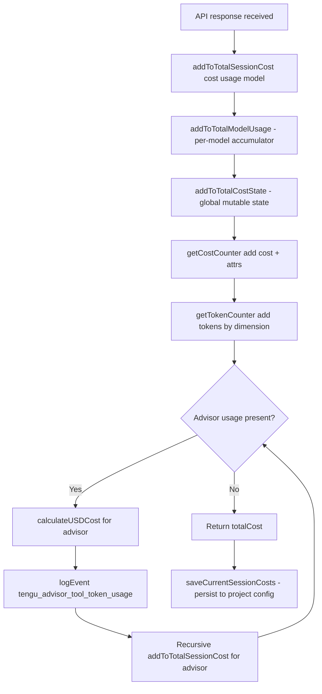
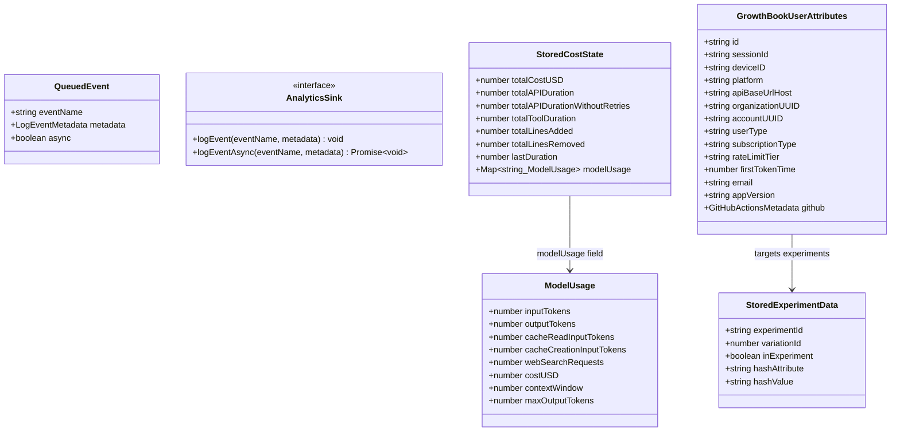

# Analytics, Cost Tracking, and GrowthBook

## Overview

A long-running agent that cannot observe itself is flying blind. cc addresses this through three tightly integrated subsystems: an analytics pipeline that queues and drains structured events to backend sinks, a cost tracker that accumulates per-model token usage and dollar spend across an entire session, and a GrowthBook integration that provides feature flags and dynamic configuration with multiple cache tiers and refresh strategies. Together they form cc's self-observation layer — the mechanism by which the harness monitors its own resource consumption, experiments with behavior changes, and feeds operational telemetry back to the team.

The analytics module at `src/services/analytics/index.ts` is deliberately dependency-free to avoid import cycles. Events are buffered in an in-process queue until a sink is attached during application startup, then drained asynchronously via `queueMicrotask`. The cost tracker at `src/cost-tracker.ts` wraps global mutable state (accessor functions from `src/bootstrap/state.ts`) and computes per-model USD costs from Anthropic API usage objects, persisting snapshots to project-level configuration for session resume. The GrowthBook client at `src/services/analytics/growthbook.ts` manages remote-evaluated feature flags with a three-tier read hierarchy: environment variable overrides, in-memory payload cache, and disk cache from `~/.claude.json`. It supports periodic refresh, auth-change reinitialization, and multiple read-path semantics ranging from instant stale reads to blocking-on-init freshness guarantees.

This chapter traces how an API response flows from the model through cost accounting into analytics events, how GrowthBook feature values propagate from server to disk to callers, and where the design departs from conventional observability patterns to meet the constraints of a CLI agent.

## Data structures and contracts

The analytics module defines a minimal contract between event producers and the sink backend. The `AnalyticsSink` interface and the `QueuedEvent` type form the boundary:

```typescript
// src/services/analytics/index.ts:L63-L78
type QueuedEvent = {
  eventName: string
  metadata: LogEventMetadata
  async: boolean
}

/**
 * Sink interface for the analytics backend
 */
export type AnalyticsSink = {
  logEvent: (eventName: string, metadata: LogEventMetadata) => void
  logEventAsync: (
    eventName: string,
    metadata: LogEventMetadata,
  ) => Promise<void>
}
```

The `QueuedEvent` type captures events emitted before the sink is attached. The `async` flag determines whether `logEvent` or `logEventAsync` is used during drain, letting producers choose synchronous fire-and-forget or awaitable semantics without coupling to the sink implementation. The `AnalyticsSink` interface requires both methods, and the actual routing to Datadog and first-party event logging happens inside the concrete sink, not in the public API.

The `LogEventMetadata` type at `src/services/analytics/index.ts:L61` is deliberately restrictive — only `boolean | number | undefined` values are allowed. This prevents accidental logging of code snippets or file paths. The marker type `AnalyticsMetadata_I_VERIFIED_THIS_IS_NOT_CODE_OR_FILEPATHS` at `src/services/analytics/index.ts:L19` enforces this at the type level: string metadata must be cast through this `never`-returning type alias, which forces the author to explicitly attest that the value contains no sensitive data. The type resolves to `never`, meaning it cannot be constructed at runtime — it exists purely as a type-level annotation. When a developer writes `someString as AnalyticsMetadata_I_VERIFIED_THIS_IS_NOT_CODE_OR_FILEPATHS`, they are making a claim that the string is a safe identifier (like a model name or event name) rather than user-provided content (like a file path or code snippet). This pattern is grep-friendly in code review: a search for the marker type name surfaces every location where a string enters the analytics pipeline.

A second marker type, `AnalyticsMetadata_I_VERIFIED_THIS_IS_PII_TAGGED` at `src/services/analytics/index.ts:L33`, gates values destined for PII-tagged BigQuery columns that have privileged access controls. Unlike the no-code-or-filepaths marker, this one attests that a value does contain personally identifiable information (like an email address) and must be routed through a protected pipeline. The `stripProtoFields` function at `src/services/analytics/index.ts:L45-L58` strips all `_PROTO_*` keys from a payload before it reaches non-1P sinks, ensuring PII never leaks to general-access storage. The convention is that payload keys prefixed with `_PROTO_` signal that their values should be hoisted into the proto field by the first-party exporter and stripped from every other sink.

```typescript
// src/services/analytics/index.ts:L45-L58
export function stripProtoFields<V>(
  metadata: Record<string, V>,
): Record<string, V> {
  let result: Record<string, V> | undefined
  for (const key in metadata) {
    if (key.startsWith('_PROTO_')) {
      if (result === undefined) {
        result = { ...metadata }
      }
      delete result[key]
    }
  }
  return result ?? metadata
}
```

The `stripProtoFields` implementation is copy-on-write: it only clones the object if at least one `_PROTO_` key is found, returning the original reference otherwise. This avoids unnecessary allocations on the common path where no PII-tagged fields are present. A single call in `sink.ts` guards all non-1P sinks, so no per-sink filtering is needed.

The cost tracker's primary persisted type is `StoredCostState`:

```typescript
// src/cost-tracker.ts:L71-L80
type StoredCostState = {
  totalCostUSD: number
  totalAPIDuration: number
  totalAPIDurationWithoutRetries: number
  totalToolDuration: number
  totalLinesAdded: number
  totalLinesRemoved: number
  lastDuration: number | undefined
  modelUsage: { [modelName: string]: ModelUsage } | undefined
}
```

This type is the serialization boundary between in-memory cost state (managed by `src/bootstrap/state.ts`) and project-level configuration (managed by `src/utils/config.ts`). The `modelUsage` field maps canonical model names to per-model `ModelUsage` objects that track input tokens, output tokens, cache read/write tokens, web search requests, cost in USD, context window size, and max output tokens. When a session is resumed, `restoreCostStateForSession` reads this structure back and calls `setCostStateForRestore` to rehydrate the global state. The `lastDuration` field is `number | undefined` rather than `number` because duration is only meaningful after at least one API call has completed — on a fresh session, there is no duration to report.

GrowthBook's user-attributes contract defines what targeting dimensions the server can use:

```typescript
// src/services/analytics/growthbook.ts:L32-L47
export type GrowthBookUserAttributes = {
  id: string
  sessionId: string
  deviceID: string
  platform: 'win32' | 'darwin' | 'linux'
  apiBaseUrlHost?: string
  organizationUUID?: string
  accountUUID?: string
  userType?: string
  subscriptionType?: string
  rateLimitTier?: string
  firstTokenTime?: number
  email?: string
  appVersion?: string
  github?: GitHubActionsMetadata
}
```

These attributes are assembled from `getUserForGrowthBook()` and supplemental sources like `getGlobalConfig().oauthAccount?.emailAddress`. The `apiBaseUrlHost` field captures enterprise-proxy hostnames so that organizations using custom API proxies can be targeted even when they lack organization or account UUIDs — a pragmatic accommodation for deployments where `apiKeyHelper` auth means `isAnthropicAuthEnabled()` returns false and standard identity attributes are absent. The `id` and `deviceID` fields are identical (`id: user.deviceId` at `src/services/analytics/growthbook.ts:L468`), reflecting GrowthBook's convention of using `id` as the primary hashing attribute while `deviceID` is retained for backward compatibility during the Statsig-to-GrowthBook migration.

The `MalformedFeatureDefinition` type at `src/services/analytics/growthbook.ts:L53-L57` captures the API response format discrepancy: the GrowthBook API returns pre-evaluated values in a `value` field, but the SDK expects `defaultValue`. This type is a local workaround, not a shared contract — it exists only inside `processRemoteEvalPayload` to normalize the server response before passing it to the SDK.

## Control flow

### Analytics event pipeline

Events flow through a two-phase pipeline: queue-then-drain. Before the sink is attached, every call to `logEvent` or `logEventAsync` pushes a `QueuedEvent` onto the `eventQueue` array. Once `attachAnalyticsSink` is called, the sink reference is stored, and any queued events are copied, the queue is cleared, and the copy is drained via `queueMicrotask`. This design ensures that early-startup code can emit analytics without knowing whether the sink is ready.

```typescript
// src/services/analytics/index.ts:L95-L123
export function attachAnalyticsSink(newSink: AnalyticsSink): void {
  if (sink !== null) {
    return
  }
  sink = newSink

  if (eventQueue.length > 0) {
    const queuedEvents = [...eventQueue]
    eventQueue.length = 0

    if (process.env.USER_TYPE === 'ant') {
      sink.logEvent('analytics_sink_attached', {
        queued_event_count: queuedEvents.length,
      })
    }

    queueMicrotask(() => {
      for (const event of queuedEvents) {
        if (event.async) {
          void sink!.logEventAsync(event.eventName, event.metadata)
        } else {
          sink!.logEvent(event.eventName, event.metadata)
        }
      }
    })
  }
}
```

The `attachAnalyticsSink` function is idempotent — if a sink is already attached, the call is a no-op. This allows both the `preAction` hook (for subcommands) and `setup()` (for the default command) to call it without coordination. The `queueMicrotask` drain avoids blocking the startup path: the events are dispatched on the next microtask, not synchronously in the `attachAnalyticsSink` call frame. For internal users (`USER_TYPE === 'ant'`), a diagnostic event `analytics_sink_attached` is logged with the queue size to help debug initialization timing issues.

The `logEvent` function at `src/services/analytics/index.ts:L133-L144` is the synchronous entry point. If the sink is null, it pushes to the queue; otherwise, it delegates to `sink.logEvent`. The `logEventAsync` function at `src/services/analytics/index.ts:L154-L164` behaves identically but uses the async variant of the sink method. Both functions share the same metadata type restriction and queueing behavior, differing only in whether the caller can await completion. The `_resetForTesting` function at `src/services/analytics/index.ts:L170-L173` clears both the sink reference and the queue, ensuring test isolation.



### Cost accumulation and session persistence

The central cost-entry function is `addToTotalSessionCost` at `src/cost-tracker.ts:L278-L323`. Every API response from the model flows through this function. It accepts the USD cost, the Anthropic `Usage` object, and the model name, then performs three operations: updates the per-model usage accumulator, updates the global cost state, and records the cost and token counts to the analytics sink via counter objects.

```typescript
// src/cost-tracker.ts:L278-L323
export function addToTotalSessionCost(
  cost: number,
  usage: Usage,
  model: string,
): number {
  const modelUsage = addToTotalModelUsage(cost, usage, model)
  addToTotalCostState(cost, modelUsage, model)

  const attrs =
    isFastModeEnabled() && usage.speed === 'fast'
      ? { model, speed: 'fast' }
      : { model }

  getCostCounter()?.add(cost, attrs)
  getTokenCounter()?.add(usage.input_tokens, { ...attrs, type: 'input' })
  getTokenCounter()?.add(usage.output_tokens, { ...attrs, type: 'output' })
  getTokenCounter()?.add(usage.cache_read_input_tokens ?? 0, {
    ...attrs,
    type: 'cacheRead',
  })
  getTokenCounter()?.add(usage.cache_creation_input_tokens ?? 0, {
    ...attrs,
    type: 'cacheCreation',
  })

  let totalCost = cost
  for (const advisorUsage of getAdvisorUsage(usage)) {
    const advisorCost = calculateUSDCost(advisorUsage.model, advisorUsage)
    logEvent('tengu_advisor_tool_token_usage', {
      advisor_model:
        advisorUsage.model as AnalyticsMetadata_I_VERIFIED_THIS_IS_NOT_CODE_OR_FILEPATHS,
      input_tokens: advisorUsage.input_tokens,
      output_tokens: advisorUsage.output_tokens,
      cache_read_input_tokens: advisorUsage.cache_read_input_tokens ?? 0,
      cache_creation_input_tokens:
        advisorUsage.cache_creation_input_tokens ?? 0,
      cost_usd_micros: Math.round(advisorCost * 1_000_000),
    })
    totalCost += addToTotalSessionCost(
      advisorCost,
      advisorUsage,
      advisorUsage.model,
    )
  }
  return totalCost
}
```

The function records four token dimensions — `input`, `output`, `cacheRead`, and `cacheCreation` — through the `getTokenCounter()` analytics counter, tagged with model name and (for fast-mode responses) a speed attribute. The `getCostCounter()?.add(cost, attrs)` call feeds a separate counter for cost-rate monitoring. The optional chaining on `getCostCounter()` and `getTokenCounter()` at `src/cost-tracker.ts:L291-L301` is significant: these counters may be null if the analytics sink has not yet been attached, which can happen during early startup. The cost state is updated unconditionally via `addToTotalCostState`, so the accounting is correct even when the counters are not yet wired.

The recursive tail at `src/cost-tracker.ts:L304-L321` processes advisor usage — when the API response includes token consumption from an advisor model (a secondary model invocation embedded in the primary response), each advisor's cost is calculated, logged as a separate `tengu_advisor_tool_token_usage` analytics event, and accumulated recursively. The `cost_usd_micros` field uses microdollars (`Math.round(advisorCost * 1_000_000)`) to avoid floating-point rounding in the analytics pipeline, where integer arithmetic is preferred for aggregation accuracy. The `advisor_model` field is cast through the `AnalyticsMetadata_I_VERIFIED_THIS_IS_NOT_CODE_OR_FILEPATHS` marker type, attesting that a model name is a safe identifier, not user-provided content.

The helper function `addToTotalModelUsage` at `src/cost-tracker.ts:L250-L276` maintains the per-model accumulator. It retrieves the existing `ModelUsage` for a model name (or creates a zero-initialized one), adds the current response's token counts, computes the cost, and updates the context window and max output token metadata. The context window and max output token values are set from `getContextWindowForModel` and `getModelMaxOutputTokens` on every call rather than only at creation, which ensures they stay current if the model configuration changes mid-session.

Session persistence uses `saveCurrentSessionCosts` at `src/cost-tracker.ts:L143-L175`, which writes a snapshot of all cost counters and per-model usage into the project configuration file via `saveCurrentProjectConfig`. The snapshot includes every dimension tracked by `StoredCostState`, plus additional fields like `lastTotalInputTokens`, `lastTotalOutputTokens`, `lastTotalCacheCreationInputTokens`, `lastTotalCacheReadInputTokens`, and `lastTotalWebSearchRequests` that are not part of the `StoredCostState` type but are stored for dashboard display. The `lastSessionId` field ties the snapshot to a specific session; on resume, `restoreCostStateForSession` at `src/cost-tracker.ts:L130-L137` reads the stored state and verifies the session ID matches — if it does not match (the user started a new session), the stored costs are discarded and the new session begins at zero.

The `formatTotalCost` function at `src/cost-tracker.ts:L228-L244` assembles the human-readable cost summary displayed at session end. It calls `formatModelUsage` at `src/cost-tracker.ts:L181-L226`, which groups usage by canonical model name (via `getCanonicalName`), accumulates token counts across model variants, and formats each model's usage with cost. The grouping by canonical name is important because the Anthropic API uses fully qualified model identifiers (like `claude-sonnet-4-20250514`) while users expect to see short names (like `claude-sonnet-4`). The `getCanonicalName` function maps from the full identifier to the short display name, and the accumulator in `formatModelUsage` at `src/cost-tracker.ts:L188-L210` merges token counts from all variants of the same model family into a single line item. The `formatCost` helper at `src/cost-tracker.ts:L177-L179` switches precision based on magnitude: costs above $0.5 are displayed with two decimal places, while smaller costs use four decimal places. This dual-precision approach avoids showing `$0.00` for small-but-nonzero costs while keeping larger numbers readable. The `hasUnknownModelCost` check at `src/cost-tracker.ts:L231-L233` appends a warning when the session used a model whose pricing is not in the cost table, alerting the user that the displayed total may be inaccurate. The `formatDuration` and `formatNumber` imports at `src/cost-tracker.ts:L45-L46` handle the non-cost dimensions: API duration (wall and without retries), tool duration, and line-change counts.

The `saveCurrentSessionCosts` function also accepts an optional `fpsMetrics` parameter of type `FpsMetrics` at `src/cost-tracker.ts:L143`. When provided, it records the average frames-per-second and the 1st-percentile FPS (a measure of worst-case rendering performance) into the project configuration. This is a diagnostic metric rather than a cost metric, but it rides the same persistence path because the project configuration is the natural store for session-scoped data that survives across process restarts. The FPS metrics are displayed on the session-end summary alongside cost and duration data.



### GrowthBook initialization and the three-tier read hierarchy

GrowthBook's read path has three tiers of data freshness, each with different latency and staleness characteristics. The highest-priority tier is environment variable overrides, set via `CLAUDE_INTERNAL_FC_OVERRIDES` and only active when `USER_TYPE` is `ant`. These are deterministic and bypass both network and disk, making them suitable for eval harnesses that need to test specific flag configurations. The `getEnvOverrides` function at `src/services/analytics/growthbook.ts:L170-L192` parses the JSON string lazily and memoizes the result, so repeated calls do not re-parse.

The second tier is the in-memory `remoteEvalFeatureValues` map, populated by `processRemoteEvalPayload` at `src/services/analytics/growthbook.ts:L327-L394` after each successful `client.init()` or `client.refreshFeatures()` call. This map caches the pre-evaluated feature values from the server's remote-eval response, working around a GrowthBook SDK bug where `evalFeature()` tries to re-evaluate rules locally and ignores the server's pre-computed answer. The map is cleared before each rebuild at `src/services/analytics/growthbook.ts:L344`, so features removed between refreshes do not leave stale ghost entries that would short-circuit `getFeatureValueInternal`.

The third tier is the disk cache in `~/.claude.json`, populated by `syncRemoteEvalToDisk` at `src/services/analytics/growthbook.ts:L407-L417`. This cache survives process restarts and is the fallback when the in-memory map is empty — which happens at startup before init completes, or after `resetGrowthBook` clears the map during auth changes. The disk write is wholesale replace, not merge: features deleted server-side are dropped from disk on the next successful payload. The `isEqual` guard at `src/services/analytics/growthbook.ts:L410` skips the write when the cached values are identical, avoiding unnecessary config-file churn.

The function `getFeatureValue_CACHED_MAY_BE_STALE` at `src/services/analytics/growthbook.ts:L734-L775` implements this hierarchy. It checks env overrides first, then config overrides, then the in-memory map, then the disk cache. If none of these have a value, it returns the caller-provided default. This function is synchronous and never blocks, making it suitable for startup-critical paths and React render loops.

```typescript
// src/services/analytics/growthbook.ts:L734-L775
export function getFeatureValue_CACHED_MAY_BE_STALE<T>(
  feature: string,
  defaultValue: T,
): T {
  const overrides = getEnvOverrides()
  if (overrides && feature in overrides) {
    return overrides[feature] as T
  }
  const configOverrides = getConfigOverrides()
  if (configOverrides && feature in configOverrides) {
    return configOverrides[feature] as T
  }

  if (!isGrowthBookEnabled()) {
    return defaultValue
  }

  if (experimentDataByFeature.has(feature)) {
    logExposureForFeature(feature)
  } else {
    pendingExposures.add(feature)
  }

  if (remoteEvalFeatureValues.has(feature)) {
    return remoteEvalFeatureValues.get(feature) as T
  }

  try {
    const cached = getGlobalConfig().cachedGrowthBookFeatures?.[feature]
    return cached !== undefined ? (cached as T) : defaultValue
  } catch {
    return defaultValue
  }
}
```

The exposure-logging logic at `src/services/analytics/growthbook.ts:L753-L757` is noteworthy: if the experiment data for a feature is available in `experimentDataByFeature` (meaning the payload has been processed), the exposure is logged immediately. Otherwise, the feature name is added to `pendingExposures`, and exposures are drained after the next successful init or refresh. This ensures experiment-assignment data is always logged, even when the feature is accessed before GrowthBook finishes initializing.

### GrowthBook initialization, refresh, and auth-change reinitialization

The GrowthBook client is created lazily via a memoized factory at `src/services/analytics/growthbook.ts:L490-L617`. The factory checks whether GrowthBook is enabled (it depends on 1P event logging), assembles user attributes, resolves auth headers, and constructs a `GrowthBook` instance with `remoteEval: true`. The `cacheKeyAttributes` field is set to `['id', 'organizationUUID']`, which means the SDK re-fetches features when the user ID or organization changes — this supports multi-tenant scenarios where a user switches between organizations.

The init flow handles a subtle trust-gate: if workspace trust has not been established yet, `getAuthHeaders()` may execute `apiKeyHelper` commands before the trust dialog completes. The factory checks `checkHasTrustDialogAccepted()`, `getSessionTrustAccepted()`, and `getIsNonInteractiveSession()` before requesting auth headers. If trust is not established, the client is created without auth headers and returns a resolved promise, relying on disk-cached values. When auth becomes available later, `initializeGrowthBook` at `src/services/analytics/growthbook.ts:L622-L664` detects this and calls `resetGrowthBook()` followed by `getGrowthBookClient()` to recreate the client with fresh headers.

The init callback at `src/services/analytics/growthbook.ts:L556-L607` includes two guard checks against a replaced client. The first guard at `src/services/analytics/growthbook.ts:L558-L565` runs before `processRemoteEvalPayload` and handles the case where auth-change reinitialization replaced the client while the original `client.init()` was in flight. The second guard at `src/services/analytics/growthbook.ts:L578` runs after `processRemoteEvalPayload` (which yields at the `setPayload` await) and covers the case where the replacement happened during that yield. This double-guard pattern is necessary because the init callback contains an async boundary, and the client reference can change at any await point.

Periodic refresh is set up after initialization completes. For internal users (`ant`), the interval is 20 minutes; for external users, it is 6 hours. The `GROWTHBOOK_REFRESH_INTERVAL_MS` constant at `src/services/analytics/growthbook.ts:L1013-L1016` defines these intervals. The `refreshInterval.unref?.()` call at `src/services/analytics/growthbook.ts:L1101` ensures the timer does not prevent the process from exiting naturally — the timer is a background concern, not a lifecycle gate. The `refreshGrowthBookFeatures` function at `src/services/analytics/growthbook.ts:L1027-L1078` performs a light refresh — it calls `growthBookClient.refreshFeatures()` and then `processRemoteEvalPayload` to rebuild the in-memory cache and `syncRemoteEvalToDisk` to persist to disk. Unlike `refreshGrowthBookAfterAuthChange`, this does not destroy and recreate the client, because auth headers have not changed.

Auth-change reinitialization at `src/services/analytics/growthbook.ts:L943-L982` is necessary because GrowthBook's `apiHostRequestHeaders` cannot be updated after client creation. When a user logs in or out, `refreshGrowthBookAfterAuthChange` calls `resetGrowthBook()` to destroy the old client, emits a refresh notification so subscribers re-read from the now-cleared state, and then reinitializes. The reinit promise is tracked in `reinitializingPromise` so that `checkSecurityRestrictionGate` can await it before reading values — this prevents a race where a security gate reads stale values from the previous auth context. The `.catch` before `.finally` at `src/services/analytics/growthbook.ts:L969-L975` ensures that even if `initializeGrowthBook` rejects (which can happen if its sync helpers throw), the `reinitializingPromise` is always cleared. Without this ordering, a rejection from `initializeGrowthBook` would propagate through `.finally`, and the `reinitializingPromise` would remain set, permanently blocking future `checkSecurityRestrictionGate` calls.

The `onGrowthBookRefresh` function at `src/services/analytics/growthbook.ts:L139-L157` provides a subscription mechanism for code that bakes feature values into long-lived objects at construction time and needs to rebuild when values change. The signal-based implementation (using `createSignal` from `src/utils/signal.ts`) notifies all subscribers on every successful payload load and on every `setGrowthBookConfigOverride` call. Subscribers are expected to do their own change detection using `isEqual` against their last-seen configuration, rather than assuming every notification means their specific values changed. The catch-up mechanism at `src/services/analytics/growthbook.ts:L144-L156` fires a newly registered listener immediately if `remoteEvalFeatureValues` is already populated, handling the race where GrowthBook's network response lands before the REPL's `useEffect` commits — on external builds with fast networks and MCP-heavy configs, init can finish in approximately 100ms while REPL mount takes approximately 600ms.



## Edge cases and failure modes

**Empty or malformed GrowthBook payload.** The `processRemoteEvalPayload` function at `src/services/analytics/growthbook.ts:L338-L340` guards against empty feature objects. A transient server bug that returns `{ features: {} }` is treated as a failure — the function returns `false`, which prevents `syncRemoteEvalToDisk` from wholesale-writing an empty object to disk. Without this guard, a single malformed response from the GrowthBook server would clear every cached feature for every process sharing `~/.claude.json`, causing a total flag blackout across all cc instances on that machine. The comment at `src/services/analytics/growthbook.ts:L335-L337` explains that an empty object is truthy in JavaScript, so the `Object.keys(payload.features).length === 0` check is essential — without it, `{features: {}}` would pass the truthiness guard, clear the maps, return `true`, and trigger a disk write of `{}`.

**API "value" vs SDK "defaultValue" mismatch.** The GrowthBook API returns pre-evaluated feature values in a `value` field, but the SDK expects `defaultValue`. The transformation at `src/services/analytics/growthbook.ts:L349-L355` normalizes this by copying `value` to `defaultValue` when the latter is absent. This workaround is marked with a TODO for removal once the API is fixed, but until then, omitting it would cause every remote-evaluated feature to return its fallback default rather than the server-assigned value. The transformation runs on every feature in the payload before `setPayload` is called, so the SDK sees a normalized structure.

**Init-timeout poisoning.** Because `syncRemoteEvalToDisk` is called only inside the `hadFeatures` gate — only after a successful `processRemoteEvalPayload` — an init timeout (the `client.init({ timeout: 5000 })` call at `src/services/analytics/growthbook.ts:L555` hits the 5-second deadline) never reaches the disk-write path. The `.catch` at `src/services/analytics/growthbook.ts:L603-L607` swallows the error, and the disk cache retains whatever values the previous process wrote. This is structurally safe: a network partition cannot poison the disk cache with empty data.

**Advisor recursion depth.** The `addToTotalSessionCost` function recurses for each advisor usage in the API response. In practice, advisor depth is bounded by the API response structure, but the recursive pattern means a pathological response with deeply nested advisor usage could stack-overflow. The current code has no depth guard.

**Stale-`true` is safe, stale-`false` is not.** The `checkGate_CACHED_OR_BLOCKING` function at `src/services/analytics/growthbook.ts:L904-L935` implements an asymmetric trust model. If the disk cache says `true`, it returns immediately (fast path). If the cache says `false` or is missing, it blocks on GrowthBook init to fetch the fresh server value (slow path). This asymmetry exists because a stale `true` (user was entitled when the cache was written but has since lost entitlement) is acceptable — the server enforces the real gate on the actual operation. But a stale `false` (user gained entitlement since the cache was written) would unfairly block access to a feature the user is paying for. This pattern is documented as "fallback-to-blocking semantics" and is used for user-invoked features like `/remote-control`.

**Cost-state session mismatch.** The `getStoredSessionCosts` function at `src/cost-tracker.ts:L87-L123` compares `projectConfig.lastSessionId` against the requested session ID. If they do not match, it returns `undefined` rather than stale data from a previous session. This prevents a resumed session from inheriting costs from a different session that happened to use the same project directory. The trade-off is that if a session ID changes unexpectedly (for instance, due to a crash and restart that generates a new ID), the accumulated costs from the previous session are lost.

**Exposure deduplication in hot paths.** The `loggedExposures` set at `src/services/analytics/growthbook.ts:L89` prevents duplicate exposure events within a session. This matters because `getFeatureValue_CACHED_MAY_BE_STALE` is called from React render loops (for example, `isAutoMemoryEnabled` in render paths). Without deduplication, each render would fire an exposure event, flooding the analytics pipeline. The set is cleared only by `resetGrowthBook`, which runs during auth changes.

**PII leakage via `_PROTO_` keys.** A future code path that forgets to call `stripProtoFields` before sending a payload to a non-1P sink would leak PII-tagged values to general-access storage. The architecture mitigates this by centralizing the strip in `sink.ts`, but the protection is procedural rather than type-enforced. The copy-on-write implementation in `stripProtoFields` means the common path (no `_PROTO_` keys) incurs zero allocation overhead, but it also means that mutating the returned object after the call could corrupt the original if no `_PROTO_` keys were present (since the original reference is returned, not a copy).

**Config override race with setGrowthBookConfigOverride.** The `setGrowthBookConfigOverride` function at `src/services/analytics/growthbook.ts:L245-L271` calls `saveGlobalConfig` and then `refreshed.emit()`. If two overrides are set in rapid succession, the second `saveGlobalConfig` call reads stale state (before the first write has been flushed) and may lose the first override. The `isEqual` guard at `src/services/analytics/growthbook.ts:L262` mitigates this for no-op writes but does not prevent lost updates when two different features are overridden concurrently.

**Replaced-client guard during refresh.** The `refreshGrowthBookFeatures` function at `src/services/analytics/growthbook.ts:L1043-L1050` includes a guard that checks whether the client was replaced during the in-flight `refreshFeatures()` call. If `refreshGrowthBookAfterAuthChange` ran while the refresh was in progress, the old client's response is discarded. This mirrors the init-callback guard and prevents stale payloads from overwriting fresh data that the new client already loaded.

**Disk cache survives across processes but not across auth changes.** The `syncRemoteEvalToDisk` function at `src/services/analytics/growthbook.ts:L407-L417` writes the complete `remoteEvalFeatureValues` map to `~/.claude.json`. This means multiple cc processes on the same machine share the same disk cache. When process A completes init and writes fresh values, process B (which may have started earlier and is still running) will read those values from disk on its next `getFeatureValue_CACHED_MAY_BE_STALE` call. This cross-process sharing is intentional — it means a freshly started cc instance gets the latest feature values even if its own init has not completed. However, `resetGrowthBook` clears the in-memory map without clearing the disk cache, so a process that has just reinitialized after an auth change will fall through to the disk cache on its next read — and the disk cache may contain values from the previous auth context. The `refreshed.emit()` call in `refreshGrowthBookAfterAuthChange` at `src/services/analytics/growthbook.ts:L959` notifies subscribers to re-read, and the reinit that follows will overwrite the disk cache with the new auth context's values.

**Security gates check Statsig cache before GrowthBook cache.** The `checkSecurityRestrictionGate` function at `src/services/analytics/growthbook.ts:L851-L889` checks `cachedStatsigGates` before `cachedGrowthBookFeatures`. This ordering is deliberate: for security-critical gates, the Statsig cache is considered a stronger signal because it was written by the previous Statsig SDK integration, which had a different trust model. If the Statsig cache says a gate is enabled, cc honors it regardless of what the GrowthBook cache says. This provides a safety net during the Statsig-to-GrowthBook migration — if GrowthBook returns an incorrect `false` for a security gate, the Statsig cache (if present) can override it.

## Where cc diverges from the published pattern

**HER Section 8 on Observation Masking** recommends replacing verbose tool outputs with compressed summaries to achieve up to 52% cost reduction. cc implements observation masking at the compaction layer (see Chapter 28 on the compaction hierarchy) but does not integrate masking into the analytics pipeline itself. The `LogEventMetadata` type at `src/services/analytics/index.ts:L61` restricts values to `boolean | number | undefined` — there are no string payloads to mask. This is a design choice, not an oversight: by prohibiting strings from event metadata entirely, cc avoids the observation-masking problem for analytics. The cost of this restriction is that analytics events cannot carry categorical data (like model names or feature identifiers) without routing them through the `AnalyticsMetadata_I_VERIFIED_THIS_IS_NOT_CODE_OR_FILEPATHS` marker type, which forces an explicit safety attestation at each call site.

**HER Section 5 on Back-Pressure** recommends per-task and per-session cost caps with graceful degradation when thresholds are exceeded. cc's cost tracker accumulates costs but does not enforce caps. The `addToTotalSessionCost` function at `src/cost-tracker.ts:L278` is purely additive — it records costs into mutable state and analytics counters but never checks whether a threshold has been exceeded. The back-pressure function lives in `src/query/tokenBudget.ts`, which enforces token-budget limits at the query-loop level, but there is no dollar-denominated back-pressure mechanism. This means a runaway session in a retry loop can accumulate costs indefinitely until the user manually interrupts it. The design rationale is likely that CLI users have direct visibility into cost (the `formatTotalCost` function at `src/cost-tracker.ts:L228-L244` prints the running total) and can interrupt at any time, but this leaves unattended long-running sessions without an automatic safety net.

**GrowthBook's remote-eval caching bypasses the SDK's own evaluation engine.** The `remoteEvalFeatureValues` map at `src/services/analytics/growthbook.ts:L81` is a workaround for a GrowthBook SDK bug where `evalFeature()` re-evaluates rules locally even when `remoteEval: true` is set, producing incorrect results. Rather than relying on the SDK's evaluation, cc caches the pre-evaluated values from the server response and returns them directly in `getFeatureValueInternal` at `src/services/analytics/growthbook.ts:L696-L698`. This means the SDK's feature-evaluation engine is effectively unused for remote-evaluated features. The trade-off is correctness (the server's evaluation is authoritative) versus fragility (if the SDK fixes the bug, the workaround code must be removed to avoid double-caching).

**The analytics queue drains via `queueMicrotask` rather than synchronously.** The conventional pattern for a queue-drain is to process events synchronously in the same call frame where the sink is attached. cc uses `queueMicrotask` at `src/services/analytics/index.ts:L113` to defer the drain to the next microtask, explicitly avoiding latency on the startup path. This means there is a window between `attachAnalyticsSink` returning and the microtask executing where `logEvent` calls go directly to the sink while queued events have not yet been processed. In practice, this ordering anomaly is harmless because analytics events are not causally ordered, but it diverges from the strict FIFO guarantee that a synchronous drain would provide.

**Cost tracking does not separate generator, evaluator, and sub-agent budgets.** The HER recommends separate budget allocations for different agent roles within a multi-agent harness. cc tracks per-model usage (distinguishing, for instance, Haiku calls from Opus calls) but does not partition costs by agent role. A subagent invoked through the Agent tool contributes its costs to the parent session's totals. The `advisorUsage` path at `src/cost-tracker.ts:L304-L321` comes closest to role-based tracking by logging advisor costs as a separate analytics event, but the advisor's dollar cost is still added to the parent session's `totalCostUSD`.

**Multiple deprecated feature-value functions coexist.** The GrowthBook module has three deprecated functions: `getFeatureValue_DEPRECATED` at `src/services/analytics/growthbook.ts:L719-L724`, `getFeatureValue_CACHED_WITH_REFRESH` at `src/services/analytics/growthbook.ts:L783-L789`, and `checkStatsigFeatureGate_CACHED_MAY_BE_STALE` at `src/services/analytics/growthbook.ts:L804-L837`. The first two are simple redirections to the current API; the third is a migration shim that checks the GrowthBook cache first and falls back to the Statsig cache. The coexistence of these functions reflects the incremental migration from Statsig to GrowthBook, where removing old call sites is a lower priority than shipping the new system. Each deprecated function carries a JSDoc annotation explaining what to use instead, but the risk is that new code may accidentally use the deprecated path.

**The `getDynamicConfig_BLOCKS_ON_INIT` naming convention encodes latency semantics in the function name.** At `src/services/analytics/growthbook.ts:L1136-L1141`, this function simply delegates to `getFeatureValue_DEPRECATED`, which itself delegates to `getFeatureValueInternal` — an async function that blocks until GrowthBook init completes. The `_BLOCKS_ON_INIT` suffix is a naming convention that makes the latency characteristic visible at the call site, so developers do not accidentally introduce a startup-blocking await in a hot path. The complementary `getDynamicConfig_CACHED_MAY_BE_STALE` at `src/services/analytics/growthbook.ts:L1150-L1155` delegates to the synchronous cached read. In GrowthBook, dynamic configs are features with object values rather than boolean gates, so the two `getDynamicConfig` functions are thin wrappers around the same underlying feature-value getters, with the naming convention preserving the latency semantics.

## Developer takeaways for building a long-running agent

The most important lesson from cc's observability architecture is the value of a dependency-free analytics entry point. By making `logEvent` and `logEventAsync` independent of the sink implementation, cc allows any module to emit events without importing the sink's transitive dependencies or risking import cycles. The queue-then-drain pattern is straightforward to implement and ensures no events are lost during startup ordering races. For your own agent, consider making the analytics entry point even more restrictive than cc does — the `LogEventMetadata` type's prohibition on strings is a strong guard against accidental PII leakage, and the marker-type pattern (`AnalyticsMetadata_I_VERIFIED_THIS_IS_NOT_CODE_OR_FILEPATHS`) provides a named attestation that is grep-friendly in code review. The cost tracker's session-persistence pattern — snapshot to project config on save, verify session ID on restore — is a minimal but effective approach for CLI agents that need to survive process restarts. The GrowthBook integration demonstrates that feature flags in a CLI context require different trade-offs than in a web server: the three-tier read hierarchy (env overrides, memory cache, disk cache) prioritizes availability and startup speed over real-time freshness, and the asymmetric trust model in `checkGate_CACHED_OR_BLOCKING` (trust stale `true`, block on stale `false`) is a pattern worth adopting whenever a feature gate controls user entitlements. The `onGrowthBookRefresh` subscription with catch-up semantics handles the common race where initialization completes before the UI subscribes — a pattern that generalizes to any long-lived observable in an async startup environment. The absence of dollar-denominated back-pressure is the most conspicuous gap — if you are building an agent that runs unattended for hours, adding a per-session cost cap with graceful shutdown is not optional but essential operational safety.
