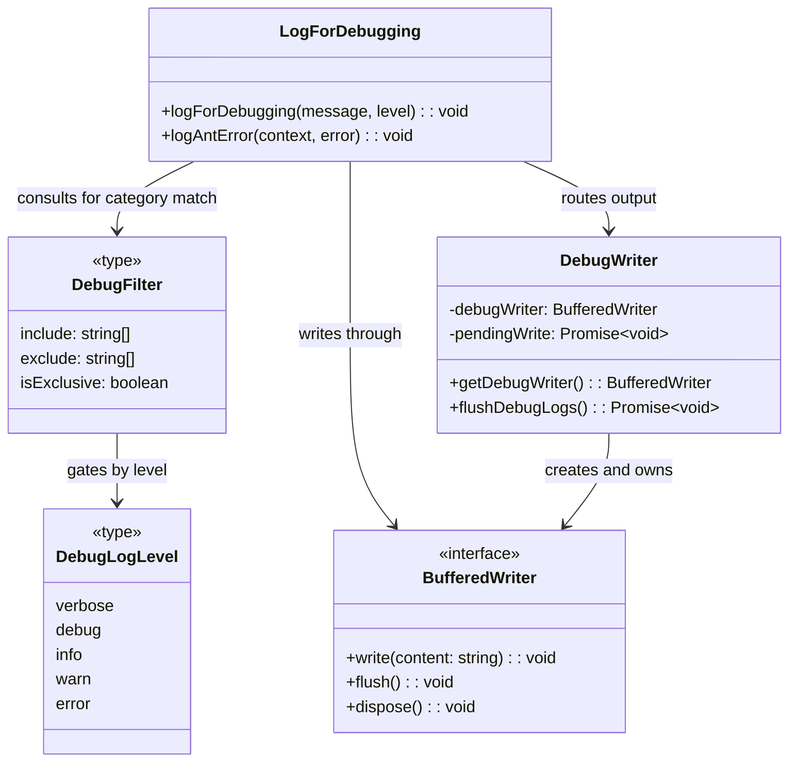
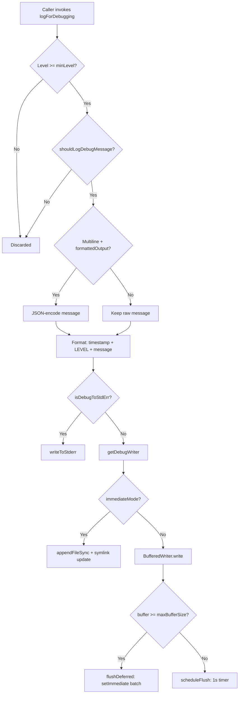

# Chapter 51: Debug Logs, Diagnostics, and Doctor

## Overview

A long-running agent that fails silently is worse than one that crashes loudly. The cc codebase addresses this observability challenge through three interlocking subsystems: a level-aware debug logging pipeline that can be activated at startup or mid-session, a diagnostic utility that audits the installation environment and context budget, and a `/doctor` command that surfaces all of these findings in a single interactive view. Together they form the "sensor" layer of the harness -- the components that observe agent behavior and feed those observations back to the developer or operator.

The debug infrastructure is not a simple `console.log` wrapper. It implements a dual-mode writer (synchronous for interactive sessions, buffered for background processes), a category-based filter system for narrowing verbose output, and a symlink-based "latest log" convention for quick access. The `/doctor` command goes beyond installation checks: it audits context bloat from CLAUDE.md files, agent descriptions, and MCP tool schemas, and it detects unreachable permission rules -- the kind of silent failure that HER Section 14 calls "the observability gap." Where HER Section 6 identifies "silent failures" as agents proceeding after tool errors as if successful, cc's observability stack addresses the inverse: making visible the resource consumption and configuration problems that would otherwise cause the agent to degrade without any error message at all.

## Data structures and contracts

### Log levels and the level ordering

Every debug message carries a severity level drawn from a closed enum. The ordering determines which messages are suppressed at runtime:

```typescript
// src/utils/debug.ts:L18-L26 — DebugLogLevel enum and level ordering
export type DebugLogLevel = 'verbose' | 'debug' | 'info' | 'warn' | 'error'

const LEVEL_ORDER: Record<DebugLogLevel, number> = {
  verbose: 0,
  debug: 1,
  info: 2,
  warn: 3,
  error: 4,
}
```

The `DebugLogLevel` union type defines five bands. The `LEVEL_ORDER` map assigns numeric precedence so that a single comparison in `logForDebugging` (`src/utils/debug.ts:L209`) can discard messages below the configured minimum. The default minimum is `debug` (1), which suppresses `verbose` (0) -- a band reserved for high-volume diagnostics like full status-line commands, shell cwd tracking, and raw stdout/stderr that would otherwise drown out useful output. Setting `CLAUDE_CODE_DEBUG_LOG_LEVEL=verbose` opens the floodgates. The five-level scheme is conventional in logging libraries, but the `verbose` band deserves attention: it exists because cc's debug output includes per-keystroke and per-render telemetry that generates hundreds of lines per second. Without a dedicated suppression level, the debug log would be unusable for anything other than performance profiling.

### Debug filter schema

When the agent is invoked with `--debug=pattern`, a `DebugFilter` narrows which categories of messages are written:

```typescript
// src/utils/debugFilter.ts:L3-L7 — DebugFilter type definition
export type DebugFilter = {
  include: string[]
  exclude: string[]
  isExclusive: boolean
}
```

The `isExclusive` flag distinguishes inclusive mode (only listed categories pass) from exclusive mode (listed categories are suppressed). Mixed inclusive and exclusive filters in the same argument string are rejected -- `parseDebugFilter` (`src/utils/debugFilter.ts:L16-L53`) returns `null` if both `!`-prefixed and bare tokens appear, preventing ambiguous semantics. This is a deliberate design choice: when the filter cannot be interpreted unambiguously, the system fails open and shows everything, because a debug tool that suppresses too much is worse than one that shows too much.

### The log-level hierarchy as a class diagram

The debug logging subsystem involves several cooperating types. The following diagram shows their relationships:



The `LogForDebugging` module sits at the top of the diagram: it receives every call, checks the level gate, applies the filter, and routes the formatted output to either stderr or the `BufferedWriter`. The `DebugWriter` module lazily creates and owns the `BufferedWriter` instance. The `DebugFilter` is consulted only when a filter string was provided via `--debug=pattern`.

### Diagnostic info contract

The `/doctor` command's diagnostic output is governed by the `DiagnosticInfo` type:

```typescript
// src/utils/doctorDiagnostic.ts:L54-L71 — DiagnosticInfo type
export type DiagnosticInfo = {
  installationType: InstallationType
  version: string
  installationPath: string
  invokedBinary: string
  configInstallMethod: InstallMethod | 'not set'
  autoUpdates: string
  hasUpdatePermissions: boolean | null
  multipleInstallations: Array<{ type: string; path: string }>
  warnings: Array<{ issue: string; fix: string }>
  recommendation?: string
  packageManager?: string
  ripgrepStatus: {
    working: boolean
    mode: 'system' | 'builtin' | 'embedded'
    systemPath: string | null
  }
}
```

Every field is populated by `getDoctorDiagnostic` (`src/utils/doctorDiagnostic.ts:L514-L625`), which runs a cascade of installation-type detection, multi-installation scanning, configuration-issue detection, and ripgrep status probing. The `warnings` array is the extensibility point: each check appends structured `{issue, fix}` pairs that the Doctor UI renders as color-coded rows. The `InstallationType` union (`src/utils/doctorDiagnostic.ts:L46-L52`) covers five variants -- `npm-global`, `npm-local`, `native`, `package-manager`, and `development` -- each of which triggers different diagnostic paths and warning conditions. The `hasUpdatePermissions` field is `boolean | null` because it is only relevant for `npm-global` installations; for all other types it remains `null`.

### Context warnings contract

Beyond installation diagnostics, the doctor audits context-window consumption through the `ContextWarnings` type:

```typescript
// src/utils/doctorContextWarnings.ts:L23-L41 — ContextWarnings type
export type ContextWarning = {
  type:
    | 'claudemd_files'
    | 'agent_descriptions'
    | 'mcp_tools'
    | 'unreachable_rules'
  severity: 'warning' | 'error'
  message: string
  details: string[]
  currentValue: number
  threshold: number
}

export type ContextWarnings = {
  claudeMdWarning: ContextWarning | null
  agentWarning: ContextWarning | null
  mcpWarning: ContextWarning | null
  unreachableRulesWarning: ContextWarning | null
}
```

The four warning types map directly to the context bloat vectors that HER Section 5 identifies as back-pressure triggers: oversized CLAUDE.md files inflate the system prompt, agent descriptions consume token budget on every dispatch, MCP tool schemas grow proportionally to the number of connected servers, and unreachable permission rules indicate misconfigured security policies that waste rule-evaluation cycles. Each `ContextWarning` carries both `currentValue` and `threshold`, making the gap quantifiable -- a user can see not just that their MCP tools are too large, but by how much.

## Control flow

### The debug logging pipeline

A debug message travels through a multi-stage pipeline before reaching disk or stderr:



The pipeline has two early-exit gates. The level check at `src/utils/debug.ts:L209` compares the message's level against `getMinDebugLogLevel()`, defaulting to `debug`. The `shouldLogDebugMessage` check at `src/utils/debug.ts:L104-L125` gates on three conditions: test environments suppress output unless `--debug-to-stderr` is set; non-ant users suppress output unless debug mode is active (via `--debug`, `/debug`, or `--debug-file`); and the filter system applies category-based inclusion or exclusion. The multiline encoding step at `src/utils/debug.ts:L217-L219` is a JSONL integrity guard: if the message contains newlines and the session has produced formatted output, the message is JSON-stringified to prevent a single log entry from spanning multiple lines and breaking downstream parsers.

### Dual-mode writer architecture

The `getDebugWriter` function (`src/utils/debug.ts:L155-L196`) creates a `BufferedWriter` whose behavior bifurcates based on `immediateMode`:

```typescript
// src/utils/debug.ts:L155-L196 — Debug writer with dual-mode dispatch
function getDebugWriter(): BufferedWriter {
  if (!debugWriter) {
    let ensuredDir: string | null = null
    debugWriter = createBufferedWriter({
      writeFn: content => {
        const path = getDebugLogPath()
        const dir = dirname(path)
        const needMkdir = ensuredDir !== dir
        ensuredDir = dir
        if (isDebugMode()) {
          // immediateMode: must stay sync. Async writes are lost on direct
          // process.exit() and keep the event loop alive in beforeExit
          // handlers (infinite loop with Perfetto tracing). See #22257.
          if (needMkdir) {
            try {
              getFsImplementation().mkdirSync(dir)
            } catch {
              // Directory already exists
            }
          }
          getFsImplementation().appendFileSync(path, content)
          void updateLatestDebugLogSymlink()
          return
        }
        // Buffered path (ants without --debug): flushes ~1/sec so chain
        // depth stays ~1. .bind over a closure so only the bound args are
        // retained, not this scope.
        pendingWrite = pendingWrite
          .then(appendAsync.bind(null, needMkdir, dir, path, content))
          .catch(noop)
      },
      flushIntervalMs: 1000,
      maxBufferSize: 100,
      immediateMode: isDebugMode(),
    })
    registerCleanup(async () => {
      debugWriter?.dispose()
      await pendingWrite
    })
  }
  return debugWriter
}
```

When `immediateMode` is true (the user started with `--debug`), every write goes through `appendFileSync`. The comment at `src/utils/debug.ts:L165-L167` explains why: async writes are lost on `process.exit()` calls and can cause infinite loops in `beforeExit` handlers when combined with Perfetto tracing. When `immediateMode` is false (ant-type users who log by default but did not pass `--debug`), writes are chained via a promise chain with `appendAsync.bind`, flushing approximately once per second. The `.bind` pattern is deliberate -- it captures only the explicit arguments, avoiding retention of the `writeFn` closure's parent scope (referenced as issue #22257).

The `ensuredDir` variable at `src/utils/debug.ts:L157` is a directory-existence cache. On the first write, `needMkdir` is true and the directory creation is attempted. On subsequent writes to the same directory, `needMkdir` is false and the `mkdirSync` or `mkdir` call is skipped entirely. This is a micro-optimization that matters because debug logging can fire hundreds of times per second during a busy session, and `mkdirSync` on every write would be a measurable latency spike.

### The BufferedWriter internals

The `createBufferedWriter` function (`src/utils/bufferedWriter.ts:L9-L100`) implements a write buffer with overflow protection:

```typescript
// src/utils/bufferedWriter.ts:L56-L80 — Deferred flush for overflow
function flushDeferred(): void {
  if (pendingOverflow) {
    // A previous overflow write is still queued. Coalesce into it to
    // preserve ordering — writes land in a single setImmediate-ordered batch.
    pendingOverflow.push(...buffer)
    buffer = []
    bufferBytes = 0
    clearTimer()
    return
  }
  const detached = buffer
  buffer = []
  bufferBytes = 0
  clearTimer()
  pendingOverflow = detached
  setImmediate(() => {
    const toWrite = pendingOverflow
    pendingOverflow = null
    if (toWrite) writeFn(toWrite.join(''))
  })
}
```

When the buffer overflows (`buffer.length >= maxBufferSize` or `bufferBytes >= maxBufferBytes`), `flushDeferred` detaches the buffer synchronously and schedules the actual write via `setImmediate`. This ensures the calling tick never blocks on I/O. If a second overflow occurs before the first `setImmediate` fires, the new entries are coalesced into the existing `pendingOverflow` array rather than creating a second scheduled write, preserving ordering without unbounded scheduling. The `setImmediate` choice (as opposed to `setTimeout(fn, 0)`) is significant: `setImmediate` runs after I/O callbacks but before timers, which means the overflow write happens sooner than a zero-delay timeout would schedule it, reducing the window during which the buffer could overflow again.

The `flush` function (`src/utils/bufferedWriter.ts:L37-L47`) handles explicit flush requests from `flushDebugLogs` (`src/utils/debug.ts:L198-L201`). It first drains any `pendingOverflow` that was scheduled via `setImmediate` but has not yet fired, then drains the main buffer. This ordering guarantee is important during process shutdown: `registerCleanup` at `src/utils/debug.ts:L190-L193` disposes the writer and awaits the pending promise chain, ensuring no buffered data is lost.

### Debug mode activation paths

The `isDebugMode` function (`src/utils/debug.ts:L44-L57`) checks six different activation sources:

```typescript
// src/utils/debug.ts:L44-L57 — Debug mode activation conditions
export const isDebugMode = memoize((): boolean => {
  return (
    runtimeDebugEnabled ||
    isEnvTruthy(process.env.DEBUG) ||
    isEnvTruthy(process.env.DEBUG_SDK) ||
    process.argv.includes('--debug') ||
    process.argv.includes('-d') ||
    isDebugToStdErr() ||
    // Also check for --debug=pattern syntax
    process.argv.some(arg => arg.startsWith('--debug=')) ||
    // --debug-file implicitly enables debug mode
    getDebugFilePath() !== null
  )
})
```

The six sources are: the runtime toggle (`runtimeDebugEnabled`, set by `enableDebugLogging`); the `DEBUG` environment variable; the `DEBUG_SDK` environment variable (for SDK-level debugging); the `--debug` and `-d` CLI flags; the `--debug=pattern` flag which both enables debug mode and sets a category filter; and the `--debug-file` flag which redirects output to a custom path. The function is memoized via lodash, so the check runs only once unless the cache is explicitly cleared (as `enableDebugLogging` does at `src/utils/debug.ts:L67`). This memoization is safe because the environment variables and argv are immutable after startup, and the only mutable source (`runtimeDebugEnabled`) is coupled with a cache invalidation.

### Category extraction and filtering

The `extractDebugCategories` function (`src/utils/debugFilter.ts:L65-L108`) parses message prefixes into category tokens using five patterns:

1. `category: message` -- simple colon-delimited prefix (e.g., `AutoUpdaterWrapper: ...`)
2. `[CATEGORY] message` -- bracket-delimited tag (e.g., `[ANT-ONLY] ...`)
3. `MCP server "name": message` -- special-case MCP server identification, which pushes both `"mcp"` and the lowercase server name
4. `1p event:` substring detection for internal telemetry events
5. Secondary category extraction for nested patterns like `AutoUpdaterWrapper: Installation type: development`

Pattern 3 is checked first to avoid false positives: if the message matches the MCP server pattern, the simpler colon-prefix pattern (Pattern 1) is skipped. All extracted categories are lowercased and deduplicated via `Array.from(new Set(categories))` at `src/utils/debugFilter.ts:L107`.

These categories feed into `shouldShowDebugCategories` (`src/utils/debugFilter.ts:L116-L139`), which applies the filter: in exclusive mode, messages whose categories intersect the exclude list are suppressed; in inclusive mode, only messages whose categories intersect the include list pass. Messages with no extracted categories are always excluded when any filter is active (`src/utils/debugFilter.ts:L128`), preventing uncategorized noise from leaking through. This "uncategorized messages are excluded" rule is significant for security in exclusive mode: it prevents messages that lack category metadata from bypassing the filter.

### The /doctor command flow

The `/doctor` command is registered as a `local-jsx` slash command that delegates to the `Doctor` React component:

```typescript
// src/commands/doctor/index.ts:L1-L12 — Doctor command registration
import type { Command } from '../../commands.js'
import { isEnvTruthy } from '../../utils/envUtils.js'

const doctor: Command = {
  name: 'doctor',
  description: 'Diagnose and verify your Claude Code installation and settings',
  isEnabled: () => !isEnvTruthy(process.env.DISABLE_DOCTOR_COMMAND),
  type: 'local-jsx',
  load: () => import('./doctor.js'),
}

export default doctor
```

The `isEnabled` gate (`src/commands/doctor/index.ts:L7`) allows environments like HFI (the hosted internal deployment) to suppress the command via `DISABLE_DOCTOR_COMMAND`. The `local-jsx` type means the command renders an interactive terminal UI rather than producing a plain-text result. The `load` callback uses a dynamic import, so the Doctor component and its dependencies are not included in the initial bundle.

The `Doctor` component (`src/screens/Doctor.tsx:L100-L502`) orchestrates multiple async checks on mount:

1. `getDoctorDiagnostic()` -- installation type, version, multi-installation detection, ripgrep status, configuration warnings
2. Agent directory scanning -- checks `~/.claude/agents/` and `.claude/agents/` for agent definitions and parse errors
3. `checkContextWarnings()` -- audits CLAUDE.md file sizes, agent description token counts, MCP tool token counts, and unreachable permission rules
4. PID-based version lock inspection -- checks for stale locks from concurrent installations

These checks run concurrently via `Promise.all` inside `checkContextWarnings` (`src/utils/doctorContextWarnings.ts:L246-L265`), so a slow MCP token count does not block the CLAUDE.md check. The `Doctor` component renders a loading state ("Checking installation status...") until the diagnostic data arrives, then displays each section as a vertical stack of `Box` elements inside a `Pane` container.

### Installation type detection

The `getCurrentInstallationType` function (`src/utils/doctorDiagnostic.ts:L86-L148`) determines how cc was installed through a sequence of checks:

1. If `NODE_ENV === 'development'`, return `'development'`
2. If running in bundled mode (`isInBundledMode()`), check for package manager signatures (Homebrew, winget, mise, asdf, pacman, deb, rpm, apk) -- if any are detected, return `'package-manager'`; otherwise return `'native'`
3. If running from a local npm installation (`isRunningFromLocalInstallation()`), return `'npm-local'`
4. Check if the invocation path includes standard npm global directories (`/usr/local/lib/node_modules`, `/opt/homebrew/lib/node_modules`, etc.) -- if so, return `'npm-global'`
5. Check npm's configured global prefix and see if the invocation path starts with it
6. If none of the above, return `'unknown'`

Each installation type triggers different warning conditions in `detectConfigurationIssues` (`src/utils/doctorDiagnostic.ts:L317-L485`). For example, native installations trigger a PATH check for `~/.local/bin`, while `npm-local` installations trigger an alias accessibility check. This cascade means the diagnostic output is contextual: a user running from `npm-local` sees different warnings than one running from `native`, even if both have the same underlying configuration problems.

### Context warning thresholds

The context warning subsystem uses hard-coded thresholds that align with the back-pressure mechanism:

- `MAX_MEMORY_CHARACTER_COUNT` (from `src/utils/claudemd.ts`) -- individual CLAUDE.md files exceeding this are flagged
- `AGENT_DESCRIPTIONS_THRESHOLD` -- total agent description tokens above this are flagged
- `MCP_TOOLS_THRESHOLD = 25_000` (`src/utils/doctorContextWarnings.ts:L21`) -- MCP tool schema tokens above this are flagged, approximately 15k model tokens

These thresholds represent the point at which context consumption begins to degrade the agent's effective working memory, connecting directly to the back-pressure concept from the terminology registry. The `/doctor` output makes these silent budget consumers visible before they cause a context collapse event. The `checkMcpTools` function (`src/utils/doctorContextWarnings.ts:L119-L207`) is the most sophisticated of the four checks: it groups MCP tools by server name (parsed from the `mcp__servername__toolname` naming convention), sorts servers by token count, and shows the top five contributors. This grouping lets operators identify which MCP server is the primary source of context bloat and take targeted action.

### The /debug skill

Beyond the `/doctor` command, cc exposes a `/debug` skill (`src/skills/bundled/debug.ts`) that provides interactive debugging assistance. This skill calls `enableDebugLogging()` (`src/skills/bundled/debug.ts:L28`) to activate logging if it was not already active, then tails the last 20 lines of the debug log for the current session. The skill's prompt instructs the model to review the log for `[ERROR]` and `[WARN]` entries, explain findings in plain language, and suggest concrete fixes. For non-ant users, the prompt includes an explicit warning that debug logging was just enabled and nothing prior to the `/debug` invocation was captured.

## Edge cases and failure modes

### Debug log activation mid-session

Non-ant users do not write debug logs by default. When a user invokes `/debug` mid-session, `enableDebugLogging()` (`src/utils/debug.ts:L64-L69`) sets `runtimeDebugEnabled = true` and clears the memoization cache on `isDebugMode`. However, all activity prior to the `/debug` invocation is lost -- the debug skill's prompt (`src/skills/bundled/debug.ts:L59-L67`) explicitly warns about this gap and suggests restarting with `--debug` if the issue cannot be reproduced. This is the fundamental limitation of a post-hoc debugging approach: the most interesting events (the ones that caused the problem) happened before the user decided to look.

### Mixed inclusive/exclusive filter rejection

If a user passes `--debug=api,!hooks`, `parseDebugFilter` (`src/utils/debugFilter.ts:L36-L42`) returns `null` because mixing inclusive and exclusive filters creates ambiguous semantics. Rather than guessing the user's intent, the system disables filtering entirely and shows all messages. This is a deliberate "fail open" choice for a debug tool -- suppressing too much is worse than showing too much. The implementation could be extended to support mixed filters by applying exclusive filters first and then inclusive filters on the remainder, but the current design opts for simplicity over expressiveness.

### Sync-write requirements for process exit

The comment at `src/utils/debug.ts:L165-L167` documents a subtle failure mode: when the process calls `process.exit()` directly (as happens in certain error paths), any pending async writes are lost. Additionally, pending async writes keep the event loop alive in `beforeExit` handlers, which can cause infinite loops when combined with Perfetto tracing. The `immediateMode` flag forces synchronous `appendFileSync` to avoid both problems, at the cost of blocking the current tick during disk I/O. The `registerCleanup` function (`src/utils/cleanupRegistry.ts:L14-L17`) is the belt-and-suspenders approach for the buffered path: it disposes the writer and awaits the pending promise chain during graceful shutdown, but it cannot help if the process exits abruptly without running cleanup handlers.

### Symlink update failure tolerance

The `updateLatestDebugLogSymlink` function (`src/utils/debug.ts:L242-L253`) creates a `latest` symlink in the debug logs directory pointing to the current session's log file. It is memoized, so it runs at most once per module load. If the symlink creation fails (e.g., on a filesystem that does not support symlinks, or due to permission errors), the error is silently swallowed. This is correct behavior -- the symlink is a convenience, not a correctness requirement. The memoization via lodash means that even if the symlink creation succeeds, it will not be updated on subsequent writes within the same session, which could cause the `latest` symlink to point to a stale path if the debug log path changes mid-session (an unlikely but theoretically possible scenario when `CLAUDE_CODE_DEBUG_LOGS_DIR` is set).

### Ant-only error logging

The `logAntError` function (`src/utils/debug.ts:L258-L268`) is gated on `process.env.USER_TYPE === 'ant'`. Non-ant users never see these messages. This is a leaky abstraction: if an ant-only error occurs in shared code, non-ant users have no way to discover it through the debug log. The HER Section 14 observability gap applies here -- the error is structurally invisible to a subset of users. The `[ANT-ONLY]` prefix in the logged message (`src/utils/debug.ts:L264`) ensures that these messages are categorizable by the filter system, so ant users can selectively include or exclude them with `--debug=ant-only` or `--debug=!ant-only`.

### Stale version locks

The doctor checks PID-based version locks via `cleanupStaleLocks` (`src/screens/Doctor.tsx:L193`). A lock whose owning process has exited is "stale" and is cleaned up during the doctor run. However, if the doctor command itself is run while another installation is in progress, the lock may appear stale because the owning process has not yet written its heartbeat. The doctor does not implement a grace period for recently-created locks. The version lock display (`src/screens/Doctor.tsx:L442`) shows both running and stale locks, with stale locks highlighted in a warning color, so a user can visually identify potentially false-positive stale entries.

### MCP tool token counting fallback

The `checkMcpTools` function (`src/utils/doctorContextWarnings.ts:L119-L207`) has a fallback path: if the primary token counting via `countMcpToolTokens` throws an error, it falls back to a character-based estimation using `roughTokenCountEstimation`. The fallback is less accurate but ensures the doctor always produces output even if the MCP connection is in a degraded state. The catch block at `src/utils/doctorContextWarnings.ts:L185` silently absorbs the error rather than logging it, which means a persistent MCP token-counting failure is invisible unless the user notices the "estimated" qualifier in the warning message.

## Where cc diverges from the published pattern

### Observation masking at the log level

HER Section 8 reports that observation masking -- replacing verbose tool outputs with compressed summaries before feeding them back into the model context -- achieves a 52% cost reduction. cc implements a form of this at the debug logging level: when `hasFormattedOutput` is true and a message contains newlines, `logForDebugging` (`src/utils/debug.ts:L217-L219`) JSON-encodes the message to preserve the JSONL format. This is not the full observation masking that HER describes (which operates on tool results in the model context), but it serves a related purpose: keeping the debug log machine-parseable so that downstream tooling can extract structured data without parsing ad-hoc multiline text. The observation masking terminology entry defines it as replacing verbose tool outputs with compressed summaries; cc's JSON-encoding is a compression technique applied to a different data path (the debug log rather than the model context), but the goal -- reducing the cost of processing verbose observations -- is the same.

### Back-pressure visibility

HER Section 5 describes back-pressure as a mechanism that slows or stops the agent loop when resource limits are approached. cc's `/doctor` command makes the preconditions for back-pressure visible -- large CLAUDE.md files, oversized agent descriptions, excessive MCP tool schemas -- but it does not enforce back-pressure itself. It is a sensor, not an actuator. The actual back-pressure enforcement happens in the compaction pipeline (Chapter 46) and the token budget system. The `/doctor` command fills the observability gap by making the resource consumption that triggers back-pressure inspectable before it becomes a runtime problem. This aligns with HER Section 14's three pillars: the doctor provides metrics (token counts, file sizes) and logs (structured warnings), but it does not provide traces (distributed tracing across multi-agent workflows). A `/doctor` run after a context collapse event can explain why it happened, but it cannot reconstruct the sequence of decisions that led to it.

### Structured logging without a standard schema

The HER Section 14.1 "Three Pillars" pattern calls for structured logging with consistent schemas. cc's debug logs are semi-structured: each line is `<timestamp> [<LEVEL>] <message>`, but the message format varies by caller. The category extraction in `extractDebugCategories` (`src/utils/debugFilter.ts:L65-L108`) compensates for this by parsing five different prefix patterns. This is pragmatic -- requiring all callers to adopt a structured schema would be a large migration -- but it means that category filtering is best-effort rather than guaranteed. A message like `MCP server "name": something happened` is correctly categorized, but a message like `Error in MCP connection` is not. The five-pattern approach also has an ordering dependency: Pattern 3 (MCP server) must be checked before Pattern 1 (colon-prefix) to avoid mis-categorizing MCP server names as generic categories.

### Silent failures versus visible degradation

HER Section 6 identifies "silent failures" as agents proceeding after tool errors as if successful, and recommends structured output validation after every tool call as the fix. cc's `/doctor` command addresses a different but related problem: silent degradation rather than silent failure. A large CLAUDE.md file does not cause an error; it causes the agent to operate with reduced effective context, producing lower-quality outputs without any explicit failure signal. The `/doctor` command's context warnings make this degradation visible, but it requires the user to actively run the command. There is no continuous monitoring that would alert the user when context consumption crosses a threshold during normal operation. This is a gap in the observability stack: the doctor is a point-in-time snapshot, not a continuous watch.

## Developer takeaways for building a long-running agent

Debug logging in a long-running agent must be activatable after startup, because users rarely enable verbose logging before encountering a problem. The dual-mode writer pattern -- synchronous when the user explicitly opts in, buffered when logging happens in the background -- prevents both data loss on process exit and event-loop stalls during normal operation. The category filter system demonstrates that string-prefix parsing, while fragile, is sufficient for ad-hoc debug filtering when a full structured-logging migration is impractical; the key insight is that the filter must fail open, showing too much rather than too little, because a debug tool that suppresses the wrong message is worse than one that shows a few extra lines. The `/doctor` command shows that installation diagnostics alone are necessary but not sufficient: context-window auditing is equally important, because context bloat is a silent failure mode that produces no error messages. Exposing the same thresholds that trigger back-pressure as doctor warnings gives operators a chance to intervene before the agent hits a context collapse. The separation between the diagnostic data model (`DiagnosticInfo`, `ContextWarnings`) and the rendering layer (React component) keeps the checks testable and allows programmatic consumption of the results without parsing terminal output. The most important architectural lesson is the distinction between sensors and actuators: the `/doctor` command and debug pipeline observe and report, but the actual enforcement happens elsewhere -- in compaction, in token budgets, and in permission checks. An observability stack that mixes observation with enforcement becomes difficult to test and difficult to reason about.
