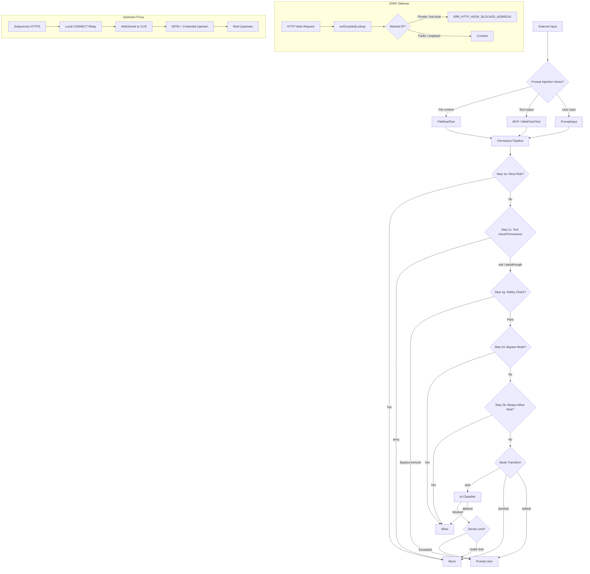
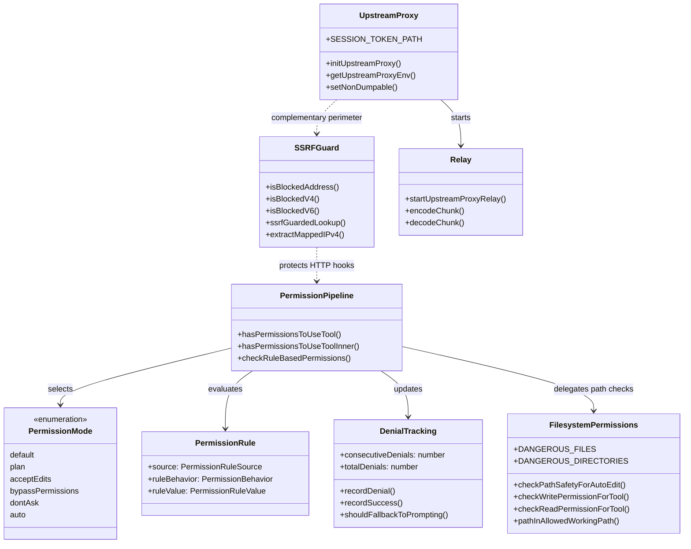

# Threat Model: CC Through the Lens of HER Section 12

## Overview

Security in an agent system is not a single gate but a continuously negotiated boundary between what the model requests and what the harness permits. HER Section 12 identifies five defense-in-depth layers for agent guardrails: prompt-level instructions, schema-level restrictions, runtime approval, tool-level validation, and lifecycle hooks. cc implements all five, but the concrete mechanics reveal tensions that the abstract model papers over. This chapter traces the threat model from the outside in: how an adversary might reach the agent, what surfaces the upstream proxy and SSRF guard close off, how the permission mode pipeline mediates every tool call, and where the defenses have known gaps.

The core tension is that an agent must be powerful enough to be useful yet constrained enough to be safe. HER Section 6.13 reports that 73% of deployments are affected by prompt injection -- the most prevalent security vulnerability in agent systems. cc's response is not a single countermeasure but a layered pipeline where each layer narrows the blast radius of a compromise at the layer above. The permission pipeline in `src/utils/permissions/permissions.ts`, the SSRF guard in `src/utils/hooks/ssrfGuard.ts`, and the upstream proxy in `src/upstreamproxy/` form three concentric perimeters. Understanding their interaction -- and their failure modes -- is essential for anyone building a long-running agent.

HER Section 12.4 identifies five specific threat categories for agent systems: indirect prompt injection, supply chain attacks via MCP/Skills, system prompt leakage, data exfiltration through tool calls, and checkpoint-restore attacks. cc has concrete mitigations for three of these (prompt injection via the permission pipeline, supply chain attacks via MCP permission scoping, and data exfiltration via the SSRF guard). The remaining two -- system prompt leakage and checkpoint-restore attacks -- represent known gaps that this chapter will address in detail. HER Section 12.5 cites the OpenClaw incident (CVE-2025-53773, CVSS 9.6, 21,000 exposed instances) as evidence that agent security is not theoretical. cc's defenses were shaped by exactly this class of vulnerability.

The chapter is organized around the three major defense perimeters: the SSRF guard (network-level), the upstream proxy (transport-level), and the permission pipeline (application-level). Each perimeter has its own threat model, its own failure modes, and its own interaction with the others. By the end, the reader should understand not only what cc defends against but where its defenses end and where the next line must be drawn.

## Data structures and contracts

The permission system revolves around three interacting types: the permission mode, the permission rule, and the denial tracking state. The mode determines the broad authorization posture; the rules provide fine-grained allowlists and denylists; the denial tracking state prevents the auto-mode classifier from looping on repeated blocks. Together, they form the data backbone of cc's runtime approval layer.

```typescript
// src/utils/permissions/PermissionMode.ts:L34-L91 — Permission mode configuration
type PermissionModeConfig = {
  title: string
  shortTitle: string
  symbol: string
  color: ModeColorKey
  external: ExternalPermissionMode
}

const PERMISSION_MODE_CONFIG: Partial<
  Record<PermissionMode, PermissionModeConfig>
> = {
  default: {
    title: 'Default',
    shortTitle: 'Default',
    symbol: '',
    color: 'text',
    external: 'default',
  },
  plan: {
    title: 'Plan Mode',
    shortTitle: 'Plan',
    symbol: PAUSE_ICON,
    color: 'planMode',
    external: 'plan',
  },
  acceptEdits: {
    title: 'Accept edits',
    shortTitle: 'Accept',
    symbol: '⏵⏵',
    color: 'autoAccept',
    external: 'acceptEdits',
  },
  bypassPermissions: {
    title: 'Bypass Permissions',
    shortTitle: 'Bypass',
    symbol: '⏵⏵',
    color: 'error',
    external: 'bypassPermissions',
  },
  dontAsk: {
    title: "Don't Ask",
    shortTitle: 'DontAsk',
    symbol: '⏵⏵',
    color: 'error',
    external: 'dontAsk',
  },
```

The `PERMISSION_MODE_CONFIG` map encodes a security gradient. The `default` and `plan` modes place the human in the loop for every non-trivial action. The `acceptEdits` mode trusts the agent with file modifications but still gates Bash and MCP tools. The `bypassPermissions` and `dontAsk` modes are marked with the `error` color key, signaling that they are dangerous and should be presented to the user with visual urgency. The `auto` mode (conditionally compiled behind the `TRANSCRIPT_CLASSIFIER` feature flag) delegates approval to an AI classifier, which introduces its own trust boundary -- the classifier itself can be wrong, unavailable, or adversarially manipulated.

The `external` field in `PermissionModeConfig` maps internal modes to the subset exposed to SDK consumers. The `isExternalPermissionMode` function at `src/utils/permissions/PermissionMode.ts:L97-L105` filters out `auto` and `bubble` modes for non-ant users, ensuring that the classifier-driven approval path is not accidentally exposed to external integrations that cannot handle its nuances.

The permission rule schema binds a tool name and optional content to a behavioral directive:

```typescript
// src/utils/permissions/PermissionRule.ts:L35-L40 — Permission rule value schema
export const permissionRuleValueSchema = lazySchema(() =>
  z.object({
    toolName: z.string(),
    ruleContent: z.string().optional(),
  }),
)
```

The `ruleContent` field enables content-specific rules such as `Bash(npm publish:*)` that constrain not only whether a tool can run but also what arguments it may receive. This is the schema-level restriction layer from HER Section 12.1. Rules are sourced from multiple origins -- `userSettings`, `projectSettings`, `localSettings`, `policySettings`, `flagSettings`, `cliArg`, `command`, and `session` -- each with different persistence characteristics and override semantics. The `PERMISSION_RULE_SOURCES` constant at `src/utils/permissions/permissions.ts:L109-L114` defines the evaluation order, which determines which source wins when two rules conflict.

Denial tracking provides a circuit-breaker for the auto-mode classifier:

```typescript
// src/utils/permissions/denialTracking.ts:L7-L15 — Denial tracking state and limits
export type DenialTrackingState = {
  consecutiveDenials: number
  totalDenials: number
}

export const DENIAL_LIMITS = {
  maxConsecutive: 3,
  maxTotal: 20,
} as const
```

The `maxConsecutive` limit of 3 means that if the classifier blocks three actions in a row, the system falls back to interactive prompting. The `maxTotal` limit of 20 provides a session-wide cap that prevents an indefinitely looping auto-mode agent from burning tokens without human review. When the total limit is hit in headless mode, the agent is aborted outright via `AbortError` in `src/utils/permissions/permissions.ts:L1024-L1027`. The `recordDenial` and `recordSuccess` functions at `src/utils/permissions/denialTracking.ts:L24-L38` update the state immutably, returning a new object rather than mutating in place. This enables React state reconciliation via `Object.is` comparison in the `persistDenialState` function.

The filesystem permission layer adds two more critical data structures: the lists of dangerous files and directories that are protected from auto-editing regardless of other rule evaluations.

```typescript
// src/utils/permissions/filesystem.ts:L57-L79 — Dangerous files and directories
export const DANGEROUS_FILES = [
  '.gitconfig',
  '.gitmodules',
  '.bashrc',
  '.bash_profile',
  '.zshrc',
  '.zprofile',
  '.profile',
  '.ripgreprc',
  '.mcp.json',
  '.claude.json',
] as const

export const DANGEROUS_DIRECTORIES = [
  '.git',
  '.vscode',
  '.idea',
  '.claude',
] as const
```

The `DANGEROUS_FILES` list targets files that enable code execution or data exfiltration if modified by the agent: shell startup scripts (`.bashrc`, `.zshrc`), git configuration (`.gitconfig`, `.gitmodules`), and cc's own configuration (`.mcp.json`, `.claude.json`). The `DANGEROUS_DIRECTORIES` list protects IDE settings (`.vscode`, `.idea`), version control internals (`.git`), and cc's own directory tree (`.claude`). The `.claude` entry has a special carve-out for the `worktrees` subdirectory at `src/utils/permissions/filesystem.ts:L460-L468`, because `.claude/worktrees/` is a structural path managed by cc itself, not a user-created dangerous directory.

## Control flow

The permission check pipeline is the central control flow for cc's threat model. Every tool invocation passes through `hasPermissionsToUseTool`, which delegates to `hasPermissionsToUseToolInner`. The inner function implements a multi-step waterfall where earlier steps short-circuit later ones. Understanding the ordering is essential because a misordered pipeline creates bypasses.

```typescript
// src/utils/permissions/permissions.ts:L1162-L1281 — Permission pipeline inner function
async function hasPermissionsToUseToolInner(
  tool: Tool,
  input: { [key: string]: unknown },
  context: ToolUseContext,
): Promise<PermissionDecision> {
  if (context.abortController.signal.aborted) {
    throw new AbortError()
  }

  let appState = context.getAppState()

  // 1. Check if the tool is denied
  // 1a. Entire tool is denied
  const denyRule = getDenyRuleForTool(appState.toolPermissionContext, tool)
  if (denyRule) {
    return {
      behavior: 'deny',
      decisionReason: {
        type: 'rule',
        rule: denyRule,
      },
      message: `Permission to use ${tool.name} has been denied.`,
    }
  }

  // ... 1b through 1g omitted for brevity ...

  // 2a. Check if mode allows the tool to run
  appState = context.getAppState()
  const shouldBypassPermissions =
    appState.toolPermissionContext.mode === 'bypassPermissions' ||
    (appState.toolPermissionContext.mode === 'plan' &&
      appState.toolPermissionContext.isBypassPermissionsModeAvailable)
  if (shouldBypassPermissions) {
    return {
      behavior: 'allow',
      updatedInput: getUpdatedInputOrFallback(toolPermissionResult, input),
      decisionReason: {
        type: 'mode',
        mode: appState.toolPermissionContext.mode,
      },
    }
  }

  // 2b. Entire tool is allowed
  const alwaysAllowedRule = toolAlwaysAllowedRule(
    appState.toolPermissionContext,
    tool,
  )
  if (alwaysAllowedRule) {
    return {
      behavior: 'allow',
      updatedInput: getUpdatedInputOrFallback(toolPermissionResult, input),
      decisionReason: {
        type: 'rule',
        rule: alwaysAllowedRule,
      },
    }
  }

  // 3. Convert "passthrough" to "ask"
  // ...
}
```

The pipeline has three phases. Phase 1 (steps 1a through 1g) checks deny rules, ask rules, tool-specific permissions, and safety checks. Phase 2 (steps 2a and 2b) checks mode-based bypass and always-allow rules. Phase 3 converts any remaining `passthrough` result to `ask`. The ordering ensures that deny rules always take precedence over allow rules, and that bypass-immune safety checks cannot be circumvented by mode changes or hook approvals.

After `hasPermissionsToUseToolInner` returns, the outer `hasPermissionsToUseTool` function applies mode-specific transformations. In `auto` mode, the classifier is invoked only after the acceptEdits fast-path and the safe-tool allowlist have been checked, ensuring that trivially safe operations do not incur the latency and cost of an additional API call. In `dontAsk` mode, any `ask` result is converted to `deny`, preventing the agent from blocking on a prompt that will never be shown. For headless agents with `shouldAvoidPermissionPrompts` set, the pipeline first runs `PermissionRequest` hooks to give them a chance to approve or deny the operation, and only auto-denies if no hook provides a decision (`src/utils/permissions/permissions.ts:L400-L471`).

The auto-mode classifier flow deserves special attention because it introduces a second AI model into the security decision path. The classifier receives the full conversation transcript plus the proposed action and returns a block-or-allow decision with a reason. When the classifier blocks an action, the denial tracking state is updated. If consecutive denials reach the `maxConsecutive` limit of 3, or total denials reach the `maxTotal` limit of 20, the system falls back to interactive prompting via `handleDenialLimitExceeded` at `src/utils/permissions/permissions.ts:L984-L1058`. In headless mode, exceeding the total limit triggers an `AbortError` that terminates the agent entirely, because a headless agent that has been blocked 20 times has no path to recovery without human intervention.

The following flowchart shows the complete threat model from attack surface to defense:



The SSRF guard protects HTTP hooks from reaching cloud metadata endpoints and internal infrastructure. It is the network-level perimeter in cc's defense-in-depth model, addressing HER Section 12.4's "Data Exfiltration Through Tool Calls" threat vector for HTTP hooks specifically.

```typescript
// src/utils/hooks/ssrfGuard.ts:L42-L86 — Core SSRF address blocking logic
export function isBlockedAddress(address: string): boolean {
  const v = isIP(address)
  if (v === 4) {
    return isBlockedV4(address)
  }
  if (v === 6) {
    return isBlockedV6(address)
  }
  return false
}

function isBlockedV4(address: string): boolean {
  const parts = address.split('.').map(Number)
  const [a, b] = parts
  if (
    parts.length !== 4 ||
    a === undefined ||
    b === undefined ||
    parts.some(n => Number.isNaN(n))
  ) {
    return false
  }

  // Loopback explicitly allowed
  if (a === 127) return false

  // 0.0.0.0/8
  if (a === 0) return true
  // 10.0.0.0/8
  if (a === 10) return true
  // 169.254.0.0/16 — link-local, cloud metadata
  if (a === 169 && b === 254) return true
  // 172.16.0.0/12
  if (a === 172 && b >= 16 && b <= 31) return true
  // 100.64.0.0/10 — shared address space (RFC 6598, CGNAT)
  if (a === 100 && b >= 64 && b <= 127) return true
  // 192.168.0.0/16
  if (a === 192 && b === 168) return true

  return false
}
```

The IPv4 blocking covers the standard private ranges (10.0.0.0/8, 172.16.0.0/12, 192.168.0.0/16) plus two ranges that are specifically targeted at cloud metadata endpoints: 169.254.0.0/16 for AWS/GCP/Azure IMDS, and 100.64.0.0/10 for providers like Alibaba Cloud that use CGNAT ranges for metadata. The 100.64.0.0/10 range deserves particular attention: it is defined by RFC 6598 for shared address space used by Carrier-Grade NAT, and cloud providers like Alibaba use endpoints within this range (e.g., 100.100.100.200) for instance metadata. Without blocking this range, an SSRF attack against an Alibaba Cloud deployment could exfiltrate temporary security credentials. Loopback (127.0.0.0/8) is explicitly allowed because local development policy servers are a primary HTTP hook use case -- a design decision that trades off SSRF protection for developer ergonomics.

The IPv6 blocking in `isBlockedV6` handles the same ranges plus IPv4-mapped IPv6 addresses, which would otherwise bypass the v4 check. The `extractMappedIPv4` function at `src/utils/hooks/ssrfGuard.ts:L187-L204` expands an IPv6 address into its eight hex groups, checks that the first five are zero and the sixth is `0xffff`, then delegates the embedded IPv4 address to the v4 blocking logic. This closes a bypass where `::ffff:a9fe:a9fe` (which maps to 169.254.169.254) would pass the v6 validator because its hextets do not fall in the `fc00::/7` or `fe80::/10` ranges.

The `ssrfGuardedLookup` function integrates this check into Node's DNS resolution path by replacing the default `dns.lookup` used by HTTP clients:

```typescript
// src/utils/hooks/ssrfGuard.ts:L216-L283 — SSRF-guarded DNS lookup for HTTP hooks
export function ssrfGuardedLookup(
  hostname: string,
  options: object,
  callback: (
    err: Error | null,
    address: AxiosLookupAddress | AxiosLookupAddress[],
    family?: AddressFamily,
  ) => void,
): void {
  const wantsAll = 'all' in options && options.all === true

  const ipVersion = isIP(hostname)
  if (ipVersion !== 0) {
    if (isBlockedAddress(hostname)) {
      callback(ssrfError(hostname, hostname), '')
      return
    }
    const family = ipVersion === 6 ? 6 : 4
    if (wantsAll) {
      callback(null, [{ address: hostname, family }])
    } else {
      callback(null, hostname, family)
    }
    return
  }

  dnsLookup(hostname, { all: true }, (err, addresses) => {
    if (err) {
      callback(err, '')
      return
    }

    for (const { address } of addresses) {
      if (isBlockedAddress(address)) {
        callback(ssrfError(hostname, address), '')
        return
      }
    }
    // ... return resolved addresses ...
  })
}
```

The key design decision is that `ssrfGuardedLookup` validates every address returned by DNS before handing it to the HTTP client. The function requests all DNS records (`{ all: true }`) and checks each one individually. This closes the DNS rebinding window: the IP that passes validation is the same IP the socket connects to. If any single address in the response is blocked, the entire lookup fails. The error code `ERR_HTTP_HOOK_BLOCKED_ADDRESS` provides a machine-readable signal that downstream consumers can use for logging and alerting, distinguishing SSRF blocks from normal DNS failures.

The upstream proxy addresses a different threat: credential injection for outbound HTTPS traffic from CCR containers. The proxy architecture is a local CONNECT-to-WebSocket relay that tunnels through a server-side MITM proxy. The initialization sequence in `initUpstreamProxy` at `src/upstreamproxy/upstreamproxy.ts:L79-L153` proceeds through six steps: verify the CCR environment is active, read the session token, disable process dumpability, download and concatenate the CA certificate bundle, start the local relay, and unlink the token file. Each step fails open, logging a warning and disabling the proxy if anything goes wrong.

```typescript
// src/upstreamproxy/upstreamproxy.ts:L37-L63 — Proxy bypass list for internal endpoints
const NO_PROXY_LIST = [
  'localhost',
  '127.0.0.1',
  '::1',
  '169.254.0.0/16',
  '10.0.0.0/8',
  '172.16.0.0/12',
  '192.168.0.0/16',
  'anthropic.com',
  '.anthropic.com',
  '*.anthropic.com',
  'github.com',
  'api.github.com',
  '*.github.com',
  '*.githubusercontent.com',
  'registry.npmjs.org',
  'pypi.org',
  'files.pythonhosted.org',
  'index.crates.io',
  'proxy.golang.org',
].join(',')
```

The `NO_PROXY_LIST` prevents the MITM proxy from intercepting traffic to the Anthropic API (which would break non-Bun runtimes like Python's certifi that do not trust the forged CA), common package registries, and GitHub. The three forms for Anthropic (`anthropic.com`, `.anthropic.com`, `*.anthropic.com`) account for different `NO_PROXY` parsing behaviors across runtimes: Bun and curl use glob matching, Python uses suffix matching, and some implementations only match the apex domain. The `getUpstreamProxyEnv` function at `src/upstreamproxy/upstreamproxy.ts:L160-L199` propagates these environment variables to all agent subprocesses, including Bash, MCP, LSP, and hooks, ensuring consistent proxy behavior across the entire process tree.

The relay itself listens on `127.0.0.1` with an ephemeral port and accepts HTTP CONNECT requests from local clients. The `handleData` function in `src/upstreamproxy/relay.ts:L295-L342` implements a two-phase protocol: phase 1 accumulates the CONNECT request header, and phase 2 forwards client bytes over the WebSocket tunnel. The relay handles a subtle timing issue where TCP can coalesce the CONNECT request and the first data packet into a single read: a `pending` buffer captures bytes that arrive before the WebSocket is open, and they are flushed in the `ws.onopen` handler.

The upstream proxy also implements a hardening measure against process memory scraping:

```typescript
// src/upstreamproxy/upstreamproxy.ts:L225-L252 — prctl(PR_SET_DUMPABLE, 0) to block ptrace
function setNonDumpable(): void {
  if (process.platform !== 'linux' || typeof Bun === 'undefined') return
  try {
    const ffi = require('bun:ffi') as typeof import('bun:ffi')
    const lib = ffi.dlopen('libc.so.6', {
      prctl: {
        args: ['int', 'u64', 'u64', 'u64', 'u64'],
        returns: 'int',
      },
    } as const)
    const PR_SET_DUMPABLE = 4
    const rc = lib.symbols.prctl(PR_SET_DUMPABLE, 0n, 0n, 0n, 0n)
    if (rc !== 0) {
      logForDebugging(
        '[upstreamproxy] prctl(PR_SET_DUMPABLE,0) returned nonzero',
        {
          level: 'warn',
        },
      )
    }
  } catch (err) {
    logForDebugging(
      `[upstreamproxy] prctl unavailable: ${err instanceof Error ? err.message : String(err)}`,
      { level: 'warn' },
    )
  }
}
```

This is a direct response to the prompt injection threat described in HER Section 6.13. If an attacker can inject malicious instructions into file content or tool output, they might instruct the agent to run `gdb -p $PPID` and scrape the session token from the process heap. By calling `prctl(PR_SET_DUMPABLE, 0)`, the process blocks same-UID ptrace, raising the bar from "any bash command can read the token" to "the attacker needs CAP_SYS_PTRACE or a kernel exploit." The session token is also unlinked from disk after the relay starts (`src/upstreamproxy/upstreamproxy.ts:L140-L144`), so it only exists in process memory during the relay's lifetime. The function is Linux-only and Bun-only: on macOS, the same protection would require different syscalls, and on Node.js the FFI approach is not available.

The following class diagram shows the defense layers and their relationships:



The filesystem permission layer deserves separate analysis because it operates at a different granularity than the tool-level pipeline. The `checkWritePermissionForTool` function at `src/utils/permissions/filesystem.ts:L1205-L1412` implements a step-by-step path validation that checks deny rules, internal editable paths, `.claude/` session allow rules, safety checks (dangerous files, dangerous directories, Windows path patterns), ask rules, and working directory membership. Critically, the safety check at step 1.7 runs before the allow rule check at step 4, ensuring that a broad allow rule like `Edit(*)` cannot silently bypass protection of `.bashrc` or `.git/config`. The `checkReadPermissionForTool` function at `src/utils/permissions/filesystem.ts:L1030-L1194` has a similar structure but adds a step where edit access implies read access (step 5), reflecting the principle that if the agent is allowed to modify a file, it should also be allowed to read it.

The `checkPathSafetyForAutoEdit` function at `src/utils/permissions/filesystem.ts:L620-L665` checks both the original path and all symlink-resolved paths, using `getPathsForPermissionCheck` to enumerate them. This dual-checking prevents an attacker from creating a symlink from a safe path to a dangerous target -- for example, `ln -s /etc/passwd /tmp/safe-looking-file` would be caught because the resolved path falls outside the allowed working directory. The `hasSuspiciousWindowsPathPattern` function at `src/utils/permissions/filesystem.ts:L537-L602` provides defense-in-depth against NTFS Alternate Data Streams, 8.3 short names, long path prefixes, trailing dots and spaces, and DOS device names -- all techniques that can bypass string-based path matching on Windows.

## Edge cases and failure modes

**IPv4-mapped IPv6 bypass.** The `extractMappedIPv4` function in `src/utils/hooks/ssrfGuard.ts:L187-L204` handles a subtle bypass vector. An IPv4-mapped IPv6 address like `::ffff:a9fe:a9fe` resolves to 169.254.169.254 (the AWS IMDS endpoint). Without the extraction check, this address would pass the v6 validator because the hextets do not fall in the `fc00::/7` or `fe80::/10` ranges. The implementation expands the IPv6 address into its eight hex groups via `expandIPv6Groups`, checks that the first five are zero and the sixth is `0xffff`, then delegates the embedded IPv4 address to the v4 blocking logic. The expansion handles trailing dotted-decimal notation (e.g., `::ffff:169.254.169.254`), compressed notation (`::ffff:a9fe:a9fe`), and fully expanded notation.

**SSRF guard bypass via global proxy.** The SSRF guard's own documentation at `src/utils/hooks/ssrfGuard.ts:L15-L18` acknowledges a bypass: when a global proxy or sandbox network proxy is in use, the guard is effectively bypassed for the target host because the proxy performs its own DNS resolution. The sandbox proxy enforces its own domain allowlist, so the bypass is not unconstrained, but it does shift the trust boundary from the SSRF guard to the proxy's allowlist. If the proxy's allowlist is misconfigured, the SSRF protection is lost. This is a deliberate trade-off: the SSRF guard protects HTTP hooks (which are user-configured and run in the main process), while the sandbox proxy protects subprocess network access (which is already constrained by the sandbox's filesystem and network isolation).

**Classifier unavailability and fail-open vs fail-closed.** When the auto-mode classifier is unavailable (API error, network partition), the `tengu_iron_gate_closed` GrowthBook feature flag determines whether the system fails closed (deny with retry guidance) or fails open (fall back to normal permission handling). This is controlled in `src/utils/permissions/permissions.ts:L846-L876`. The fail-closed behavior prevents an attacker who can disrupt the classifier API from downgrading the security posture. However, the feature flag itself is cached for 30 minutes (`CLASSIFIER_FAIL_CLOSED_REFRESH_MS` at `src/utils/permissions/permissions.ts:L107`), creating a window during which a stale flag value might cause the wrong behavior after a configuration change. The cache is a pragmatic compromise: the classifier is called on every tool invocation in auto mode, and a fresh feature flag check on every call would add latency and network overhead that defeats the purpose of the fast-path optimizations.

**Denial tracking in headless mode.** When `shouldAvoidPermissionPrompts` is true (headless/async agents), the denial tracking circuit-breaker takes a different path. If the total denial limit is exceeded, the agent is aborted via `AbortError` rather than falling back to interactive prompting (`src/utils/permissions/permissions.ts:L1023-L1027`). This prevents an indefinitely looping headless agent from silently consuming resources, but it also means that a sufficiently persistent misclassification can terminate a long-running task without any human review. The `handleDenialLimitExceeded` function at `src/utils/permissions/permissions.ts:L984-L1058` differentiates between the consecutive and total limits: hitting the total limit resets both counters to zero (allowing the user to approve a fresh batch of actions), while hitting the consecutive limit only triggers a prompt without resetting the total count. In headless mode, the total limit triggers a hard abort because there is no user to approve the next batch.

**Path safety bypass via case-insensitive filesystems.** The `normalizeCaseForComparison` function in `src/utils/permissions/filesystem.ts:L90-L92` lowercases paths for comparison to prevent bypasses like `.cLauDe/Settings.locaL.json` on macOS and Windows. However, this normalization is only applied during the comparison step; if the filesystem stores the file with mixed case and a later operation uses the original (non-normalized) path, a TOCTOU mismatch is possible. The `isDangerousFilePathToAutoEdit` function at `src/utils/permissions/filesystem.ts:L435-L488` normalizes each path segment independently, which closes the most common bypass vectors but does not handle Unicode normalization attacks where visually identical characters have different code points.

**UNC path bypass.** The filesystem permission layer blocks UNC paths at two levels. The `isDangerousFilePathToAutoEdit` function blocks any path starting with `\\\\` or `//` at `src/utils/permissions/filesystem.ts:L442-L445`. The `checkReadPermissionForTool` function adds an additional defense-in-depth check at `src/utils/permissions/filesystem.ts:L1051-L1064` that blocks UNC paths before any other read permission checks. This dual-checking exists because UNC paths can access network resources (WebDAV shares, SMB servers) that bypass working directory restrictions, and because different parts of the permission pipeline may handle the same path at different stages.

**Token file unlink race.** The session token at `/run/ccr/session_token` is unlinked after the relay starts (`src/upstreamproxy/upstreamproxy.ts:L140-L144`). The comment notes that the unlink happens "only after the relay is confirmed up so a supervisor restart can retry." This means there is a window between when the relay reads the token and when it unlinks the file, during which a concurrent process on the same host could read the token. The `setNonDumpable` call raises the bar for heap scraping but does not protect against filesystem-level races. On a multi-tenant CCR host where containers share the kernel, the window is bounded by the relay startup time (typically sub-second), but it is nonzero.

**Upstream proxy fail-open.** The upstream proxy module's design principle, stated at `src/upstreamproxy/upstreamproxy.ts:L16`, is "any error logs a warning and disables the proxy." This fail-open behavior means that if the CA bundle download fails (e.g., the `fetch` at `src/upstreamproxy/upstreamproxy.ts:L261` times out after 5 seconds), the WebSocket relay cannot start, or the session token is missing, the session continues without the proxy. In a CCR environment where the proxy is expected to inject credentials, this means that credential injection is silently skipped, potentially causing downstream operations to fail with authentication errors rather than with a clear "proxy unavailable" signal. The fail-open design was chosen because a broken proxy must never break an otherwise-working session, but it creates an observability gap: operators may not realize that the proxy is disabled until downstream authentication failures appear.

**PowerShell in auto mode.** The PowerShell tool is excluded from the auto-mode classifier by default unless the `POWERSHELL_AUTO_MODE` feature flag is enabled (`src/utils/permissions/permissions.ts:L572-L591`). This guard exists because PowerShell's download-and-execute patterns (e.g., `iex (iwr ...)`) are difficult for the classifier to evaluate correctly without specialized prompt engineering. When `POWERSHELL_AUTO_MODE` is disabled, PowerShell tool calls in auto mode always require interactive approval, even if the classifier would allow them. When enabled, the classifier prompt includes `POWERSHELL_DENY_GUIDANCE` that helps it recognize dangerous PowerShell idioms.

**Relay pending buffer and TCP coalescing.** The relay's `handleData` function in `src/upstreamproxy/relay.ts:L295-L342` must handle the case where TCP coalesces the CONNECT request and subsequent data into a single read. The `pending` buffer in the `ConnState` type at `src/upstreamproxy/relay.ts:L110-L127` captures bytes that arrive after the CONNECT header but before the WebSocket is open. Without this buffer, these bytes would be silently dropped. The relay also handles the reverse case: bytes that arrive after the CONNECT header but before the server's `200 Connection Established` has been forwarded. The `established` flag at `src/upstreamproxy/relay.ts:L123` ensures that once the tunnel is carrying TLS data, the relay never writes a plaintext 502 error response to the client socket (which would corrupt the TLS stream).

## Where cc diverges from the published pattern

HER Section 12.1 describes five defense-in-depth layers as independent and composable. cc's implementation reveals two divergences from this model.

First, the layers are not independent: the auto-mode classifier in the permission pipeline depends on the correctness of upstream allow rules and safety checks. If a safety check at step 1g incorrectly approves a dangerous path, the classifier never sees it. Conversely, if the acceptEdits fast-path at `src/utils/permissions/permissions.ts:L600-L656` incorrectly allows an operation that the classifier would have blocked, the classifier is bypassed entirely. The HER model assumes each layer independently narrows the attack surface; in cc, the layers form a waterfall where earlier layers gate access to later ones. This is not necessarily wrong -- waterfall ordering enables fast-path optimizations that reduce latency and cost -- but it does mean that a vulnerability in an early layer cannot be caught by a later one. The safety check bypass-immunity at step 1g is a partial mitigation: it ensures that certain classes of dangerous operations always reach the human, regardless of what upstream layers decide. But it only covers the specific paths listed in `DANGEROUS_FILES` and `DANGEROUS_DIRECTORIES`, not arbitrary misclassifications by upstream rules.

Second, HER Section 12.4 lists "System Prompt Leakage" as a distinct threat with the mitigation of minimizing sensitive information in prompts. cc does not implement a dedicated defense against prompt leakage. The system prompt is assembled from multiple sources (CLAUDE.md files, skill templates, tool descriptions) and is accessible to the model at all times. The `AskUserQuestionTool` can be used to social-engineer the model into revealing parts of the prompt, and no output filter strips prompt-derived content before it reaches the user. This is a known gap that the permission pipeline does not address because the pipeline mediates tool execution, not information flow. HER Section 11's human-in-the-loop pattern provides a partial defense: if the model tries to exfiltrate the system prompt by writing it to a file, the file write requires permission approval. But the model can also exfiltrate through conversational output, which is not gated.

Third, HER Section 12.6 prescribes idempotency keys for external operations to prevent checkpoint-restore attacks (Action Replay and Authority Resurrection). cc does not implement idempotency keys for tool calls. The closest mechanism is the `toolUseID` parameter passed to each tool invocation, which uniquely identifies the call within a session but is not persisted across sessions or used for deduplication on retry. A restored session could re-execute a tool call that had already taken effect (e.g., a payment or a deployment), and the system has no built-in mechanism to detect or prevent this. HER Section 6.16 identifies this as a critical risk for multi-hour tasks with external side effects, noting that agents re-synthesize subtly different requests after restore, causing duplicate payments and unauthorized credential reuse.

Fourth, HER Section 12.3 describes four universal safety patterns: artifact verification, context rotation, privilege boundaries, and rate limiting. cc implements privilege boundaries (the permission mode gradient) and rate limiting (the denial tracking circuit-breaker), but does not implement artifact verification (checking that generated outputs meet structural requirements) or context rotation (periodically resetting context to prevent degradation-induced errors). The compaction system (see Chapter 43 on context management) serves a similar purpose to context rotation but is triggered by token budget rather than by a safety policy, and it summarizes rather than resets the context.

## Developer takeaways for building a long-running agent

The most important lesson from cc's threat model is that defense-in-depth requires careful ordering, not merely layering. Deny rules must be checked before allow rules; safety checks must be bypass-immune; the classifier must run after cheap fast-paths to avoid burning tokens on trivially safe operations. If you reverse any of these orderings, you create a bypass. The second lesson is that every boundary has an escape hatch: the SSRF guard is bypassed when a proxy performs DNS resolution; the upstream proxy fail-opens on error; the auto-mode classifier can be unavailable. Design your escape hatches deliberately, document them, and monitor the rate at which they are taken. An escape hatch that fires on 30% of requests is not an escape hatch; it is your primary path. Third, denial tracking is essential for any autonomous approval system. Without it, a misconfigured or adversarially manipulated classifier can loop indefinitely, consuming tokens and producing no useful work. The consecutive-denial limit forces human review, and the total-denial limit provides a hard session cap. Implement both, and make the total limit abort rather than deny in headless mode, because a headless agent that hits the total limit will never recover on its own. Fourth, the SSRF guard's treatment of IPv4-mapped IPv6 addresses illustrates a general principle: when you block an address range in one representation, you must block it in all representations, or attackers will use whichever representation you forgot. This applies equally to path normalization (case-insensitive filesystems, Unicode equivalence, symlink resolution) and to network addresses (IPv4-mapped IPv6, DNS rebinding, decimal/octal/hex IP literals). Test your blocks against every valid encoding of the forbidden value.
