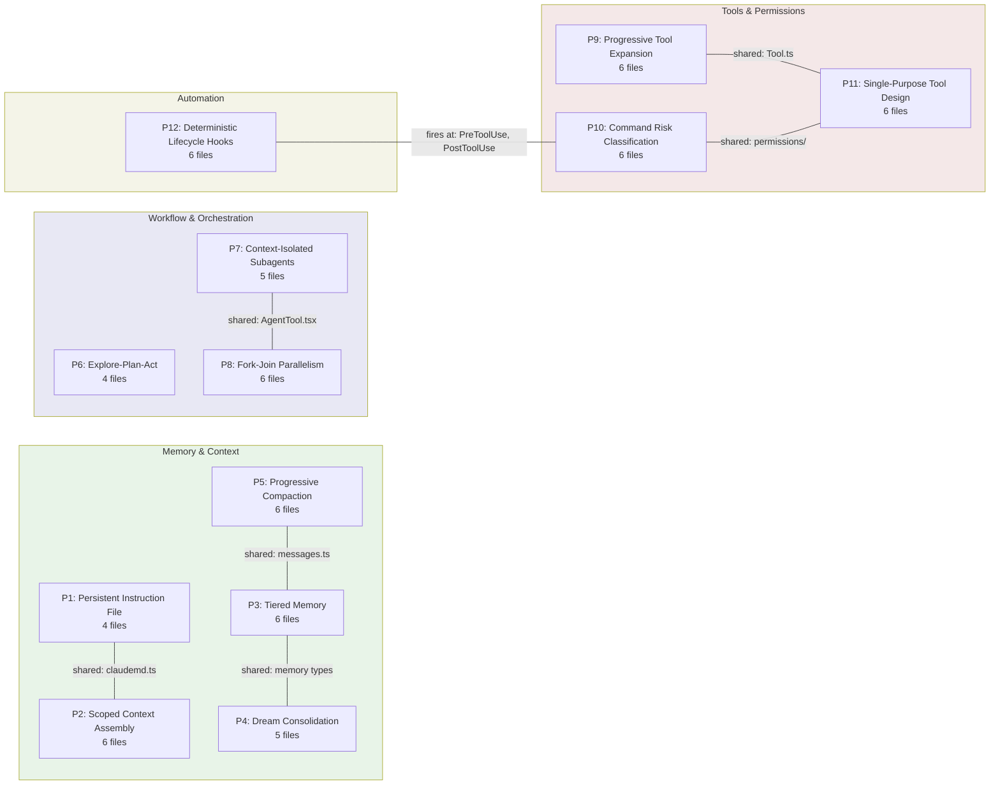

# The 12 HER Patterns Mapped to CC

## Overview

The Harness Engineering Report identifies twelve structural patterns that recur across agentic systems built on top of language models. These patterns are not abstractions imposed from the outside -- they were reverse-engineered from Claude Code's own architecture and then generalized into a taxonomy that applies to any harness. This chapter performs the reverse mapping: starting from each of the twelve HER patterns and tracing it to the concrete files, types, functions, and control flows that implement it in the cc codebase at commit `a371abb`.

The mapping is systematic but not one-to-one. Some patterns are realized by a single, well-bounded subsystem (Pattern 12, Deterministic Lifecycle Hooks, maps almost entirely to `src/schemas/hooks.ts` and `src/utils/hooks.ts`). Other patterns are diffused across the entire architecture (Pattern 2, Scoped Context Assembly, touches the system prompt builder, the CLAUDE.md discovery pipeline, the settings cascade, and the session memory extractor). The tables that follow record every implementation locus with file paths and line ranges, providing a navigational index that the earlier chapter-by-chapter treatment could not offer in a single view.

The twelve patterns divide into four groups: Memory and Context (Patterns 1--5), Workflow and Orchestration (Patterns 6--8), Tools and Permissions (Patterns 9--11), and Automation (Pattern 12). Each group shares a common architectural concern, and the patterns within a group interact more tightly than patterns across groups. The diagrams at the end of this section visualize both the group structure and the coverage density -- how many source files participate in each pattern's implementation.

## Data structures and contracts

The twelve patterns are defined in the HER excerpt as a taxonomy with four groups. Each pattern has a short name and a one-line summary. The table below reproduces the taxonomy for reference, then the subsequent sections map each pattern to its cc implementation.

| # | Group | Pattern Name | HER Summary |
|---|-------|-------------|-------------|
| 1 | Memory & Context | Persistent Instruction File | CLAUDE.md auto-loaded at session start |
| 2 | Memory & Context | Scoped Context Assembly | Multi-level instruction loading (org -> user -> project -> directory) |
| 3 | Memory & Context | Tiered Memory | Compact index always in context; topic files on demand; full transcripts on disk |
| 4 | Memory & Context | Dream Consolidation | Background processes review, deduplicate, prune memory during idle time |
| 5 | Memory & Context | Progressive Context Compaction | Four layers: HISTORY_SNIP, Microcompact, CONTEXT_COLLAPSE, Autocompact |
| 6 | Workflow & Orchestration | Explore-Plan-Act Loop | Three phases with escalating permissions |
| 7 | Workflow & Orchestration | Context-Isolated Subagents | Separate context windows per phase; research agents cannot edit |
| 8 | Workflow & Orchestration | Fork-Join Parallelism | Multiple subagents in isolated git worktrees; cached parent context reuse |
| 9 | Tools & Permissions | Progressive Tool Expansion | Start with <20 tools; activate more on demand |
| 10 | Tools & Permissions | Command Risk Classification | Deterministic pre-parsing and per-tool permission gating |
| 11 | Tools & Permissions | Single-Purpose Tool Design | FileReadTool, FileEditTool, GrepTool each with individual permission rules |
| 12 | Automation | Deterministic Lifecycle Hooks | Shell commands at 25+ lifecycle points |

### Pattern 1: Persistent Instruction File

The `CLAUDE.md` file is the canonical persistent instruction file. It is discovered by the `getMemoryFiles` function in `src/utils/claudemd.ts`, which walks the filesystem from the repository root to the current working directory, loading every `CLAUDE.md` file it encounters. The function respects the settings cascade: the `isSettingSourceEnabled()` check gates each phase of discovery, and the `claudeMdExcludes` setting can suppress specific files.

```typescript
// src/utils/claudemd.ts:L229-L243 — MemoryFileInfo type
export type MemoryFileInfo = {
  path: string
  type: MemoryType
  content: string
  parent?: string // Path of the file that included this one
  globs?: string[] // Glob patterns for file paths this rule applies to
  contentDiffersFromDisk?: boolean
  rawContent?: string
}
```

The `MemoryFileInfo` type is the contract that flows from the discovery pipeline into the system prompt assembler. The `globs` field enables conditional activation -- Markdown files in `.claude/rules/` can declare frontmatter `paths` that restrict them to matching file paths. The `type` field maps to the `MemoryType` enum (`Managed`, `User`, `Project`, `Local`, `AutoMem`, `TeamMem`), which mirrors the settings source hierarchy described in Chapter 31. The `processedPaths` set at `src/utils/claudemd.ts:L796` prevents the same file from being loaded twice via `@include` cycles.

**Implementation loci:**

| File | Lines | Role |
|------|-------|------|
| `src/utils/claudemd.ts` | L229--L243 | `MemoryFileInfo` type definition |
| `src/utils/claudemd.ts` | L796 | `processedPaths` dedup guard |
| `src/constants/systemPromptSections.ts` | L8--L14 | Section cache boundary |
| `src/constants/prompts.ts` | L444 | `getSystemPrompt` assembly |

### Pattern 2: Scoped Context Assembly

This pattern is the most diffuse in the codebase. It spans the system prompt builder, the CLAUDE.md pipeline, the settings cascade, and the session memory extractor. The HER describes multi-level instruction loading ordered from org to user to project to directory. In cc, this ordering is realized through three independent but interacting systems:

1. The **settings cascade** loads JSON configuration from five ordered sources (`userSettings`, `projectSettings`, `localSettings`, `flagSettings`, `policySettings`), with later sources overriding earlier ones.

2. The **CLAUDE.md pipeline** walks the filesystem from root to cwd, appending each file's content to the instruction block. Later files (closer to the working directory) receive more weight from the model's attention mechanism.

3. The **system prompt assembler** (`getSystemPrompt` in `src/constants/prompts.ts:L444`) composes a `string[]` where each element is a semantically distinct layer, and downstream code in `src/utils/systemPrompt.ts` selects among default, custom, agent, coordinator, or override prompts.

```typescript
// src/utils/settings/constants.ts:L7-L22 — SettingSource order definition
export const SETTING_SOURCES = [
  // User settings (global)
  'userSettings',

  // Project settings (shared per-directory)
  'projectSettings',

  // Local settings (gitignored)
  'localSettings',

  // Flag settings (from --settings flag)
  'flagSettings',

  // Policy settings (managed-settings.json or remote settings from API)
  'policySettings',
] as const
```

The `SETTING_SOURCES` constant encodes the merge order: "Order matters - later sources override earlier ones." User settings at `~/.claude/settings.json` provide the base; project settings at `.claude/settings.json` override; local settings at `.claude/settings.local.json` override those; CLI flag settings and policy settings have the final word. The `SettingsWithSources` type at `src/utils/settings/settings.ts:L822-L826` preserves the per-source breakdown in merge order for introspection.

**Implementation loci:**

| File | Lines | Role |
|------|-------|------|
| `src/utils/settings/constants.ts` | L7--L22 | `SETTING_SOURCES` merge order |
| `src/utils/settings/settings.ts` | L822--L826 | `SettingsWithSources` type |
| `src/utils/claudemd.ts` | L229--L243 | `MemoryFileInfo` with scoped `globs` |
| `src/constants/prompts.ts` | L444 | `getSystemPrompt` section assembly |
| `src/constants/systemPromptSections.ts` | L8--L14 | `SystemPromptSection` with `cacheBreak` |
| `src/utils/systemPromptType.ts` | L1--L14 | Branded `SystemPrompt` array type |

### Pattern 3: Tiered Memory

The memdir subsystem implements the three-tier memory architecture described in the terminology registry. Tier 1 is the always-loaded `MEMORY.md` index (capped at 200 lines / 25 KB). Tier 2 comprises per-topic `.md` files loaded on demand via relevance retrieval. Tier 3 consists of full session transcripts stored as JSONL on disk but never automatically loaded.

```typescript
// src/memdir/memoryTypes.ts:L14-L21 — Memory type taxonomy and union type
export const MEMORY_TYPES = [
  'user',
  'feedback',
  'project',
  'reference',
] as const

export type MemoryType = (typeof MEMORY_TYPES)[number]
```

The four-type taxonomy constrains what gets stored. The key design principle, stated in `src/memdir/memoryTypes.ts:L6-L8`, is that code patterns, architecture, git history, and file structure are derivable via tools and should not be saved as memories. The `MemoryHeader` type in `src/memdir/memoryScan.ts:L13-L19` carries the `description` field that drives relevance selection, and `findRelevantMemories` in `src/memdir/findRelevantMemories.ts:L13-L16` returns at most five files per query.

Session memory (Chapter 27) provides a complementary Tier 1 artifact: a structured markdown file that persists knowledge about an ongoing conversation across compaction events. The `SessionMemoryConfig` type at `src/services/SessionMemory/sessionMemoryUtils.ts:L18-L29` defines thresholds for when extraction triggers fire.

**Implementation loci:**

| File | Lines | Role |
|------|-------|------|
| `src/memdir/memoryTypes.ts` | L14--L21 | `MEMORY_TYPES` closed taxonomy |
| `src/memdir/memoryScan.ts` | L13--L19 | `MemoryHeader` scan result |
| `src/memdir/findRelevantMemories.ts` | L13--L16 | `RelevantMemory` return type |
| `src/memdir/memdir.ts` | -- | Behavioral prompt and truncation |
| `src/services/SessionMemory/sessionMemoryUtils.ts` | L18--L29 | `SessionMemoryConfig` thresholds |
| `src/services/SessionMemory/sessionMemory.ts` | L240--L264 | Extraction trigger with memoization |

### Pattern 4: Dream Consolidation

The DreamTask subsystem implements background memory consolidation during idle periods. The auto-dream service checks firing conditions on every agent turn, acquires a filesystem-based lock to serialize access, and launches a forked subagent to perform the consolidation work.

```typescript
// src/services/autoDream/autoDream.ts:L58-L66 — AutoDreamConfig and defaults
type AutoDreamConfig = {
  minHours: number
  minSessions: number
}

const DEFAULTS: AutoDreamConfig = {
  minHours: 24,
  minSessions: 5,
}
```

The gating logic ensures consolidation fires only when two conditions are met simultaneously: enough time has elapsed since the last consolidation (default 24 hours), and enough new sessions have accumulated (default 5). The `DreamTaskState` type at `src/tasks/DreamTask/DreamTask.ts:L25-L41` carries the phase, files touched, and a ring buffer of recent turns. The lock (`src/services/autoDream/consolidationLock.ts`) doubles as both a mutual-exclusion mechanism and a timestamp store for the last successful consolidation. The consolidation prompt structures work into four phases: orient, gather, consolidate, and prune, collapsing the HER's eight phases into a model-driven workflow.

**Implementation loci:**

| File | Lines | Role |
|------|-------|------|
| `src/services/autoDream/autoDream.ts` | L58--L66 | `AutoDreamConfig` with defaults |
| `src/services/autoDream/autoDream.ts` | L122--L273 | `initAutoDream` closure factory |
| `src/services/autoDream/consolidationLock.ts` | -- | Filesystem-based lock |
| `src/services/autoDream/consolidationPrompt.ts` | -- | Four-phase consolidation prompt |
| `src/tasks/DreamTask/DreamTask.ts` | L25--L41 | `DreamTaskState` type |

### Pattern 5: Progressive Context Compaction

The five-stage compaction hierarchy is the most mechanically intricate pattern in the codebase. Each stage trades preservation fidelity for token savings: history_snip preserves all data on disk but hides it from the model; microcompact preserves the tool-use skeleton but replaces result content; autocompact preserves a semantic summary but discards the original turns; the hard reset preserves nothing.

```typescript
// src/services/compact/compact.ts:L299-L310
export interface CompactionResult {
  boundaryMarker: SystemMessage
  summaryMessages: UserMessage[]
  attachments: AttachmentMessage[]
  hookResults: HookResultMessage[]
  messagesToKeep?: Message[]
  userDisplayMessage?: string
  preCompactTokenCount?: number
  postCompactTokenCount?: number
  truePostCompactTokenCount?: number
  compactionUsage?: ReturnType<typeof getTokenUsage>
}
```

The `CompactionResult` interface is the central contract returned by every compaction path. The `boundaryMarker` serves as a seam in the message chain. The `truePostCompactTokenCount` field distinguishes between the compaction API call's total usage and the actual size of the resulting context. HER Section 8 identifies six context management techniques; cc's five-stage hierarchy implements observation masking (via microcompact's tool-result clearing), LLM summarization (via the autocompact path), and progressive compaction (the hierarchy itself) directly, while touching structured note-taking through session memory.

**Implementation loci:**

| File | Lines | Role |
|------|-------|------|
| `src/services/compact/compact.ts` | L299--L310 | `CompactionResult` interface |
| `src/services/compact/autoCompact.ts` | -- | Autocompact gate and threshold |
| `src/services/compact/microCompact.ts` | -- | Microcompact entry and time-based clearing |
| `src/services/compact/sessionMemoryCompact.ts` | -- | Session-memory-based compaction path |
| `src/utils/messages.ts` | L4530--L4555 | `createCompactBoundaryMessage` |
| `src/utils/messages.ts` | L4643--L4656 | `getMessagesAfterCompactBoundary` |

### Pattern 6: Explore-Plan-Act Loop

Plan Mode V2 implements the three-phase escalating permission model. The five sub-phases are: (1) Initial Understanding via parallel explore subagents, (2) Design via plan subagents, (3) Review with human clarification, (4) Final Plan written to a file, and (5) calling ExitPlanMode for approval. Two tools govern entry and exit: `EnterPlanMode` transitions the agent into read-only mode and gates all write-capable tools; `ExitPlanMode` reads the plan from disk, presents it for human approval, and restores the previous permission mode.

```typescript
// src/tools/ExitPlanModeTool/ExitPlanModeV2Tool.ts:L110-L143 — output schema
export const outputSchema = lazySchema(() =>
  z.object({
    plan: z
      .string()
      .nullable()
      .describe('The plan that was presented to the user'),
    isAgent: z.boolean(),
    filePath: z
      .string()
      .optional()
      .describe('The file path where the plan was saved'),
    hasTaskTool: z
      .boolean()
      .optional()
      .describe('Whether the Agent tool is available in the current context'),
    planWasEdited: z
      .boolean()
      .optional()
      .describe(
        'True when the user edited the plan (CCR web UI or Ctrl+G); determines whether the plan is echoed back in tool_result',
      ),
    awaitingLeaderApproval: z
      .boolean()
      .optional()
      .describe(
        'When true, the teammate has sent a plan approval request to the team leader',
      ),
    requestId: z
      .string()
      .optional()
      .describe('Unique identifier for the plan approval request'),
  }),
)
```

The `planWasEdited` field is set when the user modifies the plan content before approving, signaling to the model that it should re-read the plan file rather than relying on its cached version. The `awaitingLeaderApproval` and `requestId` fields enable the teammate approval workflow that extends the pattern to multi-agent teams. The plan file itself is persisted outside the conversation context at `~/.claude/plans/<slug>.md`, making it durable across compaction and session resume.

**Implementation loci:**

| File | Lines | Role |
|------|-------|------|
| `src/tools/ExitPlanModeTool/ExitPlanModeV2Tool.ts` | L110--L143 | Output schema with approval metadata |
| `src/tools/ExitPlanModeTool/ExitPlanModeV2Tool.ts` | L64--L75 | `allowedPrompt` schema for semantic pre-approval |
| `src/utils/planModeV2.ts` | -- | Configuration and agent count functions |
| `src/utils/permissions/PermissionMode.ts` | L34--L91 | Permission mode config with plan mode |

### Pattern 7: Context-Isolated Subagents

The Agent tool creates a fresh context for each subagent invocation. The `AgentToolInput` type at `src/tools/AgentTool/AgentTool.tsx:L132-L138` defines the parameters that control isolation, including `isolation: 'worktree' | 'remote'` and the `cwd` override. The `SubagentContextOverrides` type controls what a child agent shares with its parent -- every field defaults to isolation and sharing requires explicit opt-in.

```typescript
// src/tools/AgentTool/AgentTool.tsx:L132-L138 — AgentToolInput type
type AgentToolInput = z.infer<ReturnType<typeof baseInputSchema>> & {
  name?: string;
  team_name?: string;
  mode?: z.infer<ReturnType<typeof permissionModeSchema>>;
  isolation?: 'worktree' | 'remote';
  cwd?: string;
};
```

The teammate system (Chapter 23) extends this pattern to long-lived agents that share a single process but maintain isolated context windows via `AsyncLocalStorage`. The `InProcessTeammateTaskState` at `src/tasks/InProcessTeammateTask/types.ts:L22-L76` carries an independent `permissionMode` field, ensuring that each teammate's permission posture cycles independently. The `SendMessage` tool provides directed messaging without sharing context, and the `INTERNAL_WORKER_TOOLS` set at `src/coordinator/coordinatorMode.ts:L29-L34` withholds coordinator-only tools from workers.

**Implementation loci:**

| File | Lines | Role |
|------|-------|------|
| `src/tools/AgentTool/AgentTool.tsx` | L132--L138 | `AgentToolInput` with isolation fields |
| `src/tools/AgentTool/AgentTool.tsx` | L82--L88 | Base input schema |
| `src/tools/AgentTool/AgentTool.tsx` | L110--L125 | Feature-gated schema |
| `src/tasks/InProcessTeammateTask/types.ts` | L22--L76 | `InProcessTeammateTaskState` |
| `src/coordinator/coordinatorMode.ts` | L29--L34 | `INTERNAL_WORKER_TOOLS` filter set |

### Pattern 8: Fork-Join Parallelism

The fork-join pattern is realized through three execution modes: sync, fork, and remote. Fork mode is the most architecturally interesting because it achieves prompt cache sharing between parent and child. The `CacheSafeParams` type at `src/utils/forkedAgent.ts:L57-L68` encodes the parameters that must be identical for cache hits: system prompt, user context, system context, tool use context, and fork context messages.

```typescript
// src/utils/forkedAgent.ts:L57-L68 — CacheSafeParams definition
export type CacheSafeParams = {
  /** System prompt - must match parent for cache hits */
  systemPrompt: SystemPrompt
  /** User context - prepended to messages, affects cache */
  userContext: { [k: string]: string }
  /** System context - appended to system prompt, affects cache */
  systemContext: { [k: string]: string }
  /** Tool use context containing tools, model, and other options */
  toolUseContext: ToolUseContext
  /** Parent context messages for prompt cache sharing */
  forkContextMessages: Message[]
}
```

The `lastCacheSafeParams` module-level slot at `src/utils/forkedAgent.ts:L73` is written by `handleStopHooks` after each turn, enabling post-turn forks (prompt suggestions, post-turn summaries, the `/btw` command) to share the main loop's prompt cache. The worktree subsystem (`src/utils/worktree.ts:L140-L154`) provides filesystem isolation: the `WorktreeSession` type records the `originalCwd` and `originalHeadCommit` needed for safe exit, and the `EnterWorktreeTool` / `ExitWorktreeTool` pair manages the lifecycle with slug validation and destructive-operation guards.

**Implementation loci:**

| File | Lines | Role |
|------|-------|------|
| `src/utils/forkedAgent.ts` | L57--L68 | `CacheSafeParams` definition |
| `src/utils/forkedAgent.ts` | L73--L81 | `lastCacheSafeParams` slot and accessors |
| `src/utils/worktree.ts` | L140--L154 | `WorktreeSession` type |
| `src/utils/worktree.ts` | L66--L87 | `validateWorktreeSlug` guard |
| `src/tools/EnterWorktreeTool/EnterWorktreeTool.ts` | L23--L38 | Input schema with slug validation |
| `src/tools/ExitWorktreeTool/ExitWorktreeTool.ts` | L30--L44 | Exit schema with keep/remove action |

### Pattern 9: Progressive Tool Expansion

The ToolSearch mechanism implements the deferred tool pattern. Tools marked with `shouldDefer: true` at `src/Tool.ts:L442` are sent to the model with `defer_loading: true`, requiring a ToolSearch round-trip before the model can call them. The `alwaysLoad` field at `src/Tool.ts:L449` guarantees a tool's full schema appears in the initial prompt, even when ToolSearch is enabled. The `searchHint` field at `src/Tool.ts:L378` provides a short capability phrase for keyword matching.

```typescript
// src/tools/ToolSearchTool/ToolSearchTool.ts:L21-L34 — ToolSearch input and output schemas
export const inputSchema = lazySchema(() =>
  z.object({
    query: z
      .string()
      .describe(
        'Query to find deferred tools. Use "select:<tool_name>" for direct selection, or keywords to search.',
      ),
    max_results: z
      .number()
      .optional()
      .default(5)
      .describe('Maximum number of results to return (default: 5)'),
  }),
)
```

The `parseToolName` function at `src/tools/ToolSearchTool/ToolSearchTool.ts:L132-L161` handles both MCP tools (splitting on `__` separators) and regular tools (splitting on CamelCase boundaries), making keyword search work across the full tool vocabulary. The `maybeInvalidateCache` function at line L91 clears the description cache when the set of deferred tools changes, ensuring stale descriptions do not persist across MCP server connections or feature-flag toggles.

**Implementation loci:**

| File | Lines | Role |
|------|-------|------|
| `src/Tool.ts` | L442 | `shouldDefer` flag |
| `src/Tool.ts` | L449 | `alwaysLoad` flag |
| `src/Tool.ts` | L378 | `searchHint` field |
| `src/tools/ToolSearchTool/ToolSearchTool.ts` | L21--L34 | Input/output schemas |
| `src/tools/ToolSearchTool/ToolSearchTool.ts` | L132--L161 | `parseToolName` keyword search |
| `src/tools/ToolSearchTool/ToolSearchTool.ts` | L91--L100 | `maybeInvalidateCache` freshness |

### Pattern 10: Command Risk Classification

The bash permission pipeline maps every shell command to one of three risk bands: safe (auto-approved), risky (requires approval), or destructive (blocked outright). The `ClassifierResult` type at `src/utils/permissions/bashClassifier.ts:L5-L12` captures the outcome of classification, while `ClassifierBehavior` maps to the three-tier risk model.

```typescript
// src/utils/permissions/bashClassifier.ts:L5-L12 — Classifier result and behavior types
export type ClassifierResult = {
  matches: boolean
  matchedDescription?: string
  confidence: 'high' | 'medium' | 'low'
  reason: string
}

export type ClassifierBehavior = 'deny' | 'ask' | 'allow'
```

Only `high`-confidence matches trigger automatic decisions; medium and low confidence fall through to user prompting. The YOLO scorer (Chapter 33) extends the classifier with transcript-aware classification for auto mode, feeding the entire conversation to a classifier model that evaluates whether the proposed action should be blocked. The `PermissionResult` type in `src/utils/permissions/PermissionResult.ts` extends the tri-valued behavior with a `passthrough` option meaning "no rule matched, escalate to the user." The `BARE_SHELL_PREFIXES` set at `src/tools/BashTool/bashPermissions.ts:L196-L226` prevents the system from ever suggesting permission rules like `Bash(bash:*)` or `Bash(sudo:*)` that would allow arbitrary code execution.

The `useCanUseTool` hook at `src/hooks/useCanUseTool.tsx:L27` is the single entry point that integrates all classification layers -- config rules, hooks, classifiers, and interactive prompts -- into a tiered escalation path.

**Implementation loci:**

| File | Lines | Role |
|------|-------|------|
| `src/utils/permissions/bashClassifier.ts` | L5--L12 | `ClassifierResult` and `ClassifierBehavior` |
| `src/utils/permissions/yoloClassifier.ts` | L252--L258 | YOLO response schema |
| `src/tools/BashTool/bashPermissions.ts` | L196--L226 | `BARE_SHELL_PREFIXES` safety set |
| `src/tools/BashTool/bashPermissions.ts` | L1663--L2622 | `bashToolHasPermission` entry point |
| `src/utils/permissions/PermissionMode.ts` | L34--L91 | Permission mode config |
| `src/hooks/useCanUseTool.tsx` | L27--L54 | Hook entry point with tiered escalation |

### Pattern 11: Single-Purpose Tool Design

The file system tool family is the canonical example: FileReadTool, FileWriteTool, FileEditTool, GlobTool, GrepTool, and NotebookEditTool each expose a single, narrow capability. This separation allows permission rules, model prompts, and safety checks to be calibrated per operation. The `Tool` type at `src/Tool.ts:L362-L405` encodes this through the `isReadOnly`, `isConcurrencySafe`, and `isDestructive` behavioral flags.

```typescript
// src/Tool.ts:L362-L405 — Tool type definition (key fields)
export type Tool<
  Input extends AnyObject = AnyObject,
  Output = unknown,
  P extends ToolProgressData = ToolProgressData,
> = {
  aliases?: string[]
  searchHint?: string
  call(
    args: z.infer<Input>,
    context: ToolUseContext,
    canUseTool: CanUseToolFn,
    parentMessage: AssistantMessage,
    onProgress?: ToolCallProgress<P>,
  ): Promise<ToolResult<Output>>
  description(
    input: z.infer<Input>,
    options: {
      isNonInteractiveSession: boolean
      toolPermissionContext: ToolPermissionContext
      tools: Tools
    },
  ): Promise<string>
  readonly inputSchema: Input
  readonly inputJSONSchema?: ToolInputJSONSchema
  outputSchema?: z.ZodType<unknown>
  inputsEquivalent?(a: z.infer<Input>, b: z.infer<Input>): boolean
  isConcurrencySafe(input: z.infer<Input>): boolean
  isEnabled(): boolean
  isReadOnly(input: z.infer<Input>): boolean
  isDestructive?(input: z.infer<Input>): boolean
  // ...
```

The `AnyObject` constraint at `src/Tool.ts:L343` ensures every tool's input is a Zod schema that produces a record with string keys. The `isConcurrencySafe` method determines whether a tool invocation can run alongside others; the `interruptBehavior` method at `src/Tool.ts:L416` controls what happens when the user submits a new message while a tool is running. The three behavioral flags form a lattice: a tool can be read-only and concurrency-safe (like GrepTool), read-only but not concurrency-safe (if it acquires locks), or neither (like BashTool).

The FileEditTool input schema at `src/tools/FileEditTool/types.ts:L6-L19` demonstrates single-purpose design in action: the schema carries exactly four fields (`file_path`, `old_string`, `new_string`, `replace_all`) with no optional escape hatches beyond what the edit operation requires.

**Implementation loci:**

| File | Lines | Role |
|------|-------|------|
| `src/Tool.ts` | L362--L405 | `Tool` type with behavioral flags |
| `src/Tool.ts` | L343 | `AnyObject` input constraint |
| `src/Tool.ts` | L416 | `interruptBehavior` method |
| `src/tools/FileEditTool/types.ts` | L6--L19 | FileEdit input schema |
| `src/tools/FileReadTool/` | -- | Read-only tool with dedup |
| `src/tools/BashTool/BashTool.tsx` | L227--L247 | Bash input schema |

### Pattern 12: Deterministic Lifecycle Hooks

The hook system spans four layers: a Zod schema layer (`src/schemas/hooks.ts`), a settings integration layer (`src/utils/hooks/hooksSettings.ts`, `src/utils/hooks/hooksConfigManager.ts`), an execution engine (`src/utils/hooks.ts`), and an event-broadcast system (`src/utils/hooks/hookEvents.ts`). The `HookCommandSchema` discriminated union at `src/schemas/hooks.ts:L176-L189` composes four concrete hook types: `command` (shell subprocess), `prompt` (single LLM call), `agent` (multi-turn LLM subagent), and `http` (HTTP POST).

```typescript
// src/schemas/hooks.ts:L176-L189 — HookCommandSchema discriminated union
export const HookCommandSchema = lazySchema(() => {
  const {
    BashCommandHookSchema,
    PromptHookSchema,
    AgentHookSchema,
    HttpHookSchema,
  } = buildHookSchemas()
  return z.discriminatedUnion('type', [
    BashCommandHookSchema,
    PromptHookSchema,
    AgentHookSchema,
    HttpHookSchema,
  ])
})
```

Function hooks are deliberately absent from this union because they carry a JavaScript callback that cannot be serialized to JSON. They are defined separately in `src/utils/hooks/sessionHooks.ts` with a `FunctionHookCallback` type at line L14 that accepts messages and an optional abort signal, returning a boolean. The 25+ lifecycle events are enumerated in `src/entrypoints/sdk/coreTypes.ts:L25-L53`, spanning the full agent lifecycle from `PreToolUse` and `PostToolUse` through `SessionStart`, `SessionEnd`, `Stop`, `SubagentStart`, and `TaskCompleted`.

**Implementation loci:**

| File | Lines | Role |
|------|-------|------|
| `src/schemas/hooks.ts` | L176--L189 | `HookCommandSchema` discriminated union |
| `src/schemas/hooks.ts` | L32--L65 | `BashCommandHookSchema` definition |
| `src/utils/hooks/sessionHooks.ts` | L14--L31 | `FunctionHookCallback` type |
| `src/entrypoints/sdk/coreTypes.ts` | L25--L53 | Lifecycle event enumeration |
| `src/utils/hooks.ts` | -- | `runHooks` dispatch generator |
| `src/utils/hooks/hooksSettings.ts` | -- | Settings integration |

## Control flow

The twelve patterns do not execute in isolation. A typical tool dispatch in cc triggers Pattern 12 (lifecycle hooks fire before and after the tool call), Pattern 10 (risk classification determines whether the tool call proceeds), Pattern 11 (the single-purpose tool's own validation runs), and Pattern 5 (if the context window is full, compaction fires before the next turn). The diagram below captures the pattern-to-implementation mapping at the file level.

```mermaid
classDiagram
    class HER_Pattern {
        +number id
        +string name
        +string group
    }

    class ImplementationFile {
        +string path
        +string role
    }

    HER_Pattern "1" --> "1..n" ImplementationFile : realized_in

    class P1 {
      Persistent Instruction File
    }
    class P2 {
      Scoped Context Assembly
    }
    class P3 {
      Tiered Memory
    }
    class P4 {
      Dream Consolidation
    }
    class P5 {
      Progressive Compaction
    }
    class P6 {
      Explore-Plan-Act
    }
    class P7 {
      Context-Isolated Subagents
    }
    class P8 {
      Fork-Join Parallelism
    }
    class P9 {
      Progressive Tool Expansion
    }
    class P10 {
      Command Risk Classification
    }
    class P11 {
      Single-Purpose Tool Design
    }
    class P12 {
      Deterministic Lifecycle Hooks
    }

    P1 --> claudemd_ts : claudemd.ts
    P1 --> prompts_ts : prompts.ts
    P2 --> claudemd_ts
    P2 --> settings_ts : settings.ts
    P2 --> systemPromptSections_ts : systemPromptSections.ts
    P3 --> memdir_ts : memdir/*.ts
    P3 --> sessionMemory_ts : SessionMemory/*.ts
    P4 --> autoDream_ts : autoDream/*.ts
    P4 --> dreamTask_ts : DreamTask/*.ts
    P5 --> compact_ts : compact/*.ts
    P5 --> messages_ts : messages.ts
    P6 --> exitPlanMode_ts : ExitPlanModeTool/
    P6 --> planModeV2_ts : planModeV2.ts
    P7 --> agentTool_tsx : AgentTool.tsx
    P7 ├── coordinatorMode_ts : coordinatorMode.ts
    P8 --> forkedAgent_ts : forkedAgent.ts
    P8 --> worktree_ts : worktree.ts
    P9 --> toolSearchTool_ts : ToolSearchTool/
    P9 --> tool_ts : Tool.ts
    P10 --> bashClassifier_ts : bashClassifier.ts
    P10 --> yoloClassifier_ts : yoloClassifier.ts
    P10 ├── useCanUseTool_tsx : useCanUseTool.tsx
    P11 --> tool_ts
    P11 ├── fileEditTool_ts : FileEditTool/
    P12 --> hooks_ts : hooks.ts
    P12 ├── hooksSchema_ts : hooks.ts schemas
```

The flowchart below shows the coverage density: how many primary source files participate in each pattern. Patterns 2 and 10 have the broadest surface area because they interact with the settings cascade and the permission pipeline respectively, both of which span multiple modules.



The shared-file edges reveal the architectural couplings. `src/Tool.ts` participates in both Pattern 9 (through `shouldDefer` and `alwaysLoad`) and Pattern 11 (through the behavioral flags `isReadOnly`, `isConcurrencySafe`, `isDestructive`). `src/utils/claudemd.ts` participates in both Pattern 1 and Pattern 2 because the CLAUDE.md discovery pipeline serves both as a persistent instruction file and as a scoped context source. `src/utils/messages.ts` bridges Pattern 3 and Pattern 5 because the compaction boundary markers and the session chain reconstruction are both message-model primitives. Pattern 12 hooks fire at `PreToolUse` and `PostToolUse`, creating a direct interaction with Pattern 10's risk classification pipeline -- a hook can block, modify, or approve a tool call before the classifier even runs.

## Edge cases and failure modes

Several patterns have failure modes that arise from the interactions between them rather than from any single pattern in isolation.

**Compaction vs. memory consistency.** When autocompact fires (Pattern 5), it replaces the conversation with a summary. If the session memory extractor (Pattern 3) has not yet run because the token-growth threshold has not been reached, the compaction may discard context that the memory file never captured. The `SessionMemoryConfig.minimumTokensBetweenUpdate` at `src/services/SessionMemory/sessionMemoryUtils.ts:L18-L29` is designed to prevent this by triggering extraction well before the autocompact threshold, but a rapid series of tool calls can outrun the extraction loop. The `toolCallsBetweenUpdates` threshold (default 3) provides a secondary gating mechanism, but it too can be outrun during burst activity.

**Fork cache invalidation.** The `lastCacheSafeParams` slot at `src/utils/forkedAgent.ts:L73` is written by `handleStopHooks` after each turn. If a stop hook modifies the system prompt or tool list (Pattern 12 interacting with Pattern 8), the saved cache params become stale. The `saveCacheSafeParams` function does not validate that the params are still current -- it trusts that the caller has captured them at the right moment. A hook that adds or removes tools between the main loop's completion and the fork's launch can cause a cache miss that silently degrades to full input-token cost.

**Worktree exit with uncommitted changes.** The `ExitWorktreeTool` at `src/tools/ExitWorktreeTool/ExitWorktreeTool.ts:L30-L44` requires `discard_changes: true` when removing a worktree with uncommitted files or unmerged commits. If the user or agent calls `ExitWorktreeTool` with `action: "remove"` but omits `discard_changes`, the tool refuses and lists the changes, preventing data loss. However, the `isDestructive` method returns `true` only when `action === 'remove'` (`src/tools/ExitWorktreeTool/ExitWorktreeTool.ts:L168-L170`), meaning the permission system treats the `keep` action as non-destructive even when the worktree contains sensitive data that will persist on disk indefinitely.

**Classifier stub for external builds.** The bash classifier at `src/utils/permissions/bashClassifier.ts` opens with the comment `// Stub for external builds - classifier permissions feature is ANT-ONLY`. Every function returns a no-op result. This means that the full Pattern 10 implementation is not available in the open-source distribution -- the type definitions and contract signatures are present, but the runtime logic is compiled out. Developers building on the external build must implement their own risk classification or rely entirely on the interactive permission dialog.

## Where cc diverges from the published pattern

The HER patterns were derived from cc's architecture and then generalized. In some cases, cc's implementation is more specific than the pattern suggests; in others, cc makes tradeoffs that the pattern does not account for.

**Pattern 4 divergence: four phases vs. eight phases.** The HER specifies eight consolidation phases (scan, classify, deduplicate, prune, consolidate, compress, reorganize, verify) and five compaction types. cc's dream consolidation collapses these into four prompt-driven phases (orient, gather, consolidate, prune) and relies on the model's judgment for sub-steps like classification and verification. This tradeoff favors simplicity and prompt-driven flexibility over the deterministic multi-phase pipeline the HER envisions. The consequence is that the dream agent may skip verification steps that a more structured pipeline would enforce, producing memories that have not been checked for consistency with the current project state.

**Pattern 5 divergence: five stages vs. four layers.** The HER names four layers: HISTORY_SNIP, Microcompact, CONTEXT_COLLAPSE, and Autocompact. cc implements a fifth stage -- the hard reset -- that discards everything and starts fresh. This escape hatch of last resort is not part of the published pattern but is essential in practice: when autocompact itself fails (e.g., the summarization model returns an error), the hard reset prevents the agent from entering an infinite compaction loop.

**Pattern 7 divergence: shared-process teammates.** The HER's Context-Isolated Subagents pattern assumes subagents run in separate processes with separate context windows. cc's teammate system (Chapter 23) shares a single Node.js process, using `AsyncLocalStorage` for context isolation. This in-process design reduces latency (no IPC overhead) and enables direct tool invocation, but it introduces the risk of shared mutable state. The `InProcessTeammateTaskState` type at `src/tasks/InProcessTeammateTask/types.ts:L22-L76` mitigates this by giving each teammate an independent `permissionMode` and `abortController`, but the underlying `AppState` singleton is shared.

**Pattern 9 divergence: dynamic tool loading vs. all-at-once.** The HER describes starting with fewer than 20 tools and activating more on demand, implying that the initial tool set is fixed. cc's implementation is more nuanced: the `shouldDefer` flag at `src/Tool.ts:L442` marks individual tools as deferred, but the initial set includes all non-deferred tools regardless of count. The progressive expansion is per-tool, not per-category, and the model can discover deferred tools via keyword search or direct selection through ToolSearch.

**Pattern 10 divergence: deterministic-only classification.** The HER describes command risk classification as a deterministic pre-parsing operation. cc extends this with the YOLO scorer (Chapter 33), a probabilistic classifier that evaluates tool actions against the full conversation transcript. This extension is necessary for auto mode, where no human is in the loop to approve commands interactively, but it violates the HER's principle that risk classification must be deterministic. The resolution is architectural: deterministic checks run first and cannot be overridden by the classifier, making the classifier advisory rather than authoritative.

## Developer takeaways for building a long-running agent

The twelve patterns form a coherent toolkit for building agents that survive beyond a single prompt-response cycle. Three principles emerge from the cc mapping that are not immediately obvious from the pattern descriptions alone. First, the patterns interact more than they compose independently -- hooks (Pattern 12) fire inside the tool dispatch path that risk classification (Pattern 10) gates, and compaction (Pattern 5) can destroy context that memory extraction (Pattern 3) has not yet persisted. Designing for these interactions requires thinking about ordering constraints and race conditions across pattern boundaries, not just about each pattern in isolation. Second, every pattern has a cost-control dimension. Tiered memory avoids loading everything into context. Progressive tool expansion avoids listing every tool in the prompt. Compaction avoids hitting the context window ceiling. Dream consolidation avoids paying the cost of memory maintenance during active work. The agent that ignores cost control will work for the first few turns and then degrade as token budgets saturate. Third, the divergence between cc's implementation and the published patterns is itself instructive. The four-vs-eight-phase consolidation, the fifth compaction stage, the shared-process teammates, and the probabilistic classifier all represent pragmatic tradeoffs where cc chose simplicity, robustness, or latency over strict adherence to the pattern. A harness builder should treat the patterns as architectural guidance, not as a specification, and expect to make similar tradeoffs when the pattern's assumptions do not hold for their deployment context.
