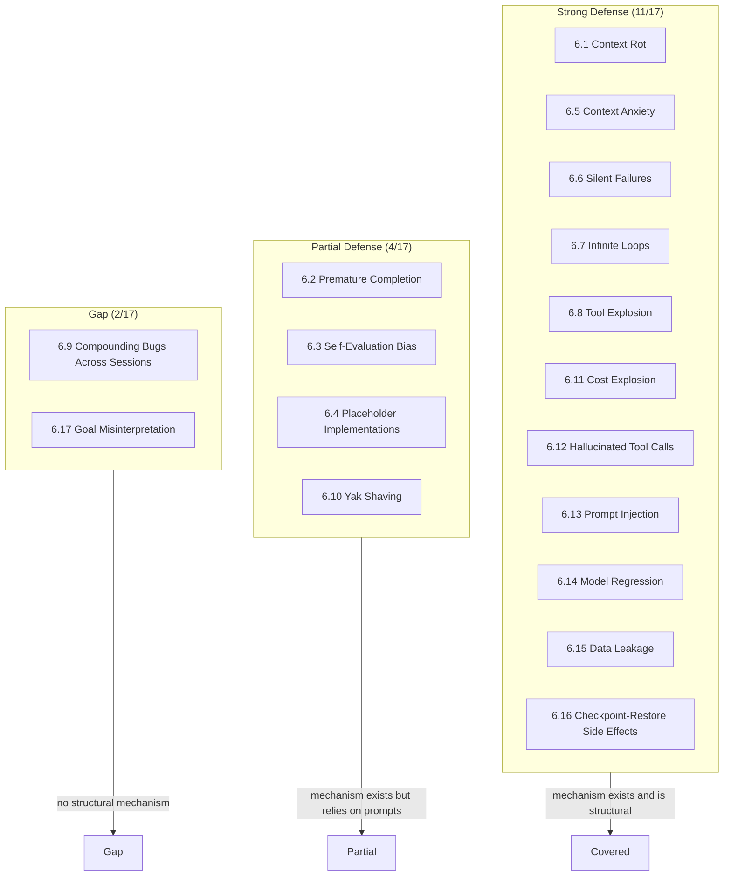
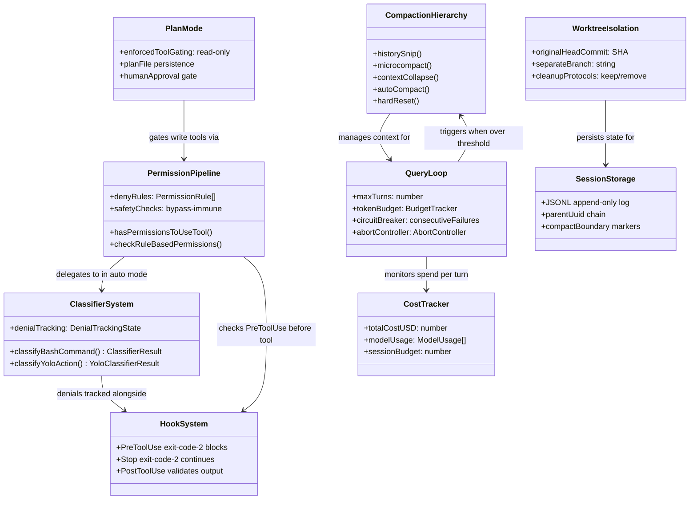

# The 17 Failure Modes: How CC Defends (or Doesn't)

## Overview

The Harness Engineering Report identifies 17 failure modes that afflict long-running agent systems. They range from the subtle (context rot degrading performance 30%+ before anyone notices) to the catastrophic (cost explosions burning thousands of dollars in unattended loops). This chapter assesses each failure mode against cc's actual implementation, determining which defenses exist, how they work, and where gaps remain.

The assessment draws on the full corpus of prior chapters: the compaction hierarchy (Chapter 28) for context management, the permission pipeline (Chapter 32) for tool-gating defenses, the bash classifier (Chapter 33) for command risk assessment, filesystem guards (Chapter 34) for path protection, the hook system (Chapter 36) for lifecycle intervention, the query loop (Chapter 7) for loop control, token budgets (Chapter 10) for resource back-pressure, plan mode (Chapter 45) for premature action prevention, worktrees (Chapter 46) for isolation, web tools (Chapter 16) for SSRF defense, session persistence (Chapter 29) for cross-session integrity, the tool dispatch pipeline (Chapter 12) for input validation, and the agent tool (Chapter 18) for subagent containment.

The result is a mixed picture. cc defends strongly against 11 of the 17 failure modes, partially against 4, and has meaningful gaps in 2. The strongest defenses cluster around tool execution safety (failures 6.6, 6.7, 6.8, 6.12, 6.13) and context management (failures 6.1, 6.5). The weakest defenses cluster around cross-session integrity (failure 6.9) and specification gaming (failure 6.17). The following diagram summarizes the coverage landscape.



## Data structures and contracts

The failure modes are not tracked by a single data structure in the codebase. Instead, each defense is implemented by a distinct subsystem with its own types. The following class diagram shows how the defense layers relate across the codebase.



The `DenialTrackingState` type is the most directly relevant contract for the loop-prevention failure modes. It captures both the consecutive and total denial counters:

```typescript
// src/utils/permissions/denialTracking.ts:L7-L15 — Denial tracking state and limits
export type DenialTrackingState = {
  consecutiveDenials: number
  totalDenials: number
}

export const DENIAL_LIMITS = {
  maxConsecutive: 3,
  maxTotal: 20,
} as const
```

The `consecutiveDenials` counter resets to zero on any allowed tool use. The `totalDenials` counter only accumulates upward during a session. The limits --- 3 consecutive or 20 total --- are the thresholds at which the system stops auto-denying and falls back to human prompting. These two counters serve as circuit breakers for both the infinite-loop failure mode (6.7) and the cost-explosion failure mode (6.11), since repeated denials indicate either a looping agent or one that cannot self-correct.

The `AutoCompactTrackingState` type provides the analogous circuit breaker for compaction failures:

```typescript
// src/services/compact/autoCompact.ts:L51-L60 — Autocompact circuit breaker state
export type AutoCompactTrackingState = {
  compacted: boolean
  turnCounter: number
  turnId: string
  consecutiveFailures?: number
}
```

When `consecutiveFailures` reaches `MAX_CONSECUTIVE_AUTOCOMPACT_FAILURES` (3), subsequent calls to `autoCompactIfNeeded` return immediately without attempting compaction. Production data from 2026-03-10 identified 1,279 sessions with 50+ consecutive failures in a single session, wasting approximately 250K API calls per day globally before this breaker was added.

## Control flow

### Failure mode 6.1: Context Rot

**Assessment: Strong defense.** cc's five-stage compaction hierarchy directly targets the mid-window degradation that HER identifies as the hallmark of context rot. The hierarchy operates at different escalation levels: history snip removes the oldest turns from the model view while preserving them on disk, microcompact selectively clears verbose tool results, context collapse preserves structured conversation segments through a granular commit/rollback protocol, autocompact replaces older turns with a model-generated or session-memory summary, and hard reset discards everything.

The key mechanism is that compaction aggressively shrinks the effective window before mid-window rot can set in. The `shouldAutoCompact` function at `src/services/compact/autoCompact.ts:L160-L239` triggers when token usage exceeds the effective context window minus 13,000 buffer tokens. The `calculateTokenWarningState` function computes four graduated thresholds --- warning, error, autocompact, and blocking --- that catch context pressure before it degrades performance. Microcompact's time-based clearing fires when the gap since the last assistant message exceeds 60 minutes (matching the server cache TTL), clearing old tool results at zero marginal cost.

The session-memory compact path provides a particularly effective mitigation. The `trySessionMemoryCompaction` function at `src/services/compact/autoCompact.ts:L287-L310` is tried before the legacy model-summarization path, preserving recent messages intact (suffix-preserving rather than full-replacement) while replacing older context with a structured summary from the session memory file. This means the most recent and most relevant conversation turns survive compaction in their original form, while the older context that would otherwise sit in the vulnerable mid-window position is replaced with a compressed representation.

The remaining gap is that compaction is reactive, not predictive. It fires after token usage crosses a threshold, not when mid-window degradation is first detectable. There is no mechanism to proactively reposition critical information from the middle of the window to the edges where attention is strongest. Observation masking --- replacing verbose tool outputs with compressed summaries before feeding them back into the model context --- is implemented through microcompact's tool-result clearing, but the clearing is gated behind feature flags and ant-only user type checks rather than being the default behavior for all users, as noted in Chapter 28.

### Failure mode 6.2: Premature Completion

**Assessment: Partial defense.** The HER recommends a comprehensive JSON feature list with all items initially marked "failing" --- an explicit checklist that the agent must verify one by one. cc's defense relies on two softer mechanisms.

First, the `Stop` hook event allows a deterministic check at the moment the model concludes its response. A `Stop` hook that exits with code 2 forces the model to continue working instead of concluding its turn. The hook receives the model's output and can inspect it for completeness. This is the mechanism behind premature-completion prevention as described in Chapter 36: the `Stop` event metadata at `src/utils/hooks/hooksConfigManager.ts:L95-L99` documents that exit code 2 "show stderr to model and continue conversation."

Second, plan mode (Chapter 45) enforces a structured Explore-Plan-Act workflow that requires the agent to investigate before acting. The `ExitPlanModeV2Tool` presents the plan for human approval before execution begins, providing a checkpoint where premature conclusions can be caught.

The gap is that neither mechanism is structural. The `Stop` hook must be explicitly configured by the user or project --- it does not ship as a default. Plan mode is opt-in. Without these, the model can declare work done too early with no automated check to stop it. The HER's recommended fix (a feature list with all items initially marked failing) is not implemented as a built-in guardrail.

### Failure mode 6.3: Self-Evaluation Bias

**Assessment: Partial defense.** The HER recommends a separate evaluator agent in a fresh context window. cc has the machinery for this --- the Agent tool can spawn subagents with isolated contexts, and the forked-agent architecture (Chapter 19) provides process-level isolation. The `context: fork` option on skills (Chapter 38) runs the skill in an isolated subagent rather than expanding it inline.

However, cc does not implement self-evaluation as a default pipeline step. There is no built-in evaluator agent that runs after the model declares completion. The `/review` skill and the `simplify` skill provide templates for code review, but they are user-invoked, not automatic. The generator-evaluator pattern identified in HER section 9.2 is available as an orchestration option but not enforced as a structural defense.

The gap is significant: without a mandatory evaluation step, the model's self-assessment is the only quality gate. The HER warns that agents rate their own work too generously, and cc's architecture does not structurally prevent this.

### Failure mode 6.4: Placeholder Implementations

**Assessment: Partial defense.** The HER identifies the root cause as agents defaulting to stubs because compiling triggers reward signals. The recommended fix is explicit anti-placeholder instructions.

cc's defense is purely prompt-based. The system prompt (Chapter 9) instructs the model to produce complete, working implementations. The `Stop` hook mechanism (discussed under failure 6.2) could be configured to detect placeholder patterns like `// TODO`, `throw new Error("not implemented")`, or empty function bodies. But this is not a default.

The gap is that there is no structural check in the tool dispatch pipeline (Chapter 12) that inspects file-write content for placeholder patterns. A `Write` or `Edit` tool call that writes a stub function proceeds through the permission pipeline without any content-quality validation. The `PostToolUse` hook could perform this check, but again, it requires explicit configuration. The destructive-command warning system at `src/tools/BashTool/destructiveCommandWarning.ts:L12-L89` shows that cc already has the infrastructure for pattern-based content inspection --- it detects git data loss, file deletion, and database destruction patterns in bash commands. Extending this pattern-matching approach to file-write content for placeholder detection would be architecturally straightforward but is not currently implemented.

### Failure mode 6.5: Context Anxiety

**Assessment: Strong defense.** The HER identifies the symptom as models prematurely wrapping up near perceived context limits. The fix is context resets with structured handoffs rather than pushing to the limit.

cc's compaction hierarchy directly addresses this. Autocompact fires when token usage reaches the effective context window minus 13,000 tokens, well before the hard limit. The session-memory compact path (Chapter 28) preserves recent messages intact while replacing older context with a structured summary, providing a clean handoff. The `CompactionResult` type at `src/services/compact/compact.ts:L299-L310` includes a `boundaryMarker` that serves as a structural seam, `summaryMessages` that provide the compressed representation, and `attachments` that re-inject critical context (file contents, plan files, skill content, delta announcements).

The key insight is that cc never lets the context window hit the hard API limit silently. The graduated warning system (`calculateTokenWarningState`) produces four thresholds that the UI and compaction system consume before the blocking limit is reached. When the blocking limit is hit, the agent cannot continue without compaction or manual intervention, preventing the model from silently degrading its output quality due to context pressure.

### Failure mode 6.6: Silent Failures

**Assessment: Strong defense.** The HER identifies the symptom as agents proceeding after tool errors as if successful. The fix is structured output validation after every tool call.

cc validates every tool call's input through Zod schema parsing before execution. The `tool.inputSchema.parse(input)` call at `src/utils/permissions/permissions.ts:L1216` validates the raw model output against the tool's declared schema. When validation fails, the catch block at `src/utils/permissions/permissions.ts:L1221-L1224` logs the error and falls through to the permission result, which defaults to `ask` (prompting the user). The tool dispatch pipeline (Chapter 12) wraps every tool call in a try-catch that produces a structured error result when exceptions occur.

The `PostToolUse` hook event provides a second validation layer. A hook that inspects tool output and exits with code 2 on unexpected results can block the result from reaching the model. The `PostToolUseFailure` event fires specifically on tool execution errors, giving hooks a dedicated interception point.

The tool result itself is structured: `ToolResult<T>` at `src/Tool.ts:L321-L336` carries typed data and optional `newMessages`, making it difficult for an error to masquerade as success. Non-zero bash exit codes are surfaced as error-annotated results rather than silently ignored.

### Failure mode 6.7: Infinite Loops

**Assessment: Strong defense.** The HER identifies the symptom as retry without progress. The fix is maximum retry counts, exponential backoff, and loop detection.

cc implements multiple layers of loop prevention. The denial tracking system at `src/utils/permissions/denialTracking.ts:L7-L15` limits consecutive denials to 3 and total denials to 20 before falling back to human prompting. When the auto-mode classifier blocks the same type of action repeatedly, the system recognizes the loop and escalates.

The query loop (Chapter 7) enforces `maxTurns` from `QueryParams` at `src/query.ts:L195`, capping the total number of iterations. The `maxOutputTokensRecoveryCount` field in the loop's `State` object at `src/query.ts:L211` caps recovery attempts at `MAX_OUTPUT_TOKENS_RECOVERY_LIMIT` (3), preventing infinite retry on max-output-token errors.

The autocompact circuit breaker at `src/services/compact/autoCompact.ts:L70` stops compaction attempts after 3 consecutive failures, preventing the compaction system itself from entering an infinite retry loop. The `RecompactionInfo` type at `src/services/compact/compact.ts:L317-L323` tracks whether a compaction is a re-compaction in the same chain, enabling detection of recompaction loops.

### Failure mode 6.8: Tool Explosion

**Assessment: Strong defense.** The HER identifies the symptom as too many tools degrading selection accuracy. The fix is progressive tool expansion starting with fewer than 20.

cc implements progressive tool expansion through the `shouldDefer` and `alwaysLoad` flags on the `Tool` type at `src/Tool.ts:L442-L449`. Deferred tools are sent to the model with `defer_loading: true`, requiring a `ToolSearch` round-trip before the model can call them. The `searchHint` field at `src/Tool.ts:L378` provides a short capability phrase that ToolSearch uses for keyword matching. The `assembleToolPool()` function at `src/tools.ts:L345-L367` merges built-in tools with MCP tools and sorts each partition alphabetically for prompt-cache stability.

The `SAFE_YOLO_ALLOWLIST` at `src/utils/permissions/classifierDecision.ts:L56-L94` enumerates tools that are inherently safe (read-only file operations, search tools, task management metadata), reducing the classifier's decision surface. The acceptEdits fast-path at `src/utils/permissions/permissions.ts:L600-L656` further reduces the number of tool calls that require classifier evaluation by auto-approving file operations within the working directory.

### Failure mode 6.9: Compounding Bugs Across Sessions

**Assessment: Gap.** The HER identifies the symptom as a new session building on broken state from a previous session. The fix is baseline verification at session start before any new work.

cc's session resume mechanism (Chapter 29) reconstructs conversation state from the JSONL append-only log, but it does not verify the integrity of the external world that the previous session left behind. When a session is resumed via `restoreCostStateForSession` at `src/cost-tracker.ts`, the cost state is rehydrated, but no check confirms that files on disk match what the previous session expected. The `reAppendSessionMetadata` function re-writes the `LastPromptMessage` entry at EOF on every turn, but this is metadata, not a world-state verification.

The `SessionStart` hook event (Chapter 36) provides an interception point where a user-configured command could perform baseline verification. The `Setup` hook event fires even earlier, before the agent loop begins. But these are opt-in, not structural.

The gap is that cc has no built-in mechanism to verify that the filesystem, git state, or running services match the assumptions carried over from the previous session. A session that left a build broken, a database migration half-applied, or a configuration file in an inconsistent state will resume and continue from that broken state without detection.

### Failure mode 6.10: Yak Shaving / Scope Creep

**Assessment: Partial defense.** The HER identifies the symptom as an agent wandering into tangential fixes. The fix is strict single-task-per-session constraints and explicit task boundaries.

Plan mode (Chapter 45) enforces task boundaries through its five-phase workflow, requiring the agent to complete exploration and design before acting. The plan file persisted at `~/.claude/plans/<slug>.md` provides a written scope that the agent and user can reference. The `maxTurns` parameter in `QueryParams` provides a hard ceiling on how many iterations the agent can take.

The token budget system (Chapter 10) implements a form of scope control: the `BudgetTracker` at `src/query/tokenBudget.ts:L6-L11` tracks token consumption, and the diminishing-returns detector at `src/query/tokenBudget.ts:L22-L43` stops the loop when the model is producing fewer and fewer tokens per iteration, indicating it may be wandering.

However, there is no structural mechanism that detects scope creep within a turn. The agent can read and modify files outside the immediate task scope without any automated check that asks "is this still relevant?" The `Stop` hook could be configured to detect scope drift, but this requires explicit user setup.

### Failure mode 6.11: Cost Explosion / Runaway Spending

**Assessment: Strong defense.** The HER identifies this as arguably the number-one operational risk for multi-hour tasks. The fix is per-session and per-task cost caps, real-time token metering, anomaly detection, and dead-letter queues.

cc's cost tracker at `src/cost-tracker.ts` accumulates per-model token usage and dollar spend across an entire session. The `StoredCostState` type at `src/cost-tracker.ts:L71-L80` persists `totalCostUSD`, `totalAPIDuration`, and `modelUsage` to project-level configuration for session resume. The `QueryEngine.submitMessage()` method at `src/QueryEngine.ts:L209-L1156` enforces USD budget limits, blocking further API calls when the budget is exceeded.

The denial tracking system serves as an indirect cost control: after 20 total denials, the system falls back to human prompting, effectively capping the number of autonomous tool calls the agent can make in a session. The autocompact circuit breaker at `src/services/compact/autoCompact.ts:L70` prevents runaway compaction API spending after 3 consecutive failures.

The token budget feature (Chapter 10) adds a proactive control: users can specify a token budget (e.g., "+500k") in their prompt, and the `BudgetTracker` monitors consumption, injecting continuation nudges or stopping the loop when progress stalls. The `StopDecision` at `src/query/tokenBudget.ts:L35-L43` includes a `diminishingReturns` flag that detects when the model is spending tokens without making progress.

The remaining gap is that cost caps are not enforced at the API level --- they are enforced at the client level after receiving usage data. A long-running headless session that loses its network connection to the cost tracker could theoretically exceed its budget before the next check.

### Failure mode 6.12: Hallucinated Tool Calls

**Assessment: Strong defense.** The HER identifies the symptom as agents fabricating tool parameters, calling wrong APIs, or reporting success on actions that silently failed. The fix is schema validation, semantic validation for critical operations, and replay logs for post-hoc audit.

cc validates every tool call's input through Zod schema parsing. The `z.strictObject` on tool input schemas (e.g., `WebFetchTool` at `src/tools/WebFetchTool/WebFetchTool.ts:L24-L46`) rejects extra keys, preventing a hallucinated tool call from sneaking in unrecognized parameters. When the model emits parameters that do not match the schema, the validation fails and the tool call returns an error result.

The tool dispatch pipeline (Chapter 12) wraps every tool call in a structured error handler. Non-existent tool names are rejected at the lookup stage. The `tool.inputSchema.parse(input)` call at `src/utils/permissions/permissions.ts:L1216` provides the first line of defense, and the tool's own `call()` method provides the second.

Session storage (Chapter 29) provides the replay log for post-hoc audit. The JSONL append-only format records every tool call and its result, enabling forensic analysis of what the agent did and why.

### Failure mode 6.13: Security Vulnerabilities / Prompt Injection

**Assessment: Strong defense.** The HER identifies prompt injection as affecting 73% of deployments. The fix is input sanitization, output filtering, least-privilege permissions, and treating all external content as untrusted.

cc implements defense-in-depth against prompt injection across multiple layers. The web tools (Chapter 16) use a secondary-model summarization step that sanitizes fetched content before it reaches the main model. The SSRF guard at `src/utils/hooks/ssrfGuard.ts` blocks private, link-local, and cloud-metadata IP ranges (10.0.0.0/8, 169.254.169.254/16, 172.16.0.0/12, 192.168.0.0/16, 100.64.0.0/10). The filesystem guards protect sensitive paths from modification even in bypass mode:

```typescript
// src/utils/permissions/filesystem.ts:L57-L79 — Dangerous file and directory lists
export const DANGEROUS_FILES = [
  '.gitconfig',
  '.gitmodules',
  '.bashrc',
  '.bash_profile',
  '.zshrc',
  '.zprofile',
  '.profile',
  '.ripgreprc',
  '.mcp.json',
  '.claude.json',
] as const

export const DANGEROUS_DIRECTORIES = [
  '.git',
  '.vscode',
  '.idea',
  '.claude',
] as const
```

These lists protect shell startup scripts, git configuration, IDE settings, and cc's own configuration from being silently modified --- even when the agent is running in `bypassPermissions` mode. The `.claude` directory is included because it contains `settings.json`, hooks, and agent definitions, all of which are vectors for privilege escalation if auto-edited without human review. The `.mcp.json` and `.claude.json` entries protect MCP server configuration, which could be modified to route tool calls through an attacker-controlled server. The preapproved-host mechanism at `src/tools/WebFetchTool/preapproved.ts:L136-L152` splits hosts into O(1) lookup structures for fast verification.

The permission pipeline (Chapter 32) enforces least-privilege through the six permission modes and the rule system. Deny rules at step 1a in `hasPermissionsToUseToolInner` at `src/utils/permissions/permissions.ts:L1171-L1182` cannot be overridden by any mode, including `bypassPermissions`. Safety checks at step 1g are bypass-immune, protecting `.git/`, `.claude/`, `.vscode/`, and shell configuration files.

The YOLO classifier (Chapter 33) provides transcript-aware security: `buildTranscriptEntries` at `src/utils/permissions/yoloClassifier.ts:L302-L360` deliberately excludes model-authored text from the classifier's input, preventing the model from embedding adversarial instructions in its own reasoning that the classifier would then read. The `allowedEnvVars` field on HTTP hooks at `src/schemas/hooks.ts:L97-L100` prevents environment variable exfiltration through header interpolation.

The `allowManagedHooksOnly` policy flag (Chapter 36) suppresses user, project, and local hooks in enterprise environments, preventing a malicious `settings.json` in a cloned repository from executing arbitrary commands. Workspace trust gating at `src/utils/hooks.ts:L286-L296` blocks hooks entirely in untrusted workspaces.

### Failure mode 6.14: Model Regression from Provider Updates

**Assessment: Strong defense.** The HER identifies the symptom as provider updates breaking harness behavior silently. The fix is regression test suites, pinning model versions, and monitoring key metrics after updates.

cc's tool dispatch pipeline provides structural resilience against model regression. The permission pipeline enforces constraints deterministically regardless of model behavior: deny rules, safety checks, and tool-specific `checkPermissions` methods all execute the same code path regardless of which model generated the tool call. A regressed model that produces malformed tool calls will hit Zod validation errors, not security bypasses. The `checkRuleBasedPermissions` function at `src/utils/permissions/permissions.ts:L1071` enforces the same hard-constraint ordering for both normal and bypass paths, ensuring that regression in the model's behavior cannot weaken the permission system's guarantees.

The `fallbackModel` parameter in `QueryParams` at `src/query.ts:L196` provides a model-level fallback: if the primary model is unavailable or producing errors, the query engine can route to an alternative. The GrowthBook feature flag system (Chapter 50) enables runtime configuration changes without code deployment, allowing operators to disable problematic features or switch models after a regression is detected.

The session storage format (Chapter 29) provides the audit trail: every tool call and its result is recorded in the JSONL log, enabling post-hoc comparison of agent behavior across model versions.

### Failure mode 6.15: Data Leakage Between Contexts

**Assessment: Strong defense.** The HER identifies information leaking between sessions, subagents, or through file-based communication. The fix is context isolation via separate file namespaces, cleanup protocols, and ephemeral directories.

cc's subagent architecture provides context isolation at multiple levels. The forked-agent architecture (Chapter 19) runs subagents in separate processes with isolated state, communicating via structured IPC. Worktrees (Chapter 46) provide filesystem isolation: each worktree has its own working tree and branch, preventing file-level collisions. The `originalCwd` and `originalHeadCommit` fields in `WorktreeSession` at `src/utils/worktree.ts:L140-L154` ensure the exit path can restore the session to its pre-worktree state.

Subagent transcripts are stored in separate JSONL files under `<sessionId>/subagents/agent-<agentId>.jsonl` (Chapter 29), preventing conversation history from leaking between agents. The `isSidechain` flag in `TranscriptMessage` at `src/types/logs.ts:L221-L231` routes subagent messages to separate per-agent files.

The `postCompactCleanup` function at `src/services/compact/postCompactCleanup.ts:L31-L77` resets caches and tracking state after compaction, with an `isMainThreadCompact` guard that prevents subagent compaction from corrupting the main thread's state. This guard is essential because subagents run in the same process and share module-level state.

The `stripProtoFields` function at `src/services/analytics/index.ts:L45-L58` strips PII-tagged fields from analytics payloads before they reach non-first-party sinks, preventing data leakage through telemetry.

### Failure mode 6.16: Checkpoint-Restore Side Effects

**Assessment: Strong defense.** The HER identifies the symptom as agents re-synthesizing subtly different requests after restore, causing duplicate payments and credential reuse. The fix is recording irreversible tool effects, enforcing replay-or-fork semantics, and idempotency keys.

cc's session resume mechanism (Chapter 29) reads the JSONL append-only log and reconstructs the conversation chain from leaf to root. The `parentUuid` pointers in `TranscriptMessage` form a tree structure that supports branching and merging:

```typescript
// src/types/logs.ts:L221-L231 — TranscriptMessage with chain metadata
export type TranscriptMessage = SerializedMessage & {
  parentUuid: UUID | null
  logicalParentUuid?: UUID | null
  isSidechain: boolean
  gitBranch?: string
  agentId?: string
  teamName?: string
  agentName?: string
  agentColor?: string
  promptId?: string
}
```

The `parentUuid` field is load-bearing for checkpoint-restore: a null value marks a chain root (either the very first message or a compact boundary), while `logicalParentUuid` preserves the original parent when `parentUuid` is nullified for compact boundaries. This dual-pointer scheme means that restoring a session does not destroy the original chain structure. The `compactBoundary` markers at `src/utils/messages.ts:L4530-L4555` record exactly when compaction occurred, with metadata including the trigger type and pre-compaction token count.

The compaction system records irreversible effects through the attachment mechanism: `CompactionResult` at `src/services/compact/compact.ts:L299-L310` includes `attachments` that re-inject file contents, plan files, and skill content after compaction. This ensures that the restored context includes knowledge of what was done, not just what was said.

The session storage format is append-only, not overwrite. This means that restoring a session does not destroy the original record. If the agent re-synthesizes a request that was already fulfilled, the duplicate action appears in the log alongside the original, enabling post-hoc detection.

The remaining gap is that there is no idempotency-key mechanism at the tool level. A resumed session that re-issues a `Bash(npm publish)` command will execute it a second time. The `SessionStart` hook provides an interception point where idempotency checks could be implemented, but this is not a built-in feature.

### Failure mode 6.17: Goal Misinterpretation / Specification Gaming

**Assessment: Gap.** The HER identifies the symptom as agents optimizing for proxy metrics rather than actual intent. The fix is explicit acceptance criteria, human checkpoints at 25% completion, and decomposing ambiguous goals.

cc has no structural mechanism that detects specification gaming. The permission pipeline validates *how* tools are used (security, access control), not *why* they are used (goal alignment). A model that optimizes for lines of code written rather than correctness, or that passes tests by hardcoding expected values, will not trigger any automated check.

Plan mode (Chapter 45) provides a human checkpoint before execution begins, and the `ExitPlanModeV2Tool` at `src/tools/ExitPlanModeTool/ExitPlanModeV2Tool.ts:L110-L143` presents the plan for human approval. But this checkpoint is at the start of execution, not at 25% completion as the HER recommends. There is no mid-task human review gate.

The `Stop` hook could be configured to perform acceptance-criteria checks, but this requires explicit setup. The `PostToolUse` hook could validate tool outputs against acceptance criteria, but again, this is opt-in. The generator-evaluator pattern (a separate agent evaluating the primary agent's work) is architecturally supported but not enforced as a default. The task system (Chapter 22) provides a structured unit of work with status lifecycle (pending to in_progress to completed) and blocking relationships, which could serve as the scaffolding for acceptance-criteria tracking, but tasks do not currently carry explicit acceptance criteria that the system validates automatically.

The deeper issue is that specification gaming is a semantic failure, not a syntactic one. The permission pipeline can validate that a `Write` tool writes to an allowed path, but it cannot validate that the written content solves the user's actual problem rather than optimizing for a proxy metric. Detecting this would require a second model evaluating the first model's output against the original intent, which is exactly the generator-evaluator pattern that cc supports architecturally but does not enforce structurally.

## Edge cases and failure modes

**Defense-in-depth can produce false negatives.** When multiple layers protect against the same failure mode, a failure that passes through one layer is often caught by another. But the converse is also true: a failure that is not caught by any layer passes through all of them. The 2 gap failure modes (6.9, 6.17) are precisely the failures that no single layer is designed to detect. Compounding bugs across sessions (6.9) occur because session resume reconstructs conversation state without verifying external world state. Goal misinterpretation (6.17) occurs because the permission pipeline validates tool access, not task alignment.

**The partial defenses share a common pattern.** Failures 6.2, 6.3, 6.4, and 6.10 are all defended by mechanisms that exist but are not enforced by default. The `Stop` hook, the evaluator agent, and the scope-checking hook are all opt-in. This is a deliberate design choice: cc prioritizes user autonomy over mandatory guardrails. But it means that users who do not configure these defenses are unprotected against these failure modes.

**Cost controls are client-side, not API-side.** The cost tracker at `src/cost-tracker.ts` monitors spend after each API response, not before each request. This means that a burst of concurrent tool calls (from the streaming tool executor) can exceed the budget before the next check. The `taskBudget` field in `QueryParams` at `src/query.ts:L197` provides a server-side limit, but it is an output-token limit, not a USD limit.

**The classifier can be manipulated.** The YOLO classifier (Chapter 33) uses a language model to evaluate tool-call safety. While the transcript-filtering mechanism (`buildTranscriptEntries`) excludes model-authored text to mitigate indirect prompt injection, the classifier is still probabilistic. A determined adversary who controls file contents that the model reads could craft content that influences the classifier through the main model's tool-use patterns, even without direct access to the classifier's input.

**Cross-session state is not verified.** The session resume mechanism reconstructs conversation state faithfully, but it cannot verify that the external world (files on disk, running services, git state) matches the conversation's assumptions. A resumed session that continues from a broken build will not detect that the build is broken until it encounters an error during tool execution.

## Where cc diverges from the published pattern

The HER presents the 17 failure modes as independent concerns, each with its own fix. cc's implementation reveals three patterns that cut across this taxonomy.

First, the compaction hierarchy (Chapter 28) addresses multiple failure modes simultaneously. Context rot (6.1), context anxiety (6.5), and cost explosion (6.11) are all mitigated by the same mechanism: aggressive context reduction that prevents the context window from filling up. The HER treats these as separate concerns, but in cc's implementation, they share a single defense infrastructure.

Second, the permission pipeline (Chapter 32) serves as a unified interception point for multiple failure modes. Infinite loops (6.7), hallucinated tool calls (6.12), and prompt injection (6.13) are all partially addressed by the same pipeline: deny rules block dangerous commands, Zod validation catches malformed inputs, and safety checks protect sensitive paths. The HER recommends separate fixes for each, but cc implements them as layers in a single pipeline.

Third, the hook system (Chapter 36) provides a programmable defense surface that the HER does not describe. The `Stop` hook addresses premature completion (6.2), the `PreToolUse` hook addresses silent failures (6.6) and prompt injection (6.13), the `PostToolUse` hook addresses placeholder implementations (6.4), and the `SessionStart` hook addresses compounding bugs across sessions (6.9). The exit-code protocol (0 = success, 2 = blocking error, other = non-blocking error) gives hook authors fine-grained control over which failures to catch and how to respond. This programmability means that the gap failure modes (6.9, 6.17) could be partially addressed through hooks, but the burden is on the user to configure them.

The HER's recommended fix for self-evaluation bias (6.3) --- a separate evaluator agent in a fresh context window --- is architecturally supported by cc's forked-agent architecture but not enforced as a default. The HER's recommended fix for goal misinterpretation (6.17) --- human checkpoints at 25% completion --- is not implemented at all. The `ExitPlanModeV2Tool` provides a checkpoint at 0% completion (before any work begins), but there is no structural mechanism for mid-task review.

## Developer takeaways for building a long-running agent

When designing defenses against the 17 failure modes, recognize that some failures share underlying causes and can be addressed by shared infrastructure. Context rot, context anxiety, and cost explosion all stem from unbounded context growth; a compaction hierarchy with graduated escalation addresses all three simultaneously. Place the strongest defenses in the tool dispatch pipeline, not in prompts: deny rules, Zod schema validation, and bypass-immune safety checks are deterministic and cannot be circumvented by model behavior. Use hooks as a programmable defense surface that lets users customize guardrails without modifying the harness. Implement circuit breakers everywhere: denial tracking prevents infinite permission loops, the autocompact breaker prevents runaway API spending, and the diminishing-returns detector prevents token-budget waste. Acknowledge the gaps honestly: cross-session state verification and goal-alignment checking have no clean structural solution in the current architecture, and relying on user-configured hooks for these is a pragmatic but incomplete answer. The two strongest lessons are that defense-in-depth works (multiple layers catch what any single layer misses) and that opt-in defenses are equivalent to absent defenses for users who do not configure them.
