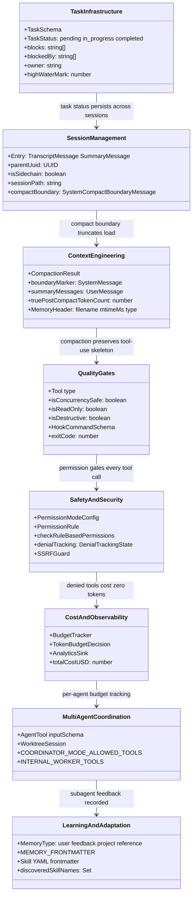
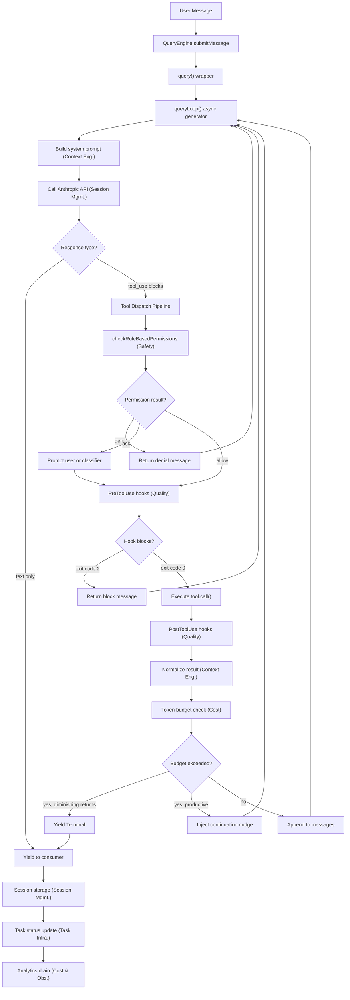

# Reference Architecture: Building a Trustworthy Long-Running Agent

## Overview

A trustworthy long-running agent is not a single program but a stack of interlocking layers, each addressing a distinct failure mode that emerges when a language model operates autonomously over hours or days. This chapter synthesizes the findings from the preceding fifty-four chapters into a reference architecture -- an eight-layer model that maps directly onto cc's implementation and generalizes to any harness that must keep an agent productive, safe, and observable across sessions.

The eight layers are not theoretical. Each one corresponds to a concrete subsystem in cc that was traced in earlier chapters: Task Infrastructure (Chapter 22), Session Management (Chapters 7, 29), Context Engineering (Chapters 26, 28), Quality Gates (Chapters 12, 36), Safety and Security (Chapters 32, 33, 34, 52), Cost and Observability (Chapter 50), Multi-Agent Coordination (Chapters 18, 21, 46), and Learning and Adaptation (Chapters 26, 38). The layers are ordered by abstraction -- from the most concrete (task records on disk) to the most speculative (self-improving harnesses) -- but they interact in every direction. The permission pipeline in the Safety layer gates every tool call in the Quality Gates layer. The compaction hierarchy in the Context Engineering layer determines what the model sees when the Cost layer reports token pressure. The session persistence in Session Management is what makes Learning possible across sessions. Each layer also has a characteristic implementation pattern: Task Infrastructure uses per-file JSON with filesystem locking, Session Management uses append-only JSONL with tombstone deletion, Context Engineering uses model-in-the-loop summarization with boundary markers, Quality Gates uses hook exit codes as a control plane, Safety uses rule evaluation with deny-first precedence, Cost uses mutable tracker state with discriminated-union decisions, Multi-Agent Coordination uses tool-set restriction and worktree isolation, and Learning uses tiered filesystem with frontmatter-indexed retrieval.

The HER excerpt identifies twelve core principles that cut across these layers. The most fundamental is this: context windows are the constraint; structured artifacts are the solution. Every design decision in cc flows from this insight. The `TaskSchema` persists work state to disk because context windows are ephemeral. The `CompactionResult` interface replaces verbose conversation with compressed summaries because context windows overflow. The `WorktreeSession` type isolates parallel agents because context windows cannot safely share mutable state. This chapter shows how each principle manifests as a concrete type, function, or control flow in the cc codebase, and where the implementation diverges from the aspirational architecture the HER describes.

## Data structures and contracts

The reference architecture is not embodied in a single type or file. It is a set of contracts that span the entire codebase, each one enforcing a constraint that prevents a specific class of failure. The class diagram below shows the eight layers and their key data structures.



### The persistent task record

The foundation layer is the task record, defined by `TaskSchema` in `src/utils/tasks.ts`. Every task is a JSON file on disk with a monotonically increasing ID, a status lifecycle, and a dependency graph encoded in `blocks` and `blockedBy` arrays:

```typescript
// src/utils/tasks.ts:L76-L89 — TaskSchema: persistent task record
export const TaskSchema = lazySchema(() =>
  z.object({
    id: z.string(),
    subject: z.string(),
    description: z.string(),
    activeForm: z.string().optional(),
    owner: z.string().optional(),
    status: TaskStatusSchema(),
    blocks: z.array(z.string()),
    blockedBy: z.array(z.string()),
    metadata: z.record(z.string(), z.unknown()).optional(),
  }),
)
```

The `TaskSchema` is the first layer because it is the one data structure that must survive context loss, session boundaries, and agent failures. When the compaction hierarchy (Chapter 28) replaces the entire conversation with a summary, the task record on disk remains. When a session is resumed after shutdown (Chapter 29), the task record is what tells the model what it was doing. The `blocks` and `blockedBy` arrays encode a directed acyclic graph of dependencies -- if task A's `blocks` contains task B's ID, then B cannot start until A is `completed`. The `owner` field tracks which agent has claimed the task, enabling the one-task-per-session rule that the HER identifies as the single most impactful structural constraint for long-running agents.

The status lifecycle is constrained to three values:

```typescript
// src/utils/tasks.ts:L69-L74 — TaskStatusSchema: persistent status enum
export const TASK_STATUSES = ['pending', 'in_progress', 'completed'] as const

export const TaskStatusSchema = lazySchema(() =>
  z.enum(['pending', 'in_progress', 'completed']),
)
```

This three-value enum is deliberately narrow. The runtime layer adds `running`, `failed`, and `killed` (Chapter 22), but the persistent record knows only the three states that matter for cross-session handoff. A task that was `in_progress` when a session crashed will still be `in_progress` when the next session loads it -- the harness must decide whether to resume or reset, a decision that cannot be automated safely because the intermediate state may be inconsistent.

### The compaction result contract

The context engineering layer centers on `CompactionResult`, the value returned by every compaction path. Whether triggered automatically by token pressure or manually by the user, the result has the same shape:

```typescript
// src/services/compact/compact.ts:L299-L310
export interface CompactionResult {
  boundaryMarker: SystemMessage
  summaryMessages: UserMessage[]
  attachments: AttachmentMessage[]
  hookResults: HookResultMessage[]
  messagesToKeep?: Message[]
  userDisplayMessage?: string
  preCompactTokenCount?: number
  postCompactTokenCount?: number
  truePostCompactTokenCount?: number
  compactionUsage?: ReturnType<typeof getTokenUsage>
}
```

The `boundaryMarker` is a `SystemCompactBoundaryMessage` that serves as a seam in the message chain -- it is filtered by `normalizeMessagesForAPI` so it never reaches the model, existing purely as a structural marker in the session transcript (Chapter 28). The `summaryMessages` contain the compressed representation. The `attachments` carry re-injected file contents, plan files, skill content, and delta announcements -- these are the structured artifacts that survive compaction. The `messagesToKeep` field enables suffix-preserving compaction where recent messages are preserved in their original form after the boundary, preventing the model from losing its most recent working context. The `truePostCompactTokenCount` field distinguishes between the compaction API call's total usage (which includes the large pre-compact input) and the actual size of the resulting context -- a distinction that matters for the Cost layer's budget tracking.

The progressive loss across the five stages mirrors the escalating urgency of context pressure. Stage 1 (history_snip) preserves all data on disk but hides it from the model. Stage 2 (microcompact) preserves the tool-use skeleton but replaces result content. Stage 3 (context collapse) preserves structured segments via a 90% commit threshold. Stage 4 (autocompact) preserves a semantic summary but discards the original turns. Stage 5 (hard reset) preserves nothing. This graded approach is what distinguishes cc's context engineering from a simple truncation strategy: each stage is a distinct mechanism with its own trigger threshold, its own preservation semantics, and its own recovery path. The `RecompactionInfo` type at `src/services/compact/compact.ts:L317-L323` tracks whether a compaction is a re-compaction within the same chain, how many turns have elapsed since the previous compact, and the auto-compact threshold that triggered it. This telemetry enables the Cost layer to distinguish between normal compaction cadences and pathological loops where compaction triggers compaction -- a failure mode that the circuit breaker in `autoCompactTracking` is designed to prevent.

### The tool execution contract

Every capability the model exercises flows through a single contract: the `Tool` type defined in `src/Tool.ts`. This type carries three type parameters and mandates over thirty fields and methods:

```typescript
// src/Tool.ts:L362-L405
export type Tool<
  Input extends AnyObject = AnyObject,
  Output = unknown,
  P extends ToolProgressData = ToolProgressData,
> = {
  aliases?: string[]
  searchHint?: string
  call(
    args: z.infer<Input>,
    context: ToolUseContext,
    canUseTool: CanUseToolFn,
    parentMessage: AssistantMessage,
    onProgress?: ToolCallProgress<P>,
  ): Promise<ToolResult<Output>>
  description(
    input: z.infer<Input>,
    options: {
      isNonInteractiveSession: boolean
      toolPermissionContext: ToolPermissionContext
      tools: Tools
    },
  ): Promise<string>
  readonly inputSchema: Input
  readonly inputJSONSchema?: ToolInputJSONSchema
  outputSchema?: z.ZodType<unknown>
  inputsEquivalent?(a: z.infer<Input>, b: z.infer<Input>): boolean
  isConcurrencySafe(input: z.infer<Input>): boolean
  isEnabled(): boolean
  isReadOnly(input: z.infer<Input>): boolean
  isDestructive?(input: z.infer<Input>): boolean
  // ...
```

The `call()` method at `src/Tool.ts:L379-L385` is the execution entry point, receiving parsed input, the tool-use context, the permission function, the parent assistant message, and an optional progress callback. The `canUseTool` parameter is the bridge to the Safety layer -- every tool dispatch passes through the permission pipeline before execution. The `isConcurrencySafe` method at `src/Tool.ts:L402` determines whether a tool invocation can run alongside others, feeding into the Quality Gates layer's concurrent execution scheduling. The `isReadOnly` method at `src/Tool.ts:L404` marks non-mutating tools for auto-approval heuristics. The `isDestructive` method at `src/Tool.ts:L406` signals irreversible operations requiring additional scrutiny. These three flags form a lattice that the dispatch pipeline uses to make scheduling and permission decisions simultaneously (Chapter 11).

Two additional properties control how tools interact with the Learning and Context Engineering layers. The `shouldDefer` flag at `src/Tool.ts:L442` marks a tool as deferred -- sent to the model with `defer_loading: true`, requiring a `ToolSearch` round-trip before the model can call it. This implements the HER's Progressive Tool Expansion pattern (Pattern 9), which reduces the initial tool surface from over sixty tools to roughly twenty, saving thousands of context tokens per turn. The `searchHint` field at `src/Tool.ts:L378` provides a short capability phrase that `ToolSearch` uses for keyword matching when the tool's full schema is not in the prompt. The `alwaysLoad` flag at `src/Tool.ts:L449` does the opposite: it guarantees the tool's full schema appears in the initial prompt, even when `ToolSearch` is enabled. This is critical for core navigation tools the model must see on turn one. The interplay between `shouldDefer`, `alwaysLoad`, and `searchHint` is a microcosm of the Context Engineering layer's broader strategy: load what the model needs, defer what it might need, and compress what it no longer needs.

### The query loop state

The central loop that drives the agent is `queryLoop()` in `src/query.ts`, an async generator that yields a heterogeneous stream of events while carrying mutable state across iterations. The state is bundled into a single `State` object that is replaced wholesale at each continue-site:

```typescript
// src/query.ts:L204-L217 — Loop-iteration state struct
type State = {
  messages: Message[]
  toolUseContext: ToolUseContext
  autoCompactTracking: AutoCompactTrackingState | undefined
  maxOutputTokensRecoveryCount: number
  hasAttemptedReactiveCompact: boolean
  maxOutputTokensOverride: number | undefined
  pendingToolUseSummary: Promise<ToolUseSummaryMessage | null> | undefined
  stopHookActive: boolean | undefined
  turnCount: number
  transition: Continue | undefined
}
```

The `transition` field records why the previous iteration continued -- values like `'next_turn'`, `'stop_hook_blocking'`, `'reactive_compact_retry'`, and `'token_budget_continuation'` -- making the control flow explicit and testable. The `autoCompactTracking` field tracks consecutive compaction failures and turn counters for the autocompact circuit breaker. The `maxOutputTokensRecoveryCount` caps recovery attempts at three. The `pendingToolUseSummary` carries an asynchronous Haiku-generated summary of the previous turn's tool use, yielded on the next iteration. The pattern of replacing the entire `state` object rather than mutating individual fields makes every continue-site a self-contained block that constructs the next state, a design that Chapter 7 identified as the architectural backbone of cc's agent loop.

## Control flow

### The request lifecycle

Every user message that enters cc follows the same lifecycle: from the REPL or SDK through the query engine, into the query loop, through model invocation, tool dispatch, permission gating, execution, result normalization, and back. The flowchart below traces this lifecycle end to end, showing how the eight reference architecture layers participate at each stage.



The lifecycle begins when `QueryEngine.submitMessage()` at `src/QueryEngine.ts:L209` receives a prompt string or content block array. The `QueryEngine` class, defined at `src/QueryEngine.ts:L184`, owns the query lifecycle and session state for a conversation. Its `submitMessage` method wraps the raw generator from `query()` at `src/query.ts:L219-L239`, mapping each yielded message type into the appropriate SDK message format, tracking cumulative usage, and enforcing USD budget limits. The `QueryEngine` holds mutable state including `totalUsage` for cost accumulation, `readFileState` for tracking which files have been read this turn, and `discoveredSkillNames` for the Learning layer's progressive skill disclosure.

The query loop entry point is the `query()` wrapper function, which calls `queryLoop()` and handles post-loop cleanup -- notifying command lifecycle for consumed queue entries via `notifyCommandLifecycle(uuid, 'completed')`. The loop itself is an async generator that yields `StreamEvent`, `Message`, `TombstoneMessage`, and `ToolUseSummaryMessage` values, decoupling production from consumption. The REPL can render streaming tokens in real time, the SDK can accumulate results, and test harnesses can collect all events without blocking. The `yield*` delegation operator is used extensively throughout the loop: `yield* handleStopHooks(...)` at `src/query.ts:L1267` delegates the entire stop-hook generator, and `yield* yieldMissingToolResultBlocks(...)` at `src/query.ts:L903` emits synthetic error blocks when a streaming fallback invalidates prior assistant messages. This delegation pattern is what makes the loop composable: each sub-generator handles a specific lifecycle phase, and the main loop orchestrates them without knowing their internals.

When the model emits `tool_use` blocks, the dispatch pipeline takes over. The entry point is `runToolUse` in `src/services/tools/toolExecution.ts`, which receives a `ToolUseBlock`, looks up the tool definition, and delegates to `streamedCheckPermissionsAndCallTool`. The permission check flows through `checkRuleBasedPermissions` at `src/utils/permissions/permissions.ts:L1071`, which evaluates deny rules, ask rules, and allow rules in that order -- deny takes absolute precedence, ask prompts the user, and allow bypasses the dialog. This ordering is a deliberate design choice: a deny rule can never be overridden by an allow rule from a lower-priority source, which is what makes the Safety layer effective for enterprise policy enforcement (Chapter 32).

The `checkRuleBasedPermissions` function begins by checking deny rules at `src/utils/permissions/permissions.ts:L1079`, which calls `getDenyRuleForTool` to search the tool permission context for a matching deny entry. If a deny rule matches, the function returns immediately with `behavior: 'deny'` and a `decisionReason` that records which rule triggered the denial. No further evaluation occurs -- not ask rules, not user prompts, not even a `bypassPermissions` mode can override a deny rule. This is the structural foundation of cc's defense-in-depth perimeter. The ask-rule check at `src/utils/permissions/permissions.ts:L1092` follows, but with a critical exception: if the tool is `Bash` and sandboxing is enabled and auto-allow-for-sandboxed is enabled, the sandbox itself provides the isolation that the ask rule would otherwise gate, so the ask rule is skipped. This exception illustrates the porous boundary between the Safety layer (deny rules as hard constraints) and the Quality Gates layer (sandboxing as a soft substitute for user confirmation).

### Compaction as a control-flow boundary

The compaction hierarchy is not merely a data transformation -- it is a control-flow boundary that reshapes what the model can see and therefore what it can reason about. The five stages (history_snip, microcompact, context collapse, autocompact, hard reset) are triggered at different thresholds and operate with different preservation semantics, as detailed in Chapter 28.

The critical control-flow insight is that compaction can occur mid-loop. When the token budget check at the Cost layer detects that context usage exceeds the model's window, the loop does not terminate -- it triggers a compaction and retries the model call with the compressed context. The `State` field `hasAttemptedReactiveCompact` at `src/query.ts:L209` tracks whether a reactive compaction has already been attempted for the current iteration, preventing infinite compaction-retry loops. The `maxOutputTokensRecoveryCount` at `src/query.ts:L208` caps recovery attempts at three, after which the loop yields a `Terminal` result regardless of whether the model's response was complete.

The `buildPostCompactMessages` function at `src/services/compact/compact.ts:L330-L338` ensures consistent ordering across all compaction paths: boundaryMarker first, then summaryMessages, then messagesToKeep, then attachments, then hookResults. This ordering matters because the model's attention is strongest at the beginning and end of the context window (the primacy and recency effects identified in HER section 6.1). Placing the boundary marker first and hook results last ensures that the model sees the structural seam and any lifecycle-hook-injected context in the most-attended positions.

The attachments are the key mechanism by which structured artifacts survive compaction. When the context is replaced with a summary, the attachment messages re-inject the files, plans, and skill content that the model was actively using. The `AttachmentMessage` type carries file contents, plan text, skill prompts, and delta announcements, each tagged with metadata that tells the model what the attachment represents. Without this re-injection, a compacted agent would lose access to the very files it was editing -- a catastrophic failure that would force the agent to re-read everything from scratch, consuming tokens and time. The attachment list is assembled by `generateTaskAttachments` in `src/services/compact/compact.ts`, which collects files read during the session, the current plan file if one exists, any skill content that was loaded, and notifications about what changed during compaction. This collection step is where the Context Engineering layer and the Task Infrastructure layer converge: the task record tells the compaction system what the agent was working on, and the compaction system uses that information to decide which files to re-inject.

### Multi-agent coordination flow

When the coordinator mode is active (Chapter 21), the request lifecycle branches. The coordinator operates with only four tools -- `Agent`, `TaskStop`, `SendMessage`, and `SyntheticOutput` (defined at `src/constants/tools.ts:L107-L112`). It does not get Bash, Read, Edit, or any other execution tool. Workers get the inverse: they lose `SendMessage` and `SyntheticOutput` (the `INTERNAL_WORKER_TOOLS` set at `src/coordinator/coordinatorMode.ts:L29-L34`) but retain read/write/search tools plus Skill delegation.

The `WorktreeSession` type at `src/utils/worktree.ts:L140-L154` captures the state needed for safe exit from an isolated worktree: `originalCwd` to restore the session directory, `originalHeadCommit` to count changes the agent made, and `hookBased` to select the correct cleanup path. The worktree subsystem (Chapter 46) implements what the HER calls fork-join parallelism: multiple subagents work in isolated git worktrees, and the coordinator merges their results. The isolation is structural -- enforced by the filesystem and git, not by prompt instructions -- which is why it survives prompt injection attacks that would defeat a purely prompt-based isolation strategy.

The fork subagent mode adds another isolation dimension. When the fork experiment is active, the `Agent` tool at `src/tools/AgentTool/AgentTool.tsx` can route to a forked subprocess where the subagent runs with its own state, communicating via structured IPC. The `isConcurrencySafe` method on the Agent tool returns `true` at `src/tools/AgentTool/AgentTool.tsx:L1273-L1275`, meaning multiple agent invocations can be dispatched in parallel within a single model turn. This concurrency is what enables the coordinator to spawn multiple workers simultaneously -- each worker gets its own isolated context, its own permission scope, and its own working directory. The tradeoff is that forked subagents cannot share state with the parent except through the structured result that flows back when the subagent completes. This tradeoff is acceptable because shared mutable state is the root cause of most concurrency bugs in agent systems -- the same principle that makes worktree isolation effective also makes fork isolation effective.

## Edge cases and failure modes

### The compounding-bugs-across-sessions gap

The HER identifies compounding bugs across sessions as failure mode 6.9, and Chapter 54 assesses this as one of two areas where cc has a meaningful gap. The root cause is that session resume reconstructs the conversation from the JSONL log, but it cannot reconstruct the model's internal reasoning state. When a session resumes after a crash, the model sees the full conversation history (or the compacted summary), but it does not know what it was thinking when it made each decision. This gap is inherent to the architecture: the model's reasoning is opaque, and the harness can only observe its outputs, not its internal states.

The `State` object at `src/query.ts:L204-L217` addresses this partially through the `transition` field, which records why the previous iteration continued. But this field is per-iteration, not per-session -- it is lost when the session ends. The session persistence layer (Chapter 29) stores `TranscriptMessage` entries with `parentUuid` pointers that form a conversation chain, but the chain captures what the model said, not why it said it. The task record (`TaskSchema`) persists the agent's goal and status, but not the reasoning behind its approach. A future architecture could address this gap by persisting structured reasoning traces alongside the task record, enabling the next session to reconstruct not just what the agent was doing but why it chose that approach.

### The diminishing-returns detector and budget exhaustion

The Cost layer's budget tracker at `src/query/tokenBudget.ts:L6-L11` uses a diminishing-returns detector to decide whether the agent is making progress or spinning its wheels. The detector compares `lastDeltaTokens` and `lastGlobalTurnTokens` across continuation nudges -- if the model produces fewer and fewer tokens per iteration, the system concludes that progress has stalled and terminates the turn with `diminishingReturns: true` in the completion event.

This mechanism has a subtle failure mode: a productive agent that is refactoring a large file may produce small token deltas across many turns (each turn makes a small edit), which the detector could misclassify as stalling. The `continuationCount` field provides a partial safeguard by requiring multiple consecutive low-delta turns before triggering the detector, but the threshold is a heuristic that may not suit all tasks. The `TokenBudgetDecision` discriminated union at `src/query/tokenBudget.ts:L22-L43` addresses this by carrying the full telemetry payload -- the caller can inspect `pct`, `turnTokens`, and `budget` to determine whether the stop decision was appropriate for the specific task.

### Context rot and the mid-window attention problem

Context rot -- the 30%+ performance degradation when information sits in the middle of a long context window -- is the primary failure mode that the Context Engineering layer must prevent. The five-stage compaction hierarchy (Chapter 28) addresses this by progressively replacing verbose content with compressed summaries, but the timing of compaction matters as much as the technique. Compacting too early discards information the model still needs. Compacting too late allows context rot to degrade performance before the intervention fires.

The `truePostCompactTokenCount` field at `src/services/compact/compact.ts:L308` is a diagnostic that helps operators tune this timing. It distinguishes between the compaction API call's total usage (which includes the large pre-compact input) and the actual size of the resulting context. If the post-compact token count is still close to the model's window limit, the compaction was too conservative and another pass may be needed. If it is far below the limit, the compaction was aggressive and may have discarded useful information. The `autoCompactTracking` field in `State` at `src/query.ts:L207` acts as a circuit breaker: if consecutive autocompact attempts fail to reduce token usage sufficiently, the system escalates to a hard reset rather than looping indefinitely.

### Prompt injection and the defense-in-depth perimeter

The HER reports that 73% of deployments are affected by prompt injection (Chapter 52). cc's defense is layered: the permission pipeline gates every tool call, the SSRF guard blocks network-level exfiltration, the bash classifier prevents destructive commands, and the filesystem permission rules protect sensitive paths. But the defense has a known gap: a sufficiently sophisticated prompt injection can craft tool-call arguments that pass all four perimeters and produce a result that exfiltrates data when the model reads it back.

The `checkRuleBasedPermissions` function at `src/utils/permissions/permissions.ts:L1071` evaluates deny rules first, which means that a deny rule can block a tool call even if the model intended it. But deny rules are pattern-matched against tool names and content, not against the semantic intent of the call. A prompt injection that causes the model to call `Read` on a sensitive file using a legitimate-looking path will pass the deny rules if no deny rule covers that specific path. The filesystem permission layer (Chapter 34) adds path-level guards, but these too are pattern-matched and cannot detect novel attack vectors. The honest assessment from Chapter 54 is that cc defends strongly against 11 of the 17 HER failure modes, partially against 4, and has gaps in 2 -- and prompt injection, while structurally defended, remains a cat-and-mouse game where the attacker needs to succeed only once.

### Observation masking and the cost-quality tradeoff

The HER reports that observation masking -- replacing verbose tool outputs with compressed summaries before feeding them back into the model context -- achieves a 52% verified cost reduction. cc implements observation masking through the microcompact stage (Chapter 28), which selectively clears verbose tool results from the message stream, replacing them with a short marker string. The `COMPACTABLE_TOOLS` set selects which tools' results are eligible for clearing: verbose tools like Read, Bash, and Grep are compactable, while tools not in the set are preserved. This selective approach reflects a cost-quality tradeoff: compacting a Read result saves hundreds or thousands of tokens, but the model can no longer reference the file's contents directly. The microcompact stage mitigates this by preserving the tool-use skeleton -- the model knows it read a file and what the read was for -- even though the actual content is gone.

The tradeoff becomes acute in multi-turn debugging sessions where the model needs to cross-reference earlier file reads. Once a read result is compacted, the model must re-read the file to recover the information, consuming additional tokens. The net savings depend on whether the model re-reads the file: if it does not, the savings are pure; if it does, the compact-then-re-read path may cost more than keeping the original result. The microcompact stage uses a time-based trigger that respects server cache TTL -- results are cleared when the server cache has expired, because the API would need to re-process those tokens anyway on the next call. This coupling between the Context Engineering layer and the Cost layer (via cache economics) is characteristic of the deep interdependencies that make the reference architecture a tightly coupled system rather than a set of independent modules.

## Where cc diverges from the published pattern

### The HER's eight layers versus cc's implementation

The HER excerpt prescribes eight layers for a production harness. cc implements all eight, but the boundaries between them are more porous than the reference architecture suggests. The HER separates Quality Gates (Layer 4) from Safety and Security (Layer 5), but in cc these two layers share the same execution path: `PreToolUse` hooks (Quality) and `checkRuleBasedPermissions` (Safety) are both evaluated during the tool dispatch pipeline, and a hook's exit-code-2 block has the same effect as a deny rule. This merging is intentional -- it reduces latency by avoiding two separate evaluation passes -- but it means that a bug in the hook system can bypass the permission pipeline, and vice versa.

The HER prescribes "success is silent; only failures produce verbose output" for the Quality Gates layer. cc approximates this through the `ToolSearch` mechanism and the compaction hierarchy's observation masking (Chapter 28), but the implementation is incomplete. Successful tool results still flow back into the model's context in full, and the microcompact stage that would replace them with compressed summaries operates on a time delay determined by server cache TTL. The 52% cost reduction that the HER reports from observation masking is an aspirational target, not a consistently achieved baseline.

The HER's Layer 8 (Learning and Adaptation) describes "harness configuration versioning and A/B testing (Meta-Harness approach)." cc implements the earlier stages of this layer -- progress notes persisted to files, feedback recorded in the memory system, pattern discovery in CLAUDE.md -- but it does not implement harness-level A/B testing. The GrowthBook integration (Chapter 50) provides feature flags and dynamic configuration, but these are evaluated at the application level, not at the harness level. A true Meta-Harness would be able to swap out entire compaction strategies or permission models based on measured outcomes, which cc cannot currently do.

### The settings cascade and managed-policy enforcement

The HER's Layer 5 prescribes "permission tiers (read-only, discuss, full access)" and "destructive operation confirmation." cc implements a more nuanced model through the settings cascade (Chapter 31), which merges JSON configuration from five ordered sources: `userSettings`, `projectSettings`, `localSettings`, `flagSettings`, and `policySettings`. The `SETTING_SOURCES` constant at `src/utils/settings/constants.ts:L7-L22` defines this order, and the merge semantics are last-writer-wins for scalars and array-concatenation-with-dedup for arrays.

For enterprise deployments, the `policySettings` source introduces a "first source wins" sub-cascade and lockdown flags like `allowManagedHooksOnly` and `allowManagedPermissionRulesOnly`. These flags restrict which lower-priority sources can contribute at all, ensuring that enterprise policy cannot be overridden by user or project settings. The `strictPluginOnlyCustomization` flag takes this further: it restricts all customization to managed hooks and managed permission rules, effectively turning the harness into a locked-down appliance. This is the architectural mechanism that makes cc's Safety layer effective for enterprise use -- it is not that deny rules are evaluated first (though they are), but that the managed policy source can prevent lower-priority sources from adding allow rules that would weaken the deny rules. The combination of deny-first evaluation and managed-only enforcement creates a two-factor safety system: deny rules block specific actions at runtime, and managed policies prevent those deny rules from being weakened at configuration time.

### The session protocol versus the actual lifecycle

The HER prescribes an eight-step session protocol: ORIENT, SETUP, VERIFY, SELECT, IMPLEMENT, TEST, UPDATE, EXIT. cc's plan mode (Chapter 45) implements the first four steps explicitly through its five-phase workflow (Initial Understanding, Design, Review, Final Plan, ExitPlanMode). But the IMPLEMENT, TEST, and UPDATE steps are not explicitly modeled -- they are emergent behaviors of the query loop. The model decides when to implement and when to test based on its training and the system prompt instructions, not based on a structural protocol enforced by the harness.

This divergence reflects a fundamental tension in agent design. A protocol that is enforced by the harness is reliable but rigid -- it cannot adapt to tasks that do not fit the protocol's assumptions. A protocol that is suggested by the prompt is flexible but unreliable -- the model may skip steps, especially under context pressure. cc's approach is a compromise: plan mode enforces the ORIENT-VERIFY-SELECT phases structurally (the permission system physically prevents the model from writing files during exploration), but leaves the IMPLEMENT-TEST-UPDATE phases to the model's judgment. The tradeoff is that plan mode prevents premature action (failure mode 6.2, assessed as partially defended in Chapter 54) but cannot prevent premature completion (failure mode 6.2) or self-evaluation bias (failure mode 6.3) during the implementation phase.

### The generator-evaluator pattern and the Ouroboros risk

The HER identifies the generator-evaluator pattern as a quality mechanism for critical work, but warns of the Ouroboros risk: a self-reinforcing error loop where the generator and evaluator share the same blind spot. cc implements this pattern partially through the Stop hook mechanism (Chapter 36) -- a `Stop` hook with exit code 2 prevents the agent from terminating, forcing another iteration. This is a lightweight evaluator that operates outside the model's context, which avoids the Ouroboros risk because the hook is deterministic code, not an LLM evaluation.

However, cc does not implement the full generator-evaluator pattern with a separate LLM evaluator in a fresh context, which the HER recommends for quality-critical work. The `Stop` hook can verify that tests pass or that files were modified, but it cannot assess the quality of the implementation -- whether the code follows project conventions, whether the architecture is sound, or whether the solution addresses the user's actual intent. The `PostToolUse` hook provides a point where an LLM-based evaluator could be injected (the `AgentHookSchema` at `src/schemas/hooks.ts` supports multi-turn LLM evaluation), but no built-in tooling makes this pattern easy to deploy.

### State management: the three-file pattern versus the JSONL log

The HER prescribes a three-file pattern for multi-session state management: `tasks.json` for task tracking, `progress.txt` for free-form notes, and `AGENTS.md` for learned patterns. cc uses a different approach: session state is stored as a JSONL append-only log with typed entry records and tombstone-based deletion (Chapter 29), task state is stored as per-file JSON documents (Chapter 22), and learned patterns are stored in the memdir filesystem (Chapter 26).

The JSONL log is more robust than the three-file pattern because it is append-only -- no concurrent write can corrupt the file, and tombstone-based deletion is crash-safe. But the JSONL log is also less human-readable than `progress.txt`, and the per-file task records lack the dependency-graph overview that a single `tasks.json` would provide. The `MEMORY.md` index in the memdir system provides a human-readable overview of learned patterns, but it is generated by the system, not authored by the developer, which means it can contain stale or incorrect information that the developer may not notice.

### The back-pressure stack and deterministic quality gates

The HER prescribes a back-pressure stack where each layer catches errors that the layers above missed: Type System, then Linter, then Unit Tests, then Integration Tests, then E2E/Browser Tests. Only failures surface to the agent context -- success is silent. cc implements this stack through the hook system (Chapter 36), where `PreToolUse` hooks can run type checks before a file edit is committed, `PostToolUse` hooks can run linters after the edit, and `Stop` hooks can run full test suites before the agent terminates. The hook exit-code protocol makes this work: exit code 0 means the hook passed (the result is silent), exit code 2 means the hook blocks (the agent sees the failure), and any other non-zero exit code is an error (the agent also sees it).

The key architectural insight is that the back-pressure stack is not a single mechanism but a composition of independently configurable hooks. Different projects can wire in different quality gates at different lifecycle points, and the hook system provides the compositional glue. A TypeScript project might wire `PreToolUse` to run `tsc --noEmit` after every `FileEditTool` invocation, while a Python project might wire `PostToolUse` to run `ruff check`. The hook's `if` field uses permission-rule syntax (e.g., `"Edit(*)"`) to gate execution to specific tool calls, ensuring that the type checker runs after file edits but not after file reads. The `timeout` field prevents a slow quality gate from blocking the agent indefinitely, and the `async` flag allows non-blocking execution where the hook runs in the background and only surfaces errors if it fails. This compositional approach is what makes the Quality Gates layer adaptable to different project types without requiring harness-level code changes.

## Developer takeaways for building a long-running agent

Building a trustworthy long-running agent requires committing to eight architectural layers that address distinct failure modes: task infrastructure for durable work state, session management for cross-turn continuity, context engineering for finite attention windows, quality gates for deterministic back-pressure, safety infrastructure for defense-in-depth, cost observability for budget control, multi-agent coordination for parallel execution, and learning mechanisms for cross-session improvement. The most critical design decision is making the repository the single source of truth -- every piece of state that the agent needs must be persisted to disk because context windows are ephemeral. cc demonstrates this through its `TaskSchema` for work state, its JSONL session log for conversation history, its `CompactionResult` for context recovery, and its memdir filesystem for learned patterns. The second most critical decision is separating generation from evaluation -- agents are reliably bad at grading their own work, and deterministic quality gates (type checkers, linters, test suites) provide more reliable back-pressure than LLM self-evaluation. cc demonstrates this through its `PreToolUse` and `PostToolUse` hook system, its permission pipeline with deny-rule precedence, and its Stop hooks that prevent premature termination. The third decision is enforcing one task per session -- this single constraint prevents more failures than almost any other, because multi-task sessions inevitably run into context limits, lose track of progress on earlier tasks, and produce lower quality work across all tasks. cc's task system provides the scaffolding to enforce this through blocking relationships and owner tracking, but the enforcement is ultimately a prompt-level instruction rather than a structural guarantee, which is a gap that future harnesses should address.