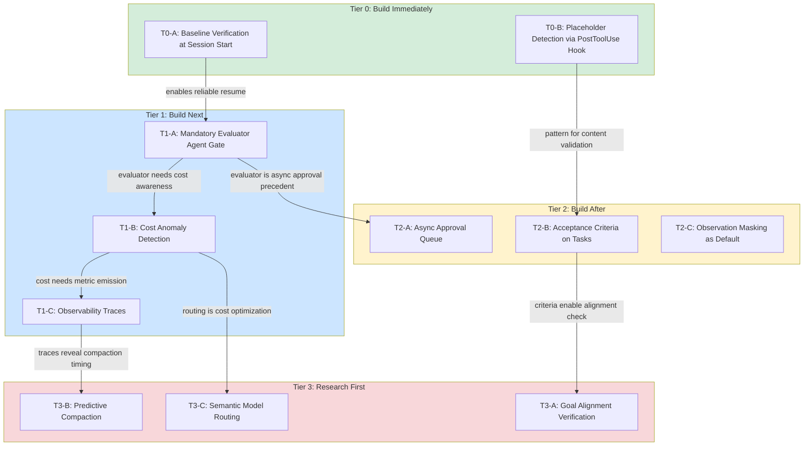
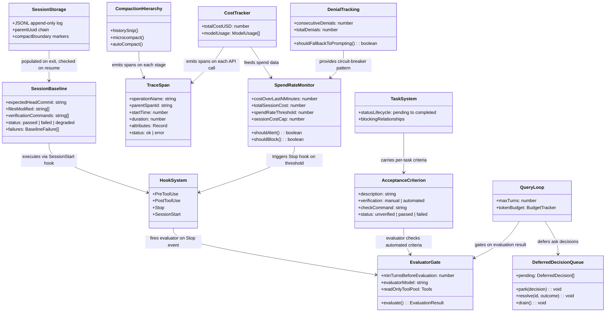

# What To Build Next: An Opinionated Roadmap

## Overview

The preceding 55 chapters have mapped cc's architecture at the level of types, control flows, and failure modes. Chapter 53 traced the twelve HER patterns to their implementation loci. Chapter 54 assessed cc's defense against the 17 failure modes, finding 11 strong, 4 partial, and 2 gaps. The HER excerpt for this chapter supplies three additional frameworks that the codebase does not yet address at all: human-in-the-loop design patterns (confidence-based routing, tiered escalation, async approval), cost management architecture (per-task caps, spend-rate alerts, dead-letter queues), and observability pillars (distributed traces, metrics, structured logs). This chapter synthesizes those findings into a prioritized roadmap for the harness engineer who has read the code, understood the gaps, and now asks: what should I build next?

The roadmap is opinionated. It ranks work items by a composite of impact (how many failure modes or operational risks a change addresses), difficulty (how much new infrastructure versus extending existing mechanisms), and leverage (how much downstream capability the change unlocks for future work). Items that address confirmed gaps rank above items that strengthen partial defenses. Items that extend existing cc mechanisms (hooks, permissions, compaction) rank above items that require entirely new subsystems. Items that are prerequisite for other items rank above their dependents.

The roadmap is organized into four tiers: Tier 0 (build immediately, days not weeks), Tier 1 (build next, one to three weeks each), Tier 2 (build after, one to two months each), and Tier 3 (research before building, open questions). Each tier is ordered by priority within the tier. The flowchart below visualizes the priority stack and the dependencies between items.



## Data structures and contracts

The roadmap items interact with existing data structures across the codebase. This section identifies the key contracts that each tier must extend or create, beginning with the two gap failure modes identified in Chapter 54 and their proposed remediation types.

### Gap failure mode 6.9: Compounding bugs across sessions

The session resume mechanism at `src/utils/sessionStorage.ts` reconstructs conversation state from the JSONL append-only log but does not verify the external world. The proposed `SessionBaselineCheck` type would run at session start, comparing the persisted assumptions against current filesystem and git state:

```typescript
// Proposed type for baseline verification at session start
type SessionBaselineCheck = {
  /** Git HEAD at time of last session exit */
  expectedHeadCommit: string
  /** Files the previous session created or modified */
  filesModified: string[]
  /** Build/lint/test commands to verify project integrity */
  verificationCommands: string[]
  /** Whether baseline passed or failed */
  status: 'passed' | 'failed' | 'degraded'
  /** Failures that the resumed session should be warned about */
  failures: BaselineFailure[]
}

type BaselineFailure = {
  kind: 'git_diverged' | 'file_missing' | 'file_modified' | 'command_failed'
  path?: string
  expected?: string
  actual?: string
  message: string
}
```

The `SessionBaselineCheck` type draws on the existing `WorktreeSession` type at `src/utils/worktree.ts:L140-L154`, which already records `originalHeadCommit` and `originalCwd` for worktree entry. The proposed type extends this pattern to all sessions, not just worktree sessions. The `verificationCommands` field is the key addition: it encodes the project-specific checks that the previous session would have expected to pass (e.g., `tsc --noEmit`, `npm test`). The `SessionStart` hook event at `src/entrypoints/sdk/coreTypes.ts:L25-L53` already provides the lifecycle interception point where this check would execute.

### Gap failure mode 6.17: Goal misinterpretation

The task system at `src/utils/tasks.ts` provides a structured unit of work with status lifecycle (pending to in_progress to completed) and blocking relationships, but tasks do not carry explicit acceptance criteria. The proposed extension adds an `acceptanceCriteria` field:

```typescript
// Proposed extension to task acceptance criteria
type AcceptanceCriterion = {
  /** Human-readable description of what "done" looks like */
  description: string
  /** Deterministic check that verifies the criterion */
  verification: 'manual' | 'automated'
  /** When automated, the command or assertion to run */
  checkCommand?: string
  /** Current status of this criterion */
  status: 'unverified' | 'passed' | 'failed'
}
```

The `AcceptanceCriterion` type maps directly to the HER's recommendation that acceptance criteria be explicit and verifiable. The `verification` field distinguishes between criteria that require human judgment (architectural soundness, code style) and criteria that can be checked deterministically (tests pass, files exist, no placeholder patterns). The `checkCommand` field enables automated mid-task verification without requiring the full evaluator-agent infrastructure. This type could be stored as part of the task metadata in the existing task registry, without requiring changes to the `TaskStateBase` schema beyond an optional field addition.

### Existing contract: DenialTrackingState

The denial tracking type at `src/utils/permissions/denialTracking.ts:L7-L15` provides the pattern for circuit-breaker-style state that the cost anomaly detection item (T1-B) must follow:

```typescript
// src/utils/permissions/denialTracking.ts:L7-L15 — Denial tracking state and limits
export type DenialTrackingState = {
  consecutiveDenials: number
  totalDenials: number
}

export const DENIAL_LIMITS = {
  maxConsecutive: 3,
  maxTotal: 20,
} as const
```

The `recordDenial` and `recordSuccess` functions at `src/utils/permissions/denialTracking.ts:L24-L38` demonstrate the immutable-update pattern (returning new objects rather than mutating) that cost tracking state should follow. The `shouldFallbackToPrompting` function at `src/utils/permissions/denialTracking.ts:L40-L45` provides the template for the spend-rate alert: when `consecutiveDenials` exceeds `maxConsecutive` or `totalDenials` exceeds `maxTotal`, the system escalates from automated to human-mediated decisions.

### Existing contract: AutoCompactTrackingState

The autocompact circuit breaker at `src/services/compact/autoCompact.ts:L51-L60` provides the pattern for the predictive compaction research item (T3-B):

```typescript
// src/services/compact/autoCompact.ts:L51-L60 — Autocompact circuit breaker state
export type AutoCompactTrackingState = {
  compacted: boolean
  turnCounter: number
  turnId: string
  consecutiveFailures?: number
}
```

The `consecutiveFailures` field and its `MAX_CONSECUTIVE_AUTOCOMPACT_FAILURES` threshold at `src/services/compact/autoCompact.ts:L70` (set to 3 after production data showed 1,279 sessions with 50+ consecutive failures wasting approximately 250K API calls per day globally) demonstrate that circuit breakers must be informed by production telemetry, not theorized from first principles.

## Control flow

### Tier 0-A: Baseline verification at session start

**Impact: Addresses gap failure mode 6.9 directly. Difficulty: Low. Leverage: High (enables reliable session resume for all downstream work).**

When a session is resumed, the `restoreCostStateForSession` function at `src/cost-tracker.ts` rehydrates cost state from the persisted `StoredCostState`, but no check confirms that files on disk match what the previous session expected. Chapter 54 identified this as a gap with no structural defense. The fix is a baseline verification step that runs at session start, before the agent loop begins.

The implementation path uses the existing `SessionStart` hook event. A `SessionStart` hook configured with a verification script would execute before the agent's first turn. But hooks are opt-in; the roadmap proposes making baseline verification structural by adding a `baselineVerification` field to the session metadata that is automatically populated on session exit and automatically checked on session resume.

The control flow would be: (1) on session exit, the `StoredCostState` writer at `src/cost-tracker.ts:L71-L80` also records the current git HEAD, the list of files modified during the session, and any verification commands that the session's tool calls imply (e.g., if the session ran `tsc`, record `tsc --noEmit` as a verification command); (2) on session resume, before the agent loop begins, the system runs the recorded verification commands and checks that the git HEAD and modified files still match; (3) mismatches are injected into the conversation as a system message, alerting the model to the discrepancy.

The key design decision is whether verification failures block the resume or merely warn. The roadmap recommends warning, not blocking. A blocking check would prevent resume in environments where git state has legitimately diverged (e.g., a teammate merged a PR). A warning message in the conversation context gives the model the information it needs to adapt without preventing the user from resuming.

### Tier 0-B: Placeholder detection via PostToolUse hook

**Impact: Addresses partial failure mode 6.4. Difficulty: Very low. Leverage: Medium (pattern for all content-validation hooks).**

Chapter 54 identified placeholder implementations as a partial defense: the system prompt instructs the model to produce complete code, but there is no structural check in the tool dispatch pipeline that inspects file-write content for placeholder patterns. The `destructiveCommandWarning` system at `src/tools/BashTool/destructiveCommandWarning.ts:L12-L89` demonstrates that cc already has the infrastructure for pattern-based content inspection in bash commands. Extending this to file-write content is architecturally straightforward.

The implementation path uses the existing `PostToolUse` hook event. A `PostToolUse` hook configured on `FileWriteTool` and `FileEditTool` would inspect the tool result for placeholder patterns (`// TODO`, `throw new Error("not implemented")`, `// FIXME`, empty function bodies with only a `return` statement). When detected, the hook would exit with code 2, forcing the model to continue working rather than concluding with a stub.

The hook does not need to be a default. The roadmap recommends shipping it as a documented example in the hooks documentation, making it easy for users to opt in. The pattern is more valuable than the specific hook: once users see that content validation is possible through `PostToolUse`, they can write their own checks for project-specific anti-patterns (e.g., detecting raw SQL strings in an ORM codebase, detecting `console.log` in production code).

### Tier 1-A: Mandatory evaluator agent gate

**Impact: Addresses partial failure mode 6.3 (self-evaluation bias). Difficulty: Medium. Leverage: Very high (evaluator is prerequisite for acceptance criteria verification, async approval, and goal alignment).**

The HER recommends a separate evaluator agent in a fresh context window. cc has the machinery (the Agent tool with forked execution, the `context: fork` option on skills) but does not enforce evaluation as a default pipeline step. Chapter 54 assessed this as a partial defense with a significant gap.

The implementation path adds an evaluation gate to the query loop. After the model produces a `Stop` event (indicating it considers work complete), the system spawns a forked evaluator agent with a fresh context. The evaluator receives the original task description, the files that were modified, and a structured prompt asking it to verify completeness and quality. The evaluator's response is injected back into the conversation before the stop is finalized.

The `CacheSafeParams` type at `src/utils/forkedAgent.ts:L57-L68` ensures that the evaluator shares the parent's prompt cache, minimizing the additional token cost. The `shouldDefer` flag at `src/Tool.ts:L442` could be set on the evaluator's tool pool to limit it to read-only tools, preventing the evaluator from making changes.

```typescript
// src/utils/forkedAgent.ts:L57-L68 — CacheSafeParams definition
export type CacheSafeParams = {
  /** System prompt - must match parent for cache hits */
  systemPrompt: SystemPrompt
  /** User context - prepended to messages, affects cache */
  userContext: { [k: string]: string }
  /** System context - appended to system prompt, affects cache */
  systemContext: { [k: string]: string }
  /** Tool use context containing tools, model, and other options */
  toolUseContext: ToolUseContext
  /** Parent context messages for prompt cache sharing */
  forkContextMessages: Message[]
}
```

The `forkContextMessages` field carries the parent's context, enabling the evaluator to read the conversation history without re-paying the input token cost. The `lastCacheSafeParams` slot at `src/utils/forkedAgent.ts:L73` is already written by `handleStopHooks` after each turn, meaning the evaluator can be launched immediately after the `Stop` event without an additional API round-trip to reconstruct the cache.

The key design decision is whether the evaluator gate is mandatory or configurable. The roadmap recommends making it mandatory for sessions longer than a configurable turn threshold (default: 10 turns) but configurable per-session via a setting. Short sessions (quick questions, single-file edits) do not need evaluation; long sessions (multi-file refactors, complex bug fixes) benefit disproportionately.

### Tier 1-B: Cost anomaly detection

**Impact: Addresses cost management gap identified in HER Section 13. Difficulty: Medium. Leverage: High (enables cost-per-outcome tracking).**

The HER excerpt identifies cost explosion as arguably the number-one operational risk for multi-hour tasks, citing enterprise TCO underestimation of 40-60%. cc's cost tracker at `src/cost-tracker.ts` accumulates per-model token usage and dollar spend, and the `StoredCostState` type at `src/cost-tracker.ts:L71-L80` persists `totalCostUSD` and `modelUsage` to project-level configuration. But there is no anomaly detection on the spend rate. The denial tracking system serves as an indirect cost control (capping autonomous tool calls after 20 total denials), but it was not designed for cost management.

The implementation path adds a `SpendRateMonitor` that tracks cost velocity (dollars per minute) across the session. When the spend rate exceeds a configurable threshold, the monitor triggers a `Stop` hook that injects a cost-awareness message into the conversation. When the spend rate exceeds a second, higher threshold, the monitor pauses the agent loop and prompts the user.

The denial tracking type provides the implementation pattern. The `shouldFallbackToPrompting` function at `src/utils/permissions/denialTracking.ts:L40-L45` demonstrates how a simple threshold check can trigger escalation. The cost anomaly monitor would use the same pattern: track `costOverLastNMinutes` (analogous to `consecutiveDenials`) and `totalSessionCost` (analogous to `totalDenials`), with thresholds that trigger escalating responses.

The HER's recommended cost control architecture includes per-task cost caps, per-session cost caps, per-hour spend-rate alerts, and dead-letter queues for tasks exceeding thresholds. The roadmap prioritizes spend-rate alerts and per-session caps as Tier 1 work, deferring per-task caps and dead-letter queues to Tier 2 because they require the task system to carry cost metadata, which it currently does not.

### Tier 1-C: Observability traces

**Impact: Addresses the observability gap identified in HER Section 14. Difficulty: Medium. Leverage: High (traces are prerequisite for diagnosing all other failures).**

The HER excerpt states that 89% of organizations with production agents have implemented observability, calling it table stakes. cc's analytics module at `src/services/analytics/index.ts` queues structured events to backend sinks, but these events are telemetry (aggregated counts and durations), not traces (causal chains of related operations across a distributed workflow). When a multi-hour session goes wrong, there is no way to reconstruct the causal chain: which tool call triggered which compaction, which compaction discarded which context, which context loss caused which hallucinated tool call.

The implementation path adds OpenTelemetry-compatible trace spans to the key lifecycle points. Each tool dispatch becomes a span with the tool name, input hash, duration, and result status. Each compaction event becomes a span with the trigger type, pre/post token counts, and the compaction strategy used. Each permission decision becomes a span with the decision reason, the rule source, and the escalation path taken. The `AnalyticsSink` interface at `src/services/analytics/index.ts:L63-L78` already provides the queuing infrastructure; the trace spans would be a new event type that flows through the same queue.

The `LogEventMetadata` type at `src/services/analytics/index.ts:L61` restricts values to `boolean | number | undefined`. Trace spans carry richer data (strings for tool names, objects for decision reasons). The roadmap recommends extending the analytics pipeline to support a new `TraceEvent` type that bypasses the `LogEventMetadata` restriction, using the same `stripProtoFields` guard at `src/services/analytics/index.ts:L45-L58` to prevent PII leakage.

### Tier 2-A: Async approval queue

**Impact: Addresses HER Section 11.3 (async approval for multi-hour tasks). Difficulty: High. Leverage: Medium (improves human-in-the-loop experience but does not unlock new failure-mode defenses).**

The HER excerpt identifies async approval as critical for multi-hour tasks: the agent should never fully block on human input. Instead, it should park a blocked action, record context, and continue with non-blocked work. cc's current architecture does not support this. When the permission pipeline reaches an `ask` decision, the agent loop blocks until the user responds through the interactive dialog. There is no mechanism to defer the decision and continue with other work.

The implementation path extends the `PermissionDecision` type with a `defer` option and adds a `DeferredDecisionQueue` to the app state. When a tool call requires human approval, the agent can choose to defer the decision (park the tool call with its full context) and continue with the next iteration of the query loop. When the human eventually responds, the deferred decision is resolved and the tool call either executes or is discarded.

This is Tier 2 rather than Tier 1 because it requires changes to the query loop's fundamental control flow. The query loop at `src/query.ts` currently processes tool calls sequentially within a turn. Supporting deferred decisions requires the loop to handle partial-turn completion: some tool calls in a turn are executed, some are deferred, and the turn is not considered complete until all deferred decisions are resolved. This is a significant architectural change that requires careful design to avoid introducing new failure modes (e.g., deferred tool calls that depend on each other executing in the wrong order).

### Tier 2-B: Acceptance criteria on tasks

**Impact: Addresses gap failure mode 6.17 (goal misinterpretation) partially. Difficulty: Medium. Leverage: High (prerequisite for goal alignment verification).**

The task system at `src/utils/tasks.ts` carries status lifecycle and blocking relationships but not explicit acceptance criteria. The proposed `AcceptanceCriterion` type defined earlier in this chapter would add a structured, verifiable definition of "done" to each task. The implementation path adds an optional `acceptanceCriteria` field to the task creation schema and a `verifyCriteria` method that runs the `checkCommand` for each automated criterion.

The key insight from Chapter 54 is that specification gaming is a semantic failure, not a syntactic one. The permission pipeline can validate that a `Write` tool writes to an allowed path, but it cannot validate that the written content solves the user's actual problem. Acceptance criteria bridge this gap by encoding the user's intent as a set of verifiable assertions. Automated criteria (tests pass, files exist, no placeholder patterns) can be checked without human involvement. Manual criteria (architectural soundness, code style) require human review, which the evaluator agent (T1-A) can facilitate by presenting the criteria alongside the work for structured review.

The relationship to Tier 0-B is direct: placeholder detection is a special case of acceptance criteria verification. The `PostToolUse` hook pattern established in Tier 0-B generalizes to any content-validation check that should run after a tool call. Tier 2-B elevates this from a hook to a first-class task property, making acceptance criteria visible in the UI, auditable in the session log, and durable across compaction events.

### Tier 2-C: Observation masking as default

**Impact: Addresses the cost optimization gap identified in HER Section 13.3. Difficulty: Medium. Leverage: Medium (cost reduction without new capability).**

The HER excerpt reports 52% cost reduction from observation masking --- replacing verbose tool outputs with compressed summaries before feeding them back into the model context. cc implements observation masking through microcompact's tool-result clearing, but the clearing is gated behind feature flags and user-type checks rather than being the default behavior for all users, as noted in Chapter 28. The `COMPACTABLE_TOOLS` set selects which tools' results are eligible for clearing (verbose tools like Read, Bash, Grep) versus tools whose results are preserved.

Making observation masking the default requires careful calibration. Tool results contain information that the model may need on subsequent turns. Premature masking can cause the model to re-request information it already received, negating the cost savings. The roadmap proposes a graduated approach: (1) mask results from tools that the model has not referenced in the last N turns (where N is configurable, default 3); (2) preserve a one-line summary of each masked result in the conversation; (3) provide a `Recall` tool that the model can use to retrieve the full result of a previously masked tool call on demand. This approach mirrors the tiered memory architecture in the memdir subsystem, where the `MEMORY.md` index provides a compressed view and per-topic files are loaded on demand.

The memdir subsystem constrains what gets stored through a closed type taxonomy, preventing the memory store from becoming an unstructured dump:

```typescript
// src/memdir/memoryTypes.ts:L14-L21 — Memory type taxonomy and union type
export const MEMORY_TYPES = [
  'user',
  'feedback',
  'project',
  'reference',
] as const

export type MemoryType = (typeof MEMORY_TYPES)[number]
```

The four-type taxonomy embodies a design principle stated at `src/memdir/memoryTypes.ts:L6-L8`: code patterns, architecture, git history, and file structure are derivable via tools and should not be saved as memories. The `Recall` tool for observation masking should follow the same constraint: it retrieves raw tool results, not summaries or interpretations. The `findRelevantMemories` function at `src/memdir/findRelevantMemories.ts` already implements relevance-based retrieval with a five-result cap. The `Recall` tool would use the same relevance-ranking approach, retrieving masked tool results based on their similarity to the model's current request.

### Tier 3: Research before building

The Tier 3 items require research because their feasibility depends on model capabilities that are evolving rapidly and because the cost-benefit tradeoff is unclear without production data.

**T3-A: Goal alignment verification.** This item addresses the core of failure mode 6.17 (specification gaming). The fundamental challenge is that goal alignment is a semantic property that cannot be checked by deterministic code. The evaluator agent (T1-A) provides a partial solution by having a second model evaluate the first model's output, but the HER warns of the Ouroboros risk: a generator-evaluator pair can converge on a shared misinterpretation, with the evaluator confirming the generator's mistakes. Research is needed into whether a third model (or a human checkpoint at 25% completion, as the HER recommends) is sufficient to break the Ouroboros cycle, or whether the problem requires a fundamentally different approach such as formal specification languages that can be checked mechanically.

**T3-B: Predictive compaction.** Chapter 54 noted that cc's compaction is reactive, not predictive: it fires after token usage crosses a threshold, not when mid-window degradation is first detectable. Predictive compaction would use the observability traces from T1-C to build a model of when compaction is likely needed, firing proactively before the threshold is reached. The `AutoCompactTrackingState` at `src/services/compact/autoCompact.ts:L51-L60` tracks `turnCounter` and `turnId`, providing the data needed to correlate turn count with compaction frequency. Research is needed into whether turn count, tool-call patterns, or token-velocity metrics are the best predictors, and whether proactive compaction produces better outcomes (lower cost, higher quality) than reactive compaction triggered at the same threshold.

**T3-C: Semantic model routing.** The HER excerpt recommends semantic routing: cheap models for simple tasks, expensive models for planning. cc currently routes all requests to a single model specified at session start. The `fallbackModel` parameter in `QueryParams` provides a model-level fallback for failures, but there is no mechanism for task-dependent model selection. Research is needed into the classification problem: how to determine, before executing a turn, whether the current task requires the expensive model or can be handled by a cheaper one. The ToolSearch mechanism at `src/tools/ToolSearchTool/ToolSearchTool.ts:L21-L34` provides a precedent for dynamic capability discovery; semantic routing would need a similar discovery mechanism that maps task complexity to model capability.

The class diagram below shows the proposed architecture additions and how they relate to the existing subsystems.



## Edge cases and failure modes

**The evaluator gate can itself fail.** If the evaluator agent produces an error (API failure, timeout, malformed response), the system must decide whether to treat the failure as a pass (the work is assumed good) or a block (the work cannot be considered complete without evaluation). The roadmap recommends treating evaluator failure as a non-blocking warning: inject the failure message into the conversation and allow the agent to proceed, but flag the session as "unevaluated" in the session metadata. This mirrors the autocompact circuit breaker's behavior at `src/services/compact/autoCompact.ts:L70`, where 3 consecutive compaction failures cause the system to stop trying rather than block the entire agent loop.

**Baseline verification can be slow.** If the previous session recorded many verification commands (e.g., a full test suite), running all of them at session start could delay resume by minutes. The roadmap recommends a timeout on each verification command (default: 30 seconds) and a total timeout on the baseline check (default: 60 seconds). Commands that exceed their timeout are treated as failures, not as passes. This mirrors the `timeout` field on hooks at `src/schemas/hooks.ts:L49-L52`, which applies per-hook execution time limits.

**Observation masking can cause information loss.** If the model needs the full output of a previously masked tool result, the `Recall` tool must retrieve it from the session storage JSONL log. But session storage preserves tool results in their original form only until compaction fires. After compaction, the tool result is replaced with a summary. The `COMPACTABLE_TOOLS` set selects which tools' results are eligible for clearing, but the clearing happens during compaction, not during observation masking. The roadmap recommends that observation masking store the full result in a separate, compaction-resistant field (analogous to the `attachments` field in `CompactionResult` at `src/services/compact/compact.ts:L299-L310`) so that the `Recall` tool can always retrieve the full result, even after compaction.

**Cost anomaly detection must account for model cost differences.** A session that uses an expensive model (Claude Opus) will naturally have a higher spend rate than a session that uses a cheaper model (Claude Haiku). The spend-rate thresholds must be calibrated per-model, not globally. The `StoredCostState` type at `src/cost-tracker.ts:L71-L80` already carries per-model `modelUsage` data, making per-model threshold calibration straightforward. But the default thresholds must be set conservatively (alerting too early is better than alerting too late), and the alerts must include enough context (model name, turn count, recent tool calls) for the user to make an informed decision about whether to continue.

**Deferred decisions can deadlock.** If the agent defers a tool call that is a prerequisite for all remaining work, the agent has nothing to do while waiting for the human to respond. The `maxTurns` parameter in `QueryParams` provides a hard ceiling, but the agent may spin through turns producing no useful output. The roadmap recommends that the deferred-decision queue check whether the agent has made progress (produced tool calls that were not deferred) since the last deferred decision. If not, the agent should pause and wait for the human rather than burning tokens on fruitless turns.

## Where cc diverges from the published pattern

The HER presents the roadmap items as independent improvements, each addressing a specific gap. The cc implementation reveals dependencies between items that the HER does not describe.

**Baseline verification and the evaluator gate are not independent.** The evaluator agent (T1-A) spawns a forked agent with a fresh context. If the forked agent's session resume mechanism does not verify the external world, the evaluator can inherit compounding bugs from the parent session. Baseline verification (T0-A) must be in place before the evaluator gate is meaningful. The HER's recommendation for a separate evaluator does not account for this dependency.

**Cost anomaly detection and the observability traces are not independent.** Spend-rate alerts require metric emission (cost per minute, tokens per minute, tool calls per minute). These metrics are a subset of the observability traces that T1-C produces. Building cost anomaly detection without traces means reinventing metric emission for cost data specifically, which is wasteful. The HER's cost management architecture and observability architecture are presented as separate sections (13 and 14), but in cc's implementation, they share a data pipeline.

**Observation masking and compaction are not independent.** The HER presents observation masking as a cost optimization technique (Section 13.3) and compaction as a context management technique (Section 8). In cc's implementation, observation masking is implemented through microcompact, which is a compaction stage. Making observation masking the default (T2-C) means making microcompact's tool-result clearing the default, which changes the compaction hierarchy's behavior for all users, not just those who have opted in. The HER does not account for this coupling between cost optimization and context management.

**The HER's human-in-the-loop patterns assume a synchronous user.** HER Section 11.3 describes async approval as the agent parking a blocked action and continuing with other work. But the cc permission pipeline is fundamentally synchronous: when the pipeline reaches an `ask` decision, the React hook blocks until the user responds. Implementing async approval (T2-A) requires changing the permission pipeline from synchronous to asynchronous, which is a significant architectural change that the HER's pattern description does not acknowledge.

## Developer takeaways for building a long-running agent

The roadmap reveals a principle that no single chapter could convey in isolation: the gaps cluster by mechanism, not by failure mode. The two gap failure modes (6.9 compounding bugs, 6.17 goal misinterpretation) seem unrelated in the HER's taxonomy, but both stem from the same root cause -- the absence of structural verification at key lifecycle transitions. Compounding bugs occur because session resume does not verify the world; goal misinterpretation occurs because task completion does not verify the intent. The fix for both is the same pattern: a verification step that compares expectations against reality at a boundary point. Build the verification pattern once (starting with baseline verification at session start, which is the simplest instance), then generalize it to task acceptance criteria and evaluator gates. The tier ordering reflects this dependency: T0-A establishes the verification pattern, T1-A and T2-B extend it, and T3-A researches whether it can address the hardest remaining gap. A harness engineer who internalizes this principle will find that the roadmap items are not ten independent projects but four instances of the same architectural idea, applied at progressively harder boundaries.
