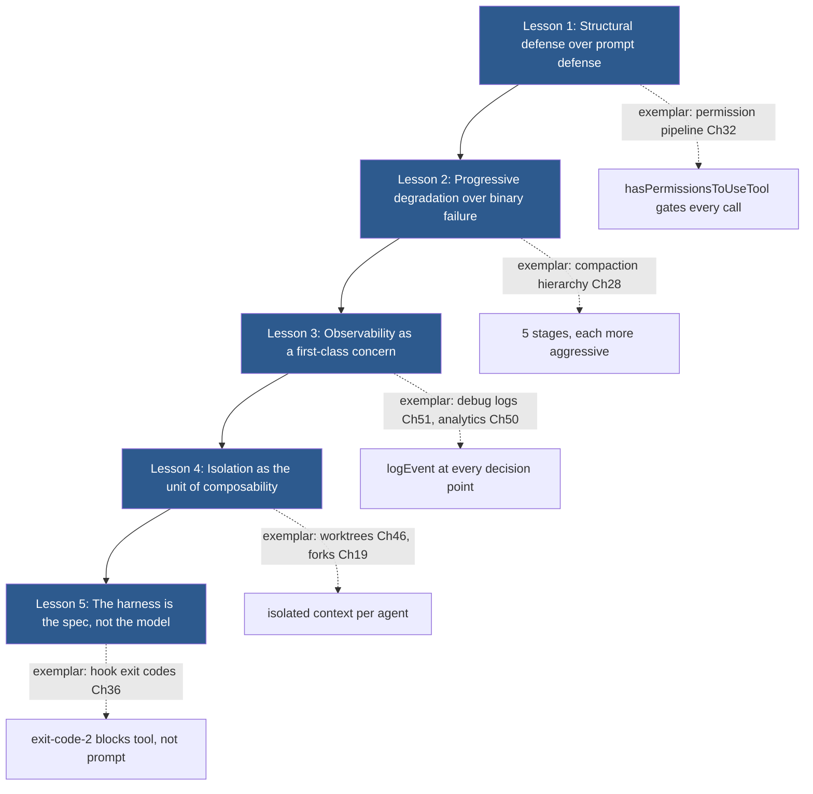
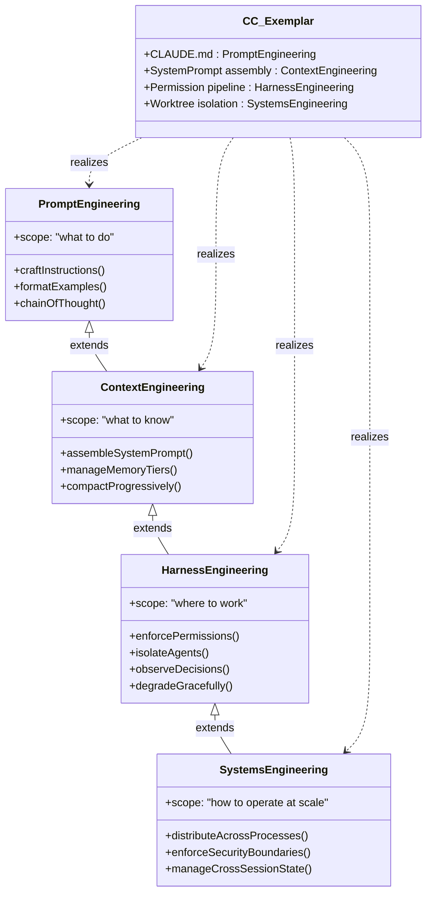

# Closing: Lessons for the Harness Engineering Discipline

## Overview

Over fifty-six chapters, this book has traced the architecture of cc from its bootstrap entry point through its query loop, tool pipeline, permission system, memory hierarchy, agent orchestration, and failure defenses. This final chapter steps back from the source code to ask: what does cc teach us about building trustworthy long-running agents, and what does that imply for harness engineering as a discipline?

The Harness Engineering Report (HER) frames the problem with a deceptively simple equation: Agent = Model + Harness. The preceding chapters have shown that the "harness" term conceals enormous depth. In cc alone, the harness encompasses over forty registered tools, a five-stage compaction hierarchy, a six-mode permission pipeline, a twelve-pattern architecture mapped from the HER taxonomy, and seventeen distinct failure modes against which defenses are either strong, partial, or absent. The harness is not a thin wrapper around an API. It is the engineering artifact that makes the difference between a demo and a production system.

This synthesis draws five overarching lessons from cc's architecture, connects them to the academic and practitioner literature surveyed throughout the book, and proposes a layered model of the harness engineering discipline that maps directly onto the architectural strata visible in cc's source. The chapter closes with an honest assessment of what the discipline still lacks -- and what the next generation of harness engineers must build that cc does not yet provide.

## Data structures and contracts

### The harness contract as a type system

Throughout this book, the most revealing artifacts have been type definitions. The `ToolUseContext` type in `src/Tool.ts` is the single most cited structure because it encodes the harness's concerns in their most concentrated form: what the agent can see, what it can touch, where it must stop, and how it recovers.

```typescript
// src/Tool.ts:L158-L257 — ToolUseContext: the harness contract passed to every tool
export type ToolUseContext = {
  options: {
    commands: Command[]
    debug: boolean
    mainLoopModel: string
    tools: Tools
    verbose: boolean
    thinkingConfig: ThinkingConfig
    mcpClients: MCPServerConnection[]
    mcpResources: Record<string, ServerResource[]>
    isNonInteractiveSession: boolean
    agentDefinitions: AgentDefinitionsResult
    maxBudgetUsd?: number
    customSystemPrompt?: string
    appendSystemPrompt?: string
    querySource?: QuerySource
    refreshTools?: () => Tools
  }
  abortController: AbortController
  readFileState: FileStateCache
  getAppState(): AppState
  setAppState(f: (prev: AppState) => AppState): void
  // ...
  messages: Message[]
  fileReadingLimits?: {
    maxTokens?: number
    maxSizeBytes?: number
  }
  globLimits?: {
    maxResults?: number
  }
}
```

The `options` block carries the model identity, the tool registry, the MCP connections, and the budget cap. The `abortController` provides cancellation. The `readFileState` and `messages` fields are the harness's memory -- what the agent has read and what it has said. The `fileReadingLimits` and `globLimits` fields are back-pressure mechanisms, capping resource consumption before it spirals. This type encapsulates Lesson Zero of the discipline: the harness's contract with the model is a type system, and its fidelity determines how reliably the agent can operate.

The `Tool` type reinforces this point. Its thirty-plus fields and methods -- `call()`, `isConcurrencySafe()`, `isReadOnly()`, `isDestructive()`, `shouldDefer`, `alwaysLoad`, `interruptBehavior()` -- encode behavioral properties that the dispatch pipeline uses for scheduling, permission, and safety decisions (see Chapter 11). Each field is a design decision frozen into a type, and each absence is a gap that must be defended by prompts or convention alone.

```typescript
// src/Tool.ts:L362-L407 — Tool type: the contract every registered tool must satisfy
export type Tool<
  Input extends AnyObject = AnyObject,
  Output = unknown,
  P extends ToolProgressData = ToolProgressData,
> = {
  aliases?: string[]
  searchHint?: string
  call(
    args: z.infer<Input>,
    context: ToolUseContext,
    canUseTool: CanUseToolFn,
    parentMessage: AssistantMessage,
    onProgress?: ToolCallProgress<P>,
  ): Promise<ToolResult<Output>>
  description(
    input: z.infer<Input>,
    options: {
      isNonInteractiveSession: boolean
      toolPermissionContext: ToolPermissionContext
      tools: Tools
    },
  ): Promise<string>
  readonly inputSchema: Input
  readonly inputJSONSchema?: ToolInputJSONSchema
  outputSchema?: z.ZodType<unknown>
  inputsEquivalent?(a: z.infer<Input>, b: z.infer<Input>): boolean
  isConcurrencySafe(input: z.infer<Input>): boolean
  isEnabled(): boolean
  isReadOnly(input: z.infer<Input>): boolean
  isDestructive?(input: z.infer<Input>): boolean
  // ...
```

The `isConcurrencySafe`, `isReadOnly`, and `isDestructive` methods form a behavioral lattice. A tool can be read-only and concurrency-safe (like GrepTool), read-only but not concurrency-safe (if it acquires locks), or neither (like BashTool). The destructive flag is orthogonal -- a tool can be non-read-only but not destructive (e.g., an append-only log writer). This lattice is a microcosm of the discipline's core insight: safety properties must be encoded as computable predicates, not left to prompt instructions that the model may ignore under pressure.

The `shouldDefer` and `alwaysLoad` fields at `src/Tool.ts:L442-L449` encode a related principle. Deferral implements HER Pattern 9, Progressive Tool Expansion: the model starts with fewer than twenty tools and activates more on demand via ToolSearch, keeping the baseline prompt small and the cognitive load manageable. The `alwaysLoad` override guarantees that certain tools -- core navigation tools the model must see on turn one -- are never deferred, even when ToolSearch is enabled. This pair of fields demonstrates that the discipline must attend not only to what the model can do but to what the model can see. A tool that is invisible to the model is a tool that cannot be used, and the deferral system must balance prompt economy against capability accessibility. The `searchHint` field at `src/Tool.ts:L378` complements deferral by providing a short capability phrase for keyword matching, preferring terms not already in the tool name to maximize discoverability.

## Control flow

### Lesson synthesis: five principles from cc's architecture

The fifty-six chapters preceding this one yield five principles that recur across every subsystem. They are not abstract ideals but concrete engineering responses to specific failure modes observed in production.



**Lesson 1: Structural defense over prompt defense.** cc's permission pipeline in `src/utils/permissions/permissions.ts` does not ask the model nicely to avoid dangerous operations. It gates every tool call through `hasPermissionsToUseTool`, which evaluates mode, rules, and denial tracking state before any execution occurs. The bash classifier in `src/utils/permissions/bashClassifier.ts` assigns risk bands (safe, risky, destructive) using deterministic heuristics, not prompt instructions. When the HER reports that 73% of deployments are affected by prompt injection (see Chapter 52), the implication is clear: any defense that relies on the model reading and obeying a prompt instruction is a defense that can be undermined by an adversary who can influence the context. cc's strongest defenses -- the permission pipeline, the SSRF guard, the filesystem path guards -- are structural. Its weakest defenses -- preventing premature completion, preventing self-evaluation bias, preventing goal misinterpretation -- rely on prompts (see Chapter 54). The correlation is not coincidental.

**Lesson 2: Progressive degradation over binary failure.** When the context window fills, cc does not crash. It progresses through five compaction stages, each trading preservation fidelity for token savings: history_snip preserves all data on disk but hides it from the model; microcompact preserves the tool-use skeleton but replaces result content; context collapse uses a granular commit strategy; autocompact replaces the entire conversation with a summary; the hard reset discards everything (see Chapter 28). The `CompactionResult` type captures this graded response:

```typescript
// src/services/compact/compact.ts:L299-L310 — CompactionResult: graded response contract
export interface CompactionResult {
  boundaryMarker: SystemMessage
  summaryMessages: UserMessage[]
  attachments: AttachmentMessage[]
  hookResults: HookResultMessage[]
  messagesToKeep?: Message[]
  userDisplayMessage?: string
  preCompactTokenCount?: number
  postCompactTokenCount?: number
  truePostCompactTokenCount?: number
  compactionUsage?: ReturnType<typeof getTokenUsage>
}
```

The `truePostCompactTokenCount` field distinguishes between the compaction API call's total usage and the actual size of the resulting context -- a detail that matters because overcounting would trigger unnecessary escalation to more destructive stages. This pattern repeats across the architecture: the query loop's `State` type carries `maxOutputTokensRecoveryCount` capped at 3, the cost tracker accumulates USD and checks against `maxBudgetUsd`, the denial tracking state prevents the auto-mode classifier from looping. Each subsystem degrades gracefully rather than failing abruptly, and each has a circuit breaker.

**Lesson 3: Observability as a first-class concern.** cc's analytics pipeline (`src/services/analytics/`) logs events at every decision point in the query loop: model calls, tool executions, compaction triggers, permission decisions, feature flag evaluations, and error recoveries. The debug log system in `src/utils/debugLog.ts` captures structured entries with timestamps, durations, and context metadata. The `AnalyticsMetadata_I_VERIFIED_THIS_IS_NOT_CODE_OR_FILEPATHS` type at `src/query.ts:L24` is a tongue-in-cheek reminder that the analytics contract is taken seriously enough to warrant a branded type. Without observability, the other four lessons are unverifiable: you cannot know that your structural defenses are working, that your progressive degradation is triggering at the right thresholds, or that your isolation boundaries are holding, unless you can observe the system's behavior in production. The HER's observation masking technique (52% cost reduction, per HER section 8.1) is itself an observability optimization -- it compresses what the model sees without losing the information the harness needs for auditing.

**Lesson 4: Isolation as the unit of composability.** The `WorktreeSession` type in `src/utils/worktree.ts` captures the principle in microcosm: each worktree records its `originalCwd`, `originalHeadCommit`, and `sessionId`, enabling safe exit with full state restoration (see Chapter 46). The forked-agent architecture isolates subagent state in a subprocess with its own context window, communicating via structured IPC (see Chapter 19). The `AgentTool`'s `isConcurrencySafe() { return true }` declaration permits parallel execution only because each agent operates in an isolated context. The HER identifies the Ouroboros problem -- when both generator and evaluator are LLMs, who validates the validator -- and the strongest mitigation is deterministic evaluation, which is itself a form of isolation: the evaluator is not subject to the same failure modes as the generator (see Chapter 53). The principle extends to memory: the memdir's three-tier architecture (always-loaded index, on-demand topic files, on-disk transcripts) isolates each tier's failure domain (see Chapter 26). Isolation also underpins the MCP subsystem: the `ConnectedMCPServer`, `FailedMCPServer`, `NeedsAuthMCPServer`, and `PendingMCPServer` discriminated union in `src/services/mcp/types.ts` ensures that a failed MCP server cannot corrupt the state of a connected one, and each server's tools are scoped by permission rules that prevent cross-server privilege escalation (see Chapter 40).

**Lesson 5: The harness is the spec, not the model.** When the model outputs a tool call, the harness validates the input against the Zod schema, checks permissions, executes the tool, and feeds the result back. The model cannot bypass the Zod validation, cannot skip the permission check, and cannot fabricate a tool that does not exist in the registry. The hook system extends this principle with exit codes: a `PreToolUse` hook that exits with code 2 blocks the tool call regardless of what the model requested (see Chapter 36). The `BashCommandHookSchema` defines this contract:

```typescript
// src/schemas/hooks.ts:L32-L55 — BashCommandHookSchema definition
const BashCommandHookSchema = z.object({
  type: z.literal('command').describe('Shell command hook type'),
  command: z.string().describe('Shell command to execute'),
  if: IfConditionSchema(),
  shell: z
    .enum(SHELL_TYPES)
    .optional()
    .describe(
      "Shell interpreter. 'bash' uses your $SHELL (bash/zsh/sh); 'powershell' uses pwsh. Defaults to bash.",
    ),
  timeout: z
    .number()
    .positive()
    .optional()
    .describe('Timeout in seconds for this specific command'),
  statusMessage: z
    .string()
    .optional()
    .describe('Custom status message to display in spinner while hook runs'),
  once: z
    .boolean()
    .optional()
    .describe('If true, hook runs once and is removed after execution'),
  async: z
    .boolean()
    .optional()
```

The `once` and `async` fields illustrate that the hook system is not a static policy engine but a programmable control plane. The `once` field enables one-time setup hooks that disappear after execution. The `async` field allows non-blocking hooks that run concurrently with the tool call. These fields exist because the harness must be more expressive than the model's understanding of its own constraints: the model cannot predict when a hook will fire or what it will do, and that opacity is a feature, not a bug. The harness enforces invariants that the model cannot be trusted to maintain on its own.

### The discipline layers

The five lessons map onto a layered model of the harness engineering discipline. Each layer builds on the one below it, and cc's architecture provides a worked example at every level.



The first layer, prompt engineering, is the discipline of crafting instructions -- telling the model what to do. cc realizes this through the `CLAUDE.md` discovery pipeline (Chapter 31), the `MemoryFileInfo` type with its `globs` conditional activation (Chapter 53), and the `FrontmatterData` schema that controls skill behavior (Chapter 38). The second layer, context engineering, is the discipline of managing information flow -- giving the model what to know. cc realizes this through the system prompt assembly pipeline (Chapter 9), the branded `SystemPrompt` type that prevents unvalidated string injection (Chapter 9), the memdir's three-tier architecture (Chapter 26), and the five-stage compaction hierarchy (Chapter 28). The third layer, harness engineering proper, is the discipline of infrastructure -- giving the model where to work. cc realizes this through the `ToolUseContext` contract (Chapter 1), the permission pipeline with its six modes and rule system (Chapter 32), the bash classifier's deterministic risk assessment (Chapter 33), and the hook system's exit-code protocol (Chapter 36). The fourth layer, systems engineering, is the discipline of operating at scale -- managing distribution, security boundaries, and cross-session state. cc realizes this through the worktree isolation system (Chapter 46), the forked-agent architecture (Chapter 19), the MCP client lifecycle with its five-state discriminated union (Chapter 40), and the task system's persistent records and dependency graph (Chapter 22).

The layers are nested, not sequential. A harness engineer must also be a competent context engineer and prompt engineer. Each layer adds scope without eliminating the previous one. The `ToolUseContext` type spans all four layers: `mainLoopModel` (prompt), `messages` (context), `canUseTool` (harness), `abortController` (systems). The type system forces the implementor to confront all four concerns simultaneously. The `QueryParams` type in `src/query.ts:L181-L199` demonstrates the same layering at the loop boundary: `systemPrompt` and `userContext` (prompt + context), `canUseTool` and `toolUseContext` (harness), `maxTurns` and `taskBudget` (systems). Every boundary in the architecture is a place where the four layers intersect, and the discipline must address all four at every such intersection.

The discipline layers also explain why the HER's DevOps mapping (section 18.1) is both insightful and incomplete. The mapping -- execution environments to CI runners, tool definitions to API design, control loops to health checks, guardrails to IAM policies -- captures the systems engineering layer accurately but misses the prompt and context layers entirely. DevOps has no equivalent of the CLAUDE.md discovery pipeline, the system prompt assembly cache boundary, or the five-stage compaction hierarchy, because those layers address the unique challenge of orchestrating a non-deterministic workload. The core innovation of harness engineering, as noted in the HER, is that it orchestrates a probabilistic process (the LLM) that requires fundamentally different error handling -- retry-and-hope rather than fix-the-bug -- than the deterministic processes that DevOps was designed to manage.

## Edge cases and failure modes

### Where the discipline falls short

cc's architecture is the most mature public example of a long-running agent harness, but maturity is not completeness. Chapter 54 identified two failure modes where cc has meaningful gaps: compounding bugs across sessions (failure 6.9) and goal misinterpretation (failure 6.17). These gaps are not implementation oversights -- they are structural limitations of the current state of the discipline.

Compounding bugs across sessions occur because session boundaries are also knowledge boundaries. When one session's work is persisted to disk and a new session resumes, the new session has access to the filesystem state but not the reasoning that produced it. The memdir's three-tier memory (Chapter 26) partially addresses this by persisting user preferences, feedback, and project context, but it cannot capture the full decision history. The task system's persistent records (Chapter 22) capture what was done but not why. The ACRFence research (HER excerpt, section 15.6) identifies an even subtler problem: after a checkpoint-restore, an agent may re-synthesize subtly different requests, introducing "action replay" or "authority resurrection" attacks that are invisible to the session transcript.

Goal misinterpretation is the hardest failure mode because it is not a bug in the harness but a mismatch between the user's intent and the model's understanding. Plan mode (Chapter 45) provides a structural checkpoint -- the agent must write a plan, the user must approve it, and execution proceeds from shared understanding -- but the plan captures only the model's interpretation of the goal, not the goal itself. If the interpretation is wrong, the plan will be internally consistent but directionally incorrect. The `outputSchema` of `ExitPlanModeV2Tool` includes a `planWasEdited` field that signals when the user modified the plan content before approval (see Chapter 45), which is a partial mitigation: it alerts the model that its interpretation was imperfect. But the field cannot detect the case where the user approves a plan that misinterprets the goal without realizing the misinterpretation. The HER's NLAH research (section 15.1) confirms this: "more structure doesn't automatically improve performance when intermediate acceptance criteria diverge from final benchmarks." The verifier ablation in the NLAH study produced a negative result (-0.8% on SWE-bench), and multi-candidate search also produced a negative result (-2.4%), suggesting that adding evaluation layers does not reliably compensate for an initially incorrect goal interpretation.

The METR task-sizing research (HER excerpt, section 10.2) adds a quantitative constraint: AI task duration doubles every ~4.3 months (updated Time Horizon 1.1 model), but 95% per-step reliability yields only 36% success over 20 steps due to compound failure math. Doubling task duration quadruples the failure rate. The practical implication -- right-sized tasks should target 15--30 minutes of agent work per session -- is a discipline-level constraint that no amount of harness engineering can overcome. The harness can make each step more reliable, but it cannot change the compounding math. Multi-hour tasks must be decomposed into many short sessions, each with its own verification gate.

The HER's skeptical perspectives (section 18) raise three further challenges. The "stone soup" attribution problem notes that massive human labor -- writing specs, designing harnesses, monitoring output, fixing errors -- gets misattributed to AI capability. The greenfield bias observes that many impressive results come from new projects, while brownfield work requires understanding existing architecture, respecting implicit conventions, and navigating incomplete tests. The scale confusion warns that the right approach depends on actual needs: a ten-line bash loop for a single developer on a greenfield project, a generator-evaluator pattern for quality-critical features, a full orchestration framework for enterprise multi-agent production systems. The eight-layer reference architecture mapped from cc is aspirational -- no public implementation covers all eight layers -- and it should not be adopted wholesale where a simpler approach suffices.

## Where cc diverges from the published pattern

cc diverges from the HER's published patterns in three significant ways, and each divergence carries a lesson for the discipline.

First, cc's compaction hierarchy is deeper than the HER's progressive compaction pattern (Pattern 5) prescribes. The HER describes four layers; cc implements five (adding the hard reset as an escape hatch). The `State` type in `src/query.ts:L204-L217` carries `maxOutputTokensRecoveryCount` capped at 3, `hasAttemptedReactiveCompact`, and `autoCompactTracking` -- fields that exist because the four-layer model was insufficient for production conditions. The lesson is that the hierarchy must have an escape hatch, and that escape hatch must be tracked to prevent infinite recovery loops.

```typescript
// src/query.ts:L204-L217 — Loop-iteration state struct
type State = {
  messages: Message[]
  toolUseContext: ToolUseContext
  autoCompactTracking: AutoCompactTrackingState | undefined
  maxOutputTokensRecoveryCount: number
  hasAttemptedReactiveCompact: boolean
  maxOutputTokensOverride: number | undefined
  pendingToolUseSummary: Promise<ToolUseSummaryMessage | null> | undefined
  stopHookActive: boolean | undefined
  turnCount: number
  transition: Continue | undefined
}
```

The `transition` field records why the previous iteration continued -- values like `'next_turn'`, `'stop_hook_blocking'`, `'reactive_compact_retry'`, `'max_output_tokens_recovery'`, `'collapse_drain_retry'`, `'max_output_tokens_escalate'`, and `'token_budget_continuation'`. This lets tests assert which recovery path fired without inspecting message contents, and it provides the observability infrastructure (Lesson 3) that makes the extended hierarchy debuggable.

Second, cc's permission system is more granular than the HER's command risk classification pattern (Pattern 10) suggests. The HER describes deterministic pre-parsing and per-tool permission gating; cc implements six permission modes (default, plan, acceptEdits, bypassPermissions, dontAsk, auto), a rule system with per-tool allow/deny/ask policies, denial tracking state that prevents the auto-mode classifier from looping, and bypass-immune safety checks that cannot be overridden by any mode (see Chapter 32). The lesson is that permission is not a binary gate but a gradient, and the gradient must be computable at runtime without model involvement.

Third, cc's hook system extends beyond the HER's deterministic lifecycle hooks pattern (Pattern 12) in three directions: prompt hooks (single LLM calls), agent hooks (multi-turn LLM subagents), and HTTP hooks (delegation to external policy servers). The `HookCommandSchema` discriminated union in `src/schemas/hooks.ts:L176-L189` composes these four types into a single Zod schema that the settings pipeline can validate, merge, and execute (see Chapter 36). The lesson is that a hook system must be extensible to modes of evaluation that the original designers did not anticipate, and the discriminated union pattern provides the type-safe extensibility that a simple command-only hook system cannot.

A fourth divergence worth noting is cc's approach to tool registration and filtering. The HER's Pattern 9, Progressive Tool Expansion, describes starting with a small tool set and activating more on demand. cc implements this through the `shouldDefer` and `alwaysLoad` fields on the `Tool` type, but it adds a three-stage pipeline that the HER does not prescribe: define (implement `ToolDef` and call `buildTool`), register (add to `getAllBaseTools()`), and filter (apply `getTools()` and `assembleToolPool()` based on environment, permissions, and feature flags). The `assembleToolPool()` function at `src/tools.ts:L345-L367` deduplicates by name with built-in precedence and sorts each partition alphabetically for prompt-cache stability. The sorting detail matters: deterministic ordering ensures that the system prompt's cache boundary is stable across turns, reducing the number of cache misses and the associated cost. This is a lesson the HER does not address because it operates at a level of abstraction above the API economics that drive production systems.

## Developer takeaways for building a long-running agent

Building a trustworthy long-running agent requires encoding your invariants as types, not prompts. cc demonstrates this at every layer: the `ToolUseContext` type enforces the harness contract, the `CompactionResult` interface makes progressive degradation legible, the `WorktreeSession` type makes isolation restorable, and the `HookCommandSchema` discriminated union makes lifecycle intervention extensible. Where cc relies on prompts -- for premature completion prevention, self-evaluation bias, and goal misinterpretation -- its defenses are weakest. Where it relies on structural mechanisms -- the permission pipeline, the bash classifier, the SSRF guard, the filesystem path guards -- its defenses are strongest. The discipline of harness engineering is, at its core, the discipline of replacing trust in the model with verification in the harness. The agent will make mistakes; your job is to engineer a harness such that those mistakes are caught, contained, and recovered from before they compound into failures. Right-size your tasks to 15--30 minutes per session, degrade progressively rather than failing abruptly, observe every decision point, isolate every composable unit, and let the harness -- not the model -- be the specification of what the system must and must not do.
