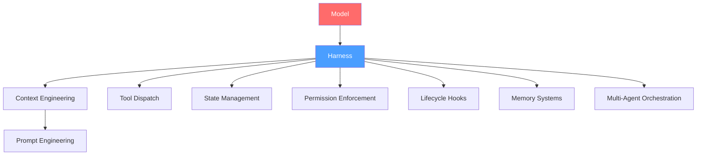
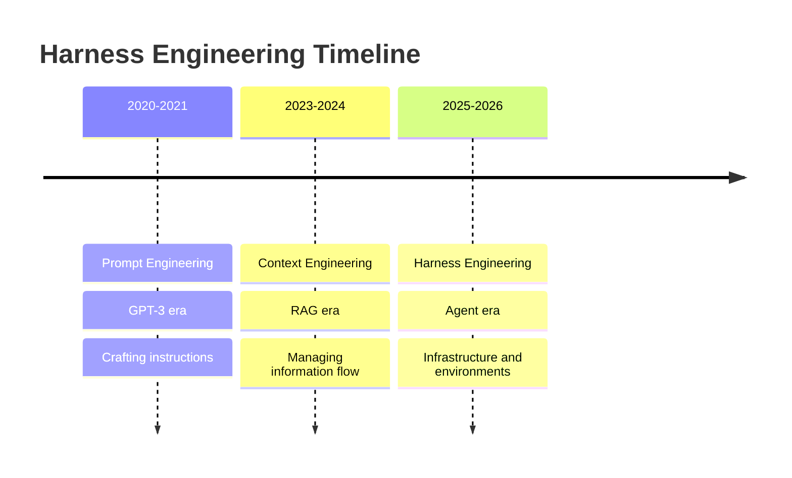

# Why This Book Exists: The Harness Engineering Moment

## Overview

In February 2026, Mitchell Hashimoto, co-founder of HashiCorp, published an article titled "My AI Adoption Journey" in which he wrote: "Anytime you find an agent makes a mistake, you take the time to engineer a solution such that the agent never makes that mistake again." He called this practice "harness engineering." Six days later, OpenAI published their own article under the same label. The term was already circulating in practice, even if it lacked a canonical name.

This book exists because cc -- the open-source codebase behind Claude Code -- is the most mature public example of a long-running agent harness. At approximately 4,683 lines in its entry point alone, with over 40 tool implementations, a custom React terminal renderer, multi-agent orchestration, and a five-layer permission system, cc represents a design that has been tested in production at scale. TerminalBench 2.0 data proves the thesis: the same model (Claude Opus 4.6) ranked first in one harness at 82.9% accuracy but fortieth in another at 58.0%, a 24.9 percentage point spread (tbench.ai, April 2026). Harness design matters more than model selection for production reliability.

This chapter positions cc within the emerging discipline of harness engineering, states the book's central thesis, and explains why reading source code -- not blog posts -- is the way to understand how to build trustworthy autonomous systems.

## Data structures and contracts

The harness equation, popularized by LangChain, frames the relationship as `Agent = Model + Harness`. The model provides intelligence; the harness provides tools, memory, state management, guardrails, and orchestration. This is a pedagogical simplification: in practice, the harness itself often contains model calls (evaluator agents, summarization agents, routing classifiers), making the relationship recursive. The equation is useful for establishing that the harness is at least as important as the model, but should not be taken as a formal decomposition.

In cc, the harness is not a separate library or framework -- it is the entire codebase minus the calls to the Anthropic API. The entry point in `src/entrypoints/cli.tsx` demonstrates this immediately. Before the model is ever invoked, the harness runs through a sequence of deterministic checks and side-effectful bootstrapping steps:

```typescript
// src/entrypoints/cli.tsx:L21-L26 — Harness-science L0 ablation baseline
if (feature('ABLATION_BASELINE') && process.env.CLAUDE_CODE_ABLATION_BASELINE) {
  for (const k of ['CLAUDE_CODE_SIMPLE', 'CLAUDE_CODE_DISABLE_THINKING', 'DISABLE_INTERLEAVED_THINKING', 'DISABLE_COMPACT', 'DISABLE_AUTO_COMPACT', 'CLAUDE_CODE_DISABLE_AUTO_MEMORY', 'CLAUDE_CODE_DISABLE_BACKGROUND_TASKS']) {
    process.env[k] ??= '1';
  }
}
```

The `feature('ABLATION_BASELINE')` gate and the `process.env[k] ??= '1'` assignment show two harness fundamentals: feature flags control which capabilities are active, and environment variables serve as the runtime configuration surface. This ablation baseline disables seven subsystems at once, enabling controlled experiments that isolate the contribution of each harness component. The harness is not a monolith; it is a configurable stack where each layer can be independently enabled or disabled.

The main entry in `src/main.tsx` begins with parallel prefetching -- firing MDM reads, keychain reads, and profile checkpoints before the heavy import chain begins:

```typescript
// src/main.tsx:L9-L20 — Parallel prefetch before heavy imports
import { profileCheckpoint, profileReport } from './utils/startupProfiler.js';

// eslint-disable-next-line custom-rules/no-top-level-side-effects
profileCheckpoint('main_tsx_entry');
import { startMdmRawRead } from './utils/settings/mdm/rawRead.js';

// eslint-disable-next-line custom-rules/no-top-level-side-effects
startMdmRawRead();
import { ensureKeychainPrefetchCompleted, startKeychainPrefetch } from './utils/secureStorage/keychainPrefetch.js';

// eslint-disable-next-line custom-rules/no-top-level-side-effects
startKeychainPrefetch();
```

The `startMdmRawRead()` and `startKeychainPrefetch()` calls fire synchronously at module-evaluation time, overlapping their I/O with the subsequent ~135ms of import resolution. This is a harness performance pattern: the harness controls when and how resources are loaded, and it does so to minimize the gap between user invocation and first meaningful interaction.

The init function in `src/entrypoints/init.ts` continues the bootstrap sequence with a memoized initialization that runs once and only once:

```typescript
// src/entrypoints/init.ts:L57-L69 — Memoized init with safe env vars
export const init = memoize(async (): Promise<void> => {
  const initStartTime = Date.now()
  logForDiagnosticsNoPII('info', 'init_started')
  profileCheckpoint('init_function_start')

  try {
    const configsStart = Date.now()
    enableConfigs()
    logForDiagnosticsNoPII('info', 'init_configs_enabled', {
      duration_ms: Date.now() - configsStart,
    })
    profileCheckpoint('init_configs_enabled')
```

The `memoize` wrapper from Lodash ensures that even if `init()` is called multiple times (which can happen in test environments or during session resume), the actual initialization logic runs only once. The `profileCheckpoint()` calls throughout the init function create a timeline of startup performance, enabling the developers to identify and optimize bottlenecks. The `enableConfigs()` call activates the configuration system, which loads settings from multiple sources (organization, user, project, directory) in a defined cascade order.

## Control flow

The evolution from prompt engineering through context engineering to harness engineering is not a sequence of replacements but a nesting of scopes. Prompts tell the model what to do. Context gives the model what to know. Harnesses give the model where to work. Each layer encompasses the previous one.



In cc, the harness components map directly to source directories: `src/tools/` for tool dispatch (40+ tools), `src/state/` for the Redux-like store, `src/utils/permissions/` for the permission system, `src/utils/hooks/` for lifecycle hooks, `src/memdir/` for tiered memory, and `src/coordinator/` for multi-agent orchestration. Each of these subsystems is a harness layer that wraps the raw model capability in deterministic, auditable, and controllable infrastructure.

The TerminalBench 2.0 result crystallizes the thesis. The same Claude Opus 4.6 model achieved 82.9% accuracy in the Pilot/QuantFlow harness but only 58.0% in the Claude Code/Anthropic harness. This 24.9 percentage point spread across 124 leaderboard entries proves that harness design is the dominant variable in production agent reliability. On SWE-bench Verified, Augment Code, Cursor, and Claude Code all ran the same model (Opus 4.5) but scored 17 problems apart out of 731 total. Same model, different harness, different results.

The deferred prefetch pattern in `src/main.tsx` shows how the harness manages the critical path. After the REPL renders for the first time, the `startDeferredPrefetches()` function fires background tasks that would otherwise delay the initial paint:

```typescript
// src/main.tsx:L388-L414 — Deferred prefetches after first render
export function startDeferredPrefetches(): void {
  if (isEnvTruthy(process.env.CLAUDE_CODE_EXIT_AFTER_FIRST_RENDER) ||
  isBareMode()) {
    return;
  }

  // Process-spawning prefetches (consumed at first API call, user is still typing)
  void initUser();
  void getUserContext();
  prefetchSystemContextIfSafe();
  void getRelevantTips();
  if (isEnvTruthy(process.env.CLAUDE_CODE_USE_BEDROCK) && !isEnvTruthy(process.env.CLAUDE_CODE_SKIP_BEDROCK_AUTH)) {
    void prefetchAwsCredentialsAndBedRockInfoIfSafe();
  }
```

The `void` prefix on each call discards the Promise return value, intentionally fire-and-forgetting these prefetches. The `isBareMode()` check on line L393 skips all prefetches in `--bare` mode because scripted `-p` calls have no "user is typing" window to hide this work in. The comment on line L403 ("consumed at first API call, user is still typing") reveals the timing assumption: the user takes a few seconds to type their first prompt, during which the prefetches complete in the background.



The METR data adds a temporal dimension: AI task-duration capability doubles approximately every 7 months, accelerating to ~4.3 months as of March 2025. As tasks grow longer, the harness becomes more critical because compound failure math is unforgiving: 95% per-step reliability yields only 36% reliability over 20 steps. Long-running agents need harnesses that maintain reliability across hundreds of steps, not single prompts.

## Edge cases and failure modes

The `src/entrypoints/cli.tsx` fast-path architecture itself introduces a failure mode. Each fast-path is an early return that bypasses the full initialization sequence, which means fast-path code runs without `enableConfigs()`, without analytics sinks, and without the graceful-shutdown handlers that the full path registers. The `--version` fast-path on line L37-L42 is safe because it prints a constant string and exits. But the `--daemon-worker` fast-path on line L100-L106 loads and executes a worker module without the full init sequence, relying on the worker to call any needed initialization internally. If a worker module assumes that configs are already enabled, it will fail silently. The comment on line L97-L99 acknowledges this: "No enableConfigs(), no analytics sinks at this layer -- workers are lean. If a worker kind needs configs/auth (assistant will), it calls them inside its run() fn."

The harness equation hides a recursive dependency. The harness itself contains model calls -- the autoDream service in `src/services/autoDream/` runs a background subagent to consolidate memory, the evaluator in multi-agent workflows is itself a model invocation, and the autocompact service in `src/services/compact/` uses a model to summarize conversation history. When the model fails, the harness layer that depends on it also fails. cc handles this by making compaction fallbacks deterministic: if model-based compaction fails, a hard reset truncates the conversation without model involvement.

The 33% Devin PR failure rate (67% success, Cognition 2025 Performance Review) illustrates that even with sophisticated harnesses, agents remain unreliable for ambiguous requirements. The ETH Zurich finding that context files generally hurt performance (arXiv:2602.11988) -- contradicting the common assumption that CLAUDE.md-style files always improve outcomes -- warns that harness features can backfire when they add noise rather than signal.

The ablation baseline in `src/entrypoints/cli.tsx:L21-L26` is itself an acknowledgment of failure modes: it exists precisely because cc's developers needed a way to measure which harness components help and which hurt. Seven environment variables disable as many subsystems, enabling controlled experiments. The NLAH paper finding that adding a verifier can hurt by -0.8% on SWE-bench (arXiv:2603.25723v1) reinforces this: harness components must be measured, not assumed beneficial.

The Honest Failure Data from the HER underscores this point. Enterprise budgets underestimate agent total cost of ownership by 40-60% per CIO research. Context files cost +20% more in tokens while generally hurting performance. Multi-candidate search can hurt by -2.4% on SWE-bench. These are not theoretical risks; they are empirical findings from production deployments. The harness engineer's job is not merely to add components but to measure whether each component improves outcomes for the specific deployment context.

The `prefetchSystemContextIfSafe()` function in `src/main.tsx:L360-L380` reveals another edge case: git commands can execute arbitrary code via hooks and config (e.g., `core.fsmonitor`, `diff.external`), so cc must only run them after trust is established or in non-interactive mode where trust is implicit. This is a security edge case that affects the entire startup flow -- the harness cannot safely gather context until it knows the repository is trusted.

## Where cc diverges from the published pattern

The Harness Engineering Report (HER) presents a clean eight-layer reference architecture. cc does not implement it as designed. The HER's Layer 1 (Task Infrastructure) prescribes immutable task descriptions with mutable status only, but cc's task system in `src/utils/tasks.ts` allows task updates including description changes. The HER's Layer 4 (Quality Gates) prescribes per-session evaluator agents in fresh context, but cc's evaluation happens through hooks and the permission system rather than dedicated evaluator subagents in the common path.

The HER's Session Protocol (ORIENT, SETUP, VERIFY, SELECT, IMPLEMENT, TEST, UPDATE, EXIT) is an aspirational ideal. cc's actual session flow in `src/entrypoints/cli.tsx` skips directly from CLI argument parsing to init() to the main loop, with no explicit ORIENT or VERIFY phases. The harness compensates with `processSessionStartHooks` and `processSetupHooks` in `src/utils/sessionStart.ts`, which fire deterministic lifecycle events at session boundaries -- but these are post-hoc hooks, not the structured protocol the HER prescribes.

The HER's evolution model (Prompt -> Context -> Harness) describes these as nested layers, not sequential eras. cc's codebase embodies this nesting literally: the system prompt in `src/constants/prompts.ts` (914 LOC) is the prompt-engineering layer, the context assembly in `src/utils/context.ts` and `src/utils/claudemd.ts` is the context-engineering layer, and the tool dispatch, permission, and hook systems are the harness-engineering layer. All three layers coexist in every query: the prompt tells the model what to do, the context gives it what to know, and the harness gives it where to work. The HER's table makes this explicit: prompts emerged ~2020-2021 (GPT-3 era), context emerged ~2023-2024 (RAG era), and harnesses emerged ~2025-2026 (agent era), but the emergence dates indicate when each practice became a recognized discipline, not when the underlying techniques first appeared.

The `src/main.tsx` file's import list illustrates the nesting. The first 20 lines import profile checkpoints and prefetch functions (harness layer). Lines 21-100 import feature flags, command parsing, authentication, settings, and tool definitions (harness layer). Lines 100-200 import React components, UI hooks, and the Ink renderer (harness layer). The actual model invocation happens deep inside `src/query.ts` and `src/QueryEngine.ts`, which are imported by the main loop but never directly referenced in the top-level command routing. The model is the innermost layer, wrapped in so many harness components that it is nearly invisible from the entry point.

cc is also notably CLI-first and local-first. The HER's reference architecture assumes cloud-deployed agents with distributed tracing and dashboard monitoring. cc's observability story in `src/services/analytics/` is primarily event-based logging to third-party sinks (Datadog, Statsig/GrowthBook), not the OpenTelemetry-distributed tracing the HER recommends for multi-agent workflows. This divergence reflects cc's design as a developer tool running on the user's machine, not a cloud service.

The HER's key metrics section provides the empirical foundation for this book. Three engineers at OpenAI produced approximately one million lines of code in five months with zero manually written code. Geoffrey Huntley completed a $50,000 contract for $297 in compute costs. Anthropic's own data shows that a solo agent at $9 per 20-minute session is broken, but a harnessed agent at $200 per 6-hour session is working. The Meta-Harness academic paper achieved +7.7 points over state-of-the-art with 4x fewer tokens (arXiv:2603.28052). The AutoHarness paper demonstrated that a smaller model with a harness can outperform a larger model without one (arXiv:2603.03329). JetBrains Research achieved 52% cost reduction via observation masking. These metrics are all verified against primary sources in the HER, which also catalogs removed metrics that were traced to unreliable or SEO-driven sources.

Muhammad Raza argues that harness engineering maps directly to existing DevOps practices: execution environments correspond to CI runners, tool definitions to API design, control loops to health checks, and guardrails to IAM policies. cc's implementation supports this reading: the `src/utils/permissions/` directory functions like an IAM system, the `src/utils/hooks/` directory functions like CI webhooks, and the `src/state/AppStateStore.ts` functions like a service health dashboard. The discipline is arguably DevOps applied to a new workload type, not an entirely novel field.

## Developer takeaways for building a long-running agent

The most important lesson from cc's codebase is that the harness is the product. The model is a commodity; the harness is the differentiator. TerminalBench 2.0 proves this with empirical data, and cc's 4,683-line entry point demonstrates the engineering investment required to make a model useful in production. Start with the harness equation as a mental model, but recognize its recursive nature: your harness will contain model calls, and those calls create failure dependencies that must be handled with deterministic fallbacks. Build your harness to be measurable from day one -- cc's ablation baseline and profile checkpoints exist because the developers needed to know which components helped and which hurt. Feature-flag every harness component so you can disable it without code changes. Prefetch aggressively at startup, as cc does with MDM and keychain reads, because the gap between user invocation and first interaction is the user's first impression of reliability. The deferred prefetch pattern -- doing nothing that blocks the first render, then firing background work while the user types -- is a template worth copying. Finally, read source code, not blog posts. The harness is too complex and too specific to your deployment to be understood from summaries alone. This book exists to make cc's source legible.
