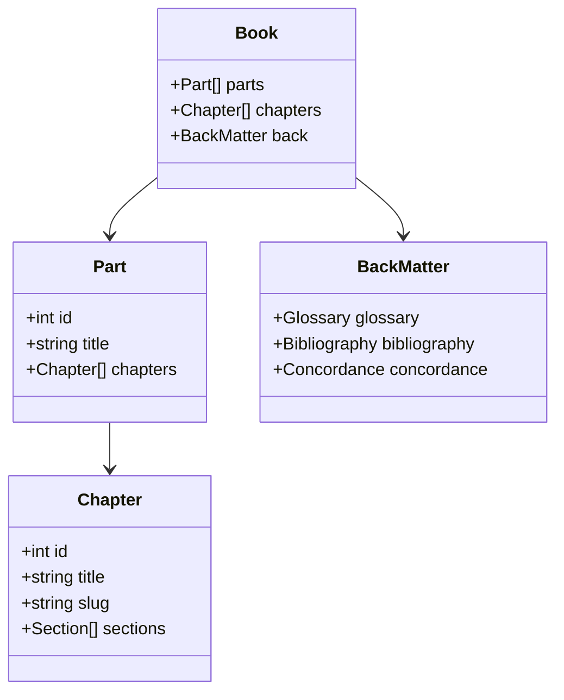
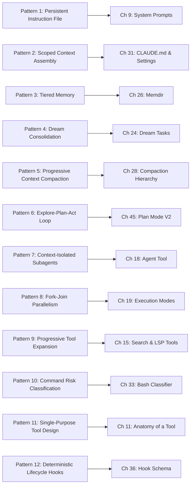

# Book Architecture, Reading Paths, and Citation Conventions

## Overview

This book is organized into ten parts, fifty-seven chapters, and a back matter section (glossary, bibliography, concordance). Each chapter follows an identical internal structure: Overview, Data structures and contracts, Control flow, Edge cases and failure modes, Where cc diverges from the published pattern, and Developer takeaways. This chapter explains how to read the book, the citation format used throughout, diagram conventions, and the cross-reference table that maps Harness Engineering Report (HER) patterns, failure modes, and best practices to specific chapters.

The book is designed for three reading paths. A linear reader gains the full narrative arc from foundations through synthesis. A systems engineer targeting a specific subsystem can jump to the relevant part and read its chapters in order, since each chapter assumes only the foundations in Parts 1 and 2. A practitioner building a new harness can start with Part 10 (Synthesis and Future Development), then read backward into the chapters that address the specific problems they face.

## Data structures and contracts

Citations in this book follow a precise format. Every factual claim about the cc source code is cited with the file path and line number: `src/path/to/file.ts:Lnnn` for a single line, or `src/path/to/file.ts:Lnnn-Lmmm` for a range. These citations are inline, in backticks, and refer to the pinned commit SHA recorded in `.book-build/repo-sha.txt`. When a citation references a directory rather than a file (e.g., `src/tools/BashTool/`), the line count in `.book-build/loc-hints/files.json` gives the total LOC across all files in that directory.

Code snippets are presented in fenced code blocks tagged with the source language. The first line inside every fence is a comment with the exact source path and line range plus a short caption:

```typescript
// src/entrypoints/cli.tsx:L33-L42 — Bootstrap entrypoint with fast-path flags
async function main(): Promise<void> {
  const args = process.argv.slice(2);

  // Fast-path for --version/-v: zero module loading needed
  if (args.length === 1 && (args[0] === '--version' || args[0] === '-v' || args[0] === '-V')) {
    // MACRO.VERSION is inlined at build time
    // biome-ignore lint/suspicious/noConsole:: intentional console output
    console.log(`${MACRO.VERSION} (Claude Code)`);
    return;
  }
```

The code inside each fence is verbatim from the source. Long functions may be trimmed with a `// ...` line, but the kept lines are literal copies. Each snippet is followed by two to six sentences of explanation referencing specific identifiers from the snippet. For example, the `args.length === 1` check on line L36 ensures the `--version` fast-path fires only when a single argument is provided, preventing it from matching `--version --model sonnet` invocations where more setup is needed. The `MACRO.VERSION` on line L40 is a build-time constant inlined by the Bun bundler, so this path has zero module-loading cost.

Diagrams use Mermaid syntax with five allowed diagram types: `flowchart`, `sequenceDiagram`, `stateDiagram-v2`, `classDiagram`, and `erDiagram`. Each diagram appears in a fenced `mermaid` code block. No other diagram types are used.



The HER's Session Protocol (ORIENT, SETUP, VERIFY, SELECT, IMPLEMENT, TEST, UPDATE, EXIT) provides a universal session lifecycle that applies across all harness implementations. cc's implementation of this protocol is distributed across multiple files: `src/entrypoints/cli.tsx` handles the ORIENT phase (determining which path to take), `src/entrypoints/init.ts` handles the SETUP phase (configuring the environment), `src/utils/sessionStart.ts` handles the VERIFY phase (checking trust and permissions), and `src/QueryEngine.ts` handles the IMPLEMENT phase (executing the agent loop). This distribution means that no single chapter covers the full session protocol; the practitioner must read Chapters 5, 6, 7, and 32 to see the complete flow.

The book's terminology registry in `.book-build/terminology.json` defines 33 canonical terms. Every chapter uses these terms with their exact definitions. Key terms include "harness" ("the engineering layer that wraps a language model, providing tool dispatch, state management, permission enforcement, and lifecycle control"), "subagent" ("a child agent spawned by the parent via AgentTool, running in a forked or in-process context with its own isolated conversation and tool access"), and "compaction" ("the process of reducing context length by summarizing or pruning conversation history, triggered when token budgets are approached"). When the text uses these terms, it uses them with these specific meanings, not as general English words.

The HER's Back-Pressure Stack defines a quality-gate hierarchy that maps to cc's architecture:

```text
# HER Section 20 — The Back-Pressure Stack
Type System -> Linter -> Unit Tests -> Integration Tests -> E2E/Browser Tests
     ^                                                            |
     |                                                            |
     +---- Only failures surface to agent context ----------------+
```

This stack prescribes that successful quality checks are silent -- only failures produce verbose output that enters the agent's context window. cc implements this principle partially through its hook system: `PreToolUse` hooks that approve a tool call produce no output, while hooks that deny a tool call return a denial message that the model sees. The observation masking technique from JetBrains Research (52% cost reduction) extends this principle by removing or summarizing verbose tool outputs from the model's context while preserving the fact of their execution.

## Control flow

The ten parts of this book follow a logical dependency chain. Part 1 (Foundations and Framing) establishes terminology and positions the book. Part 2 (Entry, Bootstrap, and the Runtime Spine) traces the startup sequence from `src/entrypoints/cli.tsx` through the query loop. Part 3 (The Tool System) covers the tool contract, dispatch pipeline, and every tool implementation. Part 4 (Sub-Agents, Tasks, and Multi-Agent Dispatch) explains how cc spawns, isolates, and coordinates sub-agents. Part 5 (Context, Memory, and State) covers the conversation model, memory hierarchy, compaction, session persistence, and the Redux-like store. Part 6 (Safety, Permissions, and Hooks) details the permission model, classifiers, filesystem guards, and the hook lifecycle. Part 7 (Interaction Surfaces) covers skills, slash commands, MCP, the Ink renderer, and the REPL. Part 8 (Long-Running Work) covers plan mode, worktrees, cron, remote agents, and experimental layers. Part 9 (Observability, Cost, and Security) covers analytics, diagnostics, and the threat model. Part 10 (Synthesis and Future Development) maps the 12 HER patterns and 17 failure modes onto cc, then sketches a reference architecture and roadmap.

The following cross-reference table maps each HER pattern to the chapter that covers its cc implementation:



The 12 HER patterns fall into four categories. Memory and Context patterns (1-5) are covered in Parts 5 and 7. Workflow and Orchestration patterns (6-8) are covered in Parts 4 and 8. Tools and Permissions patterns (9-11) are covered in Parts 3 and 6. The Automation pattern (12) is covered in Part 6. This categorization reflects cc's architecture: the codebase groups memory, orchestration, tool, and permission concerns into separate directory trees, and the book's part structure mirrors the codebase.

The HER's Session Protocol defines the universal session lifecycle that every harness should implement:

```text
# HER Section 20 — The Session Protocol
ORIENT  -> SETUP -> VERIFY -> SELECT -> IMPLEMENT -> TEST -> UPDATE -> EXIT
```

This protocol is not implemented as a single function in cc. Instead, it is distributed across the startup sequence. The ORIENT phase corresponds to the fast-path detection in `src/entrypoints/cli.tsx`. The SETUP phase corresponds to the `init()` function in `src/entrypoints/init.ts`. The VERIFY phase corresponds to the trust dialog and permission initialization in `src/utils/permissions/`. The SELECT phase corresponds to the model and effort selection in `src/bootstrap/state.ts`. The IMPLEMENT and TEST phases correspond to the query loop in `src/query.ts` and `src/QueryEngine.ts`. The UPDATE and EXIT phases correspond to the graceful shutdown system in `src/utils/gracefulShutdown.ts`.

The 17 HER failure modes map to chapters as follows. Context Rot (6.1) maps to Chapter 28 on compaction. Premature Completion (6.2) maps to Chapter 7 on the query loop's stop hooks. Self-Evaluation Bias (6.3) maps to Chapter 27 on session memory extraction. Placeholder Implementations (6.4) maps to Chapter 9 on system prompt instructions. Context Anxiety (6.5) maps to Chapter 28 on autocompact triggers. Silent Failures (6.6) maps to Chapter 12 on tool dispatch error handling. Infinite Loops (6.7) maps to Chapter 7 on the query loop's retry limits. Tool Explosion (6.8) maps to Chapter 15 on progressive tool expansion. Compounding Bugs Across Sessions (6.9) maps to Chapter 29 on session resume. Yak Shaving (6.10) maps to Chapter 22 on task scoping. Cost Explosion (6.11) maps to Chapter 50 on cost tracking. Hallucinated Tool Calls (6.12) maps to Chapter 12 on tool input validation. Security Vulnerabilities (6.13) maps to Chapter 52 on the threat model. Model Regression (6.14) maps to Chapter 8 on API fallback. Data Leakage (6.15) maps to Chapter 34 on filesystem permissions. Checkpoint-Restore Side Effects (6.16) maps to Chapter 29 on session persistence. Goal Misinterpretation (6.17) maps to Chapter 45 on plan mode's intent verification.

The 12 HER best practices map to chapters as follows. "Context windows are the constraint" (1) maps to Chapter 28. "Separate generation from evaluation" (2) maps to Chapter 21 on the generator-evaluator coordinator. "One task per session" (3) maps to Chapter 22. "Verify before building" (4) maps to Chapter 29. "Wire in fast feedback loops" (5) maps to Chapter 36 on hooks. "Repository is single source of truth" (6) maps to Chapter 13 on file tools. "Humans steer, agents execute" (7) maps to Chapter 32 on permission modes. "Expect eventual consistency" (8) maps to Chapter 7 on the query loop. "Simplify relentlessly" (9) maps to Chapter 4 on runtime stack tradeoffs. "Control costs actively" (10) maps to Chapter 50. "Observe everything" (11) maps to Chapter 51 on debug logs. "Secure by default" (12) maps to Chapter 52.

## Edge cases and failure modes

The cross-reference tables in this chapter are inherently incomplete. cc's codebase has many subsystem interactions that are not captured by the one-to-one mapping from HER patterns to chapters. For example, the permission system in `src/utils/permissions/` is relevant to both Pattern 10 (Command Risk Classification) and Pattern 12 (Deterministic Lifecycle Hooks), because permission checks fire inside hook execution. The memory system in `src/memdir/` is relevant to both Pattern 3 (Tiered Memory) and Pattern 5 (Progressive Context Compaction), because memories are compacted alongside conversation history. A practitioner reading only the chapter mapped to a specific pattern would miss these cross-cutting concerns.

This chapter itself has no source file citations beyond `src/entrypoints/cli.tsx` because it describes book conventions rather than source code. Chapter 2 is one of six chapters with `source_files_exempt: true` in the manifest, meaning it draws from HER cross-references rather than direct source file readings. The other exempt chapters are 53, 54, 55, 56, and 57, all in the synthesis part, which maps HER concepts to cc rather than walking source files line by line.

The book also uses a set of forbidden tokens that must never appear in any chapter. These include placeholder markers (TODO, TBD, XXX, [NEEDS-VERIFY]) and vague cross-reference phrases ("similar to chapter", "as noted earlier", "we will discuss", "as we shall see"). Filler words that minimize complexity ("simply", "obviously", "just" as filler) are also forbidden. The "in summary" phrase is prohibited, though the word "summary" alone in other contexts is permitted. These restrictions enforce precision: if a claim cannot be verified, it is omitted rather than marked with a placeholder.

A cross-reference that names a chapter number (e.g., "see Chapter 7 on the query loop") is only valid when the topic matches the chapter's synopsis. Cross-references never use vague phrases such as "similar to chapter" or "as noted earlier" -- they always specify the chapter number and topic.

The HER's equivalent-patterns table shows that the same concept is implemented differently across platforms. CLAUDE.md corresponds to `.cursor/rules` in Cursor and internal prompts in Devin. Progressive compaction corresponds to model-aware tuning in Cursor and autonomous session management in Devin. Subagent management maps to background Composer agents in Cursor and built-in multi-step orchestration in Devin. Tool permissions map to IDE-integrated permission UI in Cursor and sandboxed execution in Devin. Verification maps to built-in linting/testing integration in Cursor and PR-based verification plus human review in Devin. The cross-reference tables in this chapter are cc-specific; practitioners using other platforms must map the patterns to their own implementations.

## Where cc diverges from the published pattern

The HER presents its 12 patterns as general principles derived from reverse-engineering cc. The HER itself cautions: "These patterns are derived from reverse-engineering Claude Code's architecture. They represent implementation decisions of one specific product (CLI-first, Anthropic-native). Other platforms make fundamentally different tradeoffs." This book takes that caveat seriously. Each chapter's "Where cc diverges" section documents where the implementation departs from the HER's idealized description.

The HER's GUARDRAILS.md protocol defines a structured approach to guardrail definition using a Sign structure:

```text
# HER Section 12.2 — GUARDRAILS.md Protocol
Trigger: When this guardrail activates
Instruction: What the agent must do
Reason: Why this guardrail exists
Provenance: Who added it and when
```

cc does not use this exact protocol. Instead, guardrails are expressed through the permission system in `src/utils/permissions/`, the hook system in `src/utils/hooks/`, and the system prompt instructions in `src/constants/prompts.ts`. The permission rules encode the Trigger and Instruction (e.g., "deny write access to files outside the project directory"), the system prompt encodes the Reason (e.g., "never modify files outside the working directory"), and the hook configuration encodes the Provenance (e.g., which settings source defined the rule).

The 12 HER failure modes are not merely theoretical risks; several have been observed in production cc deployments. Context Rot (6.1) manifests when the model re-solves problems it already solved earlier in the conversation, which is why cc implements five levels of compaction in `src/services/compact/`. Premature Completion (6.2) manifests when the agent declares a task done without verifying all acceptance criteria, which is why the query loop in `src/query.ts` includes stop hooks that check for completion conditions. Infinite Loops (6.7) manifests when the agent retries the same failing operation without making progress, which is why cc implements maximum retry counts and exponential backoff in the query loop. Cost Explosion (6.11) is the number one operational risk for multi-hour tasks, which is why cc tracks token consumption in real time through `src/services/analytics/` and `src/cost-tracker.ts`. Each failure mode chapter not only describes the failure but documents cc's specific defense against it, enabling the practitioner to decide whether to adopt cc's approach or implement an alternative.

The HER's 12 best practices are synthesized from multiple sources and represent a distillation of both successes and failures from production agent deployments. Practice 1 ("Context windows are the constraint; structured artifacts are the solution") is the foundational insight: task lists should be JSON, not Markdown, because structured data survives compaction while prose does not. Practice 3 ("One task per session") prevents more failures than almost any other single rule, according to the HER. Practice 7 ("Humans steer, agents execute") is a reminder that the harness amplifies human judgment rather than replacing it. Practice 10 ("Control costs actively") is flagged as the number one operational risk for multi-hour tasks, with a recommendation to budget for 3-10 times the happy-path cost.

The HER's Back-Pressure Stack and presented as universal. In practice, several of them conflict with each other in cc's implementation. "Simplify relentlessly" (practice 9) conflicts with "Observe everything" (practice 11): cc's extensive analytics and telemetry infrastructure in `src/services/analytics/` adds complexity that simplification would remove. "Expect eventual consistency" (practice 8) conflicts with "Secure by default" (practice 12): the permission system's aggressive blocking of operations reduces the number of loops available for eventual convergence. These tensions are real and intentional; Part 10 addresses them directly.

The HER's Back-Pressure Stack (Type System, Linter, Unit Tests, Integration Tests, E2E/Browser Tests) prescribes that "only failures surface to agent context." cc's hook system in `src/utils/hooks/` partially implements this: `PreToolUse` hooks can block tool execution and surface the denial to the model, but the hook results that indicate success are silently consumed, not surfaced. The linter integration in cc works differently from the HER's model: cc does not run a linter as a quality gate inside the agent loop; instead, the user is expected to have their own linting setup, and cc's Edit tool applies changes that the user's own tooling will validate.

## Developer takeaways for building a long-running agent

Use the cross-reference tables in this chapter as a navigation aid, not as a prescription. The mapping from HER patterns to cc chapters shows where each pattern is implemented, but the "Where cc diverges" sections in those chapters are where the real lessons live. When building your own harness, start by reading the chapters that cover the patterns most relevant to your use case, then read the corresponding failure-mode chapters to understand what goes wrong when those patterns are missing or misapplied. The book's structure -- foundations, then subsystems, then synthesis -- mirrors the recommended build order for a new harness: establish your runtime and entry points first, then your tool system, then your safety and permission infrastructure, and only then your observability and multi-agent coordination layers. Read the developer takeaways in each chapter as condensed guidance, but verify every claim against the source code citations provided. The HER's best practices are a starting checklist, not a completion certificate; every practice has edge cases where it hurts more than it helps, and the failure-mode chapters document those edge cases.
