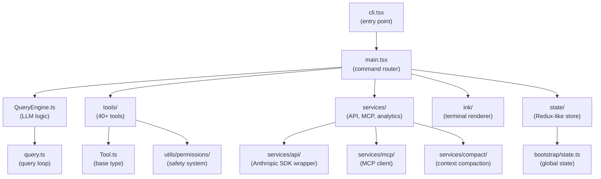
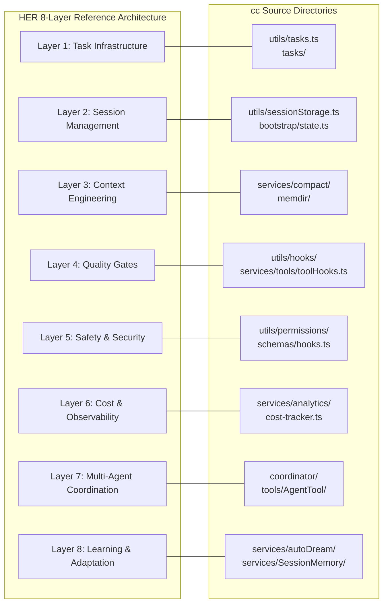

# A Guided Tour of the Repository

## Overview

The cc codebase is organized as a single `src/` directory containing approximately 35 subdirectories, 7 standalone modules at the root level, and over 4,683 lines in its main entry point. This chapter maps the top-level directory tree, explains what lives in each major folder, why it lives there, and how it connects to its neighbors. The goal is to provide an orientation map that makes every subsequent chapter's file-path citations legible before the deep dives begin.

The repository structure is not arbitrary. It reflects a layered architecture where the entry points (`src/entrypoints/`) depend on the main orchestrator (`src/main.tsx`), which depends on subsystems (`src/tools/`, `src/services/`, `src/utils/`), which depend on infrastructure (`src/state/`, `src/bootstrap/`, `src/ink/`). Dependencies flow inward from the entry points toward the infrastructure, never the reverse.

## Data structures and contracts

The top-level directory layout is as follows:

```text
src/
  main.tsx                 # 4,683 LOC — CLI entry + command routing
  query.ts                 # 1,729 LOC — query loop async generator
  QueryEngine.ts           # 1,295 LOC — LLM logic orchestrator
  Tool.ts                  #   792 LOC — base tool type + buildTool helper
  tools.ts                 #   389 LOC — tool registry and getTools()
  entrypoints/             # cli.tsx, init.ts, mcp.ts
  tools/                   # 40+ tool implementations
  services/                # API, MCP, analytics, compact, autoDream, LSP
  utils/                   # permissions, hooks, settings, messages, tasks
  state/                   # AppStateStore, onChangeAppState
  ink/                     # custom React terminal renderer
  screens/                 # REPL.tsx (5,005 LOC) and sub-screens
  components/              # React UI components
  hooks/                   # 80+ React hooks for UI and logic
  coordinator/             # multi-agent swarm orchestration
  bridge/                  # VS Code, JetBrains, Web bridges
  memdir/                  # tiered memory system
  bootstrap/               # state.ts (1,758 LOC) — global mutable state
  schemas/                 # Zod schemas for hooks, config
  constants/               # prompts.ts (914 LOC), OAuth config
  tasks/                   # DreamTask, LocalAgentTask, RemoteAgentTask
  skills/                  # skill loading and bundled skills
  commands/                # slash-command handlers
  buddy/                   # Tamagotchi companion system
  assistant/               # KAIROS proactive assistant
  voice/                   # voice input integration
  plugins/                 # plugin loading infrastructure
```

The `src/entrypoints/cli.tsx` file is the bootstrap entry point. At 302 LOC it is deliberately small, because its job is not to implement features but to dispatch to the correct code path as fast as possible. Every fast-path in `cli.tsx` is a conditional early return that avoids loading the ~4,683-line `main.tsx`. The fast-paths include `--version` (prints the version string and exits with zero imports), `--dump-system-prompt` (outputs the rendered system prompt for eval purposes), `--claude-in-chrome-mcp` and `--chrome-native-host` (for browser integration), `--daemon-worker` (for long-running supervisor workers), `remote-control`/`rc`/`remote`/`sync`/`bridge` (for IDE bridge mode), `daemon` (for the daemon supervisor), `ps`/`logs`/`attach`/`kill`/`--bg`/`--background` (for session management), `new`/`list`/`reply` (for template jobs), `environment-runner` (for headless BYOC), `self-hosted-runner` (for self-hosted runner workers), and `--worktree --tmux` (for tmux-based worktree entry). Each fast-path uses dynamic `import()` to load only the code it needs, keeping the initial module evaluation cost near zero for paths that are not taken. It runs before any other module loads, and its entire design is oriented toward fast-path detection -- checking for `--version`, `--dump-system-prompt`, `--daemon-worker`, and other flags that bypass the full CLI:

```typescript
// src/entrypoints/cli.tsx:L33-L42 — Bootstrap entrypoint with fast-path flags
async function main(): Promise<void> {
  const args = process.argv.slice(2);

  // Fast-path for --version/-v: zero module loading needed
  if (args.length === 1 && (args[0] === '--version' || args[0] === '-v' || args[0] === '-V')) {
    // MACRO.VERSION is inlined at build time
    // biome-ignore lint/suspicious/noConsole:: intentional console output
    console.log(`${MACRO.VERSION} (Claude Code)`);
    return;
  }
```

The `args.length === 1` guard ensures that `claude --version --model sonnet` does not trigger the fast-path, because the presence of additional arguments means the user intends to run the full CLI. This pattern repeats throughout `cli.tsx`: every fast-path is a conditional early return that avoids loading the ~4,683-line `main.tsx`.

The global mutable state is concentrated in `src/bootstrap/state.ts`, which at 1,758 LOC is the single largest infrastructure file. It exports getter and setter functions for all session-scoped state:

```typescript
// src/bootstrap/state.ts:L45-L80 — State type definition (excerpt)
type State = {
  originalCwd: string
  projectRoot: string
  totalCostUSD: number
  totalAPIDuration: number
  totalAPIDurationWithoutRetries: number
  totalToolDuration: number
  turnHookDurationMs: number
  turnToolDurationMs: number
  turnClassifierDurationMs: number
  turnToolCount: number
  turnHookCount: number
  turnClassifierCount: number
  startTime: number
  lastInteractionTime: number
  totalLinesAdded: number
  totalLinesRemoved: number
  hasUnknownModelCost: boolean
  cwd: string
  modelUsage: { [modelName: string]: ModelUsage }
  mainLoopModelOverride: ModelSetting | undefined
  initialMainLoopModel: ModelSetting
  // ...
}
```

The `State` type bundles cost tracking (`totalCostUSD`), timing metrics (`totalAPIDuration`, `turnHookDurationMs`), and project context (`originalCwd`, `projectRoot`) into a single object. The `modelUsage` dictionary tracks per-model token consumption, enabling the cost tracker in `src/cost-tracker.ts` to attribute spending to the correct model. The `totalLinesAdded` and `totalLinesRemoved` fields track code modification volume, which is surfaced in the session summary at exit. The comment on line L31 (`DO NOT ADD MORE STATE HERE - BE JUDICIOUS WITH GLOBAL STATE`) signals that this is a controlled singleton, not an open registry.

The `src/entrypoints/init.ts` file continues the bootstrap sequence after `cli.tsx` hands off to `main.tsx`. At 340 LOC, it is the second entry point and runs the deterministic initialization sequence that prepares the environment for the main loop. The init function is structured as a sequence of profiled steps, each with a `profileCheckpoint()` call that records its timing for startup performance analysis. The steps include enabling the configuration system, applying safe environment variables, setting up graceful shutdown handlers, initializing first-party event logging, populating OAuth account info, detecting the JetBrains IDE, detecting the GitHub repository, initializing remote managed settings, recording first-start time, configuring mTLS (mutual TLS), configuring HTTP proxies, and preconnecting to the Anthropic API. The `configureGlobalMTLS()` call is particularly important for enterprise deployments: it reads certificate and key paths from environment variables and configures the HTTP client to use mutual TLS for all API requests. The `preconnectAnthropicApi()` call overlaps the TCP and TLS handshake (~100-200ms) with the remaining initialization work, reducing the latency of the first API call.

The init function continues the bootstrap sequence with a memoized initialization that runs once and only once:

```typescript
// src/entrypoints/init.ts:L62-L84 — Init function with safe env vars
export const init = memoize(async (): Promise<void> => {
  const initStartTime = Date.now()
  logForDiagnosticsNoPII('info', 'init_started')
  profileCheckpoint('init_function_start')

  try {
    const configsStart = Date.now()
    enableConfigs()
    logForDiagnosticsNoPII('info', 'init_configs_enabled', {
      duration_ms: Date.now() - configsStart,
    })
    profileCheckpoint('init_configs_enabled')

    // Apply only safe environment variables before trust dialog
    const envVarsStart = Date.now()
    applySafeConfigEnvironmentVariables()
```

The `enableConfigs()` call on line L65 activates the configuration system, which loads settings from multiple sources (organization, user, project, directory) in a defined cascade order. The `applySafeConfigEnvironmentVariables()` call on line L75 applies only environment variables that are safe before the trust dialog is established -- full environment variables are applied after trust. This two-phase approach is a security measure: the harness does not apply user-controlled environment variables until the user has confirmed trust for the repository. At 340 LOC, it is the second entry point and runs the deterministic initialization sequence that prepares the environment for the main loop. The init function is structured as a sequence of profiled steps, each with a `profileCheckpoint()` call that records its timing for startup performance analysis. The steps include enabling the configuration system, applying safe environment variables, setting up graceful shutdown handlers, initializing first-party event logging, populating OAuth account info, detecting the JetBrains IDE, detecting the GitHub repository, initializing remote managed settings, recording first-start time, configuring mTLS (mutual TLS), configuring HTTP proxies, and preconnecting to the Anthropic API. The `configureGlobalMTLS()` call on line L137 is particularly important for enterprise deployments: it reads certificate and key paths from environment variables and configures the HTTP client to use mutual TLS for all API requests. The `preconnectAnthropicApi()` call on line L153 overlaps the TCP and TLS handshake (~100-200ms) with the remaining initialization work, reducing the latency of the first API call. after `cli.tsx` hands off to `main.tsx`. The `init` function is memoized and runs a deterministic sequence of configuration, security, and network setup steps:

```typescript
// src/entrypoints/init.ts:L62-L84 — Init function with safe env vars
export const init = memoize(async (): Promise<void> => {
  const initStartTime = Date.now()
  logForDiagnosticsNoPII('info', 'init_started')
  profileCheckpoint('init_function_start')

  try {
    const configsStart = Date.now()
    enableConfigs()
    logForDiagnosticsNoPII('info', 'init_configs_enabled', {
      duration_ms: Date.now() - configsStart,
    })
    profileCheckpoint('init_configs_enabled')

    // Apply only safe environment variables before trust dialog
    const envVarsStart = Date.now()
    applySafeConfigEnvironmentVariables()
```

The `enableConfigs()` call on line L65 activates the configuration system, which loads settings from multiple sources (organization, user, project, directory) in a defined cascade order. The `applySafeConfigEnvironmentVariables()` call on line L75 applies only environment variables that are safe before the trust dialog is established -- full environment variables are applied after trust. This two-phase approach is a security measure: the harness does not apply user-controlled environment variables until the user has confirmed trust for the repository.

## Control flow

The dependency flow through the codebase follows a consistent pattern. Entry points import from main, main imports from subsystems, and subsystems import from infrastructure. The following diagram shows the primary dependency edges:



The `src/main.tsx` file serves as the command router. After the fast-paths in `cli.tsx` dispatch to specialized handlers, the main function in `main.tsx` handles the full interactive CLI path. It imports over 60 modules at the top level, making it the most connected node in the dependency graph. The `renderAndRun` function (defined in `src/interactiveHelpers.tsx` at 57,424 bytes) is the bridge between the command-routing logic and the Ink-based terminal UI. This function creates the React component tree, initializes the Ink renderer, and starts the REPL event loop.

The `src/main.tsx` file also contains the migration system. The `runMigrations()` function on lines L326-L351 runs a sequence of synchronous migrations that update user configuration when the application is upgraded. The `CURRENT_MIGRATION_VERSION` constant on line L325 is bumped when a new migration is added. Migrations include renaming deprecated settings keys, updating model identifiers (e.g., `migrateSonnet1mToSonnet45.ts` and `migrateSonnet45ToSonnet46.ts`), and resetting default preferences when product decisions change (e.g., `resetProToOpusDefault.ts` and `resetAutoModeOptInForDefaultOffer.ts`). The migration system is a harness concern: when the harness evolves, the user's persisted configuration must be updated to match, or the harness will fail silently with stale settings. After the fast-paths in `cli.tsx` dispatch to specialized handlers, the main function in `main.tsx` handles the full interactive CLI path. It imports over 60 modules at the top level, making it the most connected node in the dependency graph. The `renderAndRun` function (defined in `src/interactiveHelpers.tsx`) is the bridge between the command-routing logic and the Ink-based terminal UI.

The `src/tools/` directory contains 40+ tool implementations, organized as flat subdirectories under `src/tools/`. The tools fall into several categories. File operation tools include `FileReadTool/` (1,602 LOC), `FileWriteTool/` (856 LOC), `FileEditTool/` (1,812 LOC), `GlobTool/` (267 LOC), `GrepTool/` (795 LOC), and `NotebookEditTool/` (587 LOC). Shell execution tools include `BashTool/` (12,411 LOC, the largest tool by far) and `PowerShellTool/` (8,959 LOC). Agent orchestration tools include `AgentTool/` (1,397 LOC for `AgentTool.tsx` alone, plus supporting files `forkSubagent.ts` at 210 LOC, `loadAgentsDir.ts` at 755 LOC, and `runAgent.ts` at 973 LOC). Meta-tools include `TodoWriteTool/` (300 LOC), `AskUserQuestionTool/` (309 LOC), `BriefTool/` (610 LOC), `ConfigTool/` (809 LOC), and `SendMessageTool/` (997 LOC). Web tools include `WebFetchTool/` (1,131 LOC) and `WebSearchTool/` (569 LOC). Search and analysis tools include `ToolSearchTool/` (593 LOC) and `LSPTool/` (2,005 LOC). Task management tools include `TaskCreateTool/` (195 LOC), `TaskListTool/` (166 LOC), `TaskGetTool/` (153 LOC), `TaskUpdateTool/` (484 LOC), `TaskStopTool/` (179 LOC), and `TaskOutputTool/` (584 LOC). MCP tools include `MCPTool/` (77 LOC for `MCPTool.ts`), `ListMcpResourcesTool/` (171 LOC), and `ReadMcpResourceTool/` (210 LOC). Schedule and worktree tools include `ScheduleCronTool/` (543 LOC), `EnterWorktreeTool/` (177 LOC), and `ExitWorktreeTool/` (386 LOC). Plan mode tools include `EnterPlanModeTool/` (126 LOC) and `ExitPlanModeTool/` (493 LOC). The `BashTool/` at 12,411 LOC is by far the largest, reflecting the complexity of command classification, sandboxing, and safety checks required for shell execution.

The `src/hooks/` directory contains 80+ React hooks, each in its own subdirectory. The tool registry function `getTools()` in `src/tools.ts` assembles the available tool set based on feature flags, permission mode, and session context. The base type in `src/Tool.ts` defines the tool contract: a Zod/JSONSchema input definition, a `call()` method, concurrency flags, and deferral settings. The tools range from file operations (`FileReadTool/`, `FileWriteTool/`, `FileEditTool/`, `GlobTool/`, `GrepTool/`) to shell execution (`BashTool/`, `PowerShellTool/`) to agent orchestration (`AgentTool/`, `SendMessageTool/`) to meta-tools (`TodoWriteTool/`, `TaskCreateTool/`, `AskUserQuestionTool/`).

The `src/services/` directory is the largest subsystem, containing 28 subdirectories and standalone files. API communication lives in `services/api/` with `claude.ts` at 3,419 LOC (the Anthropic SDK wrapper), `errors.ts` at 1,207 LOC, `logging.ts` at 788 LOC, and `usage.ts` at 63 LOC. MCP client management lives in `services/mcp/` with `client.ts` at 3,348 LOC, `config.ts` at 1,578 LOC, `auth.ts` at 2,465 LOC, and `types.ts` at 258 LOC. Context compaction lives in `services/compact/` with `compact.ts` at 1,705 LOC, `microCompact.ts` at 530 LOC, `autoCompact.ts` at 351 LOC, `sessionMemoryCompact.ts` at 630 LOC, `apiMicrocompact.ts` at 153 LOC, `postCompactCleanup.ts` at 77 LOC, `timeBasedMCConfig.ts` at 43 LOC, and `compactWarningHook.ts` at 16 LOC. Memory consolidation lives in `services/autoDream/` with `autoDream.ts` at 324 LOC, `consolidationLock.ts` at 140 LOC, and `consolidationPrompt.ts` at 65 LOC. Other notable services include `services/SessionMemory/` with `sessionMemory.ts` at 495 LOC and `prompts.ts` at 324 LOC, `services/analytics/` with `growthbook.ts` at 1,155 LOC and `index.ts` at 173 LOC, `services/lsp/` at 2,460 LOC total, and `services/tokenEstimation.ts` at 495 LOC., containing API communication (`services/api/` with `claude.ts` at 3,419 LOC), MCP client management (`services/mcp/` with `client.ts` at 3,348 LOC and `config.ts` at 1,578 LOC), analytics (`services/analytics/`), context compaction (`services/compact/` with `compact.ts` at 1,705 LOC), memory consolidation (`services/autoDream/`), LSP integration (`services/lsp/`), and OAuth (`services/oauth/`). Each service is independently importable, and most are lazily loaded to reduce startup time.

The `src/hooks/` directory contains 80+ React hooks that bridge the UI and business logic. The most important is `useCanUseTool.tsx` (203 LOC), which evaluates permission decisions for every tool invocation. Others include `useTypeahead.tsx` (1,384 LOC) for command completion, `useVoice.ts` (1,144 LOC) for voice input, and `useGlobalKeybindings.tsx` (248 LOC) for keyboard shortcuts. The `useMergedTools.ts` and `useMergedCommands.ts` hooks assemble the available tool and command sets based on the current permission mode, feature flags, and MCP server connections. The `useDiffData.ts` and `useDiffInIDE.ts` hooks manage diff visualization for file edits. The `useSwarmInitialization.ts` and `useSwarmPermissionPoller.ts` hooks manage multi-agent coordination. The hooks directory also contains utility hooks like `useElapsedTime.ts`, `useMinDisplayTime.ts`, and `useTimeout.ts` that manage timing and display behavior for the terminal UI.

The `src/services/tools/` directory provides the tool dispatch infrastructure shared across all tools. `toolExecution.ts` (1,745 LOC) handles the execution of a single tool call, including input validation and error handling. `toolOrchestration.ts` (188 LOC) manages the coordination of multiple concurrent tool calls, including read-only parallelism and write serialization. `toolHooks.ts` (650 LOC) fires `PreToolUse` and `PostToolUse` hooks around every tool invocation. `StreamingToolExecutor.ts` (530 LOC) handles the streaming of tool output back to the UI during long-running tool executions.

The `src/tasks/` directory contains seven task types: `DreamTask/` (157 LOC, background memory consolidation), `LocalAgentTask/` (682 LOC, in-process agent execution), `RemoteAgentTask/` (855 LOC, cloud-based agent execution), `InProcessTeammateTask/` (teammate collaboration within the same process), `LocalMainSessionTask.ts` (479 LOC, the primary session task), `LocalShellTask/` (shell-based task execution), and `stopTask.ts` (task termination). Each task type has its own lifecycle and state transitions, managed through the `src/utils/tasks.ts` utility (862 LOC). The task types implement a common interface defined in `src/tasks/types.ts`, which specifies status values (pending, in_progress, completed, failed, cancelled), blocking relationships, and filesystem-based persistence paths.

The `src/bridge/` directory implements IDE integration through two main files: `bridgeMain.ts` (2,999 LOC) and `replBridge.ts` (2,406 LOC). These files handle the communication between cc and external IDEs (VS Code, JetBrains) via a bridge protocol that allows the IDE to send commands to cc and receive tool output events. The bridge architecture is discussed in detail in Chapter 44.

The `src/memdir/` directory implements the tiered memory system with six files: `memdir.ts` (507 LOC, the main API), `memoryTypes.ts` (271 LOC, type definitions for memory categories), `paths.ts` (278 LOC, filesystem paths for memory storage), `findRelevantMemories.ts` (141 LOC, relevance retrieval), `memoryScan.ts` (94 LOC, directory scanning), and `memoryAge.ts` (53 LOC, age calculation). The memory system uses a MEMORY.md index file (capped at 200 lines) that is always loaded into context, and per-topic memory files that are loaded on demand. Memory types include user, feedback, project, and reference categories, each with different retention and relevance rules.

The `src/utils/` directory is the largest utility collection, containing over 33 subdirectories and standalone files. The most important subdirectories are `utils/permissions/` (9,409 LOC total across `permissions.ts` at 1,486 LOC, `filesystem.ts` at 1,777 LOC, `PermissionMode.ts` at 141 LOC, `PermissionRule.ts` at 40 LOC, `bashClassifier.ts` at 61 LOC, and `denialTracking.ts` at 45 LOC), `utils/hooks/` (containing `hooks.ts` at 5,022 LOC, `execPromptHook.ts` at 211 LOC, `execHttpHook.ts` at 242 LOC, `execAgentHook.ts` at 339 LOC, `sessionHooks.ts` at 447 LOC, `hooksSettings.ts` at 271 LOC, `hooksConfigManager.ts` at 400 LOC, `hookEvents.ts` at 192 LOC, `registerSkillHooks.ts` at 64 LOC, and `ssrfGuard.ts` at 294 LOC), `utils/settings/` (containing `settings.ts` at 1,015 LOC, `types.ts` at 1,148 LOC, and `settingsCache.ts` at 80 LOC), and `utils/messages.ts` at 5,511 LOC (the conversation model).: `DreamTask/`, `LocalAgentTask/`, `RemoteAgentTask/`, `InProcessTeammateTask/`, `LocalMainSessionTask.ts`, `LocalShellTask/`, and `stopTask.ts`. Each task type has its own lifecycle and state transitions, managed through the `src/utils/tasks.ts` utility (862 LOC).

The following diagram maps the HER's eight-layer reference architecture onto cc's directory structure:



## Edge cases and failure modes

The `src/bootstrap/state.ts` file is a shared mutable singleton with no locking mechanism. The file exports getter and setter functions for every field in the `State` type, using the `createSignal()` utility from `src/utils/signal.ts` to create reactive bindings. The `totalCostUSD` field is incremented on every API response that includes usage data, and the `modelUsage` dictionary is updated with per-model token counts. The `startTime` field is set once at init and used to calculate session duration. The `lastInteractionTime` field is updated on every user keystroke and every model response, enabling idle detection for features like autoDream. Multiple concurrent tool executions can read and write `totalCostUSD` simultaneously, and the file relies on JavaScript's single-threaded event loop to prevent data races. This works for the common case but can produce inaccurate cost tallies if async operations interleave in unexpected orders. with no locking mechanism. Multiple concurrent tool executions can read and write `totalCostUSD` simultaneously, and the file relies on JavaScript's single-threaded event loop to prevent data races. This works for the common case but can produce inaccurate cost tallies if async operations interleave in unexpected orders. The `modelUsage` dictionary has the same concern: per-model token counts are accumulated without atomicity guarantees.

The `src/main.tsx` file's 4,683-line length creates a maintenance burden. Over 60 top-level imports, multiple feature-flag-gated conditional imports via `require()`, and a command-routing function that handles every CLI subcommand make it a high-coupling node. Any change to a CLI flag, a new migration, or a new tool registration requires modifying `main.tsx`. The lazy-require pattern (`const coordinatorModeModule = feature('COORDINATOR_MODE') ? require(...) : null`) mitigates this at the bundle level but not at the source-readability level.

The `src/tools/` directory's flat namespace (42 subdirectories) makes tool discovery difficult for newcomers. There is no `tools/README.md` or index file that summarizes the tools by category. The `getTools()` function in `src/tools.ts` serves as the runtime registry, but the source tree itself provides no grouping.

The `src/screens/REPL.tsx` file at 5,005 LOC is the single largest component in the codebase. It integrates the prompt input, tool output display, streaming text rendering, and all keyboard/mouse event handling. Its size creates a similar maintenance burden to `main.tsx`: any UI change requires modifying this file, and the tight coupling between rendering logic and business logic makes it difficult to test in isolation.

The `src/components/` directory contains 33 subdirectories with React UI components. These components handle the visual presentation of tool output, diff views, file edit previews, permission prompts, error messages, and the REPL input area. The components are rendered by the Ink reconciler and use Yoga (a Flexbox layout engine compiled to native code) for layout calculation. The component tree is rooted at `App.tsx` in `src/ink/components/`, which is the top-level component that switches between the REPL screen, setup screens, and dialog screens based on the current application state.

The `src/commands.ts` file at 754 LOC defines the slash-command registry. Commands are either prompt-type (which substitute text into the prompt) or callback-type (which execute a function). The `src/utils/processUserInput/processSlashCommand.tsx` at 921 LOC handles the parsing and dispatch of slash commands, including argument substitution and flag handling. The `src/utils/slashCommandParsing.ts` at 60 LOC provides the low-level parser for command syntax.

The `src/state/` directory contains six files that implement the Redux-like store: `AppStateStore.ts` (569 LOC, the store definition with the `AppState` type and the `getDefaultAppState()` function), `AppState.tsx` (199 LOC, React context bindings), `onChangeAppState.ts` (171 LOC, subscriber registration), `store.ts` (the Redux-compatible store implementation), `selectors.ts` (memoized state selectors), and `teammateViewHelpers.ts` (teammate-specific state utilities). The store is the single source of truth for the UI state, and every component reads from it via React hooks rather than direct property drilling.

The `src/buddy/` directory at first appears to be an odd inclusion in a production agent harness. It contains `companion.ts` (133 LOC) and `sprites.ts` (514 LOC), implementing a Tamagotchi-style companion system with 18 species, deterministic gacha mechanics using a Mulberry32 PRNG seeded from the user's `userId`, and stats like `DEBUGGING`, `CHAOS`, and `SNARK`. While this seems frivolous, it demonstrates a harness principle: the agent's personality and user experience are part of the harness, not separate from it. The buddy system increases user engagement and emotional attachment to the tool, which in turn increases the likelihood that users will configure and maintain their harness properly.

The `src/assistant/` directory contains the KAIROS proactive assistant feature, with `sessionHistory.ts` at 87 LOC. KAIROS is an "always-on" assistant that watches logs and acts without waiting for user input. It is feature-gated by `feature('KAIROS')` and loaded conditionally in `src/main.tsx` via a `require()` call. The assistant module represents a different interaction model from the standard REPL: instead of the user driving every interaction, the assistant proactively suggests actions based on observed context.

The `src/upstreamproxy/` directory at 740 LOC implements HTTP proxy configuration for environments where direct internet access is restricted. This is an enterprise concern that reflects cc's deployment in corporate environments where traffic must be routed through a proxy server. The proxy configuration interacts with the TLS/mTLS system in `src/utils/mtls.ts` and the certificate configuration in `src/utils/caCertsConfig.ts`.

The `src/schemas/` directory contains Zod schema definitions that validate the shape of configuration files. The most important is `schemas/hooks.ts` (222 LOC), which defines the schema for the hook configuration file that users place in `.claude/settings.json`. This schema validates hook types (command, prompt, http, agent, function), event names (PreToolUse, PostToolUse, SessionStart, Notification, SubagentStop, etc.), and the structure of hook matchers including command glob patterns and timeout settings. The Zod schemas serve as the source of truth for the configuration file format: if a user's hook configuration does not match the schema, cc will reject it at load time with a descriptive error message.

The `src/constants/` directory contains two important files: `prompts.ts` (914 LOC, the system prompt assembly logic) and `oauth.ts` (OAuth configuration for Anthropic authentication). The prompts file is the heart of the prompt-engineering layer: it composes the final system prompt from a base template, environment information, tool descriptions, skill definitions, memory entries, hook outputs, effort settings, and plan-mode constraints. is the single largest component in the codebase. It integrates the prompt input, tool output display, streaming text rendering, and all keyboard/mouse event handling. Its size creates a similar maintenance burden to `main.tsx`: any UI change requires modifying this file, and the tight coupling between rendering logic and business logic makes it difficult to test in isolation.

## Where cc diverges from the published pattern

The HER's Layer 1 (Task Infrastructure) prescribes append-only task lists with boolean pass/fail. cc's task system in `src/utils/tasks.ts` supports seven task types with complex status transitions that go well beyond boolean pass/fail. The HER's simplified model does not account for the variety of task lifecycles needed in a production harness: a DreamTask has different completion semantics than a LocalAgentTask, and a RemoteAgentTask has different failure modes than an InProcessTeammateTask.

The HER's Layer 4 (Quality Gates) prescribes pre-commit type-checking and linting as back-pressure on the agent. cc's hook system in `src/utils/hooks/` provides `PreToolUse` and `PostToolUse` lifecycle events that can serve as quality gates, but cc does not run type-checking or linting as part of the agent loop itself. The assumption is that the user's own CI pipeline will catch these issues. This is a deliberate tradeoff: running a type checker after every edit would slow the agent significantly and consume context window tokens on diagnostic output. However, the hook system does allow users to configure their own quality gates: a `PreToolUse` hook for the `Edit` tool can run `tsc --noEmit` on the modified file and block the edit if type errors are introduced. The infrastructure is present; the policy is left to the user.

The HER's Layer 4 (Quality Gates) prescribes pre-commit type-checking and linting as back-pressure on the agent. cc's hook system in `src/utils/hooks/` provides `PreToolUse` and `PostToolUse` lifecycle events that can serve as quality gates, but cc does not run type-checking or linting as part of the agent loop itself. The assumption is that the user's own CI pipeline will catch these issues. This is a deliberate tradeoff: running a type checker after every edit would slow the agent significantly and consume context window tokens on diagnostic output.

The HER's Layer 6 (Cost & Observability) prescribes OpenTelemetry-distributed tracing across multi-agent workflows. cc's observability in `src/services/analytics/` uses a custom event-sink architecture with Datadog and GrowthBook integrations, not OpenTelemetry. The `logEvent()` function in `src/services/analytics/index.ts` sends structured events to sinks, but there is no distributed trace correlation across sub-agent boundaries. This reflects cc's design as a single-machine CLI tool rather than a distributed system.

The HER's Layer 7 (Multi-Agent Coordination) prescribes git-based conflict resolution for parallel agent work. cc's worktree implementation in `src/utils/worktree.ts` provides isolated git worktrees for parallel agents, but conflict resolution is left to the user -- cc does not attempt automatic merge resolution. The HER's model assumes a more autonomous approach.

## Developer takeaways for building a long-running agent

When building your own harness, start by establishing your directory structure around the dependency flow, not around feature flags. cc's `src/main.tsx` demonstrates the cost of routing too many concerns through a single file: it becomes a coupling magnet that must be modified for every new feature. A better pattern is to have the entry point delegate to a router that dynamically discovers and loads command handlers, similar to how `cli.tsx` uses dynamic `import()` for its fast-paths. Concentrate your mutable global state in one file (as cc does with `src/bootstrap/state.ts`) and enforce discipline with a "do not add more state" comment and code review. Organize your tools directory with a category-level grouping (file-tools, shell-tools, web-tools, meta-tools) rather than a flat namespace. Map the HER's eight layers onto your directory structure early -- even if your implementation diverges, the mapping provides a shared vocabulary with other harness engineers and a framework for auditing which layers your harness covers and which it neglects. The `init.ts` memoized-bootstrap pattern is worth replicating: a single async function that runs once, configures the environment in a safe order (safe vars before trust, full vars after trust), and records timing checkpoints for every step.
