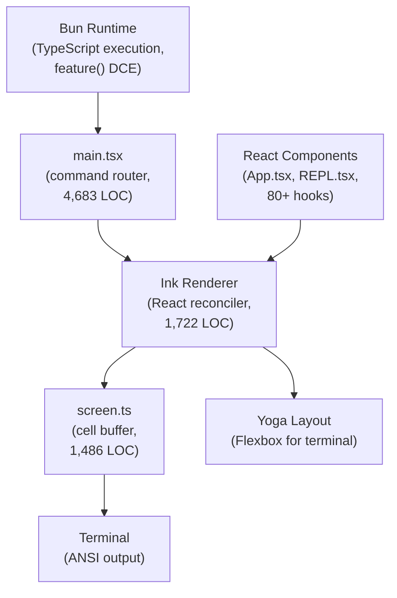
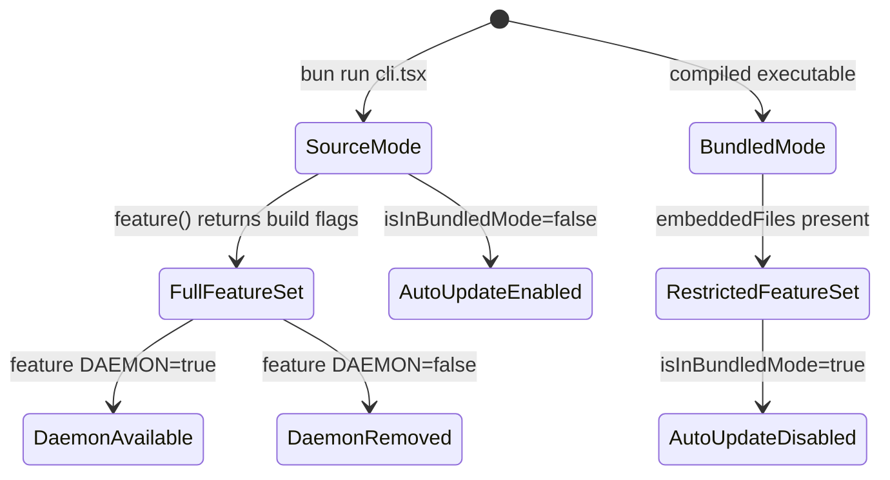

# TypeScript, Bun, React, Ink: The Unusual Runtime Stack

## Overview

Most CLI tools are written in C, Rust, Go, or Python. cc runs on TypeScript with Bun, renders its UI with React, and paints to the terminal using Ink -- a custom React reconciler that targets ANSI output instead of the DOM. This stack is unusual for a command-line tool, and the tradeoffs are not obvious. This chapter explains why cc chose this stack, what each component contributes, and where the stack creates friction that a harness engineer should understand before replicating it.

The core insight is that cc is not a traditional CLI. It is a long-running interactive application with a rich terminal UI (tool output panels, diff views, streaming text, mouse-driven text selection, search highlighting, focus management). The React/Ink combination enables component-based UI development with re-renders driven by state changes, which is precisely what a terminal-based agent needs: the UI must reflect the current state of the query loop, tool execution, and permission decisions without manual screen management.

## Data structures and contracts

The runtime stack flows from Bun through main.tsx through the Ink tree to the terminal. Bun replaces Node.js as the JavaScript runtime, providing faster startup, native TypeScript execution, and the `feature()` function for build-time dead code elimination. The `isRunningWithBun()` check in `src/utils/bundledMode.ts` detects the runtime:

```typescript
// src/utils/bundledMode.ts:L7-L10 — Bun runtime detection
export function isRunningWithBun(): boolean {
  // https://bun.com/guides/util/detect-bun
  return process.versions.bun !== undefined
}
```

This simple check enables conditional code paths throughout the codebase. When Bun is detected, cc can use Bun-specific APIs like `Bun.spawn()` for process management and `Bun.file()` for file I/O. When running under Node.js, cc falls back to Node-equivalent implementations.

The bundled-mode detection in the same file checks for Bun-compiled standalone executables:

```typescript
// src/utils/bundledMode.ts:L16-L22 — Compiled executable detection
export function isInBundledMode(): boolean {
  return (
    typeof Bun !== 'undefined' &&
    Array.isArray(Bun.embeddedFiles) &&
    Bun.embeddedFiles.length > 0
  )
}
```

The `Bun.embeddedFiles` API is only available in compiled Bun executables (created with `bun build --compile`). When `isInBundledMode()` returns true, cc knows it is running as a self-contained binary rather than from source, which affects auto-update behavior and resource path resolution. The `Bun.embeddedFiles.length > 0` check on line L21 ensures that this detection does not fire for Bun runtime environments that are not compiled executables -- the `embeddedFiles` array exists but is empty when running from source. The distinction between source mode and bundled mode affects multiple subsystems: auto-update is disabled in bundled mode (the binary updates itself, not npm), resource paths resolve differently (embedded files are in the binary, not on disk), and the `--settings` flag handling in `src/main.tsx:L432-L483` uses a content-hash-based temporary file path instead of a random UUID to avoid invalidating the Anthropic API prompt cache, which is particularly important for SDK users who spawn a new process per query.

The `feature()` function from `bun:bundle` is the build-time feature flag system. It enables dead code elimination: when `feature('DAEMON')` evaluates to `false` at build time, the entire daemon code path is removed from the bundle. This is visible throughout `src/entrypoints/cli.tsx`:

```typescript
// src/entrypoints/cli.tsx:L100-L106 — Feature-gated daemon worker path
if (feature('DAEMON') && args[0] === '--daemon-worker') {
  const {
    runDaemonWorker
  } = await import('../daemon/workerRegistry.js');
  await runDaemonWorker(args[1]);
  return;
}
```

The `feature('DAEMON')` guard ensures that the daemon worker code is only included in builds that support it. In external builds where `DAEMON` is disabled, this entire `if` block is eliminated at build time, removing the import of `workerRegistry.js` and its transitive dependencies from the bundle. The `await import()` on line L103 is a dynamic import that only executes when the feature flag is true and the CLI argument matches, further reducing the startup cost for paths that are never taken.

## Control flow

The Ink renderer is the most distinctive component of the stack. It is a custom React reconciler that renders React components to ANSI terminal output. The `Ink` class in `src/ink/ink.tsx` manages the reconciliation loop:

```typescript
// src/ink/ink.tsx:L67-L98 — Ink class core structure
export type Options = {
  stdout: NodeJS.WriteStream;
  stdin: NodeJS.ReadStream;
  stderr: NodeJS.WriteStream;
  exitOnCtrlC: boolean;
  patchConsole: boolean;
  waitUntilExit?: () => Promise<void>;
  onFrame?: (event: FrameEvent) => void;
};
export default class Ink {
  private readonly log: LogUpdate;
  private readonly terminal: Terminal;
  private scheduleRender: (() => void) & {
    cancel?: () => void;
  };
  // Ignore last render after unmounting a tree to prevent empty output before exit
  private isUnmounted = false;
  private isPaused = false;
  private readonly container: FiberRoot;
  private rootNode: dom.DOMElement;
  readonly focusManager: FocusManager;
  private renderer: Renderer;
  private readonly stylePool: StylePool;
  private charPool: CharPool;
  private hyperlinkPool: HyperlinkPool;
```

The `container: FiberRoot` on line L85 is the React reconciler's root. The `focusManager: FocusManager` on line L88 manages focus cycling between interactive elements. The `stylePool`, `charPool`, and `hyperlinkPool` on lines L89-L91 are interned string pools that reduce memory allocation during rendering -- the terminal is repainted on every state change, and without pooling, the constant creation and disposal of style strings would create significant GC pressure.

The rendering pipeline uses a throttled microtask-based scheduler. The constructor in `src/ink/ink.tsx` sets up the schedule mechanism:

```typescript
// src/ink/ink.tsx:L212-L216 — Throttled microtask render scheduling
const deferredRender = (): void => queueMicrotask(this.onRender);
this.scheduleRender = throttle(deferredRender, FRAME_INTERVAL_MS, {
  leading: true,
  trailing: true
});
```

The `queueMicrotask(this.onRender)` call on line L212 defers rendering to after React's layout effects have committed. The comment in the source explains: "Any state set in layout effects -- notably the cursorDeclaration from useDeclaredCursor -- would lag one commit behind if we rendered synchronously." The `throttle()` wrapper with `leading: true` and `trailing: true` ensures that the first render fires immediately and the last state change is always painted, even if intermediate changes are coalesced.

The `screen.ts` module provides the cell-level terminal abstraction. The `CharPool` class interns single characters to avoid repeated string allocation:

```typescript
// src/ink/screen.ts:L21-L42 — Character string pool for rendering efficiency
export class CharPool {
  private strings: string[] = [' ', '']
  private stringMap = new Map<string, number>([
    [' ', 0],
    ['', 1],
  ])
  private ascii: Int32Array = initCharAscii()

  intern(char: string): number {
    if (char.length === 1) {
      const code = char.charCodeAt(0)
      if (code < 128) {
        const cached = this.ascii[code]!
        if (cached !== -1) return cached
        const index = this.strings.length
        this.strings.push(char)
        this.ascii[code] = index
        return index
      }
    }
    const existing = this.stringMap.get(char)
    if (existing !== undefined) return existing
    const index = this.strings.length
    this.strings.push(char)
    this.stringMap.set(char, index)
    return index
  }
```

The `intern()` method uses an ASCII fast-path: for single characters with code points below 128, it checks a pre-allocated `Int32Array` instead of a `Map` lookup. This optimization matters because `intern()` is called for every character in every cell of every frame. The `Int32Array` lookup on line L33 (`this.ascii[code]!`) is a direct array index, which is orders of magnitude faster than a Map lookup for the common case of ASCII characters.

The `StylePool` class in `screen.ts` extends this interning pattern to ANSI escape sequences:

```typescript
// src/ink/screen.ts:L112-L141 — Style interning with visible-on-space bit flag
export class StylePool {
  private ids = new Map<string, number>()
  private styles: AnsiCode[][] = []
  private transitionCache = new Map<number, string>()
  readonly none: number

  intern(styles: AnsiCode[]): number {
    const key = styles.length === 0 ? '' : styles.map(s => s.code).join('\0')
    let id = this.ids.get(key)
    if (id === undefined) {
      const rawId = this.styles.length
      this.styles.push(styles.length === 0 ? [] : styles)
      id =
        (rawId << 1) |
        (styles.length > 0 && hasVisibleSpaceEffect(styles) ? 1 : 0)
      this.ids.set(key, id)
    }
    return id
  }
```

The `intern()` method on line L129 encodes a clever optimization in the returned ID: bit 0 indicates whether the style has a "visible effect on space characters" (background, inverse, underline). The `rawId << 1` shift on line L135 makes room for this flag. This lets the renderer skip invisible spaces with a single bitmask check (`id & 1`) on the packed word, avoiding the need to look up the style array for every space cell. The `transitionCache` on line L115 pre-computes the ANSI escape sequence needed to transition between any two styles, so repeated transitions (e.g., from bold to normal text) require zero string allocation after the first call.





## Edge cases and failure modes

The TypeScript/Bun stack creates a distributability problem. Node.js is ubiquitous on developer machines; Bun is not. The `isRunningWithBun()` check in `src/utils/bundledMode.ts` enables fallback paths, but the codebase is optimized for Bun. Features like `Bun.spawn()`, `Bun.file()`, and `bun:bundle` have no Node.js equivalents, requiring polyfills or alternative implementations for the Node.js path. The `process.env.CLAUDE_CODE_REMOTE` check in `src/entrypoints/cli.tsx:L9-L14` illustrates a Node.js-specific concern: in CCR (Claude Code Remote) environments, which run in containers with 16GB of memory, the heap size must be explicitly set via `NODE_OPTIONS` because Node.js does not auto-detect available memory. Bun's memory management is different, making this check unnecessary on the Bun path but critical for the Node.js fallback.

The npm sourcemap leak of March 2026 exposed cc's entire source code through the published npm package. The `README.md` at the repository root documents this incident: "When you publish a JavaScript/TypeScript package to npm, the build toolchain often generates source map files (.map files). These files bridge minified production code and the original source for debugging. The catch? Source maps contain the original source code embedded as strings inside a JSON file under the sourcesContent key." This incident highlights a fundamental tension in the TypeScript/Bun stack: the same build pipeline that enables fast iteration and type safety also creates a vector for source code exposure. The `feature()` system's build-time dead code elimination helps by removing internal features from external builds, but it does not prevent the bundle itself from being decompiled.

The Ink renderer's cell-buffer architecture in `src/ink/screen.ts` has a performance ceiling. Every state change triggers a full re-render cycle: React reconciliation, Yoga layout calculation, cell-buffer diffing, and ANSI output. For a 5,005-LOC REPL screen (`src/screens/REPL.tsx`) with dozens of components, this cycle can be expensive. The `FRAME_INTERVAL_MS` constant in `src/ink/constants.ts` caps the frame rate to prevent the renderer from consuming too much CPU, but it also means the UI can lag behind rapid state changes (e.g., streaming tool output). The `prevFrameContaminated` flag in `src/ink/ink.tsx:L158-L159` handles a related edge case: when the selection overlay mutates the screen buffer between frames, the renderer must force a full repaint rather than a diff, because the diff basis is no longer valid.

The `feature()` dead code elimination system creates a two-build problem. Internal (Anthropic) builds enable features like `DAEMON`, `KAIROS`, `COORDINATOR_MODE`, and `DUMP_SYSTEM_PROMPT` that are stripped from external builds. This means internal and external builds have different code paths, and bugs can exist in one but not the other. The `feature()` calls must stay inline (not wrapped in helper functions) for the Bun bundler to detect and eliminate them.

The React/Ink combination introduces a startup cost. React reconciliation, component mounting, and the first Yoga layout pass take measurable time before the user sees any output. cc mitigates this with the `startCapturingEarlyInput()` function in `cli.tsx` and the parallel prefetch pattern in `src/main.tsx`, but the cost is real: the Ink renderer must be initialized before any UI can appear. The `isBeingDebugged()` function in `src/main.tsx:L232-L263` checks for inspector attachment and exits if detected (in external builds), because debugging adds overhead that makes the startup path unrepresentative of production performance.

The Ink constructor's initialization sequence in `src/ink/ink.tsx:L180-L239` shows the full cost. It creates the terminal adapter, allocates two frame buffers (`frontFrame` and `backFrame`), initializes the `LogUpdate` writer, creates the `StylePool`, `CharPool`, and `HyperlinkPool`, sets up the throttled render scheduler, registers SIGCONT and resize handlers, creates the root DOM node, initializes the `FocusManager`, and creates the React reconciler. The `emptyFrame()` call on lines L196-L197 allocates two full-screen cell buffers (one for the current frame and one for the next), each containing `terminalRows * terminalColumns` cells. For a 24-row by 80-column terminal, this is 1,920 cells per frame, each containing a character ID, a style ID, and a hyperlink ID. The double-buffering approach enables diff-based rendering: the renderer compares the front frame (what is currently on screen) with the back frame (what should be on screen after the next render), and only writes the differences to the terminal. This is critical for performance because writing ANSI escape sequences to the terminal is the slowest operation in the rendering pipeline.

The `needsEraseBeforePaint` flag in `src/ink/ink.tsx:L165` handles a specific rendering edge case. When a terminal resize occurs, the entire screen must be cleared and repainted. However, calling `ERASE_SCREEN` synchronously in the resize handler would leave the screen blank for the ~80ms it takes to compute the next frame. The comment on lines L161-L165 explains: "Writing ERASE_SCREEN synchronously in handleResize would leave the screen blank for the ~80ms render() takes; deferring into the atomic block means old content stays visible until the new frame is fully ready." This pattern -- defer destructive operations until the replacement content is ready -- is a general principle for terminal UI rendering that applies regardless of the programming language. `src/ink/ink.tsx:L180-L239` shows the full cost. It creates the terminal adapter, allocates two frame buffers (`frontFrame` and `backFrame`), initializes the `LogUpdate` writer, creates the `StylePool`, `CharPool`, and `HyperlinkPool`, sets up the throttled render scheduler, registers SIGCONT and resize handlers, creates the root DOM node, initializes the `FocusManager`, and creates the React reconciler. The `emptyFrame()` call on lines L196-L197 allocates two full-screen cell buffers (one for the current frame and one for the next), each containing `terminalRows * terminalColumns` cells. For a 24-row by 80-column terminal, this is 1,920 cells per frame, each containing a character ID, a style ID, and a hyperlink ID. React reconciliation, component mounting, and the first Yoga layout pass take measurable time before the user sees any output. cc mitigates this with the `startCapturingEarlyInput()` function in `cli.tsx` and the parallel prefetch pattern in `src/main.tsx`, but the cost is real: the Ink renderer must be initialized before any UI can appear. The `isBeingDebugged()` function in `src/main.tsx:L232-L263` checks for inspector attachment and exits if detected (in external builds), because debugging adds overhead that makes the startup path unrepresentative of production performance.

## Where cc diverges from the published pattern

The HER's Section 4 (Fowler taxonomy) classifies harness controls as either computational (deterministic, fast) or inferential (AI-powered, slower). cc's runtime stack blurs this distinction. The `feature()` system is purely computational: it makes build-time decisions about which code to include. But the Ink renderer's focus management and text selection are implemented as React state machines, which are computational in principle but complex enough to behave like inferential controls -- their behavior depends on the interaction of many state variables, and bugs in their logic can produce unpredictable UI outcomes.

The HER's Section 12.4 (Security Threat Model) identifies supply chain attacks via MCP servers, skills, and hooks as a critical threat. cc's TypeScript/Bun stack is relevant here: npm packages (including Bun packages) can execute arbitrary code at install time, and the `feature()` system's reliance on build-time flags means a compromised build environment could enable features that should be disabled. The `isInBundledMode()` check in `src/utils/bundledMode.ts` provides some defense (compiled executables cannot be modified at runtime), but it does not protect against build-time compromises. The npm sourcemap leak that exposed cc's entire source code in March 2026 is a case study in this threat: the build pipeline shipped `.map` files to npm, which contained the full source in `sourcesContent`.

The HER's Section 12.5 documents the OpenClaw incident as a cautionary case: an open-source agent framework with 135,000 GitHub stars and 21,000 exposed instances was found to have a critical RCE vulnerability (CVE-2025-53773, CVSS 9.6) through its tool interface. This incident demonstrates that agent security is not theoretical -- it is an active, high-severity concern. The npm sourcemap leak of cc's source code is a related case: the entire source code was exposed through the build pipeline, revealing internal feature flags, codenames, and architecture details that were not intended for public consumption.

Fowler's concept of "harnessability" -- the degree to which a codebase supports harness implementation -- is directly applicable to cc's stack choice. Fowler identifies strongly typed languages, clear module boundaries, and conventional frameworks as factors that improve harnessability. TypeScript with React/Ink scores well on typing and module boundaries but poorly on conventional frameworks: Ink is a custom reconciler, not a standard terminal UI framework, which means the pool of developers who can maintain it is small. Fowler's Ashby's Law application ("a regulator must have at least as much variety as the system it governs") suggests that a custom renderer is necessary precisely because standard terminal UI frameworks lack the variety (mouse support, text selection, search highlighting, focus management) that cc's harness requires.

## Developer takeaways for building a long-running agent

The TypeScript/Bun/React/Ink stack is a specific solution to a specific problem: building a rich interactive terminal UI for a long-running agent. If your agent is headless (API-only, no terminal UI), this stack is overkill -- use Go or Rust for smaller binaries and faster startup. If your agent runs in a browser or IDE, use the native platform SDK instead of fighting Ink's terminal limitations. The React component model is the real win of this stack, not TypeScript or Bun specifically. React's declarative rendering -- describe the UI as a function of state, let the framework figure out the diff -- is exactly right for an agent whose state changes rapidly and unpredictably. If you choose a different language, replicate this pattern: build your UI layer as a function of state, not as imperative screen manipulation. The `CharPool` and `StylePool` interning pattern from `screen.ts` is worth replicating in any terminal renderer: cell-level rendering with string pooling eliminates GC pressure and enables frame-to-frame diffing by integer comparison rather than string comparison. The `StylePool`'s bit-0 trick for visible-on-space detection is a micro-optimization that compounds across millions of cells per second. Finally, if you adopt a feature-flag system like `feature()`, enforce the rule that flags must be checked inline, not wrapped in helper functions, so your bundler can eliminate dead code at build time. The two-build problem is real and requires discipline: every feature-gated path must be tested in both configurations.
