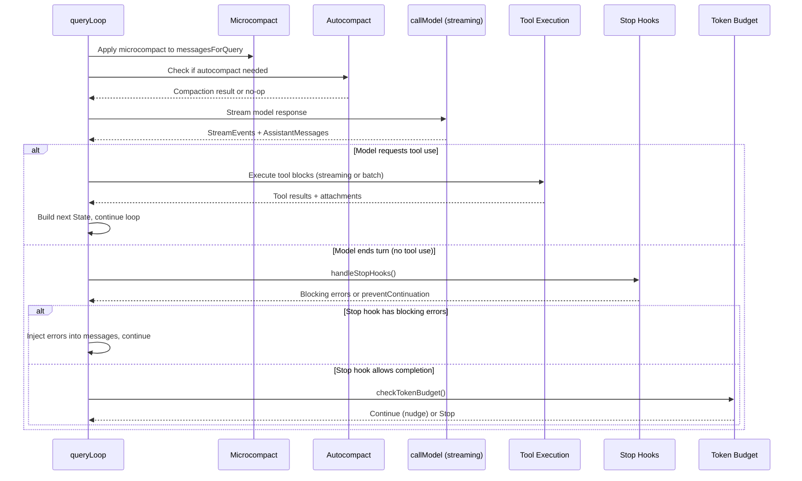
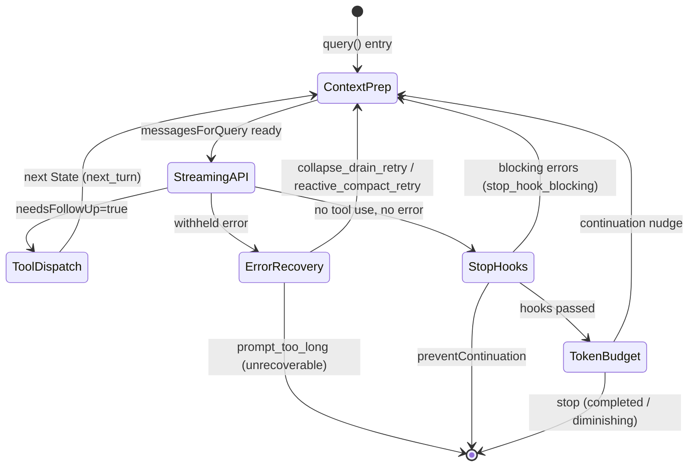
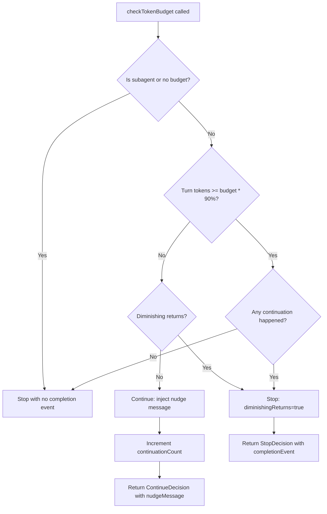

# The Query Loop: Heartbeat of the Agent

## Overview

Every agent needs a heartbeat — a repeating cycle that alternates between asking the model what to do next and then doing it. In cc, that heartbeat is `queryLoop()` in `src/query.ts`, a 1,729-line async generator that drives the entire agent from user prompt to final response. This chapter walks through every phase of that loop: how it assembles context, calls the model, dispatches tools, evaluates stop conditions, and decides whether to continue or terminate. The query loop is where the harness engineering discipline most visibly manifests — it is the single function that binds model streaming, tool execution, compaction, token budgets, stop hooks, and recovery logic into one coherent state machine.

The loop is wrapped by a thin `query()` async generator at `src/query.ts:L219` that delegates via `yield*` and handles post-loop command lifecycle notifications. The real work happens inside `queryLoop()`. An outer `QueryEngine` class in `src/QueryEngine.ts` owns the session-level state (messages, usage, permission denials) and calls `query()` from its `submitMessage()` method, translating internal message types into the SDK-facing `SDKMessage` stream that headless consumers receive.

## Data structures and contracts

### State — the cross-iteration accumulator

The loop carries mutable state between iterations in a `State` object. Rather than reassigning nine separate variables at each `continue` site, the loop writes `state = { ... }` with updated fields, then destructures at the top of the next iteration.

```typescript
// src/query.ts:L204-L217 — State type carried between loop iterations
type State = {
  messages: Message[]
  toolUseContext: ToolUseContext
  autoCompactTracking: AutoCompactTrackingState | undefined
  maxOutputTokensRecoveryCount: number
  hasAttemptedReactiveCompact: boolean
  maxOutputTokensOverride: number | undefined
  pendingToolUseSummary: Promise<ToolUseSummaryMessage | null> | undefined
  stopHookActive: boolean | undefined
  turnCount: number
  transition: Continue | undefined
}
```

The `transition` field records why the previous iteration continued — values like `'next_turn'`, `'stop_hook_blocking'`, `'max_output_tokens_recovery'`, `'collapse_drain_retry'`, and `'token_budget_continuation'`. This lets downstream logic and tests assert recovery paths fired without inspecting message contents. The `stopHookActive` flag prevents stop hooks from running recursively when a hook's blocking error causes a continuation. The `maxOutputTokensRecoveryCount` caps retry attempts when the model hits its output token limit.

### QueryParams — the immutable input contract

```typescript
// src/query.ts:L181-L199 — QueryParams type
export type QueryParams = {
  messages: Message[]
  systemPrompt: SystemPrompt
  userContext: { [k: string]: string }
  systemContext: { [k: string]: string }
  canUseTool: CanUseToolFn
  toolUseContext: ToolUseContext
  fallbackModel?: string
  querySource: QuerySource
  maxOutputTokensOverride?: number
  maxTurns?: number
  skipCacheWrite?: boolean
  taskBudget?: { total: number }
  deps?: QueryDeps
}
```

The `deps` field enables dependency injection for testing. The `QueryDeps` type at `src/query/deps.ts:L21` exposes four functions — `callModel`, `microcompact`, `autocompact`, and `uuid` — so tests can inject fakes directly instead of using module-level `spyOn` boilerplate.

### QueryConfig — snapshot-once runtime gates

```typescript
// src/query/config.ts:L15-L27 — QueryConfig type
export type QueryConfig = {
  sessionId: SessionId
  gates: {
    streamingToolExecution: boolean
    emitToolUseSummaries: boolean
    isAnt: boolean
    fastModeEnabled: boolean
  }
}
```

These values are snapshotted once at `query()` entry via `buildQueryConfig()`. The comment at `src/query/config.ts:L8` explains the design rationale: separating immutable config from the per-iteration `State` struct makes future `step()` extraction tractable — a pure reducer could take `(state, event, config)` where config is plain data. Feature gates accessed via `feature()` are intentionally excluded because they serve as tree-shaking boundaries and must stay inline at guarded blocks.

### BudgetTracker — token budget continuation logic

```typescript
// src/query/tokenBudget.ts:L6-L11 — BudgetTracker type
export type BudgetTracker = {
  continuationCount: number
  lastDeltaTokens: number
  lastGlobalTurnTokens: number
  startedAt: number
}
```

The `BudgetTracker` feeds the token budget continuation feature. When a turn's cumulative output tokens approach the configured budget, `checkTokenBudget()` at `src/query/tokenBudget.ts:L45` decides whether to inject a "continue" nudge message (if under 90% of budget) or stop the loop (if at threshold or showing diminishing returns). The diminishing-returns check at `src/query/tokenBudget.ts:L59` fires when three consecutive iterations each produced fewer than 500 new tokens — a signal that the model is spinning without making progress.

## Control flow

### The main loop structure

The `queryLoop()` function at `src/query.ts:L241` is an infinite `while (true)` loop. Each iteration proceeds through a fixed sequence of phases: context preparation, API call, tool dispatch, and continuation decision. The loop terminates via explicit `return` statements — never by falling off the end of the `while`.



### Phase 1: Context preparation

At the top of each iteration, the loop destructures `state` into its component fields at `src/query.ts:L311`. It then applies a cascade of context-reduction transformations to `messagesForQuery`:

1. **Tool result budget** (`applyToolResultBudget` at `src/query.ts:L379`) — enforces per-message size limits on tool outputs before microcompact runs, since cached microcompact operates by `tool_use_id` and never inspects content.
2. **History snip** (`src/query.ts:L401`) — gated behind `feature('HISTORY_SNIP')`, removes old message ranges that fall outside the active context window.
3. **Microcompact** (`deps.microcompact` at `src/query.ts:L414`) — a lightweight pass that removes verbose tool outputs and redundant content without full summarization.
4. **Context collapse** (`src/query.ts:L440`) — projects a collapsed view over the REPL's full history; staged collapses are committed here if the token count demands it.
5. **Autocompact** (`deps.autocompact` at `src/query.ts:L454`) — the heaviest reduction, producing a full summary of conversation history when the token count exceeds the model's context window.

These stages compose: snip tokens freed are plumbed to the autocompact threshold check via `snipTokensFreed` at `src/query.ts:L467` so the threshold accurately reflects what snip already removed.

### Phase 2: API call with streaming

After context preparation, the loop constructs the full system prompt at `src/query.ts:L449` and enters the streaming API call via `deps.callModel()` at `src/query.ts:L659`. The call yields a sequence of `StreamEvent` and `AssistantMessage` objects. As each event arrives, the loop:

- Tracks `needsFollowUp` when a `tool_use` content block appears at `src/query.ts:L833`.
- If streaming tool execution is enabled, feeds tool blocks to a `StreamingToolExecutor` at `src/query.ts:L841` so tools can begin executing before the model finishes streaming.
- Withholds recoverable errors (prompt-too-long, max-output-tokens) from the yield stream at `src/query.ts:L795` — the loop does not surface these to consumers until it knows whether recovery can succeed.

If a `FallbackTriggeredError` is caught at `src/query.ts:L894`, the loop clears all accumulated assistant messages, tombstones orphaned thinking blocks, creates a fresh `StreamingToolExecutor`, and retries with the fallback model. This is the model-fallback path: the user's primary model may be overloaded, and the harness silently retries on the fallback.

### Phase 3: Tool dispatch

When `needsFollowUp` is true, the loop proceeds to tool execution at `src/query.ts:L1380`. Two paths exist:

- **Streaming**: The `StreamingToolExecutor` has already been executing tools as they arrived during streaming. The loop calls `getRemainingResults()` to collect any still-pending results.
- **Batch**: The `runTools()` function from `src/services/tools/toolOrchestration.ts` processes all tool blocks sequentially.

```typescript
// src/query.ts:L1380-L1382 — Tool execution dispatch
const toolUpdates = streamingToolExecutor
  ? streamingToolExecutor.getRemainingResults()
  : runTools(toolUseBlocks, assistantMessages, canUseTool, toolUseContext)
```

After tool execution, the loop generates a tool-use summary via `generateToolUseSummary()` at `src/query.ts:L1469`. This fires off a Haiku call in the background (non-blocking), and the summary is yielded on the next iteration when the model is streaming. This overlapping of summary generation with the next API call is a latency optimization — the Haiku call takes ~1 second while the next model stream takes 5–30 seconds.

The loop then collects attachments (file changes, queued commands, memory prefetch results, skill discovery results) at `src/query.ts:L1580` and merges them into `toolResults` before building the next `State`.

### Phase 4: Continuation decision

When `needsFollowUp` is false (the model ended its turn without requesting tools), the loop enters the termination-evaluation phase. This is where the HER Pattern 6 (Explore-Plan-Act) and the failure-mode defenses converge:

1. **Error recovery** — If the withheld error was prompt-too-long, the loop first tries draining staged context collapses at `src/query.ts:L1089`, then tries reactive compact at `src/query.ts:L1119`. If both fail, the error surfaces and the loop returns.
2. **Max-output-tokens recovery** — If the model hit its output token limit, the loop first escalates to a higher limit (8k → 64k) at `src/query.ts:L1199`, then injects a recovery message asking the model to continue mid-thought at `src/query.ts:L1224`. Recovery is capped at `MAX_OUTPUT_TOKENS_RECOVERY_LIMIT = 3` attempts.
3. **Stop hooks** — The `handleStopHooks()` generator at `src/query/stopHooks.ts:L65` runs lifecycle hooks that may block continuation, inject errors, or allow completion. Blocking errors cause a continuation with the errors appended; `preventContinuation` causes an immediate return.
4. **Token budget** — `checkTokenBudget()` at `src/query/tokenBudget.ts:L45` evaluates whether to inject a continuation nudge or terminate.



### Stop hooks in depth

The `handleStopHooks()` function at `src/query/stopHooks.ts:L65` is an async generator that yields progress messages and returns a `StopHookResult`. It runs the following sequence:

1. Saves cache-safe params for the REPL `/btw` command and SDK `side_question` at `src/query/stopHooks.ts:L97`.
2. Classifies job state (if running as a dispatched job) at `src/query/stopHooks.ts:L108`.
3. Fires background processes: prompt suggestions, memory extraction, auto-dream — all fire-and-forget at `src/query/stopHooks.ts:L136`.
4. Executes stop hooks via `executeStopHooks()` at `src/query/stopHooks.ts:L180`, yielding progress messages and collecting blocking errors and `preventContinuation` flags.
5. For teammates, runs `TaskCompleted` and `TeammateIdle` hooks at `src/query/stopHooks.ts:L335`.

If any hook sets `preventContinuation`, the loop returns `{ reason: 'stop_hook_prevented' }`. If hooks produce blocking errors, the errors are injected into the message stream and the loop continues — giving the model a chance to address the hook's concerns.

### Token budget evaluation



The `checkTokenBudget()` function at `src/query/tokenBudget.ts:L45` implements diminishing-returns detection as a back-pressure mechanism. When three consecutive iterations each produce fewer than 500 new tokens (`DIMINISHING_THRESHOLD` at `src/query/tokenBudget.ts:L4`), the loop terminates even if the budget has not been fully consumed. This defends against the HER §6.7 infinite-loop failure mode where an agent retries without making progress.

## Edge cases and failure modes

### Context rot (HER §6.1)

When key content falls in mid-window positions, model performance degrades. The query loop combats this through its cascade of context-reduction stages — snip, microcompact, context collapse, and autocompact — which progressively prune and summarize conversation history. The `snipTokensFreed` value at `src/query.ts:L467` is plumbed into the autocompact threshold check so autocompact's decision reflects what snip already removed, preventing redundant compaction work.

### Premature completion (HER §6.2)

An agent may declare work done too early. The token budget continuation feature at `src/query.ts:L1308` combats this: when the model stops but the turn's output tokens are below 90% of the budget, `checkTokenBudget()` injects a nudge message asking the model to continue. The nudge includes the current percentage and token count so the model can assess whether more work remains.

### Infinite loops (HER §6.7)

Three independent defenses prevent the query loop from spinning forever:

1. The `maxTurns` parameter at `src/query.ts:L1705` — when exceeded, the loop returns `{ reason: 'max_turns' }`.
2. The diminishing-returns check in `checkTokenBudget()` at `src/query/tokenBudget.ts:L59` — terminates when three consecutive iterations each produce fewer than 500 new tokens.
3. The `MAX_OUTPUT_TOKENS_RECOVERY_LIMIT = 3` cap at `src/query.ts:L164` — prevents unbounded max-output-tokens recovery loops.
4. The `hasAttemptedReactiveCompact` flag at `src/query.ts:L1297` — prevents a death spiral where compact → still too long → error → stop hook blocking → compact repeats, burning thousands of API calls.

### Abort handling

User interrupts can arrive at any point. The loop checks `toolUseContext.abortController.signal.aborted` at multiple points:

- During streaming at `src/query.ts:L839` — streaming tool execution skips adding new tools.
- After streaming at `src/query.ts:L1015` — the loop yields synthetic tool_result blocks for any orphaned tool_use blocks.
- During tool execution at `src/query.ts:L1485` — the loop returns `{ reason: 'aborted_tools' }`.
- During stop hooks at `src/query/stopHooks.ts:L283` — hooks return `{ preventContinuation: true }`.

### Streaming fallback

When the primary model triggers a `FallbackTriggeredError` at `src/query.ts:L894`, the loop performs a clean handoff: tombstoning orphaned thinking blocks (which have invalid signatures that would 400 on the fallback model), discarding the streaming executor, and retrying with the fallback model. The `attemptWithFallback` flag at `src/query.ts:L650` controls the outer retry loop — it defaults to `true` so the first attempt can trigger fallback, then is set to `false` to prevent further retries.

## Where cc diverges from the published pattern

HER §5 Pattern 6 describes the Explore-Plan-Act loop as having three phases with "escalating permissions (read-only → discussion → full access)." cc's query loop does not implement explicit phase transitions within a single loop iteration. Instead, permission escalation happens through a separate mechanism: plan mode (enforced via `useCanUseTool`) gates which tools the model may call, and `EnterPlanModeTool`/`ExitPlanModeTool` manage the transition between read-only exploration and full-access execution. The query loop itself is permission-agnostic — it executes whatever tools the model requests, subject to the `canUseTool` callback's decision. This separation of concerns (loop structure vs. permission gating) is more flexible than baking phase transitions into the loop, but it means the loop's state machine has no explicit "explore" or "plan" phase — those emerge from the interaction of tool gating and model behavior.

HER §6.7's fix for infinite loops prescribes "maximum retry counts, exponential backoff, loop detection." cc implements maximum retry counts (via `maxTurns`, `MAX_OUTPUT_TOKENS_RECOVERY_LIMIT`, and the diminishing-returns detector) but does not implement exponential backoff within the query loop itself — API retries with backoff are handled at the `queryModelWithStreaming` layer. The loop-level defense is purely count-based: terminate after N iterations of diminishing progress.

The `handleStopHooks()` function at `src/query/stopHooks.ts:L65` diverges from a simple pre/post hook model. It is an async generator that interleaves hook execution with yielding progress messages, error collection, and continuation-prevention evaluation — a richer protocol than the "deterministic lifecycle hooks" described in HER §5 Pattern 12. The generator structure allows hooks to produce intermediate output (progress bars, status messages) before the final decision is reached.

## Developer takeaways for building a long-running agent

The query loop demonstrates that a long-running agent's core loop must be a state machine, not a simple recursion. The `State` type at `src/query.ts:L204` carries twelve fields across iterations because every continuation decision — whether from tool results, stop-hook blocking, error recovery, or token budgets — needs its own bookkeeping. New harness builders should resist the temptation to add loop-exit conditions ad hoc; instead, each exit path should be a named `transition` reason that the State machine tracks explicitly. The dependency-injection pattern in `QueryDeps` at `src/query/deps.ts:L21` is worth adopting early: tests that spy on module imports create fragile coupling, while injected deps let you replace the model call, compaction, and UUID generation with deterministic fakes. The diminishing-returns detector at `src/query/tokenBudget.ts:L59` is the cheapest defense against infinite loops — a threshold on delta tokens per iteration — and should be implemented before any fancy backoff strategy. The withholding pattern for recoverable errors at `src/query.ts:L795` is subtle but critical: if you surface a prompt-too-long error to SDK consumers before recovery finishes, the consumer may terminate the session while the recovery loop is still running. Finally, the stop-hook protocol at `src/query/stopHooks.ts:L65` shows that lifecycle hooks must be generators, not simple callbacks, if you want to support progress reporting, blocking errors, and continuation prevention in one unified interface.
