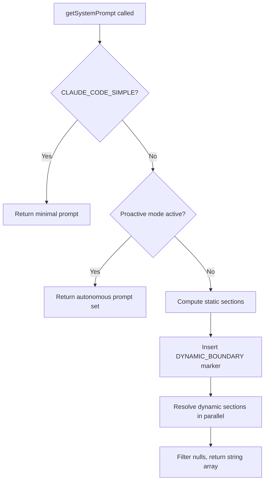

# System Prompts and Prompt Assembly

## Overview

Every query that cc sends to the Anthropic API begins with a system prompt assembled from over a dozen independent layers. The central function `getSystemPrompt()` in `src/constants/prompts.ts` composes these layers into an ordered string array, where each element becomes a separate system-prompt block in the API request. The architecture is not a single monolithic blob; it is a pipeline of composable sections, many of them conditional on feature flags, permission modes, or runtime state. This chapter traces the full assembly path from the static intro through the dynamic boundary to the per-session fragments, showing how cc implements the HER's Scoped Context Assembly pattern (Pattern 2) and the Persistent Instruction File pattern (Pattern 1).

## Data structures and contracts

### The section registry

cc uses a section registry defined in `src/constants/systemPromptSections.ts` (imported as `systemPromptSection` and `DANGEROUS_uncachedSystemPromptSection` in `src/constants/prompts.ts:L53-L56`) to manage which prompt fragments are cacheable and which must be recomputed on every turn. The registry distinguishes between:

- **Static sections**: content that is identical across all users and sessions within a cache scope (global or org-level). These are computed once and placed before the `SYSTEM_PROMPT_DYNAMIC_BOUNDARY` marker.
- **Dynamic sections**: content that varies per session or per turn (MCP instructions, memory files, environment details). These are placed after the boundary and are managed through the registry so that cache-invalidation is granular rather than all-or-nothing.

The boundary marker itself is a sentinel string:

```typescript
// src/constants/prompts.ts:L114-L115
export const SYSTEM_PROMPT_DYNAMIC_BOUNDARY =
  '__SYSTEM_PROMPT_DYNAMIC_BOUNDARY__'
```

This constant is consumed by `src/utils/api.ts` (`splitSysPromptPrefix`) and `src/services/api/claude.ts` (`buildSystemPromptBlocks`) to split the system prompt array into a cacheable prefix and a dynamic suffix. Anything before the boundary can use `scope: 'global'` in the API's prompt-caching mechanism; anything after cannot.

### The dynamic-section type contract

Each dynamic section is registered with a name key and a factory function. The `systemPromptSection` helper creates a cacheable entry, while `DANGEROUS_uncachedSystemPromptSection` creates one that must be recomputed on every invocation. The resolved sections are awaited in parallel via `resolveSystemPromptSections()`:

```typescript
// src/constants/prompts.ts:L491-L555
const dynamicSections = [
  systemPromptSection('session_guidance', () =>
    getSessionSpecificGuidanceSection(enabledTools, skillToolCommands),
  ),
  systemPromptSection('memory', () => loadMemoryPrompt()),
  systemPromptSection('ant_model_override', () =>
    getAntModelOverrideSection(),
  ),
  systemPromptSection('env_info_simple', () =>
    computeSimpleEnvInfo(model, additionalWorkingDirectories),
  ),
  // ... additional sections
]
const resolvedDynamicSections =
  await resolveSystemPromptSections(dynamicSections)
```

The `resolveSystemPromptSections` function evaluates each factory, filters out null results, and returns the string array to be appended after the boundary.

## Control flow

### The full assembly pipeline

The `getSystemPrompt()` function at `src/constants/prompts.ts:L444-L577` is the top-level entry point. Its control flow proceeds as follows:

1. If `CLAUDE_CODE_SIMPLE` is set, return a minimal one-line prompt.
2. If the proactive/autonomous mode is active, return a different prompt set optimized for autonomous operation.
3. Otherwise, compute the standard prompt:
   a. Compute the static sections (intro, system rules, doing-tasks, actions, using-your-tools, tone-and-style, output-efficiency).
   b. Optionally insert the `SYSTEM_PROMPT_DYNAMIC_BOUNDARY` marker.
   c. Compute and append the dynamic sections (session guidance, memory, model override, environment info, language, output style, MCP instructions, scratchpad, function-result-clearing, token budget, brief).
4. Filter out any null sections and return.



### The environment-info computation

The `computeSimpleEnvInfo()` function at `src/constants/prompts.ts:L651-L710` constructs the `# Environment` section. It gathers: the working directory, git status, platform, shell, OS version, model identity, knowledge cutoff, and the current frontier model family IDs. For undercover mode (internal Anthropic builds that must not leak model names into public commits), all model references are suppressed:

```typescript
// src/constants/prompts.ts:L659-L667
let modelDescription: string | null = null
if (process.env.USER_TYPE === 'ant' && isUndercover()) {
  // suppress
} else {
  const marketingName = getMarketingNameForModel(modelId)
  modelDescription = marketingName
    ? `You are powered by the model named ${marketingName}. The exact model ID is ${modelId}.`
    : `You are powered by the model ${modelId}.`
}
```

The undercover check is inlined at each callsite rather than hoisted to a constant so that the bundler can constant-fold `process.env.USER_TYPE === 'ant'` to `false` in external builds, eliminating the branch entirely through dead-code elimination.

### CLAUDE.md loading and the memory-prompt section

The `loadMemoryPrompt()` function, imported from `src/memdir/memdir.ts`, assembles all CLAUDE.md and memory files into the system prompt. The loading order, documented in `src/utils/claudemd.ts:L1-L26`, is:

1. Managed memory (`/etc/claude-code/CLAUDE.md`) -- global instructions for all users
2. User memory (`~/.claude/CLAUDE.md`) -- private global instructions
3. Project memory (`CLAUDE.md`, `.claude/CLAUDE.md`, `.claude/rules/*.md`) -- checked into the codebase
4. Local memory (`CLAUDE.local.md`) -- private project-specific instructions

Files are loaded in reverse order of priority: the later-loaded files receive more model attention. The `claudemd.ts` module also supports an `@include` directive for pulling in external files:

```typescript
// src/utils/claudemd.ts:L22-L26
// Memory @include directive:
// - Memory files can include other files using @ notation
// - Syntax: @path, @./relative/path, @~/home/path, or @/absolute/path
// - @path (without prefix) is treated as a relative path (same as @./path)
// - Works in leaf text nodes only (not inside code blocks or code strings)
```

The `parseMemoryFileContent()` function at `src/utils/claudemd.ts:L343-L399` handles the full pipeline: parsing frontmatter, stripping HTML comments, extracting `@include` paths, and truncating MEMORY.md entrypoints to size caps.

### Context analysis

The `src/utils/analyzeContext.ts` module provides a detailed breakdown of where tokens go in the system prompt. The `ContextData` type at `src/utils/analyzeContext.ts:L190-L232` captures: categories, total tokens, max tokens, percentage, grid visualization data, memory files, MCP tools, deferred tools, system prompt sections, agents, slash commands, and skills. This module uses the same token-counting API as the runtime, calling `countTokensWithFallback()` for each section independently, then aggregating.

## Edge cases and failure modes

**Prompt-cache invalidation from MCP reconnection.** When an MCP server connects or disconnects mid-session, the MCP instructions section changes, which would normally bust the entire prompt cache. cc addresses this with the `isMcpInstructionsDeltaEnabled()` gate at `src/constants/prompts.ts:L511-L520`: when enabled, MCP instructions are announced via persisted `mcp_instructions_delta` attachments rather than recomputed in the system prompt, preserving the cache across late MCP connections.

**The ETH Zurich finding on context files.** The HER cites an ETH Zurich study (arXiv:2602.11988, "Evaluating AGENTS.md") finding that context files tend to reduce task success rates while increasing inference cost by over 20%. cc's implementation of the memory-prompt section is consistent with this finding: the `MAX_MEMORY_CHARACTER_COUNT` cap at `src/utils/claudemd.ts:L92` (40,000 characters) and the truncation of MEMORY.md entrypoints provide hard limits that prevent unbounded context inflation from CLAUDE.md files.

**Dynamic-boundary fragmentation.** Placing runtime-varying conditions before the dynamic boundary would multiply the Blake2b prefix hash variants by 2^N, defeating the cache. The `getSessionSpecificGuidanceSection()` function at `src/constants/prompts.ts:L352-L400` is deliberately placed after the boundary because it depends on `isForkSubagentEnabled()` and `getIsNonInteractiveSession()`, which would otherwise fragment the static prefix on session type.

## Where cc diverges from the published pattern

The HER's Pattern 2 (Scoped Context Assembly) describes multi-level instruction loading as a simple cascade: org -> user -> project -> directory. cc's implementation is richer in three ways. First, cc adds an `@include` directive system that allows any memory file to pull in arbitrary other files, creating a dependency graph rather than a flat cascade. Second, cc supports frontmatter-gated rules in `.claude/rules/*.md` where `paths:` patterns restrict a rule to matching file paths, providing directory-scoped context without the directory-cascade itself. Third, cc strips HTML comments and truncates entrypoints to prevent the context bloat that the ETH Zurich study identified, an optimization the HER pattern does not address.

The HER's Pattern 1 (Persistent Instruction File) recommends keeping the instruction file under 60 lines. cc enforces a 40,000-character cap (`MAX_MEMORY_CHARACTER_COUNT`) rather than a line count, which is a more robust limit because line length varies enormously across projects.

## Developer takeaways for building a long-running agent

The system prompt is not a static string; it is an assembled artifact with a cacheable prefix and a dynamic suffix. When building a long-running agent, invest in a boundary marker and a section registry early: they enable prompt caching without which multi-hour sessions become prohibitively expensive. Place anything that varies per session or per turn after the boundary, and use feature-flag gates to keep the static prefix stable across the widest possible set of users. The CLAUDE.md loading order (managed -> user -> project -> local, with later files winning model attention) is a useful default, but enforce size caps to prevent the instruction file from consuming the context budget. The ETH Zurich finding that more context can hurt performance is counterintuitive but robust: treat the instruction file as a scarce resource, not a dumping ground.
