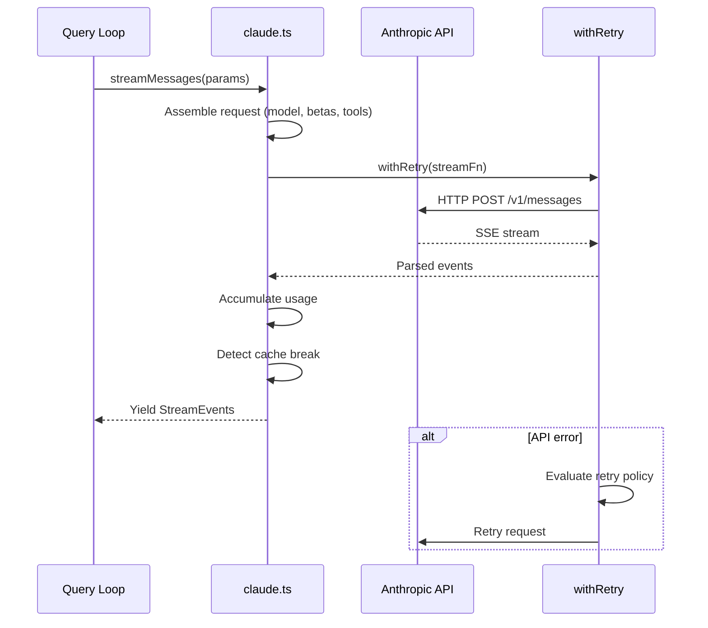
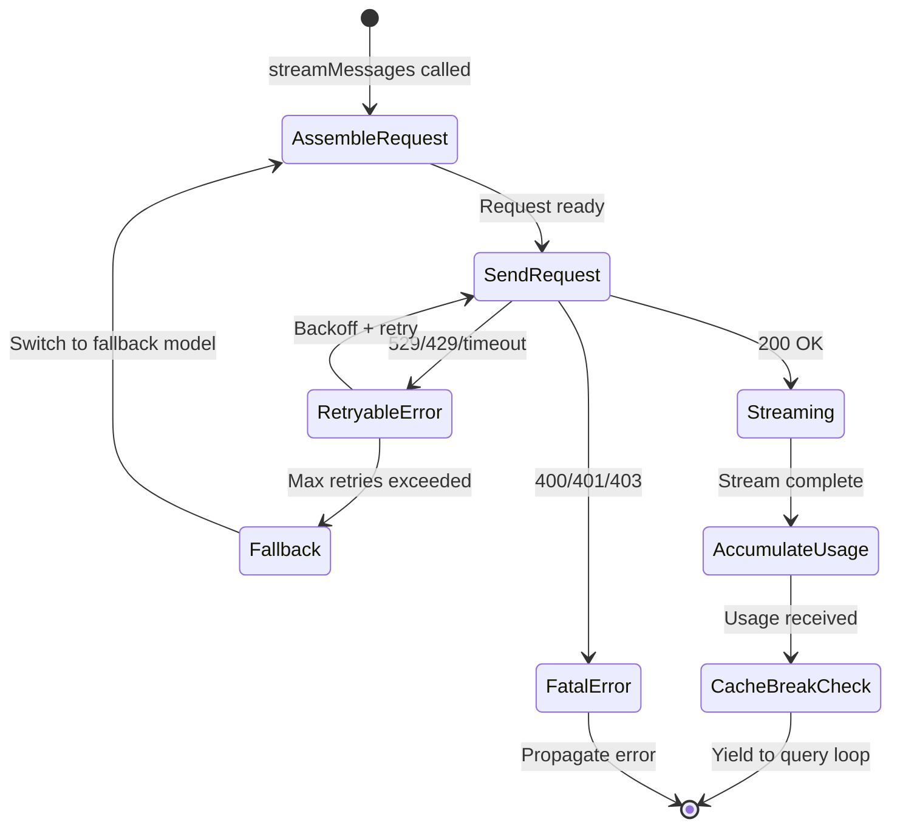

# Diagrams Audit: Chapter 8 — Talking to Anthropic: Streaming

## Diagram Extraction

### Diagram 1: Streaming request lifecycle (line ~96)

- **Type**: sequenceDiagram — valid
- **Nodes/Actors**: 4 (QL, Claude, API, Retry) — ≥ 3, not trivial
- **Edge operators**: `->>`, `-->>` — valid for sequenceDiagram
- **Balanced brackets**: Yes
- **No Unicode arrows or smart quotes**: Yes
- **Verdict**: VALID, USEFUL

### Diagram 2: Request lifecycle with fallback (line ~155)

- **Type**: stateDiagram-v2 — valid
- **Nodes/Actors**: 6 (AssembleRequest, SendRequest, Streaming, RetryableError, FatalError, AccumulateUsage, CacheBreakCheck, Fallback) — ≥ 3, not trivial
- **Edge operators**: `-->` — valid for stateDiagram-v2
- **Balanced brackets**: Yes
- **No Unicode arrows or smart quotes**: Yes
- **Verdict**: VALID, USEFUL

## Summary

- Total diagrams: 2
- Required minimum: 2 (brief requires 3: (a) sequenceDiagram of streaming request with retry, (b) stateDiagram-v2 of request lifecycle including fallback, (c) flowchart of usage accounting and cost hooks)
- Diagram (c) flowchart of usage accounting and cost hooks: **MISSING**
- Invalid diagrams: 0
- Trivial diagrams: 0
