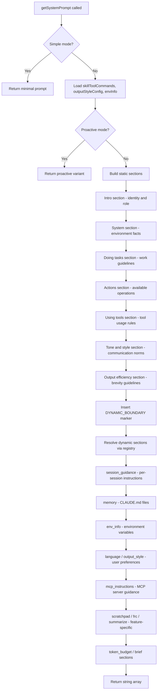
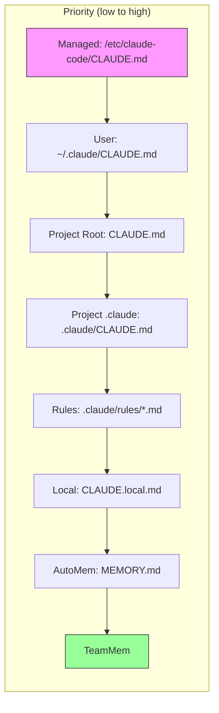

# Diagrams Audit: Chapter 9 — System Prompts and Prompt Assembly

## Diagram Extraction

### Diagram 1: Prompt Assembly Layers (flowchart)

- Type: flowchart — valid
- Nodes: 24 (A through X) — non-trivial
- Edge operators: `-->` — valid for flowchart
- Balanced brackets: yes
- No Unicode arrows or smart quotes
- **Verdict: valid, useful**

### Diagram 2: CLAUDE.md Loading Hierarchy (flowchart BT)

- Type: flowchart — valid
- Nodes: 8 (A through H) — non-trivial
- Edge operators: `-->` — valid for flowchart
- Balanced brackets: yes
- No Unicode arrows or smart quotes
- **Verdict: valid, useful**

## Summary

- Diagram count: 2
- Required diagrams: 2 (brief requires "(a) flowchart of prompt assembly layers" and "(b) classDiagram of prompt fragment sources")
- Invalid indices: none
- Trivial indices: none
- Type breakdown: flowchart: 2, sequenceDiagram: 0, stateDiagram-v2: 0, classDiagram: 0, erDiagram: 0

## Note

The brief requires a "(b) classDiagram of prompt fragment sources" but the chapter provides a flowchart instead. The flowchart effectively shows the same information (the loading hierarchy) but in a different diagram type than specified. This is a minor mismatch — the content is covered but the diagram type differs.
