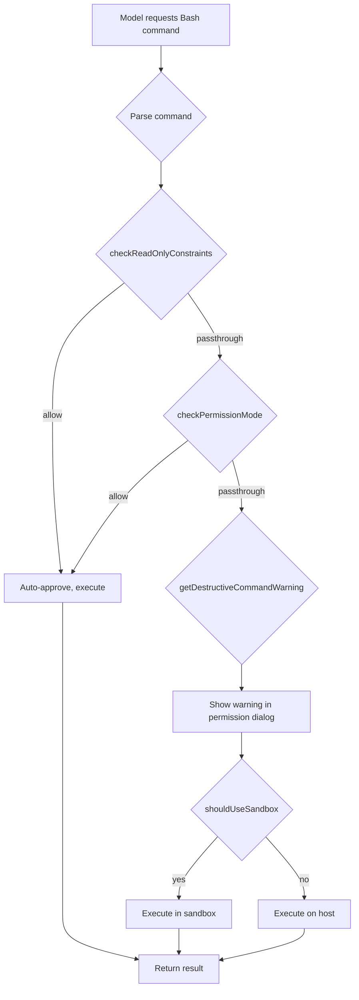
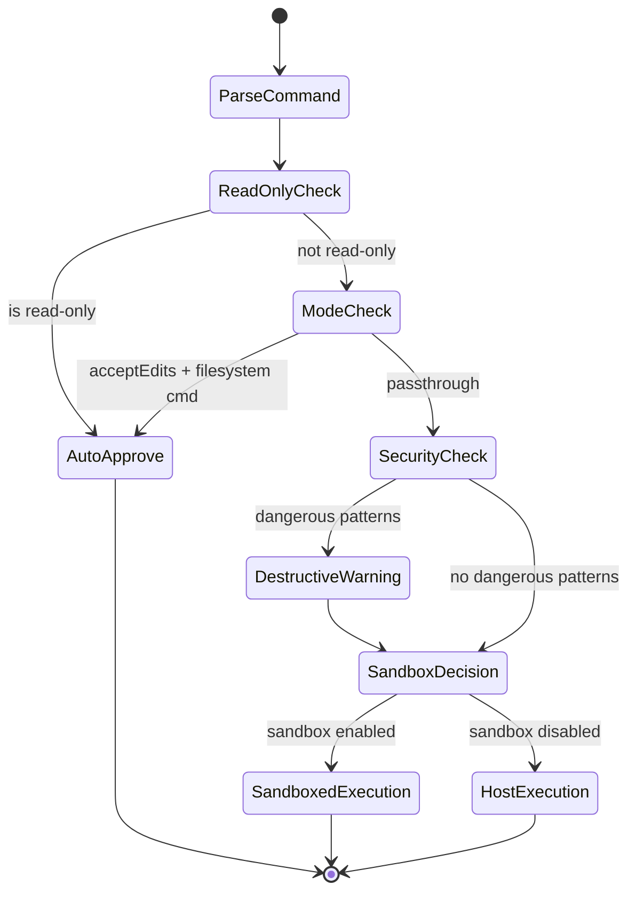

# Diagrams Audit - Chapter 14: The Bash Tool, Classifiers, and Sandboxing

## Extracted Mermaid Diagrams

### Diagram 1: Permission evaluation pipeline (flowchart)

- Type: flowchart - VALID
- Nodes: 11 (A through K) - NOT trivial
- Edge operators: `-->` - VALID for flowchart
- Balanced brackets: YES
- No Unicode arrows or smart quotes: YES

### Diagram 2: State machine (stateDiagram-v2)

- Type: stateDiagram-v2 - VALID
- Nodes: 8 (ParseCommand, ReadOnlyCheck, AutoApprove, ModeCheck, SecurityCheck, DestructiveWarning, SandboxDecision, SandboxedExecution, HostExecution) - NOT trivial
- Edge operators: `-->` - VALID for stateDiagram-v2
- Balanced brackets: YES
- No Unicode arrows or smart quotes: YES

## Required Diagrams from Brief
1. (a) flowchart of a Bash command's risk classification - FOUND (Diagram 1)
2. (b) classDiagram of the classifier pipeline - NOT FOUND
3. (c) stateDiagram-v2 for sandbox / permission decisions - FOUND (Diagram 2)

## Summary
- Total diagrams: 2
- Minimum required: 2
- Brief required: 3
- Invalid: 0
- Trivial: 0
- Missing mandated diagram: classDiagram of the classifier pipeline (b)
